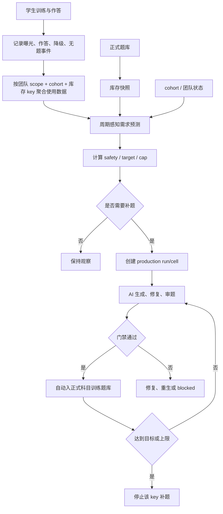

# 科目训练周期感知预测补题架构方案

日期：2026-07-10

关联文档：

- `docs/adaptive-training-predictive-replenishment-executable-plan-2026-07-09.md`
- `docs/adaptive-training-predictive-replenishment-phase-0-1-work-orders-2026-07-09.md`
- `docs/subject-practice-production-matrix-executable-plan-2026-07-09.md`
- `docs/subject-practice-one-click-production-completion-loop-2026-07-09.md`
- `docs/ai-gateway-monitoring-design-2026-07-09.md`

## 1. 核心结论

科目训练全自动补题不应被设计成“题被做过就继续生成新题”的无限增长系统。

正确模型是：

```text
长期正式题库
+ 当前活跃学习周期的临时库存压力
+ 全体学生使用趋势
+ 团队/班级/机构的集中学习压力
+ 单用户抽题去重压力
-> 预测哪些库存 key 需要补题
-> 自动创建科目训练生产 run
-> 通过门禁后自动入正式科目训练题库
-> 达到周期目标或全局上限后停止
```

其中：

- 全局题库长期保留复用。
- 单个学生做过某题，只影响该学生后续抽题，不直接减少全局库存。
- 团队/班级/机构的使用情况通常比全局更集中，是预测补题的最强业务信号。
- 多个活跃学生，尤其是同一个团队内的多个学生，在同一知识点/难度/题型上出现可用题不足，才说明这个库存池需要补题。
- 补题只围绕当前活跃 cohort / rolling cohort 的学习周期发生。
- 周期结束后，不再因为这批学生的历史使用继续扩库。
- 新生成并通过门禁的题进入长期正式题库，可被后续 cohort 复用。

## 2. 非目标

本方案不做：

- 学生答题时同步等待 AI 生成。
- 每个学生独立维护一套题库。
- 因题目被使用过就从全局库存扣除。
- 无上限地持续扩充题库。
- 让未通过门禁、需要人工确认、建议重生或渲染异常的题进入正式训练题库。
- 在线模考整卷题库补题。

## 3. 分层模型

### 3.1 长期正式题库

长期正式题库是学生训练唯一可直接消费的题池。

来源可以包括：

- 手工专项题。
- AI 生成并通过科目训练门禁的题。
- 未来外部题源。

长期正式题库不会因为某批学生做过而下线。只有以下情况才清理：

- 题目质量错误。
- 大纲或画像更新后明确不兼容。
- 数学渲染或双语版本不满足当前规则。
- 开发阶段旧机制产物不满足新机制口径。

### 3.2 周期补充题库

周期补充题库不是独立物理题库，而是一种生成策略。

当某个活跃 cohort / rolling cohort 对某些库存 key 产生压力时，系统自动补题。补出的合格题仍进入长期正式题库。

周期补题结束后：

- 不删除这些题。
- 不继续因该 cohort 的历史累计使用而扩库。
- 后续 cohort 可以复用这些题。

### 3.3 团队需求层

团队需求层是全自动补题的主要预测层。

团队可以是：

- 机构班级。
- 老师创建的学习小组。
- 考试冲刺班。
- 企业/学校分配的 cohort。
- 系统为散客创建的 rolling cohort。

团队需求比全局需求更适合驱动补题，因为团队内学习节奏更一致：

- 同一阶段集中学习同一批知识点。
- 作业、训练、测验会集中消耗同一类题。
- 目标考试日期相近。
- 重复曝光和降级抽题会在短时间内集中出现。

因此补题判断优先级应为：

```text
团队风险 > 全局风险 > 单用户风险
```

全局风险用于维护长期题库健康；团队风险用于判断当前周期是否需要临时补充；单用户风险用于抽题去重和记录缺题事件。

### 3.4 单用户可用题

单用户可用题用于抽题，不用于直接判断全局题库是否缺题。

```text
userAvailableStock =
  formalQuestions(key)
  - questionsAttemptedByThisUser(key)
  - questionsRecentlyExposedToThisUser(key)
  - questionsBlockedByPersonalization(key)
```

当某个用户可用题不足时，学生端应先降级抽题，并记录缺题事件。只有同一团队内大量活跃用户都出现同类压力，或全局长期库存已经低于安全线时，才触发补题。

## 4. 学习周期模型

### 4.1 Cohort 周期

Cohort 是补题预测的主要周期单位。

可以来自：

- 机构班级。
- 考试批次。
- 管理员创建的学习批次。
- 系统自动创建的 rolling cohort。

Cohort 既可以代表全局滚动自学周期，也可以代表明确团队周期。明确团队周期优先级高于 rolling cohort。

建议字段：

```text
id
name
subjectScope
organizationId
teamId
classId
startAt
targetExamAt
endAt
status: active | cooling_down | inactive | completed | archived
source: manual | organization_class | rolling
metadata
```

### 4.2 Rolling Cohort

没有明确班级的自学用户，放入 rolling cohort。

推荐规则：

```text
subject + targetExamMonth
```

如果没有目标考试日期：

```text
subject + firstActiveMonth
```

默认周期：

```text
cycleLengthDays = 90
coolingDownDays = 14
inactiveAfterDays = 30
```

示例：

```text
math-self-study-2026-07
chemistry-self-study-2026-Q3
physics-exam-2026-10
```

### 4.3 单用户周期

单用户周期服务于个性化抽题和学习状态，不直接创建大规模补题计划。

建议字段：

```text
userId
subject
cohortId
studentCycleStartAt
lastActiveAt
targetExamAt
phase: diagnostic | foundation | strengthening | sprint | review | inactive
completedTopicIds
attemptedQuestionIds
recentExposureQuestionIds
```

### 4.4 周期结束判断

Cohort 进入结束流程的条件：

```text
cohort.status IN completed / archived
OR now > cohort.endAt
OR now > targetExamAt + graceDays
```

没有明确日期时，使用活跃度：

```text
last14dActiveUsers < peakActiveUsers * 0.1
AND last14dAttempts < minAttemptThreshold
```

满足活跃结束条件后先进入：

```text
cooling_down
```

冷却期内：

- 不创建低优先级预测补题。
- 只响应学生端严重缺题事件。
- 如果活跃度恢复，则回到 `active`。

冷却期结束后：

```text
status = inactive
```

`inactive/completed/archived` cohort 不再驱动自动补题。

## 5. 库存 Key

第一版库存 key：

```text
subject + topicId + difficultyBand + questionType
```

第二版增强：

```text
subject + topicId + difficultyBand + questionType + cognitiveSkill
```

不建议第一版就把 `readingLoad`、`calculationLoad`、`language` 全部放进主 key，否则库存会被切得太碎，导致系统误判大量缺题。

这些字段第一版作为诊断维度：

```text
cognitiveSkill
questionForm
readingLoad
calculationLoad
language
sourceKind
```

## 6. 库存统计口径

### 6.1 全局有效库存

```text
globalEffectiveStock(key)
```

只统计正式可训练题：

- 已发布/active 的 `special_practice_questions`。
- AI 题必须已通过科目训练门禁。
- 不包括在线模考题。
- 不包括候选题。
- 不包括失败、需人工确认、建议重生、已归档题。
- 不包括 smoke/fallback/旧机制测试题。

### 6.2 Cohort 压力

```text
cohortDemandPressure(cohortId, key)
```

来自当前活跃周期内的全体学生使用情况：

- 最近 1 天、7 天、14 天抽题次数。
- 最近 1 天、7 天、14 天作答次数。
- 活跃学生数。
- 每个学生平均已做过该 key 下多少题。
- 重复曝光率。
- 降级抽题次数。
- 题目不存在或抽题失败次数。

### 6.3 团队压力

```text
teamDemandPressure(teamScope, key)
```

团队压力用于识别某个机构、班级或学习小组在当前周期内的集中用题压力。

`teamScope` 可以是：

```text
organizationId
classId
teamId
cohortId
```

第一版可以统一映射到 `cohortId`，但响应和后台展示应保留团队来源字段，方便管理员知道是哪一组学生触发了补题。

团队压力输入：

- 团队活跃学生数。
- 团队最近 1 天、7 天、14 天该 key 的作答量。
- 团队未来学习计划中的 topic 阶段。
- 团队目标考试日期。
- 团队内低可用题学生比例。
- 团队重复曝光率。
- 团队降级抽题次数。
- 团队无题事件次数。

建议计算：

```text
teamLowAvailabilityRate =
  teamLowAvailabilityUserCount / teamActiveUserCount

teamDemandVelocity =
  max(teamLast1dAttempts, teamLast7dAttempts / 7)

teamPressureScore =
  teamLowAvailabilityRate * 40
  + normalized(teamDemandVelocity) * 25
  + repeatExposureRate * 15
  + fallbackDrawCount * 10
  + noQuestionErrorCount * 20
  + upcomingAssignmentWeight
```

团队触发阈值：

```text
teamActiveUserCount >= 5
AND (
  teamLowAvailabilityRate >= 0.25
  OR teamPressureScore >= 60
  OR noQuestionErrorCount > 0
  OR fallbackDrawCount >= hardThreshold
)
```

团队压力高于全局压力。也就是说，即使全平台库存看起来充足，只要某个活跃团队在当前周期内集中消耗并出现低可用压力，也可以为该团队创建补题计划；但补出的题仍进入长期正式题库，后续团队可复用。

### 6.4 单用户可用性压力

```text
userCoveragePressure(cohortId, key)
```

统计当前 cohort 内，有多少活跃学生对该 key 的可用题不足。

建议第一版：

```text
userLowAvailabilityCount =
  count(active users where userAvailableStock(key) < userMinAvailableStock)

userCoveragePressure =
  userLowAvailabilityCount / activeUserCount
```

触发阈值：

```text
userCoveragePressure >= 0.25
AND activeUserCount >= 5
```

这表示不是一个学生缺题，而是一批学生都快遇到重复或降级问题。

如果该批学生属于明确团队，则这项指标应同时写入团队压力：

```text
teamUserCoveragePressure(teamScope, key)
```

## 7. 何时判断需要补题

### 7.1 巡检频率

第一版推荐：

```text
每 1 小时：增量巡检 active cohort 的高风险 key
每天 02:00：全量库存快照和预测
学生端缺题事件：实时记录，异步提升风险
```

### 7.2 触发条件

只对 `active` cohort 创建常规补题计划。

满足任一条件可触发：

```text
globalEffectiveStock(key) < safetyStock(key)
projectedDaysToSafety(key) <= 7
teamDemandPressure(teamScope, key) >= threshold
teamUserCoveragePressure(teamScope, key) >= threshold
userCoveragePressure(key) >= threshold
repeatExposureRate(key) >= threshold
fallbackDrawCount(key, last7d) > 0
noQuestionErrorCount(key, last7d) > 0
difficultyQuotaShortage(key) = true
```

`cooling_down` cohort 只允许严重事件触发：

```text
noQuestionErrorCount > 0
OR fallbackDrawCount >= hardThreshold
```

`inactive/completed/archived` cohort 不触发。

### 7.3 需求预测

第一版不需要机器学习，用规则预测：

```text
forecastDemand7d =
  last7dAttemptCount * demandWeight
  + teamPressureScore * teamWeight
  + activeUserCount * expectedQuestionsPerUserForKey
  + fallbackDrawCount * fallbackPenalty
  + noQuestionErrorCount * missingQuestionPenalty
```

预测消耗速度：

```text
dailyDemand = max(last7dAttempts / 7, last1dAttempts)
projectedDaysToSafety =
  (globalEffectiveStock - safetyStock) / max(dailyDemand, 1)
```

如果存在明确团队周期，应优先计算团队预测：

```text
teamForecastDemand7d =
  teamLast7dAttempts * demandWeight
  + teamActiveUserCount * expectedQuestionsPerUserForKey
  + teamLowAvailabilityUserCount * lowAvailabilityPenalty
  + upcomingAssignmentDemand
  + fallbackDrawCount * fallbackPenalty
  + noQuestionErrorCount * missingQuestionPenalty
```

最终预测取：

```text
forecastDemand7d =
  max(globalForecastDemand7d, teamForecastDemand7d)
```

这样可以避免全局平均值掩盖某个班级的集中缺题风险。

## 8. 补题目标如何界定

### 8.1 三个库存值

每个库存 key 同时有三个目标：

```text
baseStockTarget      长期基础库存目标
safetyStock          安全库存线
cycleTargetStock     当前周期目标库存
maxStockCap          最大库存上限
```

关系：

```text
safetyStock <= cycleTargetStock <= maxStockCap
baseStockTarget <= maxStockCap
```

### 8.2 第一版默认值

| 难度 | baseStockTarget | safetyStock | cycleTargetStock | maxStockCap |
| --- | ---: | ---: | ---: | ---: |
| basic | 30 | 24 | 45 | 60 |
| medium | 30 | 24 | 45 | 60 |
| hard | 20 | 15 | 30 | 45 |
| challenge | 8 | 6 | 12 | 20 |

说明：

- `baseStockTarget` 是长期题库基础丰富度。
- `cycleTargetStock` 是活跃周期内的补题目标。
- `maxStockCap` 防止无限增长。
- 不支持 challenge 的知识点不创建 challenge key。

### 8.3 按活跃周期动态调整

如果 cohort 很小，按默认目标即可。

如果 cohort 或明确团队活跃人数较多，允许增加周期缓冲，但不能超过 `maxStockCap`。

```text
activeCycleBuffer =
  ceil(activeUserCount * expectedKeyDemandPerUser * reusePressureFactor)

teamCycleBuffer =
  ceil(teamActiveUserCount * expectedKeyDemandPerUser * teamPressureFactor)

cycleTargetStock =
  min(
    maxStockCap,
    max(
      defaultCycleTargetStock,
      safetyStock + activeCycleBuffer,
      safetyStock + teamCycleBuffer
    )
  )
```

第一版建议 `expectedKeyDemandPerUser` 保守取值：

| 难度 | expectedKeyDemandPerUser |
| --- | ---: |
| basic | 0.2 |
| medium | 0.25 |
| hard | 0.15 |
| challenge | 0.05 |

团队缓冲建议第一版使用：

```text
teamPressureFactor =
  1.0 when teamPressureScore < 60
  1.5 when teamPressureScore >= 60
  2.0 when noQuestionErrorCount > 0
```

团队补题仍必须受 `maxStockCap` 约束。即使一个团队短期压力很高，也不能让某个库存 key 无限增长；达到上限后只能通过抽题降级、复用策略、人工处理或扩展相近 topic 来兜底。

### 8.4 补题数量

```text
requiredPublishedCount =
  max(0, cycleTargetStock - globalEffectiveStock)
```

补题完成标准：

```text
新增且通过门禁并入库的正式题 >= requiredPublishedCount
```

不是：

- 候选题数量达标。
- AI 调用完成。
- 生成任务成功。
- 人工确认题数量。

### 8.5 候选预算

候选预算用于控制 AI 生成次数。它不是补题目标，补题目标仍然只看“正式入库且通过门禁”的题数。

```text
candidateLimit =
  min(
    120,
    max(
      12,
      neededCount * 6,
      targetCount * 2
    )
  )
```

其中：

- `neededCount` 是当前 cell 还差多少道正式入库题。
- `targetCount` 是当前 cell 的目标正式入库题数。
- `12` 是最小候选缓冲，避免 hard/medium 严格门禁下刚开始就被候选上限卡住。
- `120` 是单 cell 硬上限，避免生成机制异常时无限堆候选。

如果候选预算耗尽仍未达标，进入 `blocked/candidate_limit_reached` 或 `blocked/no_progress`，不能无限继续生成。处理方式不是降低门禁，而是查看异常候选原因：能修复的进入候选治理，不能修复的拒绝/归档后再继续补题。

## 9. 难度配额

科目训练补题不能只看总题数，必须按难度独立达标。

每个 topic 至少创建：

```text
basic
medium
hard
```

是否创建 `challenge` 由大纲和产品策略决定。

触发和完成都按难度独立判断：

```text
math + topic_637 + basic + single_choice
math + topic_637 + medium + single_choice
math + topic_637 + hard + single_choice
```

这样避免出现：

```text
总题量足够，但 hard 没题
```

## 10. 补题计划

### 10.1 计划字段

建议补题计划可以复用现有 `csca_subject_practice_production_runs/cells`，但需要补充预测上下文。

如果继续扩展现有表，`run.plan` 中至少包含：

```json
{
  "triggerType": "scheduled_prediction",
  "cohortId": 12,
  "cycleStatus": "active",
  "forecastWindow": "7d",
  "policyVersion": "cycle-aware-replenishment-v1",
  "createdBy": "system",
  "riskSummary": {
    "critical": 2,
    "high": 8,
    "normal": 20
  }
}
```

每个 cell 的 `targetProfile` / metadata 至少包含：

```json
{
  "inventoryKey": "math:637:medium:single_choice",
  "cohortId": 12,
  "teamScope": {
    "organizationId": 3,
    "classId": 18,
    "teamId": null,
    "source": "organization_class"
  },
  "globalEffectiveStock": 18,
  "safetyStock": 24,
  "cycleTargetStock": 45,
  "maxStockCap": 60,
  "requiredPublishedCount": 27,
  "candidateBudget": 81,
  "triggerReasons": [
    "below_safety_stock",
    "high_user_coverage_pressure"
  ],
  "forecast": {
    "last7dAttempts": 320,
    "activeUsers": 48,
    "teamActiveUsers": 32,
    "teamPressureScore": 68,
    "teamLowAvailabilityRate": 0.34,
    "userCoveragePressure": 0.31,
    "projectedDaysToSafety": 3.5
  }
}
```

### 10.2 去重创建

系统创建补题计划前必须检查：

```text
是否存在同 subject/topic/difficulty/questionType 的 planned/running cell
```

如果存在，不重复创建。

如果已有 run blocked，需要：

- 查看 blocker 是否仍然存在。
- 如果 blocker 已解除，可以恢复 run。
- 如果 blocker 未解除，不创建新 run。

### 10.3 触发类型

```text
manual
scheduled_prediction
daily_full_scan
usage_spike
low_stock
fallback_draw
no_question_error
admin_recovery
```

全自动补题主要使用：

```text
scheduled_prediction
daily_full_scan
usage_spike
low_stock
fallback_draw
no_question_error
```

## 11. 自动执行闭环

生产 run 创建后，执行逻辑复用科目训练生产矩阵 runner。

状态流：

```text
planned
-> running
-> completed
```

或：

```text
running
-> blocked
```

自动 runner 每轮做：

1. 刷新 cell 当前正式库存。
2. 跳过已达标 cell。
3. 按风险优先级选择 cell。
4. 创建有限数量 generation jobs。
5. 处理候选审题。
6. 可修复题原题修复。
7. 硬伤题重新生成。
8. 通过门禁后自动入库。
9. 刷新 cell 进度。
10. 全部 cell 达标后 run completed。

停止条件：

```text
全部 cell 达标
candidateBudget 耗尽
连续 N 轮无新增合格题
Gateway 预算耗尽
Provider 失败率过高
缺大纲/画像/蓝图配置
达到 maxStockCap
cohort 进入 inactive/completed/archived
```

## 12. 学生端抽题与反哺

学生端永远不等待 AI 生成。

抽题流程：

```text
精准 key 抽题
-> 排除该用户已做和近期曝光题
-> 若不足，放宽近期曝光限制
-> 若仍不足，同 topic 相邻难度
-> 若仍不足，相近 topic
-> 若仍不足，记录 no_question_error
```

每次降级都记录事件：

```text
fallback_draw
```

每次无法抽题记录事件：

```text
no_question_error
```

这些事件不会同步生成题，但会提升下一轮预测补题优先级。

## 13. 数据结构建议

### 13.1 Cohort 表

如果现有机构/班级模型已能表达 cohort，可优先扩展现有表；否则新增：

```text
csca_learning_cohorts
```

字段：

```text
id
name
subject
source
status
start_at
target_exam_at
end_at
cooling_started_at
inactive_at
metadata
created_at
updated_at
```

### 13.2 用户周期表

```text
csca_student_learning_cycles
```

字段：

```text
id
user_id
cohort_id
subject
phase
started_at
last_active_at
target_exam_at
completed_topic_ids
metadata
created_at
updated_at
```

### 13.3 使用聚合表

```text
csca_adaptive_usage_aggregates
```

字段：

```text
id
cohort_id
organization_id
class_id
team_id
subject
topic_id
difficulty_band
question_type
window_start
window_end
exposure_count
attempt_count
unique_user_count
correct_count
wrong_count
repeat_exposure_count
fallback_draw_count
no_question_error_count
average_response_time_ms
created_at
updated_at
```

### 13.4 库存快照表

```text
csca_adaptive_inventory_snapshots
```

字段：

```text
id
cohort_id
organization_id
class_id
team_id
subject
topic_id
difficulty_band
question_type
global_effective_stock
manual_stock
ai_formal_stock
candidate_count
failed_count
safety_stock
cycle_target_stock
max_stock_cap
required_published_count
active_user_count
team_active_user_count
user_low_availability_count
team_low_availability_user_count
user_coverage_pressure
team_user_coverage_pressure
team_pressure_score
projected_days_to_safety
risk_level
risk_reasons
snapshot_at
metadata
```

### 13.5 缺题事件表

```text
csca_adaptive_inventory_events
```

字段：

```text
id
user_id
cohort_id
organization_id
class_id
team_id
subject
topic_id
difficulty_band
question_type
event_type: fallback_draw | no_question_error | repeated_exposure | low_user_available_stock
question_id
metadata
created_at
```

## 14. 服务拆分

建议新增或拆分以下服务：

```text
LearningCohortService
TeamDemandScopeService
StudentCycleService
AdaptiveUsageAggregateService
InventorySnapshotService
CycleAwareDemandForecastService
SafetyStockPolicyService
ReplenishmentPlannerService
ReplenishmentSchedulerService
StudentQuestionAvailabilityService
```

职责：

- `LearningCohortService`：判断 cohort active/cooling/inactive。
- `TeamDemandScopeService`：把机构、班级、学习小组映射为可预测的团队需求范围，并处理团队周期优先级。
- `StudentCycleService`：维护学生当前学习周期和阶段。
- `AdaptiveUsageAggregateService`：聚合作答、曝光、降级、缺题事件。
- `InventorySnapshotService`：计算正式库存、候选、失败、已入库数量。
- `CycleAwareDemandForecastService`：计算预测需求和风险。
- `SafetyStockPolicyService`：计算 safety/target/cap。
- `ReplenishmentPlannerService`：创建 production run/cell。
- `ReplenishmentSchedulerService`：定时巡检并推进 run。
- `StudentQuestionAvailabilityService`：为学生端抽题提供去重和降级策略。

## 15. API 设计

管理端：

```text
GET  /api/v1/admin/adaptive-replenishment/cohorts
GET  /api/v1/admin/adaptive-replenishment/team-scopes
POST /api/v1/admin/adaptive-replenishment/cohorts/:id/recompute
GET  /api/v1/admin/adaptive-replenishment/inventory
GET  /api/v1/admin/adaptive-replenishment/inventory/:key
GET  /api/v1/admin/adaptive-replenishment/events
GET  /api/v1/admin/adaptive-replenishment/plans
POST /api/v1/admin/adaptive-replenishment/plans
POST /api/v1/admin/adaptive-replenishment/plans/:id/pause
POST /api/v1/admin/adaptive-replenishment/plans/:id/resume
```

内部调度：

```text
POST /internal/adaptive-replenishment/hourly-scan
POST /internal/adaptive-replenishment/daily-full-scan
POST /internal/adaptive-replenishment/process-runs
```

学生端抽题服务不暴露补题接口，只记录事件。

## 16. 后台界面

AI 题库后台建议增加“预测补题”区块：

### 16.1 Cohort 总览

字段：

- cohort 名称。
- 团队来源：机构/班级/小组/rolling。
- 学科。
- 状态。
- 活跃学生数。
- 周期开始/结束。
- 最近 7 天作答量。
- 风险 key 数。

### 16.2 库存风险表

字段：

- subject/topic/difficulty/questionType。
- 有效库存。
- 安全库存。
- 周期目标。
- 最大上限。
- 预测 7 天需求。
- 团队压力分。
- 团队低可用学生比例。
- 单用户可用性压力。
- 风险原因。
- 当前补题 run。

### 16.3 自动补题计划

字段：

- triggerType。
- cohort。
- 目标 cell 数。
- 已入库数。
- 候选预算消耗。
- blocked 原因。
- Gateway 预算状态。

## 17. 性能与上线控制

全自动预测补题必须按“离线库存系统”实现，不能把预测、聚合、库存快照或补题创建放进学生请求链路。

### 17.1 学生端请求边界

学生训练请求只允许做轻量操作：

```text
查正式题库
排除该用户已做和近期曝光题
必要时降级抽题
记录曝光、作答、降级、无题事件
```

学生请求中禁止：

- 实时扫描全量作答记录。
- 实时计算全局库存风险。
- 实时创建大批 AI 生成任务。
- 同步等待 AI 生成。
- 同步刷新全部库存快照。

如果精准题不足，学生端只记录事件并走降级策略；补题由后台异步处理。

### 17.2 数据库压力控制

预测补题只读聚合表和快照表，不直接扫原始大表。

必须落地：

- 使用聚合表：按 `teamScope + cohort + subject + topic + difficulty + questionType + window` 汇总。
- 库存快照表：按库存 key 保存有效库存、安全线、目标库存、风险级别。
- 增量刷新：高风险 key 可更频繁刷新，低风险 key 低频刷新。
- 分区或按日期索引：作答、曝光、库存事件应按时间可快速过滤。
- 清理策略：原始事件长期归档，聚合结果保留更久。

推荐刷新频率：

```text
学生事件写入：实时轻量 insert
使用聚合：每 15-60 分钟增量
库存快照：每 1 小时增量
每日全量校准：凌晨低峰
```

### 17.3 后台页面压力控制

预测补题看板必须分页、筛选和懒加载。

后台页面禁止：

- 首屏加载所有学科、所有团队、所有 topic、所有库存 key。
- 打开页面时触发全量库存重算。
- 打开页面时触发自动补题。

后台页面必须支持：

- 按学科过滤。
- 按团队/班级/cohort 过滤。
- 按风险等级过滤。
- 分页加载库存 key。
- 单个 key 或单个团队手动刷新。
- 默认只加载 summary 和 top risks。

### 17.4 自动补题限流

自动补题必须有硬限流。

建议第一版默认：

```text
每次 scheduler tick 最多处理 2 个 run
每个 run 每轮最多创建 3-6 个 generation jobs
每个库存 key 每天最多创建 1 个 active run
同一 subject/topic/difficulty/questionType 不允许并行多个 running run
normal 风险默认不自动生成，只展示预警
```

风险自动化权限：

| 风险级别 | 自动创建 run | 自动处理 run | 默认策略 |
| --- | --- | --- | --- |
| critical | 是 | 是 | 立即补题 |
| high | 是 | 是 | 低峰或限流补题 |
| normal | 否 | 否 | 只预警 |
| low | 否 | 否 | 不处理 |

### 17.5 Gateway 与成本保护

预测补题必须接入 AI Gateway 的约束：

- Provider 并发上限。
- Key 并发上限。
- 每小时调用预算。
- 每日调用预算。
- 成本预算。
- 失败率熔断。
- 超时退避。
- Key 冷却。

自动暂停条件：

```text
providerFailureRate > threshold
providerTimeoutRate > threshold
dailyBudgetUsed >= dailyBudgetLimit
keyCooldownActive = true
candidatePassRate below threshold for N rounds
```

暂停后：

- 不继续创建新候选。
- 已 running job 可按安全策略完成或停止。
- run 标记为 `paused_by_gateway_budget` 或 `paused_by_provider_health`。
- 后台展示暂停原因和恢复条件。

### 17.6 上线放量策略

不能一步到位开启全自动。必须分阶段放量：

```text
只读观察
-> 半自动确认
-> critical 自动
-> 团队自动
-> rolling cohort 自动
-> 全平台自动
```

阶段定义：

| 阶段 | 自动创建 run | 自动执行 run | 范围 |
| --- | --- | --- | --- |
| read_only | 否 | 否 | 只计算库存和风险 |
| semi_auto | 否 | 管理员确认后执行 | 管理员选择风险 key |
| critical_auto | 是 | 是 | 只处理 critical |
| team_auto | 是 | 是 | 明确班级/团队 |
| rolling_auto | 是 | 是 | 自学 rolling cohort |
| full_auto | 是 | 是 | 全量策略 |

每个阶段都必须有回滚开关：

```text
feature.adaptiveReplenishment.readOnly
feature.adaptiveReplenishment.autoCreateRuns
feature.adaptiveReplenishment.autoProcessRuns
feature.adaptiveReplenishment.teamAuto
feature.adaptiveReplenishment.rollingAuto
```

### 17.7 性能验收

上线前必须验证：

- 学生训练接口 P95 不因预测补题增加明显延迟。
- 打开 AI 题库后台不触发全量计算。
- 库存看板首屏只加载 summary 和分页 top risks。
- scheduler 单轮耗时可控。
- 数据库慢查询可监控。
- Gateway 预算耗尽后自动暂停。
- Provider 失败率高时不会继续堆任务。

## 18. 执行阶段

### Phase 0：口径统一

目标：

- 明确正式题库库存口径。
- 明确 AI 已入库题、手工题、候选题、失败题边界。
- 明确在线模考题不参与科目训练库存。

产出：

- `InventorySnapshotService` 初版。
- 管理后台只读库存表。

### Phase 1：周期模型

目标：

- 引入 cohort / rolling cohort。
- 引入团队需求范围：organization/class/team。
- 引入 student learning cycle。
- 能判断 active/cooling_down/inactive。

产出：

- cohort 数据表或现有班级模型扩展。
- 团队 scope 到 cohort 的映射规则。
- 用户周期归属逻辑。

### Phase 2：使用聚合

目标：

- 聚合全体学生使用趋势。
- 记录抽题降级和无题事件。
- 避免预测流程直接扫描原始作答大表。

产出：

- 使用聚合表。
- 库存事件表。
- 增量聚合任务。

### Phase 3：风险评分和目标库存

目标：

- 计算 safetyStock、cycleTargetStock、maxStockCap。
- 计算 userCoveragePressure 和 projectedDaysToSafety。
- 只读展示风险，不自动创建 run。

产出：

- 风险看板。
- 不自动生成，只预警。

### Phase 4：自动创建生产 run

目标：

- active cohort 的高风险 key 自动创建 production run/cell。
- 去重 planned/running run。
- 不超过 maxStockCap。
- 只允许 critical/high 风险进入自动创建。

产出：

- `scheduled_prediction` / `usage_spike` / `low_stock` 触发。
- feature flag 控制自动创建。

### Phase 5：自动推进与停止

目标：

- 自动推进 run 到 completed/blocked。
- 接入 Gateway 并发和预算限制。
- 避免无限生成。
- Provider 不稳定或预算耗尽时自动暂停。

产出：

- 全自动闭环。
- Gateway 熔断和恢复策略。

### Phase 6：学生端降级与反哺

目标：

- 学生端不再因局部缺题中断。
- 缺题事件反哺预测补题。

产出：

- 抽题降级策略。
- 事件追踪。

## 19. 验收标准

### 19.1 不无限增长

- inactive/completed cohort 不触发预测补题。
- 达到 `maxStockCap` 后不继续生成。
- 候选预算耗尽后不继续堆候选。
- blocked run 不重复创建同类 run。

### 19.2 补题时机正确

- 低于安全库存会创建补题计划。
- projectedDaysToSafety 小于阈值会创建补题计划。
- 明确团队内出现集中学习压力时，即使全局平均压力不高，也能创建补题计划。
- 团队周期结束后，该团队不再驱动低优先级预测补题。
- 大量活跃学生 userAvailableStock 不足会创建补题计划。
- 单个学生可用题不足不会单独触发大规模补题。

### 19.3 目标正确

- 按 subject/topic/difficulty/questionType 独立计算目标。
- basic/medium/hard 不互相抵扣。
- 总题量够但 hard 缺题时仍会补 hard。
- 已达到 maxStockCap 时不再补。

### 19.4 学生体验正确

- 学生训练不等待 AI 生成。
- 已做题优先规避。
- 库存不足时能降级抽题。
- 降级和无题事件会被记录。

### 19.5 质量正确

- 只有门禁通过题自动入库。
- 需要人工确认题不自动入库。
- 建议重生题不自动入库。
- 数学渲染异常题不自动入库。
- 在线模考候选不进入科目训练库存。

## 20. 与现有实现的关系

现有代码已经有：

- AI 生成队列。
- 科目训练 production run/cell。
- 门禁通过后自动入 `special_practice_questions`。
- Gateway 监控、成本、Key、并发基础。

本方案不重写这些能力，而是在其上新增：

```text
cohort 周期判断
团队/班级/机构需求范围
-> 学生使用聚合
-> 库存快照
-> 风险评分
-> 自动创建 production run
-> 自动推进与停止
```

也就是说，现有 production run 是“补题执行器”，本方案新增的是“何时启动执行器、启动多少、何时停止”的预测调度层。

## 21. 第一批开发任务

1. 新增或扩展 cohort 模型，支持 active/cooling_down/inactive。
2. 新增团队需求范围映射，支持 organization/class/team/rolling cohort。
3. 新增用户学习周期归属逻辑。
4. 新增库存快照服务，只读统计正式题库。
5. 新增使用聚合服务，按团队 scope + 库存 key 汇总最近 1d/7d/14d。
6. 新增学生端缺题事件记录，并写入团队 scope。
7. 新增 safety/target/cap 策略函数，加入 teamCycleBuffer。
8. 新增风险评分函数，加入 teamPressureScore。
9. 新增预测补题只读看板，展示团队压力和全局压力。
10. 增加后台看板分页、筛选和懒加载，禁止首屏全量计算。
11. 新增自动创建 production run 的 scheduler。
12. 将 created run 交给现有 subject practice production runner 自动推进。
13. 接入 Gateway 并发、预算、失败率熔断和暂停原因。
14. 增加 feature flags，支持 read_only / semi_auto / critical_auto / team_auto 分阶段放量。
15. 增加验收脚本，验证不无限增长、按难度补齐、inactive cohort 不补题、团队集中压力可触发补题。
16. 增加性能验收，验证学生端请求不做预测计算、后台首屏不触发全量重算、Gateway 预算耗尽会暂停。

## 22. 最终流程



## 23. 结论

科目训练全自动补题的关键，不是让 AI 永远生成更多题，而是让系统知道：

```text
当前哪批学生还在学习
他们整体在哪些知识点和难度上产生真实库存压力
当前正式题库还能支撑多久
补到多少就应该停
什么时候该停止为这批学生继续扩库
```

这套架构把“学生个性化去重”和“全局题库扩容”分开，把“活跃学习周期”和“长期题库复用”分开，能避免无限增长，同时保证学生规模扩大后不会因为局部缺题中断训练。

## 24. 2026-07-10 当前落地状态

本轮已经把方案从文档推进到可运行主路径：

1. 数据层已新增预测补题基础表：
   - `csca_learning_cohorts`
   - `csca_student_learning_cycles`
   - `csca_adaptive_usage_aggregates`
   - `csca_adaptive_inventory_snapshots`
   - `csca_adaptive_inventory_events`

2. 使用聚合已经接入自适应训练记录：
   - 全局维度：按 subject/topic/difficulty/questionType 聚合最近窗口的曝光、作答、正确、错误、重复曝光。
   - 团队维度：从 `organization_members` 关联 active 组织/班级，写入 organization/cohort/teamKey 聚合。
   - 个人维度：写入 user 级聚合，用于识别单个学生在某知识点上反复遇题或可用题偏低的压力。
   - 学习周期：刷新聚合时会自动维护 `csca_student_learning_cycles` 的 active 周期和最近活跃时间。
   - 团队周期：刷新聚合时会自动维护组织/班级 scope 的 `csca_learning_cohorts`，已有 active/cooling cohort 会被续活，没有记录时会创建 active `organization_cohort` 记录。
   - 缺题事件：学生端创建自适应训练轮时，如果计划题位无法凑齐，会写入 `csca_adaptive_inventory_events`，并在刷新聚合时计入 `noQuestionErrorCount`。

3. 库存快照已经接入后台库存服务：
   - 按 topic × difficulty × questionType 统计手工题、AI 正式题、候选题、失败题和使用压力。
   - 手工题库存会排除已经由 AI 正式题发布到 `special_practice_questions` 的桥接题，避免同一道 AI 题同时计入 `manualStock` 和 `aiFormalStock`。
   - 支持保存 `csca_adaptive_inventory_snapshots`，用于后续排查“为什么补题/为什么没有补题”。
   - 读取库存时避免把全局、团队、个人三层聚合重复相加。

4. 预测补题已经接入科目训练 production run：
   - 先刷新最近使用聚合。
   - 再根据全局、团队、个人三层压力选择 demand topic。
   - 对有真实压力且仍存在正式库存缺口的 topic 创建科目训练 production run。
   - 预测补题会把库存快照里的 `cycleTargetStock` 按 topic/difficulty 传入 production run，production cell 的完成线以该难度目标为准，而不是普通健康检查的低目标。
   - 如果某个库存 key 已经达到 `maxStockCap`，即使近期有使用压力，也不会再为该 key 创建新的预测补题 cell。
   - 如果团队学习 cohort 已经进入 `inactive` / `completed` / `archived`，该组织/班级 scope 的团队压力不会再进入预测需求计算；学生个人近期真实缺题仍可按个人压力独立触发，避免牺牲个体体验。
   - 如果团队学习 cohort 处于 `cooling` / `cooling_down`，普通曝光、作答人数和尝试量不会触发扩库；只有 `noQuestionErrorCount > 0` 或 `fallbackDrawCount >= 3` 这类严重库存事件才允许进入预测需求。
   - 库存事件聚合时，纯团队事件不会被混入全局压力；只有真实学生端事件（带 `userId`）才能同时贡献个人/全局压力，避免 inactive 团队通过全局聚合绕过周期状态。
   - 每次刷新使用聚合会把 `endAt` 已过或 `targetExamAt + 14 天宽限期` 已过的 active/cooling 团队 cohort 自动置为 `inactive`，让团队学习周期在代码里真正参与停止补题。
   - production run 继续复用现有的知识点/难度矩阵、候选治理、门禁、正式入库闭环。
   - 后台启动与 5 分钟定时器会自动触发预测补题。
   - 预测补题和后台生产 runner 默认按 `untilComplete` 语义推进：不是只追加一批候选，而是围绕 production cell 的目标数量继续生成、修复、门禁和入库，直到完成或连续无进展阻塞。
   - 预测补题接口、定时预测补题和后台 production runner 的默认推进轮数已统一到 10 轮、上限 20 轮，避免手动或接口触发时只处理一小轮就停止。
   - 连续无新增合格入库题会累计 no-progress，达到 run 的 `maxNoProgressRounds` 后自动阻塞，避免候选题无限增长。
   - 每个 production cell 的候选预算已经显式化：`min(120, max(12, neededCount * 6, targetCount * 2))`。候选预算随剩余缺口计算，但有硬上限，防止严格门禁失败时无限堆候选。

5. 管理后台已经接入预测库存：
   - 科目训练生产面板展示预测库存缺口、严重/预警 cell、正式库存和目标缺口。
   - 支持刷新预测、触发预测补题、创建生产计划、处理一轮和继续直到完成。

6. 已新增静态验收脚本：
   - 命令：`npm run csca-adaptive:predictive-replenishment-rules`
   - 覆盖：数据库表/迁移、学生端缺题事件、全局/团队/个人聚合、库存快照、预测 run、后台接口、前端入口。
   - 作用：防止后续改动把预测补题闭环拆断。

7. 已新增真实数据库 smoke：
   - 命令：`npm run csca-adaptive:predictive-replenishment-smoke`
   - 不调用真实 AI Provider，不消耗 DeepSeek key。
   - 自动创建临时学生、组织、班级、大纲、知识点、画像、蓝图和缺题事件。
   - 验证链路：低强度自适应训练记录 -> 个人 cycle / 团队 cohort 自动维护；缺题事件 -> 使用聚合 -> 预测库存快照 -> 预测补题 -> 科目训练 production run/cell。
   - 验证重点：只有真实库存压力才触发补题，且创建出来的 production cell 覆盖 basic/medium/hard。
   - 验证不无限增长：
     - smoke 会先创建完整大纲、画像和蓝图，但不写入任何缺题/使用压力事件。
     - 在这个无压力阶段，即使库存低于目标，也必须返回 `skip/no_recent_usage_pressure`。
     - 无压力阶段不能创建任何 `csca_subject_practice_production_runs`。
     - 90 天前等已过期缺题事件不能进入 30 天当前窗口的 usage aggregate，也不能触发新的预测补题 run；历史事件只保留作审计，不作为当前学习周期的扩库压力。
     - 已过考试宽限期的 active 团队 cohort 必须在刷新时转为 inactive。
     - cooling 团队 cohort 的普通团队使用压力必须被忽略，不能单独创建 production run。
     - cooling 团队 cohort 出现严重无题压力时必须仍可创建 production run，避免学生端体验被周期边界误伤。
     - inactive 团队的纯团队级缺题事件必须只保留审计/团队聚合，不能绕过周期状态变成全局补题压力。
     - 已结束团队 cohort 的团队聚合压力必须被忽略，不能单独创建 production run。
     - 只有写入缺题事件并刷新聚合后，预测补题才允许创建 production run。
     - 当各 difficulty 的 `cycleTargetStock` 已经被正式入库题填满后，即使缺题事件仍在窗口内，预测补题也必须跳过，不能创建第二个 production run。
   - 验证 production run 生命周期：
     - run 创建后如果没有正式入库题，不能被标记为 completed。
     - 连续一轮无新增合格入库题且达到 `maxNoProgressRounds` 时，run 必须进入 `blocked/no_progress`，防止无限堆候选。
     - 只有每个 difficulty cell 的正式入库题数都达到 `targetCount`，run 才能 completed。
     - completed 以 `csca_questions` + `special_practice_questions` 的正式可训练库存为准，不以候选题、生成任务或人工确认题计数。
     - production cell 的 `candidateLimit` 必须由目标缺口推导并受 120 硬上限约束，防止候选池失控。
     - smoke 会构造 basic/medium/hard 三类正式题，验证达标后所有 cell 都变为 `fulfilled`，且 `publishedTotal = targetTotal`。
     - smoke 会在完成后重新读取库存，验证 AI 入库题只计入 `aiFormalStock`，不会被重复计入 `manualStock`。
     - smoke 会在达标后再次触发预测补题，验证系统继续跳过、`requiredPublishedCount = 0`，且该 subject 的 production run 数量不会增加。
   - 默认跑完会删除临时数据；如需人工排查可加 `--keep-fixture` 保留测试数据。

8. 开发阶段的数据口径：
   - 以新机制能闭环为目标，不再迁就旧机制生成的候选题、旧 AI 题或旧 production run。
   - 如果旧题缺少双语 metadata、数学渲染不合格、画像维度不完整、门禁口径不一致，应作为开发残留清理。
   - 正式上线后再补独立的数据保留/迁移策略；当前开发阶段优先保持干净架构和可验证闭环。

当前仍属于下一阶段增强，但不阻塞开发阶段主路径：

- fallback 抽题事件可以继续细分记录；当前已覆盖“完整训练轮无法凑齐”的无题事件。
- 团队 cohort 的生命周期自动结束策略可以继续细化，例如按团队连续 N 天无活跃、课程结束时间、考试时间进入 cooling。
- 预测看板可以继续增加团队筛选器和按 teamKey 的风险排行。
- 真实数据库 smoke 后续还可以继续扩展：无压力不增长、门禁不过不入库、周期结束后不继续补题、团队集中压力优先级高于全局冷启动。
