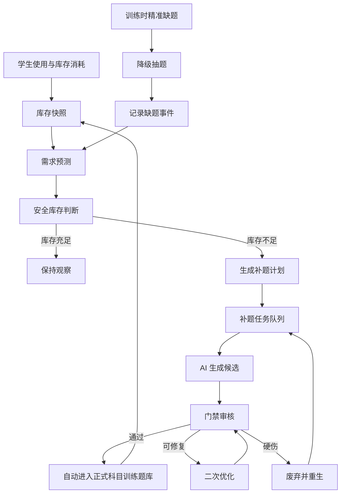

# 自适应训练题库预测补题执行方案

日期：2026-07-09

状态：已退役 / Superseded

本文件保留为历史背景和早期设计参考，不再作为科目训练全自动预测补题的执行基准。

新的执行基准为：

- `docs/adaptive-training-cycle-aware-predictive-replenishment-architecture-2026-07-10.md`

退役原因：

- 本文件没有完整纳入 cohort / rolling cohort 学习周期。
- 没有明确区分“全局题库库存”和“单用户可用题”。
- 没有明确周期结束后停止补题。
- 没有把 `maxStockCap` 作为防止无限扩库的硬约束。
- 没有把“补题只是当前活跃学习周期的临时库存补充”作为核心原则。

后续开发、排期、验收和架构讨论均应以 2026-07-10 周期感知方案为准；本文件中仍可复用的库存快照、任务队列、服务拆分等内容，需要按新方案重新校准后再执行。

## 1. 背景与目标

当前科目训练/自适应训练已经可以使用 AI 生成题，但如果等到学生训练时才发现某个知识点、难度或题型没有可用题，再临时补题，会产生两个问题：

1. 学生会直接遇到“题目不存在”或抽题失败。
2. 当学生量增加后，实时补题无法承受并发，也无法保证生成质量和响应时间。

因此，自适应训练的补题机制应从“缺了再补”升级为“预测需求、提前备货、实时兜底”。

目标：

- 学生训练流程不等待 AI 生成。
- 正式题池只进入通过门禁的题。
- 系统持续预测各知识点、难度和题型的可用题量风险。
- 在低于安全库存前自动生成、优化、审核并入库。
- 临时缺题只作为异常兜底，并立即触发高优先级补题任务。

## 2. 范围

本方案主要覆盖科目训练/自适应训练题库。

包括：

- 科目专项题库。
- 科目训练 AI 题库。
- 自适应训练抽题库存。
- 学生使用数据驱动的预测补题。
- 管理后台库存、风险、任务状态展示。

不包括：

- 在线模考整卷装配逻辑。
- 手工在线模考题库维护。
- 真题 JSON 解析流程本身。

但本方案会复用以下能力：

- 大纲基线。
- 真题画像/真题风格画像。
- AI 生成候选题。
- 门禁审核。
- 可修复问题的二次优化。
- 合格题自动入库。

## 3. 核心原则

### 3.1 训练不等待生成

学生进入训练时，抽题服务只能从已经可用的正式题池中取题。

如果精准匹配库存不足，应使用降级抽题策略，而不是同步等待 AI 生成。

### 3.2 正式题池只收合格题

AI 题必须通过门禁后才能进入正式科目训练题库。

以下状态不能进入正式题池：

- 建议重生。
- 需要人工确认。
- 复审失败。
- 无英文版本且要求双语。
- 数学渲染异常。
- 与真题或已有题过度相似。
- 知识点、难度、题型、能力维度不匹配。

### 3.3 预测补题为主

系统应根据历史使用、近期活跃、学生掌握度、错题热点和库存消耗速度提前补题。

实时补题只能作为兜底信号，不应该成为主流程。

### 3.4 题库渠道共存

科目训练正式题库可以由多个渠道进入：

- 手工专项题。
- AI 生成并门禁通过的题。
- 未来可能引入的外部题源。

不同渠道可以共存，但进入正式训练前必须统一经过可用性校验。

## 4. 库存口径

### 4.1 库存维度

自适应训练的题库库存不应只按“知识点数量”统计，而应按以下维度建立库存 key：

```text
subject
topicId / topicCode
difficultyBand
questionType
cognitiveSkill
questionForm
readingLoad
calculationLoad
language
sourceKind
status
```

推荐最小库存 key：

```text
subject + topicId + difficultyBand + questionType
```

增强库存 key：

```text
subject + topicId + difficultyBand + questionType + cognitiveSkill + language
```

### 4.2 可用库存

可用库存不是数据库里的题目总数，而是当前可被训练抽取的有效题量。

```text
effectiveStock =
  formalPublishedQuestions
  - archivedQuestions
  - obsoleteQuestions
  - qualityDegradedQuestions
  - overExposedQuestions
  - recentlyUsedByTargetUser
  - reservedQuestions
```

说明：

- `formalPublishedQuestions`：正式入库并可用于科目训练的题。
- `overExposedQuestions`：曝光过高，短期内不应继续使用。
- `qualityDegradedQuestions`：学生数据反馈异常，如高争议、异常错误率、投诉、答案疑似错误。
- `reservedQuestions`：可预留给测评、阶段诊断或特定训练模式。

### 4.3 异常候选不算库存

以下题不计入可用库存：

- AI 候选题。
- 待审核题。
- 需要人工确认题。
- 建议重生题。
- 修复中题。
- 复审失败题。
- 仅用于在线模考候选的题。

## 5. 需求预测

### 5.1 输入数据

预测补题应读取以下数据：

- 最近 1 小时、24 小时、7 天的题目消耗量。
- 当前在线学生数。
- 当前活跃训练会话数。
- 各知识点掌握度分布。
- 各知识点错题率。
- 各知识点复习需求。
- 各难度段题目消耗速度。
- 当前库存水位。
- 题目曝光次数。
- 题目质量降级数量。
- AI 生成成功率和门禁通过率。

### 5.2 预测公式

初版可以使用规则模型，不需要一开始就引入复杂机器学习。

```text
forecastDemand(key, horizon) =
  recentUsageRate(key) * horizon * seasonalityFactor * growthFactor
  + masteryGapDemand(key)
  + remediationDemand(key)
  + activeSessionDemand(key)
```

字段解释：

- `recentUsageRate`：近期该库存 key 的题目消耗速度。
- `horizon`：预测窗口，建议先用 24 小时和 7 天。
- `seasonalityFactor`：时段系数，例如晚间训练高峰。
- `growthFactor`：学生增长或活动带来的流量放大。
- `masteryGapDemand`：学生掌握度薄弱导致的预期训练需求。
- `remediationDemand`：错题、复习、AI Coach 推荐导致的补救训练需求。
- `activeSessionDemand`：当前正在训练的学生短期可能消耗的题。

### 5.3 热点识别

满足任一条件的库存 key 进入热点池：

- 24 小时消耗量进入同科目前 20%。
- 当前活跃训练会话正在大量使用。
- 错题率高且复习需求高。
- 掌握度低的学生集中分布。
- 库存水位低于安全线。

热点池补题优先级高于普通库存。

## 6. 安全库存

### 6.1 默认安全线

建议初始安全库存如下：

| 难度 | 默认安全库存 | 预测系数 |
| --- | ---: | ---: |
| basic | max(30, 24h 预测需求 * 2) | 2.0 |
| medium | max(30, 24h 预测需求 * 2) | 2.0 |
| hard | max(15, 24h 预测需求 * 1.5) | 1.5 |
| challenge | max(8, 24h 预测需求 * 1.0) | 1.0 |

热点知识点可以乘以 1.5 到 3.0 的热点系数。

### 6.2 库存状态

每个库存 key 应有以下状态：

| 状态 | 含义 |
| --- | --- |
| healthy | 高于安全库存 |
| warning | 接近安全库存 |
| shortage | 低于安全库存 |
| critical | 当前训练可能受影响 |
| blocked | 无法补题，需要人工处理配置或上游数据 |

### 6.3 补题目标

补题不是补到刚好够用，而是补到目标库存。

```text
targetStock = max(safetyStock, forecastDemand(7d) * reserveFactor)
gap = targetStock - effectiveStock
```

只有 `gap > 0` 时才创建补题计划。

## 7. 触发机制

### 7.1 定时预测补题

建议每 30 到 60 分钟执行一次。

流程：

1. 统计当前库存。
2. 计算预测需求。
3. 计算安全线和缺口。
4. 按优先级生成补题计划。
5. 将补题计划拆成 AI 生成任务。
6. 任务通过门禁后自动进入正式科目训练题库。

### 7.2 每日全量巡检

建议每天低峰期执行。

职责：

- 重新计算所有知识点库存。
- 清理过期、低质量、旧机制生成的题。
- 检查难度分布是否失衡。
- 检查中等题和高难题是否长期不足。
- 生成第二天的预备补题计划。

### 7.3 训练时兜底

学生训练时如果精准库存不足：

1. 不等待 AI。
2. 按降级策略抽取可用题。
3. 记录 `runtime_shortage_event`。
4. 将该库存 key 提升为高优先级补题。

降级策略顺序：

1. 同知识点、相邻难度。
2. 同知识点、相近题型。
3. 同模块兄弟知识点。
4. 同能力维度的替代题。
5. 最后使用诊断型兜底题。

### 7.4 管理后台手动触发

管理员可以手动触发：

- 单知识点补题。
- 单难度补题。
- 单科目补题。
- 热点知识点补题。
- 清理旧机制题后重新补题。

但手动触发仍应走统一门禁和入库流程。

## 8. 补题任务队列

### 8.1 队列优先级

补题任务优先级建议按以下因素计算：

```text
priority =
  shortageSeverity
  + hotnessScore
  + activeSessionScore
  + qualityRiskScore
  + failedRetryAgeScore
```

高优先级示例：

- 当前训练已出现缺题。
- 热点知识点低于安全库存。
- 中等/高难题长期不足。
- 某个知识点正式题全部质量降级。

低优先级示例：

- 普通知识点库存略低。
- 仅为 7 天储备扩容。
- 非活跃科目或非热点模块。

### 8.2 并发控制

初版可使用数据库任务表和后台 worker。

推荐策略：

- 每个科目限制并发。
- 每个 Provider 限制并发。
- 每个知识点限制并发。
- 全局限制 AI 生成并发。

后续如果部署多 worker，可以引入 Redis / BullMQ。

在没有 Redis 前，不应阻塞方案落地；可以先用数据库锁和任务状态推进。

### 8.3 任务状态

推荐状态：

| 状态 | 含义 |
| --- | --- |
| planned | 已生成补题计划 |
| queued | 已排队 |
| running | 生成中 |
| reviewing | 门禁审核中 |
| repairing | 可修复问题优化中 |
| passed | 已通过门禁 |
| published | 已入正式题库 |
| failed | 当前题失败 |
| exhausted | 达到重试上限 |
| blocked | 配置或上游数据缺失 |
| cancelled | 被清理或取消 |

## 9. 生成、优化、入库闭环

### 9.1 标准流程

```text
库存缺口
  -> 创建补题计划
  -> 创建 AI 生成任务
  -> 生成候选题
  -> 门禁审核
  -> 可修复则优化
  -> 不可修复则重生
  -> 门禁通过
  -> 自动入正式科目训练题库
  -> 更新库存快照
  -> 判断是否达到目标库存
```

### 9.2 可修复问题

以下问题优先原题优化，而不是直接重生：

- 选项过近。
- 干扰项质量不足。
- 解析不够清晰。
- 正确答案标记错误，但题目本身可成立。
- 多个正确答案，但可以通过修改选项修复。
- 英文版本缺失。
- 数学符号格式可修复。
- 表述不够贴近真题风格。

### 9.3 不可修复问题

以下问题应直接废弃并重生：

- 知识点不匹配。
- 难度严重不匹配。
- 题型不匹配。
- 与真题或已有题过度相似。
- 题干泄露答案。
- 题目本身不可成立。
- 依赖不存在的图像或上下文。
- 大纲或真题画像缺失导致目标画像不可用。

### 9.4 停止条件

补题循环不应无限生成。

停止条件：

- `effectiveStock >= targetStock`。
- 达到单次计划最大生成量。
- 达到 Provider 预算。
- 连续失败率超过阈值。
- 上游数据缺失或配置错误。

如果停止时仍未达到目标库存，应进入 `blocked` 或 `needs_attention`，并在后台展示原因。

## 10. 与大纲和真题画像的关系

### 10.1 大纲是硬约束

科目训练补题必须绑定大纲知识点。

大纲提供：

- 知识点范围。
- 难度层级。
- 能力要求。
- 题型要求。
- 训练覆盖结构。

没有大纲时，不应进入正式 AI 补题流程。

### 10.2 真题画像是风格与分布参考

真题画像用于提升生成质量：

- 题目风格。
- 难度分布。
- 计算负荷。
- 阅读负荷。
- 常见考法。
- 选项干扰方式。
- 真题相似度控制。

有真题画像时，应优先使用真题画像。

没有真题画像时，可以有两种策略：

1. 默认禁止高置信 AI 入库，只允许管理员显式开启“大纲-only 低置信生成”。
2. 允许生成候选，但必须标记低置信，并提高门禁要求。

建议开发阶段采用第一种，避免低质量题进入正式题库。

## 11. 管理后台设计

### 11.1 库存总览

后台应在候选题列表上方展示正式库存。

推荐顺序：

1. 已入库/可装配 AI 题。
2. 库存风险与预测缺口。
3. 正在运行的补题任务。
4. 未入库异常候选。
5. 质量治理。

这样管理员先看到“当前是否够用”，再处理“为什么不够”。

### 11.2 库存看板字段

每个知识点/库存 key 展示：

- 当前可用库存。
- 安全库存。
- 目标库存。
- 预测 24h 需求。
- 预测 7d 需求。
- 今日消耗。
- 曝光过高题数。
- 质量降级题数。
- 正在生成题数。
- 通过门禁题数。
- 失败题数。
- 最近失败原因。

### 11.3 风险标签

推荐标签：

- 即将耗尽。
- 已低于安全线。
- 热点知识点。
- 中等题不足。
- 高难题不足。
- 曝光过高。
- 质量降级。
- 缺少真题画像。
- 缺少英文版本。
- Provider 异常。

### 11.4 管理动作

推荐动作：

- 立即补题。
- 暂停该知识点生成。
- 清理旧机制 AI 题。
- 清理未入库异常候选。
- 重算库存。
- 导出库存 CSV。
- 查看失败原因。
- 查看学生消耗趋势。

## 12. 数据结构建议

### 12.1 库存快照表

建议新增：

```text
adaptive_question_inventory_snapshots
```

核心字段：

```text
id
subject
topic_id
topic_code
difficulty_band
question_type
cognitive_skill
language
effective_stock
formal_stock
overexposed_count
quality_degraded_count
reserved_count
safety_stock
target_stock
forecast_24h
forecast_7d
status
created_at
```

### 12.2 补题计划表

建议新增：

```text
adaptive_question_replenishment_plans
```

核心字段：

```text
id
subject
topic_id
topic_code
difficulty_band
question_type
target_stock
effective_stock_before
gap
priority
reason
status
created_at
updated_at
```

### 12.3 补题任务表

可以新增：

```text
adaptive_question_replenishment_jobs
```

也可以复用现有 AI 生成任务表，并增加以下 metadata：

```json
{
  "targetUseCase": "subject_practice",
  "generationMode": "adaptive_inventory_replenishment",
  "inventoryKey": {
    "subject": "math",
    "topicId": "...",
    "difficultyBand": "medium",
    "questionType": "single_choice"
  },
  "planId": "...",
  "targetStock": 30,
  "effectiveStockBefore": 12
}
```

### 12.4 运行时缺题事件表

建议新增：

```text
adaptive_training_shortage_events
```

核心字段：

```text
id
user_id
session_id
subject
topic_id
difficulty_band
question_type
requested_key
fallback_key
fallback_used
created_at
```

该表用于预测模型和热点识别。

## 13. 服务拆分建议

建议拆成以下服务：

```text
InventorySnapshotService
ForecastDemandService
SafetyStockPolicyService
ReplenishmentPlannerService
ReplenishmentQueueService
QuestionGenerationOrchestrator
QuestionRepairService
QuestionPublishService
TrainingFallbackService
```

职责：

- `InventorySnapshotService`：统计正式题库存。
- `ForecastDemandService`：预测未来需求。
- `SafetyStockPolicyService`：计算安全线和目标库存。
- `ReplenishmentPlannerService`：生成补题计划。
- `ReplenishmentQueueService`：排队和并发控制。
- `QuestionGenerationOrchestrator`：调用 AI 生成。
- `QuestionRepairService`：处理可修复问题。
- `QuestionPublishService`：门禁通过后入库。
- `TrainingFallbackService`：训练时缺题兜底。

## 14. 实施顺序

### Phase 0：统一口径

目标：先把“什么是可用库存”算准确。

任务：

- 定义正式科目训练题库口径。
- 定义 AI 候选、异常候选、已入库题的状态边界。
- 清理旧机制下不符合当前门禁的 AI 题。
- 增加库存快照接口。
- 后台展示已入库题在候选题上方。

验收：

- 后台能看到每个科目/知识点/难度的正式可用题量。
- 候选题不再被误认为库存。
- 旧机制不合格题不会进入正式训练抽题。

### Phase 1：安全库存与预警

目标：先做预警，不自动生成。

任务：

- 按库存 key 计算安全库存。
- 标记 healthy/warning/shortage/critical。
- 后台展示风险标签。
- 支持手动触发补题。

验收：

- 能看出哪些知识点即将缺题。
- 中等题、高难题不足能被单独识别。
- 管理员可以按风险补题。

### Phase 2：预测补题计划

目标：系统自动生成补题计划。

任务：

- 引入 24h 和 7d 预测需求。
- 生成 `replenishment_plan`。
- 根据优先级排队。
- 增加补题预算和并发限制。

验收：

- 系统能自动识别热点和缺口。
- 补题任务不是简单平均生成，而是按需求排序。

### Phase 3：自动生成、优化、入库

目标：补题闭环自动跑完。

任务：

- 生成候选题。
- 门禁审核。
- 可修复问题自动优化。
- 不可修复问题废弃并重生。
- 通过后自动进入正式科目训练题库。
- 达到目标库存后停止。

验收：

- 系统能自动补足一个库存 key。
- 正式入库题必须是门禁通过题。
- 不会无限生成异常候选。

### Phase 4：训练时兜底与反馈

目标：学生侧永不因局部缺题阻断训练。

任务：

- 抽题时增加降级策略。
- 记录缺题事件。
- 缺题事件反哺预测补题。
- 曝光、正确率、争议反馈进入质量治理。

验收：

- 精准库存不足时，训练仍可继续。
- 后台能看到真实缺题事件。
- 缺题事件能提升补题优先级。

### Phase 5：并发与成本优化

目标：支持更多学生和更多科目。

任务：

- 引入多 worker。
- 可选接入 Redis/BullMQ。
- Provider 并发限流。
- Token 预算控制。
- 热点预生成。
- 非热点低峰生成。

验收：

- 多任务并发不会互相卡死。
- Provider 异常不会造成任务永久 running。
- 预算耗尽时能暂停低优先级补题。

## 15. 验收标准

### 15.1 学生侧

- 学生进入训练不再因为单个知识点缺题而失败。
- 抽题接口不等待 AI 生成。
- 缺题时有可解释的降级抽题。

### 15.2 管理后台

- 已入库题展示在候选题上方。
- 候选题只展示未入库异常候选。
- 每个知识点能看到库存、安全线、预测需求和缺口。
- 能看到补题任务状态和失败原因。

### 15.3 AI 生成

- 通过门禁的题自动入库。
- 需要人工确认的题不自动入库。
- 建议重生的题不自动入库。
- 可修复问题优先优化。
- 不可修复问题直接废弃并重生。

### 15.4 库存质量

- basic、medium、hard 不应长期只生成 basic。
- 中等题和高难题必须有独立库存水位。
- 题目曝光过高后不继续作为优先抽题。
- 质量异常题能退出有效库存。

## 16. 风险与处理

### 16.1 过度生成

风险：AI 成本上升，候选题堆积。

处理：

- 设置每日预算。
- 设置每个库存 key 的最大目标库存。
- 达到目标库存立即停止。
- 候选异常过多时暂停该 key 并提示原因。

### 16.2 质量漂移

风险：大量生成但都不合格。

处理：

- 按失败原因分类。
- 可修复问题走优化。
- 硬伤问题重生。
- 连续失败后阻断该 key。
- 将失败原因反馈到提示词和画像映射。

### 16.3 真题画像缺失

风险：生成风格不稳定。

处理：

- 有画像时使用画像。
- 无画像时默认不进入高置信自动入库。
- 允许管理员显式开启大纲-only 低置信生成。
- 后台明确提示缺少画像。

### 16.4 难度失衡

风险：系统大量生成基础题，中等和高难题不足。

处理：

- 安全库存按难度独立计算。
- 生成任务必须带目标难度。
- 门禁校验实际难度。
- 学生表现反向修正经验难度。

## 17. 关键开放决策

需要产品/开发确认：

1. 没有真题画像时，是否允许科目训练大纲-only 自动入库。
2. 每个科目每日 AI 生成预算。
3. 默认安全库存数值。
4. medium/hard/challenge 的最低库存比例。
5. 运行时兜底允许跨多远的知识点。
6. 是否需要按学校、班级或学生分层预测。
7. 是否要在第一期引入 Redis/BullMQ，还是先使用数据库队列。

## 18. 第一批可执行任务

建议按以下顺序开工：

1. 实现科目训练正式库存快照。
2. 后台将“已入库/可装配 AI 题”移动到候选题上方。
3. 区分“正式库存”和“异常候选”。
4. 增加库存 key 和安全库存计算。
5. 增加缺口计划生成。
6. 补题任务接入现有 AI 生成和门禁。
7. 通过门禁后自动入库。
8. 未达目标库存时继续补题。
9. 训练抽题增加缺题事件记录。
10. 后台增加库存风险看板。

## 19. 最终流程图



## 20. 结论

自适应训练的 AI 补题不应被设计成学生触发后的实时生成，而应是一个持续运行的题库库存系统。

正确闭环是：

```text
预测需求 -> 计算安全库存 -> 提前补题 -> 门禁通过 -> 自动入库 -> 学生消耗 -> 再预测
```

这样才能在学生规模扩大后，既保证训练不中断，也保证题库质量持续可控。
