# CSCAlite AI 出题完整现状与目标架构 - 2026-08-10

## 1. 文档目的

本文档统一描述 CSCAlite AI 出题系统：

- 已经存在并运行的代码与数据结构；
- 已部分落地、仍处于 shadow/audit/单科灰度的能力；
- 已形成明确方案但尚未实现的近期机制；
- 未来独立产品化、Agent 接入和多实例扩展方向。

范围不仅包括“调用模型生成题目”，还包括生成前的内容事实、画像、策略、需求预测、生产矩阵，生成中的任务调度、Provider admission、结构化计划，生成后的自动审题、确定性校验、发布、学生消费、质量反馈、版本治理和外部集成。

## 2. 状态图例

| 标记 | 含义 |
|---|---|
| `LIVE` | 已有代码，并有实际运行或正式业务路径 |
| `PARTIAL` | 已有部分代码，但只覆盖部分学科、audit/shadow、observation 或有限灰度 |
| `PLANNED` | 已完成架构设计，尚未进入正式实现或生产 |
| `FUTURE` | 中长期扩展，需要满足触发条件后建设 |
| `BOUNDARY` | 必须长期守住的产品或质量边界 |

Mermaid 图中的颜色：

- 绿色：`LIVE`
- 黄色：`PARTIAL`
- 蓝色：`PLANNED`
- 灰色：`FUTURE`
- 红色：`BOUNDARY`

## 3. 一张总图

```mermaid
flowchart TB
    classDef live fill:#dff3e4,stroke:#26734d,color:#102b1d
    classDef partial fill:#fff2cc,stroke:#9a6a00,color:#332500
    classDef planned fill:#dcecff,stroke:#2f6ea3,color:#10283c
    classDef future fill:#eceff1,stroke:#607d8b,color:#263238
    classDef boundary fill:#fde2e2,stroke:#b43a3a,color:#4a1111

    subgraph INPUT["A. 内容事实与版本治理"]
      SYL["LIVE Syllabus / ExamTopic"]:::live
      RES["LIVE Past Paper / ResourceBundle / SourceDocument"]:::live
      SQ["LIVE SourceQuestion + canonical source identity"]:::live
      MAP["LIVE Topic mapping / scope / excluded scope"]:::live
      STYLE["LIVE Source paper style profile"]:::live
      TREND["LIVE Exam-series trend profile"]:::live
      GP["LIVE Current generation profile + freshness"]:::live
      VG["LIVE PolicyVersion / source snapshot / lineage"]:::live
      SYL --> MAP
      RES --> SQ --> MAP
      SQ --> STYLE --> TREND --> GP
      SYL --> GP
      MAP --> GP
      GP --> VG
    end

    subgraph POLICY["B. 题型与学科策略层"]
      REG["PARTIAL Subject Policy Registry"]:::partial
      TF["PARTIAL TaskFamily classifier"]:::partial
      FP["PARTIAL QuestionFingerprint"]:::partial
      DR["PARTIAL DifficultyRubric / EvidenceTarget"]:::partial
      STM["PLANNED SubjectTopicMapping + PlanTemplate compatibility"]:::planned
      BPAT["PARTIAL BannedPattern / current-policy isolation"]:::partial
      DA["PARTIAL DiversityAxes / DiversityWindow"]:::partial
      QP["PARTIAL QuestionPlan / EvidenceSlots shadow MVP"]:::partial
      REG --> TF
      REG --> DR
      TF --> FP --> DA
      REG --> STM --> QP
      BPAT --> QP
      DR --> QP
      DA --> QP
    end

    subgraph DEMAND["C. 需求、库存与双线生产计划"]
      INV["LIVE Formal-pool inventory by subject/topic/difficulty"]:::live
      USE["LIVE Adaptive exposure / usage / mastery / shortage events"]:::live
      COHORT["PARTIAL Cohort / rolling-cycle predictive demand"]:::partial
      MATRIX["LIVE Subject-practice production run + cells"]:::live
      PRED["LIVE/PARTIAL Predictive replenishment runner"]:::partial
      MOCK["LIVE Mock-exam blueprint / slots / generation job"]:::live
      OBS["LIVE Backend-owned bounded observation task"]:::live
      DRAFT["FUTURE Agent/Admin draft production plan"]:::future
      USE --> COHORT --> PRED
      INV --> PRED --> MATRIX
      DRAFT --> MATRIX
      DRAFT --> MOCK
      MATRIX --> OBS
    end

    subgraph ORCH["D. 持久任务、调度与容量准入"]
      TASK["LIVE csca_ai_questioning_tasks"]:::live
      JOB["LIVE csca_ai_generation_jobs"]:::live
      CELLLOCK["LIVE Same-cell active-job exclusion"]:::live
      HB["LIVE Observation owner/token + task/job heartbeat"]:::live
      FIFO["LIVE Single-backend in-memory global/realtime/background FIFO"]:::live
      KEY["LIVE In-process key pool / cooldown / quota / retry"]:::live
      UGW["FUTURE Unified gateway worker / durable admission queue"]:::future
      LEASE["FUTURE Cross-process per-key lease + fencing + shared cooldown"]:::future
      TASK --> JOB --> CELLLOCK
      TASK --> HB
      JOB --> HB
      JOB --> FIFO --> KEY
      UGW --> KEY
      LEASE --> KEY
    end

    subgraph GEN["E. 计划、生成与定向修复"]
      SCH["PARTIAL SchedulerHint / family selection"]:::partial
      PLAN["PARTIAL QuestionPlan builder / prompt contract"]:::partial
      PV["PLANNED Deterministic Plan Validator"]:::planned
      PB["LIVE PromptBuilder + target profile + retry feedback"]:::live
      PG["LIVE Generator Provider"]:::live
      NORM["LIVE Schema normalize / output contract"]:::live
      ROUTE["PARTIAL FailureRouter audit: plan vs render vs delivery"]:::partial
      REPAIR["LIVE/PARTIAL Repair or regenerate with finite budgets"]:::partial
      SCH --> PLAN --> PV
      PV -->|"valid"| PB --> PG --> NORM
      PV -->|"invalid"| ROUTE --> PLAN
      NORM --> ROUTE --> REPAIR --> PB
    end

    subgraph PROVIDER["F. 统一 AI Gateway 与模型"]
      GW["LIVE AI Gateway contract / runtime class / ledger"]:::live
      DS["LIVE DeepSeek OpenAI-compatible provider"]:::live
      MP["FUTURE Multi-provider routing / fallback policy"]:::future
      BYOK["FUTURE Organization BYOK"]:::future
      GW --> DS
      GW --> MP
      GW --> BYOK
    end

    subgraph QUALITY["G. 自动质量、安全与多样性门"]
      SOLVER["PARTIAL Subject deterministic solver/validator"]:::partial
      REVIEW["LIVE AI reviewer + review context"]:::live
      VAL["LIVE Subject validators / scope / format / answer checks"]:::live
      DIFF["PARTIAL Real-difficulty evidence audit"]:::partial
      DIV["PARTIAL Family window / near-duplicate / scheduler adherence"]:::partial
      GATE["LIVE Automatic publication gate"]:::live
      HUMAN["BOUNDARY No required human approval in production path"]:::boundary
      SOLVER --> GATE
      REVIEW --> GATE
      VAL --> GATE
      DIFF --> GATE
      DIV --> GATE
      HUMAN -.-> GATE
    end

    subgraph ASSET["H. 候选、正式资产与版本"]
      CAND["LIVE csca_questions candidate lifecycle"]:::live
      SPUB["LIVE Published subject-practice question + auto-approval metadata"]:::live
      MPUB["LIVE Approved mock-exam candidate / slot assignment"]:::live
      VAR["LIVE/PARTIAL Repair / replacement / variant lineage"]:::partial
      TRANS["PARTIAL Translation / bilingual version gate"]:::partial
      ARCH["LIVE Archive / supersede / current-policy compatibility"]:::live
      CAND --> SPUB
      CAND --> MPUB
      CAND --> VAR
      CAND --> TRANS
      SPUB --> ARCH
      MPUB --> ARCH
    end

    subgraph CONSUME["I. 学生消费与产品体验"]
      ADAPT["LIVE Adaptive practice consumes approved + published only"]:::live
      EXHAUST["LIVE ADAPTIVE_PRACTICE_POOL_EXHAUSTED / replenishing UI"]:::live
      EXAM["LIVE Mock exam assembly consumes qualified slots only"]:::live
      NOWGEN["BOUNDARY Student request does not synchronously generate"]:::boundary
      REALGEN["FUTURE Optional instant generation only after quality/SLA readiness"]:::future
      SPUB --> ADAPT --> EXHAUST
      MPUB --> EXAM
      NOWGEN -.-> ADAPT
      REALGEN -.-> ADAPT
    end

    subgraph FEEDBACK["J. 审计、反馈与持续治理"]
      LEDGER["LIVE Gateway call log / usage ledger / cost evidence"]:::live
      AUDIT["LIVE Production audit / readiness / rollout gate"]:::live
      QAL["PARTIAL Quality audit ledger / sampled calibration"]:::partial
      METRIC["PARTIAL Delivery / Plan / Candidate / Gate four-funnel metrics"]:::partial
      MEM["PARTIAL Family quality memory excluding provider failures"]:::partial
      POOL["LIVE Inventory snapshot / shortage / student exposure feedback"]:::live
      AUDIT --> MEM --> SCH
      QAL --> DR
      LEDGER --> METRIC
      POOL --> PRED
      SPUB --> AUDIT
      MPUB --> AUDIT
    end

    subgraph PRODUCT["K. QuestionOps 独立产品与 Agent 接入"]
      API["FUTURE Stable API-first QuestionOps Core"]:::future
      MCP["FUTURE MCP/App tools: read first, confirmed writes later"]:::future
      SKILL["FUTURE Skill: audit workflow / stop lines / acceptance method"]:::future
      PLUGIN["FUTURE Plugin: Skill + MCP/App packaging"]:::future
      UI["FUTURE Teacher/Ops App UI without mandatory human approval"]:::future
      LMS["FUTURE LMS / school / external question-bank connector"]:::future
      TENANT["FUTURE Multi-tenant auth / quota / billing / audit"]:::future
      API --> MCP --> PLUGIN
      SKILL --> PLUGIN
      API --> UI
      API --> LMS
      TENANT --> API
    end

    VG --> REG
    GP --> MATRIX
    GP --> MOCK
    POLICY --> SCH
    MATRIX --> TASK
    MOCK --> TASK
    OBS --> TASK
    TASK --> SCH
    KEY --> GW
    PG --> GW
    GW --> NORM
    NORM --> CAND
    CAND --> QUALITY
    GATE -->|"publishable"| SPUB
    GATE -->|"mock qualified"| MPUB
    GATE -->|"repair/regenerate"| ROUTE
    API --> TASK
    API --> AUDIT
    SPUB --> API
    MPUB --> API
```

## 4. 内容事实与画像平面

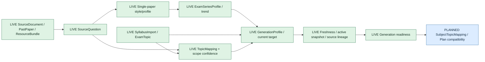

### 4.1 已有事实资产

当前数据模型已经包含：

- `CscaExamTopic`
- `CscaSourceDocument`
- `CscaSourceQuestion`
- `CscaQuestionStyleProfile`
- `CscaExamSeriesProfile`
- `CscaGenerationProfile`
- `CscaSyllabusImport`
- `CscaTopicMapping`
- `PastPaper / PastPaperFile / ResourceBundle / ResourceBundleItem`

### 4.2 长期边界

- Syllabus 是范围基线，真题画像不能使系统越过明确大纲边界。
- Past paper、mock paper、prediction paper 必须严格分源。
- 新 source/profile 产生新版本，不直接改写已发布题目历史事实。
- Generation profile 不完整或 stale 时，自动生产应暂停而不是假运行。
- 新题保存所使用的 source snapshot、profile version 和 policy version。

### 4.3 近期计划

将当前隐含于 target profile、prompt 和 reviewer 中的题型策略进一步抽成：

- `TaskFamily`
- `StemPattern`
- `DifficultyRubric`
- `EvidenceTarget`
- `DiversityAxes`
- `BannedPattern`
- `SubjectTopicMapping`
- `PlanTemplate`
- `PolicyVersion`

## 5. 需求、库存与生产计划平面

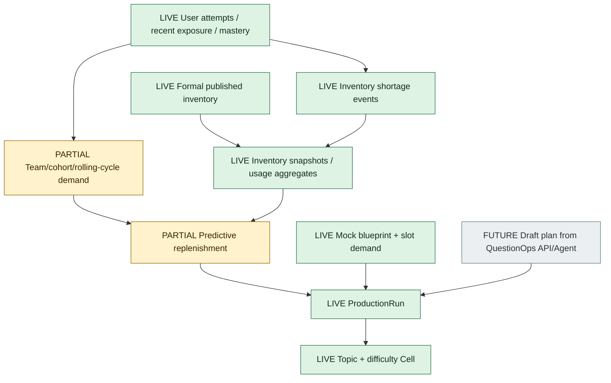

### 5.1 科目训练生产线

现有主链：

```text
formal inventory
  -> topic+difficulty gap
  -> production run
  -> production cell
  -> bounded generation job
  -> automatic gate
  -> published subject-practice pool
```

Run 与 Cell 保存：

- target/published/open 数量；
- candidate limit；
- running/failed 状态；
- target profile；
- failure code/message；
- completion、blocked、terminal incomplete 语义。

### 5.2 预测补题

长期目标使用三层需求：

```text
团队/周期风险 > 全局库存风险 > 单用户可用题风险
```

- 单用户缺题主要影响抽题降级和 shortage event；
- 团队或 cohort 集中压力驱动周期补题；
- 全局库存维护长期正式题池；
- 补出的合格题仍进入长期正式题库，不做 cohort 私有临时题。

### 5.3 在线模考生产线

在线模考与科目训练共享源事实、profile、generator、reviewer 和 gateway，但 scope、完成口径和正式资产分离：

```text
MockExamBlueprint
  -> BlueprintSlot
  -> Qualified Candidate
  -> Slot assignment
  -> Whole-paper assembly
```

候选数量不等于题位完成，只有符合 slot 约束并正式提升的候选才计入整卷完成。

## 6. 持久任务与执行控制平面

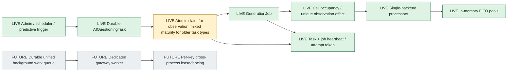

### 6.1 当前事实

- `csca_ai_questioning_tasks` 保存 source profile、topic mapping、bulk action、pipeline、observation 等后台命令。
- `csca_ai_generation_jobs` 保存真正的生成副作用。
- Observation 已实现 task/job 双层幂等、`workClass=observation`、owner/token 和 heartbeat。
- 普通 production runner 不应 claim observation job，但 cell occupancy 必须计算它。
- `SUBJECT_PRACTICE_OBSERVATION_ONLY_MODE=true` 可用于临时 observation 验收 backend，阻止普通 subject-practice production queue、通用 stale-generation startup recovery、production lifecycle reconciliation、production runner 与 predictive runner 被该进程启动；默认关闭。
- Observation CLI/preflight 默认要求 backend readiness 显示 `observationOnlyMode=true` 才允许 apply-ready；共享 production backend 只允许显式 override。
- 新 observation generation 会把 `workClass=observation`、`observationTaskId`、`generationJobId`、`productionRunId`、`productionCellId` 写入 Gateway ledger metadata；证据收集优先按 `observationTaskId` 直接绑定 gateway log，旧 observation task 才回退到时间窗候选匹配。
- 当前 Gateway concurrency 和 key pool 是单进程内存状态。

### 6.2 当前单实例边界

`SUBJECT_PRACTICE_OBSERVATION_SINGLETON_CONFIRMED=true` 是运维声明，不是自动发现第二个 backend 的分布式租约。

Phase 1 仅在以下条件成立：

- 一个 backend 进程拥有相关 background 调用；
- standalone observation 不再直接调用 provider；
- 所有调用注入同一 gateway singleton；
- 滚动重启受控，不长期重叠。

### 6.3 Phase 2 触发条件

以下任一出现时，需要统一 gateway worker 或 cross-process per-key lease：

- Backend 副本大于 1；
- 外部 Agent/CLI 需要直接执行 provider work；
- 多个 worker 共享 key；
- 需要 SLA、优先级、aging 或防饥饿；
- Key cooldown、quota、round-robin 必须跨进程一致。

只增加“抽象并发槽”不够，必须协调物理 key。

## 7. QuestionPlan、生成与修复平面

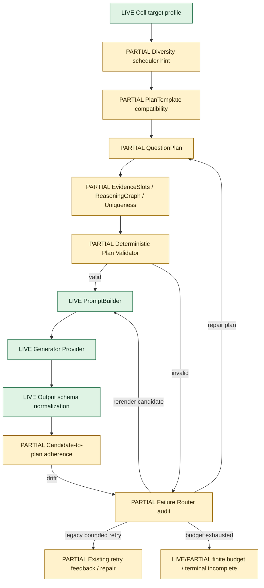

### 7.1 当前生成方式

已有能力：

- Blueprint + target profile；
- PromptBuilder；
- generation scope 与 intended use；
- provider output schema；
- fallback/smoke 隔离；
- retry feedback；
- max attempts；
- repair/replacement/variant lineage。

当前主要缺口：复杂 hard/medium 目标此前主要要求模型一次生成完整题。当前工作区已补上首批 QuestionPlan / EvidenceSlots shadow MVP：能 scaffold/validate plan、把有效 plan 带入 prompt contract、在候选后记录 adherence/failure route，并在 audit/rollout gate 中可见。首批化学模板已从 #198 seed cell id 扩展为按 subject + topicTitle + difficulty 跨 run 匹配，#199 hard lab cell #602 和 medium lab cell #601 已能进入 QuestionPlan applicability 可见性，其中 #602 已有 rejected calibration 样本；math 当前新增 #156/#350 函数性质类 QuestionPlan shadow visibility，在 production audit 中输出 `audit_only_math_question_plan_shadow`、`featureFlagEnabled=false`、`productionImpact=none_audit_only`，并在 standalone calibration 中把 #350 样本分成函数性质 judgement、exp/log ordering、参数推断和 evidence-slot 待校准几类，明确不连接生产 QuestionPlan gate；physics 当前也有 audit-only QuestionPlan shadow visibility，在 production audit / rollout gate 中输出 `audit_only_physics_question_plan_shadow`，首批 fixture 覆盖运动图像、串并联/欧姆电路约束和能量/动量守恒链，`featureFlagEnabled=false`，且明确不连接 `subjectPracticeQuestionPlanGateFor`。此前 live observation 暴露过 final JSON/schema-contract 缺口，随后已做 no-provider hardening：JSON `finish_reason=length` 进入 `provider_schema_invalid` delivery failure、可触发一次短 JSON retry contract，失败原文只作为 audit evidence 写回 job。后续授权的 live observation 已通过 backend-owned observation path 生成 math candidate #16211/#16233/#16267 并直接绑定 Gateway metadata，证明 provider/key 与 backend-owned evidence binding 可用；这些候选未进入学生题池，自动 gate 分别以 `profile_difficulty_evidence_mismatch` 或 `subject_practice_task_family_overrepresented` 挡下。no-provider follow-up 已修复 #16211/#16233 暴露的 scheduler/fingerprint/reviewer profile contract：exp/log/power 排序壳回放为 `elementary_function_exp_log_ordering`，函数性质 judgement 回放为 `function_monotonicity_parity_statement`，scheduler adherence 可见，reviewer evidence 分别回放为 `medium/medium/math-exp-log-ordering-difficulty-evidence-patch-v1` 与 `medium/medium/math-function-property-judgement-difficulty-evidence-patch-v1`；#16267 则进一步证明 recent-window diversity gate 可在 live candidate 上挡住同 family 过量。no-provider scheduler alignment 已补上 counted accepted/candidate family window，并让 scheduler 避免当前 legacy diversity window 会立即挡住的 math family；#350 dry-run 已从过量的 `function_monotonicity_parity_statement` 转向 `elementary_function_exp_log_ordering`。后续单次 live observation tasks `56de9be1-c3dd-4314-9619-3a6bdb341a55` 与 `b757a7c5-58b5-4cd2-a664-5e2ddf0ffc04` 继续证明 backend-owned one-job 与 direct Gateway metadata binding，但均因 provider delivery failure（schema-invalid/network attempt 或 network/ECONNRESET）未产生 candidate/gate evidence，不能计作数学质量证据；preflight 现已在连续 observation network failure 后增加 `wait_for_provider_network_recovery`，防止重复 live 验收机械撞同一交付故障。恢复窗后的 live task `32ffb19d-c9fc-441c-9439-7d361a2570a5` 生成 #16298，delivery 成功且 scheduler preferred family 命中，但 gate 以 `profile_difficulty_evidence_mismatch` / `style_alignment_failed` 保守拦下；no-provider 复盘确认这是完整表达式排序链未被 reviewer 窄规则覆盖，现已把 `log_2 a<a^2<a<√a<2^a` 这类链式排序纳入 `math-exp-log-ordering-difficulty-evidence-patch-v1` 的 medium evidence。#199 后续成为 old-lineage 历史 run，当前化学回归基线切到 fresh-lineage #200；no-provider owner refresh 可清除 #200 的 stored active-count mismatch，rollout gate 回到 `passed_with_operational_wait`。尚未证明 math scheduler v2 能稳定产出 publishable candidate，也尚未启用 plan repair / candidate rerender 的生产闭环，因此状态是 `PARTIAL`，不是 `LIVE`。

Current #200 chemistry bottleneck calibration now extends this shadow layer beyond the original lab/organic seed cells. Hard #607 gas preparation/test and hard #610 redox judgement have disabled-by-default production QuestionPlan templates (`gas_impurity_control_competing_elimination_v1`, `redox_electron_transfer_quantitative_chain_v1`). Basic #608 gas and #611 redox are deliberately calibration-only, so they can explain rejected samples without becoming fail-closed generation gates. A read-only #200 audit sampled 31 rejected candidates across #607/#608/#610/#611 and keeps provider/schema/network failures out of plan quality memory.

A follow-up no-provider reviewer/profile calibration narrowed two #200 false-block patterns without enabling QuestionPlan as a gate. Multi-stage hard gas chains like #16307/#16291 now infer `hard_gas_impurity_control_chain` when the stem combines gas generation, impurity removal, drying, collection, and at least two independent tests; the existing medium Cl2 litmus fixture remains medium. Redox quantitative chains like #16292 now recognize "required volume" wording as a calculation command and no longer get double-blocked by hard-shape visible-calculation checks once `redox_evidence_chain_discrimination` is present. This is code/fixture evidence only; historical DB review metadata is not rewritten by the calibration itself.

`npm.cmd run csca-ai-questioning:reviewer-profile-replay` is the bounded read-only bridge between fixture evidence and old live candidates. It replays deterministic reviewer/profile evidence for selected subject-practice run/cell/id scopes with `reviewProviderMode=deterministic_only`, a disabled gateway, `providerImpact=none_no_provider_call`, and `dbImpact=read_only`. The #200 #607/#610 dry-run showed the intended mixed result: old hard-shape-specific blocker codes are cleared for the sampled candidates, but many still retain `difficulty_complexity_mismatch`, so the tool supports calibration diagnosis and controlled owner-refresh decisions without relaxing publication gates.

### 7.2 近期 QuestionPlan 目标

QuestionPlan 至少包含：

- task family；
- target difficulty；
- plan template；
- reasoning steps；
- evidence slots；
- quantitative relations；
- misconception targets；
- answer derivation；
- uniqueness conditions；
- representation/asset requirements；
- policy version；
- repair budget。

首批只覆盖三类化学模板；括号中的 #593/#596/#592 是 #198 seed calibration cell，不是后续 production run 的硬绑定 id：

- hard 实验证据链，对应 seed #593，后续按实验/仪器 topic + hard 难度匹配；
- hard 有机定量与结构唯一性，对应 seed #596，后续按有机 topic + hard 难度匹配；
- medium 实验双操作因果传播，对应 seed #592，后续按实验/仪器 topic + medium 难度匹配。

已完成首批 rejected calibration、shadow validator、prompt contract 接入、execution audit 和 fixture self-test。当前 fixture-only QuestionPlan acceptance 覆盖 math shadow、physics shadow、math calibration、chemistry current calibration 和 chemistry execution self-test。下一步仍是按科小预算验证；通过前不得宣布 QuestionPlan 已证明质量收益。

## 8. Provider 与 Gateway 平面

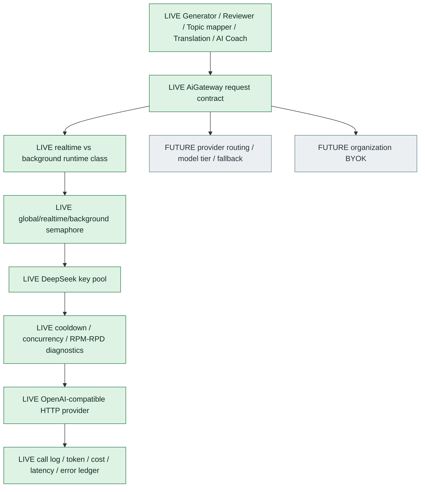

### 8.1 当前错误分类

Delivery 层包括：

- provider timeout/network/empty output/schema invalid；
- key cooldown/concurrency saturation；
- gateway queue/concurrency timeout；
- quota/rate pressure。

这些错误：

- 可影响吞吐；
- 可触发受控 retry/recovery；
- 不得进入 task-family 或 difficulty 质量记忆；
- 不得被解释为候选题质量失败。

当前 schema-contract hardening：OpenAI-compatible JSON 请求会要求最终 JSON 放在 `message.content`；reasoning-only/empty final 记为 `provider_empty_output`；`finish_reason=length` 的截断 JSON 记为 `provider_schema_invalid`，并保留 usage/raw response 作 delivery audit。generator 层对 invalid structured JSON 的失败原文只写入无 `question_id` 的 generation job 审计字段，不会变成 candidate、reviewer 输入或发布题。

Observation evidence hardening：新 observation generation 请求会把 task/job ownership 写入 `AiGatewayCallLog.metadata`，因此 post-run evidence 可以按 `metadata.observationTaskId` 直接绑定 Gateway 调用。历史任务没有该 metadata 时，工具必须标注为 time-window candidate binding，不能把候选日志说成唯一 request-id 证据。

### 8.2 未来 admission

当前大量内存 queue timeout 表明未来应考虑：

- Job 先留在 durable queue；
- Dispatcher 只按真实容量领取；
- 不预先启动大量调用者等待 semaphore；
- work class 有可观察 queue wait；
- priority/aging 在确有 SLA 后再加入。

## 9. 自动质量门平面

```mermaid
flowchart LR
    classDef live fill:#dff3e4,stroke:#26734d,color:#102b1d
    classDef partial fill:#fff2cc,stroke:#9a6a00,color:#332500
    classDef planned fill:#dcecff,stroke:#2f6ea3,color:#10283c
    classDef boundary fill:#fde2e2,stroke:#b43a3a,color:#4a1111

    C["LIVE Candidate"]:::live
    SCHEMA["LIVE Schema / scope / asset checks"]:::live
    SUBJECT["LIVE/PARTIAL Subject validator"]:::partial
    SOLVE["PLANNED stronger math/chem/physics solver adapters"]:::planned
    REVIEW["LIVE AI reviewer"]:::live
    DIFF["PARTIAL Difficulty evidence audit"]:::partial
    DIVERSE["PARTIAL Diversity/near-duplicate decision"]:::partial
    GATE["LIVE Automatic gate"]:::live
    PUB["LIVE Publish"]:::live
    REGEN["LIVE/PARTIAL Repair/regenerate/archive"]:::partial
    NOH["BOUNDARY No mandatory human approval"]:::boundary

    C --> SCHEMA --> SUBJECT --> SOLVE --> REVIEW --> DIFF --> DIVERSE --> GATE
    GATE -->|"publishable"| PUB
    GATE -->|"repairable"| REGEN
    GATE -->|"unsafe/invalid"| REGEN
    NOH -.-> GATE
```

### 9.1 通用硬门

- Scope 与 syllabus；
- 题型与输出 schema；
- 题干自包含；
- 答案存在且唯一；
- 解释与答案一致；
- 缺图/缺表依赖；
- mock/smoke/fallback 不能进入正式 subject-practice pool；
- current profile/policy compatibility；
- publication target bank/use case。

### 9.2 学科校验方向

化学：

- 方程、相态、计量、平衡方向；
- 有机结构与反应证据；
- 实验操作与因果链；
- hard/medium evidence rubric。

数学：

- 符号/数值求解；
- 定义域与参数边界；
- 唯一答案；
- 数学渲染；
- 实际推理步骤与难度。

物理：

- 单位与量纲；
- 物理量范围；
- 守恒和边界条件；
- 图像、电路、受力图与题面一致性；
- 实验误差与测量精度。

### 9.3 人工边界

正式生产路径保持：

```text
generation -> automatic reviewer/validator/gate -> publish or reject
```

离线抽样、quality audit ledger 和 recheck evidence 用于研发/运营校准，不是每道题发布前的人工审批步骤。旧文档中出现的“人工 review 面板”应解释为质量审计/复查工具，不得重新引入必需的人审权限链。

## 10. 多样性与题型策略平面

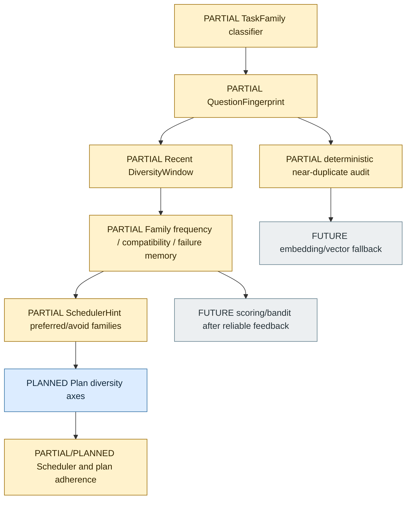

### 10.1 当前状态

- 化学、数学、物理三科当前抽样窗口均已有 family visibility：最新 no-provider readiness 为 `ready_for_next_phase`，chemistry 1-day window `known=20/20`、math 30-day window `known=54/54`、physics sampled window `known=490/490`；
- 化学 task-family/fingerprint 当前策略版本为 `subject-practice-task-family-policy-v16` / `subject-practice-question-fingerprint-v16`，除既有 current-window 可见性壳外，新增 `basic_ph_measurement_or_preparation_error_judgement` 与 `classification_state_change_evidence_judgement`，分别隔离 pH 操作误差和物质分类/状态变化证据链；
- 化学 QuestionPlan shadow 当前覆盖 #198/#199 lab/organic seed patterns，并补到 #200 hard gas/redox bottleneck cells：#607/#610 是 production-template shadow，#608/#611 是 calibration-only，不改变当前发布 gate；
- 数学已有 scheduler v2 observation、scheduler adherence replay、difficulty evidence patch 与部分 family/window 机制；
- 物理 family visibility 已 ready，但图像/视觉资产、hard difficulty rubric 和 deterministic physics validator 仍是 audit-only / future work；
- near-duplicate 主要是 audit signal；
- current-policy 与历史 policy 结果隔离；
- provider failures 排除于 family memory。

### 10.2 算法方向

MVP 使用可解释结构化评分：

```text
candidateFamilyScore =
  underRepresentationReward
  + targetCompatibility
  + recentFailureRecoveryValue
  - recentFamilyFrequencyPenalty
  - sameSkeletonPenalty
  - providerFailurePenaltyExcluded
```

后续在反馈可靠时可引入 contextual bandit，但 bandit 不应早于稳定的 family classification、quality feedback 和 policy versioning。

### 10.3 向量库边界

MVP 不需要向量库。向量只适合后续：

- 大题库跨表述相似搜索；
- near-duplicate fallback；
- 离线 audit；
- 跨 topic 语义重复分析。

Embedding 不负责：

- 判断答案正确；
- 判断真实难度；
- 判断题目是否具备多步证据；
- 第一版 publication blocking。

## 11. 资产、版本与双线发布平面

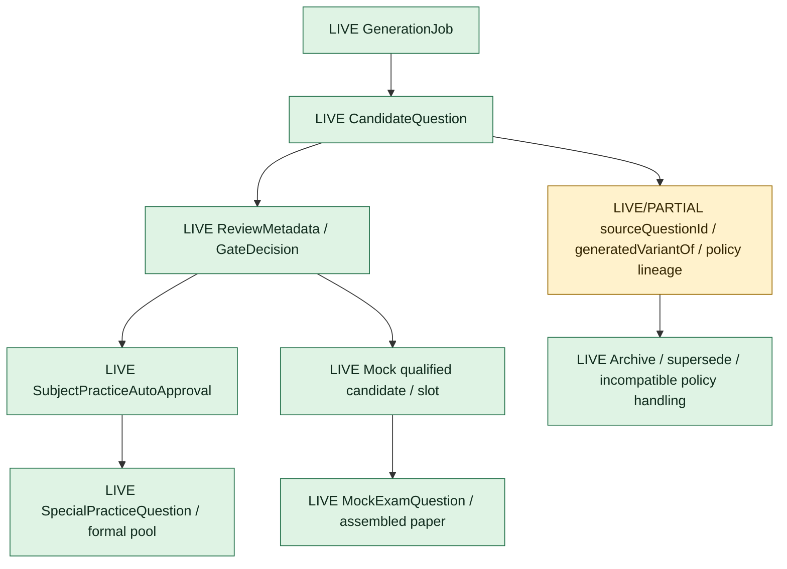

### 11.1 正式科目训练题口径

学生可消费题必须满足：

- automatic gate publishable；
- `targetUseCase=subject_practice`；
- `targetQuestionBank=special_practice_questions`；
- `subjectPracticeAutoApproval.status=published_to_subject_practice`；
- 非 smoke/mock/fallback；
- current policy/profile 可消费；
- 无缺图或版本不完整。

### 11.2 在线模考口径

- Mock scope 题不能串入 subject-practice pool；
- 合格候选必须符合 blueprint slot；
- slot 唯一占位与整卷装配分开；
- 双语、数学渲染、题位分布有独立硬门。

### 11.3 版本治理

- 原始真题不因 profile 更新被改写；
- 旧生成题保留 lineage，可被 supersede/archive；
- 新 profile 激活后，新任务只能使用 current snapshot；
- stale queued/running job 必须恢复、归档或明确阻断；
- 发布题保存 policy/profile/source 版本，保证可追溯。

## 12. 学生消费与反馈平面

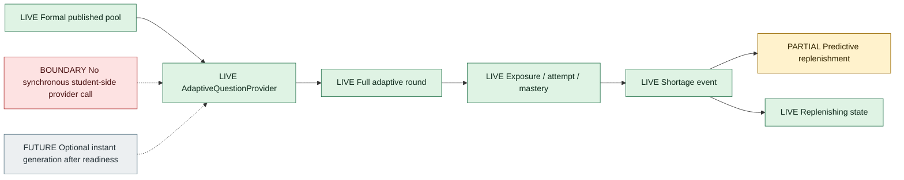

### 12.1 当前正式行为

- Adaptive round 必须完整成轮，不能用半轮掩盖库存不足；
- 只消费正式发布题；
- 题池不足返回稳定 `ADAPTIVE_PRACTICE_POOL_EXHAUSTED`；
- 前端展示“补题中”，不暴露 provider/reviewer 内部错误；
- 后台生产继续运行，但不由学生请求同步触发。

### 12.2 未来即时生成打开条件

- 正确性、唯一答案、难度和缺图 gate 稳定；
- Provider SLA 与 admission 可控；
- 任务有明确超时与降级；
- 不影响学生请求延迟；
- 可随时 feature-flag 回滚。

## 13. 可观测性、审计与闭环

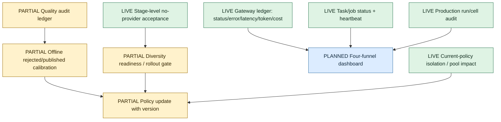

`npm.cmd run csca-ai-questioning:subject-practice-fixed-eval` 是 no-provider 固定评测子层：聚合三科 TaskFamily/Fingerprint fixtures、fixture-only QuestionPlan acceptance 和 profile difficulty patch fixed eval。它固定验证 chemistry/math/physics family 命中、subject guard fallback、chemistry topic compatibility fallback、math/physics difficulty audit visibility、physics visual current-policy 默认隔离、near-duplicate warning fallback、QuestionPlan fixture 和 reviewer/profile patch fixture；其中 QuestionPlan fixture acceptance 现在包含 math shadow、physics shadow、math calibration、chemistry current calibration 和 chemistry execution self-test。边界是 no provider、no DB write、no observation submission、fixture/audit-only。

`npm.cmd run csca-ai-questioning:subject-practice-no-provider-acceptance` 现在是一键 no-provider 阶段验收入口：在 fixed-eval 之上聚合 backend-owned observation task rules、read-only observation preflight、latest read-only observation evidence 和 read-only rollout gate。它的边界是 `acceptanceScope=mechanism_readiness_no_provider`、`actualRuntimeImpact=none_no_mutation_no_provider_call`、`liveSubmissionImpactNotExercised=bounded_one_background_slot_backend_owned`、`providerImpact=none_no_provider_call`、`liveObservationSubmitted=false`；顶层还暴露动态 `goalCompletionStatus`、`mathPublishableEvidence`、`nextStep`（例如 observation-only backend start、observation cooldown wait 或后续 work）、observation task/job 计数、最近 observation task/gate/delivery/scheduler-adherence 摘要、latest chemistry run snapshot、machine-readable `completionAudit`、`nextLiveValidation`、`readinessCommand` 和 `completionGateCommand`，并把 rollout gate waits 与 preflight wait reasons 合并到 `operationalWaitCodes`。`completionAudit` 明确包含 `question_plan_three_subject_shadow_fixed_eval_visible`，要求 fixture-only QuestionPlan 子检查同时覆盖 math shadow、physics shadow、math calibration、chemistry current calibration、chemistry execution 及 `question_plan_repair_budget_self_test`。后者独立验证同-family repair、默认-family fallback、零预算、未注册模板 fail-closed 和 candidate rerender exhaustion。DB 只读或 fixture-only，不提交 observation task。需要“完整 bounded MVP 目标已完成”语义时使用 `npm.cmd run csca-ai-questioning:subject-practice-completion-gate`；它包装 `--require-complete`，只有在 required completion audit items 缺失时才非 0 退出。当前最新 completion gate 已基于 task `99ca1383-a27f-4478-ab9c-01c6f553e934` / question `#16338` 报告 `goalCompletionStatus=complete`、`completionSatisfied=true`、`mathPublishableEvidence=fresh_live_publishable_gate_pass`；这证明 #156/#350 bounded observation MVP 有 fresh live gate evidence 和固定策略评测护栏，但不证明全数学题池长期 student-consumable quality。

`npm.cmd run csca-ai-questioning:subject-practice-quality-scorecard` 是三科四漏斗 no-provider scorecard。它调用现有 production audit JSON，按 chemistry/math/physics 汇总 target/published/open、job attempts、generated candidates、approved generated、generated-to-approved yield、attempt-to-approved yield、provider errors、content-gate bottleneck cells、P0/P1、active/stale work 和 readiness phases。它还会把 open cell 的 `topGateReasons` / `topJobErrors` / `questionPlanCalibration` 折叠成 deterministic `mechanismRoute`，例如 `question_plan_evidence_slots_or_difficulty_rubric`、`reviewer_profile_difficulty_calibration`、`delivery_or_provider_contract`、`diversity_window_or_scheduler`、`reviewer_validator_calibration` 或 `runner_dispatch_or_cell_scheduling`。当 calibration 显示候选已经具备 plan/quant-chain 形状但 gate 仍报 profile/difficulty/calculation 缺失时，路线会偏向 reviewer/profile difficulty 校准；当 calibration 显示 evidence slot 不足时，路线才保持 QuestionPlan/EvidenceSlots。它现在还输出一等 `questionPlanVisibility` 摘要，把 chemistry applicability/calibration/execution、math shadow 和 physics shadow 的 audit-only / no-provider / no-gate-impact 边界放到 scorecard summary 里，并用 `coverageStatus` 区分 sampled/applicable 与 merely boundary-visible，避免自动化把物理当前 `sampleCount=0` 误读为质量收益已验证。它只读 DB，不提交 observation，不触发 provider；`status=needs_attention` 或 `monitoring_required` 是研发/运营下一步信号，不是生产发布阻断。该入口用于回答“效率和质量到底卡在哪一层”，并避免把 provider delivery、content gate、学生可消费质量和机制 readiness 混在一起。

The scorecard also runs a bounded current deterministic reviewer/profile replay for the largest open content-gate cells unless `--skip-profile-replay` is supplied. This replay uses `csca-subject-practice-reviewer-profile-replay.cjs --summary-only`, keeps `reviewProviderMode=deterministic_only`, and reports `currentProfileReplayPolicy`, `currentProfileReplay`, and `topOpenCellMechanismRoutes`. The distinction is intentional: `mechanismRoutes` preserves the stored-metadata/full-open-cell view, while `topOpenCellMechanismRoutes` shows the current-code route for the highest-impact cells, so old gate metadata does not hide whether the next mechanism is still QuestionPlan/EvidenceSlots, reviewer/profile calibration, or controlled owner revalidation. The replay summary also exposes `ownerRevalidationCandidateIds`, a capped per-cell `ownerRevalidationPlan`, and legacy non-profile recheck counts for top open cells whose current route is `owner_current_policy_revalidation_candidate`, so a later authorized refresh can be scoped to exact candidates, open-slot capacity, and required full-gate/source-similarity rechecks instead of inferred from long ad hoc SQL output. The plan uses `candidateSelectionPolicy=prefer_current_reviewer_clean_without_legacy_non_profile_reasons`, so low-risk planned ids are consumed before legacy recheck candidates when a cell has surplus candidates. It is still read-only diagnostic evidence and never publishes or rewrites candidates.

`npm.cmd run csca-ai-questioning:subject-practice-owner-revalidation-plan -- --subject=chemistry` is the read-only execution-plan wrapper for that replay evidence. It invokes the scorecard JSON, emits `mode=subject_practice_owner_revalidation_plan`, and converts the current #200 owner-refresh opportunity into an exact low-risk candidate whitelist plus an explicit legacy/full-recheck exclusion list. Latest output marks chemistry #200 as `ready_for_authorized_low_risk_revalidation` with 13 low-risk candidates (`16266,16274,16282,16284,16287,16289,16291,16293,16294,16296,16301,16303,16307`) and excludes #16305 because it still carries `review_error_issue`, `review_failed`, and `past_paper_similarity_high`. This planner is not an apply path: `productionImpact=none_read_only_execution_plan`, `providerImpact=none_no_provider_call`, `dbImpact=read_only_scorecard_input`, and any later execution still requires separate explicit authorization, exact candidate whitelist matching, and full automatic gate/source-similarity enforcement.

For chemistry #200, this current replay layer now separates basic gas/redox surface mismatches from real evidence-slot failures. Basic #608 gas preparation/collection/test single-rule items are capped as `basic_gas_single_fact_or_operation_cap`; basic #611 redox single-concept items replay as `concept_identification/basic/none` when they only ask one named species electron-loss/oxidation-number judgement. Hard #610 redox now has a bounded `redox_quantitative_constraint_chain` evidence reason for limiting-reagent electron transfer, priority oxidation with amounts, multi-species complete oxidation, and two-oxidant volume/amount ratio comparisons; direct one-quantity electron-conservation remains too simple for hard. The formal gate treats those basic gas/redox question-form/cognitive-skill drifts as surface-only but continues to enforce difficulty evidence, answer/reviewer validity, source similarity, and hard-shape blockers. Current replay routes #608 and #611 to `owner_current_policy_revalidation_candidate` instead of misrouting them to more QuestionPlan prompt work, while #610 hard redox remains reviewer/profile difficulty calibration with fewer false hard-shape rejects. Multi-stage gas preparation/purification/test chains remain medium or hard according to their evidence.

The same replay layer now handles #607 hard gas more precisely. `hard_gas_acid_moisture_interference_chain` covers acid-gas/moisture interference cases that require absorbent and drying-order reasoning plus dry/wet litmus, limewater, CuSO4, combustion-product, or comparable tests. This narrows #607's current replay from 6/12 hard to 10/12 hard without promoting standalone gas collection facts or KMnO4-as-test-reagent prompts. The chemistry task-family classifier also recognizes `gas_hydrogen_collection_purity_test` and `gas_oxygen_collection_method_selection`, removing the recent basic-gas `other` classifications that had held chemistry phase-1 visibility at `needs_classifier_work`.

### 13.1 四个必须分开的漏斗

1. Delivery：attempt 是否拿到有效 provider output；
2. Plan：计划是否满足结构和可解性；
3. Candidate：完整题是否符合 Plan、schema 和 solver；
4. Gate：候选是否可正式发布。

不能用一个“通过率”混合以上分母。

### 13.2 P0/P1

必须修：

- 错题、答案不唯一、解释冲突进入正式池；
- 明显难度错位发布；
- cell 串库或同 cell 并发重复；
- queued/running 假死或 stale 不恢复；
- provider failure 变永久 blocked；
- current-policy 串线；
- 发布计数与学生可消费口径不一致。

### 13.3 P2/P3

可记录并阶段停止：

- family 分布不够理想但无短窗重复发布；
- audit 文案或 metadata 噪音；
- provider 偶发失败且会恢复；
- 合格候选被 gate 拦下；
- run 未立即满额但 open gap 持续下降。

## 14. 三科学科插件架构

| 能力 | 化学 | 数学 | 物理 |
|---|---|---|---|
| Source/syllabus/profile | `LIVE` | `LIVE` | `LIVE/PARTIAL` |
| TaskFamily/Fingerprint | `PARTIAL`，v14 可见性已覆盖当前窗口，治理仍分阶段 | `PARTIAL`，当前 30-day 窗口 known family 100%，scheduler/reviewer patch 回放可见 | `PARTIAL`，sampled window known family 100%，仍以 audit-only 为主 |
| Difficulty rubric | `PARTIAL`，hard/medium 仍需 QuestionPlan/EvidenceSlots 校准 | `PARTIAL`，medium exp/log ordering 与 log-domain patch 已回放，hard/medium 仍需 live 质量证据 | `PARTIAL/PLANNED`，hard direct-formula watch 已抽样，正式 rubric/阻断未启用 |
| Deterministic validator | 方程、相态、平衡、有机规则已部分存在 | 部分公式/答案校验 | 单位、量纲、图像尚需系统化 |
| QuestionPlan | 三类高损耗化学模板首批 `PARTIAL`：schema/template/validator/prompt contract/audit 已落地；已支持跨 run topic/difficulty 匹配，并输出 applicability/calibration/execution 审计证据；live evidence 待完成 | `PARTIAL audit-only`：#156/#350 函数性质 shadow visibility 已进入 production audit，standalone calibration 已能把函数性质、exp/log ordering、参数推断分流；feature flag 默认关，未连接生产 gate | `PARTIAL audit-only`：首批 motion graph、circuit topology、conservation chain shadow fixture 已进入 production audit / rollout gate / scorecard visibility；feature flag 默认关，未连接生产 gate |
| Diversity scheduler | 化学已部分生产治理，current-window visibility 已补齐 | scheduler v2 observation，#16211/#16233 后 no-provider adherence/reviewer 回放已修复，#16267 证明 live diversity gate 可挡同 family 过量；scheduler 现用 counted window 并避开 legacy gate blocked family，live publishable 证据仍缺 | visibility/fixtures ready，scheduler 阻断未启用 |
| 真实生产证据 | #200 为当前 fresh-lineage 回归基线：running、无自动 P0/P1，但高损耗 cell 仍需 Plan 校准 | backend-owned observation 已生成 #16211/#16233/#16267；已证明 preferred-family live 命中和 diversity gate 可见，但质量收益仍待 publishable 证据 | 尚未完成同等级长期验收 |
| 视觉/图像 | 一般 text-first | 数学渲染需硬门 | 图、电路、受力图是关键前置 |

共享核心不包含具体学科知识，只定义接口和状态；每个学科注册自己的：

- family catalog；
- difficulty rubric；
- plan templates；
- evidence-slot types；
- solver/validator adapters；
- banned patterns；
- representation rules；
- audit fixtures。

### 14.1 共享内核、单科执行、独立灰度

三科共同设计的是平台架构，不是把三科绑定为一个生成任务。目标运行模型固定为：

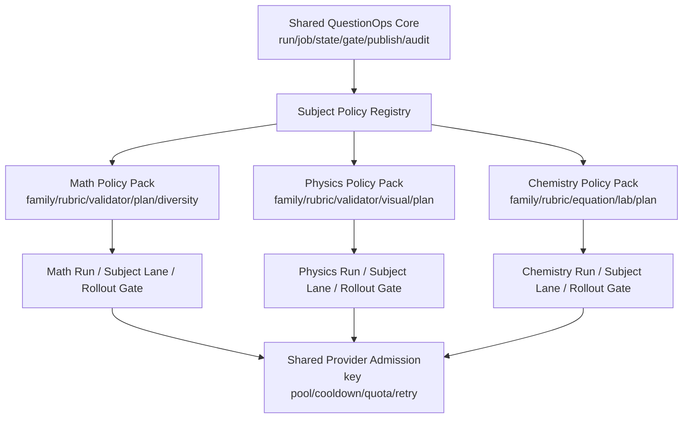

永久执行语义：

1. 一次 QuestionPlan、generation job、review/gate 和 provider 调用只属于一个 subject、一个 topic/difficulty cell 和一个 policyVersion。
2. 三科可以共享同一个 Gateway 和物理 key 池；这是容量复用，不构成质量策略、状态或发布绑定。
3. Run、cell、题池、质量指标、rollout gate、feature flag 和停止线按科独立；数学失败不应阻断化学，化学 backlog 不应改变物理质量判断。
4. 共享 Core 只编排统一接口。TaskFamily、DifficultyRubric、EvidenceTarget、validator、QuestionPlan template、DiversityAxes 和视觉规则由学科策略包提供。
5. 当前单 backend 仍使用共享 background FIFO；目标 admission 增加 subject lane、权重/配额、aging 和防饥饿。subject lane 解决容量公平，不复制三套 provider/key 系统。
6. 架构设计同时检查三科，是为了守住接口通用性和防止策略串线；实现、观测、质量验收和上线按单科逐步完成。

| 隔离能力 | 当前状态 | 目标 |
|---|---|---|
| 单次模型调用只生成一个学科/cell | `LIVE` | 保持 |
| 分科 production run/cell 与正式题池 | `LIVE` | 保持 |
| 共享 Gateway/key pool | `LIVE`，单进程 | durable admission / distributed lease |
| Subject Policy Registry | `PARTIAL` | 三个明确版本化 Policy Pack |
| 分科 policyVersion/rollout gate/feature flag | `PARTIAL` | 每科独立启停、回退和验收 |
| 分科 queue lane、公平配额和防饥饿 | `PLANNED` | 共享容量下独立调度 |
| 分科质量基准与 gate 误放/误挡指标 | `PARTIAL` | 每科独立基准和发布阈值 |

## 15. QuestionOps 独立产品与 Agent 架构

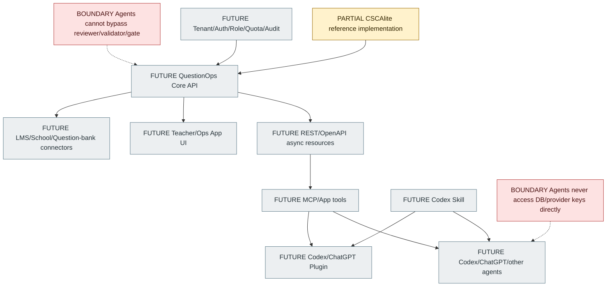

### 15.1 产品接入分层

| 层 | 作用 |
|---|---|
| Core API | 独立产品真正边界；异步 run/job 资源、幂等、版本、审计 |
| MCP/App | Agent 可调用的状态、审计、取样、draft plan、observation 工具 |
| Skill | 教 Agent 验收方法、停止线、风险判断，不承载业务状态 |
| Plugin | 打包 Skill + MCP/App，方便发现、安装和权限管理 |
| App UI | 给教研/运营使用的可视化质量与生产控制台 |
| Connector | LMS、学校平台、外部题库导入导出与同步 |

### 15.2 权限顺序

第一阶段只读：

- run/status/readiness；
- audit/sample/diversity window；
- pool impact dry-run；
- question trace。

第二阶段低风险写：

- draft production plan；
- bounded observation；
- quality evidence；
- recheck marker。

高风险动作必须显式确认：

- start production；
- publish/archive；
- policy flag；
- bulk reclassify；
- external LMS sync。

### 15.3 当前不应做

- 不立即把 CSCAlite 拆成独立微服务；
- 不让 Agent 直接改数据库；
- 不让 Skill 承载真实业务动作；
- 不让 Plugin 绕过 API；
- 不让外部 Agent 持有 Provider key；
- 不默认开放 publish 权限。

## 16. 当前数据实体总览

### 16.1 内容与画像

- `CscaExamTopic`
- `CscaSourceDocument`
- `CscaSourceQuestion`
- `CscaQuestionStyleProfile`
- `CscaExamSeriesProfile`
- `CscaGenerationProfile`
- `CscaSyllabusImport`
- `CscaTopicMapping`
- `PastPaper / PastPaperFile`
- `ResourceBundle / ResourceBundleItem`

### 16.2 生成与质量

- `CscaQuestionBlueprint`
- `CscaQuestion`
- `CscaQuestionMisconception`
- `CscaConceptCard`
- `CscaQuestionQualityMetric`
- `CscaAiGenerationJob`
- `CscaAiQuestioningTask`
- `CscaAiQuestioningSetting`

### 16.3 科目训练与自适应

- `CscaSubjectPracticeProductionRun`
- `CscaSubjectPracticeProductionCell`
- `SpecialPracticeTopic`
- `SpecialPracticeQuestion`
- `CscaAdaptiveSession`
- `CscaAdaptiveRound`
- `CscaAdaptiveRoundItem`
- `CscaQuestionExposure`
- `UserCscaTopicMastery`
- `CscaAdaptiveUsageAggregate`
- `CscaAdaptiveInventorySnapshot`
- `CscaAdaptiveInventoryEvent`

### 16.4 在线模考

- `MockExamBlueprint`
- `MockExamBlueprintSlot`
- `MockExamGenerationJob`
- `MockExamQuestion`
- `MockExamPaper`
- `MockExamAttempt`

### 16.5 Gateway 与组织

- `CscaAIUsageLedger`
- `AiGatewayCallLog`
- `OrganizationLlmProviderConfig`

### 16.6 未来建议实体

- `SubjectPolicy`
- `TaskFamilyDefinition`
- `DifficultyRubricDefinition`
- `SubjectTopicPlanTemplate`
- `QuestionPlan`
- `QuestionPlanAttempt`
- `PlanValidationResult`
- `CandidatePlanAdherence`
- `BackgroundWorkItem` 或统一 durable admission 资源
- `ProviderKeyLease`（仅多实例直连 Provider 时）
- `ExternalIntegration`
- `AgentActionLedger`

## 17. 当前代码事实、近期计划与远期目标清单

| 模块 | 当前 | 近期 | 远期 |
|---|---|---|---|
| Source/Syllabus | 已有上传、映射、画像和版本 | 强化 canonical grouping 与 freshness | 外部机构导入标准化 |
| Production matrix | 已有 run/cell/runner | 提升效率和停止语义 | 独立 QuestionOps run engine |
| Predictive replenishment | 已有事件/快照/runner 基础 | cohort/cycle 校准 | 多租户需求预测 |
| Observation | backend-owned MVP 已有 fresh Pro-backed publishable gate evidence，task Gateway evidence 可按 `observationTaskId` 直接绑定 | 集成恢复测试、更多分科/分 family bounded evaluation | 统一 bounded experiment framework |
| Gateway | DeepSeek、key pool、并发、ledger、JSON final-delivery/empty-output/truncated-output delivery guard、observation metadata evidence binding | durable admission 与分漏斗指标 | 多 provider、BYOK、gateway worker |
| Generator | prompt/target/retry 已有，QuestionPlan prompt contract 首批 `PARTIAL` | QuestionPlan/EvidenceSlots live 灰度与定向修复 | 受控模型路由与模板市场 |
| Validator | 化学较多、数学部分、物理不足 | 三科学科 adapter | 外部规则包/考试体系插件 |
| Reviewer/Gate | 自动路径已有 | 校准误杀、plan-aware reasons | 可配置 policy packs |
| Diversity | family/fingerprint/window 三科可见性已进入 `ready_for_next_phase`；数学 #156/#350 已有一条 fresh scheduler/profile publishable evidence，治理仍分科灰度 | plan-aware scheduling、更多固定评测与 family coverage | bandit + optional vector fallback |
| Publishing | subject/mock scope 隔离已有 | 版本与 plan lineage | 外部 LMS 同步 |
| Student UX | 正式池消费与 replenishing 已有 | 库存解释与后台可观测 | 稳定后可选即时生成 |
| Agent | 尚未实现产品接入 | internal Skill + read-only MCP | Plugin/App/LMS/独立产品 |

## 18. 关键架构债务

1. `AIQuestioningService` 体积过大，多个控制面职责仍集中在一个服务中。
2. Gateway concurrency/key state 是单进程内存状态。
3. Older AI task types 的原子 claim/fencing 成熟度不完全一致。
4. QuestionPlan 已有首批 `PARTIAL` shadow MVP，但 live provider 质量收益和 repair/rerender 闭环尚未证明；hard/medium 生成仍有高损耗。
5. Delivery、Plan、Candidate、Gate 指标已开始拆分为 calibration/execution audit，但尚未形成完整生产闭环。
6. 三科 family visibility 已有当前窗口 ready 证据，但策略成熟度仍不一致：化学低 yield 需要 QuestionPlan 校准，数学已有一条 bounded fresh live positive sample 但仍需要固定评测覆盖更多 family，物理需要 hard rubric、视觉资产与 validator 系统化。
7. Runtime singleton 主要依靠配置声明，不是分布式检测。
8. Agent/API 产品边界目前主要是规划，不是正式能力。
9. Vector fallback、bandit、多 provider 不应提前掩盖结构化治理缺口。

建议逐步拆分为：

- `SourceProfileOrchestrationService`
- `SubjectPracticeProductionService`
- `QuestionPlanService`
- `GenerationJobService`
- `SubjectQualityGateService`
- `DiversityPolicyService`
- `ObservationOrchestrationService`
- `QuestionOpsApiFacade`

拆分应按真实职责和测试边界推进，不做一次性重写。

## 19. 推荐实施路线

### Step 1：守住当前生产

- 化学继续慢速补题；
- 学生端继续 replenishing；
- 不放宽 gate；
- 不改 key 策略；
- 完成数学 observation 最后 live evidence；
- 继续 P0/P1 监控。

### Step 2：低通过率机制修复

- 抽样 20-30 道 rejected candidates；
- 校准 target profile/rubric/classifier；
- 完成 QuestionPlan/EvidenceSlots shadow MVP 的 live 单 job 验收；
- 首批只覆盖 #593/#596/#592 对应的三类化学模板；后续 production run 通过 topic/difficulty 复用，不硬绑旧 cell id；
- 接入 FailureRouter 和有限预算。

### Step 3：统一指标与 admission

- 拆分 Delivery/Plan/Candidate/Gate 指标；
- 减少大量内存 queue waiter；
- 按物理容量领取 durable jobs；
- 明确 work class queue wait 与 timeout。

### Step 4：三科扩展

- 数学接入符号求解、唯一解、Plan；
- 物理补齐 family、difficulty、单位量纲、图像资产规则；
- 每科独立 rollout gate 和 policy version。

### Step 5：QuestionOps 内部 API

- 稳定 API resources；
- read-only MCP；
- internal Skill；
- action ledger、idempotency、confirmation。

### Step 6：产品化与分布式扩展

- Plugin/App UI；
- LMS connector；
- 多租户、权限、配额、计费；
- 统一 gateway worker 或 per-key distributed lease；
- 多 provider/BYOK。

## 20. 永久架构边界

无论系统如何扩展，以下边界不应改变：

1. 学生只消费正式发布且 current-policy 可用的题。
2. 学生请求默认不直接驱动同步 provider 生成。
3. Provider/key failure 不进入题目质量记忆。
4. Subject-practice 与 mock-exam scope 不串线。
5. 三科学科策略隔离，共享的是协议和运行时，不是具体规则。
6. 所有质量判断带 policy/profile/source version。
7. 自动 reviewer/validator/gate 不能被 Agent、Admin 或外部系统绕过。
8. 人工抽样是校准证据，不是正式发布必需环节。
9. 强阻断先 shadow/dry-run，再 feature flag 灰度。
10. 无限生成不是目标；有限预算、可解释停止和 terminal incomplete 是正确状态。
11. 向量库是 near-duplicate 补充能力，不是 correctness/difficulty 核心。
12. 模型能力只有在机制变量被隔离后才能被判定为主瓶颈。

## 21. 最终目标形态

CSCAlite 的最终 AI 出题系统不是“调用一次模型返回一道题”，而是一个可追溯的 QuestionOps 生产系统：

```text
可信内容事实
  + 版本化学科策略
  + 可验证题目计划
  + 有限预算调度
  + 统一 Provider admission
  + 自动求解、审题和发布门
  + 正式题库与双线消费隔离
  + 学习反馈驱动补题
  + 全链路审计与 Agent-safe API
```

它的核心价值不是“无限出题”，而是：

- 可控地生产可发布题；
- 准确性、真实难度和多样性可解释；
- 失败能分类、恢复、停止；
- 题目、策略、模型调用和发布结果可追溯；
- 能安全接入 CSCAlite、Codex、ChatGPT、LMS 和外部学校平台。

## 22. 当前受保护家族推进规则（2026-09-11）

真实观察不再按“开放单元最多”机械选择，而按可迁移证据、QuestionPlan 完整度、提示契约完整度与难度风险进行只读评分。已经达到阶段效率门槛的单元会从后续选择中排除，避免重复 Provider 成本；选择与本地校准本身不得启动后端、提交任务、写库或发布。

数学基础函数 `run #1 / cell #13` 与 `cell #17 / elementary_function_exp_log_ordering` 均已完成阶段验证。cell #17 使用专用 `math_medium_exp_log_ordering_chain_v1`：三个独立证据组、三步排序推理、明确区间/不等式链、唯一严格顺序，以及对对数方程、参数题、纯小数近似和现实包装的禁止项。只读选择器现已排除 #13/#17 的重复 Provider 支出，并已完成 `cell #16 / elementary_function_direct_property` 的本地契约校准；其真实验证仍未授权。

阶段验证只证明受控小样本交付、QuestionPlan 遵守、自动门禁与已知安全边界，不等于真实批量质量已证明。任何后续真实验证仍必须另获明确授权，并同时声明精确家族、调用上限、费用上限、学生端抑制和停止条件；当前 `executionAllowed=false`。

Provider 配置统一使用 DeepSeek 官方当前模型标识 `deepseek-v4-flash` 与 `deepseek-v4-pro`；遗留短名 `deepseek-flash` 不再作为环境或代码默认值，防止新环境因模型名不存在而产生无效请求和交付成本。

### 22.1 受保护计划的提示成本审计

- 提示构建器必须输出 `question-generator-prompt-audit-v1` 元数据，量化系统/用户消息长度、动态规则段和已移除的重复约束字符；该元数据不得改变 Provider 请求语义。
- Provider 载荷中的 `expansion`、`targetProfile` 和 `styleReference` 各自只有一个权威位置；完整原始 constraints 只保留在重放元数据中。
- 通用主题规则只能在某个 QuestionPlan 已完成本地逐题族校准后按模板显式省略，禁止用“存在任意计划”作为全局压缩条件。
- 当前首个允许省略通用主题重复的模板为 `math_medium_exp_log_ordering_chain_v1`。单元 `#17` 的精确预览总字符数由估算 17,419 降至 14,010，专项必需短语保持全通过。
- 该模板的精确 Provider 提示预算为 15,000 字符；本地预览/选择阶段和 `QuestionGeneratorProviderService` 的 Gateway 调用前必须使用同一中央预算函数。超限返回 `generator_prompt_budget_exceeded`、Gateway 调用数为 0，并按非重试型 `prompt_budget_exceeded` 分类，不能消耗 Provider 配额或进入重复重试。
- 推理成本必须按已校准题族显式治理：`math_medium_exp_log_ordering_chain_v1` 在 DeepSeek V4 上使用 `thinking=enabled + reasoning_effort=low`，并省略思考模式下无效的 temperature；未校准题族保持 Provider 默认值。已有 completion token 接近 8,000 上限时不得先降低 `maxTokens`，应先通过低 reasoning effort 的受控真实验证证明质量与截断率。

### 22.2 单元 #17 低思考强度观察结论

`elementary_function_exp_log_ordering` 已完成 3 次有效、禁止学生发布的 DeepSeek 观察。三个有效请求均完成交付、精确家族匹配、QuestionPlan 遵守与自动 `publishable`，学生端发布 0 / 3。有效样本累计 prompt/completion/total token 为 9,555 / 12,811 / 22,366，总费用 0.00492478 USD，平均每个交付候选 0.001641593 USD；completion token 为 3,885、3,708、5,218。当前协议 cohort 另包含 1 个在本地沙箱 EACCES 阶段未到达 Provider 的零 token 诊断任务，因此运维漏斗为 attempted 4 / delivered 3，但交付后 candidate/gate 仍为 3 / 3。评分卡状态为 `bounded_observation_passed`，结论仍是保留 `reasoning_effort=low + maxTokens=8000`：只有 3 个交付样本，未达输出上限校准的 5 样本门槛。

精确家族观察必须把本地只读提示契约预览得到的 `questionPlanTaskFamily` 随任务提交并固化到 durable task snapshot。执行端据此重建并验证 QuestionPlan；一旦计划有效，它对题族的决定权高于通用候选压力、delivery cooldown 和 diversity rotation，调度元数据必须改写为计划题族并留下 `validated_question_plan_authoritative` 原因。该约束防止“Provider 实际按精确计划生成，但 completion gate 按另一个通用 family 判失败”的审计自相矛盾。

### 22.3 四漏斗后置门禁与动态家族轮换

阶段验证不能把本地前置失败、Provider 交付和候选质量放在同一个分母。`math-postfix-efficiency-v2-four-funnel` 保留所有 durable task 作为任务机制审计，但使用以下口径：本地提示预算拦截与本地网络权限拒绝不进入 Provider 交付分母；delivery yield 使用 Provider 可执行 terminal samples；gate yield 只使用已交付 candidates；学生发布抑制仍覆盖全部 terminal tasks。该口径使 `#17` 的 3 个有效请求稳定显示为 delivery 3 / 3、raw gate 2 / 3，同时保留 3 个无费用本地失败供工程复盘。

`math-guarded-family-selection-v2-dynamic-validation` 对当前 run 的所有开放单元执行只读 postfix gate，并将所有阶段 `passed` 单元加入排除集合，不再依赖一个 `--validated-cell` 默认值。当前 `#13/#17` 均已自动排除，下一候选为 `#16 / elementary_function_direct_property`。该模板已采用与受保护计划一致的 15,000 字符预算及紧凑权威载荷，提示由 15,568 降至 11,672 字符，并增加 task-family 固定样本以区分直接初等函数性质与对数方程求解。review context 显式携带 QuestionPlan，使单关系 basic 计划能够覆盖来源画像中相冲突的 high-reading 目标；DeepSeek V4 对该已校准模板使用 low reasoning 并保留 8,000 输出上限。选择器仍不授权 Provider 或学生发布。

### 22.4 单任务审计与阶段推进证据分层

总验收不能只依赖最后一条观察任务，也不能为了推进路线而覆盖历史记录。`hasFreshCompleteSingleTaskMathEvidence` 要求最后一条任务同时具备可发布门禁与 `preferred_family_match`；`hasFreshBoundedMathStageEvidence` 则要求同一 run/cell 的四漏斗后置门禁通过、有效交付至少 3、原始可发布至少 2、学生发布为 0。两者任一成立都可关闭当前单元并进入下一家族的无 Provider 校准，但报告必须同时展示来源和证据限制。

当前 `#17` 由有界阶段证据关闭：最后一条任务的历史 scheduler adherence 仍是旧值 `avoided_family_hit`，明确报告 `historicalLatestTaskMetadataRepaired=false`；聚合阶段门禁则为 delivery 3 / 3、raw gate 2 / 3、student published 0。该分层证明的是小样本阶段可接受率与成本，不证明批量规模效率，也不把 `#16` 的本地固定评测当成 Provider-backed 质量证据。

### 22.5 阶段证据驱动的下一动作

`subject-practice-next-action` 可通过显式 `--observation-cell` 读取该单元的四漏斗后置门禁。门禁通过时，历史生产漏斗仍保留在 `reasons` 与 `yieldEvidence`，但不再触发重复的 `math_recovery_diagnostics_required_before_live_or_enqueue`；决策转为 `math_stage_validated_select_next_guarded_family`，并只产生 `read_only_math_guarded_family_selection`。相应动作队列门禁返回 `read_only_progression_ready`，而不是 `ready_for_explicit_authorization`，且保持 `doesNotAuthorizeExecution=true`。

这一覆盖只改变路线选择，不覆盖安全边界：Provider hard-stop 仍优先阻断；阶段证据不证明全 run 规模效率；下一家族的 Provider-backed 质量仍需新的精确授权；普通生产 run 的 blocked 状态不会被解除；不会自动 enqueue、启动后端或发布学生题。

### 22.6 三层 Provider 提示预算

所有题目生成请求都必须在 Gateway admission 前具备字符预算，不能只保护已经完成题族校准的模板：

1. 已校准的 `math_medium_exp_log_ordering_chain_v1` 与 `math_elementary_function_relation_v1`：15,000 字符。
2. 其他非空 QuestionPlan 模板：20,000 字符默认上限。
3. 尚无 QuestionPlan 的生成路径：24,000 字符全局安全上限。

超限必须返回本地 `generator_prompt_budget_exceeded`，Provider/Gateway 调用数为 0，并在交付统计中归为 pre-provider failure。当前数学 run #1 的 17 个精确单元全部有预算且全部通过，最大提示 18,064 字符；两个受保护初等函数单元均低于其 15,000 上限。

### 22.7 物理与化学当前开放单元的受控计划覆盖

物理 run #2 / cell #19（几何光学，medium）和化学 run #3 / cell #36（物质分类与状态变化，medium）已从“仅有 24,000 全局上限、没有 QuestionPlan”提升为显式白名单保护的影子计划：

- `physics_medium_optics_two_relation_v1` 要求文字完整的透镜或折射设置、两个相连的光学关系、唯一答案和公式回代；拒绝依赖未提供图片或只背诵一条规律。计划成为权威后省略重复主题规则和完整 style payload，精确提示由 16,781 降至 11,706 字符，并使用 15,000 字符上限。
- `chemistry_medium_classification_evidence_v1` 要求具体物质或连续过程、两个证据组和一个明确分类规则；拒绝定义背诵和仅统计物理/化学变化数量。相同去重后精确提示由 14,291 降至 10,749 字符，上限为 15,000。
- 两个模板的当前环境门禁仍为 `disabled_shadow`；只读精确观察模拟白名单后均为 `plan_required`、计划验证通过、提示预算通过、预检可提交。
- 独立 `current_open_cell_question_plan_self_test` 固定验证模板选择、无白名单 shadow、白名单 fail-closed、正负遵守样本、题族分类、紧凑提示与成本预算，并已纳入总 QuestionPlan 无 Provider 验收。
- 本轮没有 enqueue、Provider 调用、数据库写入或学生端发布。它证明本地机制与成本准入就绪，不证明真实题目合格率；后续真实观察仍需新的精确授权。

### 22.8 低历史通过率下的单观察准入

`subject-practice-next-action` 现在把历史生产效率与新机制的本地就绪证据分开。若某科历史 `generated-to-approved` 或 `attempt-to-approved` 低于阈值，不再因为存在空闲并发槽就建议普通 capacity fill；只有当前精确单元同时满足以下条件，才把状态提升为 `acceptable_for_one_guarded_observation_only`：

1. 精确单元 enqueue 预检通过；
2. QuestionPlan 存在，显式白名单环境下为 `plan_required` 且验证有效；
3. QuestionPlan attempt 为 `plan_ready`；
4. Provider 提示契约与模板字符预算通过；
5. 精确预览确认执行模型为 `deepseek-v4-flash`，`thinking=enabled`、`reasoning_effort=low`，并省略 temperature；
6. 推理策略版本为 `question-generation-reasoning-effort-v2`，输出上限固定为 8,000 token；
7. 整个判定过程保持 DB 只读且无 Provider 调用。

满足后仅生成 `submit_one_guarded_observation_task`，不再先创建可能走普通发布路径的 generation job。未来新的明确授权必须一次性写明精确 subject/run/cell/task family、最多一次 Provider 请求、本地 task/job/candidate/gate 写入、美元费用硬上限和学生发布抑制；普通并发填充同步返回 `no_capacity_fill_while_efficiency_requires_guarded_observation`，防止把“一次实验资格”误解为恢复批量生产。

当前只读实测：物理 run #2 / cell #19 与化学 run #3 / cell #36 均达到该单观察准入；action queue gate 对两者返回 `ready_for_explicit_authorization`，但 `doesNotAuthorizeExecution=true`。这不是实际 enqueue 或 Provider 授权，也不改变历史两科 `below_acceptable_efficiency` 的事实。

### 22.9 执行成本策略与准入门禁同源

生成服务的模型选择、reasoning 策略和输出 token 上限已导出为纯策略函数，精确单元预检直接调用与真实 Provider 请求相同的实现，不再用脚本中的重复常量猜测实际成本配置。`promptContractPreview.executionCostPolicy` 现在展示模型、思考模式、reasoning effort、temperature 处理、输出上限、策略版本与原因；下一动作门禁会逐项校验，任何配置漂移都会把受控观察降级为 `not_ready_for_guarded_observation`。

当前数据库只读复核结果：物理 #19 为 11,706 / 15,000 字符，化学 #36 为 10,749 / 15,000 字符；两者均解析为 `deepseek-v4-flash + low + maxTokens 8000 + policy v2`，全部成本准入检查通过。固定测试同时验证这两个模板不会恢复到 Provider 默认 high reasoning。构建通过；Prisma generate 在 Windows 已有后端进程占用 query engine 时使用既有 client 继续构建，本轮未修改 schema。

### 22.10 三科持久观察任务与 Provider 前费用硬门

原数学专用的 durable observation task 已扩展为三科共享协议，action 分别固定为 `math_scheduler_v2`、`physics_scheduler_v2`、`chemistry_scheduler_v2`。物理和化学只能在 `SUBJECT_PRACTICE_OBSERVATION_ONLY_MODE=true` 的隔离后端执行；三科现在都必须绑定精确 run、cell、task family，不能再通过数学遗留的宽泛 run 级入口；所有观察默认且强制 `suppressStudentPublication=true`，不会调用自动批准或进入学生题池。

观察提交必须携带 `maxEstimatedCostUsd`、`maximumReservedCostUsd` 和 `guarded-observation-cost-reservation-v1`。当前两个 15,000 字符计划模板按“字符数作为输入 token 保守上界 + 完整 8,000 输出 token 上限”预留，物理 #19 与化学 #36 的最大预留均为 0.00434 USD；下一动作给出的显式硬上限为 0.01 USD。后端在真正进入 Provider 前重新从当前蓝图计算模型、reasoning policy、输出上限、计划模板预算和当前价格，只有 `deepseek-v4-flash + thinking enabled + low + 8,000 + policy v2` 且重新估算费用不超过用户上限时才继续。任何配置或价格漂移都会以 `observation_provider_cost_admission_failed` 在 Provider 前终止，且完整准入证据同时写入 generation job 与 Gateway metadata。观察任务还把 Gateway 的 `maxProviderAttempts` 强制设为 1，避免普通出题默认的两次重试把“一次观察”放大为最多三次真实请求；普通生产仍保留原重试策略。

`subject-practice-next-action` 对低历史通过率科目不再推荐普通精确 enqueue，而返回 `guarded_observation_task_ready_for_explicit_authorization / submit_one_guarded_observation_task`。物理 run #2 / cell #19 与化学 run #3 / cell #36 的只读 action queue gate 均已通过，授权文本包含一次 Provider 请求、0.01 USD 上限、本地证据写入及禁止学生发布；本轮没有提交任务、调用 Provider 或写数据库。

Gateway ledger 现在按一次高层调用内的所有真实 Provider attempts 累计 prompt/completion/total token 与估算费用，并记录 attempt limit、实际 attempt count 和逐次安全摘要，避免重试成功时只计算最后一次响应的成本。`csca-ai-questioning:observation-scorecard` 以只读方式统一计算 task、Provider delivery、candidate、automatic gate、student publication 五层漏斗，同时报告每个交付/合格样本成本、费用越界和 Provider 尝试数越界。旧观察若缺少新费用或尝试上限证据，会标为 `legacy_bounded_evidence_missing_current_cost_or_attempt_caps`，不会伪装成当前机制已合规。旧的 `csca-three-subject-live-observation --execute` 直连写库路径已 fail-closed 退役，未来只能逐个使用 durable guarded observation task。

观察 CLI 的 `--confirm-provider-recovery` 现在只是操作员确认，不能单独充当恢复事实。apply 会在登录和 POST 前运行只读 `ai_gateway_provider_recovery_state`，要求 hard-stop 已清除、至少一把 question-generation key 处于 enabled，并验证恢复状态中的模型与精确提示契约所选模型一致；不满足时不会提交任务。当前只读状态为 `provider_hard_stop_clear`、1 把 background key enabled、模型 `deepseek-v4-flash`，没有调用 Provider。

观察后端 readiness 也从展示信息升级为提交硬门：CLI 和 Admin service 都要求 `readyForSubmission=true`、`readyForExecution=true`，包括 observation execution 已启用、singleton 已确认以及并发/key slot 条件满足，防止一次明确授权只留下永久 queued 的脏任务。服务端在 INSERT 前重新按当前 `deepseek-v4-flash` 价格、QuestionPlan 字符预算和 8,000 输出上限计算预留费用；客户端声明低于服务端现值或计划预算不可解析时，以 `subject_practice_observation_server_cost_reservation_exceeds_declared_cap` 或 `..._unavailable` 零写入拒绝。snapshot 同时保留服务端权威预留和客户端声明值，Provider 前仍会再次重算，形成提交前与发送前两道费用门。

动作队列提供的 apply 命令必须带 `--wait --timeout-ms=900000`，提交后持续等待该条 durable task 到终态，避免“HTTP 提交成功”被误当成“Provider 观察完成”。同一动作的操作命令和后置验证命令都必须包含 `csca-ai-questioning:observation-scorecard`；只有评分卡重新读取 task、job、ledger、candidate、gate 与学生发布证据后，才能报告真实交付率、合格率和实际成本。动作队列静态门禁会拒绝缺少终态等待或评分卡闭环的受保护观察建议。

### 22.11 QuestionPlan candidate rerender 的 lineage 有限预算

QuestionPlan attempt 原有 `maxPlanRepairs=2 / maxCandidateRepairs=1` 字段此前只是单任务元数据：新生成任务会把已用次数重新置零，因此不能证明有限预算。现在候选重生成通过 `previousQuestionId` 读取上一候选的 `questionPlanAttempt` 与 `questionPlanFailureRoute`，在新任务 enqueue 时继承 lineage attempt index，并只在上一条 route 为 `repair_plan` 或 `repair_candidate_rendering` 时增加对应计数；候选评估阶段继续保留入队时的计数，不再重置。

系统硬上限固定为最多 2 次 plan repair、1 次 candidate rerender，输入 QuestionPlan 即使声明更大数字也会被 clamp，声明 0 则可主动关闭相应修复。enqueue API 在任何 generation-job INSERT 之前执行 `subject-practice-question-plan-repair-budget-v1` 准入；candidate rerender 已用次数达到上限时返回 `question_plan_candidate_repair_budget_exhausted`，自动重生成路径同时在候选 review metadata 留下 skipped 决策。因此同一结构失败不能通过自动路径或手工 previous-question enqueue 无限扩张 Provider 成本。

启用 gate 的 Plan 若验证失败，会先执行 `subject-practice-question-plan-deterministic-repair-v1`，且全程不调用 Provider。第一策略只允许按请求的 task family 重建注册模板；该 family 不可用或仍无效时，第二策略才允许回到该 subject/topic/difficulty 的注册默认 family。每次策略都有可见 attempt 记录，修复结果必须重新通过 `subjectPracticeQuestionPlanGateFor` 才能创建或继续 generation job。该逻辑同时覆盖新 enqueue 和旧 queued job 的 Provider 前当前策略重建；处理路径会把修复后的 plan、gate、attempt 和 repair audit 同步到同一份内存与持久元数据，避免实际提示使用新 Plan、候选审计却保留旧 gate。

`questionPlanRetryMemory` 现在报告 `repairAvailableCount`、`repairBudgetExhaustedCount` 和 `repairBudgetUnknownLegacyCount`，并在样本中展示 attempt index、repair kind、已用次数、上限和自动重生成停止原因；QuestionPlan execution audit 另行汇总 deterministic repair 数与实际 repair attempts。历史候选缺少 budget 时必须标为 legacy unknown，而不能推断为已耗尽；delivery failure 仍被排除在 Plan 质量与修复记忆之外。本阶段已闭合注册模板级自动 Plan repair 与 candidate rerender 的持久有限预算；需要生成全新 evidence/reasoning 结构、且当前没有注册模板可用的语义级 Plan repair 仍保持 fail-closed，作为后续工作项。

`npm.cmd run csca-ai-questioning:question-plan-repair-budget-self-test` 提供该闭环的独立 fixture-only、no-provider、no-DB 验收，并已纳入 `csca-ai-questioning:question-plan-no-provider-acceptance`；因此总验收不仅检查模板/候选形状，也会在 repair 策略或有限预算语义漂移时失败。

### 22.12 观察续跑的累计样本与成本停止门

单次观察的费用门只能限制一次请求，不能阻止操作链在多轮对话中反复申请新任务。`csca-ai-questioning:observation-scorecard` 因此新增 `guarded-observation-continuation-v1`：默认至少 3 个 Provider 样本后判定阶段质量，最多允许 3 个 Provider 样本，累计估算费用上限 0.03 USD，下一次按最多 0.00434 USD 预留，并把平均每个 publishable gate 样本的费用限制为 0.01 USD。达到质量门、样本上限、累计或预测费用上限、单个合格样本成本上限，或者出现学生发布、尝试数、动作协议、费用准入、发布抑制等安全异常时，均返回稳定的 `stop_*` 状态；存在活动任务时只允许等待。

只有样本与成本都仍有余量、无安全异常且当前协议证据完整时，评分卡才返回 `eligible_for_one_more_guarded_observation`。该状态仍固定携带 `doesNotAuthorizeExecution=true`、`requiresFreshExplicitAuthorization=true`，它只表示下一次请求可以进入授权评审，不构成调用或写库授权。`subject-practice-next-action` 已把这一累计判断接入 guarded readiness；非 eligible 状态不能再产生 `submit_one_guarded_observation_task` 推荐。

停止状态在下一动作层不会再模糊退回普通诊断，而会形成 `guarded_observation_continuation_stopped`、`recommended=null` 的显式零副作用决策，并原样保留评分卡停止原因。`csca-ai-questioning:next-action-continuation-self-test` 用夹具验证“停止后无动作”“eligible 保留受控路由”以及“数学阶段完成后仍可进行无 Provider 的下一家族选择”三种分支。

该段旧协议审计结论已被后续精确家族当前协议验证补充：历史缺少费用/尝试上限证据的记录仍保留在全历史审计中，但 `--current-protocol-cohort --task-family=elementary_function_exp_log_ordering` 现报告 4 个当前协议任务、3 个交付候选、3 个 `publishable`，总费用 0.00492478 USD，状态 `stop_bounded_observation_passed`。这一结论明确阻止继续为 cell #17 追加 Provider 支出。

### 22.13 遗留候选零 Provider 回收优先级

生产审计此前把“已有非通过候选但 review gate reasons 为空”的单元误报为 `none_detected`。这会同时隐藏真实的 0% 通过率，并让下一动作越过可回收候选直接建议新 Provider 花费。审计现在按 candidate 精确统计 `classifiedRejectedCount / unclassifiedRejectedCount`；只要开放单元存在占主导的无原因非通过候选，就标记 `unclassified_candidate_rejection`，下一安全动作固定为先检查 review metadata 并以当前确定性门禁回放。

质量评分卡的 replay opportunity 已同时覆盖 `content_gate` 和 `unclassified_candidate_rejection`，后者先进入 `unclassified_candidate_review_replay`，再根据当前 deterministic reviewer、QuestionPlan adherence 与 formal publish gate 选择 owner revalidation。真实数据库只读回放结果：物理 run #2 / cell #24 的 4 道遗留候选中 3 道满足当前 reviewer 与 QuestionPlan；化学 run #3 / cell #41 同样为 3 / 4。候选排序不再依赖可能被后台刷新改变的 `updated_at`，而固定按“无 legacy non-profile reason → profile clean → profile-only soft → hard-shape repaired → id 升序”选择。连续 4 次计划复核稳定得到物理 #584、化学 #581；两题的精确 dry-run 都是 `wouldAutoApprove=1 / blocked=0`，但本轮没有写库或发布。

`subject-practice-next-action` 现在把这种现有候选放在 guarded observation 和新 enqueue 之前，输出 `revalidate_existing_candidates_without_provider`、`providerCallLimit=0` 与精确候选白名单。动作队列只有在 plan、preview、exact-confirm apply、后置评分卡/生产审计命令齐全，且 publication policy 明确为“仅经现有自动门禁、另行精确授权”时才放行到 `ready_for_explicit_authorization`。低历史效率只阻止新增 Provider 花费，不再阻止该零 Provider 回收路径。当前稳定建议为物理 #584、化学 #581；两者仍为 `doesNotAuthorizeExecution=true`，后续 DB 更新和可能的自动发布需要新的明确授权。

授权前还必须执行 `csca-ai-questioning:subject-practice-owner-candidate-inspection`。该只读检查器一次最多接受 10 个精确且不重复的 candidate id，校验 subject/run、题干、解析、知识标签、选择题选项唯一性以及答案是否能解析到选项，并复用当前 deterministic owner-revalidation dry-run。报告完整展示题目内容、每题 `contentSha256` 与整组 `exactContentSetSha256`，防止操作员审核的内容与随后授权的白名单发生漂移；它不连接 Provider、不写数据库、不发布，并明确保留“结构与正式门禁不能代替人工学科正确性判断”的边界。

为消除检查与执行之间的内容漂移窗口，next-action 会把 `exactContentSetSha256` 同时写入授权目标、授权文本和 apply 命令的 `--expected-content-set-sha256`。apply 模式缺少合法 64 位摘要时直接拒绝；执行时在 `Serializable` 事务内重新读取精确候选内容，复算摘要并检查 subject/run/候选集合，只有完全一致才进入确定性重审和既有自动发布门禁。摘要不一致会回滚并要求重新检查，动作队列也会拒绝摘要缺失或命令摘要与授权目标不一致的操作。

`csca-ai-questioning:owner-revalidation-content-precondition-self-test` 以 4 个无数据库、无 Provider 夹具固定验证缺少确认、缺少摘要、摘要不匹配均 fail-closed，且合法确认与完全匹配摘要可以进入后续执行边界；该测试本身不执行 apply。

真实只读内容核验确认：物理 #584 的两物体速度分别为 `+1 m/s` 与 `-1 m/s`，故只有“速率均为 1 m/s”的 C 正确；化学 #581 中润湿试纸的残留水会稀释稀盐酸、降低 H⁺ 浓度，故测得 pH 偏大，B 正确。两题结构检查均全通过、正式门禁均为 `would_auto_approve_via_existing_gate`。物理内容集摘要为 `0cf10597160df31d9517fd01366057dae2d29428ae5eb0cf2ae7207efc4cc610`，化学为 `bce68a5bdcb0ab94654e8c64ac1de83870f744e4563614a50b0a82eb55d9f0af`；这些仍只是授权评审证据，不构成写库或发布授权。

### 22.14 精确题型证据与输出 token 校准

单元级评分会把同一 cell 内相邻 task family 的成功样本合并，不能证明某个明确指定 family 的真实通过率。观察评分卡因此支持 `--task-family=<exact-family>`，并在报告中写出 `evidenceScope=exact_requested_task_family`。早期只读复核曾证明当时的 3 个交付样本属于相邻 `logarithmic_equation_domain_solution`，因而不能代替精确家族证据；后续已按精确 `elementary_function_exp_log_ordering` 和当前协议完成三次有效验证，交付/candidate/QuestionPlan/publishable 均为 3 / 3。历史邻近家族数据仍只用于审计，不纳入该精确通过率。

评分卡另支持 `--current-protocol-cohort`：旧样本继续出现在全历史审计中，但续跑评审只看同时具备单次 Provider 上限、费用上限、guarded admission 和学生发布抑制证据的当前协议样本。精确家族现有 4 个 current-protocol 任务：1 个本地 EACCES 诊断和 3 个有效交付；评分卡 `bounded_observation_passed`，continuation 为 `stop_bounded_observation_passed`。数学 guarded-family selector 按“cell postfix + exact planned family”双重验证排除 cell #13/#17，当前选中未执行的本地校准对象为 cell #16 `elementary_function_direct_property`。

`csca-ai-questioning:output-token-calibration` 复用只读观察评分卡，以至少 5 个已送达样本、P95×1.2、最大值×1.1、500 token 向上取整、4000 token 下限、距现上限 85% 的保护线和至少 1000 token 的实质降幅作为建议门。精确 `elementary_function_exp_log_ordering` 的 completion token 为 3885/3708/5218，样本仅 3 个；临时候选上限虽为 6500，但未达 5 样本门槛，最大理论节省仅约 0.00042 USD/次，因此结论是保持 8000。该工具只输出策略评审建议，不改环境、不调用 Provider。

### 22.15 指数/对数排序题的题型内轮换

三个有效样本的答案与门禁均合格，但都使用“一个以 2 为底的对数 + 一个分数次幂 + 一个立方根，分别夹逼后排序”的近同构骨架。这说明原 QuestionPlan 解决了合格率，却未解决精确家族内的结构多样性。

`math_medium_exp_log_ordering_chain_v1` 现增加四种受限原型：参考区间锚点、同底数/同指数变换、指数—对数互逆桥接、精确两两恒等变换加独立界估。每个新候选必须只选一种原型，并在表达式组成、比较锚点、变换方法、干扰项误区中至少改变两个结构轴；只换常数、字母或选项顺序不计数。为防止提示膨胀，原型在 QuestionPlan JSON 中只保存紧凑标识，由 prompt builder 一次展开；本地固定回归实测总提示 14,549 字符，通过 15,000 预算门。这一改动仅改变后续生成契约，未调用 Provider、未写库、未发布；真实多样性改善仍需未来受控样本证明。

### 22.16 基础初等函数单对象契约

只读选择器在排除已完成的 #13/#17 后，将 `run #1 / cell #16 / elementary_function_direct_property` 作为下一个低成本数学家族。原 `math_elementary_function_relation_v1` 虽将基础题标记为“一个对象”，但后置遵守门只统计初等函数关键词，因而对数方程、三对象排序、多性质堆叠、参数推断和现实情境包装都可能被误判为计划遵守。

现在基础模板的生成契约与确定性门禁同时要求：只有一个底数明确的指数/对数/幂函数；只问一个函数值、定义域、值域或单调性目标；所有选项回答同一目标；禁止解方程、三值排序、参数、多性质栈、外部情境和 targetProfile 复杂度膨胀。修复反馈也会将这些原因码重定向回单对象骨架。

生产精确预览对 cell #16 报告 `planReady=true`、`promptReady=true`、缺失必需短语 0，总提示 12,668 / 15,000 字符，低思考强度策略保持开启。固定验收用一个 `f(x)=log_2 x` 直接函数值正例，并确认对数方程、三对象排序和多性质堆叠均会被精确原因码拦截。选择器已恢复 `selected_and_locally_calibrated`，但 `executionAllowed=false`；本轮未调用 Provider、未写库、未发布。

### 22.17 观察执行的精确题族授权绑定

仅确认 run/cell 仍存在授权粒度过宽的问题：同一单元的 scheduler hint 或模板映射发生变化时，操作员看到的题族可能与提交时实际使用的题族不同。数学 one-shot harness 现在先运行只读 exact-cell prompt preview，从有效 QuestionPlan 解析 `taskFamily` 与 `planTemplate`，并把题族、模板、提示长度、预算和保守费用预留写入预演报告。

apply 除既有 run/cell、runtime clean、Provider recovery、禁止学生发布和费用上限确认外，还必须提供与当前计划完全一致的 `--confirm-task-family`；缺失、空值或漂移均在登录、POST 和 Provider 调用之前拒绝。外层 one-shot harness 与真正执行 POST 的通用观察提交器都会独立重验该确认；后者仍从同一 exact-cell 预览重新解析并把 task family 写入后端请求，因此授权文字、预演证据与实际任务三者形成闭环。

当前零副作用预演锁定 `run #1 / cell #16 / elementary_function_direct_property / math_elementary_function_relation_v1`，提示 12,668 / 15,000 字符，最大单次保守预留 0.00434 USD。全量数学 exact-cell 验收为 17/17 通过；临时 3001 观察后端未启动、run #1 仍 blocked，且没有新的真实调用授权，所以执行保持关闭。本阶段没有 Provider 调用、数据库写入或学生端发布。

### 22.18 三样本串行观察协调器

单次 one-shot 与事后累计评分卡之间原先需要人工重复三次命令，容易造成调用次数、题族或费用边界漂移。新增 `csca-ai-questioning:math-bounded-family-validation` 将精确预览、current-protocol exact-family scorecard、one-shot harness 和逐次评分卡组合成一个预演默认关闭的协调器；自身不构造 Provider 或 Prisma client，真实写入仍只能经过 durable observation task。

协议固定最多三次 Provider 调用，并要求严格串行：上一任务到达终态且评分卡已重读后，才可能进入下一次。授权必须同时确认 run、cell、task family、最大三次、总费用、单次费用、runtime clean、Provider recovery 与禁止学生发布。执行前要求该精确题族 current-protocol Provider 样本为零，防止重复启动第二批；每轮按“当前评分卡－基线”计算新增调用和新增实际费用，并在下一次预留会穿透总上限时提前停止。

停止门覆盖三次调用耗尽、累计费用越界、下一次预留越界、活动任务未终结、one-shot 子流程失败，以及评分卡中的学生发布、发布抑制、动作协议、Provider attempt limit、费用准入或遗留缺证等全部安全异常。子流程失败后仍保留该轮 one-shot 和最终评分卡证据，不会因抛错丢失中间审计。

三样本最终合格口径现已与路线要求显式对齐：必须 3/3 Provider 请求全部交付候选、3/3 候选都有 QuestionPlan 评估、至少 2/3 候选遵守 QuestionPlan、至少 2/3 候选通过自动发布门，并保持学生端发布为 0。评分卡的最终 `passed` 会同时检查这些条件；不再允许一次交付失败或 QuestionPlan 评估缺失时误判通过。协调器调用评分卡时显式传入这些阈值，静态规则与夹具自测共同防止后续回退。

真实 DB 只读预演对 #16 显示：基线任务/Provider/费用均为 0，精确题族 `elementary_function_direct_property`，提示 12,668 / 15,000，保守预留 0.00434 USD；配置的单次硬上限 0.006 USD、三次总上限 0.02 USD 均满足准入。12 个协调器夹具状态/授权用例和 18 个评分卡状态/继续/质量用例全部通过，并已纳入主 no-Provider acceptance 及数据库不可用时的静态兜底。本阶段没有调用 Provider、登录观察后端、创建任务、写候选或发布到学生端。

选择器与主 no-Provider acceptance 已不再把该阶段描述为“准备计划”或“一个终态任务后停止”，而是直接暴露 `bounded_three_sample_coordinator_ready_for_authorization_review`、完整预演/执行命令、双重费用上限及三次精确题族证据要求。该建议仍固定 `executionAllowed=false`；只有新的精确授权才能把预演命令切换到 apply。

首次 #16 apply 在创建 observation task `e878463d-c208-46f3-b3c9-644649e98683` / generation job `#619` 后，被本机出站网络 `connect EACCES ...:443` 拦截；请求未到达 DeepSeek，token、费用、候选和学生发布均为 0，协调器依约在第一轮停止。该事件暴露了评分卡把“有 gateway attempt 记录”直接当作有效 Provider 样本的口径问题。

现将本地预 Provider 失败分类抽成共享模块，评分卡同时保留原始 `providerAttemptedTaskCount` 和新的 `effectiveProviderSampleCount` / `localPreProviderDiagnosticCount`。提示预算门及明确的本机 `connect EACCES :443` 继续完整留痕，但不进入三次有效 Provider 样本与 delivery yield 分母。协调器按有效样本计算三次上限；若基线存在此类诊断，恢复 apply 还必须精确确认 `--confirm-excluded-local-pre-provider-diagnostics=N`，既避免零费用本地故障误耗样本额度，也防止静默忽略历史失败或把恢复变成未经审计的第二批。

### 22.19 基础函数三次有效验证与失败结论

CLI 进程可联网不等于实际执行 Provider 请求的后端进程可联网。隔离观察后端因此新增管理员 TLS runtime probe：目标只能来自当前 Provider HTTPS base URL，只完成 TLS 握手，不发送 HTTP 请求、不附带 key、不产生 token 或费用。观察提交器必须在创建 durable task 前取得 `passed_backend_provider_network_reachable`；这样本地 EACCES 会在写任务前关闭，而不再污染真实交付率。

三样本协调器也修复了两个实测暴露的状态机问题。第一，one-shot 因候选质量门不合格返回非零时，只要评分卡证明恰好新增一个终态有效 Provider 样本且没有安全违规，该样本就作为真实失败进入分母并继续；未形成有效样本、任务仍活动或出现安全异常仍立即停止。第二，已完成部分批次允许恢复到绝对目标 3 个，但必须精确确认 `--confirm-existing-effective-provider-samples=N`；已有样本与费用不从基线扣除，防止恢复被误算成额外三次调用。

真实验证最终包含 3 个有效 `deepseek-v4-flash` 低思考请求和 1 个单独保留的零费用本地 EACCES 诊断。三次成本为 0.00253176 / 0.00271026 / 0.00180362 USD，总计 0.00704564 USD，全部满足单次 0.006 USD 与总计 0.02 USD 上限；学生发布、发布抑制配置、动作协议、attempt limit 和费用准入违规均为 0。

质量结论是不通过：交付 2 / 3、候选 2 / 3、已交付候选的 QuestionPlan 评估覆盖 2 / 2，但遵守 0 / 2、publishable 0 / 2。一个请求在 8,000 completion tokens 处输出截断 JSON；candidate #601 虽命中题族，却在问单调性时额外陈述定义域并触发 `profile_difficulty_evidence_mismatch`；candidate #602 漂移到 `function_monotonicity_parity_statement`，并触发 profile、review score 与 style 失败。评分卡固定为 `bounded_observation_failed / stop_quality_threshold_not_met`，因此 cell #16 不得进入“已验证”集合，也不得继续自动扩样。

下一阶段保持零 Provider：收紧 `math_elementary_function_relation_v1` 的单目标表述，禁止题干/选项/解析额外陈述第二性质；使 basic 难度证据与 profile gate 使用同一可观察规则；压缩 JSON 输出与推理展开，降低触顶截断风险。完成固定夹具、全题单元 prompt contract 和 no-Provider acceptance 后，才可提出新的精确付费验证授权。

为防止上层路由忽略这一结论，guarded-family selector 在 continuation 为 `stop_quality_threshold_not_met` 或样本预算耗尽时改报 `selected_requires_local_repair_after_bounded_failure`，下一动作固定为 `repair_selected_family_after_bounded_quality_failure`。对应 live plan 的 `authorizationRequired=false`、`applyAfterFreshAuthorization=null`；主 no-Provider acceptance 同样返回本地修复，而不是继续展示新的付费授权命令。

### 22.20 基础函数本地修复闭环

三次真实样本已转成可重复回归约束。QuestionPlan adherence 会拒绝 #601 式“题干先陈述定义域、再考单调性”的双性质表达；task-family classifier 补齐根式/根号函数，使 #602 式单一根式定义域题进入 `elementary_function_direct_property`。生成提示要求题干、选项、解析及双语本地化全文只出现一个性质类别，也禁止用“本题不考值域/单调性”等否定句变相堆叠性质。

Reviewer 新增的 basic cap 不是全局放宽：只有 subject-practice、精确 `math_elementary_function_relation_v1`、题族 `elementary_function_direct_property`、目标 basic、一个明确初等函数对象、恰好一个性质且无排序/方程/参数/证明等复杂信号时，才记录 `elementary_single_property_plan_basic_cap` 并判为 basic。原有多判断对数定义域/等价变换仍保持 medium。

成本与交付策略也按题族分层：基础直接性质在 `deepseek-v4-flash` 上使用 `question-generation-reasoning-effort-v3`，关闭 thinking，输出上限 3,000 tokens；中等指数对数排序等题族继续使用 v2 low reasoning 和 8,000 tokens。exact-cell 预演、费用预留和实际 generator 共用 blueprint-aware token ceiling，避免预演仍按旧 8,000 上限估价。该修复只完成本地门控与成本策略校准，尚未证明新的真实通过率，因此不自动恢复付费扩样，也不改变禁止学生发布的边界。

顶层选择器会把此状态明确标记为 `selected_local_repair_completed_new_protocol_required`，而不再继续报告“仍需本地修复”。旧三样本仍永久保留为失败证据；下一步是先在零 Provider 条件下定义带版本的新验证 cohort，使修复前样本不会混入修复后通过率。版本化协议及其自测完成前，`providerCallAllowed=false`、`authorizationRequired=false`、apply 命令为空。

### 22.21 修复后验证协议版本隔离

基础函数修复后的真实验证使用固定白名单版本 `math-elementary-direct-property-compact-v2`，绑定 `math / run #1 / cell #16 / elementary_function_direct_property`。版本不是任意 CLI 标签：共享路由只会为该精确目标返回此值，后端提交接口会拒绝缺失、漂移或不适用于其他目标的版本，worker 在领取 durable task 后还会再次校验，防止旧任务或绕过 CLI 的请求进入新 cohort。

版本会同时写入 task `filterSnapshot` 和 generation job `promptMetadata`。评分卡读取同一字段，并先保留精确题族的全部历史记录，再选择 exact-version cohort；报告同时暴露历史总数、当前安全协议数、新版本数、最终选中数以及被排除的旧版本数。因此旧三次失败不会被删除或改写，也不会污染 v2 的通过率；以后 v2 达到三个有效样本后，也不能通过换一个随意版本名获得新额度。

bounded coordinator 的预演、每轮 one-shot 和每轮 scorecard 均携带此版本，apply 必须额外提供完全一致的 `--confirm-validation-protocol-version`。顶层 selector 在 v2 cohort 为零且 continuation 允许评审时转为 `selected_versioned_validation_protocol_ready_for_authorization_review`，但 `executionAllowed=false` 保持不变；主 no-Provider acceptance 只展示未来受控命令和精确授权文本，不会自行执行。

同时修正了后端预留估算：cell #16 的服务器端预留现在与 generator 一样使用 blueprint-aware 3,000 completion-token ceiling，而不是旧的通用 8,000。所有新增回归均为 fixture/static/build 验证；本阶段没有 Provider 请求、数据库写入或学生发布。

数据库恢复后的真实只读验收进一步确认：#16 精确题族有 4 条历史任务记录，其中 3 个有效 Provider 失败样本与 1 个零费用本地诊断均保留；新 v2 cohort 为 0，排除旧记录 4。v2 评分卡为 `insufficient_provider_samples / eligible_for_one_more_guarded_observation` 且 `doesNotAuthorizeExecution=true`。bounded preview 的提示为 13,166 / 15,000 字符，thinking disabled，输出上限 3,000，单次最大预留 0.00294 USD；selector 已转为 `selected_versioned_validation_protocol_ready_for_authorization_review`，全量 no-Provider acceptance 的下一步为 `wait_for_fresh_exact_versioned_authorization_before_bounded_validation`。

### 22.22 串行批次的逐轮完整性停止门

版本隔离只能保证评分卡不混入旧协议记录，不能单独证明每次串行循环只消费一条新请求。`math-bounded-family-validation` 因此在每个 one-shot 返回并重读评分卡后，强制核对相对上一轮的增量：观察任务必须恰好增加 1、有效 Provider 样本必须恰好增加 1、累计费用不得倒退，且本轮费用增量不得超过单次 0.006 USD 上限。任一增量不符都会立即停止后续循环，并以稳定的 `stop_serial_*` 状态保留任务数、样本数和费用增量证据；即使全批次累计费用仍在 0.02 USD 内，也不会继续用后续请求掩盖并发提交、零样本本地失败、重复样本或单轮超支。

新增 fixture 覆盖正常单轮、零任务、并发双任务、零有效样本、单轮多有效样本、费用倒退和单轮超支。自测总计 28 个用例通过；规则测试同时固定这些停止门必须存在。该改动不连接数据库、不调用 Provider，也不发布学生端内容。

### 22.23 compact-v2 三次真实验证结果

`math-elementary-direct-property-compact-v2` 已按精确授权完成 `math / run #1 / cell #16 / elementary_function_direct_property` 的三次串行 DeepSeek 验证。有效任务为 `176c0ea8-c73b-4837-a6a8-5746e427b011`、`6c87d169-24bb-4721-98d0-e8b60879f7f8`、`fb5b3c51-674c-4efb-b3ce-797f0f19ccb2`，对应候选 #603、#604、#605；每个任务都只有 1 次真实 Provider attempt，全部成功返回并写入观察候选，学生题池写入为 0。

三次请求分别消耗 4,063、4,030、4,075 token，估算费用为 0.00066654、0.00065674、0.00066836 USD；累计 12,168 token / 0.00199164 USD。单次均低于 0.006 USD，总额低于 0.02 USD，也低于提交时每次 0.00294 USD 的保守预留。两条更早的 v2 记录分别止于 Provider 前费用边界漂移和提示预算门，Gateway attempt、token 与费用均为 0；它们继续作为 local pre-provider diagnostics 可见，但不进入三次有效样本及质量分母。

质量结果为失败：Provider delivery 3/3、candidate 3/3，但 QuestionPlan adherence 0/3、自动发布门 0/3，评分卡固定为 `bounded_observation_failed / stop_quality_threshold_not_met`。三题都收敛到同一 `f(x)=log_2(x-1)` 定义域判断骨架，说明 compact non-thinking 策略显著降低了交付成本和截断风险，却没有提供足够的题型轮换或结构遵守能力。

根因不是 API 可用性，而是目标契约冲突与候选结构问题叠加：cell #16 的 target profile 要求 `basic + concept_check + multi_step_reasoning`，而基础 direct-property QuestionPlan 同时要求单对象、单目标、禁止多性质栈。生成器因此把定义域、单调性、值域或函数值混入同一道判断题的不同选项，三题均触发 `candidate_plan_math_basic_elementary_function_property_stack_forbidden`；#603 还触发 multiple-object 误判。确定性 difficulty evidence 将这种复合性质判断封顶为 medium，与目标 basic 不一致。#605 的 D 项 `f(3)=1` 与 A 项同时为真，是实际单选正确性缺陷；其本地 reviewer 另报 option equivalence，需要后续区分真实等价与区间括号被归一化造成的误报。

因此 v2 cohort 不得继续扩样或进入学生端。下一阶段保持零 Provider：在 enqueue/Provider 前增加 task-family 与 target-profile 的可满足性检查；让 direct-property 计划显式选择一个 property target，并要求所有选项只在该 target 内构造互斥干扰项；修正 family/adherence 特征对选项中其他性质、函数对象计数和区间端点的识别；为重复骨架增加可审计的结构轮换。完成固定回放和 no-Provider 验收后，必须使用新的受控协议版本及新的精确授权才能再次付费验证。

### 22.24 compact-v2 独立批次复验与严格可用率

为保留 22.23 的失败证据、同时避免同一协议下的旧样本消耗新授权额度，观察任务新增 `validationBatchId`。批次标识会从 bounded coordinator 传到 one-shot、后端 task `filterSnapshot`、generation job metadata 与 scorecard；评分卡必须同时按精确协议版本和精确批次筛选。apply 还要求 `--confirm-validation-batch-id` 完全一致，不能借换批次标签绕过协议、题族、三次请求或费用上限。

独立批次 `math-r1-c16-v2-20260912-b2` 按授权完成 3 次严格串行请求：task `2e8fe7c4-0030-4d28-8c68-080593340a08` / job #629 / candidate #606，task `ac143695-b47b-4dda-80d1-130360bc7b98` / job #630 / candidate #607，task `5d699ccb-8138-4ece-a262-33b0e894f01a` / job #631 / candidate #608。三次均只有一个 Provider attempt；token 分别为 4,024、4,031、4,007，费用分别为 0.00064974、0.00065282、0.00064554 USD，累计 12,062 token / 0.00194810 USD。单次低于 0.006 USD、总额低于 0.02 USD，学生端发布为 0。批次前另有 task `00e2e9cf-941b-415e-b6ba-a5eede66e845` / job #628 在 15,077 / 15,000 字符提示预算门终止，Provider attempt、token、费用均为 0，并按明确确认保留为本地诊断而不进入有效分母。

即时生成漏斗为 delivery 3/3、candidate 3/3、QuestionPlan adherence 3/3、当时 automatic gate publishable 3/3，证明 target-profile 归一化、单性质契约和 non-thinking 3,000-token 策略能以低成本稳定交付正确的基础定义域题。但三题均复用了 `f(x)=log_2(x-1)` 及同一组选项，仅交换或轻改干扰项。将当前 owner revalidation 与 batch near-duplicate gate 纳入更严格口径后，#606 可通过现有门禁，#607、#608 只因 `owner_revalidation_batch_near_duplicate` 被拦截。因此本批次必须同时报告“即时技术通过率 3/3”和“严格唯一可用率 1/3”；不得用前者宣称已经达到三道独立合格题。

本轮后续保持零 Provider，并修复四个实测缺口：owner revalidation 对当前 cell target profile 使用与 worker 相同的归一化，且把候选保存的 QuestionPlan 传入 reviewer；基础日志函数单性质选项不再被误分类为 `logarithmic_equation_domain_solution`；区间选项签名保留方括号以区分 `(1,+∞)` 与 `[1,+∞)`；简单对数题的确定性校验会识别第二个真实选项。去重反馈也不再只记忆已批准题：同 cell 尚处于 pending/review_failed 的当前候选会以紧凑 prompt skeleton 合并进 `recentAcceptedScenarioHints`，使串行观察的第二、三题在进入 Provider 提示时即可看到本批次已覆盖骨架。该修复已进入本地规则回归，但没有在已耗尽的三次授权内追加真实请求；其多样性收益必须由未来新的精确批次验证。

### 22.25 基础初等函数的 QuestionPlan 硬轮换

仅把当前候选题壳写进 `Do not reuse` 提示仍依赖模型自觉，无法保证第三次请求不会再次忽略第二次提示。基础 `elementary_function_direct_property` 因此新增 `math-basic-elementary-rotation-v1`：按当前 cell 已有候选数确定四槽循环，依次为 `logarithmic/domain`、`exponential/range`、`radical/monotonicity`、`power/function_value`。每个槽位同时指定函数类别、唯一性质目标、四个选项的同目标形状，并禁止第二性质、第二函数、方程、参数和情境包装。

轮换结果不是临时 prompt 文案，而是写入 QuestionPlan 的 `requiredElementaryFunctionClass` 与 `requiredSinglePropertyTarget`。prompt builder 用紧凑契约把精确槽位发送给 Provider；candidate adherence 随后独立检查函数类别与性质目标，模型即使继续返回旧的 `log_2(x-1)` 定义域壳，也会分别触发 `candidate_plan_math_basic_elementary_required_function_class_missing` 和 `candidate_plan_math_basic_elementary_required_property_target_missing`，不能再以“内容正确”进入即时合格分子。已有 batch near-duplicate gate 继续作为跨题文本结构的第二道防线。

固定夹具验证四个槽位覆盖后才循环，指数/值域正例通过，而同一 QuestionPlan 下的对数/定义域旧壳被双重原因码拒绝；Provider prompt 保留精确 `functionClass=exponential, propertyTarget=range` 且仍低于 15,000 字符预算。同期修正 `x 的值域` 被 `x 的值` 子串误判为解方程的正则缺陷。此阶段只有本地代码、测试和文档更新，没有新 Provider 请求、数据库候选写入或学生端发布；真实唯一可用率仍维持上一批证据的 1/3，不能用固定夹具替代下一批实测。

硬轮换改变了 QuestionPlan 和判定语义，因此后续请求不得继续写入 `compact-v2`。当前后端与全部观察 CLI 只为该精确 run/cell/family 接受新协议 `math-elementary-direct-property-rotation-v3`；旧 v2 批次继续作为不可变历史证据由评分卡显式查询，但不能进入 v3 分母。bounded coordinator、one-shot、提交器、worker 二次校验、评分卡 cohort 和授权确认已统一到 v3；自测还用旧 v2 记录验证协议隔离，防止通过混合历史样本伪造新机制通过率。v3 仍要求新的精确授权与新 batch id，协议升级本身不构成 Provider 调用授权。

### 22.26 rotation-v3 实测与学生可见性质边界

`math-r1-c16-v3-20260912-b1` 已完成三次严格串行实测。三个请求分别生成对数/定义域、指数/值域、根式/单调性题，证明硬轮换成功改变函数类别和性质目标，不再重复同一对数定义域骨架。三次均成功交付候选，累计 12,095 token / 0.00195972 USD；每次一次 Provider attempt，单次与总费用均远低于授权上限，学生题池写入为 0。

生成时的不可变评分卡仍记录 0/3 automatic publishable 和 1/3 QuestionPlan adherence，因此该 live cohort 的历史结论不能事后改写成通过。逐题诊断表明 #611 确实违反槽位要求：题目考单调性，却用定义域和值域陈述充当干扰项。#610 则是本地假阴性：四个选项全部是值域集合，只有解析与错因标签提到“定义域混淆”，旧特征抽取却把这些教师侧诊断文字计入学生题面的性质栈；中文 `函数值域` 还会被 `函数值` 子串再次计数。

新的 adherence 语义将“是否跨性质作答”的证据限定为题干和学生可见选项，解析与 option metadata 仍可解释错因但不能制造额外性质。`函数值(?!域)` 的边界消除了值域子串冲突；复杂度信号同样使用学生可见文本。该收窄不会放过 #611，因为其 C、D 选项本身就跨到定义域和值域。

Reviewer 同时把权威 `basic + elementary_function_direct_property + maxIndependentRelations<=1` QuestionPlan 作为画像冲突的裁决证据。单性质直判题即使含 `f(x)=2^x` 或“求定义域”的公式符号，也不会仅因此被改判为 formula-calculation、calculation skill 或更高计算负荷。owner replay 会把候选保存的完整 QuestionPlan 传回 reviewer，避免离线重放与 worker 线上判定使用不同上下文。

修复后的只读 replay 对 #609、#610 给出 reviewer clean 且 QuestionPlan adherent，对 #611 仍给出 property-stack failure，得到 2/3 的本地修正合格率。这是对同一 Provider 输出的确定性重放，不是第四次付费样本，也不覆盖原始 gate 记录。

该双口径现已落入观察评分卡，而不再依赖人工拼接。传入 `--include-current-policy-replay` 后，评分卡以所选 cohort 的精确 candidate ids 调用 deterministic reviewer replay，并在不可变 `funnels` 旁输出 `currentPolicyReplay`：当前 owner-eligible 数、QuestionPlan blocker、按 question id 升序模拟发布先后进行的 cohort 内近重复过滤、strict unique ids/yield 与阈值结论。数学 bounded coordinator 的每次 exact-family scorecard 读取默认携带该参数，并把当前回放摘要保存在 scorecard snapshot 中；这些字段不参与付费调用的历史通过/停止判定。`evidenceSemantics` 明确生成时证据不可变、replay 不改写存储 gate/plan，且 `--require-passed` 仍只依据生成时评分卡，防止事后规则修复把失败 live batch 伪装成历史通过。

v3 双评分卡因此同时保留“生成时 0/3 publishable、1/3 adherence、历史失败”和“当前规则 2/3 strict usable、达到本地阈值”。对照 compact-v2 则得到“生成时 3/3 通过、当前规则 owner-eligible 3/3，但 cohort 内去重后仅 #606、strict usable 1/3”，#607/#608 被识别为近重复。当前 uniqueness 范围只覆盖所选 replay cohort，并不声称完成了与外部 approved pool 的发布前相似度检查；任何候选状态更新仍必须经过另行授权的完整 owner revalidation/automatic gate。

### 22.27 自动发布前严格唯一性门禁

近重复检测此前有三种不同强度：validator 只产生 warning，owner revalidation 会在批次和已发布池前阻断，而正常生成的自动批准路径仍主要依赖 prompt 近似警告。现在 `maybeAutoApproveSubjectPracticeQuestion` 在 formal publishable 之后、真正 approve/publish 之前执行 `subject-practice-prepublication-uniqueness-v1`，把严格唯一性变成正常生产发布条件。

比较集合限定为同一 production run/cell 中、question id 更小的最近 80 个 AI 候选；其中已批准题必须已关联学生题，未批准题必须在当前代码下仍为 formal publishable。观察任务通过 `workClass` 明确排除，避免实验样本占用生产多样性窗口。只比较较小 id 形成稳定先后关系：并发生成两个同壳候选时，后写入者会看到先写入者并被阻断，而不会发生两题互相阻断。

门禁结果写入 `reviewMetadata.prePublicationUniqueness`，包含策略版本、排序策略、比较数量和底层 fingerprint/similarity signal。命中近重复时，gate 被改写为 `decision=regenerate`、`publishable=false`，并加入稳定原因码 `subject_practice_prepublication_near_duplicate`；repair strategy 与 regeneration feedback 都把它识别为必须更换题目骨架的硬失败。通过时先持久化 pass evidence，再进入既有自动批准和学生题发布事务。

只读 reviewer replay 已改为调用同一个 production decision helper，因此 v3 仍为 #609/#610 两个 strict unique，compact-v2 仍只有 #606、#607/#608 被阻断。该验证没有调用 Provider、没有改写候选状态、没有发布学生题。窗口上限 80 是当前成本与延迟边界，不等价于全历史语义去重；更大规模池仍应依赖 fingerprint 索引或离线聚类层。

生产审计现会按题目和 cell 聚合该门禁的 `checked/passed/blocked/unknown/legacyMissing/notReachedFormalGate` 证据，并明确排除 observation。旧候选缺少这一新增字段只记为 `legacyMissingEligibleEvidence`，不倒推为失败；这样既能看到门禁覆盖率，也不会篡改历史质量结论。对应 diagnostics self-test 覆盖通过、阻断、旧批准题缺证据、未到 formal gate 和 observation 排除五类情况。

三科质量评分卡把同一份审计证据映射为成本效率信号：除了检查数与阻断率，还输出 `blockedPerGeneratedCandidate`，并明确这些重复题已经消耗过 Provider 请求。发现重复浪费时，下一杠杆固定指向请求前轮换 QuestionPlan 题目骨架与干扰项结构，而不是继续增加调用。当前所选数学、物理、化学 run 的只读基线均尚无符合条件的新门禁证据，这是新机制上线后、首个新生产候选经过该路径前的预期状态，不代表已完成线上有效性证明；评分卡自测覆盖阻断、旧数据和已启用无阻断三类状态。

### 22.28 路线调整：独立验证优先与选择性自动发布

正式零人工目标保持为 `generation -> automatic validator/reviewer/gate -> publish or reject`，但开发主线从继续横向增加 QuestionPlan/正则调整为“先证明答案，再扩大自动发布”。QuestionPlan、TaskFamily、轮换和去重继续承担请求前约束、可解性、成本和多样性治理；它们不再被视作答案正确性证明。rotation-v3 当前规则回放的 2/3 只证明局部机制改善，不授予 `elementary_function_direct_property` family 级发布资格。

新增 `subject-practice-verification-capability-v1` shadow 注册层，统一四级能力：

1. `deterministically_verified`：受限 family grammar 被 Solver 完整解析，逐项求真后恰有一个答案，且与 Generator 一致；
2. `cross_model_verified`：答案盲审使用独立 Provider/model，逐项结论唯一且一致，并已通过版本绑定的 release benchmark；
3. `insufficient_verification`：只有局部计算、冲突检测或结构门禁，不足以证明整题；
4. `shadow_only`：未注册 family、机器不可读图形或尚未具备验证路径，只能观察和保留候选。

资格判定同时要求 family capability、每题 verification evidence 和冻结 benchmark 三者成立。未知 family、未命中 Solver、Solver 多答案/不一致、盲审未真正隔离、同模型自证或 benchmark 未通过均 fail-closed。当前首版注册的七个代表 family 全部是 `insufficient_verification` 或 `shadow_only`，`automaticPublicationEligibleCount=0`；它刻意不连接现有生产 gate，因此本阶段没有改变发布行为。`npm.cmd run csca-ai-questioning:verification-capability-report -- --json` 可输出当前只读能力矩阵和下一 Solver 缺口。

Reviewer 目标数据流拆为两阶段。第一阶段只接收题干、选项和必要 syllabus/representation context，接口层移除 `correctAnswer` 与 `explanation`，输出独立答案、逐项真值、解题证据、可解性和置信度；第二阶段才比较 Generator 答案、deterministic Solver、盲审结果并审计解析。第二阶段不得覆盖第一阶段的分歧或 abstain。模型独立性必须由 Provider/model identity 和输入证据证明，不能仅靠提示语“独立审题”。

P0 顺序调整为：能力注册与证据 schema → 答案盲审数据流 → 三科首批受限 Solver adapters → official/programmatic/mutation release benchmark → verification evidence 正式接入发布门禁 → 版本失效、回滚和已发布资产影响追踪。首批应选择高频、文本化、可形式化 family；不能充分验证的 cell 保持 `terminal incomplete`，不得为填满库存降低门槛。该原则与现有题池不足、异步补题和学生端不触发同步 Provider 的边界一致。

release benchmark 的首要指标是错误题、多正确答案和 mutation 的误放率，而不是总体平均得分。资格至少绑定 `subject + taskFamily + solverVersion + reviewerProvider/model + reviewerPromptVersion + gatePolicyVersion`；任一相关版本变化都必须重新验收。#609–#611 等已参与规则开发的样本只进入回归集，不得兼任未见 holdout，以避免针对三题继续调正则后用同三题证明泛化。

### 22.29 答案盲审 shadow 数据流

`subject-practice-blind-answer-review-v1` 已建立第一阶段答案盲审的实际数据边界。`blindAnswerReviewMessages` 不序列化 `correctAnswer`、`explanation`、`localizations` 或携带干扰项意图的 `optionMetadata`，只发送题干、可见选项、学科/题型/难度、知识标签和最小 syllabus scope。返回协议必须逐一覆盖全部 option id，并为每项输出 `true/false/unknown + reason`；缺项、重复 option、非法 id 或非法 verdict 都是 schema-invalid，不能被解释为答案证据。

盲审结果作为 `ReviewResult.blindAnswerReview` 保存独立答案、true option 集合、解题文本、置信度、abstain reason、Generator/Reviewer identity、唯一性和答案一致性。`independentProviderAndModel` 只有 Provider 与 model 两者均不同才为 true；仅换 prompt、要求同一模型“独立思考”或同 Provider 使用同名模型均不能取得 cross-model 资格。生成 worker 已把实际 Generator agent identity 传入 review context，避免靠环境默认值猜测独立性。

该路径由 `CSCA_AI_QUESTION_BLIND_REVIEW_ENABLED=false` 默认关闭，并可通过 `CSCA_AI_QUESTION_BLIND_REVIEW_MODEL` 单独指定模型。关闭时只记录 `disabled / none_no_provider_call`，不调用 Gateway；开启时每个候选会新增一次 shadow blind-answer 请求，但当前结果不参与 gate、不会提升 capability，也不会发布题。现有 Gateway 仍主要是单 Provider 运行，因此即使开启并得到一致答案，若 Provider/model 没有同时隔离，能力判定仍必须为不合格。正式启用前还需完成独立 Provider 路由、成本 admission、family benchmark 和 disagreement fail-closed 接线。

固定测试验证四条关键边界：blind payload 无答案、解析、本地化解析和干扰项意图；每个选项必须恰好判断一次；默认关闭不会触发 Gateway；同 Provider/model 的一致结果不能满足独立盲审资格。本阶段没有 Provider 请求、数据库写入或生产 gate 变化。

### 22.30 数学基础函数确定性求解器（受限子集、shadow）

新增 `math-elementary-direct-property-solver-v1`，只读取题干、可见选项和 Generator 给出的选项 id，不读取解析。当前受限语法覆盖对数函数定义域、根式函数定义域、指数函数值域、正整数幂函数值，以及这些函数的可解析定义域/值域/单调性声明。求解器逐项输出 `true/false/unknown`；任一选项无法解析、真选项不唯一或唯一真选项与 Generator 不一致时均 fail-closed，状态只能是 `unparsed` 或 `conflict`。

程序化基准 `math-elementary-direct-property-programmatic-mutation-v3` 目前得到 59/59 gold 验证成功，236/236 mutation 被检出，0 次 false accept。mutation 包含 Generator 答案翻转、复制第二个真选项、替换为不支持的函数形式，以及注入另一个性质下同样为真的选项。该数据只能证明受限语法子集，没有冻结官方题 holdout，也没有覆盖整个 family，因此 `releaseQualification=false`，能力注册仍保持 `insufficient_verification`，不接入发布 gate。

只读生产候选复放已接入 owner inspection：#609（对数定义域）和 #610（指数值域）均独立确认唯一答案 A；#611（根式综合判断）被明确判为 `conflict`，因为 A“单调递增”和 D“值域为 [0,+∞)”同时为真。这说明确定性验证能捕获“解析声称只考某属性，但可见选项中仍存在第二个真命题”的真实错误。复放只读数据库，没有 Provider 请求、候选题写入或学生端发布。

运行入口：`npm.cmd run csca-ai-questioning:math-elementary-solver-benchmark`；对精确候选复放可使用 `npm.cmd run csca-ai-questioning:subject-practice-owner-candidate-inspection -- --subject=math --run=1 --candidate-ids=609,610,611 --json`。下一步是冻结独立官方 holdout、扩充 family grammar，并在仍为 shadow 的前提下测量 false accept/abstain 边界。

本地官方资产审计覆盖 4 份数学 past-paper source、158 道标记为 human-confirmed/mapped 的题，只找到 2 道被分类到该精确 family：2026-04 第 5 题的 `√(3x)` 定义域已转入已见回归并独立确认 D；第 42 题原始公式文本损坏，求解器保持 `unparsed`。因此这两题不能组成未见 holdout，当前官方 holdout 数仍不足，且不得把已用于扩语法的第 5 题再计为 blind release evidence。只读入口为 `npm.cmd run csca-ai-questioning:math-elementary-official-holdout-audit`。

### 22.31 QuestionPlan 绑定的验证范围

求解器成功不再被视为独立的发布资格证据。`math-elementary-direct-property-verification-scope-v1` 将每份 Solver evidence 绑定到当前 QuestionPlan 的 schema/policy version、basic 难度、精确 template/family、`singlePropertyTargetContractVersion`、函数类别和性质目标。候选可见选项实际涉及的性质集合也必须恰好等于计划目标；缺计划、旧计划、函数类别漂移或跨性质选项都会输出 `missing_plan_contract/mismatch`。未来即使 family 和 release benchmark 被提升，发布决策仍要求非空 `verificationScopeId + matched`，否则以 `deterministic_solver_scope_mismatch` fail-closed。

四个基础 rotation pair——`logarithmic:domain`、`exponential:range`、`radical:monotonicity`、`power:function_value`——现均列入受限 scope allowlist。根式单调性不再只看方向词：Solver 同时求线性根式定义域，只有声明区间完全落在定义域内且递增/递减方向正确才为真；在 `R` 或相反半轴上的声明会以 `math_solver_monotonicity_interval_outside_domain` 拒绝。程序化基准中的 48 个轮换 gold case 全部 scope matched，变异集合的 scoped false accept 为 0。该资格仍仅覆盖当前受限语法，不涵盖复合根式、分段函数或任意自然语言单调性表述。

真实存量复放验证了绑定行为：#609 的 scope 为 `math-basic-elementary-rotation-v1:logarithmic:domain / matched`，#610 为 `...:exponential:range / matched`；#611 虽函数类别与计划相同，但可见选项同时出现 monotonicity/domain/range，scope 为 `mismatch`，并且 Solver 本身仍给出 A、D 双真冲突。整个范围层继续是 shadow，不改变数据库状态或学生发布。

### 22.32 可执行 Release Benchmark 门槛

`subject-practice-verification-release-benchmark-policy-v2` 把验证升级条件固化为纯函数门禁。证据必须精确绑定 `subject + taskFamily + solverVersion + verificationScopeVersion + questionPlanPolicyVersion + benchmarkVersion`；任一版本漂移都会使旧证据失效。官方集还必须在求解器版本开发前封存、开发期间隐藏答案、排除所有开发/回归夹具，并具备不可变内容哈希。v2 要求每个学科显式声明非空 mutation contract，并按该 family 的精确 scope 集合检查覆盖，不再把数学的四种 mutation 和四个 scope 写死到通用策略中；数量、通过率、abstention 和零误放门槛均未降低。

当前门槛要求：程序化 gold 至少 50 且全通过；QuestionPlan-scoped gold 至少 40 且全匹配；mutation 至少 200，四类必需 mutation 全覆盖、检测率 100%、总误放和 scoped 误放均为 0；官方未见 holdout 至少 40，四个精确 scope 各至少 8，验证率至少 95%、abstention 不高于 5%、错误题误放为 0。per-scope 计数按四个预期 scope id 精确取值，任意四个自定义标签不能满足覆盖。

当前 `npm.cmd run csca-ai-questioning:verification-release-benchmark` 结果为 `not_qualified`。程序化 59/59、scoped 48/48、mutation 236/236 已达标；失败原因仅来自官方证据边界：未预封存、答案已在开发中暴露、开发夹具未隔离、官方 holdout 数为 0、scope 覆盖为 0，因而官方验证率和 abstention 也无可计算。能力注册已从 `benchmarkStatus=not_run` 更新为 `not_qualified`，并继续保持 `automaticPublicationEligibleCount=0`。命令默认只报告，只有显式 `--require-qualified` 才以非零退出用于未来 CI release gate；当前仍未接生产发布链。

### 22.33 零 Provider 的本地参数化生成基线（shadow）

`math-elementary-local-generator-v2` 为四个已绑定的基础轮换槽位提供纯本地参数化生成：对数/定义域、指数/值域、线性根式/单调性、正整数幂函数/函数值。生成器只接受当前有效的 basic、single-choice、单性质 QuestionPlan；函数类别、性质目标、schema/policy/template/family、单关系与单函数对象约束任一不匹配都会在候选产生前 fail-closed。候选产生后还必须由独立的 `math-elementary-direct-property-solver-v1` 得到唯一答案、与 Generator 一致且 scope matched，失败时不向下游返回候选。

固定 shadow 基准对四个槽位各生成 32 题，共 128 题。v2 不再把同一数学内容仅重排 A/B/C/D 计为新题：语义指纹保留题干并对选项文本排序后再比较。结果为 128/128 自验证通过、128/128 QuestionPlan adherent、128/128 deterministic validator 无 blocking error、128/128 忽略选项位置后仍语义唯一；每个槽位均为 32/32，A/B/C/D 正确答案位置各 32 次。测试过程中 Provider 调用为 0、估算费用为 0、数据库写入为 0、学生端发布为 0。入口为 `npm.cmd run csca-ai-questioning:math-elementary-local-generator-benchmark`。

本次同时修正两个契约语义：单调性选项中的“在定义域内/on its domain”只限定单调声明的适用区间，不再被误算为第二个独立性质；“函数值/function value”被计为明确的基本初等函数关系信号。真正出现“定义域为”“值域为”等跨性质选项时仍会触发性质栈阻断，#611 的回归结论不变。

以 rotation-v3 三次实测的平均 Provider 费用 0.00065324 USD/候选作静态对照，128 题对应的理论避免费用约为 0.08361472 USD；这是投影，不是已实现节省，也不代表本地题已达到生产质量。该生成器、Solver 与基准全部保持 shadow。缺少至少 40 道预封存、答案隔离、开发集隔离且四个 scope 各至少 8 道的官方 holdout，仍是 release qualification 的明确阻断项；因此当前不替换生产 Generator、不接自动发布 gate，也不发布学生端。

### 22.34 本地候选的分层盲审导出协议

`math-elementary-local-blind-audit-v1` 将本地生成质量从程序化自证推进到可重复的人工盲审。默认先生成四个 scope 各 32 题，再依据 `SHA-256(auditSeed + semanticFingerprint)` 排序，从每个 scope 固定抽取 8 题；抽样不读取正确答案，重复运行同一版本、种子和数量会得到同一批 32 个 candidate id。预览入口为 `npm.cmd run csca-ai-questioning:math-elementary-local-audit-export`，只输出批次摘要且不写文件。

显式传入新的工作区内目录，例如 `--out-dir=artifacts/math-elementary-audit-<batch>`，才会创建四个互相分离的文件：公开 manifest、无 `correctAnswer/explanation/optionMetadata` 的 `blind-review-packet.json`、空白 `review-response-template.json`，以及必须在评审锁定前隔离保存的 `answer-key.keep-private.json`。manifest 分别保存盲包、答案键和回复模板的 SHA-256，并绑定 Generator 版本、抽样种子、候选 id、每槽位数量及 batch id。目标目录已存在时拒绝覆盖，目录越出 CSCALITE 工作区时拒绝写入。

默认预览已验证：128 个自验证且语义唯一的候选中分层选择 32 个，四个 scope 各 8；Provider 调用、费用、数据库连接和学生发布均为 0。`--self-test` 另外验证盲包不泄露答案、解析或 option metadata，答案键/盲包哈希可重算，回复模板保持空白。该协议衡量的是本地 Generator 的人工盲审通过率，不是官方 holdout；它不能满足 release benchmark 的官方来源与开发隔离条件，也不提升自动发布资格。

### 22.35 盲审结果完整性与分层质量评分

`math-elementary-local-blind-audit-score-v1` 读取导出目录中的 manifest、盲审题包、私有答案键和评审者锁定后的 `review-response.json`。评分前先 fail-closed 校验四份文件的协议版本、manifest 中的盲包/答案键哈希、response 对盲包哈希的绑定、候选集合完全一致且无重复、scope allowlist、每题语义指纹可重算、答案和所选 option id 合法。评审者还必须填写非空 reviewer id、有效锁定时间，并声明评审期间未查看答案键；缺少盲审声明的结果标为 `invalid_audit_evidence`，不能进入质量分母。

有效证据分别计算答案一致率、可解率、唯一答案率、大纲一致率、语言通过率和严格合格率，并输出 overall 与四个 scope 的独立指标。当前 shadow 门槛为总样本至少 32、每 scope 至少 8；答案一致、可解、唯一答案和大纲一致均须 100%，语言通过率及严格合格率至少 95%。相同质量门槛同时施加到每个 scope，防止三个强 scope 稀释一个系统性较差的 scope。以每 scope 8 题的默认审计规模，95% 实际要求该 scope 8/8 通过。

运行入口为 `npm.cmd run csca-ai-questioning:math-elementary-local-audit-score -- --dir=artifacts/<audit-directory>`；只有显式 `--require-passed` 才会在质量不合格时返回非零，便于未来接入 shadow CI。fixture 自测覆盖完整正例、单题答案不一致、单 scope 语言缺陷被整体稀释的尝试、非盲审声明、题包篡改和缺失评审项。本阶段尚未收到真实人工填写的 `review-response.json`，因此只有评分机制证据，没有声称 32 题人工盲审已经通过；它仍不影响数据库、Provider、生产 gate 或学生发布。

### 22.36 物理基础运动学确定性求解器（受限子集、shadow）

`physics-basic-kinematics-solver-v2` 将独立答案验证扩展到第二学科。当前支持 `physics_kinematics_basic_relation_v1 / kinematics_basic_direct_relation / basic` QuestionPlan 下四种可形式化文本关系：匀速运动 `v=s/t`、由初末速度和时间求加速度 `a=(v-u)/t`、求末速度 `v=u+at`，以及匀加速位移 `s=ut+½at²`。距离、时间、速度和加速度先转为 SI；当前支持 m/cm/km、s/min/h、m/s、cm/s、km/h、m/s² 与 cm/s² 的受限写法。每个可见选项必须同时解析出数值和正确量纲，缺单位、未知单位、未支持公式或图像题均 abstain，而不是猜测。解析器还显式识别题目所问物理量，避免仅因题干出现“速度/加速度”关键词就套用错误公式。

Solver 只读取题干、可见选项和 Generator answer id，不读取解析或 option metadata。逐项归一化后必须恰有一个真选项，并且该选项与 Generator 一致；0 个、多个或答案不一致都输出 conflict。验证 scope 还要求当前 QuestionPlan schema/policy、精确物理基础运动学 template/family、basic 难度、`maxIndependentRelations=1` 和 `forbidMultiStageModelChain=true`，否则不能声明 scope matched。证据已接入 Reviewer 的统一 `deterministicAnswerVerification` shadow 字段，但不影响 status、gate 或发布。

程序化基准 `physics-basic-kinematics-programmatic-mutation-v2` 生成 128 个 gold case，四种关系各 32 个，同时要求 QuestionPlan adherence、Solver verified 和 scope matched。首次运行发现两道位移 fixture 的干扰项数值意外等于正确答案，Solver 将其正确判为双真 conflict；修复题目构造器后得到 128/128 gold。对每题施加 Generator 答案翻转、复制第二个真选项、移除正确选项单位、替换为未支持图像面积题四类 mutation，共 512 个，全部被拦截，false accept 为 0。入口为 `npm.cmd run csca-ai-questioning:physics-kinematics-solver-benchmark`。

这些数据只证明四种受限文本语法，不覆盖文本图像斜率/面积、折线或曲线图像、方向语义、科学计数法全部写法或完整运动学 family，也没有冻结官方 holdout。因此物理能力仍为 `insufficient_verification / benchmarkStatus=not_qualified`，自动发布资格不变；下一步是建立机器可读图像语义、物理专属 official release benchmark，再决定是否进入选择性门禁。

### 22.37 化学强酸强碱 pH 确定性求解器（受限子集、shadow）

`chemistry-strong-acid-base-solver-v3` 将独立答案验证扩展到第三学科，绑定 `ph_dilution_strong_acid_base_neutralization` family。当前受限模型假设 25°C 水溶液、完全电离、单元强酸或一元强碱、混合体积可加；支持 HCl/HNO3、NaOH/KOH 的直接强酸/强碱稀释，以及两份已给体积和物质的量浓度的强酸强碱中和。稀释既支持已知初始 pH 和倍数，也支持“初始浓度 + 初始体积 + 稀释到最终体积”的真题常见表达；中和先比较 H⁺/OH⁻ 物质的量，再用总体积计算过量浓度，并完成 pOH→pH。答案目标可以是数值 pH，也可以是酸性/中性/碱性判断，数值选项既可写成 `pH=2` 也可直接写 `2`。

Solver 只读取题干、可见选项和 Generator answer id。数值 pH 允许 0.01 的显示舍入误差；酸碱性选项也能把“无法判断”解析为在信息完整时的假命题。全部选项必须可解析，且恰有一个真选项并与 Generator 一致。CH3COOH/NH3、H2SO4、多元酸、弱酸弱碱、缓冲、水解、活度和滴定曲线等超出完全电离子集时一律 abstain。scope 只有在上游分类 family 精确匹配且关系可解析时才 matched；Reviewer 将证据保存到统一 `deterministicAnswerVerification` shadow 字段，不改变 gate。

程序化基准 `chemistry-strong-acid-base-programmatic-mutation-v3` 覆盖强酸稀释、强碱稀释和强酸强碱中和三类关系、`ph_value/acid_base_character` 两种目标，并增加浓度—体积稀释表达和纯数值选项，共得到 128/128 gold verified。每题再施加 Generator 答案翻转、复制第二个真选项、替换为弱酸/弱碱、移除关键稀释倍数/最终体积/浓度单位四类 mutation，共 512 个，全部被拦截，false accept 为 0。基准扩展首次运行还发现中文物种未被旧 mutation 真正替换；修复故障注入器后才计入最终结果。

运行入口为 `npm.cmd run csca-ai-questioning:chemistry-acid-base-solver-benchmark`。该结果使化学 family 从 `deterministicCoverage=none/benchmarkStatus=not_run` 提升为受限 `partial_pattern_only/not_qualified`，但仍没有预封存官方 holdout、family-total grammar 或发布资格。本阶段 Provider、数据库和学生端影响均为 0。

### 22.38 三科发布基准通用化与题源候选审计

发布策略 v2 现在由每个 family 传入精确 `requiredMutationTypes` 和 `expectedScopeIds`。空 mutation contract、缺少任一指定 mutation、空 scope 集合、任一分层不足八题、版本绑定漂移仍会 fail closed。新增的六分层化学策略回归证明通用门禁可在不依赖“四个数学 scope”的情况下通过完整合成证据；原数学发布基准也继续按原四类 mutation 运行且结果仍为 `not_qualified`。

只读入口 `npm.cmd run csca-ai-questioning:physics-chemistry-source-audit` 审计了本地三份物理和三份化学 past-paper source JSON。物理共 136 道 source-confirmed、review-mapped 题，但当前精确 `kinematics_basic_direct_relation` 可见题面命中为 0；化学共 135 道 source-confirmed 题，现有文件缺少 question-level `reviewStatus=mapped`，可见题面精确命中 pH family 仅 1 道。该题为“0.1 mol/L 盐酸 10 mL 稀释到 100 mL”，v1 因只支持“稀释 N 倍”而 abstain，当前 v3 已在精确 QuestionPlan 下独立求得 pH=2 并与来源答案 B 一致。另一个只在把 explanation 拼入分类输入后命中的题属于分类漂移，不计入候选。

这些来源答案在开发期间已经可见、文件未在 Solver 开发前封存、也未与开发回归夹具隔离，所以只能作为 seen regression，不能冒充 official blind holdout。`npm.cmd run csca-ai-questioning:three-subject-release-readiness` 将数学、物理、化学放入同一版本化决策报告：三科程序化层均全绿，但 official holdout 均为 0。因此三科仍全部 `not_qualified`，`automaticPublicationEligibleCount=0`。

### 22.39 化学 pH Solver 的精确 QuestionPlan 绑定

新增 `chemistry_strong_acid_base_single_relation_v1`，精确绑定 `medium / ph_dilution_strong_acid_base_neutralization`。计划只允许 HCl/HNO3/NaOH/KOH 完全电离子集、三种关系和两种答案目标，要求所有数量与单位可见、采用 25°C pH/pOH 约定、最多一个独立关系并禁止多阶段模型链；弱酸弱碱、多元酸、缓冲、水解、活度和滴定仍被明确排除。

`chemistry-strong-acid-base-solver-v3` 同时检查 QuestionPlan schema、policy、template、family、medium 难度及上述 render constraints。缺计划、错误难度、允许多个独立关系、关系或答案目标越出 allowlist 时，即使数值碰巧可算，也不能声明 scope matched。Reviewer 现将实际 `context.questionPlan` 与上游可见分类 family 一起传入 Solver。独立自测已加入 QuestionPlan 无 Provider 验收，三科 readiness 中原有的化学 binding mismatch 已消除；剩余失败项只来自未封存的官方盲测证据。

### 22.40 化学零 Provider 参数化生成基线（shadow）

`chemistry-strong-acid-base-local-generator-v2` 只接受专属 medium、single-choice、完全电离、单关系 QuestionPlan，并要求请求的 relation/answer target 同时存在于计划 allowlist。它覆盖强酸稀释、强碱稀释、强酸强碱中和，以及数值 pH/酸碱性两种答案目标；候选生成后必须重新经过独立 Solver 唯一答案检查与 QuestionPlan adherence，任一失败时不返回候选。题目同时带中英文题干、选项和解析，但仍保持 shadow，不写数据库、不替换生产 Generator。

固定基准对六个 scope 各生成 32 题，共 192 题。首轮虽然 192/192 自验证、规则无阻断，但忽略选项顺序后只有 148 个语义指纹，基准因此失败；参数轴改为每个 seed 具有独立体积组合后，最终达到 192/192 自验证、192/192 deterministic validator 无 blocking error、192/192 语义唯一，六个 scope 各 32，A/B/C/D 正确答案位置各 48。Provider 调用与估算费用均为 0。

三科 readiness 现合并数学 128 题和化学 192 题，报告 `zeroProviderSelfVerifiedCandidateCount=320`、`avoidedProviderCallOpportunityCount=320`。这只是未来可替代付费调用的机会，不是已实现美元节省：尚未发生同 family 的生产替换，也没有可比的真实化学 Provider 成本基线。两套本地题池都必须先通过答案盲审与预封存官方 holdout，才能考虑接入生产或发布。

### 22.41 化学本地题池的分层盲审协议与评分门槛

`chemistry-acid-base-local-blind-audit-v1` 默认从六个 scope 各生成 32 题，再依据 `SHA-256(auditSeed + semanticFingerprint)` 稳定排序，每个 scope 选 8 题，形成 48 题盲审批次。盲包仅包含题干、可见选项、scope、目标难度、知识标签与中英文本，不包含 `correctAnswer`、解析、option metadata 或确定性 Solver 证据。manifest 分别绑定盲包、私有答案键和空白回复模板的 SHA-256，并记录 Generator 版本、抽样种子、候选集合与每层数量。预览命令不写文件；显式提供工作区内全新 `--out-dir` 时才创建隔离文件，存在目录或越出工作区均拒绝写入。

`chemistry-acid-base-local-blind-audit-score-v1` 在评分前验证协议版本、全部哈希、response 对盲包的绑定、候选集合完全一致、scope allowlist、语义指纹、选项合法性和评审者盲审锁定声明。每题除答案、可解性、唯一答案、考纲与语言外，还必须评价 `chemistryAssumptionsValid`，防止形式上能算但完全电离/25°C/体积可加等假设不适用。正式 48 题门槛要求每 scope 至少 8 题，答案一致、可解、唯一、考纲匹配及化学假设有效率均为 100%，语言 pass 和 strict qualified 均至少 95%，任何一个 scope 低于门槛都不能被其他 scope 稀释。

export 和 score 自测均已通过：正向 fixture 通过；错误答案、化学假设无效会使质量门禁失败；非盲 attestation、盲包篡改、评审集合不完整会使证据本身无效。默认预览得到 48 题、六层各 8、Provider/数据库/发布影响均为 0。fixture 自测不是实际人工评审，盲审结果也不是官方 holdout；在真实独立评审者填写并锁定 response 之前，不记录任何人工通过率。
### 22.42 三科冻结后随机性质测试与物理本地生成器

新增 `subject-practice-post-freeze-random-property-benchmark-v1`，用独立 manifest 固定每个 Solver 源文件的 SHA-256、每学科种子 namespace 的承诺哈希和每个精确 scope 的 128 条测试规模。运行时先重算 Solver 与种子承诺；任一哈希漂移都会使 `generatedAfterSolverFreeze=false`，旧证据不得继续计入就绪判断。种子由 `SHA-256(namespace + scopeId + index)` 派生，测试候选必须经过本地 Generator 自验证、统一 Validator、QuestionPlan adherence 和精确 scope 匹配。当前数学 4 个 scope 共 512/512、物理 4 个 scope 共 512/512、化学 6 个 scope 共 768/768 通过，失败数均为 0。该基准不调用 Provider、不连接数据库、不发布学生端；它补足随机性质覆盖，但不能替代独立 Oracle、解析核验、source-backed regression 或受抑制生产 shadow。

`physics-kinematics-local-generator-v1` 为 `physics_kinematics_basic_relation_v1 / kinematics_basic_direct_relation / basic` 的四个已支持文本关系提供零 Provider 参数化生成。生成前严格检查当前 QuestionPlan schema/policy/template/family、basic single-choice、单关系和禁止多阶段链；生成后必须由 `physics-basic-kinematics-solver-v2` 得到唯一答案、与 Generator 一致、scope matched，并通过 QuestionPlan adherence，否则不返回候选。首轮基准中“末速度达到”超出 Solver 受控语法，128 条加速度题全部被正确拒绝；Generator 收紧为“末速度为”后重跑通过，说明边界是 fail-closed 而非静默猜测。

最终物理影子基准为 512/512 自验证、512/512 Validator 无 blocking error、512/512 QuestionPlan adherent，忽略 A/B/C/D 位置后仍为 512 个语义唯一候选；四个 scope 各 128，正确答案 A/B/C/D 各 128。三科只读就绪报告升级为 `three-subject-release-readiness-v4`，零 Provider 自验证候选总量由 320 增至 832，三科每个当前精确 scope 的冻结后随机覆盖均达到 128。`automaticPublicationEligibleCount` 和 deterministic formal qualified count 仍为 0；本节没有改变 release policy 或接入生产 gate。

### 22.43 物理双语解析一致性验证（shadow）

新增 `physics-kinematics-explanation-verifier-v1`。它先调用只读取新题题干、可见选项和精确 QuestionPlan 的 Solver 重算唯一答案，再独立检查中文和英文解析：关系公式必须与 scope 对应，题干中的每个带单位输入量必须出现在代入链中，最终数值和量纲必须与 Solver 结果一致。解析文本不参与答案重算，因此 Generator 解析不能反向影响正确答案；缺公式、漏输入、错误结论、错误单位、Solver abstain 或 scope mismatch 都会 fail-closed。证据明确记录 `recomputedWithoutGeneratorExplanation=true`、逐语言检查和 mismatch reason code，目前仅为 shadow。

物理本地 Generator 基准已把解析验证加入每个候选的必需条件。首轮 512 题中有 126 道位移题的英文解析只写了公式和结果、没有列出题干数值代入；中文解析完整，但双语门禁仍将这些题判为失败。补全英文 `u×t+1/2×a×t²` 代入链后，最终 512/512 解析验证通过，`explanationMismatchCount=0`。规则回归另以正确答案不变但中文公式被篡改、英文结论被篡改的 fixture 证明解析门不能被“答案碰巧正确”绕过。

该阶段 readiness 将版本化证据计入物理 deterministic formal shadow 路径，物理的 `formal_release_explanation_verification_missing_or_failed` 首先消失；当时数学与化学仍缺各自解析验证。物理仍未取得自动发布资格，因为独立 Oracle、外部/盲审增强证据及受抑制生产 shadow 尚未完成，而且新的 release policy 边界仍在讨论中。

### 22.44 化学双语解析与假设一致性验证（shadow）

新增 `chemistry-acid-base-explanation-verifier-v1`。它先用题干、可见选项、task family 和精确 QuestionPlan 重算 pH、酸碱性及唯一答案，再分别检查中英文解析。强酸/强碱稀释必须包含 `c₂=c₁V₁/V₂`、完全电离、离子浓度和 pH/pOH 链；中和必须显示 H+ 与 OH- 的物质的量、过量离子、总体积浓度和对应 pH/pOH 链。两种语言都必须声明 25°C 约定、覆盖题干输入量、给出与 Solver 一致的最终 pH；酸碱性题还必须明确给出与 pH 一致的 acidic/basic/neutral 结论。

化学 Generator 因此升级为 `chemistry-strong-acid-base-local-generator-v2`，补齐中英文浓度、物质的量、过量浓度、pOH→pH 和酸碱性结论链。当前六个 scope 共 192/192 解析验证通过，mismatch=0；回归测试确认缺失 25°C 约定或英文酸碱性结论错误时，即使答案选项仍正确也会失败。三科就绪报告升级为 `three-subject-release-readiness-v5`，化学已不再缺解析一致性证据，但仍不具备独立 Oracle 和生产 shadow，自动发布资格没有变化。

### 22.45 数学四类基础函数双语解析验证（shadow）

新增 `math-elementary-explanation-verifier-v1`，先以题干、可见选项和精确 QuestionPlan 运行 Solver，再按 scope 独立检查中英文解析。对数定义域必须说明真数大于 0，并给出与题干平移一致的不等式；指数值域必须同时证明函数值恒正、可取遍正实数并得到 `(0,+∞)`；线性根式单调性必须从根号内一次式方向推得正确定义域区间和增减方向；幂函数值必须显示代入点、指数和重算结果。任一语言的推导或结论缺失都 fail-closed，Generator 的解析不参与答案重算。

首轮 128 题中 96 题通过，32 道英文根式题因验证器只识别 `√(...)`、未识别等价 `sqrt(...)` 而被拒绝；补充等价记法后达到 128/128、mismatch=0。回归测试还验证错误值域 `(0,+∞)→[0,+∞)` 和错误英文函数值均被拒绝，即使正确答案字段未改变。数学本地生成 benchmark 升至 v3，三科 readiness 升至 v6；数学、物理、化学当前都已具备双语解析一致性证据，统一剩余主缺口为真正独立 Oracle、来源隔离/回归证据和受抑制生产 shadow。自动发布资格仍为 0。

### 22.46 物理基础运动学独立 Oracle（shadow）

新增 `physics-kinematics-independent-oracle-v1`，针对四类受限直接关系另写题干语法、量纲解析和数值计算路径。该实现只依赖候选题数据类型，不导入物理本地 Generator 或既有 Solver；它仅读取题干、可见选项和精确 QuestionPlan，要求所有选项可解析、恰有一个真选项、Oracle 选项与 Generator 答案一致且 scope 精确匹配。无法解析的关系、缺单位、非唯一答案或答案冲突均 fail-closed，并保持 `none_no_provider_call / none_shadow_only`。

物理本地生成 benchmark 升至 v2：四个 scope 的 512 个候选全部由 Oracle 复算，512/512 与 Generator 自验证选项及 scope 一致。每题再注入答案翻转、第二个真选项、正确项缺单位、未支持图像关系四类故障，共 2048 个变异，Oracle 误放为 0；静态来源检查同时确认 Oracle 未导入 Generator 或 Solver。主规则回归还覆盖稳定版本、四关系一致、答案翻转冲突、越界语法 abstain 和来源依赖边界。

三科就绪报告升至 `three-subject-release-readiness-v7`，物理的 `formal_release_independent_oracle_missing_or_failed` 已消失；数学和化学仍缺各自独立 Oracle。按当前尚未调整的 shadow formal policy，物理仍显示盲审与受抑制生产 shadow 两项未满足，自动发布仍为 0。本节只增加可审计置信证据，没有调用 Provider、写数据库、修改生产 gate 或发布学生端；盲审是否属于统一硬门槛仍等待架构决策，不在本次实现中擅自改变。

### 22.47 数学四类基础函数独立 Oracle（shadow）

新增 `math-elementary-independent-oracle-v1`，只覆盖已声明的四个精确 QuestionPlan 槽位，并为对数真数边界、指数正值域、线性根式定义域与单调方向、正整数幂代入分别实现独立受限语法。Oracle 不导入数学本地 Generator 或既有 Solver，只读取题干、可见选项和 QuestionPlan；计划绑定、题干语法、所有选项可解析、唯一真项及 Generator 答案一致缺一不可。跨属性综合题、未知表达或计划越界均 abstain。

数学本地 benchmark 升至 v4。四 scope 共 128 个候选全部由 Oracle 复算，128/128 与既有自验证选项及精确 scope 一致；每题注入答案翻转、第二真项、真项不可解析、跨属性题干四类故障，共 512/512 被拒绝，误放 0。静态来源检查确认 Oracle 未导入 Generator/Solver，主规则也覆盖稳定版本、四槽一致、答案翻转冲突、越界 abstain 和来源依赖边界。

三科 readiness 升至 `three-subject-release-readiness-v8`，数学与物理的独立 Oracle 均为 verified，只有化学仍缺该项。按当前 shadow formal policy，两科仍未满足盲审与受抑制生产 shadow，自动发布为 0。本阶段没有 Provider 费用、数据库写入、生产 gate 变化或学生端发布。

### 22.48 化学强酸强碱独立 Oracle 与三科闭环（shadow）

新增 `chemistry-acid-base-independent-oracle-v1`。它为一元强酸/强碱浓度—体积稀释和 HCl/NaOH 直接中和另写解析与计算路径：独立计算稀释后浓度、酸碱过量物质的量、总体积浓度、pH/pOH 及酸性/中性/碱性结论。实现不导入化学 Generator 或既有 Solver，并严格绑定 25°C、完全电离、单关系、允许物种/关系/答案目标的精确 QuestionPlan；弱酸、缓冲、滴定曲线及未知选项全部 abstain。

化学本地 benchmark 升至 v3。六个 scope 共 192 个候选全部由 Oracle 复算，192/192 与既有 Solver 选项及 scope 一致；每题注入答案翻转、第二真项、真项无法解析、弱酸缓冲滴定题干四类故障，共 768/768 被拒绝，误放 0。静态来源检查确认 Oracle 未导入 Generator/Solver，主规则覆盖数值 pH 与酸碱性两类目标、答案翻转冲突、越界 abstain 和来源依赖边界。

三科 readiness 升至 `three-subject-release-readiness-v9`。数学 128、物理 512、化学 192 个零 Provider 候选均已有版本化解释验证和独立 Oracle，全三科 `formal_release_independent_oracle_missing_or_failed` 消失；冻结后随机性质测试仍分别为 512/512、512/512、768/768。当前 formal qualified 和自动发布仍为 0，因为来源隔离回归、受抑制生产 shadow，以及尚待架构决定是否作为统一硬门槛的盲审证据仍未闭环。本节不产生 Provider 费用、数据库写入或学生端发布。

### 22.49 Generator 来源隔离结构投影与三科泄漏回归

新增 `question-generator-source-isolation-v1`。本地运行元数据继续完整保留，用于审计与复现；真正发送给 Provider 的两条消息改为独立投影：`constraints` 仅允许运行用途、生成来源、语言、批量规模与 mock slot 数字标识；`targetProfile` 仅允许类别 token、数值负载与结构化策略 token；style reference 仅允许聚合类别、分布和数值，不再携带 generation/reviewer guidelines、相似性信号或任意自由文本。`sourceLabel/sourceUrl` 不进入 Provider syllabus payload。

传入的 QuestionPlan 不再把数组和附加字段原样发送，而是只读取注册模板标识、cell、family、难度及数学单属性槽位，再由代码内注册表重新构建规范计划。这样即使运行元数据中的计划被附加原题、答案、解析或额外 reasoning step，Provider 仍只看到注册模板的规范结构。审计字段记录 policy version、各投影模式、来源身份已省略，以及完整原始元数据仅保留在 Provider 消息之外。

新增三科 source-isolation benchmark，分别向数学、物理、化学的 `constraints`、目标画像、style profile、source identity、batch id 和 QuestionPlan 注入唯一原题污染标记。三科 Provider system/user 消息泄漏数为 0/3，三科本地 metadata 均保留标记用于追责，来源身份省略、约束白名单、画像自由文本删除、style 结构投影、QuestionPlan 规范重建和审计声明全部通过。该基准不发出 Provider 请求、不连接数据库。Readiness 升至 v10 并把报告作为非发布型置信证据；当前自动发布仍为 0，下一缺口是受抑制 production shadow，盲审门槛定义继续等待架构决策。

### 22.50 离线 production-shadow 全管线演练（非资格证据）

新增 `subject-practice-production-shadow-rehearsal-v1`，把三科现有受限本地 Generator 候选逐题送入统一 Validator、QuestionPlan adherence、现有 Solver、双语解析验证器和独立 Oracle，并模拟最终发布动作被强制抑制。数学 128、物理 512、化学 192，共 832/832 候选通过完整本地管线后停在 `eligibleAndPublicationSuppressed`；意外冲突 0、scope 泄漏 0、实际 publication attempt 0。

每个候选另外执行四类故障注入：Generator 答案翻转、解析冲突、未支持题干和 QuestionPlan scope 泄漏，共 3328 个变异，误放 0。该演练验证的是生产接线前的 fail-closed 行为，不是生产流量本身；报告固定写明 `qualifiesAsProductionShadowEvidence=false`、`formalProductionShadowObservedCount=0`，原因是没有真实生产请求或数据库观察。因此三科 formal decision 仍保留 `formal_release_production_shadow_threshold_not_met`，不会用 fixture 数量冒充 100 条真实 shadow 门槛。

三科 readiness 升至 v11 并附带此演练报告。Provider 调用、模型费用、数据库连接和学生端发布均为 0。下一阶段若要取得正式 production-shadow 证据，必须另行启用真实生产入口的 publication-suppressed 观察模式，并在明确授权后记录真实流量；当前实现没有擅自跨越该边界。

### 22.51 Production-shadow 哈希证据协议与外部信任边界

新增 `subject-practice-production-shadow-evidence-v1`，为未来真实生产导出规定逐事件字段：不可重复 event ID、ISO 时间、环境、真实 candidate ID、候选内容 SHA-256、学科/family/plan/scope、Generator/Solver/解析验证器/Oracle/来源隔离版本、各验证状态、QuestionPlan adherence、Validator 状态、would-publish 结果，以及 `publicationSuppressed=true / publicationAttempted=false`。整个 batch 对 header 与事件数组计算 SHA-256，评分器拒绝哈希漂移、重复事件、结构缺失、scope 泄漏、误放或意外冲突。

信任声明被刻意放在 payload 之外：文件中即使自行加入 `trustedExporterAttestation=true` 也不能取得正式资格，只有未来受信任的生产数据库导出器在调用 scorer 时提供进程外 attestation，且全部事件确为 production、有真实 candidate ID，才可能标记为 `valid_trusted_production_evidence`。这避免手工 JSON 或 fixture 自我宣称为生产证据。

v1 自测用 100 条完整 fixture 验证：正常批次为 `valid_nonqualifying`；payload 内伪造信任仍不具资格；事件篡改触发哈希失败；重复 event ID 被拒；验证冲突但 `wouldPublish=true` 被计为 false accept。Readiness 升至 v12，仅记录协议已就绪，三科正式 production-shadow observedCount 仍为 0，自动发布仍为 0。本节无 Provider、数据库或生产副作用。

### 22.52 确定性路径收束与逐 scope 生产 Shadow（v14）

架构评估确认：对已具备精确 QuestionPlan、来源隔离、主 Solver、不同实现的独立 Oracle、逐选项唯一真值、双语解析验证、mutation/fuzz 与 scope 外 fail-closed 的确定性窄 scope，人工盲审属于可选置信增强项，不再作为 deterministic-formal 的统一硬门槛。`subject-practice-scope-release-path-policy-v2` 因此将盲审结果移入 `confidenceEnhancements.blindHumanAudit`；缺少或不合格仍会明确显示，但不会把完整的形式化证明判为失败。cross-model/非形式化语义路径的独立盲审要求不受此调整影响。

首次正式放行前的真实 production shadow 仍是强制门。阈值由三科或 family 总量改为每个精确 `scopeId` 单独至少 100 条，任何弱 scope 都不能被其他 scope 的数量稀释；`observedCount` 还必须覆盖逐 scope 计数总和，false accept、scope leakage 或 unexpected conflict 继续为零容忍。

生产 Shadow 证据协议同步升至 `subject-practice-production-shadow-evidence-v2`：除原有 batch 哈希、防重复与 payload 外部 attestation 外，scorer 现在必须接收预期的 subject、TaskFamily、plan template、Generator、Solver、解析验证器、独立 Oracle 和来源隔离版本，并逐事件精确比对；任一版本漂移产生 `production_shadow_evidence_binding_mismatch`，旧证据不能给新版本取得资格。报告同时输出每个预期 scope 的独立计数。100 条 fixture 的回归再次通过，并新增版本漂移与四层各 25 条计数断言；fixture 仍为 `valid_nonqualifying`。Readiness 升至 v14，三科 deterministic-formal 当前只剩真实 production shadow 一项 blocker，正式 observed 仍为 0，自动发布仍为 0。本节未调用 Provider、未连接数据库、未改变生产 gate。

### 22.53 可信生产 Shadow 导出器与 HMAC 证明（v15）

布尔型 `trustedExporterAttestation=true` 不能形成运行时信任边界，因为任意调用方都能构造同名字段。证据协议因此升至 `subject-practice-production-shadow-evidence-v3`：scorer 只接受模块内部不可伪造的 opaque proof；该 proof 只能由 `subject-practice-production-shadow-exporter-attestation-v1` 的 HMAC-SHA256 验证成功后产生。签名绑定 exporter id、batch id、payload SHA-256 和签发时间，验证器会先从事件内容重算 batch 哈希，再以常量时间比较 HMAC。错误密钥、普通对象伪造、修改已签名事件但保留旧哈希均不能取得资格。

新增 `subject-practice-production-shadow-trusted-exporter-v1` 纯适配器。它只接受声明来自 `production / csca_questions / subject-practice-production-shadow-read-model-v1`、具有事务快照 id、真实正整数 candidate id、已持久化标记以及 `publicationSuppressed=true / publicationAttempted=false` 的快照；候选题干、选项、答案、解析和本地化通过键序稳定的规范 JSON 重新计算内容哈希，调用方不能注入自己的 hash。event id 绑定 exporter 版本、事务快照、candidate id、内容哈希和发生时间；同批重复 candidate 会在导出边界直接拒绝。

200 条 fixture（两个 scope 各 100）验证了完整合格路径，同时覆盖错误密钥、opaque proof 伪造、签名后篡改、对象键序稳定性、scope 计数、非生产来源、重复 candidate 与密钥不落入序列化产物。测试曾实际捕获“验证签名但未先重算事件内容哈希”的缺口，补丁后签名篡改测试通过。Readiness 升至 v15；该适配器尚未连接 Prisma、生产 worker 或发布 gate，故正式 observed 仍为 0，Provider/数据库/学生端影响均为 0。

### 22.54 三验证器统一编排与生成记录持久化（v16）

新增 `subject-practice-formal-verification-orchestrator-v1`，把原本分散运行的主 Solver、双语解析验证器和独立 Oracle 合并为一个逐候选、逐 scope 的正式验证包。只有三者均为 verified、QuestionPlan 含版本化 plan template、Solver 与 Oracle 命中同一非空 scopeId 时，bundle 才为 `verified`；任一答案冲突或解析失败为 `conflict`，无法解析或 scope 不一致为 `unparsed`。未注册的 family 返回 null，不会误用其他题族验证器。bundle 明确保持 `automaticPublicationEligible=false` 和 `productionGateImpact=none_shadow_only`。

Reviewer 现对数学基础函数、物理基础运动学和化学强酸强碱三个精确 family 调用该统一编排器，并同时保留原有 `deterministicAnswerVerification` 兼容字段；完整 `formalVerificationBundle` 进入 review metadata。生成记录还保存由 Prompt Builder 实际返回的 `promptAudit.sourceIsolation` 以及同一 bundle，使未来只读生产导出器能从真实候选记录重建 Generator 来源隔离、Solver、解析和 Oracle 版本，不依赖事后人工补填。

离线 production-shadow rehearsal 升至 v2 并改用与 Reviewer 相同的统一编排器：832/832 候选完整 verified，四类 3328/3328 故障继续全部阻断。完整规则测试新增三科编排一致性与 Reviewer 持久化断言。Readiness 升至 v16；本阶段仍未连接 production shadow 导出查询、未调用 Provider、未写数据库、未改变学生端发布。

### 22.55 零 Provider 本地 Generator 的观察任务路由（v17）

新增 `subject-practice-local-generator-shadow-routing-v1`，使三个已形式化的精确 QuestionPlan 可以在真实 observation worker 调用 Generator Provider service 时选择本地确定性生成。路由必须同时满足显式环境开关 `CSCA_SUBJECT_PRACTICE_LOCAL_GENERATOR_SHADOW_ENABLED=true`、`workClass=observation`、`suppressStudentPublication=true` 和固定的 `observation_gate_evidence_only_no_student_publication` 发布策略；默认值写入环境示例且为 false。普通生产任务、未抑制发布任务或缺少观察上下文均不能进入本地路由。

数学从 QuestionPlan 的函数类别/性质槽位生成；物理依据 generation job、observation task、run、cell 与 blueprint 组成的 SHA-256 稳定种子轮换四种关系；化学以同一稳定种子轮换三种强酸强碱关系与两个答案目标。相同任务键可完全重放，不同任务键可形成可审计轮换。成功时 Provider/model 身份明确记录为 `local-deterministic` 和具体 Generator 版本，prompt metadata 保存路由版本、种子、scopeId、`providerCallCount=0`、`estimatedCostUsd=0`，并保留来源隔离审计。

路由遵循 fail-closed：一旦开关与观察边界使本地路径被选中，但 QuestionPlan 未注册或本地自验证失败，就返回 `local_generator_verification_failed`，禁止回退 DeepSeek 或其他付费 Provider。三科自测均成功，Provider gateway 调用为 0；还验证稳定重放、未注册 scope 无付费回退、取消发布抑制无法进入本地路径。Readiness 升至 v17 并显示该路由默认关闭、只限 observation、失败无 Provider fallback、自动发布资格为 false。本阶段没有启动开关、连接数据库或执行真实观察。

### 22.56 全链零 Provider 与已持久化候选只读映射（v18）

本地 Generator 路由现同时决定 Reviewer 模式：只有 `isObservationJob=true` 且实际 Generator provider 为 `local-deterministic` 时，Reviewer 才强制使用 `deterministic_only`；其他本地/非观察组合和 DeepSeek 等 Provider 均保持默认 Reviewer 路径。这样一条本地 Shadow 候选从生成到主 Validator、Solver、双语解析验证、独立 Oracle 均不产生 Provider 调用，而不只是省掉 Generator 请求。generation metadata 记录 `reviewProviderMode=deterministic_only`，路由测试新增本地观察跳过付费 Reviewer与其他路径不误切换两项断言。

可信导出器升至 `subject-practice-production-shadow-trusted-exporter-v2`，新增 `subject-practice-production-shadow-read-model-v1` 的纯映射器。映射器从已持久化 `csca_questions` 只读行重建 Shadow snapshot，要求 observation 发布抑制标志、local-deterministic Generator、零调用/零成本路由证据、deterministic-only Reviewer、source-isolation audit、generation/review 两份完全一致的 formal verification bundle，以及由数据库查询提供的 `studentPublicationCount=0` 和 `publicationAttemptCount=0`。候选内容哈希仍由导出器自行规范化计算，调用方不能传入。

新增回归证明：有效已持久化 read model 可映射；只要学生发布计数非零、generation/review bundle 不一致，或 Reviewer 实际来自付费模型，都会 fail-closed。Trusted exporter 自测 v2 连同 HMAC、篡改、重复和版本绑定检查全部通过。Readiness 升至 v18；当前仍只有纯映射器，没有执行 Prisma 查询或生产任务，正式 observed 保持 0。

### 22.57 完整执行版本绑定与只读导出入口（v19）

Production Shadow 协议升至 v4，事件在原有 subject/family/plan/scope、Generator/Solver/解析/Oracle/source-isolation 之外，新增强制绑定 `questionPlanPolicyVersion`、`verificationScopeVersion`、`formalVerificationOrchestratorVersion` 和 `localShadowRoutingVersion`。因此 QuestionPlan 规则、scope 定义、统一编排逻辑或本地路由任一升级，旧 Shadow 都会产生 binding mismatch，不能为新执行栈取得资格。

导出器升至 v3，并修正选择偏差：真实观察中的 `conflict` 和 `unparsed` 候选必须保留在分母，不能因未通过形式验证而在 read-model mapper 阶段丢弃。失败候选优先按 Solver 解析出的计划 scope 归因；若没有可归因 scope，则使用 `unresolved_scope`，由 scorer 记为 scope leakage。`wouldPublish=false` 与具体 reason codes 一同输出，确保 unexpected conflict 指标来自全量观察，而非只看成功样本。

新增三科集中版本注册表 `subject-practice-production-shadow-scope-registry-v1`，为数学 4、物理 4、化学 6 个精确 scope 固定当前完整 binding。新增命令 `npm.cmd run csca-ai-questioning:production-shadow-export`：默认只输出 preflight，不创建 Prisma client、不连接数据库；只有显式 `--execute`、1–1000 个不重复正整数 candidate id、注册学科、至少 32 字符的 `CSCA_PRODUCTION_SHADOW_EXPORTER_HMAC_SECRET` 和工作区内全新 `.json` 输出路径全部满足时，才执行 repeatable-read/read-only 事务。查询同时反查题目 exposure、adaptive round item 和 approved/published 状态，任何学生使用或发布尝试都会被 mapper 拒绝；输出使用 `wx`，禁止覆盖现有证据。

导出命令自测验证三科注册完整、候选白名单、重复/非法 id 和路径逃逸均 fail-closed；默认 preflight 已实测没有数据库连接，且报告当前 HMAC secret 未配置。Readiness 升至 v19；未执行 `--execute`，正式 observed 仍为 0。

### 22.58 Generator-unseen 边界显式化（v20）

来源隔离升级为 `question-generator-source-isolation-v2`。上线硬条件被精确定义为 `single_generator_invocation_input`：正式候选题 Generator 的单次输入只能包含经审定的聚合画像、能力点、难度、题型与结构化约束，不得包含原题题干、选项、答案、解析、来源身份或可逆还原原题的载荷。Prompt audit 现在明确记录允许输入类别、禁止来源字段、原题与可逆字段均已省略，并绑定实际 Generator 投影的 SHA-256。

该边界不要求 Codex、研发流程、离线画像构建器或评测系统从未见过真题；`developerUnseenRequired=false` 和 `officialHoldoutRequiredForGeneratorIsolation=false` 被写入审计契约。全链路密封官方留出集与盲审仍是增强外部置信度的可选证据，不是确定性形式验证路径的通用发布前置条件。相反，只要 Generator 单次调用可能看到原题内容，`formal_release_generator_source_isolation_missing_or_failed` 就会成为硬阻断。

Production Shadow 协议同步升至 v5，事件除绑定来源隔离 policy 外，还携带边界、允许输入类别、原题/可逆字段省略标志、developer-unseen/official-holdout 非必需标志和逐候选投影 SHA-256。可信导出器升至 v4，read-model mapper 必须从持久化 Prompt audit 验证这些字段；三科 scope registry 升至 v2。三科污染哨兵回归为 3/3 通过、Provider 泄漏 0，Shadow 协议、可信导出器、只读导出与总规则测试均通过。Readiness 升至 v20；未调用 Provider、未连接数据库、未修改生产 gate、未发布学生端，正式 production shadow observed 仍为 0。

### 22.59 来源关联键、聚合画像与投影重算闭环（v21）

架构复核确认 v20 仍有两处不能仅靠声明解决的缺口。第一，`mockExamSlot.sourcePaperId / blueprintId / slotId`、`expansion.batchId / previousQuestionId / variantSeed` 和 repair `productionRunId` 都可能成为来源或内部对象的可关联键；v21 将它们全部移出 Generator 输入，只保留不可回查来源的 slot 序号、扩展序号、注册 production cell 和受控运行类别。来源隔离禁止项因此增加 `source_linkage_identifier`。

第二，`safeStructuralToken` 只能限制字符形态，不能证明内容是聚合且不可逆。`question-generator-source-isolation-v3` 因此不再把任意 `gapKey`、misconception、distractor、generation strategy、stem/option pattern 或 style id/version 发送给 Generator。目标画像只投影受控枚举与数值负载；style profile 只投影受控题型/能力枚举、low/medium/high 聚合分布和数值，且样本数低于 5 时整体省略。聚合策略单独版本化为 `question-generator-profile-aggregation-v1`。

Prompt Builder 还会收集运行输入中已知的原题/来源自由文本字段，规范化后以连续片段扫描实际两条 Generator messages；发现已知原题文本被伪装进 syllabus 或其他允许字段时立即抛出 `question_generator_source_isolation_known_source_fragment_detected`。这不能替代上游官方语料库的完整近似重复扫描，但可关闭当前进程已知来源材料的绕行通道。

Prompt audit 现在持久化实际 Generator 投影，SHA-256 使用键排序后的规范 JSON。可信导出器不再只检查 64 位格式，而是从 read model 中的持久化投影自行重算并比较；投影被修改而 hash 未更新的反例已验证拒绝。Production Shadow 协议升 v6、trusted exporter 升 v5、scope registry 升 v3、formal release policy 升 v4。三科哨兵 3/3、来源关联 ID 全部省略、低样本画像省略、已知原题伪装注入拒绝、投影 hash 重算以及总规则均通过。Readiness 升 v21，三科唯一正式 blocker 仍为逐 scope 真实 production shadow 阈值。

剩余可接受风险：当前在线链路只能比较本次运行可见的已知来源字段；若上游把未标注的原题文本直接污染进审定 syllabus 字段，仍需依靠后续独立的全量源题语料近似重复扫描发现。该扫描应在首次正式发布前加入可信导出/发布证据，但不要求研发人员从未见过真题。

### 22.60 全量已知源题双层扫描证据协议（v22）

新增独立 `subject-practice-source-corpus-scan-policy-v1`，把首次正式发布前的来源隔离闭环拆为两层：`profile_asset_admission` 在画像资产准入时防止可逆原题进入 approved profile；`generator_projection` 对每次实际 Generator 投影再次扫描，防止运行时其他字段或拼接重新引入原题。任一层缺失都产生 `formal_release_full_source_corpus_scan_missing_or_failed`，与真实 production shadow 一同作为硬 blocker；developer-unseen 仍不是要求。

证据绑定 target/provider projection SHA-256、source corpus snapshot id/SHA-256/题目数、scanner policy、normalization、matching algorithm、threshold version、max five-gram similarity、max contiguous match、matched count、status 与 scannedAt。HMAC attestation 验证成功后才产生普通 payload 无法伪造的 opaque proof；内容被修改、密钥错误或 corpus snapshot 更新都会使资格失效。当前匹配器采用 NFKC 规范化、五元组 Jaccard 与最长连续片段双指标，短公式、固定术语和公共大纲表达通过最小可比长度及较高阈值避免误伤；阈值本身单独版本化。

协议自测覆盖安全聚合投影通过、复制原题失败、双层身份区分、有效签名、错误密钥、证据篡改和 corpus snapshot 漂移，全部通过。Formal release policy 升 v5，Readiness 升 v22，并诚实显示三科新增全量源题双层扫描缺失 blocker；本节尚未把本地 docs 真题文件或线上数据库声明为“系统持有全部语料”，没有生成正式 attestation。三科当前正式 blockers 为全量源题双层扫描与逐 scope production shadow 两项。

### 22.61 短题嵌入防漏、完整性 manifest 与本地扫描入口（v23）

扫描策略升至 `subject-practice-source-corpus-scan-policy-v2`，修复“短原题嵌入长 Prompt 后被对称 Jaccard 大分母稀释”的结构性漏检。匹配现在按 target 字段逐项执行，并同时计算对称 five-gram Jaccard、非对称 `sourceCoverage=intersection/sourceNgrams` 和按源题长度自适应的最长连续片段阈值。新增必测反例把 22 个规范化字符的完整短题嵌入约 5,800 字符 Prompt；虽然对称相似度仅 0.375，`sourceCoverage=1`，因此稳定拒绝。

规范化升至 v2：NFKC 后将等号、不等号、大小关系、加减乘除、幂相关字符与反应箭头规范成保留语义的 token，再移除普通标点和空白；关系相反的表达不再因删除 Unicode Symbol 而坍缩为同一文本。证据增加 corpus builder version、prompt/options/answer/explanation/localizations 字段覆盖清单、subject/language counts 与 target field manifest。

Scanner attestation 升 v2，签名直接绑定 layer、subject、target/projection hash、corpus hash、scanner id、key id、issuedAt 和 expiresAt；验证要求 scanner/key 白名单且证据仍在有效期内。Formal release 不再接收可由调用方伪造的 `trustedAttestation=true` 布尔值，只有协议模块签发的 opaque layer qualification 才能满足画像准入和 Generator 投影两层硬门。Formal release policy 因此升 v6。

新增 `csca-ai-questioning:source-corpus-scan` 本地入口。默认 preflight 只读取仓库内源文件，不扫描 target、不写文件：当前发现 12 个 source JSON、524 道题、5,764 个逐字段扫描单元，数学 205、物理 136、化学 183。其 manifest 明确标记 `partial / local_repository_docs_only_not_proven_complete_against_database_and_remote_sources`，所以即使使用本地 HMAC 执行扫描也不能取得正式发布资格。只有未来将数据库和远端被标记为 source/exam/reference 的完整清单纳入并声明 `all_system_known_source_exam_reference` 后，证据才可能通过。当前扫描密钥未配置，也未执行输出。Readiness 升 v23，三科仍有全量 corpus 双层扫描和真实 production shadow 两项 blocker。

该机制证明的是对系统已知源题的高字面重合/直接复制防护，不宣称能排除所有语义改写、加密编码或未知外部题目；受控画像枚举、运行时来源字段扫描、全量 corpus 双层扫描与 production shadow 共同降低风险，任何一层都不能单独被描述成完整“不可逆证明”。

### 22.63 三科双语逐字段校准协议骨架（v25）

新增 `subject-practice-source-corpus-calibration-policy-v1`，先固定校准数据契约和评分口径，不提前冻结正式扫描阈值。校准矩阵为数学/物理/化学 × 中文/英文 × prompt/options/answer/explanation/localizations，共 30 个 cell；每格分别输出正负样本数、false negative count/rate 与 false positive count/rate，禁止只用总平均掩盖局部漏检。

正例覆盖原样复制、格式变化、选项重排、数字轻改、字段拼接、短题嵌入长文本、跨语言翻译、轻度改写和结构复制；负例覆盖相同大纲术语、相同公式但不同任务、同题型不同数值与情境、标准定义及独立不同题。标签来源区分 mutation-proven、same-source-derived 和 independently-distinct。

fixture 自测覆盖全部 30 格并证明逐格 FNR/FPR 可见，但 `fixture_only` 会稳定返回不可冻结阈值。Readiness 升 v25。下一步从现有 524 题构造首版真实标注集，再接只读生产数据库和远端 inventory 后重跑校准。本轮无 Provider、数据库、生产 gate 或发布影响。

### 22.64 分级真值、谱系切分与 524 题结构指纹 Shadow（v26）

校准策略升至 v2。历史库中“不同题号”不再自动视为可靠负例；真值改为 `exact_or_format_duplicate / near_duplicate_same_source / structural_duplicate / same_archetype_allowed / distinct / ambiguous_excluded` 六级，并为每个 pair 绑定 source/candidate question id、source/candidate family、lineage、derivation、mutation chain、language/field relation、expected invariances 和 calibration/test split。同一 source family 跨分区会 fail-closed；没有人工 gold 或可证明独立谱系的历史配对进入 ambiguous，不参与阈值。

每个 30 格 cell 现在要求 reject/allow 各至少 20 个样本，并输出 FNR/FPR 的 Wilson 95% 区间。`abstain` 不算漏放但绝不能自动发布。模型自标注不能冒充 human gold，完整 inventory 仍是 threshold freeze 的前置条件。

新增本地 bootstrap，从 12 个 source JSON 的全部 524 题生成 9,492 个只含哈希和谱系元数据的校准 pair，并保存为 `artifacts/source-corpus-calibration/local-partial-bootstrap-v1-2026-09-13.json`。高置信 mutation-proven 正例显示：原样复制 0/1743 漏检、格式变化 0/1743、短题嵌长文本 0/1743；字面扫描对轻度数字变化漏 116/1313（8.83%），对选项重排/答案位置变化漏 286/501（57.09%）。短答案或公共 token 被排除，不被伪装成“重复”。

为此新增 `subject-practice-source-corpus-structure-shadow-policy-v1`，以规范化 exact hash、数字模板和选项无序 multiset 指纹做离线 shadow。与现有字面扫描组合后，上述 mutation-proven 数字变化和选项重排样本的漏检均降为 0；但该结果来自派生正例，尚无可靠 allow 负例，因此结构指纹仍不接发布硬门。数学/物理中文、所有 local localization、完整远端/生产 inventory 和人工/独立谱系负例仍缺失，Readiness v26 继续不具备发布资格。本轮无 Provider、数据库、生产 gate 或学生端发布影响。

### 22.65 连通谱系切分、质量置信门与人工金标队列（v27）

校准策略升至 v3。单一 `lineageId` 拆为 source/candidate lineage；切分验证不再只看 source family，而是在 source/candidate family 与 lineage 构成的图上计算连通分量，任何连通分量跨 calibration/test 都会拒绝。未经确认的跨题 pair 从 bootstrap v2 移出，避免 ambiguous 配对意外把大量题串成假谱系；bootstrap v2 现含 7,396 个高置信派生正例和短公共字段排除项。

完整性门和质量门正式分开：每格正负各 20 只是覆盖最低要求，不代表误差已可信；质量资格要求每格正负各至少 200，并要求 FNR Wilson 95% 上界不超过 2%、FPR 上界不超过 5%、reject abstain 不超过 5%、allow abstain 不超过 10%。全 abstain 即使表面 FNR/FPR 为 0 也不能取得质量资格。返回值分别暴露 `thresholdFreezeReviewEligible` 与 `calibrationQualityQualified`，不再用一个含混布尔值表示两件事。

新增 annotation queue v2，从 524 题中筛选 281 个跨 family 配对：疑似重复复核 61、同题型允许复核 80、distinct 复核 80、ambiguous 复核 60。队列保存原文、内容哈希、topic/form/difficulty、字面指标、结构 shadow 信号、source/candidate lineage 和连通分量切分重分配提示；全部 `needs_human_gold`、全部排除阈值冻结、reviewer 字段为空，并通过唯一 ID、家族分离与哈希绑定自检。当前快照位于 `artifacts/source-corpus-calibration/annotation-queue-v2-2026-09-13.json`。Readiness 升 v27；仍无 Provider、数据库、生产 gate 或学生端发布影响。

### 22.62 受控语料清单、阈值校准与候选题独立查重门（v24）

来源扫描策略升至 `subject-practice-source-corpus-scan-policy-v3`。完整 corpus 不再由调用方用一个 `all` 字符串自我声明，而是绑定规范化的受控 inventory manifest：必须枚举本地源题文件、生产源题数据库查询和远端同步源清单，记录 locator 指纹、预期/实际数量、高水位、更新时间和 prompt/options/answer/explanation/localizations 字段覆盖；缺源、查询失败、计数不一致、字段不全或 freshness 缺失均强制降为 `partial`。Evidence 同时绑定 inventory schema、canonicalization、builder、manifest SHA-256、三科数量、必需语言覆盖和阈值校准版本。

阈值资格新增 `three_subject_labeled_calibration_passed` 要求；fixture 只能用于协议回归，不能替代按学科×语言×源字段标注的真实校准集。每层 target field 使用精确白名单：画像准入仅 `approved_profile_asset`，Generator 投影仅 `system/user`，候选输出仅 `candidate_prompt/candidate_options`。指标必须在合法范围内，当前 subject 和必需语言计数必须大于零。

Formal release policy 升 v7，并把候选题输出与 corpus 的查重从 Generator 输入隔离中拆成独立硬门 `candidateOutputCorpusNovelty`。前两层回答“源题是否进入画像或模型输入”，第三层回答“最终候选是否与已知源题高度重合”；缺失第三层会产生 `formal_release_candidate_output_source_similarity_scan_missing_or_failed`。Readiness v24 因而诚实显示三科各有三个 blocker：完整 corpus 双层扫描、候选输出查重、逐精确 scope 的真实 publication-suppressed production shadow。

本地 preflight 仍只发现 12 个 source JSON、524 道题和 5,764 个扫描字段，并在 inventory 中明确缺少生产数据库与远端同步源，所以仍为 `partial`。本轮仅完成协议、自测和只读 preflight；未调用 Provider、未连接数据库、未配置正式 HMAC、未生成可发布证明、未修改生产 gate、未发布学生端。语义改写与跨语言释义仍是残余风险，后续应以独立的结构/语义检索层补强，不能把当前字面扫描描述为完全防改写。

### 22.66 生产源题只读清单、逐题对账与机器证明 Gold（v28）

新增数据库 inventory v2。只有显式 `--execute` 才创建 Prisma 连接，并在 Repeatable Read 事务内先执行 `SET TRANSACTION READ ONLY`；查询覆盖 `csca_source_documents` 与 `csca_source_questions`，最大 100,000 题，`usagePolicy.allowSimilarityCheck=false` 的文档才排除，输出只能写入工作区内尚不存在的 JSON。实际只读快照共 10 个文档、425 题：数学 151、物理 138、化学 136，英文 337、中文 88；无 Provider、数据库写入或发布影响。

首版导出实际暴露了日期 canonicalization 缺陷：哈希计算时 Prisma `Date` 被当作无字段对象，文件落盘后却序列化为 ISO 字符串，导致 SHA 复验失败。该 v1 文件保留为历史无效证据，consumer 显式拒绝 v1；v2 在规范化哈希前把日期转成 ISO 字符串，自测及新快照 SHA 复验通过。后续不得把旧 SHA 加入 allowlist 或作为 release evidence。

新增 local/DB reconciliation v2。它验证数据库导出 SHA 与只读标记后，以 subject、examSession、language 对齐文档，再按 question number 和规范题干哈希逐题比较。结果为本地 12 文档/524 题、数据库 10 文档/425 题；10 个身份匹配、2 个仅本地、0 个仅数据库。逐题得到 exact 387、prompt conflict 35、local-only 102、db-only 3。库存采用 union 而非数据库覆盖本地；35 个冲突保留为同一 lineage 下不同 content revision，105 个单边题保留各自来源身份。远端同步库存仍缺失，因此 controlled inventory 继续为 partial，三科正式发布的三个 blocker 不变。

架构回传后新增 `subject-practice-canonical-task-graph-policy-v1`，固定语言无关、选项顺序无关的 task graph 与 solution graph 证据：subject/syllabus scope/task family/verification scope、typed givens、target、assumptions、relation AST、option semantic truth vector、solution steps、derived values、final semantic answer，以及 parser/normalizer/Solver/Oracle 版本均进入稳定 SHA。pair 必须绑定双方原文 SHA、inventory snapshot、lineage 和 revision；只有完整 inventory v2、精确 scope 一致、双方可解析、Solver 与独立 Oracle 一致、round-trip 成功，且图关系可证明时，才输出 `labelProvenance=formal_graph_proven`。格式等价、选项重排或可证明翻译等价可成为 reject gold；distinct 还需独立形式证明。参数变体同模板必须等待产品策略，unsupported/conflict/unresolved 一律 `ambiguous_excluded`，不以人工审核作为运行关键路径。

校准策略升至 v4，只有同时携带 formal graph qualification SHA 与 inventory snapshot SHA 的 `formal_graph_proven` 才可作为正式 provenance。专用测试已证明选项顺序不改变 task graph、v1 inventory 被拒、partial inventory 不得晋升、same-archetype 不会被擅自判定。Readiness 升 v28，仅增加只读 preflight 与机器证明契约；当前正式合格数和自动发布数仍为 0。

### 22.67 固定分母的 Local/DB Graph Shadow 与真实覆盖反馈（v29）

新增 `local_db_partial_graph_shadow`。执行队列不按成功结果挑样本，而是完整绑定 reconciliation：387/387 个 exact 对照、35/35 个 prompt conflict、105/105 个 singleton 全部入队，共独立执行 949 个 revision；unsupported、unparsed 和 conflict 继续留在分母。artifact 同时绑定 local inventory SHA、DB inventory SHA、reconciliation SHA、组合 snapshot、graph builder 及三科 Solver/Oracle 版本，并固定 `inventoryCoverage=partial / formalGoldEligible=false / releaseImpact=none`。远端 inventory 到位后必须从 raw revision 全量重建，不允许给旧 shadow 文件改标签晋级。

三科 Solver 增加结构化 `canonicalTask` 输出：数学保留函数模型、单一性质目标、求值输入及每个选项的 interval/monotonicity/function-value 语义；物理保留关系类型、SI 量纲、输入量和期望量；化学保留稀释/中和关系、答案目标、pH/酸碱性及输入量。graph builder 只消费这些结构化值，不把题干字符串本身伪装为语言无关关系图。round-trip v1 同时要求图 JSON 往返哈希稳定，以及原始可见题面再次由 Solver 与独立 Oracle 得到同一答案。

首轮固定队列给出诚实的 0/949 graph verified：已有 14 个 scope 的解析器几乎只接受本地 Generator 模板。根据实际命中的受控题面，独立扩展了两类等价语法：化学允许 ASCII/中文逗号与简短“pH 约为”，物理允许英文 `from rest + acceleration + velocity at end of time`，同时保持弱酸/缓冲、多关系和无单位等越界输入 fail-closed。最终 v5 为 parser recognized 8、exact-scope/Solver-Oracle/round-trip/graph verified 各 6；化学中文强酸稀释 pH 为 2/2，物理英文静止起步匀加速末速度为 4/4。由此形成 1 个 conflict graph-equivalent candidate 和 2 个 exact-control equivalent candidate，仍全部不是 gold。

其余 34 个 conflict、385 个 exact 对照和 105 个 singleton 保持 unresolved/unsupported。数学两条 radical-domain 虽可被 Solver 初步解析，但不属于现有 14 个 allowlisted scope，未扩大资格。实际证据表明这不是继续放宽模板语法就能解决的问题：历史 past-paper 的主要分布是数学 M-GEO-001=49、M-FUNC-002=37、M-FUNC-001=23、M-SEQ-001=23；物理 P-MECH-001/P-MECH-002 各 33；化学 C-THEORY-001=18、C-MATTER-001=17、C-BASIC-003=13，而当前确定性 scope 只覆盖其中 3 个题身份。下一阶段应按源题覆盖、形式可验证性和生成成本选择新 scope，而不是为提高总体通过数越界解析。Readiness 升 v29，正式发布三项 blocker 未改变。

### 22.68 新确定性 Scope 机会清单（v30）

新增 `subject_practice_scope_opportunity_shadow_v1`，只读取本地 past-paper source，排除 mock exam 和明确禁止 similarity use 的文档。当前 429 个历史题身份全部进入固定分母；14 个候选窄 scope 依据受控题干特征、topic code 和越界排除规则分类，未命中与多命中均保留。报告逐 scope 给出历史身份数、语言、无图比例、选项结构可解析率、预计 Generator 模板数、形式证明可行性与风险权重；它只用于排序开发机会，固定 `formalGoldEligible=false`。

实际结果为 52 个唯一候选、5 个歧义候选、372 个未命中。按透明 score 排序，等差/等比数列为 14 个身份、无图 100%、选项结构可解析 13/14，得分 13；直线斜率/平行垂直为 12 个身份、无图及结构可解析均 100%，得分 10.91；圆心半径 8 个，得分 6.96；直线方程/交点 8 个，得分 6.33。物理直接重量为 3 个，化学同位素/原子结构为 6 个但事实表独立性风险更高。随后人工微分类发现，14 个数列候选中首版三个等差精确 scope 只能覆盖 6 个身份（首项公差求通项 4、缺项/等差中项 2、直接有限和 0），其余 8 个涉及等比、列表分类或多关系反推；直线关系的简单窄范围预计覆盖 8–10 个。因此开发选择切换为 `math_line_relation_direct_v1`。该人工分类只用于研发排序，不进入 formal gold。

选择规则仍是一次只落地一个窄 family，并完整交付 Parser、Solver、不同实现的独立 Oracle、本地 Generator、随机性质测试、故障注入和 scope registry；禁止一次扩大整个 topic code。Readiness 升 v30，只增加非资格型机会分析入口，三项正式 release blocker、Provider/数据库/学生端边界均未变化。

### 22.69 直线关系零成本确定性 Family 第一闭环

新增 `math_line_relation_direct_v1`，严格拆为四个 exact scope：两不同横坐标点求斜率、显式直线求精确倾角、识别非重合平行线或垂线、给定一点与斜率求直线方程。首版只接受 0°、45°、135° 等可精确证明的倾角，并排除竖直线未定义斜率、图像依赖、重合或多解、参数讨论、浮点反三角、交点后再作垂线以及圆锥曲线等越界任务。QuestionPlan 使用独立 shadow seed cell，未替换现有生产 analytic-geometry cell。

主 Solver `math-line-relation-solver-v1` 使用有理斜率及 primitive `ax+by+c=0` 规范形：有理系数先清分母，整数按最大公因数约分，并固定首个非零系数为正。独立 Oracle `math-line-relation-independent-vector-oracle-v1` 不调用主 Solver helper，改用方向向量、法向量的叉积、点积和点代入判定。双语解析验证器重新求解答案，并检查斜率增量、倾角、法向量关系或点斜式推导；formal orchestrator 因新增 family 升至 v2。

零成本 Generator 的固定分母为四个 scope 各 512 个 seed，共 2,048 道候选、4,096 次中英文执行。全部通过主 Solver、独立 Oracle、解析验证器和 formal orchestrator；每个 scope 的 A/B/C/D 答案位置均为 128，surface fingerprint 分别为 512、84、224、512。另用 512 个 baseline 注入四类通用故障，共 2,048 次；声明答案轮换、额外正确选项、移除正确语义和移除解析推导全部阻断，false accept 为 0。

零成本本地路由升至 v2，仍默认关闭，只允许 observation 和强制 publication suppression，失败禁止回退 Provider。生产 Shadow registry 升至 v4，支持同一数学科目下多个 family，导出必须用 subject、taskFamily、planTemplate 精确选择合同。评估回传要求下一步先补独立第三方随机 case generator、逐 scope 的领域故障、版本与源码哈希绑定，并把新 family 作为独立条目纳入 readiness；当前运行仍只是 offline/local rehearsal，不能算真实 production shadow。未调用 Provider、未写数据库、未发布学生端。

### 22.70 直线关系独立随机性质与领域故障证据

独立 Oracle 升至 `math-line-relation-independent-vector-oracle-v2`。v1 虽独立于主 Solver，但会把分数系数提前转换为 JavaScript 浮点数；v2 改为 Oracle 私有的 BigInt 分子/分母、约分、加减乘、行列式、点积及点代入路径，证据输出再转换为 JSON-safe 字符串。Oracle 不导入 Solver 的有理数 helper；无法解析任一可见选项时状态明确为 `unparsed`，不再用 `conflict` 混淆 abstention。分数系数平行线回归与原四 scope fixture 均通过。

领域 mutation 基准升至 v2。固定 512 个 baseline 的四类通用故障共 2,048 个全部阻断；另增加 9 类数学领域错误，每类固定 32 个，共 288 个全部阻断、false accept 为 0。领域错误包括 Δx/Δy 颠倒、斜率符号错误、负斜率误映射为 45°、竖直线未定义斜率、平行误当重合、倒数代替负倒数、常数项符号或偏移、给定点不在候选直线上，以及比例等价式造成第二真项。报告绑定 QuestionPlan、Generator、Solver、Oracle、解释验证器、formal orchestrator、scope registry 的源码 SHA-256；这仍是 offline mutation 证据，不计 production shadow。

第三套 case generator 位于独立模块 `scripts/lib/math-line-relation-independent-case-generator.cjs`，只依赖 Node `crypto`，不导入生产 Generator、Solver、Oracle 或 formal orchestrator。固定 seed manifest 先绑定根种子承诺和 1,024 个 entry 的摘要；四个 exact scope 各 256 个独立数学样本，共 1,024 个。中英文共 2,048 次执行只验证表面形式，不重复计作数学样本。全部样本均由 Solver 与 Oracle 同 scope、同答案通过；1,024 个等价倍乘 round-trip 全通过；1,024 个错误声明答案和 1,024 个不可解析选项探针均为零误放，后者两套验证器全部 abstain；四个超过 Number safe integer 输入域的边界探针全部禁止联合放行。每 scope 答案位置 A/B/C/D 各 64，失败数为 0。

生产 Generator 先升 v2，将倾角截距空间从 7 扩到 43；随后根据架构复核升至 v3，把平行/垂直识别扩为 8 组法向量、2 种关系和 8 个常数结构。frequency control 不再采用会把答案位置变化计为新品的 surface fingerprint，而改用 Solver `canonicalTask` fingerprint；四 scope 的 512 个 seed 分别得到 512/128/128/128 个位置、选项顺序与语言无关的 task fingerprint，对应 100%/25%/25%/25%，均达到逐 scope 25% 下限。接入标准 Validator 时还捕获 56 个“点积为 0”被通用数值启发式误判成答案 0 的阻断；Validator 现对含变量方程选项跳过标量答案距离比较，回归后 2,048/2,048 无 blocking error。

Readiness 升至 v31，新 family 作为第四个独立条目接入，`inheritedFromOtherMathFamily=false`，并绑定自己的 seed manifest、组件 hash、逐 scope 随机样本和 mutation 证据。它的随机样本数为 1,024、每 scope 最低 256，mutation detection 和 Oracle agreement 均为 100%，解释 mismatch 为 0，四 scope frequency control 全通过。当前精确 blockers 收敛为三项：完整源语料双层扫描、候选输出相似度扫描、真实 publication-suppressed production shadow；离线证据不替代其中任何一项。Readiness 中零 Provider 自验证候选由旧三科 832 加新 family 2,048，累计 2,880，但自动发布资格仍为 0。

### 22.71 直线关系候选输出本地相似度预检

新增固定分母的 unsigned local preflight：2,048 个 v3 候选、4,096 个 prompt/options target fields 对本地 12 个 source JSON、524 道题、5,764 个 source fields 扫描。为了把全量逐对最长片段比较从超过 90 秒降到约 14 秒，预检使用五元组倒排索引；无共享五元组的 pair 最长连续片段必小于 5，而正式最小连续阈值为 12，因此只跳过不可能触发任何现行硬阈值的 pair。该优化只用于预检，报告明确绑定 scanner policy/version/hash，并保留固定候选分母。

预检没有通过：四 scope 分别命中 26/20/36/57 个 source fields。诊断样本显示，许多命中来自孤立短数学表达式或答案字段，例如规范化后的 `minus1minus2`、`xplus2yminus3equal0` 和 `xplusyplus1equal0`；现行非对称 sourceCoverage 会因这些公共公式被题干数字片段或某个候选选项包含而触发。不能通过换 seed 或删除失败样本清零，也不能据此把命中直接解释为整题复制。下一步应让 corpus builder 保留 source question identity/field lineage，再校准 prompt 高权重、完整选项集、同一源题 prompt+option 联合命中与 `common_symbolic_fragment` 的边界。

当前 `CSCA_SOURCE_CORPUS_SCANNER_HMAC_SECRET` 未配置，本地 inventory 仍明确缺生产数据库和远端同步源，threshold calibration 也未冻结；因此该报告状态为 failed/nonqualifying，不能消除 readiness 的候选相似度 blocker。未调用 Provider、未连接数据库、未生成 attestation、未发布学生端。

### 22.72 候选题血缘查重 v3 与真实弃权率

扁平字段命中数不再作为候选题抄袭数量。结构化语料 schema v2 为每个源题修订保留不可变 revision ID、lineage hash、根字段以及逐语言 prompt/options/answer/explanation；候选题根字段与双语本地化均实际参与同一修订内的比较。强提示词或解析复制、同修订提示词+选项组合以及完整 task-parameter fingerprint 可阻断；短答案、公共公式、标准角和单位仅形成弱信号，且不同源修订的片段禁止拼接成阻断。候选题自身出现重复选项时 fail-safe，精确选项计数按不同规范值计算；空答案不再算匹配。

每个候选的全部源修订匹配结果现在按 revision ID 排序后生成 SHA-256 摘要，绑定修订、状态、字段掩码、原因及数值指标；只保留“最强命中”不再是唯一审计证据。task fingerprint 名称同步收紧为 `canonicalTaskParameterFingerprint`，明确只有包含题型、输入、目标、假设和求解相关参数的指纹才可单独形成结构重复信号。策略仍为 shadow-only，修复提示不得获得源题身份或文本。

对直线关系四个 scope 各 512 题重新执行本地 partial corpus 预检：2,048/2,048 无硬阻断，但 2,048/2,048 全部为 ambiguous、clear 为 0。这个结果说明常见数学片段没有被误作硬抄袭，却也证明当前未校准策略的实际弃权率为 100%，不能宣称“通过”，更不能接入自动发布。报告状态改为 `completed_nonqualifying_partial_corpus_shadow_preflight`；HMAC、完整 local+DB+remote inventory 与独立金标仍缺失。

### 22.73 校准轴扩展到长度分桶

候选题查重校准 policy 升至 v5。统计单元由三科×双语×五字段 30 格扩展为三科×双语×五字段×短/中/长 90 格；短字段不超过 24 个规范字符，中字段 25–79，长字段至少 80。每格继续分别要求 reject/allow 样本，质量门仍使用每类至少 200、FNR/FPR Wilson 95% 上界和 reject/allow 双向 abstain 上限，禁止用总体平均掩盖短公式或模板解析的局部误差。

3,690 条纯 fixture 自测覆盖 90 格并通过协议断言，但 fixture 明确不能冻结阈值。本地 524 题 bootstrap 生成 7,396 条高置信派生/排除样本，仍只有 reject/ambiguous、缺可靠 allow gold，因而继续得到 `not_ready_for_threshold_freeze_review`。已有人工标注队列也按长度分桶，所有建议标签仍为 `needs_human_gold`，不进入正式阈值证据。本阶段 Provider 调用、数据库写入、生产 gate 变化和学生端发布均为 0。

这里的 24/79 仅是 local partial shadow 的暂定观察边界，不是正式阈值。正式冻结必须在完整 inventory 上按 `language×field` 长度分布校准，同时保留 target/source 两侧长度边际统计；稀有或不可达格必须提供覆盖证明，不能用降低全局样本门槛代替。Readiness 升至 v33，仅接入 novelty 与 resolution 协议自测，不把暂定长度边界计入资格。

### 22.74 逐修订弱信号消解器（shadow）

新增 `subject-practice-candidate-novelty-resolution-shadow-policy-v1`。状态机先处理 invalid candidate 与任何 exact/strong prompt、strong explanation、同修订 prompt+options compound 或 canonical task-parameter 命中；这些强阻断不可被 allow proof 覆盖。只有 novelty 原始状态为 ambiguous 时，才允许对每个产生弱信号的 source revision 分别提交消解证明。

消解证明分为两类：`formal_graph_distinct_proof` 必须绑定 candidate content、corpus snapshot、source revision、该 revision match hash、双方 graph hash、graph policy 及机器可验证的 distinct witness；`complete_corpus_low_information_fragment_proof` 只能处理唯一原因为公共短符号片段的 revision，并要求完整 corpus、corpus qualification、threshold calibration、片段集合 hash 和独立 lineage 文档频次。partial corpus 的公共片段证明必定无效。只有所有 weak revision 全部被逐一消解时 candidate 才变为 clear；只消解一部分仍为 ambiguous，不允许以一个不同图证明覆盖其他未解析 source。

fixture 自测覆盖两个弱 revision 只解一个、全部图证明消解、partial common proof 拒绝、complete common proof 的 shadow 路径、错误 match hash、强阻断不可覆盖及修复文本不泄漏，全部通过。该 resolver 明确 `formalQualificationEligible=false`；公共片段频次下限和 corpus 信任尚未正式冻结，因此当前 2,048 道直线关系候选在无证明输入下仍全部 ambiguous，不改变三项正式 blocker。

### 22.75 Weak-signal DF 诊断与 common-only 分类修复

structured corpus 升至 schema v3、builder v4：每个 revision 除 lineage 外新增不可逆 document identity hash；每个非 clear match 输出弱片段 SHA-256、规范长度和片段类别，不输出源文本。候选相似度 preflight 升 v4，在固定 2,048 候选上统计每题 ambiguous revision 数量，以及每个弱片段覆盖的候选数、source revision 数、独立 lineage 数和独立 document 数；长度维度仍标记为 provisional local-partial shadow。

四个 scope 的 ambiguous revision 分布分别为：两点斜率 min/median/P95/max=`1/11/27/28`、均值 13.69；倾角=`5/5/6/8`、均值 5.11；识别平行/垂直=`1/4/5/6`、均值 2.89；点斜式=`3/6/14/15`、均值 6.91。两点斜率主要受极短选项/答案片段影响；倾角、平行垂直和点斜式的高频维度主要来自英文 prompt/explanation 的模板相似。当前 top weak fragment 的独立文档频次最高仅 7，远不足以在 partial corpus 上形成可信公共片段资格。

样本复核还发现一处潜在误放：当同一 revision 同时出现公共短公式和中等 prompt/explanation 相似度时，旧逻辑可能仍标为 `common_symbolic_fragment_only`，使未来 common-fragment proof 错误覆盖文本风险。novelty policy 升至 v5；现在只有 prompt/explanation 均无 moderate 信号、且全部 exact option 命中都是短公共符号时才能使用 common-only reason。新增“短公式+中等解析相似”反例，必须保持 `weak_same_revision_signal_requires_review`，resolver 的 common proof 不可处理。自测与后端 build 通过；无 Provider、数据库写入或发布影响。

### 22.76 Formal graph distinct 证明改为不可伪造能力对象

Canonical task graph policy 升至 v2。`formalDistinctProof` 不再接受调用方拼装的普通对象；唯一构造入口会重新规范化 task/solution graph，并只在 givens、target、relation 或带选项语义约束的 derived values 存在真实语义差异时创建冻结证明。证明同时绑定两侧 task graph SHA、solution graph SHA、语义 witness 类型与 witness SHA，并以模块私有 `WeakSet` 保存对象身份。复制、反序列化或手工构造同字段对象均不能获得资格，只有 parser/normalizer 版本变化而语义图不变也不能制造 distinct 证明。

正式 pair qualification 仍要求完整 inventory v2、同一 inventory snapshot、有效 revision/lineage、精确 scope、双方可解析、Solver 与独立 Oracle 一致、round-trip 成功以及四个图哈希与 opaque proof 全部匹配。自测覆盖选项顺序不影响图、等价图 reject gold、旧/partial inventory 拒绝、真实语义差异可构造证明、复制证明拒绝及版本差异不可制造证明；全部通过。该改动只收紧正式校准金标的信任边界，尚未把 partial corpus 的 weak-signal resolver 晋升为正式资格，也未改变发布 gate、调用 Provider、写数据库或发布学生端。

### 22.77 直线关系接入历史语料 Graph Shadow 与意图边界收紧

Local/DB partial graph shadow 升至 v7，并把 `math_line_relation_direct_v1` 四个 exact scope 接入既有固定队列。队列仍在解析前冻结：387 个 exact control、35 个 prompt conflict、105 个 singleton，共 949 个 revision execution；所有 unsupported、unparsed、conflict 均保留在分母。首轮 v6 诊断虽然把 parser recognized 从旧三科的 8 提至 51，却发现其中 28 个新增识别只是题面碰巧含一个直线方程或两个坐标点，例如函数定义域、交点和三角周期题，被强制 plan scope 错认成倾角或斜率任务。

主 Solver 升 v2、独立 Oracle 升 v3，分别增加独立实现的 scope intent 契约：两点斜率必须明确请求 slope/斜率，倾角必须明确请求 inclination angle/倾斜角，平行垂直必须唯一请求相应关系，点斜式必须同时请求 equation/方程与 slope/斜率。新增“无关方程+角度选项”和“无关两点距离”反例，双方均 fail-closed。重新执行 v7 后 parser recognized 从 51 降至 23、exact scope 从 49 降至 21，而 Solver/Oracle agreement、round-trip 和 graph verified 均保持 13 不变，证明删除的是假阳性而非可信覆盖。13 个 verified 中直线关系为平行/垂直 4、点斜式 2、两点斜率 1；倾角 2 个真实意图题因超出当前精确角度/选项语义仍弃权。全部证据仍为 partial、shadow-only、formalGoldEligible=false；未连接数据库，只读取已有导出，无 Provider 或发布影响。

### 22.78 Opaque graph proof 接入候选查重并测得实际转化率

Candidate novelty resolver 升至 v2。Graph distinct resolution proof 改为二级不可伪造能力对象：先由 canonical graph policy 对实际 source/candidate task graph 与 solution graph 产生 opaque 语义差异证明，再由 resolver 构造器绑定 candidate 内容 SHA、corpus snapshot、source revision、lineage、该 revision match SHA 以及双方四个 graph SHA。resolver 以私有 `WeakSet` 验证对象身份；复制或反序列化同字段对象失效。reason authorization matrix 同时收紧：graph proof 只能处理 `weak_same_revision_signal_requires_review`，不能覆盖 invalid、exact/strong、compound、canonical-task-equal，也不能覆盖 `common_symbolic_fragment_only`；公共短片段仍只能等待完整语料与校准后的 common-fragment 证明。

Preflight v5 对固定 2,048 候选和本地 524 修订执行真实图消解。当前本地语料只有 4 个直线 revision 同时通过题意、全部选项解析、唯一真项、Solver/Oracle 与 round-trip。结果：平行/垂直 scope 创建 280 个 opaque revision proofs，覆盖 272 个候选，使 184/512 从 ambiguous 转为 shadow clear；点斜式创建 512 个 proof、覆盖全部 512 候选，但每题仍有其他未解析 revision，所以 0 个完全 clear；斜率与倾角没有同 scope source graph proof。总计 184/2,048 shadow clear，转化率 8.98%，其余 1,864 仍弃权。这个结果证明 graph 路径能安全恢复一部分效率，也证明它不能替代公共公式统计或英文 prompt/explanation 校准。Readiness 升至 v34，仍为 `release_evidence_incomplete`、正式合格与自动发布均为 0。全报告仍是 partial、unsigned、formalReleaseEligible=false；无 Provider、数据库连接/写入或学生端发布。

### 22.79 Common-fragment 证明在可信校准完成前锁闭

Resolver 升至 v3。复核发现 v2 的 graph proof 已经使用 opaque constructor，但 complete-corpus common-fragment proof 仍是普通结构对象体；调用方即使没有真实完整 inventory 或冻结阈值，也可能拼装看似有效的 qualification SHA，并让公共短公式信号在 shadow 中被错误消解。v3 为 common proof 增加私有 capability registry，当前故意不暴露构造器：只有未来完整语料资格与语言×字段长度校准资格都由机器派生的 opaque capability 表示后，才能开放构造入口。

自测升 v3：partial common proof、伪造 complete common proof、graph proof 越权处理 common-only、复制 graph proof、错误 match binding 与强阻断覆盖全部 fail-closed；只有实际 canonical graph 语义差异构造器产生的 graph proof 能处理 weak-same-revision。Readiness 升至 v35；184/2,048 的 graph shadow clear 结果保持，但公共片段不会因调用方自报 complete 而增加通过数。无 Provider、数据库或发布影响。

### 22.80 语言×字段长度分布与可达性资格

新增 `subject-practice-source-corpus-language-field-length-policy-v1`。正式长度边界不再允许沿用 local partial 的全局 24/79：构造器必须接收可复验且完整的 local/database/remote inventory manifest、inventory snapshot、每个 source revision 的字段规范长度与内容 SHA，以及逐学科×语言×字段的 Generator/Renderer 输出合同。三科×双语×五字段共 30 个轴各至少需要 200 个独立观察；短/中/长边界由各轴真实分布的 1/3、2/3 分位数机器计算，边界、排序长度分布摘要、normalization 版本和 inventory SHA 全部进入冻结资格。

可达性不由调用方列一个豁免清单，而是用绑定 Generator/Renderer 版本的字段最小/最大规范长度与分桶区间求交得到。90 个 cell 必须全部被归为 reachable，或携带由输出范围机器推导的 unreachable 证明；Generator 或 Renderer 版本集合变化会让资格匹配失败。资格是模块私有 `WeakSet` 能力对象，复制或 JSON 往返失效。协议自测以 6,000 个长度观察覆盖 30 轴，得到 60 reachable、30 unreachable；完整性、薄轴、partial inventory、复制资格和版本漂移反例全部通过。Fixture 仍明确不可用于正式发布。

Calibration policy 升 v6。即使 dataset 自称 complete，如果没有上述 opaque length qualification，或样本未携带与该轴边界一致的实际规范长度，threshold freeze 仍 fail-closed。质量门只对机器证明 reachable 的 cell 要求每类 200；unreachable cell 只能由版本绑定的输出范围证明排除。Readiness 升至 v36；当前真实 local/DB/remote inventory 仍不完整，所以正式资格仍为 0。无 Provider、数据库或学生端发布影响。

### 22.81 候选目标长度成为质量主轴

Calibration policy 升至 v7，修正 v6 仍以 source 长度作为质量格主轴的问题。每条 pair 现在必须分别记录 `sourceNormalizedCharacterCount/sourceLengthBucket` 与 `targetNormalizedCharacterCount/targetLengthBucket`；完整 inventory 证据中，两侧声明都必须由同一个 opaque language×field length qualification 重新计算并吻合，否则样本无效。90 个覆盖、Wilson 误差和 abstain 质量格改为 `subject×language×sourceField×targetLengthBucket`，因此长源题生成短候选题时只影响短候选质量格，不会被源题长度掩盖。

Source 长度没有被删除，而是单独输出 90 个边际统计，只用于观察扫描器对不同 source 长度的表现，不能填充 target 主质量格。自测增加源长度迁移探针：只改变同一 pair 的 source 长度时，target 主格计数保持不变而 source 边际移动；伪报 target bucket 与实际规范长度不一致则 fail-closed。本地 bootstrap 升 v3，按候选文本生成 target 长度；人工标注队列升 v4，按 target 长度组织候选，本次只读构建得到 2,233 个 `needs_human_gold` pair，受当前 local partial 的语言与字段覆盖限制，并未覆盖全部 90 格，且仍全部排除 threshold freeze。Readiness 升至 v37；Provider、数据库写入、生产 gate 与学生端发布均未改变。

### 22.82 校准质量资格改为不可伪造能力

Calibration policy 升至 v8。此前 `calibrationQualityQualified=true` 只是普通返回字段，不能作为 common-fragment resolver 的可信输入；现在只有完整 inventory、opaque 长度资格、全部可达 target-length 主格样本量、Wilson 95% 上界、双向 abstain、真值/派生覆盖和连通分量切分同时合格时，评分器才铸造私有 `WeakSet` 登记的冻结 capability。资格绑定完整校准数据集 SHA-256、inventory manifest/snapshot、Generator/Renderer 版本集合、质量阈值集合以及可达主格集合。

资格 matcher 会重新检查当前 policy/threshold 版本和全部外部预期绑定；复制、序列化、数据集替换、inventory 或输出版本漂移都会失效。协议 fixture 扩展到每个可达格每类 200 个零错误/零弃权样本以验证正向构造，同时确认原先每类 20 的覆盖样本不能铸造资格。该 capability 只完成 common-fragment 解锁链中的“校准可信度”一环；在完整 corpus 统计构造器落地前，resolver 的 common-fragment 构造入口仍保持关闭。Readiness 升至 v38，正式合格数与自动发布数仍为 0；无 Provider、数据库或发布影响。

### 22.83 Common-fragment 频率必须由完整结构化语料计算

新增 `subject-practice-common-fragment-complete-corpus-policy-v1`。调用方不再能够提交一个自称“出现于 20 个来源”的计数：构造器先重建 complete inventory manifest，要求 required source IDs 与实际 sources 精确一致，并按 local file、production database、remote sync 三类核对 structured revision 数量。每个 revision 必须能从字段内容、document identity 和 ordinal 重新构造出完全一致的 schema v3 revision、field hashes、raw-content hash、lineage 与 revision ID；重复 ID、数量不符、partial inventory 或事后篡改字段都会使资格构造失败。

策略从 root/localized options 的规范化值中使用与 candidate novelty 相同的 short-symbolic 分类器提取片段，只在私有 WeakMap 中保存 revision membership 和统计集合；公开资格与 proof 只包含片段 SHA-256、规范长度、独立 lineage/document/revision 数量及集合摘要，不泄露原题文本。Common proof 必须证明该 fragment 确实存在于绑定的 source revision，并且每个 fragment 分别达到至少 20 个独立 lineage 和 20 个独立 document；最终采用集合内最小覆盖，不允许一个高频片段掩盖另一个稀有片段。

自测使用 60 个完整 fixture revisions：公共 `x=1` 规范片段在 60 个独立 lineage/document 中获得 opaque proof；仅出现一次的片段不能获得 proof；60 个 lineage 若全部来自同一 document 仍失败。语料顺序不影响 snapshot，复制 qualification/proof、partial manifest、count mismatch 和 revision mutation 均失败，序列化结果不包含原片段。该层已接入总规则与 Readiness v39，但 resolver common-fragment 构造入口继续关闭，直到该 corpus proof 与 opaque length/calibration qualifications 完成同 snapshot 组合验证。无 Provider、数据库或发布影响。

### 22.84 Common-fragment 三重能力链在 Shadow Resolver 中闭合

Candidate novelty resolver 升至 v4，common proof 升为 `subject-practice-complete-corpus-common-fragment-opaque-proof-v3`。构造器现在同时要求：来自完整 structured corpus 实际频率的 opaque corpus-statistics proof、与其 inventory manifest 和 corpus snapshot 完全一致的 opaque language×field length qualification，以及同一 snapshot、同一 Generator/Renderer 版本和同一 reachable target-cell 集合上的 opaque calibration-quality qualification。三个 capability 中任一个是复制对象、版本漂移或 snapshot 不同，均不能构造 resolver proof。

构造后的 resolver proof 继续逐 revision 绑定 source revision match SHA、lineage、document identity、candidate content、corpus snapshot 和 fragment-set SHA；只授权 reason code 唯一为 `candidate_novelty_common_symbolic_fragment_only` 的 ambiguous match。Graph proof 仍不能覆盖 common-only，common proof 也不能覆盖 weak-same-revision、compound 或任何 strong block。正向 fixture 使用同一 complete inventory/snapshot 贯穿 corpus、length 和 calibration 三层，公共片段从 ambiguous 转为 shadow clear；复制最终 proof、复制任一上游 capability 或替换 snapshot 都保持 ambiguous/无法构造。

该闭环只证明 resolver 的安全转化机制，不等于生产证据已经存在：当前真实 local/database/remote corpus 仍不完整，真实 calibration quality capability 为空，因此 2,048 个历史候选不会因 fixture 获得放行。返回结果仍固定 `formalQualificationEligible=false`，Readiness v40 保持正式合格与自动发布为 0。无 Provider、数据库写入或学生端发布。

### 22.85 长度观察集反向绑定到 Structured Corpus

复核三重能力链后发现，仅要求 corpus、length 与 calibration 声明相同 snapshot 仍不足：旧 length v1 接收带 revision ID、content SHA 和长度的普通观察数组，但没有证明这些观察确由该 snapshot 的 revisions 派生，调用方理论上可伪造分布边界。Common-fragment corpus policy 升 v2，在验证每个 structured revision 后确定性生成五个字段的规范长度观察：prompt、规范化 options JSON、answer、explanation 和 localizations；资格新增 observation count/set SHA，并将完整观察数组只保存在私有 capability state 中。

Length policy 升 v2、qualification 升 v2。构造器现在强制接收同一 opaque structured-corpus qualification，并要求传入观察集与私有派生集合在 revision、subject、language、field、normalized length 和 content SHA 上完全一致。测试根扩为 1,200 个 revisions，三科×双语六组各 200 题，每题五字段，因此 30 个轴各恰有 200 个可复验观察；改动任一长度、删除一个观察、复制 corpus qualification 或更换 inventory/snapshot 均不能构造 length qualification。

Calibration policy 升 v9、quality qualification 升 v2，新增其实际使用的 exact length-qualification SHA；common corpus proof 也绑定 corpus-qualification SHA。Resolver 升 v5 后不仅比较共同 snapshot，还要求 `length.structuredCorpusQualificationSha256 === corpusProof.corpusQualificationSha256` 且 `calibration.lengthPolicyQualificationSha256 === length.qualificationSha256`。由此三个 capability 必须形成同一条可追溯链，而不能由三个独立 fixture 或普通 payload 拼接。正向链仍只产生 shadow clear，真实完整语料/金标未到位时正式资格与自动发布保持 0。Readiness 升至 v41；无 Provider、数据库写入或学生端发布。

### 22.86 Resolver 最终证明区分资格哈希与语料证明哈希

对 v41 证据链进行字段级复核时发现，resolver 最终 common-fragment proof 虽在构造阶段正确核对了 corpus qualification，但输出字段 `corpusQualificationSha256` 误存为 common-fragment corpus proof 自身的 SHA，并通过与 `commonFragmentCorpusProofSha256` 相等来验证。这不会绕过私有 `WeakSet` 构造边界，却会让最终审计记录把两层不同 capability 错记为同一层，削弱后续可追溯性。

Resolver 升 v6 后，`corpusQualificationSha256` 精确保存上游 structured-corpus qualification SHA，`commonFragmentCorpusProofSha256` 独立保存 corpus proof SHA；再将 corpus qualification、corpus proof、length qualification、calibration qualification 四个 SHA 按固定字段顺序计算 `capabilityChainSha256`。消费端除验证四个 SHA 格式外，还重新计算 chain SHA，字段误绑或链内任一值漂移均 fail-closed。自测新增“不同 capability 层分别绑定”的断言；正向结果仍只限 shadow clear，formal qualification 和自动发布保持 0。Readiness 升至 v42；无 Provider、数据库写入或学生端发布。

### 22.87 化学本地确定性生成扩至正式路径所需的每 Scope 128 样本深度

从成本与合格题产量重新排序后，当前生产 next-action 虽建议对已有化学候选做 owner revalidation，但该动作涉及数据库状态变更；在没有新授权时，优先继续零 Provider 的确定性生成深度建设。化学 strong-acid/base local-generator benchmark 由六个 relation×answer-target scope 各 32 题扩至各 128 题，总量由 192 增至 768。

扩容结果为 768/768 generated-and-self-verified、768/768 deterministic validator blocking-free、768/768 explanation verified、768/768 independent Oracle agreement；忽略选项位置后仍有 768 个唯一语义指纹，A/B/C/D 各 192 次。四类独立 Oracle mutation 共 3,072 次全部被拒绝，false accept 为 0。Readiness v43 将 `samplesPerScope`、六格 `perScopeCounts` 与 `developmentSampleFloorSatisfied` 作为显式本地开发证据，zero-provider self-verified 总量由 2,880 增至 3,456。该结果补足样本深度但不替代完整来源隔离、正式盲审和 suppressed production shadow，因此 release qualification 与自动发布仍为 0；无 Provider、数据库写入或学生端发布。

### 22.88 数学基础函数四个 Scope 扩至各 128 个语义唯一候选

数学 elementary local-generator 原基准为四个 scope 各 32 题。将基准直接扩到各 128 题后，512/512 虽全部通过 Solver、Validator、QuestionPlan、解析验证和独立 Oracle，但忽略选项位置后仅 202 个语义唯一题：对数定义域 66、指数值域 32、根式单调性 54、幂函数值 50。该失败说明旧参数轴在小样本下足够，在正式路径所需深度下会重复；因此没有降低多样性门槛或把选项换位计作新题。

Generator 升 `math-elementary-local-generator-v3`：对数与根式将边界扩为 22 个整数并与 6 个底数/系数组合；指数值域使用 128 个合法且不等于 1 的十进制底数；幂函数值使用 8 个正整数指数与 16 个非零整数输入的笛卡尔组合。修复后四个 scope 均为 128/128 语义唯一，总计 512/512 自验证、Validator clean、QuestionPlan adherent、解析一致和独立 Oracle agreement；2,048 个 mutation 全部拒绝，false accept=0，A/B/C/D 各 128。完整 rules 现在直接导入数学与化学各 128/scope benchmark，防止未来回退到只覆盖小样本。

Readiness v44 显式报告数学 `samplesPerScope/perScopeCounts/developmentSampleFloorSatisfied`，zero-provider self-verified 总量由 3,456 增至 3,840。Generator 版本变化使旧 v2 production-shadow evidence 不能冒充 v3 当前证据；真实 source-isolation、盲审和 suppressed production shadow 仍未补齐，formal qualification 与自动发布保持 0。无 Provider、数据库写入或学生端发布。

### 22.89 物理补齐可锁定的本地盲审协议

三科样本深度对齐后，质量证据仍有一处结构性不对称：数学和化学已有本地 blind packet 导出与评分协议，物理运动学只有机器生成、Solver、解释验证和独立 Oracle。新增 `physics-kinematics-local-blind-audit-v1`，默认从四个 kinematics scope 各 128 个语义唯一候选中，以 `SHA-256(auditSeed + semanticFingerprint)` 稳定选取每 scope 8 题，共 32 题。盲包只保留题干、可见选项、scope、难度、知识标签和中英本地化，不包含答案、解析、option metadata 或 Solver evidence；私有答案键、空白回复模板及三者哈希分别写入 manifest。默认 preview 不写文件，只有显式指向工作区内全新目录时才导出，并拒绝覆盖与路径越界。

新增 `physics-kinematics-local-blind-audit-score-v1`。评分前必须验证协议版本、盲包/答案键哈希、candidate set 完整一致、语义指纹、scope allowlist 和 reviewer 的 answer-key-hidden 锁定声明。每题除答案一致、可解、唯一答案、考纲与语言质量外，新增物理专属 `unitConsistency`；整体及每个 scope 都要求答案/可解/唯一/考纲/单位 100%，语言和 strict qualified 至少 95%，每 scope 至少 8 题。fixture 正向通过，错误答案、单位不一致、非盲声明、篡改盲包和缺失 review 均 fail-closed。

两个协议已加入 package 命令和完整 rules，Readiness v45 明示 `realHumanReviewPresent=false`，因此 fixture 不能冒充真实盲审，也不改变 formal qualification。物理 local-generation 同时显式报告 128/scope 深度；三科 zero-provider self-verified 总量保持 3,840。无 Provider、数据库写入或学生端发布。

### 22.90 完整语料统计按独立 Lineage 去重并拒绝跨来源冲突

完整 inventory 会同时包含本地文件、生产数据库和远端同步源；同一道逻辑题可能在多个来源中以完全相同内容出现。若把这些镜像 revision 都计入语言×字段长度分布，会人为放大样本量，并可能让同一题重复填充每轴最低观察数。Common-fragment corpus policy/qualification/proof 升至 v3：资格仍保留 `revisionCount` 以便逐 source-kind 对账，但新增 `independentLineageCount` 与 `duplicateRevisionCount`，长度观察仅由每个 lineage 按 revision ID 确定性选出的一个 canonical revision 派生，因此 `lengthObservationCount` 必须严格等于 `independentLineageCount × 5`。

去重只允许完全一致的镜像内容。构造器会为每个 lineage 绑定 `rawContentSha256`；若不同来源声明同一 lineage，却出现不同题干、选项、答案、解析或本地化内容，完整 corpus qualification 直接返回失败，禁止任选一个版本继续校准。公共片段的独立 lineage/document 频率仍按集合计数，revision occurrence 保留用于审计；任一合法 source revision 仍可绑定自己的 corpus proof，所以去重不会丢失来源追踪。

新增三来源同题 fixture：3 个 revisions 只形成 1 个独立 lineage、2 个重复 revision 和 5 个长度观察；再将其中一个来源内容改写，资格必须 fail-closed。Common corpus、length、calibration 与 resolver 四组能力链自测及定向严格类型检查均通过。Resolver 升至 v7，Readiness 升至 v46。真实 local/DB 对账中已有的 35 个 prompt conflict 仍是待裁决数据问题；现有线上 dump 很可能就是生产数据库快照，不能把它再标成独立 remote sync 来虚构完整 inventory。正式资格与自动发布仍为 0；无 Provider、数据库写入或学生端发布。

### 22.91 Local/DB 对账从题干扩展为五字段完整 Revision

对 v2 对账证据复核后发现，“387 道题题干完全一致”不能证明整道 revision 一致：选项、答案或解析仍可能在数据库导入/修复后发生变化，而旧报告不会显示。Inventory reconcile 升至 v3，对 prompt、options、answer、explanation、localizations 五个字段分别生成 canonical raw SHA-256 与规范化 SHA-256；选项和本地化对象先按键稳定排序，避免 JSON 对象键顺序制造伪冲突。输出继续保留原 prompt 口径，另增完整 revision 口径和逐字段冲突计数，差异清单只记录哈希、字段与状态，不复制原题文本。

对已有只读数据库 inventory v2 与 12 份本地 source JSON 实际重算后，422 个双方都有的 question identity 中只有 361 个完整 revision 字节级一致，3 个仅有规范化等价差异，58 个存在至少一个字段的内容冲突；逐字段冲突为 prompt 35、options 24、answer 1、explanation 37、localizations 0。也就是说，先前仅按题干得到的 35 个冲突低估了需要裁决的 revision 总量，不能用 387 个题干一致数直接构建可信完整语料。

v3 自测增加对象键顺序稳定、缺失/空本地化等价和“题干相同但答案变化”探针；该协议接入 Readiness v47。当前报告仍为 `reconciled_nonqualifying`：本地 524、数据库 425，另有 local-only 102、DB-only 3，remote sync inventory 仍缺失。该阶段只读既有导出，没有连接或写入数据库、调用 Provider、改变生产 gate 或发布学生端。

### 22.92 五字段冲突形成哈希绑定的本地人工裁决闭环

新增 conflict review exporter v3，把 v3 对账发现的 58 个完整 revision 内容冲突转成固定集合的本地裁决包。每条记录绑定 document identity、question number、本地文件、数据库 document/question ID、差异字段及双方 SHA-256；为使答案或选项冲突能够结合完整题意裁决，保密包同时保存双方五字段 revision context，并明确禁止送入 Generator 或学生端。风险排序先处理答案、再处理选项、题干、最后解析/本地化：本批次为答案冲突 1、选项冲突 23、题干冲突 25、仅解析/本地化冲突 9。Exporter 不自动偏向本地或数据库，默认 preview 不写文件；显式导出只能创建工作区内全新目录且拒绝覆盖。

裁决选项为 `use_local`、`use_database`、`field_by_field`、`exclude_from_complete_corpus` 或 `needs_primary_source_review`。新增 score v1 验证 protocol、packet hash、完整且无重复的 conflict ID 集合、reviewer identity、确已核对 primary source 的声明和 ISO 锁定时间；逐字段模式还要求每个冲突字段都有合法决策。换包、漏题、伪造 ID、未锁定、逐字段缺项均返回 `invalid_review_evidence`；仍含 `needs_primary_source_review` 时只能得到“裁决完成但仍有未解决冲突”，不能进入导入准备状态。Scorer 永不应用改动，真实写回必须是后续独立验证步骤。

实际 v3 包已生成在 `artifacts/source-corpus-conflict-review-v3-2026-09-13`，manifest、保密 review packet 与空白 response template 分别哈希绑定。Exporter/score 正反例自测已接 package、总 rules 与 Readiness v50。该包本身不产生正式语料资格；remote inventory、58 条 primary-source 裁决和后续只读重验仍待完成。无 Provider、数据库连接/写入、生产 gate 变化或学生端发布。

### 22.93 裁决结果只能先物化为非资格 Resolution Overlay

人工填完冲突决策后，不允许直接覆盖 source JSON 或更新数据库。新增 `subject-practice-source-corpus-conflict-resolution-overlay-v1` 物化器：它在同一进程重新执行 score v1，只有 protocol、packet SHA、manifest conflict count/ID-set SHA、完整 decision ID 集合、primary-source 人工声明及锁定时间全部有效，且不存在 `needs_primary_source_review`，才会构造 overlay。逐字段裁决进一步收紧为只能选择 `use_local` 或 `use_database`；排除必须是整题决定，不能伪装成某个字段的值。

Overlay 对每个 conflict 记录来源身份、整题或逐字段 resolution、最终五字段 revision、最终 revision SHA，以及是否从完整语料排除；整个 artifact 再绑定 review packet、review response、原 DB inventory 和 local source set SHA。默认只 preview，显式输出也只能写入工作区内不存在的新 JSON。即使验证完全通过，状态仍是 `ready_for_separate_corpus_rebuild_validation`，`formalReleaseEligible=false`，且显式声明 source files modified/database write performed 都为 false；必须等后续 corpus rebuild 重新验证 lineage、内容哈希和 inventory 数量，overlay 才可能成为输入。

自测覆盖整题选本地、整题选数据库、逐字段选择、整题排除、未解决裁决拒绝，以及不写源文件/数据库与不产生正式资格。Score 同时新增 manifest count/ID-set/非自动决策绑定与 tampered-manifest 反例。协议已加入 package、完整 rules 和 Readiness v51；真实裁决模板仍为空，因此没有生成真实 overlay。无 Provider、数据库连接/写入或学生端发布。

### 22.94 线上 Dump 只能证明数据库备份镜像，不能补成独立 Remote Source

新增 `subject-practice-source-corpus-dump-mirror-audit-v3`，以只读方式调用容器内 `pg_restore`，解析 PostgreSQL archive 的 TOC 及 `csca_source_documents`、`csca_source_questions` COPY 数据，再与已验签的数据库 inventory 逐记录比较。题目比较绑定 ID、document ID、question number、prompt hash、correct answer、updatedAt，以及由 prompt/options/answer/explanation 规范序列化得到的 content SHA-256；文档比较绑定 ID、file hash 和 updatedAt。默认运行只返回 preflight，不启动 Docker、不连接数据库；只有显式 `--execute` 且 dump、inventory 和全新输出 JSON 都位于工作区内时才执行，输出继续固定 `formalReleaseEligible=false` 和 `independentRemoteSourceEligible=false`。

对 `dagang/cscalite-online-20260910.dump` 的真实只读审计显示：archive 创建于 2026-09-10 09:58:07 UTC、dbname 为 `cscalite`、TOC 920；425/425 道题和 10/10 个 source document 与数据库 inventory 完全一致，所有字段错配、缺失和多余计数均为 0。题目集合 SHA-256 双方均为 `15084cf3b597e8948d56bfd26433524bd3c986db07a1154ce29fe70fc7b686f0`，文档集合 SHA-256 双方均为 `b35d0987c16e3f58d65d06590eab02e9b530861ae57b44484821185c24c8b728`。证据位于 `artifacts/source-corpus-calibration/dump-mirror-audit-v3-2026-09-13.json`，其结论只能是 `database_backup_mirror_not_independent_source_inventory`。

因此，线上 dump 可用于灾备恢复或交叉校验数据库快照，但不得再次计入 `remote_sync`、不得重复增加样本量，也不能解除完整语料门禁。当前仓库搜索尚未发现真实运行时 remote-sync 语料接入，数据库 10 个 source document 的 `storageKey`/`sourceUrl` 也均为空；这说明现行硬编码的第三来源是尚未被拓扑证据证明的假设，但“尚未发现”本身也不足以擅自删除该要求。下一阶段应由可信来源注册表或接入拓扑证明派生 required source set，并明确排除备份镜像；在该证明和 58 条冲突裁决完成前继续 fail closed。协议自测接入完整 rules，Readiness 升至 v52；无 Provider、数据库连接/写入或学生端发布。

### 22.95 必需语料来源改由签名拓扑资格派生

新增 `subject-practice-source-corpus-topology-policy-v1`，将“系统到底有哪些独立题源”从调用参数提升为可签名证据。拓扑快照绑定 environment、snapshot、发现面、每个来源的类型、canonical system、locator/discovery 哈希、active 状态，以及 `independent_source` 或 `backup_mirror` 角色。镜像必须指向一个 active 独立主来源、共享同一 canonical system，并提供单独的镜像关系证据哈希；孤立镜像、跨系统镜像、同一 canonical system 被重复申报为两个 active 独立源均 fail closed。

只有 allowlist 内 reviewer/key 使用至少 32 字符密钥签名且仍在有效期内的拓扑 attestation，才能铸造进程内不可复制的 qualification。必需 source ID 只能从该 qualification 的 active independent sources 派生，调用方不再向该派生函数提交任意 `requiredSourceIds`；active backup mirrors 单独记录在 excluded 集合。fixture 中 local repository 与 production DB 被派生为两个必需来源，线上 database dump 被明确排除；篡改快照、错误密钥、过期签名、复制 qualification、孤立镜像和重复独立系统均被拒绝。

该协议目前是迁移前置能力，尚未生成真实环境签名，也尚未替换旧 inventory builder 的兼容入口，因此 `realTopologyQualificationPresent=false`、`formalQualificationEligible=false`。下一步是把 inventory manifest 的 complete 状态改为必须绑定此 qualification，同时为旧调用方保留显式 partial，而不是一次性把现有证据链误判为 complete。协议已加入 package、完整 rules 与 Readiness v53；无 Provider、数据库连接/写入或学生端发布。

### 22.96 Inventory 完整资格强制绑定签名拓扑

Source corpus inventory schema 升至 v2、builder 升至 v5、scan policy 升至 v4。`buildSubjectPracticeSourceCorpusInventoryManifest` 不再允许调用方仅凭 `requiredSourceIds` 获得 `all_system_known_source_exam_reference`：只有有效且未过期的 opaque topology qualification 才能派生 required set；调用方声明若与拓扑派生集合不一致，记录 `source_corpus_inventory_caller_required_sources_disagree_with_topology`，实际集合仍以拓扑为准。没有拓扑资格时仍可构建本地诊断 manifest，但固定为 `caller_declared_unqualified / partial` 并记录 `source_corpus_inventory_topology_qualification_missing`。Manifest 同时绑定 topology evidence payload SHA、snapshot ID 和派生模式，并要求实际 inventory source ID 集合与必需集合完全一致。

完整 common-fragment corpus policy/qualification/proof 升至 v4，language×field length policy/qualification 升至 v3；两层在重建 inventory manifest 时都必须重新验证同一个拓扑资格和有效期，防止下游把序列化 manifest 单独复制后冒充完整证据。Fixture 已证明三种独立来源可以通过；仅声明本地来源、缺 remote、计数漂移、复制 capability、拓扑过期等路径保持 fail closed。真实本地预检与 Local/DB 对账仍可运行，但因没有真实签名拓扑只输出 partial。完整 rules、backend build 和 Readiness v54 验证通过；真实正式资格、自动发布仍为 0，无 Provider、数据库写入或学生端发布。

### 22.97 真实拓扑形成可审阅、但尚未签名的证据包

Inventory reconcile 的运行模式已是 v3，但序列化 schema 仍错误保留 v2；现已修正为 `subject-practice-source-corpus-inventory-reconcile-v3`，并用当前 12 份本地 source JSON 与已验证 DB inventory v2 重建 `artifacts/source-corpus-calibration/inventory-reconcile-v3-2026-09-13.json`。结果继续固定本地 524、数据库 425、完整 exact revision 361、规范化等价 3、内容冲突 58，inventory 因真实拓扑资格缺失而保持 partial；新 payload SHA-256 为 `a4152e9e6e6f29b05c83ba9b2d6892024391e0c9ea49d004c3e9c6210750f4c5`。

新增 topology review exporter v1。它只接受 payload 可复验的 reconcile v3、DB inventory v2 与 dump mirror audit v3，并交叉检查三者的 DB inventory 绑定、58 条冲突分母、dump 425/425 与 10/10 exact mirror 结论，以及当前 manifest 确实因 topology qualification 缺失而非资格。输出草案将 `local_repository_source_json` 和 `production_csca_source_questions` 提议为独立 required sources，将 `online_database_dump` 提议为生产 DB 的 backup mirror；所有 locator、discovery、mirror relation 和输入 artifact SHA 均进入 topology evidence payload。

真实审阅包位于 `artifacts/source-corpus-topology-review-v1-2026-09-13`，包含 `topology-evidence.draft.json`、`review-response-template.json` 和 `manifest.json`。其 topology evidence payload SHA 为 `83fe98d886b7929d1c4c49393f738042cf66db6f9794610dc742488c6f39b7f7`；模板内五个 primary surface 检查和两项确认全部默认为 false，decision 为 `needs_primary_topology_review`。Exporter 不持有签名密钥、不签发 attestation、不产生 qualification，默认运行也不读取或写入文件。正反例自测已接 package、完整 rules 和 Readiness v55；在人工核对部署存储、运行时 sync、备份恢复与来源注册之前，真实拓扑仍不具资格。无 Provider、数据库连接/写入或学生端发布。

### 22.98 拓扑人工审阅与签名签发严格分离

新增 topology review scorer v1。评分必须同时读取并绑定 review manifest、topology evidence draft、原始空白 template 和人工 response；manifest/payload SHA、evidence 重建结果、template SHA、response schema 与精确字段集合任何一项不一致，都返回 `invalid_review_evidence`。人工 response 必须填写 reviewer ID、ISO lockedAt，且 lockedAt 不早于 evidence capturedAt；五个 primary surface——仓库来源注册与文件、生产 DB schema/inventory、部署存储配置、运行时 remote sync 实现、备份恢复拓扑——必须逐项为 true，同时确认全部 active 独立来源已列出、dump 镜像分类正确，并明确选择 `approve_for_attestation`。缺任一项只得到 `review_incomplete`。

即使完整人工审阅通过，scorer 的最高状态也只是 `approved_for_separate_attestation`，仍固定 `topologyAttestationIssued=false`、`formalReleaseEligible=false`；scorer 不读取 HMAC 密钥，签名必须由后续独立工具在重新复验 response 后完成。Fixture 覆盖完整锁定通过、空白模板、缺少单个 primary surface、篡改 evidence、锁定早于证据采集和 response hash 绑定。真实空白模板实际评分为 `review_incomplete`，10 个缺口全部明确列出，没有写出伪 score artifact。协议接入 package、完整 rules 与 Readiness v56；无 Provider、数据库连接/写入或学生端发布。

### 22.99 拓扑 Attestation 签发器重验人工审阅且不序列化能力

新增 topology attestation issuer v1。签发器不接受“已通过”布尔量或可伪造 score 文件作为授权，而是在同一进程重新调用 scorer 复验 manifest、evidence、template 和 response；只有状态精确为 `approved_for_separate_attestation` 才继续。Reviewer ID 与 key ID 必须分别位于环境 allowlist，专用 `CSCA_SOURCE_CORPUS_TOPOLOGY_HMAC_SECRET` 至少 32 字符；issuedAt 不得早于人工 lockedAt，expiresAt 必须晚于 issuedAt且有效期最多 168 小时。签发后立即用同一 evidence、reviewer/key allowlist 和时点反向验证，不能铸造 opaque qualification 时整次失败。

输出只包含可持久化 attestation、审阅与 evidence 哈希、派生的 required/excluded source ID 摘要及重验要求；进程内 opaque qualification 明确不序列化，secret 也不进入任何返回值。下游 scanner 必须重新验证 attestation 后才能构造完整 inventory，签发本身固定 `formalReleaseEligible=false`。自测覆盖完整签发、空白审阅、reviewer/key 越权、短密钥、早于锁定签发、超过七天有效期和 secret 泄漏。当前 preflight 显示 topology secret、reviewer allowlist、key allowlist 三项均未配置，因此没有执行真实签发；`.env.example` 与 `.env.production.example` 已增加空白配置项。协议接入 package、完整 rules、backend build 与 Readiness v57；无 Provider、数据库连接/写入或学生端发布。

### 22.100 持久化拓扑签名必须在当前语料快照上重新铸造 Inventory

新增 topology-qualified inventory consumer v1。它拒绝直接信任序列化 required source ID 或签发器的摘要，而是用专用 secret、reviewer/key allowlist 和当前时点重新验证持久化 attestation，现场铸造不可复制 topology qualification。随后核对 reconcile v3 与 DB inventory v2 的 payload、相互绑定、当前本地 source snapshot SHA，以及 reconcile 中的 database source inventory 与原 DB artifact 完全一致；任何签名过期、错误密钥、本地语料漂移、issue artifact 篡改或 DB source 计数变化都会停止。

Inventory 的 source 列表只从 qualification 的 active independent source IDs 映射，excluded backup mirror 不得出现在 required IDs 或 sources 中。Fixture 中 local+DB 形成 `all_system_known_source_exam_reference / signed_topology_qualification`，database dump 被排除；但输出仍保留 58 条 unresolved conflict，固定要求 conflict overlay、完整 structured corpus rebuild 与 scanner attestation，并保持 `formalReleaseEligible=false`。这证明拓扑门可以闭环而不会跳过内容冲突和后续质量门。当前真实 topology secret/allowlist/attestation 均不存在，因此只运行 preflight 与 fixture。协议接入 package、完整 rules、backend build 与 Readiness v58；无 Provider、数据库连接/写入或学生端发布。

### 22.101 完整结构化语料重建必须同时消费拓扑资格与逐冲突裁决

新增 structured corpus rebuild v1。重建入口不会接受一个孤立的“inventory complete”布尔值，而是在同一进程重新调用 topology-qualified inventory consumer，复验拓扑 attestation、当前 local snapshot、reconcile v3 与 DB inventory v2。随后逐来源检查记录唯一性和 inventory observed count，以 `document identity + question number` 构造逻辑并集；两来源规范化一致的 revision 合并保留双来源绑定，local-only 和 database-only revision 也保留其拓扑内来源血缘。

对五字段内容冲突，重建要求 resolution overlay 的 artifact SHA、overlay SHA、数据库 inventory SHA、本地 source-set SHA、条目数和冲突键集合全部精确匹配。`use_local`、`use_database` 必须与对应原 revision 完全一致，`field_by_field` 的每一个字段只能来自已绑定的两份 revision；显式排除会减少最终 revision 数，未知决策、漏裁决、额外裁决、篡改内容、陈旧拓扑、本地/数据库计数漂移均 fail closed。输出绑定 inventory manifest、qualified inventory、overlay 和最终 revision set SHA，并将 unresolved conflict 归零，但仍固定要求重新做完整阈值校准和 scanner attestation，`formalReleaseEligible=false`。

重建器现已提供显式 `--execute` 文件入口：evidence、issue、reconciliation、DB inventory、resolution overlay 和全新输出 JSON 都必须位于工作区，输出拒绝覆盖；执行时从当前 `docs/*-source.json` 重算 local snapshot、local source-set 与逐题 records，从已验签 DB inventory 重建 database records，再进入上述纯函数。专用 topology secret、reviewer allowlist 或 key allowlist 任一缺失即停止；默认命令仍只做无文件读写的 preflight。

Fixture 已覆盖 local/database 选择、显式排除、overlay 篡改、过期/漂移 inventory、漏裁决、来源计数漂移和路径逃逸。当前真实人工冲突 response、真实 topology attestation 和专用密钥仍不存在，所以只执行无副作用 preflight 与 fixture，不生成真实 rebuilt corpus。协议已接入 package、完整 rules 与 Readiness v59；无 Provider、数据库连接/写入或学生端发布。

### 22.102 扫描通过与校准通过必须合成为同一个不可复制发布资格

此前 scanner evidence 只记录 `thresholdCalibrationStatus=three_subject_labeled_calibration_passed` 字符串；虽然扫描 attestation 自身有 HMAC，调用方仍可能在没有真实校准 capability 的情况下写入该状态。新增 source corpus release qualification policy v1，只有当完整语料扫描的 HMAC trusted proof 与进程内不可复制 calibration quality qualification 同时通过，且两者绑定同一 inventory manifest SHA、structured corpus snapshot SHA、generator/renderer version set、length policy qualification 和 reachable cell set 时，才能铸造新的冻结 opaque release qualification。

正式 scope release path 升至 v8，不再接受单独的 scan qualification；profile asset admission、generator provider projection 和 candidate output 三层都必须携带上述复合资格，并匹配同一 subject、layer 和当前 corpus snapshot。复制序列化 qualification、缺少校准 capability、语料快照漂移或 subject/layer 错配均失败。Fixture 覆盖三科三层并证明旧的单一“扫描已通过”不能独立打开正式路径；Readiness 升至 v60。当前真实结构化语料、校准金标和扫描签名仍未具备，所以正式合格数及自动发布数继续为 0；无 Provider、数据库连接/写入或学生端发布。

### 22.103 三层扫描资格必须绑定被发布的精确内容哈希

复合资格虽然已经绑定 scan evidence 的 target SHA，但 scope release v8 仍只接收调用方提供的 `targetContentBound=true`，没有把资格内 target 与实际发布对象显式比较。Scope release path 现升至 v9：profile asset、generator provider projection、candidate output 三层 evidence 都必须携带 `targetContentSha256`；上层分别提供 `profileAssetContentSha256`、实际 `providerProjectionSha256` 与 `candidateContentSha256`，逐层与 opaque qualification 内的 target SHA 精确匹配。所有哈希都必须为有效 SHA-256，不能再仅靠布尔声明表示绑定完成。

定向回归证明：三科三层的正确 composite qualification 仍能通过完整 formal fixture；复制 qualification、把候选内容替换为另一哈希、subject/layer/corpus snapshot 错配都会关闭对应发布门。Readiness 升至 v61，后端构建通过；真实系统仍无完整人工拓扑签名、58 条冲突裁决、正式校准与三层扫描，所以正式合格和自动发布继续为 0。无 Provider、数据库连接/写入或学生端发布。

### 22.104 重建语料输出对齐正式 Structured Source Revision schema

Structured rebuild 升至 v2。此前审计输出按逻辑题去重，只保留一条 revision；这会让 local 与 production DB 两个独立来源合并后的 revision 数小于 topology-qualified inventory 的 observed count，无法进入 common-fragment、长度校准与候选查重协议。v2 继续保留逻辑题级审计 revision，同时为每个原始来源生成一条 `subject-practice-structured-source-corpus-v3` revision：local 映射为 `local_file`、DB 映射为 `production_database`，相同 `document identity + question number` 使用同一 lineage hash。

精确或规范化等价的双来源题统一使用同一规范内容；人工选择 local、DB 或 field-by-field 后，也把裁决后的规范内容同时写入两个来源 revision，从而既保留来源计数与血缘，又消除同 lineage 内容冲突。若人工选择 `exclude_from_complete_corpus`，输出固定转为 `structured_corpus_incomplete_excluded_revision_requires_inventory_reissue`，不能再声明完整，必须先重新签发排除后的 inventory。自测已证明重建结果可直接铸造 common-fragment corpus qualification，且两条来源 revision 合并为一个独立 lineage。Readiness 升至 v62；无 Provider、数据库连接/写入或学生端发布。

### 22.105 正式长度校准前先计算真实题源容量缺口

新增 length-axis capacity v1，读取当前 local source files、已验签 DB inventory v2 与 reconcile v3，重新核对 DB payload、local snapshot 和两者绑定后，按 `document identity + question number` 去重计算可形成的独立题目 lineage。容量门使用 length policy 的真实下限：数学/物理/化学 × 中/英文 × 五个字段，每个 subject-language-field 轴至少 200 个 observation。一个完整题目可同时贡献五个字段 observation，因此采集目标按缺少的题目 lineage 计算，不能把同一缺口错误乘五后当成需要新增的题目数；字段 observation 总缺口另行报告。

当前真实证据为 local 524、DB 425、逻辑并集 527。六个 subject-language 轴中只有 math-en 达标（205）；math-zh 为 0、缺 200，physics-en 为 138、缺 62，physics-zh 为 0、缺 200，chemistry-en 为 96、缺 104，chemistry-zh 为 88、缺 112。即使假设 58 条冲突全部保留，仍至少需要新增 678 条覆盖对应语言和科目的独立题目 lineage，30 个字段轴合计缺 3390 个 observation。该值是冲突排除前的乐观下限。

真实只读容量证据写入 `artifacts/source-corpus-calibration/length-axis-capacity-v1-2026-09-13.json`，payload SHA-256 为 `6820c6387aa1dd08a0d83e77ce8f9ebe7a71c09eb3bdfb805bf59c9711ca16e5`。这说明当前正式化瓶颈不只是 58 条冲突和拓扑签名，还包括大规模双语真题容量不足；下一阶段的低成本优先级应是获取或人工整理缺失语料，而不是继续扩大生成候选量。Readiness 升至 v63；无 Provider、数据库写入或学生端发布。

### 22.106 跨语言共享来源血缘，把新增采集压缩到真正独立的题目

Structured rebuild 升至 v3，在原有语言相关 `recordKey` 之外新增语言无关的 `documentFamilyIdentity`。优先使用来源中显式提供的 `documentFamilyId/sourceFamilyId`；旧数据缺少显式 ID 时，使用 subject、source type、exam year、exam session 的确定性组合回退。正式 revision 的 `documentIdentityHash` 改由该 family identity 生成，因此同一套试卷的中英文译本可以共享来源血缘，但仍保留各自语言、来源记录和内容哈希。`recordKey` 继续用于 local/DB 同语言逐题对账，避免跨语言文本被误判为内容冲突。

Length-axis capacity 升至 v2，以 `documentFamilyIdentity + questionNumber` 计算跨语言 lineage，并分别报告“真正需要新增的独立题目”和“已有题目的受控翻译”。六个语言轴合计仍缺 678 个语言版本，但最低采集方案不再要求盲目新增 678 道独立题：数学现有跨语言并集 205，只需为其中 200 道补中文验证译本；物理并集 138，需要新增 62 道双语独立题并为已有 138 道补中文验证译本；化学跨语言并集 184，需要新增 16 道双语独立题，并为已有 184 条 lineage 补齐缺少的语言版本。合计为 78 条真正新增的独立 lineage（形成 156 个双语版本）以及 522 个已有 lineage 的验证翻译，仍总计补足 678 个语言版本。

该优化只改变低成本采集计划，不降低每个 subject-language-field 至少 200 个 observation 的正式阈值；自动生成候选题固定不能充当 source corpus 容量。真实只读 v2 证据写入 `artifacts/source-corpus-calibration/length-axis-capacity-v2-2026-09-13.json`，payload SHA-256 为 `180409a88c91ddbc8e22bc34011a50ea5a6ae640ec6abc585842116f02eb1eaf`。生产采集应补齐显式 document family ID；确定性回退只用于当前旧语料迁移，遇到同科目、同来源类型、同年份和同场次存在多份试卷时必须先消歧。Readiness 升至 v64；无 Provider、数据库连接/写入或学生端发布。

### 22.107 容量缺口必须转化为精确采集队列且歧义家族 fail closed

Length-axis capacity 升至 v3。报告不再只给出科目级汇总，而是生成确定性的 `acquisitionQueue`：已有 lineage 缺少语言版本时，任务绑定精确 `sourceLineageKey`、现有语言与目标语言；真正缺少独立题时，生成稳定 acquisition slot 并要求中英文两个版本。每条任务都固定 `generatedCandidateMaySubstitute=false`，因此队列只能由取得授权的真题、人工整理题源或其经验证译本关闭，不能用自动生成候选题虚增校准容量。

真实队列共 600 个工作项：78 个新独立双语题源采集任务和 522 个已有 lineage 的验证翻译任务。新独立任务每项产出两个语言版本，所以最终仍补齐 678 个缺失语言版本。队列在每个目标语言轴上按缺口精确取数，避免多翻译、少翻译或把五个字段 observation 重复折算成五道题。

结构化重建与容量分析同时新增家族歧义检查：在同一 source system、subject、language、document family 下出现两个不同 `documentIdentity` 时立即失败，禁止回退 identity 静默合并同场多卷。当前真实库存的 22 个 source document 全部仍使用 legacy fallback，未发现歧义，但显式 family ID 覆盖率为 0，因此这是正式采集元数据的明确待办，而不是被隐藏的风险。真实只读 v3 证据写入 `artifacts/source-corpus-calibration/length-axis-capacity-v3-2026-09-13.json`，payload SHA-256 为 `437dea11d5b1b22a7d835c5d9d575f04ab696bae6e1b576b3d1b8d8a77329f4f`。Readiness 升至 v65；无 Provider、数据库连接/写入或学生端发布。

### 22.108 本地题源启用显式家族 ID，并生成数据库精确回填清单

12 份本地 source JSON 已写入显式 `documentFamilyId`，取值保持与既有 subject、source type、exam year、exam session 回退 identity 完全一致。这样不会改变 local/DB 的逻辑匹配、527 条跨来源 lineage、58 条内容冲突或 600 项补库队列，只把本地来源从隐式推断升级为可审计元数据。改动后重新计算 local corpus snapshot，并基于同一只读 DB inventory 重新签出 reconcile v3；仍为 local 524、DB 425、10 份文档匹配、2 份本地 mock-only、DB-only 0。

新的容量证据显示 22 份跨 source-system 文档中，12 份本地文档已使用显式 ID，10 份 DB 文档仍使用 legacy fallback，歧义数为 0。报告同时输出 10 条 `documentFamilyIdentityBackfill`，逐条绑定数据库 document ID 26–35、当前 document identity、建议 family ID、`planned_not_applied` 状态与 `requiresDatabaseWrite=true`；它是后续数据库迁移的精确输入，不代表已授权或已执行写库。

新 reconciliation 为 `artifacts/source-corpus-calibration/inventory-reconcile-v3-family-ids-2026-09-14.json`，payload SHA-256 为 `744a423ced86d50025157a1020eb41dd9f49ffcb9fef25294bf9af9eba63f345`。新容量与队列证据为 `artifacts/source-corpus-calibration/length-axis-capacity-v3-family-ids-2026-09-14.json`，payload SHA-256 为 `fc425626c283fd7a07a3392290f4da88c18283c647a06e79051d6e7539b1381b`。Readiness 升至 v66；无 Provider、数据库连接/写入或学生端发布。

### 22.109 翻译补库必须先形成源内容绑定、双重预算受限的工作包

新增 source corpus translation work pack v1。它只接受 payload hash 有效、与当前 local snapshot、DB inventory 和 reconciliation 三者精确绑定的 capacity v3；任何旧快照、篡改 artifact 或缺失 source lineage 都停止。每个翻译 job 重新定位真实 local/DB source record，绑定 source document/question ID、源语言、目标语言、源字段内容 SHA-256 和字符数。批处理只能在同一 subject、同一 target language 内组合，且同时受每批题数与估算 prompt 字符数约束；单题超过 prompt 上限直接失败。

成本门不是事后报表。计划必须显式给出单次最大估算费用与整体最大估算费用，用批次数乘单次上限计算最坏费用；超出整体上限时状态固定为 `blocked_projected_cost_exceeds_declared_total_cap`。即使预算内，工作包也只到 `planned_unexecuted_ready_for_explicit_provider_authorization`，`executionAuthorized=false`，不会继承历史观察授权或自动发起 Provider 请求。

当前真实计划把 522 个翻译任务按每批最多 6 题、每批最多 15,000 个估算 prompt 字符切成 88 批；实际最大批为 6 题、11,427 字符。按单批费用硬上限 $0.006 计算，全部翻译最坏费用为 $0.528，低于本次规划用的 $1.00 总上限。数学、物理、化学分别为 34、23、31 批。每批仍必须通过源哈希、题意与选项顺序保持、答案不变、数理化符号保持、解析语义等价、禁止新增无依据事实和独立双语人工复核；失败译本不得进入 source corpus。

真实计划证据为 `artifacts/source-corpus-calibration/translation-work-pack-v1-2026-09-14.json`，payload SHA-256 为 `e4a4076477df678672df8915878cb8c012da4a335598af3c787b614edd6ffec0`。协议已接入 package、完整 rules 与 Readiness v67；本阶段无 Provider 调用、无数据库写入、无学生端发布。

### 22.110 Provider 调用前必须固化精确批次 Prompt

新增 translation prompt materializer v1。它只接受 payload 合法且状态为待明确授权的 work pack，并重新核对 work pack 绑定的当前 local corpus snapshot、DB inventory 与 reconciliation；随后按 batch 中的 source system、document ID、question ID、lineage key、source language 和 source content SHA-256 从当前来源重新取题。任一来源内容漂移、任务缺失、批次条数越界或单批精确 prompt 超过 15,000 字符都会在 Provider 前停止。

Prompt 固定要求 JSON-only 输出、temperature 0、逐 item ID 对齐；禁止解题、润色或改写题意，必须保持选项标签与顺序、正确答案、公式、符号、单位、上下标及科学计数法。输出 schema 只允许翻译后的 prompt、options、correctAnswer 和 explanation，后续仍需单独的结果验证及人工复核，Prompt 本身不能签发语料资格。

已对 `translation-batch-0001` 生成真实未执行请求载荷：化学中文至英文共 6 题，精确 prompt 为 3696 字符，低于 15,000 字符上限；模型来自当前项目配置 `deepseek-v4-flash`，max output tokens 为 6000，单次估算费用上限仍为 `$0.006`。载荷状态固定为 `prompt_materialized_unexecuted_requires_explicit_provider_authorization`、`executionAuthorized=false`，并绑定 provider request SHA-256。

真实 Prompt artifact 为 `artifacts/source-corpus-calibration/translation-prompt-batch-0001-v1-2026-09-14.json`，payload SHA-256 为 `39037b0940f8af8776016b33eeae2400d4f68988ea79cd0d2e046e7695094e8e`，provider request SHA-256 为 `2ea1376ef0f3ba9d71c95dbfbf3f5b6e17982849456b1524afd442cabe7a7899`。Readiness 升至 v68；无 Provider、数据库写入或学生端发布。

### 22.111 模型响应必须先通过确定性门，再进入独立双语人工复核

新增 translation response gate v1。响应 envelope 必须同时绑定 Prompt payload SHA、provider request SHA、batch ID、provider 与 model，并携带不超过单批上限的实际费用；envelope 自身也必须有可复算 payload SHA。模型正文只接受裸 JSON object，Markdown code fence、额外顶层字段、漏项、重复 item ID、乱序或多项均直接拒绝。

逐题确定性检查要求输出字段集合精确匹配 schema、item ID 与目标语言一致、题干和解析非空、选项数量及顺序不变。当前真实选项结构为 `id,text`，因此输出必须保留完全相同的 key 集合与 `id`，只允许翻译 text；correctAnswer 必须逐字符保持。门还对数字、单位、化学式、LaTeX 片段与命令构造 protected-token multiset，源文和译文必须完全一致，阻止 `H2O` 被改成 `H2`、数值或单位漂移。

即使所有机器检查通过，状态也只能是 `ready_for_independent_human_bilingual_review`，并固定 `sourceCorpusAdmissionEligible=false`、`databaseWriteAllowed=false`、`studentPublicationAllowed=false`。后续人工审核必须逐题判断语义等价和科学正确性，绑定 reviewer identity、lockedAt 以及审核时看到的精确源文和译文；当前协议不会把模型自评当成人工复核。

Fixture 已覆盖合格响应进入人工复核、答案篡改、化学式篡改、Markdown 包装和实际费用越限。协议接入 package、完整 rules 与 Readiness v69；当前没有真实模型响应、Provider 调用、数据库写入或学生端发布。

### 22.112 人工复核必须查看精确双语内容，并由独立签名流程重新评分

新增 translation human review v1。Review packet 同时绑定 Prompt、response gate 与原始 response envelope 的 payload SHA，并把每道题的 source lineage、source content SHA、源语言、目标语言、完整源字段、译文字段和确定性检查结果放在同一审核面。只有 response gate 已进入 `ready_for_independent_human_bilingual_review` 的项目才能生成 packet，机器检查失败的译文不能绕过该入口。

人工 response 必须绑定 packet payload SHA，声明 `independent_bilingual_subject_reviewer` 角色、reviewer ID 和 lockedAt，并按原顺序逐题给出 semantic equivalence、scientific correctness、notation preservation、option meaning preservation 四个布尔裁决。`approve` 要求四项全真；`reject` 要求至少一项失败并填写 notes。漏项、重复项、乱序、矛盾决策或伪造 packet 绑定均停止。完整通过后的 score 仍只到 `approved_for_separate_review_attestation`，不具备语料接纳资格。

Attestation issuer 使用独立的 `CSCA_SOURCE_CORPUS_TRANSLATION_REVIEW_HMAC_SECRET`、reviewer allowlist 和 key allowlist，签发前重新运行 scorer；签发时间不得早于 lockedAt，有效期不超过 168 小时。Verifier 会再次复算 score、HMAC、白名单、时点和 packet/response/score 三重绑定。即使签名有效，状态也只是 `human_review_attested_pending_structured_rebuild_and_rescan`，固定要求结构化 revision 重建与完整语料重扫，禁止直接数据库写入和学生端发布。CLI 分离提供 `--export-packet`、`--score-response`、`--issue-attestation` 与 `--verify-attestation` 四种模式，所有写文件模式均拒绝覆盖现有 JSON。

Fixture 覆盖完整批准、人工拒绝不可签名、签名反向验证、packet 篡改、reviewer 越权和签名过期。当前真实 preflight 显示专用 review secret、reviewer allowlist、key allowlist 均未配置，因此没有真实签名。协议接入 package、完整 rules 与 Readiness v70；无 Provider、数据库写入或学生端发布。

### 22.113 有效人工签名只生成待重建翻译 Revision，不能直接接纳

新增 translation revision materializer v1。它同时读取 Prompt、response gate、review packet、human response、score 与 attestation；重新运行 human scorer，并使用当前 secret、reviewer/key allowlist 和时点重新验证 HMAC。任一 payload 漂移、score 不一致、签名过期或非完整批准都会停止，不能只凭序列化的 `approved` 字符串生成 revision。

每个通过项被映射为正式 `subject-practice-structured-source-corpus-v3` revision，source system 使用 `remote_sync`。Materializer 从 `sourceLineageKey` 分离 document family 和 question ordinal，用原 family identity hash 重建 lineage，因此译文与原题共享 lineage，但以目标语言形成独立 source revision；源语言完整内容作为 localization 保留。Revision 同时记录 Prompt、response gate、review packet、review score、attestation signature、reviewer 与 expiry provenance。

输出状态固定为 `translated_revisions_materialized_pending_full_corpus_rebuild_and_rescan`，并要求完整 structured corpus rebuild、完整 corpus scan 以及 length-axis recalculation；`sourceCorpusAdmissionEligible=false`、`formalReleaseEligible=false`、`databaseWriteAllowed=false`、`studentPublicationAllowed=false`。这保证单批人工签名不会绕过 58 条冲突、整体校准或三层扫描门。

Fixture 已证明正式 revision schema 有效、翻译与原题 lineage 相同、目标语言正确且源语言 localization 保留，并覆盖篡改签名与过期签名。协议接入 package、完整 rules 与 Readiness v71；当前因真实 review secret/allowlist 未配置且没有真实响应，没有生成真实翻译 revision，也没有 Provider、数据库写入或学生端发布。

### 22.114 进度与剩余成本只能由完整验签物化链扣减

新增 translation progress ledger v1。账本以 work pack payload 为基准；每个“完成批次”必须提供 Prompt、response gate、review packet、human response、score 与 attestation 全链，账本会再次调用 revision materializer 重做评分、验签和 revision 构建，再把 materialized revision 的 subject、target language、source lineage 与 work pack 原任务逐项比对。重复批次、重复任务、无效签名、过期签名或任务集合不一致均不能计为完成。

账本分科报告批次和翻译项进度，累计 gate 记录的实际费用，并用剩余批次各自的单次费用上限重新计算 remaining maximum 与从当前开始的 projected total upper bound；一旦超过 work pack 总费用上限即停止。下一批选择固定为“item 数最多，再取 estimated prompt characters 最少，最后按 batch ID”，以同样的调用上限优先获得更多合格译文。

当前真实零完成账本仍为 88 个批次、522 项待处理、实际费用 `$0`、剩余及总费用上界 `$0.528`，低于 `$1.00` 声明上限。策略推荐 `translation-batch-0008`：化学中文至英文 6 题，work pack 估算 6080 字符；重新物化后的精确 Prompt 为 3457 字符，低于 15,000 上限，单次费用上限 `$0.006`。该 Prompt 仍为 `executionAuthorized=false`，没有发送。

真实 ledger 为 `artifacts/source-corpus-calibration/translation-progress-v1-2026-09-14.json`，payload SHA-256 为 `d4a47b181273605230242ebb679dc37f745e38f820a38730afcdec88e6a3a4c4`。推荐批次 Prompt 为 `artifacts/source-corpus-calibration/translation-prompt-batch-0008-v1-2026-09-14.json`，payload SHA-256 为 `191987142a3fbe36220f45306779c6ca9d3fb7a73c151f8c8de2bc047abb2dc6`，provider request SHA-256 为 `834e7e2ffda8eee80230eefc0a25b4bb8e1f7acb97bfb9bd57160ef55f540c06`。协议接入 package、完整 rules 与 Readiness v72；无 Provider、数据库写入或学生端发布。

### 22.115 三科本地生成改用显式 Scope 轮换，避免任务哈希造成分布漂移

在将开发主线拉回“低成本稳定产出合格题”后，复核发现数学基础函数已经按当前候选数轮换四个精确 scope，但物理运动学与化学强酸强碱的 observation 本地路由仍按 generation job / observation task 的哈希种子选择子题型。哈希能够复现，却不能保证一个 cell 的短窗口内覆盖均衡；连续撞到同一子题型会浪费候选槽位，也使合格率和多样性统计受到任务 ID 偶然性的影响。

新增 `subject-practice-question-plan-scope-rotation-v1`，以 cell 全生命周期 AI 候选数为唯一轮换基准（draft、approved、pending_review、review_failed、archived 均计入）：数学基础函数按 4 个 function-class×property 槽位循环，数学直线关系按 4 个 relation scope 循环，物理运动学按 4 个精确 relation scope 循环，化学强酸强碱按 3 个 relation×2 个 answer target 共 6 个槽位循环。轮换结果写入 `repairFeedback.questionPlanRotation`，QuestionPlan 将数学直线 `exactLineRelationScope`、物理 `exactPhysicsKinematicsScope` 以及化学 `exactChemistryRelationKind/exactChemistryAnswerTarget` 固化到 render constraints；worker 重建计划时继续传递这些字段。Local Generator 优先服从显式 scope，只有旧任务未携带字段时才保留哈希选择兼容路径。轮换计数查询已从原先仅数学的未批准候选集合改为三科统一的完整生命周期计数，避免物理/化学永远停留在第一个槽位，也避免候选批准后轮换游标倒退。

本地路由协议升至 `subject-practice-local-generator-shadow-routing-v3`，Production Shadow scope registry 升至 v6。定向路由自测确认三科四个已注册 family 均走零 Provider 路径，数学直线 4/4、物理 4/4、化学 6/6 槽位完整且周期重复，显式 scope 能覆盖默认或哈希选择，未注册 scope 失败时禁止回退付费 Provider，deterministic reviewer 不调用付费审题模型。回归同时得到 offline rehearsal 832/832 合格、3,328/3,328 注入故障被阻断；物理 512/512、化学 768/768 本地候选保持逐 scope 128、语义唯一、Solver/Oracle/解释验证一致。该结果消除了请求前分布漂移，但仍是 fixture/offline shadow：未写数据库、未形成真实 production-shadow observation、未调用 Provider，也未发布学生端。

### 22.116 用真实数据库生成零费用 Shadow 批次预检

新增 `csca-subject-practice-local-shadow-batch-preflight-v1`。该入口只读当前 production runs、开放 cells 及每个 cell 的全生命周期 AI 候选数，以 Production Shadow registry 的四个精确 family 逐一匹配实际 cell，再从当前计数开始物化未来 N 个 scope 与 QuestionPlan；每项必须同时得到精确 scope ID 和有效 plan。报告还检查 observation-only、local-generator shadow、QuestionPlan、cell allowlist 以及专用后端端口，但不会自动修改环境、启动后端、创建任务或写候选。

2026-09-14 的真实只读预检使用每 family 8 项：数学基础函数 run #1 / cell #16 从现有 11 个候选后的 power/function_value 槽开始，物理 run #2 / cell #24 从现有 4 个候选后的 uniform_speed 槽开始，化学 run #3 / cell #42 从 0 开始完整覆盖六槽；三组共形成 24 个有效候选计划，Provider 调用上限和费用均为 0。数学直线关系当前 run #1 没有兼容开放 cell，因此不能伪造为可执行批次，报告状态为 `batch_scope_incomplete`。

运行状态也被准确阻断：Postgres/Redis 容器健康，但本机没有监听中的 observation 后端；`.env` 的 observation-only、local-generator shadow、QuestionPlan 均未启用，cell allowlist 为空。预检给出的专用运行时 allowlist 为 `16,24,42`，但 `executionAuthorized=false`。Readiness 升至 v74；本阶段仅执行只读数据库查询，没有 Provider 调用、数据库写入或学生端发布。

### 22.117 零 Provider Observation 使用独立的零费用准入契约

原 observation submit、task claim 与 generation-job Provider boundary 都要求 `maxEstimatedCostUsd`、`maximumReservedCostUsd` 和重新估算费用为正数。这对 DeepSeek 观察是正确的，却使已经精确匹配本地 deterministic Generator 的任务仍必须伪装成付费请求并预留 Provider 费用。现新增 `guarded-observation-zero-provider-cost-reservation-v1`：只有本地 shadow 开关已启用、学生发布被抑制、subject+taskFamily+planTemplate 精确命中四个注册合同，且提交、存储、运行时重算三处费用全部严格等于 0 时才成立。

任务快照显式记录 `observationExecutionRoute=local_deterministic_zero_provider`。worker 领取任务时重新检查当前运行时开关和精确计划支持，generation job 在进入 Generator 前再次检查；任何环境关闭、合同漂移、普通 Provider cost policy 冒充零费用、费用不是精确 0 或任务路由字段缺失都会在 Provider 前失败。Provider boundary 升至 v2，本地路由记录 `providerAttemptLimit=0`；普通 DeepSeek observation 继续使用原正数费用契约和单次 attempt 上限，二者不能互换。

定向自测覆盖零值正向、非零值拒绝、旧 Provider policy 冒充拒绝、精确计划 near-miss 拒绝，并保留未注册 family 不回退 Provider、deterministic reviewer 不调用付费模型和学生发布强制抑制。Backend 类型检查与 observation task rules 均通过。Readiness 升至 v75；尚未启动 observation 后端或提交真实 shadow 任务，因此本阶段仍无数据库写入、Provider 调用或学生端发布。

### 22.118 本地零费用 Observation 与 Provider Readiness 解耦，并补齐三科串行执行入口

复核真实运行链时发现，通用 observation readiness 仍把 `eligible_background_key_slots >= 2` 和付费 Gateway 并发容量作为所有任务的前置条件，导致已经确定走 `local_deterministic_zero_provider` 的任务在没有 DeepSeek key 时也被错误阻断。现将 readiness 拆为 `provider_guarded` 与 `local_deterministic_zero_provider` 两套：Provider 路线继续要求 key 槽位和 Gateway 容量；本地路线不要求 Provider key 或 Gateway 容量，但继续强制 observation task/execution 开关、单实例声明、observation-only 隔离、QuestionPlan 与本地 shadow 开关。submit、recovery selector 和 worker claim 都按任务快照中的 route 重新选择并验证对应 readiness，环境漂移时在 Generator 前失败。

新增 `csca-ai-questioning:local-shadow-three-subject-run`。入口默认只读真实数据库并为数学、物理、化学各选择一个兼容开放 family，输出精确 run/cell/family/plan、下一 scope 和 20 位授权摘要；只有同时提供 `--apply --confirm-zero-provider-shadow-batch --confirm-plan-digest=<预览摘要>` 才会通过专用 observation 后端逐题串行提交，任何一题非成功即停止。每个任务固定 `maximumEstimatedCostUsd=0`、`maximumReservedCostUsd=0`、`providerAttemptLimit=0` 和 `suppressStudentPublication=true`，不执行 Provider 网络探测；本地零费用任务不受为付费请求设计的冷却窗影响，但仍受全局单活动任务约束。

真实只读预览已选择 math run #1 / cell #16、physics run #2 / cell #24、chemistry run #3 / cell #42，各 1 题，授权摘要为 `9a9fdb0564f795b5557d`，状态 `ready_for_exact_authorization`。该预览只读数据库，未启动后端、未创建任务、未写候选、未调用 Provider、未发布学生端。类型检查、路由行为自测、observation rules 与脚本语法均通过；Readiness 升至 v76。

### 22.119 自动资格改为按题族判定，人工与全量翻译不再阻塞 Shadow

产品约束已明确为“没有人工审核，正式生成链路不得看到官方真题；Codex 与离线画像、评估链路可以使用真题”。因此新增 `subject-practice-family-automation-qualification-v1`，不再用全局 source topology 人工复核、冲突人工裁决、双语人工 review/HMAC 或 522 项翻译完成度决定已覆盖题族能否进入自动 shadow。上述证据继续保留，但在新矩阵中固定分类为 non-blocking enhancements；只有某个未来题族的实际输入依赖对应翻译或未裁决语料时，才可在该题族局部升级为硬门。

新的自动 shadow 硬门只包含：精确 subject+taskFamily+planTemplate 注册合同、本地 deterministic 且 Provider attempt limit 为 0、正式 Generator 无法读取真题原文及可逆来源字段、QuestionPlan 必选、未支持输入自动弃权、Solver/独立 Oracle/解释/唯一答案/Generator 一致性全部成立、每 scope 至少 128 个离线随机样本、每种变异至少 32 个且零误放。有限发布在此基础上另外要求自动候选泄漏扫描对当前已知真题库 fail-closed 且零匹配、真实 publication-suppressed production shadow 每 scope 至少 8 个、候选产出率与 publishable 率均至少 95%、零误放/越 scope/意外失败，以及精确题族 allowlist、小流量上限、自动回滚和质量熔断。

Readiness v77 的当前矩阵显示四个注册 family（数学基础函数、数学直线关系、物理基础运动学、化学强酸强碱）全部为 `automatic_shadow_eligible`，人工审核要求为 false；`limitedReleaseEligibleCount=0`，真实剩余阻塞仅为自动候选泄漏门尚未接入、真实 shadow 样本尚未执行、有限发布运维控制尚未接入。该重分类没有降低正式生成链路的真题隔离、确定性验证或失败弃权要求，也没有开启自动发布。

### 22.120 候选泄漏检测进入本地 Shadow 的真实后生成边界

已有 candidate-output novelty v5 原先主要用于离线 corpus shadow，没有进入本地 observation 的真实候选链路。现增加自动候选泄漏门：仅当 observation 的实际 Generator 身份为 `local-deterministic` 时，在候选生成完成之后独立读取同学科 active 数据库真题，构造结构化 source revisions 并运行 lineage-aware novelty 检测。真题内容不会传入 Generator、QuestionPlan 或修复反馈；生成侧只保留 `sourceContentExposedToGenerator=false`，审计元数据只保存扫描数量、状态、reason code 与 match-set hash，不保存真题文本或可逆内容。

novelty 为 `blocked`、`ambiguous`，或当前学科 active 真题数为 0 时，自动门会把 review 强制改为 `failed/regenerate` 并写入确定性错误码；只有 `clear` 且 `scannedRevisionCount>0` 才保留原 review。这样 shadow 仍可保存失败候选用于统计，但它们不会被计作 publishable，更不可能进入学生端。Observation Gateway metadata 中的 `providerAttemptLimit` 也改为读取已验证的 route admission：本地路线为 0，不再残留误导性的 1。

Observation task 终态结果会携带压缩后的 `automatedCandidateLeakageGate`；三科串行执行器据此分别计算 candidate yield、publishable rate、leakage clear/blocked 数量与 clear rate，避免仅凭任务 `succeeded` 把相似度拒绝样本误算成合格题。

只读数据库预检协议升至 v2，当前 active 真题数量为数学 151、物理 138、化学 136，三科都具备首次真实候选扫描所需的非空数据库语料；活动 observation task 为 0。Readiness 升至 v78，泄漏门状态为 `implemented_real_corpus_available_pending_first_shadow_candidate`。定向测试证明 clear 证据保持 review、空语料失败关闭，Backend 类型检查通过；尚未创建真实候选，因此 `currentKnownCorpusCompared` 仍为 false，有限发布继续关闭。

### 22.121 有限发布增加默认关闭的运行时安全层

新增 `subject-practice-limited-release-control-v1`，并接入所有自动批准最终汇聚的 `maybeAutoApproveSubjectPracticeQuestion`。该层只作用于未来的 `local-deterministic` 正式科目训练候选，不改变现有 Provider 生成链路，也不会影响 publication-suppressed observation。只有同一 `subject:taskFamily:planTemplate` 同时出现在运行白名单与独立资格白名单、当前候选的自动真题泄漏检查为 clear、小时/日流量未达上限且滚动质量熔断未打开时，才会继续进入既有正式发布门和发布前唯一性检查。任何配置缺失均 fail-closed。

默认上限为每个精确题族每小时 3 个、每日 12 个；滚动窗口 20 个，至少 8 个样本后要求 publishable rate 不低于 95%，连续 2 个失败即熔断，任何真题泄漏失败或意外生成失败也立即熔断。熔断后的“自动回退”定义为停止该精确题族后续自动准入，不删除已经发布的题，也不转向付费 Provider。为了防止并发 worker 同时越过小流量上限，准入在 PostgreSQL advisory transaction lock 内统计并把单候选 reservation 写入 generation metadata；即便后续批准失败，该 reservation 仍占用时间窗额度，安全方向只会少发、不会超发。

本地 deterministic 候选的真题泄漏检测范围同时从“仅 observation”提升为“所有本地 deterministic 候选”，且仍严格位于候选生成之后，Generator、QuestionPlan 和生成 Prompt 不接触官方题内容。`.env.example` 新增有限发布开关、双白名单、流量与熔断阈值，默认开关为 false、两个白名单为空。Readiness 升至 v79；四个题族的运维控制实现已齐，但没有题族完成真实 production-shadow 与当前语料比较，所以 `limitedReleaseEligibleCount` 仍为 0，未启用自动发布、未调用 Provider、未执行数据库写入。

### 22.122 真实 Shadow 证据必须绑定候选级真题泄漏结果

复核可信 Production Shadow exporter 后发现，旧 v6 evidence 虽然验证了 Generator 输入侧的 source-isolation，但没有把新接入的候选输出泄漏检查固化到签名事件。若直接用旧导出链申请资格，理论上可能把缺失候选泄漏证据的历史 observation 当成可发布样本。现将 evidence protocol 升至 v7、trusted exporter 升至 v6、数据库 read model 升至 v2；每个签名事件必须携带 candidate-output novelty policy version、clear/blocked/ambiguous/missing 状态、扫描 revision 数、blocked/ambiguous 数，以及 `failClosed=true`、`sourceContentExposedToGenerator=false`。

`clear` 且扫描数大于 0、blocked/ambiguous 均为 0 才属于 fully verified；blocked、ambiguous、空语料或零扫描会计入 `candidateLeakageFailureCount`，不能获得正式 Shadow 资格。数据库导出器不接受缺少该字段的历史候选，HMAC 仍绑定完整 batch，无法在导出后补写结果。`.env.example` 与 production example 补充 `CSCA_PRODUCTION_SHADOW_EXPORTER_HMAC_SECRET`，要求至少 32 字符；当前环境未配置，因此只影响后续正式证据签发，不影响零 Provider observation 本身。

Fixture 覆盖合格泄漏证据、blocked 计数并阻止资格、持久化证据缺失拒绝、HMAC 篡改拒绝以及真实候选内容哈希重算。Backend 类型检查与两套 Shadow evidence 自测通过。Readiness 升至 v80；没有执行数据库导出、Provider 调用或学生端发布。

### 22.123 Observation 执行前封存完整批次，失败任务保留在分母

可信候选导出仍允许调用方传入 candidate ID；它适合验证指定候选内容与签名，却不能单独证明真实 candidate yield 或 publishable rate，因为事后只选择成功候选会产生幸存者偏差。现新增 `subject-practice-observation-batch-manifest-v1`：三科执行器在发出首个请求前，将全部任务的 subject、run、cell、task family、plan template、planned scope、连续 ordinal，以及零 Provider/零费用/禁止发布约束规范化并计算完整 SHA-256。每个 observation task 都携带同一 manifest、batch ID、expected task count 与自身唯一 ordinal；服务端重算 hash 并核对当前提交确实对应预先封存的 descriptor。

本地零 Provider route 现在强制要求 sealed batch envelope。数据库以 batch ID + ordinal 建立唯一索引；重复提交只可复用完全相同的任务，若此时存在其他活动 observation，则明确报冲突，不再错误复用无关任务。三科执行协议升至 v2；当前只读预览的授权摘要更新为 `69e33ea81c8eaa5cc7e3`，sealed batch ID 为 `local-shadow-787953c124b563e0720d`，完整 manifest SHA-256 为 `787953c124b563e0720db05f6a6413af791fe4aec163a9081ae1a1e3c747cec5`。

新增 `subject-practice-observation-batch-evidence-v1` 对整批终态任务计分：任务缺失、ordinal 重复、manifest 漂移、未终态或候选 family/template/scope 不匹配均失败；failed/cancelled 与无候选任务必须保留在 requested 分母，不能通过 candidate ID 选择移除。任务终态结果也补充 observed family、plan template、scope、Generator 身份与 Provider attempt limit，为后续只读批次导出提供权威字段。

新增 `subject_practice_observation_batch_read_only_export_v1`，只接受密封 `batchId`，不接受 candidate ID。执行时在 PostgreSQL `REPEATABLE READ`、`READ ONLY` 事务中一次性读取该 batch 的全部 observation task，从数据库行内 manifest 重算并绑定 batch hash，再用完整批次证据策略核对全部 ordinal、终态、输出 scope、零 Provider 路由和候选泄漏门；任何缺失、重复、未终态或绑定漂移都会拒绝导出。产物只能写入工作区内尚不存在的 JSON 文件，因此不会覆盖既有审计证据。三科 readiness 升至 `three-subject-release-readiness-v82`；当前已具备无 candidate ID 挑选偏差的数据库取证路径，仍等待首次获授权的真实零 Provider 密封批次，自动发布保持为 0。

任务分母与候选内容不能分别通过后再靠人工解释为同一批。新增 `subject-practice-observation-batch-qualification-v1`：按 exact subject/task-family/plan-template 分组，从密封任务结果派生完整 candidate ID 集合，并要求它与 HMAC 可信候选内容批次的 event ID 集合完全相等；同时逐候选核对 scope、`wouldPublish`、发布抑制与任务 gate 结果。候选替换、复用、遗漏、额外候选、错误 HMAC、内容批次 ID 未绑定 observation batch，或内容证据自身不满足 production shadow v7，均不能形成 family qualification 输入。最终 `requestedCount` 仍来自预封存任务分母而非候选题数量。三科 readiness 升至 `three-subject-release-readiness-v83`；桥接 fixture 正向通过，候选替换、错误密钥与内容遗漏回归均 fail closed，真实批次仍未执行，自动发布仍为 0。

新增单命令 `subject_practice_observation_batch_qualification_read_only_export_v1`。它在同一个 PostgreSQL `REPEATABLE READ / READ ONLY` 事务中先按 sealed batch ID 读取完整任务分母，再从这些任务结果派生唯一 candidate ID 集合并读取相应 `csca_questions`；命令行完全不接受 candidate ID。随后按 exact plan 生成绑定 observation batch 的内容批次 ID、重算候选内容哈希、创建 HMAC attestation，并调用 qualification v1 逐题核对任务结果与内容证据。导出文件仍采用工作区内新 JSON、拒绝覆盖；`--require-qualified` 可令非完整证据以非零状态结束。三科 readiness 升至 `three-subject-release-readiness-v84`。当前代码和 fixture 已通过，但实际 `.env` 尚未配置至少 32 字符的 `CSCA_PRODUCTION_SHADOW_EXPORTER_HMAC_SECRET`，所以正式签名导出明确显示 configuration required；这不影响 DeepSeek Key，也不影响零 Provider 本地生成。

正式 family shadow 门槛要求每个 scope 至少 8 个真实观察。原 manifest 上限 24 无法容纳化学六层共 48 个任务，并且旧执行器在首次失败后停止会截断失败分母。manifest 升级为 `subject-practice-observation-batch-manifest-v2`，上限调整为仍有界的 64；新增 `subject-practice-observation-scope-binding-v1`，服务端在提交和执行两个边界都从已验 hash 的 manifest ordinal 重建 planned scope，并将其直接转为 QuestionPlan rotation。scope 因而不再依赖前一任务是否生成候选，数据库快照中的 scope binding 若漂移会在创建 job 前失败。

新增 `subject-practice-local-shadow-family-qualification-run-v1`：按精确 subject/task-family/plan-template 生成全 scope 均衡批次，默认直接读取统一门槛 8/层；数学基础函数、数学直线关系、物理运动学均为 32 个任务，化学强酸强碱为 48 个任务。执行仍严格串行，但终态失败不再提前截断，而是继续进入预封存分母；只有提交/运行时基础设施错误才终止。命令默认只读预览，真实执行要求 `--apply`、零 Provider qualification 确认和精确 plan digest，费用固定为 0、学生发布固定抑制。授权摘要现在同时绑定 manifest policy 版本和完整 planned scope 顺序，不能让同一摘要在协议升级后指向另一个 batch。v2 真实数据库化学预览已确认 run #3 / cell #42 的 48 个任务恰为六层各 8，batch `local-shadow-f20ba8b2744568a2f420`、manifest SHA-256 `f20ba8b2744568a2f4200189d06d6ad0d626574767fcc583e1f5f67bebb872d8`、plan digest `13539023cf7747b28814`。三科 1 次烟测的当前 v2 batch 同步变为 `local-shadow-bccca82f4bc7ee53c284`、plan digest `f95222ee38a2d6652e9a`，旧摘要全部失效。三科 readiness 升至 `three-subject-release-readiness-v85`，真实资格批次尚未授权执行，自动发布仍为 0。

为在写入真实观察任务前先排除家族级集成缺陷，新增 `csca-ai-questioning:family-qualification-memory-rehearsal`。它完全在内存中按正式资格批次的 8 次/scope 门槛运行 manifest → 权威 scope binding → exact QuestionPlan → 本地确定性 Generator → 形式化 solver/oracle/explanation → validator/adherence 链路；数学基础函数 32/32、数学直线关系 32/32、物理运动学 32/32、化学酸碱 48/48，总计 144/144 通过。v2 进一步对四个 exact plan 分别注入错误答案、空双语解析、manifest scope 与 QuestionPlan 对调，共 12 个负向用例，全部 fail closed。故障注入同时发现并消除了物理、化学 Generator 的双 scope 输入歧义：显式 relation/answer target 现在必须与 QuestionPlan 的 exact scope 完全一致，既有物理 512/512 与化学 768/768 随机基准仍全通过，独立 oracle 误接收数均为 0。该预演不连接数据库、不调用 Provider、不读取或向 Generator 暴露官方题内容、也不发布学生端；因此它证明执行链、scope 覆盖和关键篡改拦截可行，但不能替代真实数据库候选的独立官方语料泄漏扫描、密封任务分母和 HMAC 签名证据。三科 readiness 升至 `three-subject-release-readiness-v87`，自动发布仍为 0。

按成熟度和写入规模，首个真实资格批次建议采用数学基础函数而非化学。当前只读数据库预览基于 run #1 / cell #16 已有 11 个候选，从下一轮转位开始预封存 32 个任务，四个 scope 各 8；batch 为 `local-shadow-22f9f90044a5ad7a0aa3`，完整 manifest SHA-256 为 `22f9f90044a5ad7a0aa3ecc711c37b022c41fcff2546382fc5c8842315b6fff9`，授权 plan digest 为 `6b69dedaaf6da4aa43d6`。该预览没有写库；一旦期间 candidate count、scope policy 或 manifest 版本变化，必须重新预览并使用新摘要。

精确 scope 单一来源迁移进一步覆盖生产路由、随机冻结基准、生产 shadow 预演、盲审导出器和完整 rules fixture。物理、化学本地 Generator 现在不仅要求输入 relation/answer target 受支持，还要求它与 QuestionPlan 的 exact scope 逐项相等；生产路由不再在 exact scope 缺失时按 seed 随机回退，而是在进入 Generator 前以科目专用原因码 fail closed，从而避免无意义候选构造和不受 manifest 约束的 scope 漂移。路由自测新增缺失物理/化学 exact scope 的正反例，确认均不调用 Provider、不产生候选。

迁移后的物理 benchmark v3 为 512/512、化学 benchmark v5 为 768/768，且两者显式 scope 输入错配均被拒绝；post-freeze 随机性质基准仍为数学 512/512、物理 512/512、化学 768/768；生产 shadow rehearsal v3 为 832/832，3328 个变异零误接收。盲审导出自测保持物理四 scope 和化学六 scope 均衡通过。Readiness 升至 `three-subject-release-readiness-v88`；真实资格批次仍未执行，HMAC 导出密钥仍待配置，自动发布仍为 0。本阶段无 Provider 调用、数据库连接/写入或学生端发布。

为避免 32–48 个串行资格任务在服务重启或网络中断后被整批重建，新增密封批次断点恢复策略 `subject-practice-observation-batch-resume-v1`。策略以原始 manifest 为唯一分母，逐 ordinal 重新验证现有任务携带的完整 envelope、manifest SHA 与 batch ID；终态任务（包括 failed/cancelled）只能复用并继续保留在分母，在途任务只能等待，只有真正缺失的 ordinal 才允许计划补交。重复 ordinal、外来 manifest、绑定漂移与未知状态全部 fail closed；完整终态批次返回 no-more-work。

Fixture 已覆盖“成功＋失败＋运行中＋缺失”的混合恢复、在途结束后只补缺失 ordinal、完整批次零新增工作，以及重复/外来/未知状态拒绝。Readiness 升至 `three-subject-release-readiness-v89`。当前完成的是纯恢复规划器与证据协议，尚未把 `--resume-batch-id` 接入真实执行器，所以不宣称命令级断点续跑已经可用；本阶段无 Provider 调用、数据库连接/写入或学生端发布。

恢复器不能依赖普通“最近 50 条任务”列表，因为化学资格批次本身可达 48 条，若期间混入其他任务就可能漏掉原 batch ordinal。观察任务只读列表现新增精确 `batchId` 查询：只接受 `local-shadow-` 加 20 位小写十六进制格式，并直接按 `filterSnapshot.sealedObservationBatch.batchId` 过滤；命中 batch 时返回上限提升到与 manifest 一致的 64 条，仍保持边界有界。定向规则测试确认格式校验、JSON 路径过滤和 64 条上限均已连接。Readiness 升至 `three-subject-release-readiness-v90`；恢复执行器仍待接线，本阶段没有查询真实数据库、提交任务、调用 Provider 或发布学生端。

全家族资格执行器现已接入 `--resume-batch-id=<sealed batch id>`。恢复预览只按精确 batch ID 读取最多 64 条任务，从首条任务的已封存 manifest 重建完整分母并重新验证每个已有 envelope；应用模式还要求 `--confirm-zero-provider-resume` 与从不可变批次合同计算的 `--confirm-resume-digest`。执行器先等待同批在途任务到达终态，再重新规划；成功、失败和取消任务均原样复用，只有缺失 ordinal 才提交，完整终态批次不会产生任何新增 POST。新增提交继续固定 Provider attempt limit 0、费用 0 和学生发布抑制，validation batch ID 同时绑定 resume digest 与 ordinal。

本地整族夹具确认数学基础函数 32 题批次可识别为复用 2 条、补交 30 条，四个 scope 各 8；交换已有任务的成功/失败状态不会改变确认摘要，错误请求 batch ID 会 fail closed。纯恢复策略的混合状态、终态失败保留分母、重复 ordinal、外来 manifest 和未知状态回归也保持通过。Readiness 升至 `three-subject-release-readiness-v91`。本阶段只运行内存夹具、语法/类型与只读发布就绪测试，没有查询真实数据库、提交 observation、调用 Provider 或发布学生端；首次真实资格批次仍需针对当时预览摘要的明确执行授权。

断点恢复的执行层进一步抽取为可注入等待器与提交器的命令级核心，并增加独立无网络模拟。32 条全部终态时，等待和提交回调调用数都严格为 0；“1 条失败＋1 条运行中＋30 条缺失”时，先仅等待 ordinal 2，再按顺序只提交 ordinal 3–32，已有失败继续留在 32 条分母；等待后仍为 active 时在任何新增提交前失败。每个新提交返回后还会重新走 batch resume policy，验证其任务 ID、终态状态、manifest hash、batch ID 与 sealed ordinal；错位 envelope 会立即终止。恢复策略同时新增非空任务 ID 硬门。该执行自测现由 Readiness 直接运行并纳入状态判定，版本升至 `three-subject-release-readiness-v92`。本轮没有数据库连接、Provider 请求或发布写入。

首次资格批次与中断恢复现已统一使用同一个 sealed execution core，不再维护两套逐题提交循环。新批次从空任务集生成 32/48 条 `submit_missing` 动作，仍严格按 ordinal 串行；单题以 failed/cancelled 正常终态返回时继续执行剩余预封存分母，只有提交、等待或 envelope 验证等基础设施异常才停止。命令级夹具新增完整 fresh-batch 路径：32 个 ordinal 全部按序提交，第 7 条模拟失败仍执行至第 32 条，失败保留在最终分母，且每条回包都经过与 resume 相同的 terminal sealed verification。Readiness 升至 `three-subject-release-readiness-v93`；本轮仍为无网络、无数据库、无发布的执行模拟。

长批次执行现增加 `subject-practice-local-shadow-family-qualification-progress-v1` 逐 ordinal 进度事件。每条任务到达终态后向 stderr 输出单行 JSON，包含 batch ID、已完成数/预期数、ordinal、planned scope、复用或新提交动作、任务 ID 与终态；明确不包含题干、选项、解析、候选 result 或 error 内容，避免运维日志成为题目内容旁路。`--quiet-progress` 可关闭输出；进度观察器自身异常会被隔离，不能改变资格执行语义。32 条 fresh-batch fixture 验证事件数量、顺序、累计计数及 content-free 字段，Readiness 升至 `three-subject-release-readiness-v94`。本轮没有真实任务或外部调用。

本地零 Provider 任务轮询由固定 1500ms 改为有界自适应退避：首次未终态仅等待 250ms，后续按 1.7 倍增长，最大仍为 1500ms，并在最后一次等待时裁剪到精确剩余 timeout。这样对于通常很快完成的 deterministic Generator，32 题批次的理论首次复查等待由最多约 48 秒降至约 8 秒，同时慢任务最终回到原有 1.5 秒上限，避免持续高频打 API。假时钟 fixture 覆盖首轮即终态、250ms 快速完成、慢任务单调有界退避和精确超时，并作为 `csca-ai-questioning:local-shadow-wait-polling-self-test` 纳入 Readiness v95。本轮没有真实轮询、数据库或 Provider 流量。

统一资格执行核心现输出可审计的 `executionMetrics`，把总墙钟时间、等待已有 active 任务时间、新提交任务累计时间、平均新提交耗时、submitted/reused/terminal 数量分开；每条 content-free 进度事件也增加 ordinal 与 batch 累计耗时。这样首次真实 32/48 题批次可直接回答“实际每题多快、断点恢复节省了多少、时间消耗在等待还是生成”，不再用轮询参数推测。假时钟 fixture 固定验证 fresh 32 题为 submitted 32/reused 0，partial resume 为 wait 400ms、submitted 30/reused 2，确保复用任务不会污染新生成平均值。Readiness 升至 `three-subject-release-readiness-v96`；指标不包含题目或错误内容，本轮没有真实任务。

资格 runner 在整批终态后现直接生成 `subject-practice-local-shadow-unsigned-qualification-precheck-v1`。它先复用正式 sealed batch evidence policy 重建全 ordinal 分母与 exact output binding，再从统一 family automation thresholds 检查每 scope 至少 8 个候选、candidate yield ≥95%、publishable ≥95%、所有候选泄漏检查 clear、scope binding 零失败及意外失败为零。通过只表示 `ready_for_hmac_qualification_export`；报告永久固定 `advisoryOnly=true`、`hmacCandidateContentVerified=false`、`releaseQualification=false`、`studentPublicationAuthorized=false`，不能代替数据库中候选内容重算、HMAC attestation 或有限发布门。

Fixture 覆盖 32/32 清洁批次、31/32 publishable 仍满足 95% 阈值、单个 leakage blocked 必须阻断，以及缺候选同时触发 per-scope/yield/unexpected-failure 阻断。首次执行与 resume 都输出同一预判，避免批次结束后人工误算是否值得运行签名导出。Readiness 升至 `three-subject-release-readiness-v97`；本轮没有真实候选或发布授权。

批次终态后的下一动作现由未签名预判唯一决定。只有 `ready_for_hmac_qualification_export` 才返回绑定原 sealed batch ID 的只读签名导出命令，并继续禁止 candidate ID 选择和学生发布；任何阻断结果都不再显示导出命令，而返回 `repair_mechanism_before_new_sealed_batch`，要求原批次 immutable、失败 ordinal 永久保留在分母、禁止在原 batch 内重试或替换、禁止 cherry-pick，且只能在机制修复与 fresh preview 后创建新批次。这样避免对明显不合格批次浪费签名导出操作，也封住“重复生成直到通过”的幸存者偏差。首次与 resume 共享该决策。Readiness 升至 `three-subject-release-readiness-v98`；本轮仍无真实执行。

### 22.124 案例与情境多样性进入首批真实 Shadow 前的观察链

新增 `subject-practice-scenario-contract-v1` 与 `subject-practice-scenario-diversity-shadow-v1`。当前四个 exact plan 的 QuestionPlan 必须携带结构化 `scenarioMode`、domain、entity、action、information form、忽略数字/单位/实体同义词的 fingerprint，以及 `contextNecessity`。数学基础函数与直线关系明确使用 `abstract/not_applicable`，继续禁止为了表面多样性强套现实背景；物理基础运动学采用实验小车、仓储机器人、列车、电梯、运动员和无人机六个受控且量纲自洽的直线运动 family；化学强酸碱采用实验稀释、质控稀释、校准液、实验室中和、模拟废水小试和工艺复核六个受控 family，并按稀释/中和 exact scope 选择合法情境。

情境选择只由受控目录、已封存 ordinal 和 exact scope 决定，正式 Generator 仍看不到官方题内容或可逆 source 字段。Prompt 构建会从原 QuestionPlan 重建并白名单投影情境契约，不能由任意候选元数据注入；本地物理、化学生成器会把选中的情境真实写入中英文题干，Solver、独立 Oracle、解析验证和既有 fail-closed 门保持不变。候选 generation metadata、observation task 终态结果与 sealed batch evidence 均记录 `scenarioEvidence`。

资格 runner 与密封批次证据新增影子指标：scenario family 覆盖数、单 family 最大占比、fingerprint 重复率、仅改实体名率、装饰性背景率和情境一致性失败率。当前阈值刻意不冻结，`releaseQualification=false`、`productionGateImpact=none_shadow_only`；先收集首个真实 publication-suppressed batch，再基于数据制定阈值，不能凭离线样本直接放行。新自测覆盖数学抽象契约、物理六 family、化学六 family、同义词/数字/单位 fingerprint 等价和篡改拒绝。物理 512/512、化学 768/768、数学基础函数 512/512、数学直线 2048/2048 回归全通过，Backend build 通过；Readiness 升至 `three-subject-release-readiness-v99`，状态仍为 `release_evidence_incomplete`，自动发布资格仍为 0。本轮 Provider 调用、数据库任务/候选写入和学生端发布均为 0。

情境一致性检查进一步从“出现情境词”提升为受控求解信息检查。物理按 exact action 核对位移/时间/速度/加速度字段、直线运动条件、SI 单位和有界数值；化学按稀释或中和 action 核对具体强酸/强碱身份、浓度、体积、混合/稀释动作与 25°C 完全电离条件。删除单位或删除反应物身份的负向候选都会被判为 `inconsistent`，避免把换背景名当成有效多样性。

可信内容证据协议升级为 `subject-practice-production-shadow-evidence-v8-scenario`，trusted exporter 升为 `v7-scenario`，持久化 read model 升为 v3。签名事件现在包含完整的压缩情境证据与 fingerprint，HMAC payload 会覆盖这些字段；数据库候选缺少持久化 `scenarioEvidence` 时拒绝签发。情境失败会进入 `scenarioEvidenceFailureCount` 和批次多样性统计，但在首批数据回来前仍不作为 release hard gate，符合“先 Shadow 观察、后冻结阈值”的路线。证据篡改、缺失持久化证据、HMAC 变更和情境失败观察 fixture 全部通过；Readiness 升至 `three-subject-release-readiness-v100`，发布资格未改变。

### 22.125 情境轮换与密封清单绑定修复

情境选择种子不再使用整批全局 ordinal，而是使用 exact scenario action 内的零基 occurrence：物理按四个 exact scope 分别轮换；化学按相同 relation kind 跨 `ph_value` 与 `acid_base_character` 两个答案目标共同轮换。这样消除了 scope 数量与合法情境 family 数量存在公因数时的取模别名，保证受控长批次实际覆盖全部六个物理与六个化学情境 family。内存资格演练为 144/144 候选通过、12/12 故障注入被识别，物理与化学情境覆盖均为 6、情境一致性失败率均为 0。

密封清单升级为 `subject-practice-observation-batch-manifest-v3-scenario`，同时哈希绑定 `subject-practice-scenario-diversity-shadow-v1` 与 `subject-practice-observation-scenario-selection-v1`。任何情境策略或轮换语义变化都会使旧批次 ID、manifest hash 和 plan digest 失效。当前只读数据库预览重新生成：物理 run #2 / cell #24 为 32 题，batch `local-shadow-292712beb38b22d59963`、manifest SHA-256 `292712beb38b22d59963d722f9dd6ec7a0241a41018a1fa3815206033ef33779`、plan digest `c341c03e4aff1db59140`；化学 run #3 / cell #42 为 48 题，batch `local-shadow-db047978162681f8ad60`、manifest SHA-256 `db047978162681f8ad60db9b4967bfd765c680be47d86751397249e527fd77a1`、plan digest `dd2d5e1c0dc17b8bd268`。两者 active observation task 均为 0；预览没有提交任务、写入候选、调用 Provider 或发布学生端。

首个物理 v3 密封批次按授权执行后完整保留了 32 个终态，但 32/32 在内部 generation-job admission 处以 `observation_generation_job_cost_cap_invalid` 失败，候选数、Provider 调用、费用与学生发布均为 0。根因是外层观察任务已接受零成本合同，而内部 generation job 入口仍硬编码只接受正数成本与付费协议，并且没有把 `observationExecutionRoute` 写入 job metadata。

内部入口现统一复用严格的 route-aware 成本合同：`local_deterministic_zero_provider` 只接受零成本协议与精确 0/0/0，`provider_guarded` 仍要求正数预算，未知路由和交叉协议均 fail closed；execution route 同时持久化到 job metadata，供 Provider 边界再次验证。失败的 v3 batch 保持不可变且不重试。密封清单进一步升级为 `subject-practice-observation-batch-manifest-v4-zero-provider-job-admission`，新增并哈希绑定 `subject-practice-observation-execution-admission-v2-zero-provider-generation-job`，确保修复后的新批次获得不同身份。定向零 Provider 路由自测与 observation task rules 通过；Readiness 升至 `three-subject-release-readiness-v101`。停止临时观察后端、释放 Windows Prisma 引擎锁并重新生成 Client 后，全量 Backend build 通过；锁定期间出现的 `cycle` 类型错配已确认是旧 Prisma Client 的瞬态结果。

修复后的物理 run #2 / cell #24 只读预览已生成全新 32 题批次：batch `local-shadow-4107a03741d51426745c`、manifest SHA-256 `4107a03741d51426745cb30e787748032815e031722627419767930a5a9f5a62`、plan digest `691c5d2bca4087b15916`，四个 exact scope 仍各 8 题，active observation task 为 0。该预览与失败的 v3 batch 身份不同，尚未获得执行授权，因此没有写入新任务或候选。

为减少操作阶段漏开 QuestionPlan 或本地 Generator 的风险，新增 `backend:dev:observation:local-shadow` 一键启动模式。它仍强制 observation-only 隔离，但会同时强制开启 QuestionPlan 与 deterministic local Generator；启动前必须提供精确 `--question-plan-cell-allowlist`，缺失时在派生后端进程前立即失败。资格 runner 若发现运行时未就绪，也会返回带当前 cell ID 的完整安全启动命令。启动器自身不提交任务、不构造 Provider，也不授权发布。Readiness 升至 `three-subject-release-readiness-v102`。

启动参数继续收紧：端口必须为 1–65535 的整数；local-shadow allowlist 只接受正整数 cell ID，并在注入环境前去重和规范化。资格 runner 的启动建议不再硬编码 3001，而是从实际 `--base-url` 继承端口；例如指向 3002 时会生成 3002 的启动命令。非法 allowlist 已验证会在派生后端进程前终止，定向 family qualification、observation task rules 与 Backend build 均通过；Readiness 升至 `three-subject-release-readiness-v103`。

### 22.126 首个完整物理 Shadow 批次与计划身份绑定修复

物理 run #2 / cell #24 的 v4 密封批次 `local-shadow-4107a03741d51426745c` 已按授权完整执行。32/32 个任务均终态成功并写入 32 个本地观察候选；Provider 调用 0、估算费用 `$0`、学生端发布 0。整批墙钟时间 20,641ms，新提交平均 645ms。四个 exact scope 各 8 题；情境证据 32/32 完整，覆盖 6 个受控 family，单 family 最大占比 25%，情境 fingerprint 重复率 25%，仅改实体名率、装饰性背景率与一致性失败率均为 0。质量门结果为 2/32 publishable，自动泄漏检查 16/32 clear；其余候选保持 fail-closed，不进入发布链。

未签名资格预判还报告 32/32 `observation_batch_candidate_binding_mismatch`。代码与持久化元数据复核确认这不是 32 次计划 scope 漂移，而是证据层误把 `questionFingerprint.taskFamily` 的题面分类结果当成计划身份；例如计划 family 为 `kinematics_basic_direct_relation`，分类器可合法细分为 `kinematics_constant_acceleration_direct`。权威计划 family 始终存在于 `generation_metadata.questionPlan.taskFamily`，plan template、scope、Generator 和 Provider attempt limit 的绑定未显示同类漂移。

输出身份协议现升级为 `subject-practice-observation-output-identity-v2-plan-bound-family`：任务结果分别记录 `plannedTaskFamily` 与 `classifiedTaskFamily`；sealed evidence 只用前者与 manifest descriptor 做强绑定，后者继续用于 scheduler/分类诊断，不能替代计划身份。缺少权威计划字段的旧结果、真正的计划 family 不匹配、template/scope/Generator/Provider 路由不匹配仍全部 fail closed。密封清单同步升级为 `subject-practice-observation-batch-manifest-v5-plan-bound-output-identity` 并哈希绑定该身份协议，避免修复后的新任务与 v4 批次混为同一证据。原 v4 批次不可改写、不可重试、不可替换或挑选候选；它仍以实际 2/32 publishable、16/32 leakage clear 的结果保留为机制诊断证据。

泄漏门的 50% clear 率目前不能通过删掉常见公式或短数值选项匹配来直接放宽：现有 `common_symbolic_fragment_only` 与 `weak_same_revision_signal_requires_review` 都是刻意的影子期弃权结果，且尚缺独立语料频率校准与正式 attestation。下一阶段应在不向 Generator 暴露官方题内容的前提下，按 opaque fragment hash、独立文档 lineage 数和字段级信号校准弱匹配解析，再生成全新 v5 preview；在此之前不执行新批次、不进行 HMAC 资格导出，也不开放学生端发布。Readiness 升至 `three-subject-release-readiness-v104`，自动发布资格仍为 0。

### 22.127 物理相似度失败归因、语义选项修复与生成器版本绑定

对已执行的 `local-shadow-4107a03741d51426745c` 增加只读、无题目内容输出的批次诊断。32 个候选与当前 138 条物理 source revision 复算后仍为 16 clear、16 ambiguous；ambiguous 中 9 个仅命中 `common_symbolic_fragment_only`，7 个命中 `weak_same_revision_signal_requires_review`，没有 strong block。字段命中主要来自 option（46 个 revision match），其次是 answer 14、localization 11、explanation 4、prompt 3。最常见弱片段只覆盖 3 个独立 source document，远低于当前用于证明通用片段的 20 文档阈值，因此本轮没有通过调低阈值或重新解释旧证据来放行候选，旧批次的 16/32 clear 结论保持不变。

修复方向转向生成端：物理本地 Generator 升级为 `physics-kinematics-local-generator-v3-semantic-options`，选择项不再裸写数值，而是使用受控的“速度大小／加速度／末速度／位移”语义标签；中英文解析也改写为既能完整给出公式、输入和结论，又避免与来源库常见模板发生无意义短串碰撞。独立 Oracle 与通用 Validator 只对白名单中的四类标签开放数值解析，不接受任意前缀，避免为了兼容新输出扩大接受面。

完整离线回归中，四个 scope 各 128 题，共 512/512 通过自验证、QuestionPlan、Validator、解释复算与独立 Oracle；2,048 个答案/解析/结构变异零误放，512 个语义 fingerprint 全部唯一，A/B/C/D 各 128。随后只读拉取当前 138 条物理来源，在事务释放后对 512 个新输出做内存 novelty 预检，结果四个 scope 均为 128/128 clear，总计 512 clear、0 ambiguous、0 blocked。该结果只证明新版输出在当前语料上的预期改善，不是 production shadow、HMAC 资格或发布证据，数据库无写入，Provider 调用和学生端发布均为 0。

密封批次协议进一步升级为 `subject-practice-observation-batch-manifest-v6-generator-version-bound`，并哈希绑定 `subject-practice-observation-local-generator-registry-v1`。每个支持的 exact subject+family+plan 都解析到唯一 Generator 版本，并把 `expectedGeneratorVersion` 直接写入每个任务描述后参与 manifest SHA-256；任务终态从候选 generation metadata 回传实际 `generatorVersion`，evidence 必须同时匹配计划 family、template、scope、`local-deterministic`、Provider attempt limit 0 和该不可变预期版本。旧版或伪报版本、未知 exact plan、注册表头或任务版本篡改全部 fail closed。执行授权摘要也新增绑定 sealed batch ID、manifest SHA 和 exact Generator 版本，避免仅凭 scope 序列重放旧确认。

当前物理 run #2 / cell #24 的 fresh v6 只读预览为 batch `local-shadow-bc9991e19e83fa3b7b8b`，manifest SHA-256 `bc9991e19e83fa3b7b8b1ca25702483f2e65d099ddc1a7c0421f5b64656087f2`，授权摘要 `db80aabbb78f461825d6`；四个 scope 各 8 题，预期 Generator 明确为 `physics-kinematics-local-generator-v3-semantic-options`，当前 active observation task 为 0。原 v4 批次继续不可变；fresh v6 批次尚未获得执行授权，因此没有创建新任务或候选。Readiness 升至 `three-subject-release-readiness-v105`，状态仍为 `release_evidence_incomplete`，自动发布资格仍为 0。

### 22.128 化学全量数据库 Novelty 预检与语义输出修复

将物理的只读预检方法扩展到化学强酸强碱 family：短事务只读拉取当前 136 条 active chemistry source revision，立即释放事务，再在内存中按 6 个 exact scope 各生成 128 题并运行正式 candidate-output novelty policy。初始 v3 Generator 的 768 个候选只有 619 clear，另有 147 ambiguous 与 2 blocked；85 个候选仅因 1–3 位裸 pH 数值选项触发 `common_symbolic_fragment_only`，62 个触发弱同 revision 信号，2 个强酸稀释候选同时命中 prompt 与 option，构成 compound block。该证据说明若直接执行 48 题真实 Shadow，虽然成本为零，仍很可能浪费资格分母。

化学 Generator 升级为 `chemistry-strong-acid-base-local-generator-v4-semantic-options`。pH 选项改为完整的“所得溶液的 pH 为 … / The resulting solution has pH …”语义表达；稀释题将终体积、取样体积与浓度按操作记录重新组织，避免复刻常见“将 X mL 稀释到 Y mL”题面；中和解析改成酸碱物质的独立记账、相减与合并体积三步表达。Solver、独立 Oracle 和通用 Validator 只为这些受控表达增加精确解析，不开放任意文本前缀。

修复后，768/768 候选通过 Generator 自验证、Validator、双语解释复算与独立 Oracle，3,072 个变异零误放，768 个语义 fingerprint 全部唯一，A/B/C/D 各 192。对相同 136 条真实数据库来源复跑只读 novelty 预检，结果从 619 clear / 147 ambiguous / 2 blocked 提升为 768/768 clear，六个 scope 均为 128/128，且无弱片段、字段匹配或 block。该结果仍是非资格、只读预检：Provider 调用、数据库写入和学生端发布均为 0。

由于化学 Generator 版本变化，注册表升级为 `subject-practice-observation-local-generator-registry-v2-chemistry-semantic-options`，密封清单升级为 `subject-practice-observation-batch-manifest-v7-exact-generator-version-bound`。此前未执行的 v6 预览自动失效。新的物理预览为 batch `local-shadow-d4ac9f981983a0624439`、manifest SHA-256 `d4ac9f981983a062443925ee6106d8793f45f8694cc10f35f99bd69c72a63c87`、授权摘要 `733d8a34d75e1b474acd`，共 32 题；新的化学预览为 batch `local-shadow-ce7926c32e5612875c15`、manifest SHA-256 `ce7926c32e5612875c15e82c685041c4a596819cbd89be8a76c8080d91a91a49`、授权摘要 `f1023461b38b8d06de98`，共 48 题。两批 active task 均为 0，均未获得执行授权。Readiness 升至 `three-subject-release-readiness-v106`，自动发布资格保持 0。

### 22.129 权威 QuestionPlan 的失败记忆去重以守住提示预算

完整规则回归发现，数学基础函数的 compact non-thinking Provider 路径仍把相同的失败 reason codes 同时写入 system instruction 与用户 JSON，带有历史修复元数据的测试请求达到 15,460 字符，触发 15,000 字符硬门而无法到达 Gateway。现将 calibrated exact plan 的失败记忆限制为前两个结构化 reason code，只在 `expansion.repairFeedback` 中保留一次；system instruction 仅声明 QuestionPlan 权威和必须使用新表面形式，不再重复枚举代码。完整历史反馈继续保留在本地 metadata，不进入 Provider prompt。

修复后的同一基础函数测试请求重新低于 15,000 字符预算，仍携带 exact function class、property target、同形选项约束和 compact failure memory；verbose historical repair instruction 继续被隔离。完整 `csca-ai-questioning-rules-test` 与 Backend build 均通过。该优化减少输入 token 与因预算超限造成的零产出重试，没有调用 Provider、写数据库或发布学生端。

### 22.130 数学基础函数全量 Novelty 修复与三科 v8 观察批次

为避免在生产 Shadow 中继续消耗低质量分母，新增数学基础函数数据库 novelty 预检：以 repeatable-read 只读事务拉取当前 151 条 active math source revision，释放事务后在内存中按对数定义域、指数值域、根式单调性、幂函数值四个 exact scope 各生成 128 题。初始输出因旧模板和区间端点归一化问题为 0/512 clear；在不降低强文本复制阈值的前提下，逐步改为带语义的区间选项、输出集合证明、两点增量证明与扩展参数域。Novelty policy 同时修复两个误报：开闭端点不同的区间不再被当成重复选项；归一化后长度达到 16 的短数学符号片段（例如不等式）仍记录为弱信号，但不能单独构成自然语言解释复用证据。

数学 Generator 最终升级为 `math-elementary-local-generator-v6-formula-evidence`，解释验证器升级为 `math-elementary-explanation-verifier-v3-formula-evidence`。512/512 候选通过 Generator 自验证、Validator、QuestionPlan、双语解释复算和独立 Oracle；对同一 151 条数据库来源复核为 512 clear、0 ambiguous、0 blocked，四个 scope 均为 128/128。随后使用更新后的相同 novelty policy 复核物理 138 条来源与化学 136 条来源，物理保持 512/512 clear，化学保持 768/768 clear。三次数据库操作均为只读，Provider 调用、候选写入和学生端发布均为 0。

本地 Generator 注册表升级为 `subject-practice-observation-local-generator-registry-v3-math-formula-evidence`，密封清单升级为 `subject-practice-observation-batch-manifest-v8-math-formula-evidence-bound`，数学基础函数的 exact plan 现在强绑定 v6 Generator。此前未执行的 v7 物理、化学预览随注册表变化自动失效。新的只读预览均为 `ready_for_exact_authorization` 且 active task 为 0：物理 batch `local-shadow-106b84454abdcf17028d`、manifest SHA-256 `106b84454abdcf17028ddd443679b26022566b8c8d974c81867bde64a4acea3e`、授权摘要 `ec7cbc7211803a1536d5`，32 题；化学 batch `local-shadow-cde461a058f5b3315c11`、manifest SHA-256 `cde461a058f5b3315c116c2b88a042ae58cecfeda075fe8a3d5a3cb5dde16468`、授权摘要 `403d3b04a7a86bf8828a`，48 题；数学 batch `local-shadow-59e0a7a5c1cd93e3a221`、manifest SHA-256 `59e0a7a5c1cd93e3a221eeb0facebef3eeac837469cbd348cbd1362bedfde889`、授权摘要 `96ae84a33b7ff904bb03`，32 题。三批均未执行。

清单、证据、导出、资格、断点恢复、路由与 observation task rules 自测全部通过；四个 family 的 144 题内存演练为 144/144，完整规则回归和前后端 build 通过。Readiness 升至 `three-subject-release-readiness-v107`，状态仍为 `release_evidence_incomplete`，自动发布资格为 0。HMAC 导出密钥仍未配置，且本轮没有尝试资格签名或发布。

### 22.131 Readiness 内存隔离与默认堆恢复

完整 Readiness 最初需要在同一 Node 进程中依次加载多个带大规模相似度计算的协议自测，模块级缓存和临时图结构累计后保留堆约 6.5 GB，导致默认约 4 GB 堆在输出报告前 OOM。该问题不是门禁失败，但会显著降低本地和 CI 验证可用性。

现将候选相似度、规范化选项和 source variant 缓存全部改为有界 FIFO 缓存，并把互相独立、只需返回 `report` 的重型协议自测放入短生命周期子进程；主 Readiness 进程只解析受 8 MB 输出上限约束的 JSON 报告。测试内容、阈值和 fail-closed 语义未缩减。恢复默认 Node 堆后，完整 `three-subject-release-readiness-v108` 成功完成：构建报告约 190 KB，GC 前主堆约 1,592 MB、GC 后约 1,410 MB、RSS 约 1,631 MB，较先前保留堆下降约 78%。状态仍为 `release_evidence_incomplete`，qualified 与自动发布数均为 0。

### 22.132 Shadow 预检的 Novelty 策略活绑定

执行前只读环境复核发现，`local-shadow-batch-preflight` 与 Readiness 摘要仍把候选泄漏策略写死为早期 `subject-practice-candidate-output-novelty-shadow-policy-v5`，而实际执行路径已经使用 `subject-practice-candidate-output-novelty-shadow-policy-symbolic-contiguous-aware-v7`。这不会改变运行时门禁，却会让操作者在授权前看到过期证据版本。

两处摘要现直接导入运行时 policy 常量。进一步的身份探测发现，当前 3001 端口虽然 TCP 可达，但登录接口返回只读 QA 服务的 405，并不是观察任务后端；原预检仅测端口，存在假阳性。预检因此继续升级为 `subject-practice-local-shadow-batch-preflight-v4-target-backend-identity-bound`：它从目标 base URL 派生端口，使用已配置的管理员凭证做登录和只读任务列表请求，只接受实际返回 observation readiness 的兼容后端，并直接使用目标后端返回的 observation-only、QuestionPlan、local Generator、cell allowlist 与零 Provider submit/execute 标志。登录失败、API 不兼容、readiness 缺失或任一运行时标志不满足都会 fail closed；token、密码和题目内容均不输出。

Readiness 升至 `three-subject-release-readiness-v110`。当前只读预检继续确认数据库语料为数学 151、物理 138、化学 136，active observation task 为 0，但把 3001 正确标记为 `observation_backend_login_http_405`，因此尚不能执行写入。Provider 调用、数据库写入和发布均为 0。

### 22.133 Family 预览与目标后端 Readiness 绑定

精确 family runner 的 preview 原先只验证数据库中的 run/cell、密封清单和 active task，目标后端只在 `--apply` 后才做严格断言。这意味着错误指向 3001 时仍会显示 `ready_for_exact_authorization`，授权后才失败。runner 现升级为 `subject-practice-local-shadow-family-qualification-run-v2-target-backend-bound-preview`，preview 直接携带目标 base URL、API 兼容性、readiness 来源、observation-only、local Generator、QuestionPlan、cell allowlist 与零 Provider submit/execute 状态；任一条件不满足时状态为 `target_backend_not_ready`，但仍保留密封 batch 与摘要供核对。apply 路径仍会在实际提交前重新请求一次目标后端，不能复用 preview 的瞬时状态。

对 3001 的只读 preview 现正确返回 `target_backend_not_ready` 和 `observation_backend_login_http_405`；对新启动的 `http://127.0.0.1:3002` 观察后端返回 `ready_for_exact_authorization`，cell allowlist 精确为 `24`，active task 为 0。物理 v8 身份保持 batch `local-shadow-106b84454abdcf17028d`、摘要 `ec7cbc7211803a1536d5`。fail-closed fixture 覆盖不兼容 API、readiness 缺失与错误 cell allowlist，family resume runner 自测升级并通过；Readiness 升至 `three-subject-release-readiness-v111`。未提交任务、未调用 Provider、未写候选、未发布。

### 22.134 物理 v8 实际 Shadow 结果与直接运动学难度证据修复

物理 run #2 / cell #24 的 v8 密封批次 `local-shadow-106b84454abdcf17028d` 已按授权在 `http://127.0.0.1:3002` 完整执行。权威恢复查询确认 32 个预封存 ordinal 全部终态，四个 exact scope 各 8 题；32/32 生成成功、32/32 产生候选、32/32 自动泄漏检查 clear，Provider 调用 0、估算费用 `$0`、学生端发布 0。情境证据 32/32 完整，覆盖 6 个受控 family，单 family 最大占比 25%，仅改实体名率、装饰性背景率和一致性失败率均为 0。实际质量门仅 8/32 publishable（25%），未签名资格预判以 `unsigned_precheck_publishable_rate_threshold_not_met` 阻断；原批次保持不可变，24 个 regenerate ordinal 继续留在分母，不重试、不替换、不挑选候选。

对 generation job 的只读归因显示，32 题均通过 exact scope、独立 Solver、独立 Oracle、双语解释复算和计划身份绑定；24 个 regenerate 全部来自同一误判：`a=(v-u)/t`、`v=u+at`、`s=ut+1/2at^2` 未被通用难度证据识别为紧凑一步运动学关系，公式标点、负数和三个可见输入把 `conditionCount` 推高后，被错误标记为 `multi_condition_or_visual_reasoning`/medium，与 cell 的 basic 难度产生 `difficulty_complexity_mismatch`。匀速 `v=s/t` 已在旧识别表中，所以恰好 8/8 通过。

难度证据现升级为 `subject-practice-difficulty-evidence-v62-physics-direct-kinematics`：新增三类基本关系识别，并仅在受控 `physics_kinematics_basic_relation_v1`、`kinematics_basic_direct_relation`、basic、最多一个独立关系且禁止多阶段链的 QuestionPlan 下允许 plan-bound 紧凑公式绕过表面 condition 计数误差。多步、图表、复杂条件和非注册计划不受放宽。用旧批次的 32 份原始 normalized output 在内存中重新审阅，结果 32/32 inferred basic、0 个 difficulty mismatch、0 个 profile blocking issue，Provider 调用仍为 0；完整规则测试、512 题物理 Generator benchmark、manifest 自测和 Backend build 均通过。

为禁止用新审题机制翻判旧密封证据，manifest 升级为 `subject-practice-observation-batch-manifest-v9-review-difficulty-evidence-bound`，新增并哈希绑定 difficulty evidence policy version；缺失或篡改该字段会 fail closed。更新后的只读 fresh preview 为 batch `local-shadow-baadc3fb17102bee04d2`、manifest SHA-256 `baadc3fb17102bee04d2943b96f7663b6c6fb31d2f3c3405bce4aaa45f0e0e01`、授权摘要 `6a5fd50bf6d1ffc3b430`，仍为四 scope 各 8、Provider 上限 0、费用上限 `$0`、学生发布抑制，目标 3002 后端 readiness 完整且 active task 为 0。该 v9 批次尚未获得执行授权，因此没有创建其任务或候选。Readiness 升至 `three-subject-release-readiness-v112`；正式发布资格与自动发布继续为 0。

### 22.135 资格执行结果的紧凑、无题目内容审计输出

真实 v8 批次完成时，即使调用方传入 `--compact`，执行器仍输出每个 observation task 的完整 result 和重复的 sealed manifest，32 题产生约 19 万字符，终端上下文会截断最关键的 scorecard 与下一动作，也无必要地扩大了元数据暴露面。preview 已有紧凑协议，但 apply 与 resume apply 没有复用等价边界。

执行器现新增 `subject-practice-local-shadow-compact-terminal-diagnostics-v1`。`--compact` 在首次 apply 和 resume apply 完成后都省略原始 results、错误正文、候选 ID及所有题目内容，只输出：终态数量与状态分布、gate decision 分布、leakage 状态分布、Generator 版本分布、逐 exact scope 的 requested/succeeded/candidate/publishable/leakage-clear 汇总、execution metrics、scorecard、情境多样性、未签名资格预判和下一动作。32 条 content-free 终态身份只形成 `terminalEvidenceDigest`，并显式声明 `candidateContentIncluded=false`。

命令级夹具确认紧凑结果仍完整保留 clean batch 的 HMAC 下一动作与不合格批次的 immutable/no-cherry-pick 语义，同时 JSON 中不存在 `results` 或 `generatedQuestionId`。family resume runner 自测升级为 `v8-compact-apply-result`，完整规则回归通过。该改动只影响 CLI 报告，不连接数据库、不调用 Provider、不新增候选也不发布学生端；Readiness 升至 `three-subject-release-readiness-v113`。

### 22.136 将 Reviewer/画像难度门纳入物理 Generator 基准

v8 的真实 25% publishable 结果暴露出离线覆盖缺口：原 512 题物理基准只验证 Generator 自检、通用 Validator、QuestionPlan adherence、双语解释复算与独立 Oracle，没有运行真实 observation 使用的 deterministic Reviewer profile alignment，因此“答案与计划正确、画像难度误判”仍可在离线全绿后进入真实批次。

Reviewer 现把其纯确定性的 profile alignment 与 profile issue 判定抽成同一生产函数，真实 `review()` 和离线基准共用，避免复制规则。物理 Generator 基准升级为 `physics-kinematics-local-generator-benchmark-v5-reviewer-profile-gate`，使用当前 cell #24 的真实 basic/概念判断画像与四类权威 QuestionPlan，对四 scope 各 128 题执行画像难度和阻断检查。结果 512/512 inferred basic、512/512 profile blocking-free；原有 512/512 自验证、Validator、计划遵循、解释复算、独立 Oracle、语义唯一性，以及 2,048 个变异零误放全部保持通过。

这项门禁会让以后类似的 Reviewer/Generator 语义漂移在数据库写入前失败，而不是再消耗一个 32 题不可变 Shadow 分母。完整规则与 Backend build 通过；构建期间观察后端占用 Prisma Windows DLL，生成脚本按既有安全策略重试后沿用已生成 Client，Nest 类型构建成功。本阶段无 Provider、数据库任务/候选写入或学生端发布；Readiness 升至 `three-subject-release-readiness-v114`。

### 22.137 Readiness 强制消费 Reviewer 画像基准结果

仅让物理 benchmark 自身在失败时退出还不够：Readiness 原来的 formal common gate 只读取 `deterministicValidatorBlockingFreeCount`，没有读取新增的 Reviewer profile 计数。现将物理 `reviewerProfileBasicCount` 与 `reviewerProfileBlockingFreeCount` 纳入同一 `deterministicValidatorBlockingFree` 正式组合条件，并在 readiness entry 中输出 benchmark version 和两个计数。没有该新增指标的其他既有 family 保持原语义；一旦物理 Reviewer 画像基准少于 512/512，formal path 会 fail closed。

Readiness 升至 `three-subject-release-readiness-v115`。当前仍为 `release_evidence_incomplete`，原因是正式签名/语料证据尚未齐备，而不是离线物理门禁失败；自动发布资格继续为 0。本阶段无 Provider、数据库任务/候选写入或学生端发布。

### 22.138 三科 Generator 基准统一接入生产 Reviewer 画像门

继续核对数学与化学基准时发现，化学酸碱 Generator fixture 仍混用了旧 `topicId 642 / cell #41` 身份，而恢复后的当前生产 run #3 中，“溶液浓度与 pH 计算”medium 单元为 `topicId 51 / cell #42`；数学基础函数仍正确绑定 cell #16。化学基准现校准到当前 medium cell，并使用其 `concept_judgement / concept_discrimination / medium / low / medium` 目标画像。数学基准使用当前 cell #16 的 basic 目标画像。两科均直接调用与生产 `review()` 共用的 deterministic profile review 函数，并把“推断难度等于目标难度”和“profile issue 为空”作为 benchmark 硬门。

首次接门后，化学 768/768 全部通过，数学仅 256/512：指数值域与根式单调性题的题干和选项属于单一基本性质，但旧检测把解析中的“方程”或干扰项提到的另一属性计入题目复杂度，误判为 medium。难度证据因此升级为 `subject-practice-difficulty-evidence-v63-math-elementary-plan-bound`：仅在 `math_elementary_function_relation_v1 / elementary_function_direct_property`、basic、最多一个独立关系，且 QuestionPlan 未声明冲突的多函数或跨属性约束时，按计划指定属性或题干唯一属性证据识别 basic；排序、求方程、参数、证明、讨论、分段和导数题继续排除。修复后数学 512/512、物理 512/512、化学 768/768 均为目标难度匹配且 profile blocking-free，各自原有 Validator、QuestionPlan、解释复算、独立 Oracle、语义唯一性和变异拒绝仍保持通过。

Readiness 的 formal common gate 同时由物理专用 `reviewerProfileBasicCount` 改为三科通用的 `reviewerProfileDifficultyMatchedCount + reviewerProfileBlockingFreeCount`，缺失任一指标即 fail closed；报告升至 `three-subject-release-readiness-v117`。当前三科计数分别为数学 512/512、物理 512/512、化学 768/768，状态仍为 `release_evidence_incomplete`、qualified 0/4、自动发布 0，原因仍是正式签名与语料证据未齐。由于 manifest v9 会哈希绑定 difficulty evidence policy version，22.134 中尚未执行的物理 v9 preview 已随 v63 自动失效，必须在 3002 后端加载新策略后重新生成 fresh preview；旧授权摘要不得复用。本阶段除只读生产 cell 查询外，没有数据库写入、Provider 调用或学生端发布。

3002 观察后端已重启并加载 v63。新的只读物理 fresh preview 为 batch `local-shadow-d7af2359860a13ee6e43`、manifest SHA-256 `d7af2359860a13ee6e43582a2e098d7e0a11a28582d26584c78179e787ec96a7`、授权摘要 `55ef850c2c62e8159089`；四个 exact scope 各 8，预期 Generator 仍为 `physics-kinematics-local-generator-v3-semantic-options`，active observation task 为 0，Provider 上限和费用上限均为 0，学生发布抑制。该新批次只是预览，未获得执行授权，未创建任务或候选。

### 22.139 生产 cell 与离线画像基准的防漂移绑定

三科 Reviewer benchmark 虽已使用当前画像字段，但静态 fixture 本身仍可能在生产 cell 重新规划后过期而继续全绿。新增 `subject-practice-local-generator-production-profile-binding-v1`，以固定字段顺序绑定 subject、production run/cell、topic id/code/title、difficulty band，以及 gap key、题型、认知技能、难度、阅读量、计算量和干扰项类型七个核心目标画像字段，并为数学 #16、物理 #24、化学 #42 分别计算 SHA-256。三个 Generator benchmark 统一从该版本化绑定读取画像和生产身份，不再各自复制对象；版本分别升级为 math v10、physics v6、chemistry v7。

新增只读 `local-generator-production-profile-binding-preflight`：在 PostgreSQL `REPEATABLE READ / READ ONLY` 事务中读取三个精确 cell，重算同一摘要并逐字段报告漂移。负向 fixture 覆盖画像认知技能篡改、topic id 篡改、cell 缺失及摘要随内容变化，全部 fail closed。Readiness formal common gate 现在同时要求当前数据库绑定为 current；数据库缺失、不可达、cell 身份变化或任一画像字段变化都会使对应 family 的 deterministic Validator 组合门关闭，而不是继续使用过期基准结论。轮换摘要中的物理题名和化学 cell 也同步校准为当前 `运动学 / #24` 与 `溶液浓度与 pH 计算 / #42`。

权威只读预检结果为 3/3 current：数学摘要 `f363e5e304e0665adc663ee978f28da38ed77ca1099d2490cedb675233c3bda9`、物理 `52314a7f4b25ffccb089d2938da52f8192c1a60a1c57d3f9a36546190d9ccf6c`、化学 `d93872f683167750a68f2bebd18b902a059d7c9ad5629edfa18a3eb09cac3114`。Readiness 升至 `three-subject-release-readiness-v118`，三科 production profile binding 均为 current，Reviewer 难度/阻断计数仍为 512/512、512/512、768/768，formal Validator 组合门均为 true；总状态继续是 `release_evidence_incomplete`、qualified 0、自动发布 0，因为正式签名和真实 Shadow 资格证据尚未齐备。本阶段 Provider 调用、数据库写入和学生端发布均为 0。

### 22.140 授权摘要到任务创建之间的生产画像竞态封闭

只在 Readiness 中发现画像漂移仍不足够：v9 manifest 绑定了 difficulty evidence policy，却没有把生产 cell 画像摘要纳入 batch 身份。若管理员在 preview 与 apply 之间重新规划 cell，旧授权摘要理论上仍可提交到变化后的审题目标。manifest 因此升级为 `subject-practice-observation-batch-manifest-v10-production-profile-bound`：header 哈希绑定 production profile binding policy version，每个 task descriptor 哈希绑定所属生产 cell 的完整画像摘要；未注册生产画像的 family 不能构造密封清单。

后端提交入口在验证 batch ID、manifest SHA、ordinal、family、plan template 和 Generator 版本后，会在创建 observation task 前用刚读取的当前 cell 重新计算生产画像摘要，并与该 ordinal 的密封 task descriptor 比较。任何 run/cell/topic/难度/核心画像变化都会以 `observation_batch_production_profile_binding_stale` 失败，且不会创建任务、候选或调用 Provider。manifest 自测新增 header policy 篡改和 task profile digest 篡改拒绝；observation task rules 明确检查运行时复算路径。断点恢复授权也保留同一个画像 policy 与 digest，不能通过 resume 绕开。

当前数学直线关系没有兼容的开放生产 cell，故新协议不再用虚拟 #91001 假装真实绑定：其 2048 题独立 Generator 基准保留，但密封执行资格明确 deferred；具有真实绑定的数学基础函数、物理运动学和化学酸碱内存全链演练为 112/112，九个错误答案/空双语解析/scope-plan 对调负向用例全部被拦截。完整出题规则、observation task rules、manifest、family qualification、resume 和 Backend build 均通过。

3002 观察后端已重启加载 v10。新的只读物理 preview 为 batch `local-shadow-38dfc6b5dafc9ecfcace`、manifest SHA-256 `38dfc6b5dafc9ecfcacef37f2b5695757604c882120f4f3b3c4fee9bf87ca2f4`、授权摘要 `6008817bf1f7796b79ca`，并显式显示物理生产画像摘要 `52314a7f4b25ffccb089d2938da52f8192c1a60a1c57d3f9a36546190d9ccf6c`；四 scope 各 8，active task 0，Provider/费用上限 0，学生发布抑制。此前 `d7af... / 55ef...` 预览已失效，不得复用。Readiness 升至 `three-subject-release-readiness-v119`，状态仍为 `release_evidence_incomplete`、qualified 0、自动发布 0。本阶段没有执行新批次，没有 Provider 调用、数据库写入或学生端发布。

### 22.141 过期授权的显式未执行回执

旧 family runner 的 apply 只接收计划摘要；虽然摘要本身已哈希绑定 batch，但操作员口头授权同时包含 batch ID，CLI 却没有独立消费这个字段，而且摘要不匹配只抛出一行错误。这会让“授权已发送”和“批次已执行”在界面上难以区分。runner 因此升级为 `subject-practice-local-shadow-family-qualification-run-v3-exact-batch-authorization`：apply 除零 Provider 确认外，必须同时提供 `--confirm-batch-id` 与 `--confirm-plan-digest`，两者分别匹配当前密封 batch 和授权计划摘要后才允许进入 token 解析与任务提交。

任一字段缺失或过期时，执行器返回版本化的 `not_executed_authorization_mismatch` 回执，列出 batch/digest 的独立 mismatch code、提供值和当前要求值，并明确 `executionStarted=false`、观察任务 0、候选写入 0、Provider 调用 0、费用 0、学生发布 0；回执同时生成当前完整授权文本。纯夹具恢复链自测升级为 `v10-explicit-authorization-refusal` 并覆盖该不变量。使用已失效的 `local-shadow-d7af2359860a13ee6e43 / 55ef850c2c62e8159089` 做真实命令级回放时，得到 batch 与 digest 双重 mismatch，且只执行了只读 preflight，没有创建任务或候选。当前有效预览仍为 `local-shadow-38dfc6b5dafc9ecfcace / 6008817bf1f7796b79ca`；本阶段无 Provider 调用或学生端发布。

Readiness 审计同时修正一个报告语义：没有兼容生产 cell 的数学直线关系此前因 formal helper 的默认值而显示 `productionProfileBindingCurrent=true`，即使其完整资格门实际已关闭。该 family 现显式传入 false，保持“未绑定即 fail closed”与 22.140 的执行策略一致；Readiness 升至 `three-subject-release-readiness-v121-unbound-family-fail-closed`。

### 22.142 动态案例蓝图的后续演进边界（PLANNED，不阻塞当前 Shadow）

当前物理六类、化学六类受控情境正式定位为 `seed catalog + protocol fixture`，不是长期封闭案例全集。现有 `subject-practice-scenario-contract-v1` 已具备 mode、family、domain、entity、action、information form、fingerprint、context necessity、solver relevant fields、plausibility 和 source isolation，足以作为稳定执行契约；后续动态案例编排在它前面新增 proposal、deterministic validation、history-aware ranking 与 promotion 四层，无需推翻 QuestionPlan → Generator → Solver/Oracle → Shadow 主链。该规划不会修改 v1 policy/version，不使当前 `local-shadow-38dfc6b5dafc9ecfcace` 失效，也不延迟其闭环。

创意模型的输出必须是无数值、无答案、无选项的结构化蓝图候选，仅允许提出 `scenarioMode / scenarioDomain / scenarioEntity / environment / scenarioAction semantic candidate / informationForm / questionPurpose / surface semantic slots / contextNecessity claim` 和简短构思依据。schema/policy version、provisional/stable ID、task family/plan template/exact scope 兼容关系、required/solver-relevant fields、单位与数值域、plausibility hard constraints、canonical fingerprint、source isolation、sealed seed/ordinal、所有参数、答案、选项及晋升结论必须由确定性策略派生或复核。原则保持为：允许模型扩展构思空间，但不允许模型裁决数学或科学真相。

新颖性输入只使用历史 scenario 的不可逆结构摘要，不向创意模型提供题干、解析、选项或官方题内容：包括 canonical fingerprint、domain/entity/action/information-form 分布、最大集中簇、未覆盖组合，以及仅换数字、姓名、地点或同义实体的失败 reason code。候选返回后由本地 canonicalizer 重算 fingerprint，并以 exact match、去 surface 后的结构 match、同义实体归一和维度距离拦截 rename-only；排序同时考虑覆盖缺口、最大集中度和历史失败惩罚。来源隔离继续要求 `officialQuestionContentUsed=false` 与 `reversibleSourceFieldsUsed=false`。

`provisional → stable` 不增加人工审批前置：蓝图先通过 schema、syllabus/scope compatibility、plausibility、context-necessary、source isolation 与 rename-only 门，再交给现有本地 Generator/Solver/Oracle 跨独立 seed 参数化，并进入 publication-suppressed sealed observation batch。晋升证据必须哈希绑定 blueprint digest、fingerprint policy、Generator/Solver/Oracle version、production profile digest，以及逐 scope/seed 的 yield、Validator/Reviewer/Oracle、leakage、semantic diversity、scenario concentration 和稳定性。只有完整批次达到既有 family qualification 阈值且没有泄漏、科学错误或情境必要性失败，才能自动晋升 stable；失败批次仍不可挑题或替换 ordinal，只能在机制版本变化后生成新密封批次。

未来可保留 stable exploitation、已有维度新组合、provisional exploration 三个配额槽位，但在取得真实 Shadow 数据前不冻结 60/30/10 等比例。数学基础函数与直线关系继续 abstract；动态情境优先物理、化学，之后再扩展至概率、统计和应用函数。本阶段只冻结设计边界，没有实现动态编排器、调用 Provider、写观察任务/候选或开放学生端。

### 22.143 物理 v10 生产 Shadow 批次完成

获得精确授权后，`local-shadow-38dfc6b5dafc9ecfcace / 6008817bf1f7796b79ca` 已在 3002 observation-only 后端按 manifest v10 严格串行执行。32/32 任务终态 succeeded，生成 32 个本地候选；四个 exact scope 各 8/8，全部为候选存在、deterministic gate `publishable`、真实数据库语料泄漏扫描 `clear`。Generator 版本全部为 `physics-kinematics-local-generator-v3-semantic-options`，Provider 调用 0、估算费用 0、学生发布 0。整批耗时 28,884 ms，实际提交平均约 902 ms/题。

情境 Shadow 覆盖 6 个 seed family，最大单 family 占比 25%，rename-only、装饰性背景和一致性失败率均为 0；fingerprint 重复率 25% 仍作为首批真实观察值保留，阈值未冻结。未签名预检为 `ready_for_hmac_qualification_export`，但它是 advisory-only，不构成发布资格。只读恢复检查确认数据库已有 32 个终态 ordinal，`reuseTerminal=32 / waitExisting=0 / submitMissing=0`，重复运行不会补交任务。

正式只读资格导出当前被 `CSCA_PRODUCTION_SHADOW_EXPORTER_HMAC_SECRET` 缺失或少于 32 字符阻断；这不是 DeepSeek Key，也不影响已经完成的零 Provider 批次。密钥配置前不得声称 HMAC 内容证明或正式 family qualification 已完成，更不得发布学生端。

### 22.144 动态案例蓝图的隔离式第一阶段实现

新增 `subject-practice-scenario-blueprint-proposal-v1-shadow-only`，作为 22.142 动态编排路线的首个隔离组件，尚未接入 QuestionPlan 或生产 Generator。策略仅支持当前优先的物理运动学与化学强酸强碱 binding；数学抽象 family 明确返回 unsupported。创意输入使用严格字段白名单，只允许 mode/domain/entity/environment/action/information form/question purpose/context necessity 和双语 surface 槽位；任何答案、选项、数值、参数或未知 truth-bearing 字段均 fail closed。有效输出只获得 `provisional_candidate`，永久声明不能直接进入生产生成或 stable 晋升，并要求后续 deterministic compatibility/plausibility、Solver/Oracle 与 publication-suppressed Shadow。

蓝图同时生成版本化 full fingerprint、忽略实体 surface 的 rename-invariant structural fingerprint 和完整 blueprint digest。novelty 输入也使用严格白名单，只接受历史 fingerprint 摘要；夹带 prompt 或其他题目内容会拒绝。精确重复与仅换实体分别返回 `rejected_exact_duplicate`、`rejected_rename_only`。自测覆盖物理与化学合法 provisional、确定性指纹、精确重复、换实体伪多样性、真正新候选、数值与答案字段拒绝、数学保持 abstract、exact scope 缺失、历史题目内容输入拒绝及畸形历史输入 fail-closed，13/13 通过；Backend build 与独立 TypeScript `--noEmit` 检查通过。Readiness 升至 `three-subject-release-readiness-v122-scenario-blueprint-shadow`，该协议仅作 Shadow 能力可见性，不改变当前 manifest 或发布门。

### 22.145 物理 v10 批次的独立只读新颖性复算

批次完成后，使用独立 `subject_practice_observation_batch_novelty_diagnostic_v1` 在单个 PostgreSQL `REPEATABLE READ / READ ONLY` 事务中重新按密封 batch ID 读取 32 个任务、由任务结果派生完整候选 ID 集合、加载 32 个候选，并与当前 138 条 active 物理来源 revision 重新比较。结果为 32/32 `clear`，四个 exact scope 各 8/8 clear；ambiguous revision count 的 minimum/median/P95/maximum 全部为 0，弱片段 hash、matched field、revision reason 和 candidate reason 均为空。命令只输出计数、scope、hash 和 reason code，不输出候选或来源题内容，Provider 与数据库写入均为 0。

当前来源语言库存明确为 `physics:en=138`，因此上述结论的严谨口径是“在当前 active 权威来源语料覆盖下 clear”，不能外推为未入库语言或未来新增语料的永久证明。正式签名导出仍会在同一批候选内容上重新计算绑定证据；HMAC 配置缺失前，状态保持未签名且禁止发布。

### 22.146 provisional 蓝图晋升证据接口（Shadow-only）

新增 `subject-practice-scenario-blueprint-promotion-evidence-v1-shadow-only`，把 provisional blueprint digest、full/rename-invariant fingerprint、sealed observation batch ID、manifest policy、production profile digest、Generator/Solver/Oracle version、HMAC qualification evidence digest、candidate yield、publishable rate、leakage/scope/unexpected failure 计数与独立 seed commitments 统一哈希绑定。该接口不读取题目内容，也不要求官方题内容进入创意链。

证据门要求蓝图仍为合法 provisional、历史结构 novelty 为 clear、批次保持 publication-suppressed、HMAC 已签名、既有 sealed family qualification 已通过、yield/publishable 达到现行 95% 基准、leakage/scope/unexpected failure 均为 0，并至少具有两个不同 seed commitment，且 Solver/Oracle、context necessity、rename-only 三类跨 seed 稳定性均为 true。任一缺失返回明确 blocker；人工同意不能覆盖，模型不能判定科学正确性。

即便所有 v1 证据齐全，当前返回值也仅为 `ready_for_promotion_threshold_calibration`，`automaticStablePromotionAllowed=false`、`stableScenarioFamilyCreated=false`、`performancePromotionThresholdsFrozen=false`，避免在只有一个真实 seed-catalog Shadow 批次时过早冻结晋升策略。fixture 覆盖完整证据、HMAC 缺失、泄漏失败、重复 seed、Generator 版本篡改、无人工前置和阈值未冻结，9/9 通过；TypeScript 检查通过。Readiness 升至 `three-subject-release-readiness-v123-scenario-blueprint-promotion-evidence`，该接口仍未接入生产生成或发布门。当前物理 v10 批次因 HMAC 密钥未配置，不能被误用为 stable blueprint 晋升证据。

### 22.147 只含结构摘要的案例记忆与覆盖缺口排序

新增 `subject-practice-scenario-blueprint-memory-ranking-v1-shadow-only`。历史记忆使用严格白名单，只允许 full/rename-invariant fingerprint、规范化八维结构、lifecycle status 和机器可读 failure reason code；题干、解析、选项、surface 文本或任意额外字段都会使整份历史输入 fail closed。候选也必须来自合法 provisional blueprint 输出，排序结果只保留 fingerprint 与规范化结构，不输出双语题面内容。

排序先排除 exact duplicate 与 rename-only，再按 scenario mode/domain/entity/environment/action/information-form/question-purpose/context-necessity 的历史频次计算覆盖缺口分，并对相同 domain+action 的既往失败施加有界惩罚；同分时按 fingerprint 确定性排序。加强后的 fixture 让两个非重复候选同时参与排序，确认稀缺农业巡检结构优先于高频港口结构，且后者因相关失败记录进一步降权；精确重复、仅换实体、题目内容夹带和畸形候选输入均被拒绝，9/9 通过。该选择仍明确 `selectionAuthorizesGeneration=false`、`selectionQuotaFrozen=false`，不会绕过 blueprint compatibility、Solver/Oracle、Shadow 或晋升证据门。

Readiness 升至 `three-subject-release-readiness-v124-scenario-blueprint-memory-ranking`。该能力不连接数据库、Provider 或生产生成，只建立未来创意模型所需的最小不可逆记忆接口；stable/novel/provisional 三池比例仍等待更多真实 Shadow 数据后再冻结。

### 22.148 来源隔离且受预算约束的蓝图构思请求

新增 `subject-practice-scenario-blueprint-ideation-request-v1-shadow-only`，将未来创意模型输入收敛为精确 subject/task-family/plan-template/exact-scope、difficulty/cognitive skill 与纯结构历史摘要。历史摘要只允许八维计数、欠覆盖维度、安全 concentration warning 和机器 reason code；任何题干、答案、选项、解析、官方内容或来源文本字段都会 fail closed。合法 `questionPurpose` 是结构维度，不再被宽泛的 `question` 字符串检查误杀，并已进入正向 fixture。

构思提示强制 JSON-only，并明确禁止生成题目、答案、选项、解析、公式、数字、数量或参数；模型只提出结构化情境，科学真相由下游确定性 Solver/Oracle 决定。单次候选数限制 2–6，提示总长上限 6,000 字符，建议输出上限 1,200 tokens；这些是单次成本/载荷安全边界，不是 stable/novel/provisional 的生产配额。请求摘要哈希绑定全部安全载荷，重复输入结果确定。

有效请求状态仅为 `ready_for_separately_authorized_shadow_ideation`，仍明确 `providerCallAuthorized=false`、`productionGenerationAuthorized=false`、`publicationAuthorized=false`；本阶段只构造提示，不调用模型。自测覆盖预算、摘要确定性、内容与科学权限隔离、Provider/生产授权为 false、来源/答案字段拒绝、候选数越界、数学 abstract 保留、畸形覆盖摘要及合法 questionPurpose，11/11 通过；TypeScript 检查通过。Readiness 升至 `three-subject-release-readiness-v125-scenario-blueprint-ideation-contract`，该能力尚未接入生产链。

### 22.149 蓝图模型响应的整批 fail-closed 门

新增 `subject-practice-scenario-blueprint-response-gate-v1-all-or-nothing`。响应必须为无 Markdown fence 的纯 JSON，顶层只允许 `candidates`，数量必须与请求精确一致；每个候选都复用 blueprint proposal policy 验证无数值、无答案/选项、字段完整和 exact binding。批内 full fingerprint 或 rename-invariant fingerprint 任一重复都会拒绝整批，`acceptedCandidateCount=0`，禁止从失败响应中挑选少数候选。

构思请求现在携带规范化 `requestPayload`；历史 dimension key、underrepresented value、warning 和 reason code 使用固定排序，语义相同但 JSON 键顺序不同的输入产生相同 request digest。响应门在解析候选前重新计算 request payload digest，并核对 payload candidate count，不能通过篡改 exact scope 或请求字段后保留旧摘要绕过。合法 response evidence digest 哈希绑定 request digest 与所有 ordinal 的 blueprint digest/fingerprint；原始响应不进入结果。

响应门 fixture 覆盖合法整批、只保留已验证蓝图、证据摘要、精确重复、仅换实体、数值、答案字段、数量不符、Markdown、畸形 JSON、请求状态篡改、请求 payload 摘要篡改和零授权边界，13/13 通过；构思请求的规范摘要正例也通过，TypeScript 检查通过。Readiness 升至 `three-subject-release-readiness-v126-scenario-blueprint-response-gate`。该门仍不调用 Provider、不授权生产生成或发布，也不改变已完成物理 v10 批次。

### 22.150 蓝图响应与历史记忆的零 Provider 编排闭环

新增 `subject-practice-scenario-blueprint-orchestrator-v1-shadow-only`，固定执行顺序为：response all-or-nothing gate → structural history memory ranking → content-free provisional selection evidence。响应整批失败时记忆层不运行；历史摘要含非法字段时 fail closed；所有响应候选若均为历史精确重复或仅换实体，则返回 `no_novel_blueprint_candidate`，不从无合格项中强选。

当存在新候选时，编排器只输出 selected blueprint fingerprint/digest、候选计数和 cycle evidence digest，不输出原始模型响应或双语 surface。cycle digest 绑定 response evidence、memory policy、历史摘要数量、每个候选的结构决策/排名分及最终选择；相同输入产生相同结果。fixture 证明已知港口候选被过滤、农业巡检候选被确定性选中；全已知、非法响应和夹带题面历史均失败关闭，9/9 通过，TypeScript 检查通过。

选择仍明确 `providerCallAuthorized=false`、`productionGenerationAuthorized=false`、`publicationAuthorized=false`、`selectionQuotaFrozen=false`，只完成候选选择证据，不代表已经执行蓝图构思模型或正式出题。Readiness 升至 `three-subject-release-readiness-v127-scenario-blueprint-orchestrator`，该组件仍未接入当前 QuestionPlan/Generator，因此不影响物理 v10 批次与学生端。

### 22.151 provisional 蓝图到科学契约的确定性 materialization

动态蓝图不能直接复用 v1 `scenarioAction`：v1 中它等于精确 Solver scope，而创意蓝图中的 action 是现实情境动作。新增 `subject-practice-scenario-blueprint-materialization-v1-shadow-only` 与隔离的 `subject-practice-scenario-contract-v2-provisional-blueprint`，显式拆分 `contextAction` 和 `solverAction`。前者来自已验证创意蓝图，后者只能来自重新验证后的 exact binding，模型不能改写。

materializer 会用 creative blueprint 与传入 binding 重新运行 proposal policy，重算 digest/full/rename-invariant fingerprint，再核对 orchestrator 选择 fingerprint、digest 和 cycle evidence；修改 blueprint、选择结果或 exact scope 均失败关闭。物理的直线运动、SI 单位和 exact kinematics scope，以及化学的 25°C、完全电离、浓度/体积单位和 exact chemistry scope，均由确定性策略派生；required/solver-relevant fields、source isolation 与 provisional contract digest 一并绑定。

物理与化学构思→响应→选择→materialize 正向链均已覆盖。自测确认 context/solver action 分离、两科科学约束归策略所有、身份/source isolation 绑定、blueprint/cycle/scope 篡改拒绝，以及 materialization 不授权生成或发布，10/10 通过；TypeScript 检查通过。Readiness 升至 `three-subject-release-readiness-v128-scenario-blueprint-materialization`。现有 v1 seed catalog、当前 QuestionPlan 和已完成物理 v10 manifest 均未改变。

### 22.152 受控场景契约的目录完整性修复

`validateSubjectPracticeScenarioContract` 过去只确认 `surface`、`plausibility` 是对象，且 `requiredInformationFields`、`solverRelevantFields` 是数组；这不足以证明它们仍与受控 `scenarioFamilyId` 的目录定义一致。由于 fingerprint 不包含完整双语表面字段，这个缺口理论上允许调用方保留 family/fingerprint，却替换中英文 entity、cue tokens、科学合理性标记或必需信息字段。

现已在既有 `subject-practice-scenario-diversity-shadow-v1` 意图内收紧实现：校验器要求四部分与目录规范值逐项、规范化后完全一致。新增负向自测分别篡改物理双语表面与 cue tokens、物理直线运动合理性、化学必需信息字段，三类均被拒绝。场景多样性自测通过；物理 512 题与化学 768 题本地基准仍全部通过；TypeScript 检查通过。Readiness 升至 `three-subject-release-readiness-v129-scenario-contract-integrity`。

该修复没有改变受控目录的预期内容、manifest policy version 或已完成批次的题目数据，不重新解释 `local-shadow-38dfc6b5dafc9ecfcace` 的 32 条结果；没有 Provider 调用、数据库写入或学生端发布。该批次仍只缺独立 HMAC 签名资格导出，环境变量 `CSCA_PRODUCTION_SHADOW_EXPORTER_HMAC_SECRET` 未配置或长度不足时继续 fail closed。

### 22.153 动态场景蓝图到零 Provider 本地渲染的 shadow bridge

在 v129 之前，动态场景链停在 provisional contract：它能证明创意蓝图、exact scope 与科学约束的绑定，但物理/化学本地生成器仍只读取固定 seed catalog 的 surface，因此动态案例还不能成为实际题干。现已增加 fail-closed 本地渲染桥。调用方不能直接提交任意 surface；生成器必须收到 binding、selected blueprint、ideation cycle 和 provisional contract 的完整 shadow context，并重新执行 materialization、规范化摘要校验、完整契约相等校验以及 subject/task family/plan template/exact scope/solver action 一致性校验。

验证通过后，仅 provisional contract 的双语 entity/setting 可进入题干表面；数值、关系、答案和解析继续由原确定性生成器控制，并继续经过既有 Solver 与 QuestionPlan adherence。新增 `subject-practice-scenario-blueprint-shadow-evidence-v1` 将生成结果绑定回 scenario contract digest，逐语种确认 entity/setting 已实际渲染，并确认物理/化学关系、Solver 与 plan adherence 均通过。缺失证据、契约篡改、生成摘要篡改或 scope 漂移均拒绝，不能退回任意覆盖。

端到端自测已完成物理和化学各一条 ideation → response gate → history-aware selection → materialization → local render → Solver/adherence → shadow evidence 正向链；同时覆盖 contract surface 篡改与 generation digest 篡改负向链，16/16 通过。物理固定目录 512 题、化学固定目录 768 题基准仍全部通过，TypeScript 检查通过。Readiness 升至 `three-subject-release-readiness-v130-dynamic-scenario-local-render`。该桥只连接 zero-provider 本地 shadow generator，仍未连接观察任务写入、生产生成、资格门或学生端发布；Provider 调用、费用、数据库写入和发布影响均为 0。

### 22.154 动态场景 observation addendum 与紧凑任务信封

已完成批次使用的 v10 manifest 必须保持可恢复、可复验，不能为动态场景原地改版。新增 `subject-practice-observation-scenario-blueprint-addendum-v1-shadow-only` 作为独立附录，以原 `batchId + manifestSha256` 为根绑定，并要求覆盖 manifest 的每一个 task ordinal。每个 entry 必须重新通过 provisional contract 验证，且 subject、task family、plan template、planned scope、solver action 与对应任务完全一致；当前只允许物理/化学，场景 family 最大占比为 25%。

为避免把全批次 32/48 份完整上下文重复存入每条观察任务，addendum 同时生成仅含 ordinal、scope、contract digest、family 和 context digest 的全批次索引及根摘要；每条任务只携带自身完整 context、该索引和根摘要。后端在提交边界与执行边界各复验一次 manifest、ordinal、索引根、集中度、context digest 和科学 binding，之后才把 context 写入本地 generation job。动态上下文只允许 `local_deterministic_zero_provider + observation + publication suppressed` 路由。

本地 provider 路由已验证：合法上下文直接生成并返回动态 shadow evidence，gateway attempts 为 0；篡改契约直接失败，禁止退回 Provider 或普通 fallback。qualification runner 新增可选 `--scenario-blueprint-addendum=<json>`，将 addendum SHA 和 blueprint root 写入 plan digest，因此仍需精确 batch ID + plan digest 授权；执行时按 ordinal 发送紧凑 task envelope。即使动态题全部通过，unsigned qualification precheck 仍强制加入 `dynamic_scenario_shadow_thresholds_not_frozen`，不得进入 HMAC 资格导出。

addendum/任务信封及观察路由 16/16 自测通过，动态本地渲染/provider 路由 18/18 通过，既有观察任务规则与 full-family qualification 自测通过，TypeScript 检查通过。Readiness 升至 `three-subject-release-readiness-v131-dynamic-scenario-observation-envelope`。本轮没有创建观察任务、写入候选题、调用 Provider 或发布学生端。

### 22.155 按 exact scope 摊销的动态场景构思包

动态场景不应退化为“一题一次模型调用”。新增 `subject-practice-observation-scenario-blueprint-pack-v1-scope-amortized`：先按 manifest 的确定性 scientific exact scope 分组，只为每个不同 scope 生成一份结构化 ideation request；每份响应要求四至六个结构上不同的蓝图。response gate 只解析一次响应，orchestrator 通过逐次加入结构历史依次取出各个 novel candidate，然后在同一 scope 的任务间确定性轮转，并最终构造完整 addendum。

物理 full-family 32 题由四个 exact scope 组成，因此只需四个未来、单独授权的构思请求，即每题 0.125 次；化学 48 题的六个 scope slot 共享三个 reaction kind，场景可以跨 `ph_value/acid_base_character` 复用，因此只需三个请求，即每题 0.0625 次。测试分别 materialize 16 个物理蓝图和 12 个化学蓝图，并覆盖全部 32/48 个任务，family 最大占比不超过 25%。这是调用次数证据，不宣称尚未实测的美元节省。

新增离线命令 `npm.cmd run csca-ai-questioning:observation-scenario-blueprint-pack`：`--mode=requests` 从 sealed manifest 生成纯提示请求包；`--mode=materialize` 从请求包及响应 JSON 生成 addendum。工具自身不调用 Provider；缺少任一响应、请求包身份不符、候选不足或 addendum 集中度超限都会整包失败。生成的 addendum 仍需先交给 qualification runner 预览，并针对新的 batch ID 和 plan digest 取得精确授权。

scope-amortized pack 自测 9/9 通过，TypeScript 检查通过。Readiness 升至 `three-subject-release-readiness-v132-scope-amortized-scenario-ideation`。本阶段 Provider 调用、费用、数据库写入和学生端发布均为 0。

### 22.156 动态场景运行时 capability 防静默降级

新 runner 可能连接仍在运行的旧 observation backend。旧服务会忽略未知的 `scenarioBlueprintTaskEnvelope`；虽然仍不会发布，但会生成固定目录场景，造成用户以为动态场景已被观察的错误证据。后端 readiness 现显式返回 `scenarioBlueprintObservationEnvelopeSupported=true` 及精确 addendum policy version；preflight 将两者带回 runner。只要使用了 `--scenario-blueprint-addendum`，runner 就必须确认目标后端同时声明能力与匹配版本，否则以 `target_backend_dynamic_scenario_envelope_not_supported` 拒绝执行。

该能力检查不影响不含 addendum 的历史 v10 batch 预览、恢复或固定场景执行。addendum/观察路由自测扩展为 17/17，backend probe、full-family qualification 和 TypeScript 检查均通过。Readiness 升至 `three-subject-release-readiness-v133-dynamic-scenario-runtime-capability`。旧 3002 进程在重启加载新构建前不会被允许接收动态场景批次。

### 22.157 动态场景构思包的峰值价格成本门禁

动态场景构思包新增独立的 `subject-practice-observation-scenario-blueprint-cost-admission-v1`。它只接受 `deepseek-v4-flash`，重新验证请求包身份与 1–4 个 exact-scope 请求，并以每个提示字符折算一个 input token、每次最多 1,200 output tokens 做保守预留。执行协议固定为低思考强度、严格串行、首个失败即停止；成本计划本身仍保持 `providerCallAuthorized=false`，必须取得包含 request-pack SHA、模型、调用数、单次/总额和授权摘要的全新精确授权。

Gateway 的 V4 默认价格已按 DeepSeek 当前官方峰值、cache-miss 美元价格校准：Flash 为输入 `$0.44/1M tokens`、输出 `$1.32/1M tokens`，Pro 为输入 `$1.32/1M tokens`、输出 `$3.96/1M tokens`；`.env` 及两个示例环境文件同步更新，避免旧显式配置覆盖新默认值。构思包硬上限调整为单次 `$0.0025`、整包 `$0.01`。当前 fixture 的物理四请求保守总估算为 `$0.00903496`，化学三请求为 `$0.0067936`，均低于硬上限；旧价格或旧 token 折算生成的授权摘要不可复用。

成本门禁自测与 AI Gateway 定价规则均通过，TypeScript 检查通过。Readiness 升至 `three-subject-release-readiness-v134-peak-price-scenario-cost-admission`。本阶段未调用 Provider、未创建观察任务或候选题、未发布学生端；已完成的物理固定场景 batch `local-shadow-38dfc6b5dafc9ecfcace` 也未被重跑或改写。

### 22.158 动态场景构思包的精确授权串行执行器

新增 `subject-practice-observation-scenario-blueprint-execution-v1-exact-authorized-serial` 与命令 `npm.cmd run csca-ai-questioning:observation-scenario-blueprint-execute`。默认运行只重新计算 request-pack SHA、峰值成本预留及精确授权摘要，不调用 Provider；只有同时提供 `--apply`、完全匹配的 `--authorization-digest` 和未存在的 `--out` 文件时，才允许进入执行路径。脚本在第一次请求前以排他创建方式消费授权摘要，并写入固定的本地消费回执；同一摘要不能因更换输出路径而重复调用。

执行时按 request-pack 原顺序严格串行，每个 exact scope 最多一次 Gateway/Provider attempt，低思考强度、JSON-only、每次最多 1,200 output tokens。每次成功后立即核对实际 token 费用、单次/总额上限，并运行蓝图 response all-or-nothing gate；Gateway 失败、缺少 usage、响应结构失败、attempt 超限或成本越界均立即停止。响应文件保留后续 materialization 所需的原始 JSON，同时执行回执绑定 request ID、模型、token、实际费用、延迟和 response evidence digest，但不记录 API key。

成本 admission 也新增 request-pack 摘要重算，篡改提示、请求顺序或任一绑定后即使保留旧 SHA 也不能取得执行资格。执行器夹具覆盖预览零调用、错误授权零调用、请求包篡改零调用、四请求成功、实际费用绑定、第二次响应失败立即停止、usage 缺失停止、Provider attempt 超限停止，以及永不授权观察任务/候选题/学生发布，9/9 通过；真实 Provider 调用为 0。Readiness 升至 `three-subject-release-readiness-v135-exact-authorized-scenario-ideation-executor`。

### 22.159 campaign-bound 动态观察批次身份

实际准备下一轮动态物理观察时发现：v10 batch ID 只由规范化任务清单计算。同一 production cell、同一 exact-scope 顺序与样本数会稳定得到已执行过的 batch ID；后端按 `batchId + ordinal` 幂等复用旧任务，因此即使携带新 addendum，也无法产生独立的新一轮动态场景证据。该问题不影响既有批次的真实性，但会阻断重复 qualification campaign。

新增向后兼容的 `subject-practice-observation-batch-manifest-v11-campaign-bound`。新 manifest 将显式、受格式约束的 `campaignId` 绑定进 manifest SHA 与 batch ID；相同 campaign 重复预览结果稳定，不同 campaign 得到不同 batch 身份。v10 校验路径保留，历史批次、恢复和 HMAC 导出不被重新解释。qualification runner 新增 `--campaign-id` 与 preview-only `--manifest-out`；使用动态 addendum 时 campaign ID 必填，且目标 observation backend 必须在 readiness 中显式声明 v11 capability，否则以 `target_backend_campaign_manifest_not_supported` 失败关闭。

campaign manifest 正反向测试与 runner capability 测试通过，既有 observation task、family qualification、resume 和 backend probe 自测保持通过。已为 campaign `physics-dynamic-scenario-v1-20260914` 生成 32 题物理 manifest：batch `local-shadow-ca73751f3e0de291edd2`，manifest SHA `ca73751f3e0de291edd2b0f22ec709e2815457ba911f88117aa2e079b4c22297`，四 scope 各八题。随后生成 exact-scope 摊销请求包 SHA `acd46d74a86bdeb5fefe4e9aa06aa9b2e9178f0d10e2666e965fe7ef8618e5e6`；四次 Flash 请求峰值保守估算 `$0.00903496`，授权摘要 `8afae42fe302455a325bf60f8e21d87cd29d19e8df4b1b34a04004286dfde1a8`。预览未调用 Provider，未写观察任务或候选题，未发布学生端。3002 后端当时不可达，后续 materialize 后执行动态观察前必须启动新构建。Readiness 升至 `three-subject-release-readiness-v136-campaign-bound-dynamic-observation`。

### 22.160 Provider 执行回执绑定 materialization

campaign manifest 不再允许 `--responses` 松散文件直接 materialize。构思执行器的完整回执必须重新验证 policy、request-pack SHA、batch、授权摘要、完成状态、严格一请求一 attempt、响应数量、无失败项以及禁止下游写入/发布标记；之后逐请求复算实际 token 费用并再次运行 response gate，response evidence digest 必须一致。最后重算覆盖全部响应正文和费用证据的 execution receipt SHA，只有全部一致才返回可供 materialization 的响应行。

这保留了 v10 离线 fixture/人工响应入口，但 v11 campaign 必须提供 `--execution-receipt`，因此无法拿一份未付费、未授权或被编辑的 JSON 冒充已执行 Provider 构思。执行器自测扩展为 12/12，新增完整回执复验、响应篡改拒绝与 verified receipt → 32-entry campaign addendum 端到端正例；真实 Provider 调用仍为 0。

### 22.161 生产候选漏斗的 pending/rejected 口径修复

生产审计原先使用 `rejectedGeneratedCount = generated - approved`。这会把 `pending_review + gate publishable` 的 Shadow 候选全部误记为 rejected，导致物理 cell #24 显示 100 generated / 0 approved / 100 rejected，掩盖了门禁实际已经放行的一部分候选。审计现升级为 `subject-practice-production-diagnostics-funnel-v2-gate-outcome-aware`：分别统计 non-approved、pending-review、明确 gate/review reject、publishable-pending、未分类非正式候选，并新增 `gatePassYield`；pending 不再自动等同 rejected。

对当前数据库重新执行只读审计后，物理 run #2 / cell #24 的真实漏斗为：100 generated，54 明确 rejected，46 publishable-pending，gate-pass yield 0.46；48 条 `profile_difficulty_evidence_mismatch` 属于 54 条明确拒绝中的主要原因。当前代码对最新 30 条做的确定性 reviewer replay 均识别为 basic/light、原因 `direct_formula_substitution`，未再产生 difficulty-band mismatch；100 条 physics question-plan shadow 均匹配 basic kinematics relation 形状。由于旧候选 generation metadata 未记录 generator/question-plan version，不能把 48 条历史 mismatch 精确归因到某一个代码版本，下一轮 campaign 仍需以新 manifest 重新验证，而不能把历史失败直接视为已修复或把 46 条 pending 当成正式合格。

生产诊断自测、质量 scorecard 自测与真实只读 SQL 审计通过。Readiness 升至 `three-subject-release-readiness-v138-receipt-bound-materialization-and-funnel-audit`；正式 qualified 仍为 0，自动发布仍为 0。本轮没有 Provider 调用、观察任务/候选写入或学生发布。

### 22.162 兼容 scope 单次构思、授权前预检与可审计重试

`subject-practice-observation-scenario-blueprint-pack-v2-compatible-scope-response-reuse` 将 Provider 调用身份与逻辑 exact-scope 请求身份拆开。只有 subject、task family、plan template、difficulty、cognitive skill、结构历史和候选数完全相同的请求才能进入同一 compatibility group；Provider 只调用该组的代表请求一次，但返回内容必须分别通过组内每个 exact scope 自己的 response gate。执行回执分别记录一次计费的 `providerCalls` 与四条逻辑 `responses`，每条响应都绑定 provider-call ordinal、代表请求摘要和自身 response evidence digest。物理 32 题仍保留四个逻辑 scope 证据，但实际构思调用从四次降为一次，即每题 0.03125 次；当前峰值保守估算从 `$0.00903496` 降为 `$0.00225852`。

真实执行暴露出两个环境边界并已修复。Standalone CLI 现在在导入 Gateway 前加载仓库 `.env`，预览只显示 key 数量而不显示密钥；`--apply` 在排他消费授权摘要前必须同时通过 Gateway/key 预检和不携带 API key 的 Provider HTTPS 连通性预检。这样缺少 key、沙箱网络或防火墙阻断会在授权消费前失败，避免把零 Provider 调用误记成已用授权。已经发生的失败回执仍保持不可改写和不可重用。

对确实已经消费但没有有效响应的批次，v2 支持受格式限制的 `packInstanceId`。它只进入请求包身份与 SHA，不进入构思 prompt 或逻辑 request digest；因此可以证明新授权对应一次新的审计重试，同时证明语义请求没有被悄然改写。专项自测覆盖一次调用复用四个 scope、逐 scope gate、一次计费、回执复验、连通性预检 fail closed、重试实例只改变包身份以及所有下游写入/发布均保持禁止。

Readiness 升至 `three-subject-release-readiness-v139-compatible-scope-response-reuse-and-execution-preflight`。这仍是 shadow-only 能力：正式 qualified 为 0，自动发布为 0；只有取得新请求包 SHA 与授权摘要的精确授权后才允许真实构思调用。

回执复验随后进一步绑定 compatibility group：每条 `providerCall` 的代表 request digest、covered request digests 和顺序必须与成本 admission 重算结果一致；同一调用关联的全部逻辑响应必须恰好覆盖这些 digest，且原始响应正文 SHA 必须等于调用记录。每条响应的 request ID、代表请求、token 与成本也必须与对应 provider call 相同。负向夹具证明，修改覆盖关系后即使重新计算未加密的回执 SHA，仍会因语义链不一致而拒绝 materialization。Readiness 升至 `three-subject-release-readiness-v140-provider-call-response-scope-linkage`。

兼容 scope 复用还必须防止代表 scope 的求解偏差扩散。proposal policy 升级为 `subject-practice-scenario-blueprint-proposal-v2-solver-neutral-shadow-only`：除数字、答案和公式外，物理蓝图不得出现 speed、velocity、acceleration、displacement 等精确求解量，化学蓝图不得出现 pH、concentration、volume、dilution、neutralization、acid/base 等答案目标或关系词；领域级的 motion observations、laboratory observations 与 generic chemical relation 仍允许。构思 prompt 同时显式要求 solver-neutral，但真正的安全边界由本地 all-or-nothing response gate 执行。物理与化学负向夹具证明任一候选夹带精确求解语义会拒绝整批，完整动态蓝图链路测试全部通过。Readiness 升至 `three-subject-release-readiness-v141-solver-neutral-compatible-response-reuse`。

为提高首轮合格率，完整 exact binding 继续保存在本地 `requestPayload` 与 request digest 中，但不再投影进 Provider 可见 prompt。Provider 只能看到 `physics/motion_observation_context` 或 `chemistry/solution_experiment_context`、结构覆盖摘要、候选数与输出 schema；看不到 exact scope、task family、plan template、难度或答案目标。同一历史摘要下的四个物理 exact scope 会产生相同 Provider prompt，但本地 request digest 仍各不相同，响应仍逐 scope 独立门禁。物理保守 prompt token 预留由 1,658 降至 1,489，单次峰值估算由 `$0.00231352` 降至 `$0.00223916`。Readiness 升至 `three-subject-release-readiness-v142-solver-neutral-provider-projection`。

兼容分组还把实际 Provider system prompt、user prompt 与 maximum output tokens 的逐字身份作为隐藏分组条件；这些字段任一不同，即使结构 binding 看似兼容也不会复用同一次调用。该约束不改变 retry-3 请求包格式、SHA 或授权摘要，预检已再次确认其身份稳定。

本地 proposal gate 继续扩展求解语义别名：物理覆盖 `rate of motion`、`change in position`、`how quickly` 及对应中文表达；化学覆盖 acidity/alkalinity、hydronium、amount per litre、mixing ratio 及对应中文表达。别名夹具全部整批拒绝，generic motion/chemical context 正例保持通过。该运行时门禁不改变冻结的 retry-3 请求包或授权摘要。Readiness 升至 `three-subject-release-readiness-v143-solver-semantic-alias-guard`。

### 22.163 三科真实来源库 novelty 的可复验非资格证据根

三科 DB novelty preflight 现在不只输出计数，还生成 `subject-practice-read-only-db-novelty-evidence-v1`。来源快照根绑定每条 structured revision 的 revision ID、lineage、document identity、raw-content hash 与 canonical task fingerprint；候选根绑定 candidate ID、exact scope、novelty policy、状态、reason codes、完整扫描数和 revision-match-set SHA。总 evidence digest 再绑定科目、生成器版本、novelty policy、来源数、候选数及两个根。输出不包含题面、答案、解析或来源身份明文，且继续标记 `repeatable_read_local_untrusted_nonqualifying`。

在当前数据库 `REPEATABLE READ + READ ONLY` 快照上，数学 4 scope × 64 = 256、物理 4 scope × 64 = 256、化学 6 scope × 64 = 384，共 896 个本地候选全部为 clear，无 ambiguous/blocked。对应活跃来源 revision 数为数学 151、物理 138、化学 136；每个候选均证明扫描了该科完整 revision set。结果保存于 `artifacts/ai-questioning/three-subject-read-only-db-novelty-evidence-20260914.json`，并接入 readiness 的测量区。它证明当前生成器输出对当前来源快照的自动扫描表现，但不替代运行时 production-shadow 候选证据、不解除 limited-release blocker，也不授权发布。Readiness 升至 `three-subject-release-readiness-v144-read-only-db-novelty-evidence-roots`。

该 evidence artifact 随后增加聚合 SHA 与独立 verifier。verifier 固定要求 math/physics/chemistry 恰好三科、每科 `clear == evaluated` 且没有其他状态、所有来源/候选/evidence digest 均为 SHA-256、完整扫描与只读事务标记为真，并强制 `formalQualificationEligible=false`、`publicationImpact=none`。修改计数而不更新摘要会触发 aggregate-digest 拒绝；即使重算摘要，也不能隐藏 non-clear 状态或把本地测量提升为资格证据。Readiness 升至 `three-subject-release-readiness-v145-verified-read-only-db-novelty-evidence`。

### 22.164 运行时候选 novelty 的完整来源快照绑定

此前生产观察任务会逐候选扫描当前科目的所有 active 来源题，并保存扫描数、blocked/ambiguous 数和 revision-match-set SHA，但没有保存该次扫描所对应的完整来源快照摘要。仅凭扫描数无法区分“完整扫描了另一组同数量来源”和“完整扫描了当时来源库”，签名导出也只复制计数，因此证据链仍存在来源集合替换而不被察觉的缺口。

运行时 leakage evidence 现增加 structured corpus schema、normalization、match digest 与 corpus snapshot 的精确版本，保存 `sourceCorpusSnapshotSha256`、`sourceCorpusRevisionCount`、`sourceCorpusInventoryComplete` 和固定 inventory mode。快照摘要由每条 structured revision 的 revision ID、lineage、document identity、raw-content hash、科目/语言与 canonical task fingerprint 排序后计算；候选只有在快照哈希和 match-set 哈希均有效、扫描数等于快照 revision 数、inventory complete 为真且所有版本精确匹配时才能得到 clear gate。空来源库继续 fail closed。

生产 shadow 协议升级为 `subject-practice-production-shadow-evidence-v9-corpus-snapshot-bound`，trusted exporter 升为 `v8-corpus-snapshot-bound`，持久化 read model 升为 v4。HMAC 覆盖候选 match-set 与来源快照的全部压缩证据；观察批次 qualification bridge 还会把签名事件中的这些字段与任务结果逐项比较，并输出逐 exact-plan 与全批次 leakage evidence root。候选 ID、门禁结果保持不变但来源快照被替换时，整组证据以 `observation_batch_candidate_leakage_evidence_mismatch` 失败关闭。

生产证据评分、可信导出器和观察批次 qualification 三组自测均通过，包含来源 inventory 不完整、来源快照替换、HMAC 篡改与候选集合不一致等负向夹具；backend build 与全量 AI questioning rules 通过。Readiness 升至 `three-subject-release-readiness-v146-runtime-candidate-corpus-snapshot-bound`，结果仍为 0 qualified、0 automatic-publication eligible。本次只修改代码、测试与文档，没有 Provider 调用、数据库写入或学生端发布；readiness 的数据库访问保持只读。现有历史 v8 证据不能被静默提升为 v9 资格证据，必须由新运行产生完整快照绑定。

### 22.165 动态构思非思考交付与失败费用记账

对 retry-3 构思包的单次真实调用已到达 `deepseek-v4-flash`：407 input tokens、1,200 completion tokens、约 7.4 秒，但返回 `finishReason=length` 且最终 `content` 长度为 0。原因是 V4 Flash 默认开启 thinking；原执行器仅传 `reasoning_effort=low`，这会限制而不会关闭思考，因而全部 completion budget 被 reasoning 占用。Gateway 正确以 `provider_schema_invalid` 拒绝该响应，未生成蓝图、观察任务或候选题，也未发布学生端。

构思属于短 JSON 发散任务，不需要推理链。成本 admission 升级为 `subject-practice-observation-scenario-blueprint-cost-admission-v2-nonthinking`，授权核心显式绑定 `thinkingMode=disabled` 与 `reasoningEffort=none`；execution 升级为 `subject-practice-observation-scenario-blueprint-execution-v3-nonthinking-billed-failure`，实际请求明确发送 `thinking.type=disabled`。旧授权摘要因此不能复用。

同时修复失败请求费用漏记：只要 Gateway 返回 usage，即使最终状态失败，也会先计算并累加实际费用，并把 request ID、模型、input/output tokens、费用和 `billedUsageRecorded` 写入密封 failure evidence。此前 retry-3 v2 回执保持不可改写，其中 `actualCostUsd=0` 是旧协议的已知欠记；Gateway ledger 对该次请求的保守估算为 `$0.00176308`。新执行器夹具覆盖非思考请求约束和失败 usage 记账，构思执行与 pack 测试均通过。

### 22.166 动态构思授权摘要绑定完整运行时策略链

继续复核授权边界时发现，v2 成本授权摘要虽然绑定了请求包、模型、调用数、费用上限和非思考模式，但没有显式绑定执行器、构思请求、响应门和蓝图提案四个运行时策略版本。请求包逐字哈希能够防止提示词被修改，却不能证明执行时采用的响应验收或提案语义仍与授权预览一致；若后续只升级门禁而未同步升级成本策略，旧摘要理论上可能在新语义下被接受。

成本 admission 因此升级为 `subject-practice-observation-scenario-blueprint-cost-admission-v3-runtime-policy-bound`，其 authorization core 新增并哈希绑定 `executionPolicyVersion`、`ideationPolicyVersion`、`responsePolicyVersion` 和 `proposalPolicyVersion`。执行器版本统一由成本层导出的共享 execution contract 常量驱动，升级为 `subject-practice-observation-scenario-blueprint-execution-v4-runtime-policy-bound`，避免授权层与实际回执各自维护版本字符串产生漂移。以后这四层任一语义升级都必须同步改变相应版本并形成新授权摘要；旧授权不能跨策略变更复用。

冻结请求包仍为 `bbde005d32f0aa98d9676925fc2d80d20bafc980497659436e9eceb00d5851b7`，内容和 Provider 可见提示未改变。新预览绑定的授权摘要为 `c37cedd0c81f048b3c73320f61eead2e8c71b2791323abdbdf6782b863a43421`，模型 `deepseek-v4-flash`，非思考、严格串行、最多一次调用，峰值保守估算 `$0.00223916`，单次和总额上限均为 `$0.0025`。环境预检显示一个已配置且启用的 key；预览没有调用 Provider、没有写观察任务或候选题，也没有发布学生端。pack 与 execution 自测新增运行时策略绑定断言，Backend build 通过；Prisma generate 遇到本地后端持有 Windows query-engine DLL 的暂时锁后安全沿用既有 Client，本轮没有 schema 变更。

### 22.167 非思考真实交付成功，响应语义门保持关闭

取得 `c37cedd0c81f048b3c73320f61eead2e8c71b2791323abdbdf6782b863a43421` 精确授权后，执行器对冻结包发出一次 `deepseek-v4-flash` 请求。非思考交付成功：382 input tokens、407 completion tokens、789 total tokens，延迟约 2.42 秒，实际估算费用 `$0.00070532`，远低于 `$0.0025` 单次与总额上限。与上一轮 1,200 token 全被 reasoning 消耗相比，这证明 `thinking=disabled` 已解决 delivery 层故障，并将本轮成本降到保守预留 `$0.00223916` 的约 31.5%。

Provider 成功不等于蓝图合格。本地 all-or-nothing gate 以 `scenario_blueprint_response_candidate_invalid` 拒绝整批，完成响应数为 0；未 materialize addendum，未写观察任务或候选题，也未发布学生端。执行回执 `physics-dynamic-scenario-v2-neutral-projection-nonthinking-retry-4-execution-receipt.json` 精确记录 request ID、usage、费用和响应内容哈希。v4 执行器只在成功 gate 后保留 raw response，失败路径没有保留已获授权的一次性原始响应，也没有输出逐候选 failure code，因此本次不能从不可变回执继续判定具体哪个字段触发语义门。

### 22.168 失败响应诊断、严格字段边界与构思成本对账

执行器升级为 `subject-practice-observation-scenario-blueprint-execution-v5-rejected-response-diagnostics`。响应门失败时，已获授权的原始响应、内容 SHA-256、response gate 版本、期望/实际候选数以及逐候选 failure codes 一并进入 failure evidence，并由 execution receipt SHA 绑定；它仍不授权观察任务、候选题或发布。响应门升级为 `subject-practice-scenario-blueprint-response-gate-v3-rejected-candidate-diagnostics`，诊断只暴露 ordinal、状态和 failure code，不把无效候选误标为 provisional。

蓝图提案策略升级为 `subject-practice-scenario-blueprint-proposal-v4-strict-string-bounds`：八个顶层语义字段和四个双语 surface 字段都必须是真正的非空字符串，每字段最多 120 字符；对象、数组、布尔值或超长字符串均 fail closed。构思策略升级为 `subject-practice-scenario-blueprint-ideation-request-v3-safe-vocabulary-contract`，Provider 提示明确给出通用场景动作、通用观察目的和双语禁用求解词，同时继续隐藏 exact scope、task family、plan template 和答案目标。提示初稿曾被保守成本门以 `$0.00250140 > $0.0025` 拒绝，压缩无损措辞后降到 `$0.00247720`。

新建 fresh retry-5 请求包 `physics-dynamic-scenario-v3-safe-vocabulary-retry-5-request-pack.json`，包 SHA-256 为 `09311015067f68617f3aff11851047d0cb9175ad6df0c46a924ec84452315b9c`，授权摘要为 `5e9ab741e3510f423981b3c00a79b13de5b5207c9adc487207e44e3a98d63b73`。该预览没有调用 Provider。

同时新增只读 `scenario-blueprint-spend-audit`，并在复核后升级为 `subject-practice-scenario-blueprint-spend-audit-v2-receipt-digest-verified`。它按 authorization digest 扫描本地消费回执，先使用执行器的同一 receipt-core 算法复算 execution receipt SHA，再明确区分已精确记账、Provider transport 前确定为零，以及旧协议“发生 transport attempt 但缺少 usage”的费用未知项；摘要不匹配的回执不会被承认为精确成本。当前四个授权回执的摘要均复验通过：一项确定为零、最新一项精确记录 `$0.00070532`、两项旧协议待人工 ledger 对账；保守包络把未知项各自的授权上限单列，绝不宣称为实际账单。Readiness 升至 `three-subject-release-readiness-v147-scenario-delivery-cost-diagnostics`，三科 production profile binding 仍为 3/3 current，正式 qualified 和自动发布资格仍均为 0。

### 22.169 化学动态场景的同协议低成本预备

在不触发 Provider 的条件下，按当前 production run #3 / cell #42 及 production profile digest `d93872f683167750a68f2bebd18b902a059d7c9ad5629edfa18a3eb09cac3114` 生成化学 campaign `chemistry-dynamic-scenario-v1-20260914`。v11 manifest 的 batch ID 为 `local-shadow-b0ed515283e60166085b`、manifest SHA-256 为 `b0ed515283e60166085b662c49314b4f1f0b41621fd55bebcc0ab58f7e699dde`，覆盖强酸稀释、强碱稀释、酸碱中和三种 relation × pH/酸碱性两种 answer target，共六个 exact scope，每 scope 八题、合计 48 个未来 observation ordinal。

同一 safe-vocabulary 协议生成请求包 `chemistry-dynamic-scenario-v1-safe-vocabulary-request-pack.json`。本地仍保留三条 exact-scope request digest，但 Provider 可见提示逐字一致，因此 compatibility group 只需一次真实构思调用，对 48 个未来题位的调用摊销为 `1/48 = 0.020833` 次/题。请求包 SHA-256 为 `a4de65904c33e403c77fa915d5a5820f7c4ad84dcbc338f1bab34fcda900728d`，授权摘要为 `3fd4505a67849af4fdab35851b4ac81817b3dc3c87014f0a7e0d5dfb5e99d159`，峰值保守估算 `$0.00247236`，未调用 Provider。

只读 qualification preview 同时确认 active observation task 为 0、family/scope 分布完整，但 `http://127.0.0.1:3002` 当前不可达。该状态不影响 standalone 构思授权与回执写入；若未来构思通过并 materialize addendum，则在提交 48 个零 Provider 本地观察任务前必须用 cell #42 allowlist 启动加载当前构建的 observation-only backend。当前没有数据库写入、候选题或学生端发布。

### 22.170 重试包 materialization 身份闭环

对 retry-5 的完整下游演练发现，请求与执行层已经把 `packInstanceId` 纳入 request-pack SHA，但 response-pack materialization 在重建期望请求包时漏传该字段。结果是：带重试身份的包即使取得完整合格响应和可验证执行回执，仍会因重建出的无 instance 包 SHA 不同而被 `scenario_blueprint_response_pack_request_pack_invalid` 拒绝。这不会放宽安全门，却会把一次成功且付费的重试变成无法 materialize 的死端。

materialization 现从受验 ideation pack 读取并重新规范化 `packInstanceId`，用同一 instance 重建期望包后再逐项比较 policy、batch、manifest 和 request-pack SHA。新增独立版本 `subject-practice-observation-scenario-blueprint-response-pack-materialization-v2-retry-instance-bound` 并写入 materialization result/creation evidence，避免把这项语义修复隐藏在旧 pack policy 名下。回归夹具证明：retry instance 仍只改变包身份、不改变请求内容，同时带 instance 的 32 题物理响应可以完整 materialize 为 addendum；篡改包和缺响应仍整包失败。

该修复不改变已经冻结的物理 retry-5 与化学 v1 请求包、Provider 提示、包 SHA 或授权摘要。两份预览重新计算后仍分别为 `09311015067f68617f3aff11851047d0cb9175ad6df0c46a924ec84452315b9c / 5e9ab741e3510f423981b3c00a79b13de5b5207c9adc487207e44e3a98d63b73` 和 `a4de65904c33e403c77fa915d5a5820f7c4ad84dcbc338f1bab34fcda900728d / 3fd4505a67849af4fdab35851b4ac81817b3dc3c87014f0a7e0d5dfb5e99d159`，且均未开始执行。专项 TypeScript、pack、execution、addendum 和全量 AI questioning rules 通过；没有 Provider 调用、数据库写入或学生端发布。

### 22.171 重试 ID 规范化与多组回执顺序解耦

重试身份协议允许大小写字母，但原构建器保留传入大小写，而 materialization 为安全比较会统一转为小写；因此 `PHYSICS-RETRY-1` 形式的合法 instance 会生成一个后续无法重建的包。构建入口现先 `trim + lowercase` 再校验和哈希，大小写不同但语义相同的 instance 得到同一个规范 ID 与 request-pack SHA。当前物理、化学包本就使用小写，身份与授权摘要保持不变。

同时修复 execution receipt validator 的多 compatibility group 顺序假设。执行器按 Provider group 顺序写逻辑响应；当原请求顺序为 A/B/A/B 时，回执顺序会是 A/A/B/B。旧验证器却以数组下标把它同原请求逐项比较，导致内容、费用和 group linkage 都正确的回执仍被误拒绝。新 `subject-practice-observation-scenario-blueprint-receipt-validation-v2-request-digest-matched` 对每个期望请求使用唯一 `requestDigest` 定位响应，再复验其 provider-call ordinal、request ID、模型、token、费用与 response evidence digest；缺失或重复 digest 继续 fail closed。

新增交错双组夹具实际构造四条逻辑请求、两个 Provider group，以 A/A/B/B 回执顺序完成两次模拟调用，4/4 响应均通过回执验证；原有覆盖关系篡改和响应篡改负例继续拒绝。Readiness 升至 `three-subject-release-readiness-v148-retry-and-multigroup-materialization`。本阶段全部是 fixture/本地验证，没有真实 Provider 调用、数据库写入或学生端发布。

### 22.172 输出预算暂不激进下调，化学 48 题离线闭环

根据最近一次非思考真实调用的 407 completion tokens，曾考虑把构思上限从 1,200 直接下调以继续节省峰值费用。但合法四蓝图代表夹具的紧凑 JSON 为 1,837 个 UTF-16 字符；即使按相对保守的 2 字符/token 估算也约 919 token。响应还包含中英文混合字段，实际 tokenizer 比例可能进一步波动。因此在尚未取得首个 live accepted response 前，保留 1,200 上限更符合“减少失败重试总成本”，不以约千分之几美元的理论峰值节省交换截断风险。下一次合格响应会提供可用的真实 token/结构体积校准点，再决定是否下调。

化学 instance pack 同时补齐独立 materialization 回归：三条逻辑 exact-scope 响应、每条四个有效蓝图可以构成 12 个 scope-bound provisional blueprint，并按六个 exact scope 的密封 ordinal 轮换形成 48/48 addendum entries。测试明确使用 `packInstanceId=chemistry-v1-safe-vocabulary`，证明新生成的化学 artifact 不只通过成本预览，也能走通 retry-instance-bound materialization。Readiness 升至 `three-subject-release-readiness-v149-chemistry-materialization-and-output-budget`；Provider、数据库和发布影响继续为 0。

### 22.173 授权消费与输出冲突的调用前可见性

动态构思 preview 原先只显示 cost admission 与 Provider Key 环境，未显示同一 authorization digest 是否已有本地消费回执，也未检查计划输出文件是否已存在。apply 虽然最终会用排他创建阻止重复调用，但已消费摘要或输出冲突仍会先做一次不必要的 Provider 网络连通性访问，操作员也只能在 apply 失败后才看到本地原因。

CLI 现新增 `authorizationConsumptionPreflight`、`outputPreflight` 和聚合 `executionPreflight`。preview 会给出消费回执绝对路径、`alreadyConsumed/ready`，以及目标输出路径的 `alreadyExists/ready`；聚合状态同时要求成本 admission、Key 环境、授权未消费和输出空闲。apply 在匿名网络预检之前先拒绝已消费摘要和已占用输出，减少无意义外部访问，排他 `wx` 消费仍作为最终并发保护保留。

当前物理 retry-5 与化学 v1 预览均为 Key ready、authorization unconsumed、output available、`executionPreflightReady=true`，且 Provider 调用数为 0。专项夹具覆盖全部本地 ready 与授权/输出双冲突，Readiness 升至 `three-subject-release-readiness-v150-scenario-execution-local-preflight`；全量 AI questioning rules 通过。

### 22.174 输出路径成为 apply-ready 的显式前置条件

进一步复核发现，preview 未传 `--out` 时旧聚合预检仍可能显示 `executionPreflightReady=true`，而真正 apply 随后必然因缺少输出路径失败。虽然不会触发 Provider 调用，但这种“预览就绪、执行必败”的状态会误导操作员，并削弱授权前检查的可信度。

`executionPreflight` 现把 `outputProvided` 与 `outputReady` 分开判断：缺少 `--out` 明确返回 `response_output_path_required`；仅当路径已提供且尚未存在时才可报告 apply-ready。专项自测升级为 `subject-practice-observation-scenario-blueprint-execution-self-test-v11-output-path-required`，新增缺失路径负例。对冻结的物理 retry-5 做双预览验证：显式指定空闲输出路径时 `executionPreflightReady=true`，省略路径时为 `false` 且 blocker 精确为 `response_output_path_required`；两次 Provider 调用均为 0。

Readiness 升至 `three-subject-release-readiness-v151-output-path-required-preflight`，并声明 `outputPathRequiredForApplyReady=true`、`previewWithoutOutputPathNeverReportsReady=true`。本变更没有消费任何授权摘要，没有 Provider、数据库、候选题或学生端发布影响。

### 22.175 Provider 输出契约与本地响应门逐项对齐

对 safe-vocabulary 提示和响应门逐项审计后发现，旧提示用 `string_without_numbers` 等示例占位符描述 schema，却没有明确声明候选与 surface 的精确键集合，也没有把“数字词禁止”和“忽略实体名后仍须结构不同”完整映射进机器可读约束。模型可能原样复制占位符、增加解释字段或只做实体换名；这些返回即使是合法 JSON，也会被严格 proposal/response gate 整包拒绝，形成可避免的付费失败。

构思策略升级为 `subject-practice-scenario-blueprint-ideation-request-v4-exact-output-contract`。Provider payload 现在显式给出：顶层只能有 `candidates`、精确候选数、九个候选键、四个 surface 键、两个固定枚举字段、所有字段的字符串/长度/数字词约束，以及 rename-invariant 批内唯一性；同时明确禁止复制契约描述。专项自测解析实际 `userPrompt` 并逐项比对这些约束，而不是只搜索泛化提示词。

初稿被现有成本门以物理 `$0.00251372` 拒绝，证明成本 fail-closed 正常工作；在不删除门禁语义的前提下压缩重复说明后，物理峰值降至 `$0.00245212`、化学降至 `$0.00244728`，均低于 `$0.0025`。新的物理 retry-6 包为 `physics-dynamic-scenario-v4-exact-output-contract-retry-6-request-pack.json`，request-pack SHA 为 `13c1bb3d992db2992ce30c93ace9450a4f09d94e80cde91afa0bc9e1e952df9c`，授权摘要为 `612f9b09fbc081c6e72615f2f97f1b60962d7b7a1a9a32d8cc2689dbe5f483ea`。只读预检确认 Key、授权消费状态和输出路径均 ready；未调用 Provider。

Readiness 升至 `three-subject-release-readiness-v152-scenario-exact-output-contract`。旧 retry-5 因运行时构思策略版本变化被安全淘汰，不应再执行；本阶段没有 Provider、数据库、观察任务、候选题或学生端发布影响。

### 22.176 跨学科共享契约的单 canary 成本顺序

化学构思包同步升级为 v4 精确输出契约，生成 `chemistry-dynamic-scenario-v2-exact-output-contract-request-pack.json`。该包仍以一次 Provider 调用复用三个 relation scope，覆盖未来 48 个观察题位；request-pack SHA 为 `e1f69ed870c291ffe2f611eb54a60b5959bb640306608cb1f0b741b99466da9b`，授权摘要为 `2748deef562c332b497fd57f36974545798ec33404e2f8697b1bbf1c27dc6027`，峰值保守估算 `$0.00244728`。Key、摘要消费和输出路径预检均 ready，但未执行。

物理与化学共享相同的 v4 输出形状、响应门和执行策略，因此不应在契约尚未获得首个真实 accepted response 前同时付费试验。验证顺序固定为 `physics_canary -> chemistry_after_physics_acceptance`：先用物理 retry-6 的单次请求验证通用形状；若失败，利用 v5 密封的 raw response 与逐候选 failure codes 修订共享契约；只有物理 accepted 后才建议执行化学，避免把同一结构性错误重复计费。该顺序不改变两科各自的包身份，也不把物理内容暴露给化学。

本地 `http://127.0.0.1:3002/health` 当前返回 502，说明 observation-only 服务尚未处于可提交状态；即使未来构思 accepted，也必须先恢复并重新验证目标后端身份，才能另行提交零 Provider 观察任务。Readiness 升至 `three-subject-release-readiness-v153-cross-subject-contract-canary-order`；当前仍为 0 qualified、0 automatic-publication eligible。

### 22.177 v4 物理 canary 首次真实整包通过

获得 request-pack `13c1bb3d992db2992ce30c93ace9450a4f09d94e80cde91afa0bc9e1e952df9c` 与授权摘要 `612f9b09fbc081c6e72615f2f97f1b60962d7b7a1a9a32d8cc2689dbe5f483ea` 的精确授权后，执行器只发送一次 `deepseek-v4-flash` 非思考请求。Provider 成功返回 489 input、411 completion、900 total tokens，延迟约 2.27 秒，实际估算费用 `$0.00075768`；本地 v3 response gate 接受 4/4 蓝图，执行状态为 `completed_response_pack_ready_for_materialization`，回执 SHA-256 为 `7925cdec079d87c847756c8764841f07bd4efba264d04d589fd08a6dc393fca5`。

这次结果首次证明 v4 精确输出契约在真实 Provider 返回上同时满足 JSON 形状、字段类型与长度、solver-neutral 语义、候选数量以及 rename-invariant 批内唯一性。它只证明“动态蓝图构思交付层”通过，不等于 32 道物理题已生成或达到发布资格；授权范围内没有 materialize addendum、观察任务写入、候选题写入或学生端发布。

新增 `subject-practice-scenario-blueprint-validation-ladder-v1-shared-contract-canary-first` 只读规划器。它根据当前包重算成本授权摘要，读取单次消费回执，并对完成回执执行 materialization 前的完整验证；fresh 状态只选择物理 canary，物理拒绝时要求修订共享契约，只有物理 accepted 且 receipt verified 后才输出化学的精确授权文本。状态机自测覆盖 fresh、canary rejected、canary invalid receipt、canary accepted/follower pending 和双科 accepted 五条路径，全部不调用 Provider。

本次费用审计显示 5 个本地授权回执中 2 个有精确成本、1 个确定为 Provider transport 前零费用、2 个旧协议仍需 ledger 对账；已精确记录实际费用合计 `$0.00146300`，旧协议保守未决授权包络 `$0.005`，摘要无无效项。Readiness 升至 `three-subject-release-readiness-v154-live-contract-canary-accepted`；规划器下一 eligible subject 为 chemistry，但必须另获该化学包的精确授权。

### 22.178 化学真实通过与创意具体性晋级门

取得化学 v2 包的精确授权后，执行器只发送一次 `deepseek-v4-flash` 非思考请求。Provider 使用 489 input、456 completion、945 total tokens，延迟约 2.62 秒，实际估算费用 `$0.00081708`；同一合格响应按 compatibility group 复用到三条 relation scope，3/3 逻辑响应完成，回执 SHA-256 为 `dfa997c82e4eaa4978b2287c2ba0e75650e2fd80698aa0691d480802532326df`。只读 materialization 演练覆盖 48/48 题位、12 个 scope-bound 场景家族，最大单一家族占比 `1/12`。跨学科阶梯状态成为 `shared_contract_live_validation_complete`。

两次真实调用合计费用 `$0.00157476`，对应未来 80 个物理/化学观察题位，构思摊销约 `$0.00001968/题位`；这只是已成功蓝图的成本摊销，不宣称最终合格题成本。最新全量 spend audit 的精确已记录费用为 `$0.00228008`，另有两个旧协议回执的 `$0.005` 保守未决授权包络。

内容复核同时发现，物理四个蓝图虽然通过结构响应门，但 `questionPurpose` 全部逐字复制了“interpret generic observations without naming a calculated target”这一提示说明；化学四个 purpose 均为具体语义，没有命中该模式。为避免把“JSON 合格”误当成“创意合格”，promotion 策略升级为 `subject-practice-scenario-blueprint-promotion-evidence-v2-creative-specificity`：purpose 缺失、与 action 相同，或包含 `generic observations`、`calculated target`、`without naming` 等 instruction-like 痕迹时，增加 `promotion_blueprint_creative_specificity_missing` blocker。

该门不篡改已密封的执行回执，也不强迫再次付费；物理蓝图仍可在发布抑制的 observation 中验证实际生成效果，但不能晋级稳定场景家族。promotion、materialization、pack 专项测试通过。Readiness 升至 `three-subject-release-readiness-v155-live-two-subject-blueprint-quality`；当前仍未写 addendum、观察任务或候选题，学生端发布为 0。

### 22.179 两科动态 addendum 与零 Provider 批次预检

运行诊断确认 Postgres/Redis 容器健康，原 3002 的 502 是因为没有本地监听进程；3001 则是一个明确拒绝写操作的只读 QA mock。随后以 `backend:dev:observation:local-shadow` 在 3002 启动隔离后端，cell allowlist 仅为 `24,42`。启动日志和目标 API 均确认 observation-only、QuestionPlan、本地确定性 generator、零 Provider submit/execute 已启用，普通 production、predictive 和 lifecycle runner 全部关闭。

两份密封执行回执现已分别物化为本地 addendum。物理 addendum SHA 为 `23b9b4db9a9c3a94975d0db424453663da380235729a1ff7095b3daf37a7059a`，32 个 entry；化学 addendum SHA 为 `9f4105e5a0f3de668cfaa59e463718b94d8c717b8c445614efcb6733cb1ca2aa`，48 个 entry。二者都保持 `productionGenerationAuthorized=false`、`publicationAuthorized=false`，且来源执行回执、authorization digest、scenario blueprint root 与每个 task ordinal 均被哈希绑定。

对 3002 的正式 qualification preview 均返回 `ready_for_exact_authorization`，active observation task 为 0。物理保持 batch `local-shadow-ca73751f3e0de291edd2`，当前计划摘要 `70d8c1e55ddc22495575`；化学保持 batch `local-shadow-b0ed515283e60166085b`，当前计划摘要 `3b02604bd356b6ca7dde`。两批 Provider 调用上限和费用上限均为 0，学生端强制抑制。

这些 preview 是瞬时授权输入，不是未来 apply 的永久证明：执行入口仍须重新登录目标后端、重新验证 runtime flags、cell allowlist、active task、manifest/addendum 哈希和计划摘要。Readiness 升至 `three-subject-release-readiness-v156-live-addendum-batch-preflight`；尚未提交任何观察任务或候选题。

### 22.180 观察进程树审计与创意具体性前移

本地运行时审计此前同时存在两类误判：`npm run dev:force` 会被宽泛的 `dev` 正则识别为后端根进程，CUCA 工作区的 `dev:local` 进程会被计入 CSCALite；同一观察启动链中的 npm wrapper 与 `start-observation-backend-dev.cjs` 又会被报告成两个观察根。审计现精确区分 `dev` 与 `dev:*`、排除前端和测试进程、识别外部工作区树，并基于真实父子祖先关系把嵌套 observation runner 折叠为唯一根。进程枚举保留所有 node/cmd 桥接节点，不再依赖“两分钟启动窗口”把同时启动的普通后端猜成观察子进程。实机复验把 3002 的 13 个相关进程正确归为一棵观察树、根 PID 为 44428；另一个 CSCAlite 普通后端确实监听 3000，因此仍被如实报告为 mixed backend risk，未被擅自终止。3001 保持独立只读 QA mock。该风险只阻止新的 Provider recovery probe；已限定 Provider 上限为 0 的 3002 观察批次仍须按精确批次摘要另行授权。

真实物理 canary 暴露的 instruction-copy 问题同时从晋级末端前移到付费响应入口。构思策略升级为 `subject-practice-scenario-blueprint-ideation-request-v5-creative-specificity`：`questionPurpose` 必须陈述与 action、information form 绑定的具体判断、检查、比较或解释，并显式禁止 `generic`、`calculated target`、`without naming`、`solver-neutral`、`exact quantity` 等契约措辞。Provider 响应门升级为 `subject-practice-scenario-blueprint-response-gate-v4-creative-specificity`，若 purpose 含 instruction-like 片段或与 scenario action 相同，直接以 `scenario_blueprint_question_purpose_not_specific` 在 materialization 前失败关闭，而不是消耗完整观察批次后才阻止 promotion。基础蓝图提案身份协议保持 v4，不使已经密封的化学 addendum 无故失效；旧物理四蓝图仍由现有 promotion 门阻止稳定晋级，化学四蓝图的具体 purpose 不受影响。

构思、蓝图提案、materialization、promotion 专项测试及全量 AI questioning rules 均通过。本阶段没有新增 Provider 调用、数据库写入、候选题写入或学生端发布；已密封的历史回执保持不变，新策略版本会使未来请求包与授权摘要自然轮换，防止旧授权跨语义升级复用。

### 22.181 化学批次首次提交失败与密封 scope 提前绑定

取得化学 batch `local-shadow-b0ed515283e60166085b`、计划摘要 `3b02604bd356b6ca7dde` 的精确零 Provider 授权后，runner 在提交 ordinal 1 时收到 `subject_practice_observation_question_plan_not_ready:scenario_contract_missing_or_invalid`。失败发生在任务创建之前：复核 preview 仍显示 active observation task 为 0、current candidate basis 为 0；Provider 调用与费用均为 0，也没有学生端发布。

根因是观察任务创建入口先用未旋转的默认输入构建并验证 QuestionPlan，之后才校验密封 manifest 并读取 exact-scope rotation。化学强酸碱模板在缺少 `exactChemistryRelationKind` 时生成 `unspecified_scope`，其场景契约按设计为空，因而入口在到达已有的执行阶段 exact-scope 重建逻辑前失败。修复后，入口先用初始模板验证密封 batch envelope，再从 manifest 提取 authoritative scope binding，以同一个共享映射函数填充数学 property/function、直线 relation、物理 kinematics scope、化学 relation/answer target 和 scenario seed，随后才执行 QuestionPlan gate。执行阶段也改用同一函数，消除提交/执行两套字段映射漂移。

scope-binding 自测升级为 `subject-practice-observation-scope-binding-self-test-v3-submission-plan`，对物理与化学每个注册 exact scope 实际重建 QuestionPlan 并要求 gate valid/generation allowed；观察任务规则与全量 AI questioning rules 通过。Nest build 期间还发现相邻教学资产 Zod union 在 discriminant narrowing 前提前解构 props 的 TypeScript 错误，已在不改变运行语义的前提下把解构移入各自分支，随后 `nest build` 通过。本地 3002 仍运行旧内存代码；优雅控制台中断未使嵌套 Windows 子进程退出，强制结束被安全审查阻止，故尚未重新提交。最新只读 preview 证明 batch、plan digest、48 个 scope 题位及零 Provider 边界全部保持不变。

为避免以后再次出现“源代码已修复、旧内存后端却仍让 preview 显示 ready”，runtime readiness 新增 `observationSubmissionPlanPolicyVersion=subject-practice-observation-submission-plan-v2-sealed-scope-before-gate`。qualification preview 必须从目标后端读到精确版本才能进入授权就绪态；当前旧 3002 因缺少该字段已被明确降级为 `target_backend_not_ready / target_backend_submission_plan_policy_stale`。该版本门只证明目标进程加载了包含修复的提交语义，不替代 batch、manifest、production profile、addendum、cell allowlist、Provider=0 与发布抑制等既有检查。更新后 Nest build 与全量规则再次通过。

### 22.182 化学 48 题真实零费用执行、JSONB 身份修复与新批次预览

在再次核验并强制结束旧 3002 监听进程后，观察后端以当前源码、observation-only、cell allowlist `24,42` 和本地确定性 generator 重启。目标 API 明确返回新的 submission-plan policy 版本，原化学 batch `local-shadow-b0ed515283e60166085b` 与计划摘要 `3b02604bd356b6ca7dde` 再次通过精确预检。随后按授权串行创建并执行 48 个任务；任务均进入终态，但 48/48 失败、候选题为 0，错误统一为 `scenario_blueprint_task_envelope_invalid`。Provider 调用数和费用均为 0，学生端发布数为 0。该批次作为完整失败分母永久保留，不允许原位重试或替换 ordinal。

诊断证明 manifest、scope binding、addendum root、entry index 和 context digest 均未损坏。唯一失败条件是 provisional blueprint 的上游身份重算：PostgreSQL `jsonb` 会重排对象键，而 proposal v4 在规范化 `surface` 时沿用了输入键顺序，再用非规范 JSON 计算 blueprint digest。因此同一 envelope 在 HTTP 提交阶段有效，写入 `jsonb` 后重算却失配。修复将 `zhEntity/enEntity/zhSetting/enSetting` 投影改成固定字段顺序，保持原有 v4 合格蓝图的摘要不变，同时使数据库往返稳定。专项测试新增递归模拟 JSONB 键重排，且已落库的首个失败 envelope 在当前源码层重新验证成功；全量 AI questioning rules 与 Nest build 均通过。

qualification runner 同时增加受验证的 addendum 重绑定路径：只有先用来源 manifest 验证旧 addendum，才允许把其中 48 个 shadow context 绑定到新的 campaign；输出仍是 preview-only，不能越过新的 batch 与 plan digest 授权。新 campaign `chemistry-dynamic-scenario-v2-jsonb-stable-20260914` 的 batch 为 `local-shadow-5dea07ae1dd1763b5868`，manifest SHA-256 为 `5dea07ae1dd1763b58682b56b6ae3f2693404520b4079a6a2d6305885f6530af`，重绑定 addendum SHA-256 为 `4226bee540c85b2866fef147d445956bb8bf4ef76624911226c6b7dd1676d7b9`，scenario root 为 `b6520e04fefda909695cf73efc33b1c3972869d462ec3c04b8c11e5af3b710a9`。目标 3002 当前预检为 `ready_for_exact_authorization`，新计划摘要 `33a0ee5a3a5bb81b0383`；尚未执行新批次。

物理创意具体性重试的成本门也完成收敛。v6 以 1200 completion-token 上限估算 `$0.00258588`，高于单次 `$0.0025` 上限并按设计拒绝；参考既有真实 4 候选响应仅使用 411 completion tokens，v7 将保守上限收紧为 1000，仍保留完整严格 JSON 与具体 purpose 契约。新 request-pack SHA-256 为 `2833e3161b4f43b66dae3faa4d9ac6933bb468de25cda32d16cd18937878f355`，授权摘要为 `02b7e01e5ee30dbeb577364a38ddc9d316b374c2a81da87646f8457b571bce96`，峰值估算 `$0.00232188`，状态为 `ready_for_exact_cost_authorization`。该物理请求尚未调用 Provider。

### 22.183 化学批次结果、合理数值生成与场景语义闸门

取得 batch `local-shadow-5dea07ae1dd1763b5868`、计划摘要 `33a0ee5a3a5bb81b0383` 的精确授权后，3002 观察后端串行完成 48/48 个任务并写入 48 道候选题；8 道达到当前 publishable 门槛，40 道进入 `quality_attention`，候选产出率 100%，泄漏检查 48/48 clear。Provider 调用为 0、费用为 `$0`、学生端发布为 0；总耗时约 40.716 秒，平均约 848 ms/题。唯一 8/8 达标的 scope 是 `strong_acid_base_neutralization:acid_base_character`，其余五个 scope 当前均为 0/8。该结果作为不可变观察证据保留，不原位重试或替换。

逐题诊断发现三个独立问题。第一，本地生成器把密封任务的大整数 seed 直接加到体积，产生数十亿 mL 的荒谬题面；第二，正确选项也携带 `distractorIntent`，解析没有明确引用正确选项，触发两个可避免的确定性 warning；第三，动态构思虽在结构门上合格，却把尿液标本、金属试片、淡水池塘和包装饮料生产线等与强酸强碱定量操作不兼容的对象套入题面。后一个问题说明“结构新颖”不能替代“学科场景兼容”。此外，动态 shadow evidence 与通用场景批指标的字段协议未对齐，导致 fingerprint、context necessity 等字段被批评分器视为缺失，形成场景重复率和装饰率的假性极端值。

化学生成器升级为 `chemistry-strong-acid-base-local-generator-v5-bounded-plausible-values`：稀释和中和体积改用有界混合进制枚举，不再由 seed 直接决定数量级；正确选项不再写干扰项意图；中英文解析明确点名结构化正确选项。768 题离线基准全部通过自检、确定性 Validator、难度画像、解析验证与独立 Oracle，3,072 个故障注入零误接收，768 个忽略选项位置后的语义指纹全部唯一，四个答案位置各 192 次。

动态场景链路同时升级为 ideation v8、response gate v5 和 shadow evidence v2。Provider 提示现在要求化学实体必须是溶液、液体样品、等分试样、混合液、水样或试剂，动作必须适用于定量液体处理，purpose 必须与化学或溶液性质有关而又不得泄露精确求解关系；响应门在付费响应落地后立即整包拒绝不兼容场景，materialization 再执行同一 fail-closed 语义检查。生成器对通过兼容门的动态场景显式渲染 information form、context action 和 question purpose；evidence 要求这些字段实际参与题面，并增加化学浓度、体积上界检查，同时输出通用批指标所需的 scenario identity 字段。旧化学动态 addendum 因内容不兼容不应继续用于未来批次。

新的 v5 Generator campaign 已预览为 `chemistry-dynamic-scenario-v3-context-compatible-20260914`：batch ID `local-shadow-134992c09085f7705ec4`，manifest SHA-256 `134992c09085f7705ec4a8e19277699001392dd631fd1209f0c496e9eb878723`，48 个题位与六个 scope 保持均衡。对应 v8 构思请求包 SHA-256 为 `2fffd2f97da1b40eb3b6c7890837cdc212877a315a209e5c3825d177b69fe91c`，授权摘要为 `30c9ff39073dd1e0a8cc1bcd6eab4af951f7c7d30926d737713488b2c99d5ae7`；三个 exact scope 继续共用一次 Provider 调用，1,000 completion-token 上限下保守峰值 `$0.00246532`。Key、授权消费与输出路径预检均 ready，但尚未调用 Provider。取得新的观察分母仍须先获得该摘要的精确 Provider 授权，再 materialize 新 addendum，并为新的零 Provider 批次另行取得授权。

本阶段修复后的 768 题基准、ideation、response、materialization、addendum 专项测试和 Nest TypeScript build 均通过。常规全项目 build 的 Prisma generate 受到运行中观察后端持有 Windows query-engine DLL 的文件锁影响，但没有 schema 变更，直接 Nest build 已通过。没有新增 Provider 调用、数据库观察任务、候选题或学生端发布。

### 22.184 精确计划的画像权限、批次熔断与运行时版本绑定

上一批 40 道 `quality_attention` 的 gate evidence 表明，Reviewer 已把化学题型、认知、阅读与计算负载的表面差异按低惩罚处理，分数仍为 94；正式 gate 却只把 reading 和部分 calculation mismatch 视为 soft，因而同一份 evidence 在 gate 层重新变成 `profile_alignment_warning`。这不是求解质量问题，而是 Reviewer 与 gate 对“精确 QuestionPlan 是否可覆盖通用画像表面字段”的权限定义不一致。

Review gate 升级为 `subject-practice-review-gate-v13-exact-plan-profile-authority`。只有同时满足以下全部条件，化学精确计划才可把 `question_form_mismatch` 与 `cognitive_skill_mismatch` 降为 soft：QuestionPlan schema/policy 正确、运行在 `plan_required`、plan validation 有效、candidate adherence 为真、formal verification 状态为 verified、Solver/Oracle scope 一致，并且化学 relation 与 answer target 均被精确密封。任一证据缺失或冲突，原硬门禁保持不变。该规则不会覆盖 difficulty mismatch、形式化冲突、泄漏、重复、错误解析或其他发布硬门；production target profile 及 gap identity 也保持原值。正负回归分别证明完整证据获得计划权限、伪造 conflict 状态不能削弱门禁。

资格批执行器新增 `subject-practice-local-shadow-systemic-failure-fuse-v1-three-consecutive`。普通题目质量失败仍严格串行跑完整个密封批次，以保留不可挑选的质量分母；但若连续三个任务出现同一个已分类系统性错误，例如 `scenario_blueprint_task_envelope_invalid` 或提交计划失效，执行立即暂停，未提交 ordinal 保持未写入，可在机制修复后通过密封 resume 协议处理。32 题夹具证明：单个普通失败后仍提交 32/32；连续 envelope 错误只提交 1–3，剩余 29 个不再浪费执行时间。

观察后端 readiness 现在同时公开 `reviewGatePolicyVersion`，qualification preview/apply 和 resume 都要求它与当前 gate 精确一致；授权计划与 plan digest 也绑定该版本。当前 3002 仍是修复前内存进程，实测 preview 已从过去的 ready 降为 `target_backend_not_ready`，唯一 failure code 为 `target_backend_review_gate_policy_stale`。因此即使获得新场景构思响应，也不能误用旧 gate 执行 v5 批次；后续必须在实际提交前重启观察后端并重新取得新的 plan digest。全量 AI questioning rules、resume/fuse 专项测试和 Nest build 通过；本阶段 Provider、数据库写入与学生端发布影响均为 0。

### 22.185 化学构思真实失败回归与单样本协议

取得请求包 `2fffd2f97da1b40eb3b6c7890837cdc212877a315a209e5c3825d177b69fe91c`、授权摘要 `30c9ff39073dd1e0a8cc1bcd6eab4af951f7c7d30926d737713488b2c99d5ae7` 的精确授权后，执行器只发送一次 `deepseek-v4-flash` 非思考请求。Provider transport 成功，request ID 为 `3a7ebc4f-f019-4d83-b392-1356bf5a1f4a`，627 input、459 completion、1,086 total tokens，延迟约 2.406 秒，实际估算费用 `$0.00088176`。响应门按 all-or-nothing 规则拒绝整包，完成逻辑响应数为 0；执行回执 SHA-256 为 `97134dcf930ac36860fc6b1e84452e40a65ebb54163883683038698368ef8436`。没有 materialize addendum，也没有写观察任务、候选题或学生端发布。

四个返回分别包含滴定终点、多等分试样比较、单一样品工艺调整和重复批次比较。前一版兼容门把四项都判为通用 context incompatible，其中第 2、4 项还命中数字内容禁止。复核后确认滴定与多样本/重复批次确实越过当前单关系强酸碱生成器边界；第 3 项本身却是可用的单样品工艺语境，旧门要求 purpose 显式出现化学词，与提示中的 solver-neutral 约束形成不必要冲突。已获响应仍保持整包失败，禁止事后挑选第 3 项复用。

兼容判断现抽取为共享策略，最终版本为 `subject-practice-scenario-blueprint-compatibility-v2-chemistry-structure-diagnostics`，由 response gate 与 materialization 同时调用。策略要求单个液体溶液、样品、等分试样、混合液、水样或试剂及相容动作，并显式拒绝滴定/终点/指示剂、缓冲/弱酸弱碱、多样本比较、paired/replicate 和重复观察结构；同时不再要求 solver-neutral purpose 泄露具体酸碱术语。失败原因进一步拆成 unsupported procedure、multi-sample structure 和 non-solution observation，便于下一轮把真实失败反馈给结构历史。上述真实四候选已逐字固化为回归夹具：整包继续失败，第 1、2、4 项命中对应越界结构，第 3 项不再被兼容门误拒；另有单样品对照规格的正例防止过度收紧。

构思协议最终升级为 `subject-practice-scenario-blueprint-ideation-request-v10-subject-specific-purpose`。提示把“恰好一个液体样品”和禁止滴定、终点、重复/成对比较前移到 Provider 字段契约，并修复通用 output contract 仍建议化学使用 `compare` 的矛盾；化学 purpose 现在只建议针对单样品的 decision/check/explain。兼容语义变化也显式轮换 response gate 为 `subject-practice-scenario-blueprint-response-gate-v7-chemistry-structure-diagnostics`、materialization 为 `subject-practice-scenario-blueprint-materialization-v3-chemistry-structure-diagnostics`，防止旧授权跨新门禁复用。中间生成的 v4、v5 零调用预览因此立即淘汰、不得执行。

基于同一 48 题 manifest 生成最终新 instance 请求包 `chemistry-dynamic-scenario-v6-purpose-consistent-request-pack.json`；request-pack SHA-256 为 `672871a84ebc7d4a41cdb2ff5ef055c47d54c55ecc9da27d8893fa17d8328b5d`，授权摘要为 `69125abf132553b49bc7b16ae7feecd9f96364e221bf0525c362c134b0c4ec01`。一次 Provider group 继续覆盖三个 relation scope，保守峰值 `$0.00238084`，Key、授权消费与输出路径预检均 ready；该新包只完成零调用 preview，尚未获得授权或执行。

### 22.186 密封失败反馈闭环与成本内压缩

继续审计 v6 请求包时发现，虽然提示与响应门已根据真实失败更新，三个 ideation request 的 `historySummary.failureReasonCodes` 仍为空；既有架构中的结构历史入口没有消费已密封失败回执。若只依赖手工修改提示，后续失败类别无法形成可追溯、可复用的反馈闭环。

新增 `subject-practice-scenario-blueprint-feedback-v2-minimal-specific-signals`：输入必须同时提供 request-pack 与一次 `stopped_on_first_failure` execution receipt，分别复算 request-pack SHA 和 execution receipt SHA，核对 batch、request digest、原始失败响应内容哈希以及 Provider compatibility group 覆盖关系。策略用当前兼容门重新分类已授权保留的失败响应，只输出 snake-case 结构失败码和来源哈希；原始 Provider 响应、题目、答案、选项、官方或历史题内容一律不进入反馈文件。输出继续明确 Provider、观察任务、候选题和发布授权均为 false。

未经压缩的第一版反馈把新旧笼统失败码及重复 warning 全部带入提示，成本门以 `$0.00254936 > $0.0025` 正确拒绝。v2 删除 `chemistry_context_incompatible`、`out_of_scope_structure` 等已被具体码覆盖的冗余项，只保留 unsupported procedure、multi-sample structure、numeric content 等可操作信号，并把重复 warning 合并为一个短码。真实回执回归证明三个 compatible exact scope 均获得相同反馈，篡改 request-pack 或 receipt 会失败关闭，输出中不含 `rejectedRawResponse` 或候选原文。

使用反馈文件生成 `chemistry-dynamic-scenario-v8-feedback-compact-request-pack.json`。请求包 SHA-256 为 `3d81a2d74446daa709ea79c436a3d365cf5e64daa7f45de6d68e3bc930122744`，授权摘要为 `70f0cfaa2d98a713a0ebc96093754741550dfa19ad3a97f87c5416e1b857ecab`；三个 relation scope 仍逐字共享一个 Provider prompt，保守 prompt 为 2,611 tokens、completion 上限 1,000，峰值 `$0.00246884`，低于 `$0.0025`。Key、授权消费和输出路径均 ready。此前 v6 零调用预览被该反馈绑定版本淘汰；v8 尚未调用 Provider，也没有数据库或发布影响。

### 22.187 第二次化学构思实测与方法中立约束

取得 v8 请求包与摘要的精确授权后，执行器只发送一次 `deepseek-v4-flash` 非思考请求。Provider request ID 为 `1d116acc-c516-4e5a-b349-9c62e6363f44`，640 input、501 completion、1,141 total tokens，延迟约 2.679 秒，实际估算费用 `$0.00094292`。响应包含四个候选，旧 v7 门禁接受前两个、拒绝后两个；all-or-nothing 因而仍拒绝整包，执行回执 SHA-256 为 `10f43b06d275f0f1e053a2da68d952660bea31c73be80f1f34951c97f54b7ed6`。没有 materialization、观察任务、候选题或学生端发布。

后两个候选分别引入缓冲溶液/稳定剂/沉淀随时间变化，以及指示剂显色，确属当前强酸强碱单关系生成器的越界方法。进一步审计前两个表面合格候选发现，它们分别使用“溶解固体溶质”和“试纸显色”；这类具体实验方法同样无法可靠复用到强酸稀释、强碱稀释和酸碱中和三个 scope。问题不在于是否单样本，而在于共享蓝图必须保持“方法中立”，由下游确定性 relation 决定具体操作与数值。

兼容策略因此升级为 `subject-practice-scenario-blueprint-compatibility-v3-method-neutral-single-liquid`，新增固体溶解、试纸/显色、沉淀、稳定剂和时间序列等方法特异结构检测；第二次真实四候选逐字加入回归后，4/4 均被明确归类为 unsupported procedure。构思策略升级为 `subject-practice-scenario-blueprint-ideation-request-v11-method-neutral-chemistry`：只允许使用记录的 solution data 对一个液体样品进行 assess/prepare/adjust，不得自行发明测试方法、外加试剂/固体、视觉变化或时间序列，并逐字镜像滴定、指示剂、缓冲/弱体系等门禁。response gate 与 materialization 分别轮换为 v8/v4。

结构化 JSON 任务的执行温度同时从 `0.8` 下调至 `0.35`，执行协议升级为 `subject-practice-observation-scenario-blueprint-execution-v6-compliance-weighted-sampling`。多样性仍由四候选、批内 rename-invariant 唯一门和历史欠覆盖维度约束；采样温度则优先服务契约遵从，减少因单个越界候选导致整包付费失败。执行夹具明确断言非思考、单次 Provider attempt 和温度 `0.35`。

第二次密封失败被 feedback v3 转成唯一行动码 `avoid_unsupported_solution_methods`，详细失败集合只以 SHA-256 留在来源证据中。由此生成 `chemistry-dynamic-scenario-v9-method-neutral-low-temp-request-pack.json`：request-pack SHA-256 为 `7a85a1b4051c4aafb5c332fc7c5c0ac6b3873e342cd70135bbfc7055245ed751`，授权摘要为 `0a18467590c45e2742d20d2638ac338dae3dc7c6b2c9c6faf9a3644dee769419`，保守 prompt 2,585 tokens、峰值 `$0.00245740`，仍为一个 Provider group 覆盖三个 relation scope。Key、摘要消费与输出路径预检均 ready；v9 尚未执行。

### 22.188 采样参数显式授权绑定

在 v9 获得执行授权的同时完成了授权链复核：温度 `0.35` 已由 execution policy 版本间接绑定，但未作为成本预览和授权核心中的独立字段展示。旧摘要在语义上能随 execution 版本失效，却不能让操作员直接确认实际采样温度，也无法通过字段级验证阻止未来实现与版本声明意外漂移。

成本 admission 升级为 `subject-practice-observation-scenario-blueprint-cost-admission-v4-sampling-bound`，新增并哈希绑定 `samplingTemperature=0.35`；执行器改为引用同一个共享常量，execution receipt core 记录该值，receipt validator 要求它与重新计算的 admission 完全一致。授权文本现在也显式显示采样温度。专项 pack 和 execution 测试覆盖授权摘要绑定、实际请求温度与回执复验。

由于该更新先于 Provider 调用落地，用户提交的旧摘要 `0a18467590c45e2742d20d2638ac338dae3dc7c6b2c9c6faf9a3644dee769419` 未被使用，没有消费授权、没有网络请求。请求包 SHA 保持 `7a85a1b4051c4aafb5c332fc7c5c0ac6b3873e342cd70135bbfc7055245ed751`，新授权摘要为 `e21d2ac7b9cad4f87b2df78e22db1fda2d5209a7c7833cbfbe398ffc76cfb2bb`；成本估算仍为 `$0.00245740`，Key、消费状态和输出路径预检均 ready。

### 22.189 方法中立低温构思通过与 48 题位只读物化

在取得包含 `samplingTemperature=0.35` 的新精确授权后，v9 请求包只发送一次 `deepseek-v4-flash` 请求。Provider request ID 为 `f7c57a5a-c4cd-450a-b5a7-9584962cc8c4`，633 input、453 completion、1,086 total tokens，延迟约 2.497 秒，实际估算费用 `$0.00087648`，约为授权保守峰值 `$0.00245740` 的 35.7%。同一响应通过三个 exact scope 的 v8 响应门，3/3 逻辑响应完成；execution receipt SHA-256 为 `3ec49ed0386aaa0aaf5cc33dd4340a3318311d3202a44b32290839c67df066e2`。

四个候选分别覆盖溶液性质评估、液体试剂调整、等分试样制备和混合液状态核验。它们都保持单液体、方法中立、无数值、无精确 solver relation，并使用记录数据与目标条件形成必要语境；没有滴定、指示剂、缓冲体系、多样本、固体溶解、显色或时间序列结构。响应门接受 4/4 候选，且批内完整指纹与 rename-invariant 结构均唯一。

在不传 `--out` 的条件下执行只读 materialization 复验，execution receipt、request-pack、manifest 和三条 response evidence 全部通过重算。结果可构造 12 个 exact-scope-bound provisional family，完整覆盖 48/48 task ordinal；每个 family 恰好四题，最大 family share 为 `1/12 = 0.083333`。本轮授权只允许响应和回执写入，因此该 addendum 尚未落盘，也未创建观察任务或候选题，学生端发布为 0。

最新 spend audit 共识别九个授权回执、八次 Provider transport；六项具有精确费用、一个为 transport 前确定零费用、两个旧协议仍需人工 ledger 对账。精确记录累计 `$0.00498124`，旧协议保守未决授权包络 `$0.005`，二者合计保守上界 `$0.00998124`；没有重复授权摘要或无效回执。下一步应在单独本地物化授权下写入 v9 addendum，然后重启/核验包含当前 review gate 的 observation-only backend，生成新的零 Provider 批次预览；仍不得直接发布。

### 22.190 v9 化学场景 addendum 正式落盘与新批次阻断预检

取得执行回执 `3ec49ed0386aaa0aaf5cc33dd4340a3318311d3202a44b32290839c67df066e2`、来源 manifest `134992c09085f7705ec4a8e19277699001392dd631fd1209f0c496e9eb878723` 的精确本地物化授权后，已写入 `artifacts/ai-questioning/chemistry-dynamic-scenario-v9-method-neutral-low-temp-addendum.json`。文件大小为 367,944 bytes，文件字节 SHA-256 为 `f3dab656c1c076d20465d7a6b2cec1806890a58e84f657f241d946aa28fb6f33`；其规范化内部 addendum SHA-256 精确匹配预期值 `b683c52b7e3dcc14774ea14769a13fd8b0cd5b12d9b779080992941a1e3e9eab`，scenario blueprint root 为 `97fd9c61a81f8a5dc4e8a2919f1b615e93050ca5baa02e53d358a71773de0539`。

落盘结果覆盖 48/48 个唯一 task ordinal 和 12 个 exact-scope-bound 场景家族，每个家族四题，最大家族占比 `0.083333`。文件顶层继续密封 `providerAttemptLimit=0`、`maximumEstimatedCostUsd=0`、`productionGenerationAuthorized=false`、`publicationAuthorized=false` 与 `releaseQualification=false`；creation evidence 绑定一次真实 Provider transport 及其 `$0.00087648` 已发生构思成本，但本次物化自身 Provider 调用和费用均为 0。没有创建观察任务、候选题或学生端发布。

随后仅以内存方式进行新 campaign qualification preview。候选基数为 48，六个 scope 各八题，预览派生 batch `local-shadow-1ac41c6df96cab5f5394`、manifest SHA-256 `1ac41c6df96cab5f5394d992dcf767720be64a3bf023d764e2234ba99f09ff8e`、重绑定 addendum SHA-256 `2fada2e7c4ebb4965d4da171402d13b128e6410bcc5442398ce667960e0d2326` 和暂定计划摘要 `da3531547f0e242174f3`。目标 3002 的 observation-only、本地 generator、QuestionPlan、cell allowlist `24,42`、Provider=0 与发布抑制检查均通过，但运行中进程未公开当前 `subject-practice-review-gate-v13-exact-plan-profile-authority`，因此唯一 failure code 为 `target_backend_review_gate_policy_stale`，总体状态为 `target_backend_not_ready`。

该预览没有写新 manifest 或重绑定 addendum，也没有提交任务。其 batch 与计划摘要在旧内存后端状态下只属于诊断结果，不构成可执行授权输入；后续必须先精确核验并重启 3002 observation backend，再重新预览并取得新的零 Provider 批次授权。

### 22.191 无损并行启动当前观察后端与精确授权就绪

为避免终止旧 3002 进程并保留其诊断现场，先将 v4 campaign 的 manifest 和重绑定 addendum 以 preview-only 方式正式写入本地。manifest 文件为 `artifacts/ai-questioning/chemistry-dynamic-scenario-v4-method-neutral-20260914-manifest.json`，密封 manifest SHA-256 为 `1ac41c6df96cab5f5394d992dcf767720be64a3bf023d764e2234ba99f09ff8e`；addendum 文件为 `artifacts/ai-questioning/chemistry-dynamic-scenario-v4-method-neutral-20260914-addendum.json`，内部 SHA-256 为 `2fada2e7c4ebb4965d4da171402d13b128e6410bcc5442398ce667960e0d2326`，scenario root 为 `af1fde4e595385c9125f8083d0202989612bb6589bb91f90b1e13006706c42d8`。两份工件都绑定 batch `local-shadow-1ac41c6df96cab5f5394`，保持 48 个题位、12 个场景家族、Provider 上限 0、费用上限 `$0` 与发布禁止；写入过程没有访问数据库或创建任务。

系统端口与祖先链核验确认，旧 3002 的监听 PID 为 37120，确属 `E:\CODE\CSCALITE\backend\dist\main`，其祖先链包含 `start-observation-backend-dev.cjs --local-shadow-qualification --port=3002 --question-plan-cell-allowlist=24,42`，观察树根 PID 为 22472。由于其 readiness 缺失当前 review-gate 版本，继续保留而不结束。随后在空闲端口 3003 无损启动当前源码的新 observation-only 实例，cell allowlist 仅为 `42`；production auto runner、predictive replenishment、lifecycle reconcile 和 startup recovery 均由 observation-only 模式关闭。

对 `http://127.0.0.1:3003` 的正式 qualification preview 返回 `ready_for_exact_authorization`：API、readiness、local generator shadow、QuestionPlan、提交计划 v2、Review Gate v13、场景 addendum envelope、manifest v11、Provider=0 执行以及发布抑制全部通过，failure codes 为空，active observation task 为 0。批次仍为 `local-shadow-1ac41c6df96cab5f5394`，计划摘要仍为 `da3531547f0e242174f3`，六个化学 scope 各八题。当前尚未 apply；必须取得同时绑定 3003、batch ID 和计划摘要的精确授权后，才能写入 48 个本地观察任务及候选题。

### 22.192 双任务运行时清理与保守归属原则

在确认当前工作区只有本任务与另一个仍处于 in-progress 的 Codex 任务后，对所有 CSCALite 相关监听端口执行系统级 PID、祖先链、启动命令和创建时间审计。旧 3002 的监听 PID 37120 再次验证属于根 PID 22472 的 CSCALite observation 树，且其功能已被当前 3003 完整替代，因此按用户清理授权自叶到根结束该树的 13 个进程；复核确认 3002 不再监听。

当前 3003 仍由 PID 39152 监听，qualification 复验继续返回 `ready_for_exact_authorization`，batch `local-shadow-1ac41c6df96cab5f5394`、计划摘要 `da3531547f0e242174f3`、active task 0、Provider 上限 0、费用上限 `$0` 和发布抑制均未变化。清理未影响待执行化学批次。

端口 3001、3012、3029–3036、5174 和 5197 被保留：5174 是另一个任务启动的长期 Vite 服务，5197 属于仍存活的 Playwright 测试链；其余端口分别是只读 QA 或带 agent/teaching-asset/learning-intervention feature flags 的一次性后端，工作内容不属于本任务且创建时间与另一活动任务重叠。在无法证明其已停用前不按“疑似遗留”终止，避免破坏并行任务。后续应在另一任务完成或明确报告不再使用后再做第二轮精确清理。

### 22.193 化学验证器版本封闭、48 题离线门验证与 3003 精确重启

新 campaign 在写数据库前增加了一次完整的零 Provider、零数据库离线 dry-run。该工具对 48 个密封 ordinal 逐一重建 exact scope、QuestionPlan 和场景 seed，并实际经过动态场景本地生成器、scenario shadow evidence、确定性 reviewer、形式求解/解释/独立 Oracle 以及 Review Gate。首轮暴露两个真实缺陷：英文实体名 `mixture` 和中文实体名“混合液”被旧 solver 的宽泛 `mix|混合` 正则误判为中和操作；独立 Oracle 又要求中和数值核心出现在 prompt 开头，无法识别合法动态场景前言。前者导致 8 个生成失败，后者令 16 个正确候选因形式验证无法解析而进入 `quality_attention`。

求解器升级为 `chemistry-strong-acid-base-solver-v4-context-token-boundaries`，只把真实动词形态和“混合”操作识别为中和，不再把名词 `mixture`/“混合液”当作操作；独立 Oracle 升级为 `chemistry-acid-base-independent-oracle-v5-dynamic-context`，在已验证的动态前言之后搜索仍然严格的定量化学核心。修复后，48/48 QuestionPlan 允许、48/48 自验证、48/48 场景证据完整、48/48 确定性审查无失败且无错误、48/48 Review Gate 为 publishable；完整指纹和忽略选项位置的语义指纹均为 48/48 唯一，六个 scope 各八题、12 个场景家族各四题。专项 benchmark 仍为 768/768 自验证，并对 3,072 个 mutation 保持零误接收。该证据仅预测本地机制，仍不替代含数据库 novelty/source similarity 的正式观察资格。

为防止旧常驻后端加载旧 parser 却仍显示可授权，readiness、preflight runtime、qualification authorization plan、target-backend 报告及 resume apply 均新增 solver/Oracle 精确版本绑定。化学目标若缺失或版本不符，分别以 `target_backend_chemistry_solver_policy_stale`、`target_backend_chemistry_independent_oracle_policy_stale` fail closed；授权计划摘要也随版本变更轮换。回归自测显式覆盖两个 stale failure code。

在系统级再次核验 PID 39152 仍监听 3003、命令行为 `E:\CODE\CSCALITE\backend\dist\main`，且祖先链精确包含 `start-observation-backend-dev.cjs --local-shadow-qualification --port=3003 --question-plan-cell-allowlist=42` 后，仅结束该任务的旧 3003 树，共 15 个进程；未触碰另一活动任务可能使用的 3001、3012、3029–3036、5174。5197 已自行退出。随后以 observation-only 配置隐藏启动新 3003，当前监听 PID 为 3484；生产自动运行、预测补题、生命周期调和与启动恢复继续关闭。

新版只读 qualification preview 返回 `ready_for_exact_authorization`，后端实际公开并匹配 solver v4、Oracle v5、Review Gate v13、提交计划 v2、manifest v11 和场景 addendum v1，failure codes 为空、active observation task 为 0。batch 保持 `local-shadow-1ac41c6df96cab5f5394`，但旧计划摘要 `da3531547f0e242174f3` 已因验证器版本未绑定而失效；新计划摘要为 `48efad2f82a5fea451ba`。截至本节仍未 apply、未创建观察任务或候选题、Provider 调用为 0、费用为 `$0`、学生端发布为 0；正式执行必须取得绑定 3003、该 batch 和新摘要的精确授权。

### 22.194 预授权只读 corpus 快照审计

离线 dry-run 原先明确排除了数据库支持的历史题目相似度与已知真题泄漏门，因此 48/48 只能证明生成、形式验证、profile 和 Review Gate 的纯本地部分。现在将正式执行链中的 candidate leakage evidence 构建和 style-profile source similarity 提取为共享纯函数；正式后端仍从原位置调用同一函数，避免离线审计复制算法后发生策略漂移。规则测试同时要求正式链必须委托这两个共享函数。

新增 `csca-ai-questioning:chemistry-sealed-batch-corpus-audit`，以 PostgreSQL `REPEATABLE READ` 只读事务取得当前 subject 全量 active source question、topic 最近 30 条 approved candidate 上限内的题干，以及 topic 优先、subject 兜底的 active style profile。候选内容不发送给 Provider；事务不执行 INSERT、UPDATE 或 DELETE。审查顺序与正式链一致：本地候选 → duplicate context → deterministic reviewer → 全量 leakage gate → style-profile source similarity → Review Gate。

针对当前密封 batch 的实测结果已写入 `artifacts/ai-questioning/chemistry-dynamic-scenario-v4-method-neutral-20260914-corpus-audit.json`，文件 3,829 bytes，SHA-256 为 `b7cc9213caf72790716348655068242f2b34576fa00b6f8ca227550e8b7500b4`。快照包含 136 条有效化学真题，corpus snapshot SHA-256 为 `26779f62a9300a17220b5a35665af647ea9b37205a96efafe26adc3fbbec4a4c`；topic 51 最近 approved 比较集为 6 条；实际 style profile ID 为 675，source snapshot hash 为 `86840182f30a04ef8dc0c437f4cf5109f1c97273626ae2d39e63115d6ffba2c4`。

48/48 candidate leakage gate 为 `clear`，48/48 完成 style-profile source similarity，最高相似度为 `0.13`，低于 `0.45` 的人工关注阈值和 `0.72` 的阻断阈值；未发现 topic 内精确重复。加入数据库证据后仍为 48/48 deterministic review 无失败、48/48 Review Gate publishable、48/48 完整及语义指纹唯一。该审计只有本地报告文件写入，Provider 调用 0、费用 `$0`、观察任务/候选题数据库写入 0、学生端发布 0。正式 shadow 执行仍会按执行时的最新 corpus 对每一题重新 fail-closed 检查，因此本快照降低授权前失败风险，但不替代精确授权或正式观察证据。

### 22.195 Novelty 证据契约授权绑定与并行工作区隔离启动

进一步审计确认，上一版授权计划虽然绑定 generator、Review Gate、化学 solver 和独立 Oracle，但没有显式绑定 candidate-output novelty 策略及其证据格式。readiness、preflight、qualification authorization plan、target-backend 报告与 resume apply 因此统一新增五字段 binding：output novelty policy v7、corpus snapshot SHA-256 v1、match-set digest v1、structured source corpus v3 和 normalization v2。任一缺失或漂移都会以 `target_backend_candidate_novelty_evidence_contract_stale` fail closed；授权协议升级到 `subject-practice-local-shadow-family-qualification-run-v3-novelty-contract-bound`。自测覆盖正常契约和 stale policy 拒绝路径。

带完整 binding 的只读 corpus 报告写入 `artifacts/ai-questioning/chemistry-dynamic-scenario-v4-method-neutral-20260914-corpus-audit-v2.json`，文件 SHA-256 为 `9cda36c7a7d47f1ae1d93163a78bc5fc53c35fb320cf07d6bcedf5facd71f5df`。数据库快照与 22.194 相同，仍为 136 条 source revision、48/48 leakage clear、48/48 source similarity checked、最高相似度 `0.13`；报告现在同时封装上述五项 novelty evidence policy binding。

3003 为加载新增 readiness 需要重启时，常规 `nest start` 被另一活动 Codex 会话正在编辑的 `agent-attachment-analysis.service.ts` 六个临时 TypeScript 错误阻断。未修改、回滚或覆盖对方文件。观察启动器新增显式 `--transpile-only` 模式：仍由原入口加载项目 `.env`、设置 observation-only、singleton、execution、QuestionPlan cell 42、本地 generator shadow 和生产发布抑制，只将最终启动步骤切换为当前源码的 ts-node transpile-only；普通启动默认行为不变。首次直接 ts-node 试验因未加载 `.env` 而退出且未监听，已弃用；修正后的统一入口成功由 PID 34264 监听 3003。

新实例只读 qualification preview 再次返回 `ready_for_exact_authorization`，active task 0、failure codes 空；运行时公开的 solver v4、Oracle v5 和五项 novelty contract 全部精确匹配。batch 仍为 `local-shadow-1ac41c6df96cab5f5394`，但上一计划摘要 `48efad2f82a5fea451ba` 随新增授权绑定失效，当前摘要为 `a92b2a183e0873466226`。未执行 apply，观察任务/候选题新增 0，Provider 调用 0，费用 `$0`，学生端发布 0。

### 22.196 化学动态场景 48 题正式观察结果

取得绑定 `http://127.0.0.1:3003`、batch `local-shadow-1ac41c6df96cab5f5394` 与计划摘要 `a92b2a183e0873466226` 的精确授权后，按密封 ordinal 串行执行完整 48 题观察。48/48 任务终态成功，写入 48 个本地候选；48/48 Review Gate 为 publishable，48/48 candidate leakage evidence 为 clear，scope binding failure 与 unexpected failure 均为 0。全批耗时 54,153 ms，平均实际提交耗时 1,128 ms，systemic failure fuse 未触发。Provider attempt 上限和实际调用均为 0，估算费用 `$0`，学生端发布为 0。

六个 exact scope 各八题，12 个场景家族各四题；候选泄漏证据根 SHA-256 为 `6c594dbfa46a1d1f0b1da960ec5fe9397c179623bc01a7cd869055e2b18a6366`，终端证据摘要为 `b3469556f1add6b25ed8`。执行完成后原批次保持不可变，禁止替换、重试或挑选 ordinal；后续资格判定只能复用全分母证据或创建独立新 campaign。

### 22.197 多状态场景证据归一与冻结 holdout 阈值

首次汇总把 48 条成功的动态 blueprint evidence 全部误报为场景一致性失败。根因不是题目错误，而是批指标只识别旧状态 `consistent`，未识别动态链成功状态 `shadow_candidate_evidence_complete`。场景多样性策略升级为 `subject-practice-scenario-diversity-shadow-v2-multi-evidence-status`：动态状态只有在 blockers 为空、context necessity、information participation、generator self-check、plan adherence、solver verification 及学科关系/合理性字段全部为真时才计为一致，避免简单按状态字符串放行。

对已完成批次只读重算后，一致性失败率由误报的 `1` 校正为 `0`；场景家族覆盖 12、结构指纹覆盖 12、最大单家族占比 `0.083333`、结构指纹重复率 `0.75`、rename-only rate `0`、decorative-background rate `0`。重复率 `0.75` 表示 12 种密封结构在 48 个题位中各复用四次，并非题干重复；此前完整与忽略选项位置的语义题目指纹仍为 48/48 唯一。

新增冻结策略 `subject-practice-dynamic-scenario-qualification-v1-frozen-holdout`，最低要求 48 题、12 个家族、12 个结构指纹，最大单家族占比 `0.125`、最大结构指纹重复率 `0.75`，rename-only、decorative-background 和 consistency-failure 均必须为 0。阈值来源批 `local-shadow-1ac41c6df96cab5f5394` 只作为 calibration，策略显式以 `dynamic_scenario_holdout_batch_required` 禁止其自我晋级；只有新的独立 campaign 在同一冻结阈值下通过，才能进入 HMAC qualification export。学生端发布继续保持未授权。

### 22.198 历史证据只读兼容与下一轮独立 holdout 预览

场景策略升级后，旧 batch 的 v11 manifest 仍密封了 scenario-diversity v1。若用当前提交校验器直接读取，会以 `observation_batch_manifest_header_invalid` 拒绝，导致不可变历史证据无法复核。manifest、resume、batch evidence 与 addendum 重绑定现在提供名称显式的 historical read-only 校验入口：只额外接受已知 v1，仍重算 manifest SHA、batch ID、task ordinal 与 addendum binding；新任务提交路径继续只接受当前 v2，历史策略不能进入新写入。

专项 TypeScript、scenario diversity、addendum 与 resume-runner 回归均通过。对原批次的 resume preview 确认 48 个终态任务全部复用、提交数 0、数据库只读，并输出唯一 blocker `dynamic_scenario_holdout_batch_required`。

下一独立 campaign 已以内存方式预览为 `chemistry-dynamic-scenario-v5-frozen-holdout-20260914`：新 batch `local-shadow-476557e557848973ba15`，manifest SHA-256 `476557e557848973ba15489cc22d788c6001f1c7b628321e22199c166fda55c2`，重绑定 addendum SHA-256 `12475b99fd14353de3c6e27fc73cc9a031b7e609a0c68efd14fb093d05c8fe85`，scenario root `ef3fc426db3ccde175f6aafddb70a7dbcd104e5928c8d83b7fae465bc32442e0`，计划摘要 `c4e7b9d537680255e198`。预览没有写任务、候选或工件，没有 Provider 调用或费用。3003 登录探针当时返回 HTTP 429，因此状态为 `target_backend_not_ready`；该摘要尚不可用于执行，必须待限流恢复后重新预览并以届时结果取得新的精确授权。

### 22.199 独立 holdout 工件密封与数据库语料复验

2026-09-15 续跑时，3003 已无监听进程；在确认端口空闲后按 observation-only、local deterministic shadow、QuestionPlan cell 42 的隔离配置重新启动当前构建。生产自动运行、预测补题、生命周期调和与启动恢复仍关闭。目标后端随后完整公开 manifest v11、场景 addendum v1、submission plan v2、Review Gate v13、化学 solver v4、独立 Oracle v5 和五项 novelty evidence binding，active observation task 为 0，预检状态恢复为 `ready_for_exact_authorization`。

新的冻结 holdout campaign 为 `chemistry-dynamic-scenario-v5-frozen-holdout-20260915`。其 batch ID 为 `local-shadow-e01e8e9172a11dd68eb8`、manifest SHA-256 为 `e01e8e9172a11dd68eb80609f1ea117e31e4c96226198b3ce67c3986c03cb405`，重绑定 addendum SHA-256 为 `f7ec91a06fa21f798f26bacf8aac3384ceacaf351b87d6538c1d7bad527181d9`，scenario root 为 `7be4a76ae8773673f8a272a54d2b4db18a6238b5caa93f7901baf47f52e4d54e`，精确计划摘要为 `4dc826cf50bfa9194000`。manifest、addendum 和 corpus audit 已以 preview-only 工件落盘；文件字节 SHA-256 分别为 `da3d6463194e6de38e4f0433215b2473d3d79435a60ddb32a5fdb21334f12956`、`6ea177db384351ddab2d3bd069564c04a50daa249b50604140a7a4c75e3f98ea` 和 `ed74df9a778d26c3d4b3a578544c8a8fb896895d02420050923935399df1afd7`。

对新密封身份执行 REPEATABLE READ 数据库语料审计：48/48 QuestionPlan 允许、自验证通过、场景证据完整、确定性审查无失败且无错误、Review Gate publishable、candidate leakage clear；48/48 与 style source 完成相似度比较，最高 `0.13`。136 条 active 化学 source revision 的 snapshot SHA-256 仍为 `26779f62a9300a17220b5a35665af647ea9b37205a96efafe26adc3fbbec4a4c`，topic approved prompt 比较集 6 条，style profile ID 675。完整题目指纹和忽略选项位置的语义指纹均为 48/48 唯一，failure count 为 0。该步骤只有本地工件写入和只读数据库查询，Provider 调用 0、费用 `$0`、观察任务/候选题写入 0、学生端发布 0；正式 holdout 执行仍需针对上述 batch 与计划摘要取得精确授权。

### 22.200 Readiness 冻结状态校正与签名密钥阻断

三科总体 readiness 复核发现，动态资格实现已经进入冻结 holdout 阶段，但汇总控制面仍输出 `not_frozen_pending_first_real_suppressed_shadow_batch` / `shadow_only_not_frozen`。这会让运维者误以为仍可依据首批数据调整阈值。Readiness 升级为 `three-subject-release-readiness-v157-frozen-dynamic-holdout`，现在显式公开 qualification policy、校准 batch、完整冻结阈值和 `hmacQualificationExportRequiresIndependentHoldout=true`，并将 release impact 标记为在独立 holdout 通过前阻止 HMAC qualification export。专项运行确认两个控制面视图均返回 `frozen_independent_holdout_required`。

正式只读资格导出 preflight 同时再次确认 `.env` 中 `CSCA_PRODUCTION_SHADOW_EXPORTER_HMAC_SECRET` 缺失或少于 32 字符，状态为 `blocked_exporter_hmac_secret_missing_or_too_short`。该值不是 DeepSeek Key，不影响零 Provider 本地观察；它只用于对数据库中不可变候选内容和任务分母签发 HMAC 证据。为保持信任边界，本流程不会自行生成并写入该密钥。完成 holdout 后若仍未配置，就只能得到 unsigned precheck，不能声称可信资格已完成，也不能进入学生端发布。

### 22.201 密封候选种子与独立 holdout 重新授权

在上一版独立 holdout 获得授权前，继续审计发现本地候选数值种子仍包含数据库生成的 `generationJobId` / `observationTaskId`。这不会影响单次运行的确定性，但会让离线 dry-run 无法精确预测写库后的候选，也无法把“新 campaign”与“新候选总体”建立可复验的直接关系。候选种子因此升级为 `subject-practice-local-shadow-candidate-seed-v1-sealed-batch-ordinal`，只由已密封 batch ID、task ordinal、production run 和 cell 计算；数据库自增身份不再参与。正式 enqueue、generation job metadata、本地 generator、运行时 readiness、preflight、qualification authorization plan、resume 和离线 dry-run 均使用同一共享策略并校验绑定；缺失、跨 run/cell 或 seed 篡改全部失败关闭。专项回归证明，同一密封题位即使数据库任务 ID 改变仍生成同一候选，不同 ordinal 会轮换 seed，篡改 seed 无法通过。

该机制变更发生在旧授权真正执行之前，所以 batch `local-shadow-e01e8e9172a11dd68eb8` / 计划摘要 `4dc826cf50bfa9194000` 的授权没有被消费，观察任务和候选题新增均为 0。旧 3003 后端预览也按设计以唯一错误 `target_backend_local_shadow_candidate_seed_policy_stale` 拒绝；核验其仍为 PID 32652 的 CSCALite Node 监听后，仅结束该旧进程，并以 observation-only、local generator shadow、cell allowlist 42 重启当前源码。新实例公开正确 seed policy，生产自动运行与学生端发布继续关闭。

新的独立 holdout campaign 为 `chemistry-dynamic-scenario-v6-sealed-seed-holdout-20260915`。batch ID 为 `local-shadow-7e8692c7125a64926cfe`，内部 manifest SHA-256 为 `7e8692c7125a64926cfe20dd17b26fb10e4864d7a4cd9dc8fa9955d61ca58af3`，重绑定 addendum SHA-256 为 `c3ce760b7a7785ed7df2247ee9d3fd361fda993923a6670d1ff479e3e5f2ddec`，scenario root 为 `634025324d4cbb1e52c0bbab901f776374d132f4be7310c4992f624fff5101aa`，精确计划摘要为 `70fa314f71c848c7f898`。本地文件字节 SHA-256 分别为 `9dc9f350a90b767bbefc05888c221794a46ab3c93d4131ca9f757f08eac51afd`、`74498145f1d2505fd7bc34ee7fb602ddbe5946886cac5f30ee264c0832822c2e` 和 `9629ebf805a44f3afd15c8c98847d82aec61d1db578ff59d81477bfac6e6cd89`（manifest、addendum、corpus audit）。

新种子总体的 REPEATABLE READ 语料审计通过：48/48 自验证、场景证据、确定性审查、Review Gate 和 candidate leakage gate 均合格，48/48 完整题面指纹与忽略选项位置的语义指纹均唯一，最高 source similarity 为 `0.129`，failure count 为 0；六个 scope 各八题、12 个场景家族各四题。该阶段只写入本地预览工件并读取数据库快照，Provider 调用 0、费用 `$0`、观察任务/候选题数据库写入 0、学生端发布 0。正式执行必须重新取得同时绑定 3003、新 batch 与新计划摘要的精确授权。

### 22.202 三科控制面绑定与确定性生产主线

三科汇总控制面升级为 `three-subject-release-readiness-v158-sealed-candidate-seed-bound`，显式公开本地 shadow 候选种子版本、四个身份输入、数据库生成身份排除、确定性重放、ordinal 轮换、离线与运行时共享实现、资格授权绑定和旧运行时失败关闭。资格预检和 trusted scenario binding 也引用同一个版本，防止执行链已升级而总体 readiness 仍静默报告旧契约。首次组合运行暴露场景物化 Provider-route 夹具缺少密封 seed binding；补齐后，物化正例和篡改拒绝均通过，完整三科 readiness 成功生成。当前总体状态仍为 `release_evidence_incomplete`、自动学生端发布资格为 0，符合尚未执行独立 holdout 的真实状态。

正式产品路线收敛为确定性主线。LLM 只允许生成结构化场景蓝图和自然语言表面表达，不拥有题目数值、求解条件、选项或答案。QuestionPlan 与 Schema 约束任务语义和数据形状；学科 Generator 负责受控实例化；Solver 与独立 Oracle 分别给出结果和交叉验证；泄漏、难度、Shadow 等门负责资格判定与发布边界。即使采用 LLM 表达层，其输出也必须先被上述确定性链路重新物化和验证，不能直接形成可发布题目。

“Agent 依靠复杂提示完整生成题目”降级为隔离的比较研究，不属于生产路线：不得获得生产准入，不得发布学生端，不得成为三科首发依赖，也不得延迟三科最低可用版本。数学导数完整生成 canary 如继续保留，只用于测量对照；其中可拆出的可见题面确定性校验器可以作为 Solver 能力回流主线。HMAC 继续只承担正式资格证据导出的独立信任边界，不影响零 Provider 的本地确定性观察。

### 22.203 数学导数隔离研究与可回流工具资产

对数学生产 run #1、cell #10（“导数与微积分初步”）进行了一次完全只读的 canary 选择与 prompt preview。目标 task family 为 `derivative_direct_evaluation`，template 为 `math_derivative_condition_chain_v1`，generation profile ID 为 271；该单元只有一个 open gap，历史候选和任务均为 0。预览得到的 prompt 长度为 `18181 / 20000` 字符，Provider 费用预留上界为 `$0.01936`。由于 run 本身处于 blocked，预检唯一阻断来自 `run_not_running:blocked`；本步骤没有调用 Provider、没有写入数据库、没有产生候选，也没有发布。

为验证可回流的确定性能力，新增 `subject-practice-math-derivative-tool-verifier-v1-direct-polynomial-value`。校验器只读取候选可见题面和选项，以精确有理数运算处理直接多项式在给定点的导数值，覆盖整数、分数、小数系数与点值；它能拒绝声明答案错误和多个真实正确选项。对链式法则、括号复合等未覆盖语法或错误 family 明确返回 abstain，不以猜测替代证明，并始终将 `automaticPublicationEligible` 设为 false。

专项夹具覆盖正确题、错误答案变异、重复正确选项、分数、小数/Unicode 上标，以及链式法则和错误 family 的 abstain。该工具作为“确定性可见候选校验器”保留并已封装进新的基础导数 Solver；围绕 Agent 完整出题的实验本身继续保持隔离比较研究身份，不构成生产依赖或发布证据。

### 22.204 数学基础导数确定性零费用链

cell #10 对应的 `derivative_direct_evaluation` 不再依赖完整题目 Agent。QuestionPlan 新增精确 scope `direct_polynomial_value`，并绑定纯数学 abstract scenario contract；本地路由升级为 `subject-practice-local-generator-shadow-routing-v4-math-derivative`。新的确定性 Generator 只实例化整数二次/三次多项式和求值点，自行构造唯一数值选项与中英解析；Solver 使用精确有理数解析可见题面，独立 Oracle 采用单独实现的整数多项式系数累加法，且不导入 Generator 或 Solver。解释校验器再验证导数表达式和最终代入值，Formal Verification Orchestrator 只有在三者 scope 和唯一答案一致时才返回 verified。

固定 512 个 seed 的离线 benchmark 全部生成并三重验证通过，中英双语执行 1024/1024 一致，QuestionPlan adherence、通用 Validator、cell #10 冻结生产画像审查与 Formal Verification 均为 512/512；答案位置 A/B/C/D 各 128，题面指纹 512 个，忽略选项位置的语义指纹和规范任务指纹各 256 个，注入错误声明答案会同时被 Solver 与独立 Oracle 拒绝。生产画像审查只对 `derivative_direct_evaluation + math_derivative_condition_chain_v1 + direct_polynomial_value + basic + 单步上限` 的完整精确绑定应用基础难度解释；链式/复合/隐函数/高阶/三角/对数/根式题，或缺失 exact scope 的题不会获得该解释。集成路由自测进一步证明五个已注册本地 family 均成功走 `local-deterministic`，Provider 调用 0、费用 `$0`，缺失导数精确 scope 时失败关闭且不回退付费 Provider。

独立变异基准再对 64 个固定基线逐一注入五类故障：声明答案轮换、重复真实正确选项、移除正确值、移除解析推导、注入未支持表达式，共 320/320 被检测，false accept 为 0，每类有效分母均为 64。该证据已绑定 `subject-practice-production-shadow-scope-registry-v7-math-derivative`、`subject-practice-local-generator-manifest-registry-v4-math-derivative` 和 `subject-practice-observation-scope-binding-v2-math-derivative`；实际本地库的冻结生产画像为 run #1 / cell #10 / topicId 71 / `M-CALC-001` / “导数与微积分初步” / basic。

三科汇总控制面升级为 `three-subject-release-readiness-v159-deterministic-math-derivative`。组合回归首先暴露资格记忆演练缺少新增导数 family 夹具，修复后 `subject-practice-family-qualification-memory-rehearsal-v5-math-derivative` 对四个具备真实生产画像绑定的 family 完成 120/120 固定任务并通过全部故障注入；尚无真实生产画像绑定的 `math_line_relation_direct` 继续显式 deferred。当前五个注册 family 均达到 `automatic_shadow_eligible`，零 Provider 自验证候选总量为 4,352；但导数真实 production shadow 为 0，候选泄漏门尚无该批真实运行证据，因此 limited release 为 0，正式 qualified 为 0，学生端自动发布资格仍为 0。

零费用观察预检同步升级为 `subject-practice-local-shadow-batch-preflight-v8-targeted-contract-runtime-bound`。它现在能把导数 rotation 物化为 `math-basic-derivative-v1:direct_polynomial_value` 并传入 `exactDerivativeScope`；选择实际 cell 时会先验证完整 QuestionPlan，避免剩余目标更多的 medium/hard cell 抢占 basic 契约。预检还支持 `--subject` 与 `--task-family` 精确筛选单个已注册契约，因此导数观察不再被尚无生产画像绑定的直线关系 family 阻断。目标后端 readiness 必须逐字匹配当前 production-shadow registry、local routing、导数 Generator、Solver、scope 与独立 Oracle 版本，旧进程即使端口和管理员接口可用也会失败关闭。该步骤只加强 preview/authorization 之前的身份校验，不启动后端、不创建观察任务、不写候选。

面向 `http://127.0.0.1:3003` 的首次真实只读 targeted preflight 已证明 run #1 / cell #10 能稳定规划 8/8 个 `direct_polynomial_value` scope，Provider 调用上限 0、费用上限 `$0`、活动观察任务 0、发布抑制开启。当前结果为 `batch_ready_runtime_not_started`，因为 3003 TCP 不可达，故没有生成执行 batch 或授权摘要，更没有任务/候选写入。数据库同时保留 cell #11 medium 与 cell #12 hard；新的完整计划选择明确跳过它们，避免把基础确定性生成器误用于更高难度单元。

随后将单 family 执行器升级为 `subject-practice-local-shadow-family-qualification-run-v6-math-derivative-runtime-bound`，授权协议为 `subject-practice-local-shadow-family-qualification-run-v4-runtime-contract-bound`。registry、routing、导数 Generator、Solver、scope、独立 Oracle、生产画像摘要、候选泄漏策略与密封 seed 策略全部进入授权计划摘要；preview 已不 ready 时 `--apply` 会在授权消费和任务写入前直接拒绝，首次提交前还会重新读取 readiness，resume 也复用相同精确版本门。专项回归证明导数 1 个 scope × 8 题可形成合法密封 manifest，任一旧版本字段都被拒绝。

当前只读 preview 生成 batch `local-shadow-f5b7cca9d684853f2d72`、manifest SHA-256 `f5b7cca9d684853f2d72ac5f3ccab0ed92c1b29d5c147923a3b9aa7772a53df4`、计划摘要 `6a06901dcb328e207b8a`；它绑定 run #1 / cell #10、8 个相同 exact scope、Generator `subject-practice-math-derivative-local-generator-v1-direct-polynomial-value`、Provider 上限 0、费用上限 `$0` 和发布抑制。3003 隔离观察后端已按 `--question-plan-cell-allowlist=10` 启动，preflight 逐项确认 observation-only、零 Provider 路由、QuestionPlan、registry/routing 及导数 Generator/Solver/scope/Oracle 均为当前版本，preview 状态已变为 `ready_for_exact_authorization`；截至本记录更新时仍未获得该精确批次与计划摘要的执行授权，因此未创建观察任务、未写候选且未发布学生端。

冻结后随机属性基准升级为 `subject-practice-post-freeze-random-property-benchmark-v2-math-derivative`，并使用 `subject-practice-post-freeze-random-manifest-v2-math-derivative` 绑定当前四个 Solver 的 SHA-256 与不可逆 seed namespace commitment。数学基础函数 512/512、物理 512/512、化学 768/768、数学基础导数 128/128 全部通过 Validator 与 QuestionPlan adherence，共 1,920/1,920；导数的唯一 exact scope 达到正式门槛要求的 128 个冻结后随机 case。三科汇总控制面升级为 `three-subject-release-readiness-v161-derivative-post-freeze-random-bound`，已移除导数的 `formal_release_randomized_property_threshold_not_met`，同时继续保留来源隔离、全量源语料扫描、候选输出查重和真实 publication-suppressed production shadow 四项 blocker；本次仍无 Provider 调用、数据库写入或学生端发布。

为避免在真实观察之后才发现候选查重整批失败，新增 `subject_practice_math_derivative_sealed_batch_db_novelty_preflight_v1`。它按 batch ID、task ordinal、run #1 与 cell #10 重算与生产观察完全相同的 8 个 database-identity-independent seed，并在 Repeatable Read 只读快照中对 151 条活动数学源题逐一比较；默认仅输出 scope、计数和证据根哈希。首次运行揭示 8/8 均因普通数值选项（例如单个整数或负整数）碰巧相同而被 v7 标为 ambiguous，且没有题干、解析、完整选项集或 canonical task 参数匹配。

候选查重策略因此窄幅升级为 `subject-practice-candidate-output-novelty-shadow-policy-low-information-scalar-aware-v8`：只有在题干与解析均无中等相似、canonical task 参数不同、不是完整选项集、且所有重合项都是无单位纯标量数值时，才把孤立选项重合视为非识别信号；完整数值选项集仍 ambiguous，公式/单位仍需消歧，题干或解析强匹配、同 revision 复合信号、canonical 参数复制与重复候选选项仍 blocked。专项回归覆盖上述正反边界并通过，精确密封批次对当前 151 条数学源题的结果变为 8/8 clear、0 ambiguous、0 blocked。预检自身不构成正式资格证据，不写数据库、不调用 Provider、不发布学生端。

执行前 runtime 预检同步升级为 `subject-practice-local-shadow-batch-preflight-v9-novelty-contract-runtime-bound`，现在逐字匹配 candidate novelty policy、corpus snapshot、match digest、structured corpus schema 与 normalization version，不再只检查字段存在。仍加载 v7 的旧 3003 进程首先被正确降为 `batch_ready_runtime_not_started`，单 family 执行器也返回 `target_backend_candidate_novelty_evidence_contract_stale`；精确核验其 PID 属于 `E:\CODE\CSCALITE\backend\dist\main` 后完成受控重启，新进程已报告 v8 并恢复 `ready_for_exact_authorization`。密封 batch ID 和 manifest 不变，新的唯一有效计划摘要为 `c0ef2194d12ff8e52496`；旧摘要 `6a06901dcb328e207b8a` 已因 policy binding 变化失效。截至本记录更新时仍未获得新摘要的执行授权，数据库中没有新增观察任务或候选。三科汇总控制面升级为 `three-subject-release-readiness-v162-scalar-novelty-and-preflight-bound`。

本轮同时修复难度特征提取中的一个通用误报：旧正则会把 `f'(-3)` 中的 `3)` 当成“第 3 条枚举条件”，导致合法基础导数题被判为多条件过难。现在只有位于文本边界后的 `1.` / `2)` 等才计作枚举标记，函数自变量和坐标值不会被误计。该能力当前仍为默认关闭、observation-only、强制发布抑制；没有产生数据库候选、没有调用 Provider，也没有获得学生端发布资格。

获得 batch `local-shadow-f5b7cca9d684853f2d72`、计划摘要 `c0ef2194d12ff8e52496` 的精确授权后，首次数学基础导数 production-shadow 批次已完成。执行器先暴露一个边界适配缺陷：fresh apply 与 resume 的二次 readiness 校验把 API 原始响应直接传给只接受归一化 runtime 的检查器，导致在任何任务写入前失败关闭；新增 `targetBackendRuntimeFromDirectReadiness` 后，fresh/resume 共用同一归一化路径，专项 runner 自测升级为 v13 并通过。修复不改变已授权 manifest、batch ID、任务序列、Provider 上限或费用上限。

最终 8/8 个观察任务终态均为 succeeded，写入候选 question ID 894–901；8/8 对 151 条活动数学源 revision 的候选泄漏门均为 clear，Provider 调用 0、费用 `$0`、学生端发布 0，全部保持 `pending_review`。旧 review gate 的可发布判定为 3/8；其余 5/8 的唯一原因均为 `trivial_arithmetic_candidate`，而 Solver、独立 Oracle、解释校验、QuestionPlan adherence、画像难度和来源隔离均已通过。该批次保持不可变，不重写既有 gate、不替换 ordinal、不择优摘取。

根因是通用“短题干纯算术”正则把多项式系数中的数字运算片段当成独立算术题，却没有识别 `f'(a)` 这一可见导数语义。Review gate 因此升级为 `subject-practice-review-gate-v14-verified-basic-derivative-arithmetic-shape`：豁免仅适用于 observation work class、run #1 / cell #10、发布抑制、当前导数本地 Generator、`direct_polynomial_value` 精确 scope、basic target、合法 QuestionPlan、三重形式验证 scope 一致、0 Provider/0 费用，以及严格的一步多项式导数题面；形式验证、难度、cell、Generator 身份、来源隔离或发布抑制任一证据缺失都会恢复原算术拦截。对既有 8 道原始数据库记录的只读离线回放由旧 3/8 提升为 8/8，数据库写入 0、Provider 调用 0、学生端发布 0；规则回归和独立 Nest 编译均通过。完整三科控制面同步升级为 `three-subject-release-readiness-v163-derivative-shadow-gate-calibrated`，但正式发布资格仍需新的独立批次验证，不能用离线回放替代。

普通 v10 manifest 只由稳定任务描述生成，因此对同一 family 重跑会复用已完成 batch 身份；新的独立验证必须使用显式 campaign-bound v11 manifest，使 campaign ID 同时进入 batch 哈希和 database-identity-independent candidate seed。后续只读 preview 使用新的 campaign ID 形成全新候选序列并重新给出精确授权摘要；未取得新摘要授权前不得执行，也不得发布学生端。

当前新 campaign `math-derivative-review-gate-v14-retest-1` 的只读 preview 已完成：batch `local-shadow-7a03a8284e967af8a652`、manifest SHA-256 `7a03a8284e967af8a652e4476547dcaed3738b24769a11ed284e4408da17d115`、计划摘要 `fb4518664e3da7e0eee2`，绑定 8 个 `math-basic-derivative-v1:direct_polynomial_value` 任务、v14 review gate、当前 v8 novelty contract、Provider 上限 0、费用上限 `$0` 和强制发布抑制。3003 readiness 已逐字匹配全部版本并返回 `ready_for_exact_authorization`；该新批次尚未执行，仍需用户对 batch 与计划摘要作一次精确授权。

取得上述 batch、计划摘要与 campaign 的精确授权后，新批次已串行执行完成。首次 apply 发生在 3003 后端跨日退出之后，执行器在任务写入前以完整 runtime failure list 失败关闭，授权边界没有产生部分写入；恢复 v14 observation-only 后端后，同一精确摘要重新核验通过。8/8 个新任务均 succeeded，总耗时约 6.25 秒、平均单题约 781 ms；8/8 生成候选、8/8 leakage clear、8/8 review gate publishable，候选 question ID 为 908–915。Provider 调用 0、费用 `$0`、学生端发布 0，全部保持 `pending_review`。持久化记录的独立只读回放再次得到 8/8 窄豁免证据满足、8/8 publishable、0 个 `trivial_arithmetic_candidate`，证明 v14 修复在新的 campaign-bound 独立 seed 上成立，而非只对首批历史题回放成立。

HMAC 资格导出的首次真实运行发现可信读模型仍只接受旧本地生成状态 `generated_and_self_verified`，而导数链正确持久化了更强的 `generated_and_triple_verified`。导出器升级为 `subject-practice-production-shadow-trusted-exporter-v9-math-derivative-triple-verified`：新状态只在 subject=math、`derivative_direct_evaluation`、`math_derivative_condition_chain_v1`、精确 scope `math-basic-derivative-v1:direct_polynomial_value`、basic QuestionPlan、当前导数 Generator 版本，以及 Solver/Explanation/Oracle 三路均 verified 且 scope 一致时接受；错误 scope 或错误 Generator 版本的负向夹具均失败关闭，旧 `generated_and_self_verified` 路径保持不变。导出器自测、完整规则回归与 Nest 编译均通过。

随后对同一不可变 batch 完成签名只读资格导出，制品写入 `artifacts/local-shadow-7a03a8284e967af8a652-qualification.json`。结果为 `trusted_complete_batch_qualification_evidence`，`readyForFamilyQualification=true`；密封任务分母 8、候选 8、publishable 8、false accept 0、scope leakage 0、unexpected failure 0，唯一 exact scope 计数为 8，candidate ID 精确绑定 908–915，候选泄漏证据根与任务记录完全匹配。密钥未序列化，数据库影响仅为单个 Repeatable Read 只读事务，Provider 调用 0、学生端发布写入 0。三科控制面同步升级为 `three-subject-release-readiness-v164-derivative-trusted-export-compatible`；该制品证明此导数 family 已具备签名资格证据，但不会自动导入 limited-release runtime allowlist，也不构成学生端发布授权，所有候选继续保持 `pending_review`。

为消除“制品已合格但三科汇总仍显示真实 shadow 为 0”的控制面断层，资格导出模块新增纯制品复验器。它不信任 JSON 中保存的 qualification 结论，而是从密封 manifest、完整任务分母和 signed candidate evidence 重新验 HMAC、重算 qualification，并逐字比较重算结果；同时重新从任务结果派生 candidate ID 集，验证 batch 身份、只读影响声明与密钥未序列化。原始制品七项检查全部通过；篡改保存的 `readyForFamilyQualification` 或篡改任一已签名 scope 都会失败关闭。

三科控制面据此升级为 `three-subject-release-readiness-v165-signed-qualification-artifact-consumed`，只对 exact plan `math:derivative_direct_evaluation:math_derivative_condition_chain_v1` 消费复验通过的制品。导数 family 的自动化判定现为 `limited_release_eligible`：每 scope 真实 shadow 8、candidate yield 1.0、publishable rate 1.0、false accept/scope leakage/unexpected failure 均为 0，limited-release blocker 为空；全局 `limitedReleaseEligibleCount` 从 0 升为 1。该变化仅更新只读证据汇总，未写数据库、未修改 runtime allowlist；运行时默认开关保持关闭，`automaticPublicationEligibleCount=0`，学生端发布仍为 0。更严格的全科正式 release policy 仍要求 100 个 production shadow 及额外来源证据，因此总体状态继续诚实报告 `release_evidence_incomplete`，不会把 8 题 family 资格误报为全局正式发布资格。

更严格的正式门槛要求每个 exact scope 100 个 production shadow，而单批执行器出于故障域控制最多允许每 scope 12 题。新增 `subject-practice-signed-qualification-portfolio-v1` 作为多批只读组合协议：每个输入制品必须先通过上述 HMAC 重验与 qualification 重算；组合层再禁止重复 observation batch、candidate ID 和 event ID，要求 exact plan 一致、生成与验证版本绑定一致、来源语料快照一致，并累计 requested/candidate/publishable、per-scope count、false accept、scope leakage 和 unexpected failure。Portfolio 自身生成规范 SHA-256，不包含密钥，也不写数据库或 runtime 配置。故障注入确认重复同一批次会同时触发 duplicate batch/candidate，签名事件篡改会在组合前被拒绝。

当前仅含 `local-shadow-7a03a8284e967af8a652` 的 portfolio SHA-256 为 `b74262046899a8de928f271da1c857853096947131537e39d9dca38f54a17584`，状态为 `verified_accumulable_below_formal_shadow_threshold`：1 个批次、8 个唯一候选、唯一 scope 计数 8、正式门槛剩余 92。三科控制面升级为 `three-subject-release-readiness-v166-signed-qualification-portfolio-bound`，导数 formal metrics 不再错误显示 shadow=0，而是显示 `productionShadowCount=8 / minimumProductionShadowPerScope=8`；100 题 blocker 和三个更严格来源证据 blocker继续保留，limited-release family 资格与学生端发布状态不变。

下一独立 campaign 的只读 preview 已生成：campaign `math-derivative-formal-shadow-portfolio-2`、batch `local-shadow-caf54b0a324507ead7a8`、manifest SHA-256 `caf54b0a324507ead7a8ab874bd60596b8195992b6c7ad5528e4bbfbf0a194bf`、计划摘要 `bd9f64d6b6be62ff4f71`，绑定 run #1 / cell #10 的 12 个 `direct_polynomial_value` 任务。3003 目标后端逐项匹配 v14 review gate、v8 novelty contract、当前导数 Generator/Solver/Oracle、cell allowlist=10，状态为 `ready_for_exact_authorization`；Provider 上限 0、费用上限 `$0`、强制发布抑制。该步骤仅进行数据库只读预检，尚未创建任务或候选。

取得精确授权后，portfolio-2 批次已串行执行完成：12/12 task succeeded、12/12 candidate、12/12 leakage clear、12/12 review gate publishable，candidate ID 为 946–957；总耗时约 9.59 秒、平均提交约 798 ms。Provider 调用 0、估算费用 `$0`、学生端发布 0，系统故障熔断未触发。随后完成 HMAC 只读资格导出，批次为 `trusted_complete_batch_qualification_evidence`，候选 ID、任务结果、精确 scope 与泄漏证据根全部匹配，密钥未序列化。

两批 portfolio 重验结果为 2 个唯一 batch、20 个唯一 candidate、20/20 publishable，false accept、scope leakage 和 unexpected failure 均为 0；来源语料快照及生成/验证版本绑定一致。新 portfolio SHA-256 为 `c18c6642f6d5bb99f86aaf6213bf09e62561bcff4cb74357ce97df600b30d1ab`，唯一 scope 累计 20，正式 100 题门槛剩余 80。三科控制面升级为 `three-subject-release-readiness-v167-derivative-shadow-portfolio-20`，formal metrics 与 family automation metrics 均显示真实计数 20；全局发布仍关闭。

portfolio-3 的下一批只读 preview 已 ready：campaign `math-derivative-formal-shadow-portfolio-3`、batch `local-shadow-1fa10985986b8c21e5fb`、manifest SHA-256 `1fa10985986b8c21e5fb12df87635416fa75d76f9d7ca788fcd32b65d715fe9e`、计划摘要 `54ca89ff86666ddcc347`，继续绑定 12 个相同 exact scope，Provider/费用上限 0、强制发布抑制。当前尚未执行该第三批任务写入。

portfolio-3 获得精确授权后已完成 12/12 succeeded、12/12 candidate、12/12 leakage clear、12/12 publishable，candidate ID 958–969；总耗时约 9.38 秒、平均约 782 ms，Provider/费用/学生端发布均为 0。HMAC 资格导出再次得到 trusted complete。三批组合为 32 个唯一 candidate、32/32 publishable、0 false accept、0 scope leakage、0 unexpected failure，portfolio SHA-256 `1167c9acc50d8035caf2d75ed67a2c775cc62290654ef4402e2f215623fd3621`，正式门槛剩余 68。三科 readiness 升级为 `three-subject-release-readiness-v168-derivative-shadow-portfolio-32`。

portfolio-4 的下一批只读 preview 已 ready：campaign `math-derivative-formal-shadow-portfolio-4`、batch `local-shadow-b696a91854f8ffe44a9c`、manifest SHA-256 `b696a91854f8ffe44a9c390b12f605d0e7e656424aa410deb341b5de2fb44bd2`、计划摘要 `4444567ca4fe560db5dc`，12 个任务、Provider/费用上限 0、发布抑制；尚未执行。

portfolio-4 首次 apply 在任务写入前被进程内存登录限流器以 HTTP 429 拒绝，批次保持 0/12；只读核验确认 batch/摘要未变化。限流窗口恢复后以同一授权重试，12/12 succeeded、candidate、leakage clear、publishable，candidate ID 970–981，平均约 789 ms，Provider/费用/发布均为 0；HMAC 资格导出 trusted complete。四批 portfolio 累计 44/44，0 false accept/leakage/unexpected failure，SHA-256 `8c6d1819f5049e7475612026db721d6fe5e260d72b4bedfd49e7675de1b7d614`，正式门槛剩余 56。三科 readiness 升至 `three-subject-release-readiness-v169-derivative-shadow-portfolio-44`。

portfolio-5 的只读 preview 已 ready：campaign `math-derivative-formal-shadow-portfolio-5`、batch `local-shadow-09113b3b0f6c6a6217f3`、manifest SHA-256 `09113b3b0f6c6a6217f3e126305995890da4998a02e8c38349849b15ff34ccf7`、计划摘要 `7c8e2499ac20caf96977`，12 个任务、Provider/费用上限 0、禁止学生端发布；尚未执行。

portfolio-5 已完成并通过完整签名导出：12/12 task/candidate/leakage clear/publishable，candidate ID 982–993，Provider/费用/发布均为 0。五批 portfolio 累计 56/56，错误指标仍为 0，SHA-256 `4e293abf31909c41e8f40aa2789548e08ef6f93abbb78c6ac3ee8c1662785df4`，正式门槛剩余 44；三科 readiness 升至 `three-subject-release-readiness-v170-derivative-shadow-portfolio-56`。

portfolio-6 的只读 preview 已 ready：campaign `math-derivative-formal-shadow-portfolio-6`、batch `local-shadow-bc1318c74b4e791aac3f`、manifest SHA-256 `bc1318c74b4e791aac3fc01fd1aecaa6f4459203f0eb5dbd83794ae8dc5c7f23`、计划摘要 `9cee83ab94c59634c298`，12 个任务、Provider/费用上限 0、禁止学生端发布；尚未执行。

portfolio-6 获得精确授权后已完成，并通过数据库只读 HMAC 资格重验：12/12 task succeeded、12/12 candidate、12/12 leakage clear、12/12 publishable，candidate ID 994–1005；Provider 调用 0、费用 `$0`、学生端发布 0。执行后的 API 状态探针遇到进程内存登录限流 HTTP 429，但本地 Repeatable Read 导出器直接从密封任务分母与签名候选证据确认批次完整，未通过重启后端或绕过鉴权改变任何运行状态。

六批 portfolio 现累计 68 个唯一 candidate、68/68 publishable，重复 batch/candidate/event 为 0，来源语料快照和生成/验证绑定一致，false accept、scope leakage、unexpected failure 均为 0。portfolio SHA-256 为 `a5905b500be5deb7977f779c9eb183282c2d3add5160c84e99cc92ac59c75700`，唯一 exact scope 距正式 100 例阈值剩余 32；三科 readiness 升至 `three-subject-release-readiness-v171-derivative-shadow-portfolio-68`。limited-release family 证据继续有效，但运行时默认开关、自动发布和学生端发布仍保持关闭。

portfolio-7 的独立只读预览已在登录限流窗口自然恢复后完成：campaign `math-derivative-formal-shadow-portfolio-7`、batch `local-shadow-46d1bf0cd596fb036bd5`、manifest SHA-256 `46d1bf0cd596fb036bd5005287cd7471217e15de8b1793d11b337411200e2607`、计划摘要 `a322e5adeffe61d70f24`，继续绑定 run #1 / cell #10 的 12 个 `direct_polynomial_value` 任务。3003 readiness 全部匹配，active observation task 为 0，Provider/费用上限 0、学生端发布抑制；该步骤没有创建任务或候选，仍需针对新 batch 与摘要的精确执行授权。

portfolio-7 获得精确授权后串行完成：12/12 task succeeded、12/12 candidate、12/12 leakage clear、12/12 publishable，candidate ID 1006–1017；总耗时约 18.66 秒、平均单题约 1.56 秒，Provider/费用/学生端发布均为 0。HMAC 只读导出确认密封任务分母、候选 ID、精确 scope、签名内容与泄漏证据根全部匹配。七批 portfolio 累计 80/80，false accept、scope leakage、unexpected failure 均为 0，新 portfolio SHA-256 为 `70f05c599dec0690a70785c8a4b53323d677e63034675a58050edbce44ff62ae`，正式 100 例门槛剩余 20；readiness 升至 `three-subject-release-readiness-v172-derivative-shadow-portfolio-80`，自动发布继续为 0。

portfolio-8 的只读预览已 ready：campaign `math-derivative-formal-shadow-portfolio-8`、batch `local-shadow-656bdfbcb907bac310cd`、manifest SHA-256 `656bdfbcb907bac310cd2c4224fb53ff35f5e3c1bd267adcd3e57f7e6a951936`、计划摘要 `4cf952d83b6d20de1900`，12 个任务、Provider/费用上限 0、禁止学生端发布；active task 为 0，尚未执行。

portfolio-8 获得精确授权后串行完成：12/12 task succeeded、12/12 candidate、12/12 leakage clear、12/12 publishable，candidate ID 1018–1029；总耗时约 18.63 秒、平均单题约 1.55 秒，Provider/费用/学生端发布均为 0。HMAC 导出和八批组合重验通过，累计 92/92，false accept、scope leakage、unexpected failure 均为 0，portfolio SHA-256 为 `f2730a0715bd70259cfb9b47e2642b3cb2093d57227dc1a53e8d23700225d951`，正式 shadow 门槛仅剩 8；readiness 升至 `three-subject-release-readiness-v173-derivative-shadow-portfolio-92`。

为避免超过门槛后继续无必要写入，最终 campaign 只预封存剩余 8 题：`math-derivative-formal-shadow-portfolio-9-final-8`、batch `local-shadow-7c2270b753e4a594e557`、manifest SHA-256 `7c2270b753e4a594e557e6531f5c6c00e649d858d7b140d288d3b36e18aa0d4b`、计划摘要 `ab773488992551547120`。3003 readiness 完整、active task 0、Provider/费用上限 0、学生端发布抑制；该最终 8 题批次尚未执行。

最终 8 题批次获得精确授权后串行完成：8/8 task succeeded、8/8 candidate、8/8 leakage clear、8/8 publishable，candidate ID 1030–1037；总耗时约 12.64 秒、平均单题约 1.58 秒，Provider/费用/学生端发布均为 0。HMAC 导出确认任务全分母、候选 ID、精确 scope、签名内容与泄漏证据根一致。

九批组合现为 100 个唯一 candidate、100/100 publishable，重复 batch/candidate/event 为 0，来源语料快照和生成/验证绑定一致，false accept、scope leakage、unexpected failure 全部为 0。portfolio SHA-256 为 `b9f3e33530a5509bd10c59746ab292073f17356432a979b0bcc74d3b1cb6f406`，状态升级为 `verified_formal_shadow_threshold_satisfied`，remaining=0。三科 readiness 升至 `three-subject-release-readiness-v174-derivative-shadow-threshold-100`，`formal_release_production_shadow_threshold_not_met` 已从导数阻断原因中移除。

达到 100 例不会自动授权发布。导数正式 release 仍诚实保留三项来源证据 blocker：Generator 输入来源隔离的真实绑定证明、系统已知全量来源语料扫描证明、候选输出对同一全量语料快照的独立相似度证明。当前本地/数据库运行时查重已覆盖 151 条活动数学 source revision，但现有跨语言完整库存与校准仍不足以宣称全系统来源完备；因此 `automaticPublicationEligibleCount=0`、运行时默认关闭、学生端发布 0，不再继续无目的追加 shadow 样本。

### 22.223 自动出题引擎独立化 Phase 1

新增独立 `question-engine/` 契约包与仓库内 `plugins/cscalite-question-engine/` Agent 插件骨架。第一阶段采用稳定只读适配边界，而不是复制或搬动已验证算法：能力目录直接读取当前 production-shadow scope registry 与精确 Generator/Solver/Oracle/解释验证绑定；readiness 直接运行同一 v174 控制面；qualification preview 只接受注册的 exact plan、每 scope 1–12 题、受限 campaign ID 与 loopback 后端。这样数学导数 100/100 证据绑定的实现版本和哈希保持不变。

插件当前只暴露 `capability_catalog`、`release_readiness` 和 `qualification_batch_preview` 三个 MCP 工具。批次执行、Provider 调用、候选写入和学生端发布均没有工具入口；preview 也不构成执行授权。插件清单通过官方 validator，MCP initialize/tools-list 真实握手、独立包契约测试、完整 AI questioning rules 与独立 readiness 回归均通过。独立入口读取到 `three-subject-release-readiness-v174-derivative-shadow-threshold-100` 和 portfolio SHA-256 `b9f3e33530a5509bd10c59746ab292073f17356432a979b0bcc74d3b1cb6f406`，没有维护第二份证据状态。

详细边界与后续逐模块迁移顺序见 `docs/question-engine-extraction-architecture-2026-09-16.md`。插件尚未加入 marketplace、未安装或启用为全局插件，因此本阶段没有修改 Codex 全局配置；Provider、数据库写入和学生端发布影响均为 0。

### 22.224 自动出题引擎独立化 Phase 2：数学导数纯验证链

数学基础导数的 Tool Verifier、Solver、Independent Oracle 和 Explanation Verifier 已成为 `question-engine/core` 下的 canonical 实现；原 `backend/src/ai-questioning` 路径改为 compatibility re-export。契约回归验证 backend 与核心导出的是同一函数对象，版本字符串与运行行为保持不变。Generator 暂时保留在 CSCALite，因为其 QuestionPlan 与 Blueprint 依赖尚未拆为稳定共享契约。

为避免把文件移动误报为算法漂移，旧的冻结清单 v2 保持不可变，新增 `subject-practice-post-freeze-random-manifest-v3-question-engine-core`：数学导数 Solver 的冻结 SHA-256 绑定 canonical 核心文件，backend facade 单独验证其 re-export 目标；错误目标负向控制必须失败。迁移前后哈希和“仅类型导入重新绑定”的预期差异记录在 `question-engine/migration-manifest.json`。v3 随机性质回归为 1,920/1,920，其中导数 exact scope 为 128/128；完整 AI questioning rules 与只读插件自测均通过。

三科控制面升级为 `three-subject-release-readiness-v175-question-engine-core-identity`。导数签名 portfolio 仍为 9 批、100/100 publishable，SHA-256 仍为 `b9f3e33530a5509bd10c59746ab292073f17356432a979b0bcc74d3b1cb6f406`，没有新增随机性质或 production-shadow blocker。正式 release 仍仅保留 Generator 来源隔离、全量来源语料扫描、候选输出对全量语料相似度扫描三项 blocker；Provider 调用、数据库写入、自动发布和学生端发布影响均为 0。

### 22.225 自动出题引擎独立化 Phase 3：Generator 端口化

数学基础导数 Generator 算法已迁入 `question-engine/core`。为避免复制 CSCALite 的 3,000 多行 QuestionPlan 宿主策略，核心通过 `validate` 和 `adherenceFor` 两个显式端口接收完整计划校验与遵循度判断；backend 原文件成为兼容绑定。固定 seed 契约证明核心绑定与 backend 入口输出逐字段一致，拒绝型端口在构题前失败关闭；原 Generator 版本字符串保持不变。

冻结证据新增 `subject-practice-post-freeze-random-manifest-v4-question-engine-generator`，同时绑定 canonical Generator SHA-256、compatibility facade 目标与错误目标负向控制。Generator 基准继续 512/512 triple-verified、1,024 次双语验证通过，冻结后随机性质总计 1,920/1,920。三科控制面升级为 `three-subject-release-readiness-v176-question-engine-generator-ports`，100/100 签名 shadow portfolio 与三个来源证据 blocker 均未改变。

仓库内 Agent 插件新增 `generate_math_derivative_preview`，可按整数 seed 在内存生成一题并返回 Solver、Independent Oracle、解释验证和 QuestionPlan adherence 证据。该工具不调用 Provider、不读写数据库、不创建观察任务、不持久化候选，也不具备学生端发布能力；批次执行、写入与发布入口继续不存在。

### 22.226 自动出题引擎独立化 Phase 4：三科核心

物理运动学与化学强酸强碱的 Generator、Solver、Independent Oracle、Explanation Verifier 已迁入 `question-engine/core`。两类 Generator 通过显式端口接收 QuestionPlan 校验、遵循度和 provisional scenario contract 验证；CSCALite backend 只保留兼容 re-export/绑定，场景构思、物化、数据库和发布事务没有进入引擎核心。

迁移后物理 Generator 512/512、Solver gold 128/128、mutation 512/512 全通过；化学 Generator 768/768、Solver gold 128/128、mutation 512/512 全通过。新增 `subject-practice-post-freeze-random-manifest-v5-three-subject-engine-core`，绑定物理、化学、数学导数三条 canonical Solver/Generator 源码与 backend facade；冻结后随机性质仍为 1,920/1,920。

Agent 插件新增 `generate_physics_kinematics_preview` 与 `generate_chemistry_acid_base_preview`，现在可对三科已迁移 family 进行纯内存、零 Provider、零数据库写入、零任务创建、不可发布的验证题预览。三科控制面升级为 `three-subject-release-readiness-v177-physics-chemistry-engine-core`；执行批次、持久化候选和学生端发布工具仍不存在。

### 22.227 自动出题引擎独立化 Phase 5：五个 family 全部入核

数学基础函数与数学直线关系的 Generator、Solver、Independent Oracle、Explanation Verifier 已迁入 `question-engine/core`。基础函数使用 plan-validation 端口，直线关系使用 validation/adherence 双端口；至此 production-shadow registry 的五个注册 family 全部由 Question Engine 持有 canonical 算法实现，CSCALite backend 只保留兼容绑定、持久化与发布事务。

基础函数 Generator 512/512、Solver gold 59/59、mutation 236/236；直线关系 Generator 2,048/2,048、独立性质 1,024/1,024、通用 mutation 2,048/2,048、领域 mutation 288/288，全部通过。v6 冻结后随机性质仍为 1,920/1,920，控制面升级为 `three-subject-release-readiness-v178-five-family-engine-core`；Provider、数据库写入和学生端发布影响均为 0。

### 22.228 自动出题引擎独立化 Phase 6：五-family Agent 预览

Agent 插件新增 `generate_math_elementary_preview` 与 `generate_math_line_relation_preview`。至此五个注册 family 均具备纯内存离线预览：数学导数和直线关系为 triple-verified，基础函数、物理、化学为 self-verified。插件共 8 个工具，写入类工具数量为 0；不存在批次执行、Provider 调用、候选持久化或学生端发布入口。

核心算法迁移已经完成。剩余独立化边界是将 CSCALite 当前提供的 QuestionPlan builder/validation/adherence/scenario-validation 组合为版本化宿主适配器；在此之前插件仍需定位 CSCALite checkout，但 Generator、Solver、Oracle 和 Explanation Verifier 已不再由 backend 持有。

### 22.229 自动出题引擎独立化 Phase 7：宿主适配器

新增版本化 `cscalite-question-engine-host-adapter-v1`，集中提供 `buildQuestionPlan`、`validate`、`adherenceFor`、`validateScenario` 四个端口。Question Engine runtime 不再散落加载 CSCALite backend 策略模块；能力目录和五个离线预览均绑定并报告宿主适配器版本。

适配器能力契约明确 `databaseAccess=false`、`providerAccess=false`、`publicationAccess=false`，并已纳入独立包契约测试。当前适配器仍由 CSCALite checkout 提供 QuestionPlan 与场景策略实现，但未来其他 Agent 宿主只需实现同一端口协议，无需复制或修改五条 canonical 算法链。

### 22.230 自动出题引擎独立化 Phase 8：portable adapter

新增 `cscalite-question-engine-portable-host-adapter-v1-offline-only`，以严格白名单构造五个 family 离线预览所需的最小 exact plan，并提供 fail-closed validation 与候选结构 adherence。未知 family、错误模板和不完整候选均被拒绝；数学导数在 portable 端口下仍取得 triple-verified。

该适配器明确禁止生产资格、动态场景物化、数据库、Provider 和发布能力。当前完成的是策略端口可移植性；要完全脱离 CSCALite checkout，还需将 TypeScript 核心编译为随包 JavaScript，并把 catalog/readiness 作为可选的 CSCALite 扩展。

### 22.231 自动出题引擎独立化 Phase 9：可分发 portable runtime

Question Engine 新增独立 ES2022 构建，将核心编译到 `dist/core` 并生成声明与 source map。默认 package export 改为 backend-free portable runtime，新增 `cscalite-question-engine <json-input>` CLI；依赖 CSCALite 的 catalog/readiness/qualification 入口保留为可选 `./cscalite` export。

编译产物已对五个 family 各执行一次真实离线生成，全部达到对应 self-verified 或 triple-verified；Provider、数据库读写、观察任务、学生端发布和生产资格均为 0。打包 dry-run 为 75 个文件、约 86 KB，仅包含编译核心、portable adapter、CLI/runtime、声明和 README，不含 backend 或 CSCALite 脚本。

### 22.232 自动出题引擎独立化 Phase 10：detached Agent 插件

portable package 已嵌入 `cscalite-question-engine` 插件。MCP server 采用自适应模式：CSCALite checkout 内提供完整 8 工具；脱离仓库安装时仅注册五个离线 `generate_*_preview` 工具，不伪装提供 catalog、readiness 或 qualification。

完整模式与不存在 `CSCALITE_ROOT` 的 detached 模式均通过真实 self-test。detached 模式五类候选全部生成成功，write-like 工具为 0，未加载 backend、Provider、数据库或发布代码。插件版本升级为 0.2.0。
