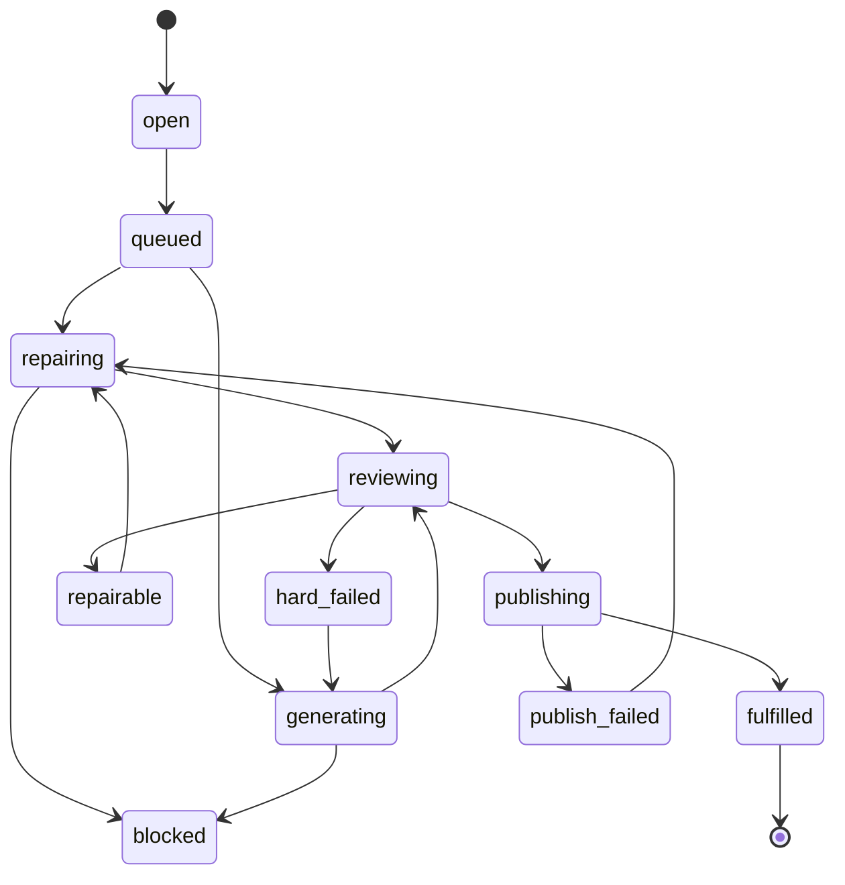
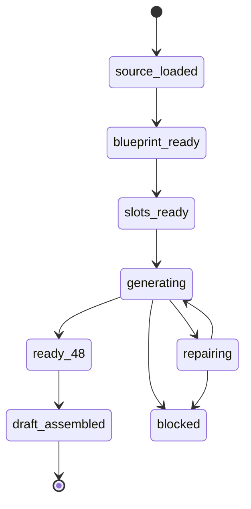

# AI 出题双线生产系统可执行落地规格

> 日期：2026-07-08  
> 状态：可执行主方案  
> 适用范围：AI 题库后台、真题 JSON 解析画像、大纲基线、科目训练 AI 出题、在线模考 AI 出题、候选治理、正式题库入库、数学渲染、双语版本、清理重测和上线处理  
> 主结论：大纲基线和真题画像是共用准备层；从 AI 出题开始必须分为“科目训练线”和“在线模考线”，两条线的任务、候选、正式资产、清理、统计和前端治理全部分开。

## 1. 目标

把现在的 AI 出题后台收敛成一个可以稳定生产题库的系统，而不是一个不断堆候选题的工具。

最终后台流程：

```text
共用准备层
  1. 大纲基线
  2. 真题 JSON 解析画像

分叉生产层
  A. 科目训练线
     topic/gap -> 生成/修复/重生 -> 门禁 -> 专项正式题库

  B. 在线模考线
     来源卷 -> 整卷蓝图 -> 48 题位 -> 生成/修复/重生 -> 在线模考候选池 -> 草稿卷装配
```

完成标准：

1. 科目训练题进入 `special_practice_questions` 并能被学生侧科目训练抽到。
2. 在线模考题按当前卷当前蓝图凑满 48 道可装配题，并能装配为草稿卷。
3. 候选题数量不再被当作成功指标。
4. 门禁失败、需要人工确认、建议重生、缺双语、数学不可渲染的题不能自动进入正式题库。
5. 已入库或已装配的题从异常候选治理台消失，只在正式资产区展示。

## 2. 非目标

1. 不做 PDF OCR。用户上传的是已经整理好的 JSON 或代码。
2. 不要求用户上传带画像维度的 JSON。用户上传的 JSON 是真题原文结构化；画像维度由系统解析和映射生成。
3. 不降低门禁换通过率。
4. 不把科目训练题和在线模考题混成一套正式题库。
5. 不让旧任务无限自动重试。
6. 不继续兼容旧混合口径作为主链路。开发期采用干净架构；线上通过清理、归档和迁移说明兜底。

## 3. 核心概念

### 3.1 大纲基线

大纲基线回答“这个学科能考什么”。

用途：

1. 决定学科、topic、知识点层级。
2. 给科目训练和在线模考提供共同的可考范围。
3. 作为生成前 readiness 的第一道校验。

大纲基线是共用源，不属于科目训练或在线模考任一方。

### 3.2 真题画像

真题画像回答“真实考试通常怎么考”。

用户上传的真题 JSON 应保持原题结构：

```ts
type UploadedSourceQuestionJson = {
  document: {
    subject: 'math' | 'physics' | 'chemistry';
    title: string;
    sourceType: 'past_paper' | 'prediction_paper' | 'user_provided';
    year?: number;
    language?: string;
  };
  questions: Array<{
    questionNumber: string;
    promptText: string;
    options?: Array<{ id: string; text: string }>;
    correctAnswer?: string;
    answerText?: string;
    explanation?: string;
  }>;
};
```

系统解析后生成画像维度：

```ts
type SourceQuestionProfile = {
  topicId: number;
  topicCode?: string;
  questionForm: string;
  cognitiveSkill: string;
  difficultyBand: 'basic' | 'medium' | 'hard';
  readingLoad: 'low' | 'medium' | 'high';
  calculationLoad: 'none' | 'light' | 'medium' | 'heavy';
  answerPattern?: string;
  distractorTypes?: string[];
  commonMisconceptions?: string[];
  estimatedTimeSeconds?: number;
  imageDependency?: boolean;
};
```

原则：

1. 真题 JSON 不要求用户提前填画像。
2. 画像由系统解析、归一化、映射、审核后产出。
3. `cognitiveSkill = unknown` 只能作为历史展示，不允许进入新生成 targetProfile。
4. 科目训练和在线模考都可以读取真题画像，但使用方式从 AI 出题开始分叉。

### 3.3 蓝图

蓝图是“怎么把画像转成出题位”的生产计划。

在线模考蓝图：

```text
一套来源卷 -> 48 个题位 -> 每个题位有 targetProfile -> 每题位补到 1 道合格题
```

科目训练不使用“48 题位蓝图”，而使用 topic/gap 补题计划：

```text
subject/topic/gap -> targetProfile -> 补到目标正式题数量
```

两者关系：

```text
大纲 + 真题画像 = 共用准备数据
在线模考蓝图 = 面向整卷题位的生产计划
科目训练 gap 计划 = 面向专项题库缺口的生产计划
```

## 4. 数据边界

### 4.1 AI scope 是硬边界

所有 AI 生成、修复、重生的题都必须写入 scope。

短期存储位置：

```text
csca_questions.generation_metadata.scope
csca_ai_generation_jobs.prompt_metadata.scope
```

长期建议增加物理字段：

```text
csca_questions.target_use_case
csca_questions.intended_use
csca_questions.scope_subject
csca_questions.scope_topic_id
csca_questions.scope_gap_key
csca_questions.mock_source_paper_id
csca_questions.mock_blueprint_id
csca_questions.mock_blueprint_slot_id
csca_ai_generation_jobs.target_use_case
csca_ai_generation_jobs.scope_key
```

### 4.2 科目训练 scope

```ts
type SubjectPracticeScope = {
  targetUseCase: 'subject_practice';
  intendedUse: 'subject_practice';
  subject: 'math' | 'physics' | 'chemistry';
  syllabusVersion: string;
  topicId: number;
  topicCode?: string;
  gapKey: string;
  generationMode:
    | 'subject_gap_fulfillment'
    | 'subject_candidate_repair'
    | 'subject_candidate_regenerate';
  generatedAt: string;
  generatorVersion: string;
  promptVersion: string;
  reviewVersion?: string;
};
```

缺任一关键字段时：

1. 不允许自动入库。
2. 不计入 topic/gap 完成。
3. 只能进入异常治理或旧数据归档。

### 4.3 在线模考 scope

```ts
type OnlineMockExamScope = {
  targetUseCase: 'online_mock_exam';
  intendedUse: 'mock_candidate';
  subject: 'math' | 'physics' | 'chemistry';
  mockSourcePaperId: number;
  mockBlueprintId: number;
  mockBlueprintSlotId: number;
  mockSlotNumber: number;
  generationMode:
    | 'online_mock_slot_fulfillment'
    | 'online_mock_candidate_repair'
    | 'online_mock_candidate_regenerate';
  generatedAt: string;
  generatorVersion: string;
  promptVersion: string;
  reviewVersion?: string;
};
```

在线模考 scope 不能被科目训练统计、候选、正式题和清理接口命中。

### 4.4 正式资产口径

科目训练正式题：

```text
csca_questions.status = approved
+ scope.targetUseCase = subject_practice
+ scope.intendedUse = subject_practice
+ special_practice_questions.source_question_id = csca_questions.id
+ special_practice_questions.status in active / published
+ 双语完整
+ 数学可渲染
```

在线模考正式候选：

```text
csca_questions.status = approved
+ scope.targetUseCase = online_mock_exam
+ scope.mockBlueprintId = 当前蓝图
+ scope.mockBlueprintSlotId = 当前题位
+ review_metadata.mockExamApproval.status in approved_for_mock_exam_assembly / assembled_in_mock_exam_draft
+ 双语完整
+ 数学可渲染
```

在线模考草稿卷：

```text
mock_exam_questions.paper_id = draftPaperId
+ 48 道题
+ 每道题来自当前 mockBlueprintId
+ 每道题回写 assembled 状态
```

## 5. 状态模型

### 5.1 候选题状态

| 状态 | 含义 | 后续动作 |
| --- | --- | --- |
| `candidate_created` | 已生成，还没复审 | 进入 reviewer |
| `gate_passed` | 通过全部门禁 | 自动进入对应正式资产 |
| `repairable` | 有局部问题但可原题优化 | 原题修复后重跑门禁 |
| `hard_failed` | 硬伤，不适合原题修复 | 归档并重生替代题 |
| `publish_failed` | 门禁通过但入库映射失败 | 重试映射或报错治理 |
| `banked` | 已进入科目训练正式题库 | 不显示在异常候选 |
| `assembled` | 已装配进在线模考草稿卷 | 不显示待装配 |
| `archived` | 不再处理 | 只在历史筛选可查 |

### 5.2 科目训练 gap 状态



`fulfilled` 的唯一判断：

```text
approvedPracticeCount >= targetPracticeCount
```

### 5.3 在线模考卷状态



`ready_48` 的判断：

```text
当前 mockBlueprintId 下 48 个 slot 均有 1 道 gate_passed 候选
```

`draft_assembled` 的判断：

```text
当前 draft paper 下有 48 道 mock_exam_questions
+ 每道题回写 assembled_in_mock_exam_draft
```

## 6. 生成与修复策略

### 6.1 总原则

1. 可修复问题先原题修复。
2. 硬伤才重生。
3. 每次修复或重生后必须重跑 reviewer、validator、gate。
4. 不能因为候选增加就认为任务有进展。
5. 自动循环的进展指标是正式资产数量增长。

### 6.2 可原题修复的问题

| 问题 | 处理方式 |
| --- | --- |
| 正确答案标错 | 重算答案，修正 `correctAnswer` 和解析 |
| 多个正确答案 | 调整干扰项，保证唯一正确 |
| 选项过于接近或等价 | 重写干扰项，保持同一考点和难度 |
| 解析和答案冲突 | 以正确推导为准修正解析 |
| 解析步骤缺失 | 补充关键推导 |
| 缺英文版本 | 生成 `localizations.en`，保持数学一致 |
| LaTeX 不规范 | 标准化公式定界符、转义和命令 |
| 题干表达不清 | 保留考点，重写题干条件 |
| 弱画像信号 | 在不改变考点的前提下补齐 metadata |

修复 prompt 必须约束：

```text
Modify only fieldsToRepair.
Preserve subject, topic, targetProfile, targetUseCase and scope.
Do not introduce a new topic.
Do not reduce difficulty to pass the gate.
```

### 6.3 必须重生的问题

| 问题 | 处理方式 |
| --- | --- |
| topic 不匹配 | 归档原候选，按当前 topic 重生 |
| cognitiveSkill 完全不匹配 | 归档或重生 |
| 难度显著偏离且无法局部调整 | 重生 |
| 与真题高度相似 | 重生 |
| 与已入库题高度相似 | 重生 |
| 题干泄露答案 | 重生 |
| 条件不足、无解、不可解 | 重生 |
| 图像依赖缺失但题目必须用图 | 重生或阻塞 |

### 6.4 必须阻塞的问题

| 问题 | 阻塞原因 |
| --- | --- |
| 当前学科没有 active 大纲 | `syllabus_missing` |
| 任务要求画像但当前学科没有 active 真题画像 | `source_profile_missing` |
| targetProfile 仍有 unknown | `target_profile_incomplete` |
| provider 连续 schema invalid | `provider_schema_invalid` |
| 多轮没有正式入库增长 | `no_formal_progress` |

阻塞后不再无限生成。前端必须告诉管理员缺的是大纲、画像、provider 还是门禁质量问题。

## 7. 科目训练 worker

### 7.1 输入

```ts
type FulfillSubjectPracticeGapInput = {
  subject: 'math' | 'physics' | 'chemistry';
  topicId: number;
  gapKey: string;
  targetCount: number;
  useCase: 'subject_practice';
  autoRepair: true;
  autoPublish: true;
};
```

### 7.2 主循环

```ts
async function fulfillSubjectPracticeGap(input) {
  while (true) {
    const formalCount = await countFormalSubjectPracticeAssets(input);
    if (formalCount >= input.targetCount) {
      await archiveRedundantJobs(input);
      return { status: 'fulfilled', formalCount };
    }

    const readiness = await assertSubjectPracticeReadiness(input);
    if (!readiness.ok) {
      return block(input, readiness.reason);
    }

    const repairable = await findRepairableSubjectCandidate(input);
    const candidate = repairable
      ? await repairCandidateInPlace(repairable, readiness.targetProfile)
      : await generateFreshSubjectCandidate(input, readiness.targetProfile);

    const reviewed = await reviewAndGate(candidate);

    if (reviewed.gateDecision === 'passed') {
      await publishToSpecialPractice(reviewed.question, input);
    } else if (reviewed.repairStrategy === 'repair_in_place') {
      await markRepairable(reviewed.question, reviewed.repairFeedback);
    } else {
      await archiveAndScheduleReplacement(reviewed.question, reviewed.reason);
    }

    if (await exceededNoFormalProgressLimit(input)) {
      return block(input, 'no_formal_progress');
    }
  }
}
```

### 7.3 停止条件

停止生成的条件：

```text
formalCount >= targetCount
```

暂停生成的条件：

```text
readiness failed
provider unavailable
no formal progress after N cycles
repair exhausted for all available candidates
```

不能停止的条件：

```text
candidateCount >= targetCount
reviewedCount >= targetCount
humanReviewCount >= targetCount
```

## 8. 在线模考 worker

### 8.1 输入

```ts
type FulfillMockExamBlueprintInput = {
  subject: 'math' | 'physics' | 'chemistry';
  mockSourcePaperId: number;
  mockBlueprintId: number;
  targetSlotCount: 48;
  useCase: 'online_mock_exam';
  autoRepair: true;
};
```

### 8.2 主循环

```ts
async function fulfillMockExamBlueprint(input) {
  while (true) {
    const readySlots = await countReadyMockSlots(input.mockBlueprintId);
    if (readySlots >= 48) {
      await archiveRedundantMockJobs(input);
      return { status: 'ready_48', readySlots };
    }

    const readiness = await assertMockExamReadiness(input);
    if (!readiness.ok) {
      return block(input, readiness.reason);
    }

    const slot = await nextUnfulfilledSlot(input.mockBlueprintId);
    const repairable = await findRepairableMockCandidate(slot);
    const candidate = repairable
      ? await repairMockCandidateInPlace(repairable, slot.targetProfile)
      : await generateFreshMockCandidate(slot, slot.targetProfile);

    const reviewed = await reviewAndGate(candidate);

    if (reviewed.gateDecision === 'passed') {
      await approveForMockExamAssembly(reviewed.question, slot);
    } else if (reviewed.repairStrategy === 'repair_in_place') {
      await markRepairable(reviewed.question, reviewed.repairFeedback);
    } else {
      await archiveAndScheduleSlotReplacement(reviewed.question, slot);
    }
  }
}
```

### 8.3 装配规则

装配草稿卷前必须满足：

```text
mockBlueprintId = 当前蓝图
readySlotCount = 48
每个 slot 只有 1 道选中的可装配题
每道题双语完整
每道题数学可渲染
```

装配后必须：

```text
创建或更新 draft mock_exam_papers
写入 48 条 mock_exam_questions
回写每道 csca_questions.review_metadata.mockExamApproval.status = assembled_in_mock_exam_draft
写入 assembledDraftPaperId / assembledAt
候选治理台不再显示已装配题
正式资产区显示已装配状态
```

## 9. 门禁

### 9.1 通用硬门禁

所有 AI 自动入库题必须满足：

```text
scope 完整
targetUseCase 正确
sourceType = ai
status = approved
非 fallback
非 smoke
非 legacy
非 human_review
非 needs_edit
非 review_failed
非 regenerate
数学可渲染
双语完整
与真题不过度相似
与已入库题不过度相似
答案唯一且正确
解析与答案一致
```

### 9.2 数学门禁

后端门禁检查：

1. 题干、选项、答案、解析、英文版本都检查。
2. 禁止裸露错误转义，例如用户可见 `\\frac`、`\\sqrt`、`\\dfrac`。
3. 检查 LaTeX 定界符是否成对。
4. 检查自然语言被错误包进数学环境。
5. 检查 KaTeX 能渲染核心公式。

前端渲染要求：

1. 后台候选、已审核资产、专项题库、在线模考题库全部使用统一 `MathContent`。
2. CSS 不能对 KaTeX 内部 span 全局套按钮/标签样式。
3. 长公式允许换行，不允许撑破选项卡片。
4. 解析区域公式和中文文本不能重叠。

### 9.3 双语门禁

必须存在：

```ts
generation_metadata.localizations.zh.prompt
generation_metadata.localizations.zh.options.A-D
generation_metadata.localizations.zh.explanation
generation_metadata.localizations.en.prompt
generation_metadata.localizations.en.options.A-D
generation_metadata.localizations.en.explanation
```

门禁通过题缺英文版本时，不允许入库，只能进入 repair 补英文。

## 10. 前端信息架构

### 10.1 总体布局

AI 题库后台应按流程而不是按内部表排列：

```text
1 共用准备
  1.1 大纲基线
  1.2 真题画像

2 科目训练线
  2.1 缺口概览
  2.2 自动补题任务
  2.3 异常候选治理
  2.4 已入库专项题

3 在线模考线
  3.1 来源卷选择
  3.2 整卷蓝图
  3.3 48 题位补齐
  3.4 异常候选治理
  3.5 已审核候选资产
  3.6 草稿卷装配
```

### 10.2 科目训练线 UI 口径

关键文案：

```text
正式题达标：X/Y
候选异常：N
优先修复：M
硬伤替代：K
当前 topic/gap：...
```

按钮：

1. `补齐正式题`：启动 worker，目标是 formal count 达标。
2. `刷新本板块`：只刷新科目训练线，不跳回流程总览。
3. `清理当前 scope`：先 dry-run，再确认删除。
4. `查看异常候选`：只显示未入库异常题。

不应出现：

1. 把候选题数量当完成数量。
2. 已入库题仍显示为待处理候选。
3. 在线模考候选出现在科目训练线。

### 10.3 在线模考线 UI 口径

关键文案：

```text
当前来源卷：数学模拟卷 1
蓝图：#17 active
题位：48 ready / 0 blocked
整卷完成：48/48
草稿卷：未装配 / 已装配 #ID
```

按钮：

1. `生成/加载整卷蓝图`
2. `加载题位`
3. `补齐 48 题`
4. `刷新本板块`
5. `装配草稿卷`
6. `清理当前卷生成结果`

卷隔离规则：

```text
切换卷 1 -> 卷 2 后，候选、任务、已审核资产、装配状态必须全部按卷 2 查询。
```

## 11. 后端改造清单

### 11.1 `backend/src/ai-questioning/ai-questioning.service.ts`

必须实现：

1. scope 写入和读取统一 helper。
2. 生成队列按 `targetUseCase` 拉取，不跨线消费。
3. 科目训练 formal count 只查 `special_practice_questions` 映射。
4. 在线模考候选只查当前 `mockBlueprintId/mockBlueprintSlotId`。
5. repair-first backlog 先于 fresh generation。
6. hard failure 归档并替代，不无限原题修复。
7. no formal progress 阻塞。
8. 入库后写入版本、时间和正式资产 metadata。
9. 清理接口支持当前 scope dry-run 和确认删除。

### 11.2 `backend/src/ai-questioning/question-prompt-builder.service.ts`

必须实现：

1. subject practice 和 online mock exam 分别构造 prompt。
2. repair prompt 只允许修改 `fieldsToRepair`。
3. fresh regeneration prompt 明确避开失败模式。
4. 生成 prompt 强制输出双语结构。
5. 数学输出规范写进 prompt。
6. targetProfile 中不允许 unknown。

### 11.3 `backend/src/ai-questioning/source-question-profile-normalizer.ts`

必须实现：

1. 从原始真题 JSON 推断 `questionForm`。
2. 推断 `cognitiveSkill`，不能默认为 unknown 直接用于新任务。
3. 推断 `readingLoad`、`calculationLoad`。
4. 解析失败要写入可解释原因。
5. 支持重新解析旧真题 JSON 并更新画像。

### 11.4 `backend/src/csca-mock-exam/csca-mock-exam.service.ts`

必须实现：

1. 当前卷当前蓝图隔离。
2. 48/48 判断。
3. 装配草稿卷后状态回写。
4. 在线模考线生成任务 useCase 固定为 `online_mock_exam`。
5. 清理当前卷不影响科目训练和其他卷。

### 11.5 `backend/src/csca-special-practice/*`

必须实现：

1. 学生侧只消费 subject_practice 正式题。
2. 明确排除 online_mock_exam、fallback、smoke、legacy unknown-scope 题。
3. 手工专项题库和 AI 入库题可以共存。
4. 错题、掌握度、曝光记录识别 AI 入库题来源。

## 12. 前端改造清单

### 12.1 `frontend/src/pages/AdminAIQuestionBankPage.tsx`

必须实现：

1. 共用准备、科目训练线、在线模考线分区展示。
2. 当前 activeUseCase 决定刷新、任务、候选、正式资产的查询参数。
3. 板块内刷新不重置到总览。
4. 切换 mock 卷时清空旧卷局部状态并重新加载当前卷数据。
5. 清理操作先 dry-run，再确认。

### 12.2 `frontend/src/components/admin/ai-question-bank/CoverageWorkPanel.tsx`

必须实现：

1. 科目训练只显示正式入库进度。
2. 展示 repair-first、hard-regenerate、blocked 原因。
3. 达标后按钮变为已完成，不允许继续生成。

### 12.3 `frontend/src/components/admin/ai-question-bank/MockExamProductionPanel.tsx`

必须实现：

1. 来源卷、蓝图、题位、任务、装配状态全部按当前卷过滤。
2. 48/48 之前不允许装配。
3. 装配后显示 `已装配草稿卷 #ID`。
4. 已装配题不显示待装配。

### 12.4 `frontend/src/components/admin/ai-question-bank/CandidateReviewPanel.tsx`

必须实现：

1. 默认只显示未入库异常候选。
2. 支持筛选：可修复、硬伤、复审失败、已归档。
3. 不显示已 banked 或 assembled 的正常题。
4. 每条候选展示失败原因、修复策略、重试次数、版本和时间。

### 12.5 `frontend/src/components/admin/ai-question-bank/PublishedQuestionPanel.tsx`

必须实现：

1. 科目训练正式资产和在线模考正式资产分 useCase 查询。
2. 按正式入库或装配更新时间倒序。
3. 显示生成时间、更新时间、正式入库时间、版本、prompt、reviewer、schema、targetUseCase。
4. 提供单题删除和批量清理入口，但必须二次确认。

### 12.6 数学渲染组件

涉及页面必须使用统一 `MathContent`：

1. AI 题库候选。
2. 已审核资产。
3. 科目训练后台题目列表。
4. 在线模考后台题目列表。
5. 学生侧科目训练答题页。
6. 学生侧在线模考答题页。

CSS 要求：

1. 不对 `.katex span` 全局加边框、背景、flex。
2. 选项卡片内公式可换行。
3. 解析区公式和中文行高不重叠。
4. 长公式不横向撑破页面。

## 13. API 设计

### 13.1 Readiness

```http
GET /admin/ai-questioning/readiness?subject=math&useCase=subject_practice
GET /admin/ai-questioning/readiness?subject=math&useCase=online_mock_exam
```

返回：

```ts
type ReadinessResponse = {
  ok: boolean;
  subject: string;
  useCase: 'subject_practice' | 'online_mock_exam';
  syllabus: { active: boolean; version?: string };
  sourceProfile: { active: boolean; documentId?: number; profileVersion?: string };
  blockers: Array<{ code: string; message: string }>;
};
```

### 13.2 科目训练补题

```http
POST /admin/ai-questioning/subject-practice/gaps/:gapKey/fulfill
```

请求：

```ts
{
  subject: 'math';
  topicId: 123;
  targetCount: 3;
  autoRepair: true;
  autoPublish: true;
}
```

返回：

```ts
{
  status: 'queued' | 'fulfilled' | 'blocked';
  formalCount: number;
  targetCount: number;
  repairFirst: { handled: number; regenerated: number };
  taskId?: number;
  blockers?: string[];
}
```

### 13.3 在线模考补题

```http
POST /admin/mock-exam/blueprints/:blueprintId/fulfill
```

请求：

```ts
{
  subject: 'math';
  mockSourcePaperId: 1;
  targetSlotCount: 48;
  autoRepair: true;
}
```

返回：

```ts
{
  status: 'queued' | 'ready_48' | 'blocked';
  readySlots: number;
  targetSlots: 48;
  taskId?: number;
}
```

### 13.4 候选查询

```http
GET /admin/ai-questioning/candidates?useCase=subject_practice&subject=math&topicId=123&status=abnormal
GET /admin/ai-questioning/candidates?useCase=online_mock_exam&mockBlueprintId=17&status=abnormal
```

默认 `status=abnormal`，不返回已入库和已装配题。

### 13.5 正式资产查询

```http
GET /admin/ai-questioning/published?useCase=subject_practice&subject=math
GET /admin/ai-questioning/published?useCase=online_mock_exam&mockBlueprintId=17
```

默认按正式更新时间倒序。

### 13.6 清理

```http
POST /admin/ai-questioning/cleanup/dry-run
POST /admin/ai-questioning/cleanup/confirm
```

请求：

```ts
{
  targetUseCase: 'subject_practice' | 'online_mock_exam';
  subject?: 'math' | 'physics' | 'chemistry';
  topicId?: number;
  gapKey?: string;
  mockBlueprintId?: number;
  mockBlueprintSlotId?: number;
  includeCandidates: true;
  includeJobs: true;
  includeApprovedAssets: boolean;
  includeDraftMockQuestions: boolean;
}
```

清理规则：

1. 默认不删正式资产。
2. 删除正式资产必须显式 `includeApprovedAssets = true`。
3. 科目训练清理不影响在线模考。
4. 在线模考卷 2 清理不影响卷 1。
5. dry-run 必须返回将删除的数量和样例 ID。

## 14. 版本和时间记录

每道 AI 题必须能看出新旧。

必须写入：

```ts
type AIQuestionVersionMetadata = {
  generatedAt: string;
  updatedAt: string;
  publishedAt?: string;
  assembledAt?: string;
  generatorVersion: string;
  generatorProvider: string;
  generationSchemaVersion: string;
  promptVersion: string;
  reviewerVersion: string;
  reviewScore?: number;
  gateVersion: string;
  profileVersion?: string;
  syllabusVersion?: string;
  sourceProfileSnapshotHash?: string;
};
```

前端必须展示：

1. 生成时间。
2. 最近更新时间。
3. 正式入库时间或装配时间。
4. 题版。
5. prompt 版本。
6. reviewer 版本。
7. schema 版本。
8. targetUseCase。

## 15. 清理和重新生成策略

### 15.1 开发环境

开发期允许干净清理：

1. 清理当前 scope 的候选。
2. 清理当前 scope 的任务。
3. 清理当前 scope 的 AI 正式资产。
4. 保留手工题库。
5. 保留真题 JSON 和大纲基线。

### 15.2 线上环境

线上部署不直接硬删用户已使用题。

推荐策略：

1. 新链路只统计有完整 scope 的新题。
2. 旧混合题保留给已有用户记录。
3. 旧候选和旧任务归档，不参与自动重试。
4. 管理员可按 scope 清理测试数据。
5. 上线前执行 dry-run 报告，确认影响范围。

## 16. 实施顺序

### Phase 0：口径锁定

产出：

1. 本文档作为主方案。
2. `targetUseCase`、scope、formal count、gate passed 的定义写入规则测试。
3. 明确大纲和画像是共用准备层，出题后分叉。

验收：

1. 团队不再用候选数量判断成功。
2. 前后端字段命名一致。

### Phase 1：数据边界和查询隔离

后端任务：

1. scope helper。
2. 候选查询按 useCase 过滤。
3. 正式资产查询按 useCase 过滤。
4. mock 卷按 blueprintId 过滤。
5. 科目训练按 topic/gap 过滤。

前端任务：

1. activeUseCase 贯穿所有请求。
2. 切换 mock 卷清空旧状态并刷新。
3. 板块内刷新。

验收：

1. 科目训练看不到在线模考候选。
2. 在线模考卷 2 看不到卷 1 候选。
3. 清理当前 scope 不误删其他 scope。

### Phase 2：正式题完成口径

后端任务：

1. 科目训练 formal count 查 `special_practice_questions`。
2. 在线模考 ready count 查当前蓝图 48 个题位。
3. 已入库或已装配状态回写。

前端任务：

1. 科目训练显示 `正式题达标 X/Y`。
2. 在线模考显示 `整卷完成 X/48`。
3. 达标后按钮禁用并提示完成。

验收：

1. 48 个候选但 0 个正式题时，科目训练不能显示完成。
2. 在线模考 47/48 不允许装配。
3. 48/48 后停止继续生成。

### Phase 3：repair-first

后端任务：

1. 分类 gate 失败原因。
2. 可修复题优先原题修复。
3. 修复超过阈值转 hard regenerate。
4. hard failure 归档并替代。
5. no formal progress 阻塞。

前端任务：

1. 异常候选展示修复策略。
2. 展示修复次数和失败原因。
3. 展示自动修复和硬伤替代进度。

验收：

1. 多正确答案题优先修选项，而不是直接新生成。
2. 缺英文版本题优先补英文。
3. topic mismatch 不做原题修复。

### Phase 4：数学和双语硬门禁

后端任务：

1. 数学文本 validator。
2. 双语 completeness gate。
3. 入库前强制检查。
4. 手工编辑后清除旧 metadata 并重跑门禁。

前端任务：

1. 所有题目展示统一 `MathContent`。
2. 修复 KaTeX span 样式污染。
3. 长公式和解析区域布局验证。

验收：

1. 通过门禁题都有英文版本。
2. 后台不展示裸 `\\frac`。
3. 科目训练和在线模考答题页公式不重叠。

### Phase 5：用户侧消费验证

后端任务：

1. special practice provider 只消费 subject_practice 正式题。
2. 排除 online_mock_exam、fallback、smoke、legacy。
3. 曝光、错题、掌握度记录来源。

前端任务：

1. 科目训练能抽到 AI 入库题。
2. 在线模考能加载装配草稿卷。

验收：

1. 新入库科目题能在学生侧出现。
2. 在线模考题不出现在科目训练。
3. 科目训练题不出现在在线模考草稿卷。

### Phase 6：清理和上线

后端任务：

1. cleanup dry-run。
2. cleanup confirm。
3. 单题删除。
4. 批量按 scope 删除。
5. 归档旧任务。

前端任务：

1. 删除前显示影响数量。
2. 明确当前 useCase、subject、topic、mockBlueprintId。
3. 删除后局部刷新。

验收：

1. 能清理当前数学 mock 卷测试数据并重新生成。
2. 能清理科目训练当前 topic AI 题并重新生成。
3. 线上保留手工题和用户历史。

## 17. 测试清单

### 17.1 自动规则测试

建议维护在：

```text
scripts/csca-ai-questioning-rules-test.cjs
```

必须覆盖：

1. scope 必填。
2. generation queue 按 useCase 拉取。
3. 科目训练 formal count 不看候选。
4. 在线模考 48/48 才完成。
5. repair-first 在 fresh generation 之前。
6. hard failure 不原题修复。
7. 双语门禁。
8. 数学门禁。
9. 已入库题不出现在异常候选。
10. mock 卷切换不串数据。
11. 清理接口 dry-run 先行。
12. 用户侧 provider 排除 online_mock_exam。

### 17.2 后端编译

```text
npm --prefix backend exec -- tsc -p backend/tsconfig.json --noEmit --incremental false --pretty false
```

### 17.3 前端编译

```text
npm --prefix frontend exec -- tsc -p frontend/tsconfig.json --noEmit --incremental false --pretty false
```

### 17.4 手工验收剧本

科目训练：

```text
1. 清理 math + subject_practice 当前 topic 测试数据。
2. 确认 math 大纲 active。
3. 确认 math 真题画像 active。
4. 启动补齐正式题。
5. 观察 repair-first 和生成任务。
6. 等待正式入库数达标。
7. 确认异常候选只剩未入库题。
8. 到学生侧科目训练抽题。
9. 检查数学公式和英文版本。
```

在线模考：

```text
1. 清理 math + mockBlueprintId 当前卷测试数据。
2. 选择数学模拟卷 1。
3. 生成或加载整卷蓝图。
4. 加载 48 题位。
5. 启动补齐 48 题。
6. 等待 48/48 ready。
7. 装配草稿卷。
8. 检查 48 道题状态为已装配。
9. 切换卷 2，确认卷 1 数据不显示。
10. 到学生侧在线模考答题页检查公式和英文版本。
```

## 18. 上线处理

上线前：

1. 跑规则测试、后端 tsc、前端 tsc。
2. 对线上库执行 dry-run 清理报告。
3. 归档旧 running/queued 任务，特别是缺大纲、缺画像、legacy unknown-scope 任务。
4. 不迁移旧混合候选到新正式统计。
5. 保留手工题库、已发布题和用户历史。

上线后：

1. 新任务必须带 scope。
2. 新正式统计只看完整 scope。
3. 运维页按 useCase 展示 provider、blocked、no progress。
4. 发现 provider schema invalid 时自动重试有限次数，之后 blocked。
5. 管理员通过 scope 清理和重新生成。

回滚策略：

1. 保留手工专项题库和手工在线模考题库。
2. 新 AI 题可按 scope 一键归档。
3. 不删除用户历史答题记录。
4. 如 AI worker 出现异常，关闭自动补题入口，但不影响手工题库使用。

## 19. 文件级执行索引

后端：

```text
backend/src/ai-questioning/ai-questioning.service.ts
backend/src/ai-questioning/ai-questioning.controller.ts
backend/src/ai-questioning/question-prompt-builder.service.ts
backend/src/ai-questioning/question-generator.service.ts
backend/src/ai-questioning/question-reviewer.service.ts
backend/src/ai-questioning/question-validator.service.ts
backend/src/ai-questioning/source-question-profile-normalizer.ts
backend/src/csca-mock-exam/csca-mock-exam.service.ts
backend/src/csca-mock-exam/csca-mock-exam.controller.ts
backend/src/csca-special-practice/adaptive-question-provider.service.ts
backend/src/csca-special-practice/csca-adaptive.service.ts
backend/prisma/schema.prisma
```

前端：

```text
frontend/src/pages/AdminAIQuestionBankPage.tsx
frontend/src/components/admin/ai-question-bank/CscaSyllabusWorkspace.tsx
frontend/src/components/admin/ai-question-bank/SourceReferenceWorkspace.tsx
frontend/src/components/admin/ai-question-bank/CoverageWorkPanel.tsx
frontend/src/components/admin/ai-question-bank/MockExamProductionPanel.tsx
frontend/src/components/admin/ai-question-bank/CandidateReviewPanel.tsx
frontend/src/components/admin/ai-question-bank/PublishedQuestionPanel.tsx
frontend/src/components/admin/ai-question-bank/QuestionBankTaskStatus.tsx
frontend/src/components/MathContent.tsx
frontend/src/styles/admin-work.part-01.css
frontend/src/styles/admin-work.part-03.css
frontend/src/pages/AdminSpecialPracticePage.tsx
frontend/src/pages/AdminMockExamPage.tsx
```

测试：

```text
scripts/csca-ai-questioning-rules-test.cjs
```

## 20. 最小可交付切片

第一批必须交付：

1. scope 查询隔离。
2. 科目训练 formal count。
3. 在线模考当前卷隔离。
4. repair-first。
5. 双语和数学硬门禁。
6. 异常候选只显示未入库题。
7. 清理 dry-run 和确认删除。
8. 规则测试防回归。

第二批交付：

1. 物理字段迁移。
2. 更细粒度 provider 并发和限流。
3. 画像版本对比和重解析批处理。
4. 运维看板按 provider、useCase、subject 聚合。
5. 已入库题质量回采和自动下架建议。

## 21. 最终验收

必须全部满足：

1. 大纲和真题画像在页面上作为共用准备层展示。
2. 科目训练线和在线模考线在前端分开。
3. 科目训练候选、任务、正式题、清理互不污染在线模考。
4. 在线模考不同卷互不污染。
5. 科目训练 topic/gap 能自动补到正式题达标。
6. 在线模考当前卷能自动补到 48/48。
7. 可修复题优先原题修复。
8. 硬伤题重生而不是反复修。
9. 无正式入库增长时停止并提示原因。
10. 通过门禁题都有中英文版本。
11. 通过门禁题数学渲染正常。
12. 已入库题不出现在异常候选。
13. 已装配题不显示待装配。
14. 学生侧科目训练能消费 AI 入库题。
15. 学生侧在线模考能消费装配草稿卷。
16. 清理功能可以按 scope 删除测试数据，不影响其他线。

达到以上标准后，AI 出题后台才算从“候选生成工具”升级为“正式题库生产系统”。

## 22. 执行工单级拆分

本节用于直接拆开发任务。每个工单必须同时包含后端实现、前端呈现、规则测试和手工验收口径；不能只改一个局部。

### 22.1 工单 A：准备层统一

目标：

```text
大纲基线、真题画像、画像版本和 readiness 状态在一个准备层内统一展示。
```

后端：

1. readiness API 返回：

```ts
type AiQuestioningReadiness = {
  subject: string;
  syllabus: {
    status: 'active' | 'missing' | 'stale';
    syllabusId?: number;
    version?: string;
    appliedAt?: string;
  };
  sourceProfile: {
    status: 'active' | 'missing' | 'stale';
    profileId?: number;
    profileVersion?: string;
    sourceQuestionCount: number;
    mappedQuestionCount: number;
    unknownCognitiveSkillCount: number;
    lastBuiltAt?: string;
  };
};
```

2. 缺大纲和缺真题画像必须分开报错：

```text
syllabus_missing: 当前学科还没有已应用的大纲
source_profile_missing: 当前学科还没有可用真题画像
source_profile_stale: 真题画像版本落后于当前解析版本
target_profile_incomplete: targetProfile 缺少必要画像维度
```

3. `source_profile_missing`、`source_profile_stale`、`target_profile_incomplete` 都是非重试型前置阻塞，不能进入自动生成循环。

前端：

1. 准备层展示大纲状态和真题画像状态。
2. 失败原因中不再把“缺真题画像”显示为“缺大纲”。
3. 前置阻塞状态显示修复动作：

```text
缺大纲 -> 上传并应用大纲
缺真题画像 -> 导入真题 JSON 并生成画像
画像过期 -> 重新解析画像
targetProfile 不完整 -> 重建题位/重建 gap 计划
```

测试：

1. 模拟有大纲但无画像，返回 `source_profile_missing`。
2. 模拟无大纲但有画像，返回 `syllabus_missing`。
3. 这两类失败都不会被自动重试 worker 拾取。

验收：

```text
选择化学/物理但未上传真题画像时，页面提示“缺真题画像”，不提示“缺大纲”。
选择数学且画像存在时，可以进入生成。
```

### 22.2 工单 B：双线数据隔离

目标：

```text
科目训练线和在线模考线从任务、候选、正式资产、清理、统计到前端列表全部隔离。
```

后端：

1. 所有 AI 生成题必须有：

```text
targetUseCase = subject_practice | online_mock_exam
intendedUse = subject_practice | mock_candidate
scopeKey
```

2. 科目训练查询只允许命中：

```sql
target_use_case = 'subject_practice'
```

3. 在线模考查询只允许命中：

```sql
target_use_case = 'online_mock_exam'
AND mock_blueprint_id = :currentBlueprintId
AND mock_source_paper_id = :currentSourcePaperId
```

4. mock 卷切换时不得继续展示上一卷候选、任务、草稿卷或已装配状态。

前端：

1. 页面流程布局：

```text
共用准备层
  - 大纲基线
  - 真题画像

科目训练线
  - gap 健康
  - 科目候选治理
  - 专项正式题

在线模考线
  - 来源卷
  - 整卷蓝图
  - 48 题位
  - 模考候选治理
  - 草稿卷装配
```

2. 不同线使用不同标题和按钮：

```text
科目训练：补齐专项题 / 发布到专项题库
在线模考：补齐整卷题位 / 装配草稿卷
```

测试：

1. 生成 mock 题不会出现在科目训练候选。
2. 生成 subject 题不会出现在在线模考候选。
3. 切换数学模拟卷 1 到卷 2，卷 1 的候选和装配状态消失。

### 22.3 工单 C：候选生命周期重构

目标：

```text
候选区只展示需要治理的异常候选；已通过并入库/装配的题进入正式资产区。
```

状态定义：

| 状态 | 含义 | 前端位置 |
| --- | --- | --- |
| `generated` | 刚生成，未审 | 任务过程，不作为最终候选 |
| `reviewing` | 审核中 | 任务过程 |
| `repairable` | 可原题修复 | 异常候选治理 |
| `hard_failed` | 不可修复，需要替代 | 异常候选治理或归档 |
| `gate_passed` | 门禁通过但未入正式资产 | 短暂停留，worker 自动处理 |
| `published_to_subject_practice` | 已入专项正式题库 | 科目训练正式资产 |
| `assembled_to_mock_draft` | 已装配模考草稿卷 | 在线模考正式资产 |
| `archived` | 已归档 | 默认不显示 |

后端：

1. 异常候选查询默认只返回：

```text
repairable
hard_failed
publish_failed
review_failed
validation_failed
```

2. 不返回：

```text
gate_passed 且已经入库
published_to_subject_practice
assembled_to_mock_draft
archived
```

3. 已入库和已装配状态必须回写到候选 metadata。

前端：

1. 候选区标题改为：

```text
科目训练 AI 候选治理
在线模考 AI 候选治理
```

2. 说明文案：

```text
这里只展示未能自动进入正式题库的异常候选，用于查看失败原因、复审、编辑、拒绝或归档。
```

3. 正式资产区标题：

```text
已入库专项题
已装配模考题
```

验收：

```text
自动生成 48 道模考合格题并装配后，异常候选区不再显示这 48 道题。
正式资产区显示 48/48 已装配。
```

### 22.4 工单 D：自动循环和收敛条件

目标：

```text
系统不是无限生产候选，而是自动补齐目标正式资产数量。
```

科目训练收敛口径：

```text
topic/gap 的正式入库题数 >= targetCount
```

在线模考收敛口径：

```text
当前 mockBlueprintId 的 48 个题位，每个题位都有 1 道可装配题
```

循环策略：

```text
1. 查询 open gaps / open slots。
2. 优先找 repairable 候选。
3. 可修复则原题修复。
4. 硬伤则归档并重生替代。
5. 通过门禁后自动进入对应正式资产。
6. 正式资产数增长后刷新目标缺口。
7. 达标后停止所有相关 queued/running 后续任务。
8. 连续 N 轮无正式资产增长则 blocked。
```

建议默认阈值：

```text
maxRepairAttemptsPerCandidate = 2
maxFreshAttemptsPerGapOrSlot = 6
maxNoProgressRounds = 3
maxWorkerConcurrency = 2
maxProviderConcurrency = 2
```

阻塞判定：

| 阻塞类型 | 是否自动重试 | 管理员动作 |
| --- | --- | --- |
| 缺大纲 | 否 | 上传并应用大纲 |
| 缺真题画像 | 否 | 上传真题 JSON 并生成画像 |
| targetProfile 不完整 | 否 | 重建画像/蓝图/gap |
| Provider 超时 | 是，有限重试 | 检查 Provider |
| Provider schema invalid | 是，有限重试 | 调整 prompt/schema |
| 连续无合格题增长 | 否 | 查看失败聚类和 prompt |
| 数学不可渲染 | 可修复 | 修复 LaTeX 后重审 |
| 双语缺失 | 可修复 | 补双语后重审 |

### 22.5 工单 E：科目题优化专项

目标：

```text
把在线模考线已经验证过的质量闭环迁移到科目训练线，但保持数据边界独立。
```

科目训练当前重点：

1. 不再只看候选数量。
2. 用正式入库数量判断 topic/gap 是否完成。
3. 需要人工确认、建议重生、门禁失败的题不进入专项题库。
4. 可修复题先原题修复。
5. 不能修复的硬伤题归档后生成替代题。
6. 已入库题从异常候选治理台消失。
7. 学生侧只消费 `published_to_subject_practice` 的正式题。

科目训练 targetProfile 必填：

```ts
type SubjectPracticeTargetProfile = {
  subject: string;
  topicId: number;
  topicCode: string;
  difficultyBand: 'basic' | 'medium' | 'hard';
  questionForm: string;
  cognitiveSkill: string;
  readingLoad: 'low' | 'medium' | 'high';
  calculationLoad: 'none' | 'light' | 'medium' | 'heavy';
  sourceProfileVersion: string;
};
```

禁止：

```text
cognitiveSkill = unknown
difficultyBand = unknown
questionForm = unknown
topicId missing
sourceProfileVersion missing
```

当真题画像更新后：

1. 新任务自动使用最新 active 画像版本。
2. 旧候选保留旧版本 metadata，但不参与新缺口完成统计。
3. 后台提供按 subject/topic 清理旧 AI 测试题的 dry-run。
4. 若画像版本变化导致 targetProfile 变化，旧 queued/running 任务归档。

验收：

```text
数学某 topic 目标 10 道正式题。
启动补题后，候选可能产生很多，但只有 published_to_subject_practice 才计数。
达到 10 道后，按钮显示“该缺口已完成”，不再继续生成。
```

### 22.6 工单 F：在线模考整卷装配专项

目标：

```text
一套模考卷必须凑齐 48 道合格题，才算整卷完成；完成后自动或一键装配为草稿卷。
```

后端：

1. 每个 slot 最多选择 1 道当前有效候选。
2. 48 个 slot 都 ready 后，整卷状态变为 `ready_to_assemble`。
3. 装配后：

```text
mockDraft.status = draft
candidate.status = assembled_to_mock_draft
candidate.mockDraftId = draftId
candidate.assembledAt = now
blueprint.status = assembled | ready
```

4. 装配失败时不回滚已通过候选，但整卷状态为 `assembly_failed`。

前端：

1. 48/48 前按钮显示：

```text
还差 X 题，继续自动补齐
```

2. 48/48 后按钮显示：

```text
整卷已完成，可装配草稿卷
```

3. 装配后显示：

```text
已装配草稿卷 #ID
```

4. 已装配题卡片状态：

```text
模考题 · 已装配
```

验收：

```text
卷 1 完成并装配后，切换卷 2 不显示卷 1 的 48 道题。
卷 1 正式资产区显示 48/48 已装配。
```

### 22.7 工单 G：数学渲染治理

目标：

```text
数学公式在后台候选、正式资产、科目训练学生侧和在线模考学生侧都稳定渲染，不被选项样式污染。
```

后端生成规范：

1. 数学公式统一用 LaTeX。
2. 行内公式使用 `$...$`。
3. 块级公式使用 `$$...$$`。
4. 不允许把自然语言包进数学环境。
5. 不允许输出孤立反斜杠、半截命令、未闭合括号。
6. 不允许把复杂选项拆成多层 HTML。

后端 validator：

```text
latexDelimiterBalanced
katexRenderable
noNaturalLanguageInsideMath
noBrokenEscapes
noNestedOptionMarkup
```

前端：

1. 所有题干、选项、答案、解析、双语版本统一使用 `MathContent`。
2. 选项布局只能作用在直接子元素，不能污染 KaTeX 内部 span。
3. 长公式横向滚动，不压缩到字符重叠。
4. 解析区使用正常行高，不能让根号、上下标和中文重叠。

CSS 要求：

```css
.question-option > .option-label { ... }
.question-option > .option-body { ... }
.math-content .katex { line-height: normal; }
.math-content .katex-display { overflow-x: auto; overflow-y: hidden; }
```

禁止：

```css
.question-option span { ... }
.question-option b { ... }
.answer-box span { ... }
```

验收页面：

```text
后台 AI 候选治理
后台已审核 AI 题
后台专项题库
后台模考题库
学生侧科目训练答题页
学生侧在线模考答题页
```

验收题型：

```text
不等式
函数
解析几何
概率
根号
分式
集合区间
上下标
中英文混排
```

### 22.8 工单 H：清理和重测

目标：

```text
开发期可以安全清理某条线、某个学科、某个 topic 或某套 mock 卷的 AI 测试数据。
```

清理 API 必须先 dry-run：

```ts
type CleanupAiQuestioningScopeRequest = {
  targetUseCase: 'subject_practice' | 'online_mock_exam';
  subject?: string;
  topicId?: number;
  mockSourcePaperId?: number;
  mockBlueprintId?: number;
  includeQueuedJobs?: boolean;
  includeFailedCandidates?: boolean;
  includeApprovedAssets?: boolean;
  dryRun: boolean;
  confirmToken?: string;
};
```

dry-run 返回：

```ts
type CleanupPreview = {
  jobs: number;
  candidates: number;
  approvedAssets: number;
  mockDrafts: number;
  studentAttemptsAffected: number;
  requiresConfirmation: boolean;
  confirmToken: string;
};
```

规则：

1. 默认不删正式资产。
2. 删除正式资产必须明确 `includeApprovedAssets=true`。
3. 有学生答题记录时不能物理删除，只能下架或归档。
4. 单题删除和批量删除都必须按 scope。
5. 清理后前端刷新当前板块，不跳回总览页。

### 22.9 工单 I：自动刷新和排序

目标：

```text
生成过程中后台板块自动刷新，新生成或新失败的候选排在前面，用户不需要整页刷新。
```

前端轮询：

```text
任务运行中：每 3 秒刷新任务状态和当前板块候选
任务空闲：每 15 秒刷新
页面不可见：暂停或降频
```

排序：

```sql
ORDER BY
  formal_asset_updated_at DESC NULLS LAST,
  updated_at DESC,
  created_at DESC,
  id DESC
```

板块刷新按钮：

```text
刷新当前候选
刷新当前正式资产
刷新任务状态
```

验收：

```text
生成中不刷新整页，新候选自动出现在第一页顶部。
用户停留在在线模考线时，刷新后仍停留在线内，不跳回流程总览。
```

## 23. 实施顺序

推荐顺序：

1. 准备层 readiness 和失败分类。
2. scope 数据边界和查询隔离。
3. 候选生命周期和正式资产口径。
4. 科目训练 formal count 改造。
5. 在线模考 48/48 和按卷隔离。
6. repair-first 自动循环。
7. 双语和数学硬门禁。
8. 前端双线布局、板块刷新和候选治理台。
9. 清理 dry-run 和确认删除。
10. 学生侧消费验证。
11. 运维页和上线清理脚本。

不建议先做：

1. 大量并发优化。
2. Provider 复杂调度。
3. 画像版本 diff 可视化。
4. 自动翻译历史旧题。

原因：

```text
当前最大风险不是速度，而是口径混乱和无法收敛。
先保证“生成什么、算什么、入哪里、怎么停止”正确，再提升效率。
```

## 24. 数据库建议迁移

短期可继续放在 metadata，但正式落地建议增加物理字段，便于索引和防串线。

### 24.1 csca_questions

```sql
ALTER TABLE csca_questions
  ADD COLUMN target_use_case VARCHAR(64),
  ADD COLUMN intended_use VARCHAR(64),
  ADD COLUMN scope_subject VARCHAR(32),
  ADD COLUMN scope_topic_id INTEGER,
  ADD COLUMN scope_gap_key VARCHAR(128),
  ADD COLUMN mock_source_paper_id INTEGER,
  ADD COLUMN mock_blueprint_id INTEGER,
  ADD COLUMN mock_blueprint_slot_id INTEGER,
  ADD COLUMN generation_version VARCHAR(128),
  ADD COLUMN prompt_version VARCHAR(128),
  ADD COLUMN review_version VARCHAR(128),
  ADD COLUMN source_profile_version VARCHAR(128),
  ADD COLUMN formal_asset_status VARCHAR(64),
  ADD COLUMN formal_asset_id INTEGER,
  ADD COLUMN formal_asset_updated_at TIMESTAMP;
```

### 24.2 csca_ai_generation_jobs

```sql
ALTER TABLE csca_ai_generation_jobs
  ADD COLUMN target_use_case VARCHAR(64),
  ADD COLUMN intended_use VARCHAR(64),
  ADD COLUMN scope_key VARCHAR(256),
  ADD COLUMN subject VARCHAR(32),
  ADD COLUMN topic_id INTEGER,
  ADD COLUMN mock_source_paper_id INTEGER,
  ADD COLUMN mock_blueprint_id INTEGER,
  ADD COLUMN mock_blueprint_slot_id INTEGER,
  ADD COLUMN failure_category VARCHAR(128),
  ADD COLUMN provider_failure_category VARCHAR(128),
  ADD COLUMN no_progress_rounds INTEGER DEFAULT 0;
```

### 24.3 索引

```sql
CREATE INDEX idx_csca_questions_subject_scope
  ON csca_questions(target_use_case, scope_subject, scope_topic_id, formal_asset_status);

CREATE INDEX idx_csca_questions_mock_scope
  ON csca_questions(target_use_case, mock_source_paper_id, mock_blueprint_id, mock_blueprint_slot_id, formal_asset_status);

CREATE INDEX idx_csca_generation_jobs_scope
  ON csca_ai_generation_jobs(target_use_case, scope_key, status, failure_category);
```

迁移策略：

1. 先写双字段：metadata + 物理字段。
2. 规则测试确保新查询优先物理字段。
3. 完成稳定后再考虑清理旧 metadata 查询。

## 25. Prompt 和 reviewer 要求

### 25.1 生成 prompt 必须带的约束

```text
你正在为 {targetUseCase} 生成题目。
必须严格匹配 targetProfile。
必须输出 zh 和 en 两套完整版本。
数学表达必须使用可渲染 LaTeX。
不要照抄或轻微改写真题。
不要输出过于简单的 arithmetic-only 题，除非 targetProfile 明确要求 basic + calculation light。
选项必须互斥，且只有一个正确答案。
解析必须证明正确选项，并说明关键干扰项为什么错。
```

### 25.2 reviewer 必须返回

```ts
type ReviewerDecision = {
  decision: 'pass' | 'revise' | 'reject';
  score: number;
  issues: Array<{
    code:
      | 'missing_bilingual_localization'
      | 'localization_mismatch'
      | 'math_render_error'
      | 'wrong_answer'
      | 'multiple_correct_answers'
      | 'option_too_close'
      | 'option_too_weak'
      | 'topic_mismatch'
      | 'difficulty_mismatch'
      | 'source_similarity_high'
      | 'target_profile_incomplete';
    severity: 'low' | 'medium' | 'high' | 'fatal';
    repairability: 'repair_in_place' | 'regenerate' | 'manual_review';
    message: string;
  }>;
};
```

### 25.3 修复策略映射

| issue | 默认策略 |
| --- | --- |
| `missing_bilingual_localization` | repair in place |
| `localization_mismatch` | repair in place |
| `math_render_error` | repair in place |
| `wrong_answer` | repair in place，超过阈值 regenerate |
| `multiple_correct_answers` | repair in place，超过阈值 regenerate |
| `option_too_close` | repair in place |
| `option_too_weak` | repair in place |
| `topic_mismatch` | regenerate |
| `difficulty_mismatch` | regenerate |
| `source_similarity_high` | regenerate |
| `target_profile_incomplete` | block，不生成 |

## 26. 开发期重测脚本建议

为了避免每次手工点页面，建议补三个脚本。

### 26.1 readiness 检查

```text
scripts/csca-ai-readiness-check.cjs
```

输入：

```text
subject=math
targetUseCase=online_mock_exam
```

输出：

```text
syllabus active
source profile active
unknown cognitiveSkill 0
mock blueprints 11
ready true
```

### 26.2 scope 清理

```text
scripts/csca-ai-scope-cleanup.cjs
```

示例：

```text
node scripts/csca-ai-scope-cleanup.cjs --use-case online_mock_exam --subject math --mock-blueprint-id 17 --dry-run
node scripts/csca-ai-scope-cleanup.cjs --use-case online_mock_exam --subject math --mock-blueprint-id 17 --confirm TOKEN
```

### 26.3 生成闭环 smoke

```text
npm run csca-ai-questioning:subject-closure-smoke
npm run csca-mock-exam-ai-generation:smoke
```

检查：

1. 科目训练：创建 topic/style profile/blueprint 测试目标。
2. 科目训练：生成、门禁、自动发布到 `special_practice_questions`。
3. 科目训练：确认学生侧 adaptive provider 能抽到正式专项题。
4. 在线模考：创建 2 个 mock slot 测试目标。
5. 在线模考：生成、修复、门禁、装配。
6. 确认异常候选为空。
7. 确认正式资产数量正确。

## 27. 开发验收矩阵

| 场景 | 预期 |
| --- | --- |
| 数学有大纲有画像 | 可生成 |
| 化学有大纲无画像 | 阻塞为缺真题画像 |
| 物理有大纲无画像 | 阻塞为缺真题画像 |
| 画像 cognitiveSkill unknown | 阻塞重建画像，不生成 |
| mock 卷 1 已装配 | 卷 2 不显示卷 1 数据 |
| mock 48/48 | 停止生成，可装配 |
| mock 装配后 | 异常候选不显示已装配题 |
| 科目 topic 达标 | 停止生成，按钮显示已完成 |
| 缺英文版本 | repair，不入库 |
| 数学渲染失败 | repair，不入库 |
| Provider timeout | 自动有限重试 |
| 连续无正式资产增长 | blocked，提示失败聚类 |
| 清理当前 mock 卷 | 不影响科目训练题 |
| 清理科目 topic | 不影响 mock 卷 |

## 28. 当前实现核查清单

每次提交前按此表检查。

后端：

1. `generationFailureCategory` 是否区分 `syllabus_missing` 和 `source_profile_missing`。
2. generation worker 是否过滤非重试型前置阻塞。
3. 科目训练 formal count 是否只看正式入库。
4. 在线模考 completion 是否按当前 `mockBlueprintId` 的 48 slot。
5. 已入库/已装配是否回写候选状态。
6. reviewer 是否把缺双语、数学不可渲染判为 revise/reject。
7. repair-first 是否先于 fresh generation。
8. no-progress blocker 是否基于正式资产增长。

前端：

1. 双线流程是否分开。
2. 候选治理台是否只显示异常候选。
3. 当前卷切换是否清空上一卷状态。
4. 板块刷新是否不跳页。
5. 新候选是否排前面。
6. 公式是否由 `MathContent` 渲染。
7. CSS 是否没有污染 KaTeX 内部 span。
8. 清理是否先 dry-run。

测试：

1. `npm run csca-ai-questioning:rules`
2. 后端 tsc。
3. 前端 tsc。
4. mock smoke。
5. subject smoke。

## 29. 最终落地判断

本方案不是以“能生成候选题”为完成标准，而是以“能稳定产出可消费正式题”为完成标准。

因此开发完成必须同时满足：

```text
科目训练：缺口 -> 自动生成/修复 -> 正式专项题 -> 学生侧可练
在线模考：来源卷 -> 48 题位 -> 自动生成/修复 -> 草稿卷 -> 学生侧可考
```

如果后台仍出现以下任一情况，就视为未完成：

1. 候选不断增加但正式资产不增加。
2. 需要人工确认的题被自动入库。
3. 缺英文版本的题被自动入库。
4. 数学公式坏掉的题被自动入库。
5. mock 卷之间串数据。
6. 科目训练和在线模考串数据。
7. 已装配题仍显示待装配。
8. 前置阻塞被自动重试。
9. 用户必须整页刷新才能看新结果。

这套口径落地后，再继续做 Provider 稳定性、并发和画像版本管理，才不会把问题放大。
