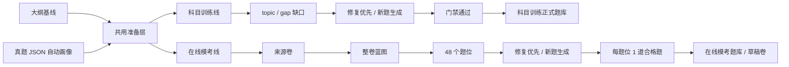

# AI 出题双线闭环可执行实施规格

> 日期：2026-07-07  
> 状态：执行版方案，后续开发以本文为准  
> 范围：大纲基线、真题 JSON 画像、科目训练 AI 出题、在线模考 AI 出题、候选治理、正式题库、数学渲染、清理重测、上线部署  
> 不包含：PDF OCR、让用户手工填写画像维度、降低门禁换通过率  

## 1. 最终结论

当前后台需要从“一个混合 AI 候选池”升级为“共用准备层 + 两条独立生产线”。



核心原则固定为：

1. 大纲和真题画像是共用源。
2. AI 出题开始后，科目训练和在线模考必须分线。
3. 候选题不是成功，正式入库题才是成功。
4. 可修复问题优先原题修复，硬伤才重生。
5. 缺英文、数学不可渲染、fallback、human_review、needs_edit、review_failed、regenerate 不能自动进入正式题库。
6. 在线模考一套卷必须 48 个题位各有 1 道合格题，才算完成。
7. 科目训练必须按 topic/gap 的正式题达标，才算完成。
8. 候选治理只展示未入库异常候选，不展示已经自动入库的合格题。
9. 开发阶段按干净架构推进，线上旧数据通过 legacy scope、清理脚本和回滚方案处理。

## 2. 当前问题对应的架构根因

| 现象 | 根因 | 必须修到什么程度 |
| --- | --- | --- |
| 生成模考题时，科目训练队列也在动 | 缺少强 scope，任务和候选查询混用 | 所有生成、修复、重生、查询、统计、清理都带 targetUseCase |
| 切换卷 2 仍看到卷 1 的题 | 候选没有按 mockBlueprintId / slotId 过滤 | 在线模考所有面板必须按当前 blueprint 隔离 |
| 候选越来越多但合格题没有 | 成功口径用了 candidateCount | topic/gap 只看正式入库题数量 |
| 题需要人工确认却又被门禁通过 | Reviewer 软警告和 publish gate 没有统一 | 入库前必须有最终硬断言 |
| 已装配后仍显示待装配 | 候选状态和 draft assembly 状态未回写 | 装配后写 assembled metadata，并从待装配队列消失 |
| 数学符号裸露或重叠 | 生成端 LaTeX 不规范，前端渲染边界太粗 | 后端 math gate + 前端统一 MathContent |
| 数学已有画像却提示无画像 | 画像查询、active 文档、scope 归因不一致 | missing_syllabus / missing_profile / incomplete_profile 分开 |
| cognitiveSkill 出现 unknown | 原始 JSON 不含画像维度，解析/推断未补齐 | 系统从真题内容推断，unknown 不进入高置信 targetProfile |

## 3. 术语和成功口径

### 3.1 原始真题 JSON

用户上传的真题 JSON 只需要表达原卷内容：

```json
{
  "document": {
    "subject": "math",
    "title": "CSCA Math Prediction Paper",
    "sourceType": "past_paper"
  },
  "questions": [
    {
      "questionNumber": "1",
      "promptText": "...",
      "options": [],
      "correctAnswer": "A",
      "explanation": "..."
    }
  ]
}
```

用户不需要提前填写：

```text
questionForm
cognitiveSkill
difficultyBand
readingLoad
calculationLoad
targetProfile
mockBlueprintSlot
```

这些维度由系统解析、推断、归一化、回填。

### 3.2 大纲基线

大纲回答“这个学科能考什么”，是科目训练和在线模考共用源。

必须稳定提供：

```text
subject
syllabusVersion
topicId
topicCode
topicTitle
knowledgePoint
excludedScope
```

### 3.3 真题画像

真题画像回答“真实考试通常怎么考”，也是共用源。

必须尽量提供：

```text
questionForm
cognitiveSkill
difficultyBand
readingLoad
calculationLoad
estimatedTimeSeconds
distractorTypes
answerDistribution
sourceSimilarityBasis
```

### 3.4 蓝图

蓝图只属于在线模考线。它不是大纲，也不是画像。

蓝图回答：

```text
这套来源卷如何拆成 48 个题位，每个题位应该考什么画像。
```

科目训练不使用整卷蓝图，只使用 topic/gap 的 targetProfile。

## 4. 数据模型和 scope 规范

### 4.1 每道 AI 题必须有 scope

短期先写入 `csca_questions.generation_metadata.scope`；稳定后再迁移为物理字段。

```ts
type AIQuestionScope = {
  targetUseCase: 'subject_practice' | 'online_mock_exam' | 'legacy';
  intendedUse: 'subject_practice' | 'mock_candidate' | 'legacy';
  subject: 'math' | 'physics' | 'chemistry';
  syllabusVersion?: string;

  topicId?: number;
  topicCode?: string;
  gapKey?: string;

  mockSourcePaperId?: number;
  mockBlueprintId?: number;
  mockBlueprintSlotId?: number;
  mockSlotNumber?: number;

  generationMode:
    | 'subject_gap_fulfillment'
    | 'subject_candidate_repair'
    | 'subject_candidate_regenerate'
    | 'online_mock_slot_fulfillment'
    | 'online_mock_candidate_repair'
    | 'online_mock_candidate_regenerate'
    | 'manual_import'
    | 'legacy';
};
```

写入规则：

| 场景 | targetUseCase | intendedUse | 必填字段 |
| --- | --- | --- | --- |
| 科目训练自动补题 | subject_practice | subject_practice | subject, topicId, gapKey |
| 科目训练修复 | subject_practice | subject_practice | 继承原 scope |
| 科目训练重生 | subject_practice | subject_practice | 继承被替换题 scope |
| 在线模考题位生成 | online_mock_exam | mock_candidate | subject, mockBlueprintId, mockBlueprintSlotId, mockSlotNumber |
| 在线模考修复 | online_mock_exam | mock_candidate | 继承原 scope |
| 在线模考重生 | online_mock_exam | mock_candidate | 继承被替换题 scope |
| 旧数据 | legacy | legacy | 可识别则回填 subject，其他置空 |

### 4.2 正式科目训练题口径

一题进入科目训练正式题库，必须同时满足：

```text
csca_questions.status = approved
generationMetadata.scope.targetUseCase = subject_practice
generationMetadata.scope.intendedUse = subject_practice
special_practice_questions 映射存在
mapping.status in active / published
localizations.zh 完整
localizations.en 完整
mathTextGate.status = passed
reviewGate.status = passed
not fallback
not smoke
not online_mock_exam
not legacy
```

科目训练完成口径：

```text
approvedPracticeCount >= targetPracticeCount
```

`approvedPracticeCount` 必须从正式题库映射统计，不能从候选数统计。

### 4.3 在线模考正式候选口径

一题进入在线模考可装配题库，必须同时满足：

```text
csca_questions.status = approved
generationMetadata.scope.targetUseCase = online_mock_exam
generationMetadata.scope.intendedUse = mock_candidate
scope.mockBlueprintId = 当前蓝图
scope.mockBlueprintSlotId = 当前题位
mockExamApproval.status = approved_for_mock_exam_assembly
localizations.zh 完整
localizations.en 完整
mathTextGate.status = passed
reviewGate.status = passed
similarityGate.status = passed
not fallback
not subject_practice
not legacy
```

在线模考完成口径：

```text
readySlotCount = 48
approvedMockCandidateCount = 48
draftPaperQuestionCount = 48
```

### 4.4 候选治理口径

候选治理不是成功列表，只展示未入库异常候选。

默认展示：

```text
pending_review
review_failed
needs_edit
human_review
repairable
repair_exhausted
regenerate
math_text_invalid
missing_bilingual_localization
profile_alignment_warning
blocked
fallback
```

默认排除：

```text
已进入科目训练正式题库
已进入在线模考候选池
已装配进在线模考草稿卷
已拒绝且不再处理
已归档
legacy 旧数据
当前 scope 外的题
```

## 5. 后端实施工单

### BE-01：scope builder 和 scope where

目标：所有后端路径共用同一套 scope 写入和查询逻辑。

涉及文件：

```text
backend/src/ai-questioning/ai-questioning.types.ts
backend/src/ai-questioning/ai-questioning.service.ts
backend/src/ai-questioning/question-generator.service.ts
backend/src/ai-questioning/question-prompt-builder.service.ts
backend/src/ai-questioning/ai-questioning.controller.ts
```

需要新增或收敛的函数：

```ts
buildSubjectPracticeScope(input): AIQuestionScope
buildOnlineMockExamScope(input): AIQuestionScope
inheritAiQuestionScope(sourceQuestion): AIQuestionScope
normalizeAiQuestionScope(metadata): AIQuestionScope
buildAiQuestionScopeWhere(params): Prisma.CscaQuestionWhereInput
isSubjectPracticeQuestion(question): boolean
isOnlineMockQuestion(question): boolean
isLegacyQuestion(question): boolean
```

验收：

1. 新科目题都有 `scope.targetUseCase = subject_practice`。
2. 新模考题都有 `scope.targetUseCase = online_mock_exam`。
3. 修复题和重生题不丢 scope。
4. 科目训练列表排除模考题。
5. 模考卷 1 和卷 2 候选互不显示。

### BE-02：画像解析和错误归因

目标：大纲缺失、画像缺失、画像不完整必须准确区分。

涉及文件：

```text
backend/src/ai-questioning/source-question-profile-normalizer.ts
backend/src/ai-questioning/question-topic-mapper-provider.service.ts
backend/src/ai-questioning/ai-questioning.service.ts
```

必须实现的状态：

```ts
type SourceProfileReadiness =
  | 'ready'
  | 'missing_syllabus'
  | 'missing_profile'
  | 'incomplete_profile'
  | 'syllabus_only';
```

处理规则：

1. 有大纲但没有 active 真题画像，提示 `missing_profile`。
2. 有大纲、有画像，但维度缺失，提示 `incomplete_profile` 并尝试推断。
3. 没有大纲，才提示 `missing_syllabus`。
4. `unknown`、`n/a`、`未识别`、空字符串不能进入正式画像分布。
5. 数学已有画像时，`cognitiveSkill` 不能大面积 unknown。
6. 化学/物理没有画像时可以标注 `syllabus_only`，但不应误报无大纲。

验收：

```text
数学有真题画像时，targetProfile 有明确 cognitiveSkill。
化学只有大纲无画像时，错误提示是缺真题画像，不是缺大纲。
原始 JSON 缺画像维度时，系统自动推断，不要求用户补 JSON。
```

### BE-03：科目训练缺口按正式题统计

目标：topic/gap 的完成状态只看正式训练题。

涉及文件：

```text
backend/src/ai-questioning/ai-questioning.service.ts
backend/src/csca-special-practice/csca-special-practice.service.ts
backend/src/csca-special-practice/csca-adaptive.service.ts
backend/src/csca-special-practice/adaptive-question-provider.service.ts
```

需要收敛的函数/逻辑：

```ts
deriveTopicQuestionGap(...)
topicQuestionBankHealth(...)
visibleAdaptiveQuestionCount(...)
specialPracticeTopicIdsForQuestions(...)
syncSpecialPracticeTopicQuestionCounts(...)
```

实现要求：

1. `approvedPracticeCount` 只统计 `special_practice_questions` 中 active/published 映射。
2. 学生端抽题必须能抽到 AI 自动入库题。
3. 学生端抽题必须排除 online mock scope。
4. legacy 题默认不计入新闭环达标。
5. 清理或下架已入库 AI 题后，同步 topic 题数。

验收：

```text
候选 100 道但正式入库 0，topic 仍然未完成。
正式入库 1 道，对应 topic/gap approvedCount +1。
在线模考题不会被科目训练抽到。
```

### BE-04：科目训练自动补齐循环

目标：点击补齐后，系统自动循环到正式题达标，而不是不断堆候选。

涉及文件：

```text
backend/src/ai-questioning/ai-questioning.service.ts
backend/src/ai-questioning/ai-questioning-scheduler.service.ts
backend/src/ai-questioning/question-generator.service.ts
backend/src/ai-questioning/question-reviewer.service.ts
```

核心循环：

```ts
while (approvedPracticeCount < targetPracticeCount) {
  const repairable = await findRepairableSubjectCandidate(scope);

  const candidate = repairable
    ? await repairCandidateInPlace(repairable)
    : await generateSubjectPracticeCandidate(scope, targetProfile);

  const reviewed = await reviewAndGate(candidate);

  if (reviewed.publishable) {
    await publishToSubjectPracticeBank(candidate.id);
    resetNoProgress(scope);
    continue;
  }

  if (reviewed.strategy === 'repair_in_place') {
    await enqueueRepair(candidate.id, reviewed.feedback);
    continue;
  }

  await archiveAndRegenerateIfAllowed(candidate.id, reviewed.feedback);
  incrementNoProgress(scope);

  if (noProgressTooHigh(scope)) {
    await markGapBlocked(scope, reviewed.reasons);
    break;
  }
}
```

停止条件：

```text
approvedPracticeCount >= targetPracticeCount
```

阻断条件：

```text
连续 N 次没有新增正式入库题
同一题修复次数达到上限
同一 gap 重生次数达到上限
provider 连续失败达到阈值
缺大纲、缺画像或 scope 异常
```

建议阈值：

```ts
const REPAIR_MAX_ATTEMPTS_PER_CANDIDATE = 3;
const NO_PROGRESS_BLOCK_THRESHOLD = 10;
const REGENERATE_MAX_ATTEMPTS_PER_GAP = 30;
const PROVIDER_FAILURE_BACKOFF_THRESHOLD = 5;
```

验收：

```text
未达标时自动继续处理。
达标后停止生成，并禁用继续补齐主按钮。
有 repairable 候选时优先修复，不优先新增候选。
连续无进展进入 blocked，并展示最近失败原因。
```

### BE-05：在线模考 48 题位闭环

目标：在线模考按来源卷、蓝图、题位独立生产；48/48 合格才完成。

涉及文件：

```text
backend/src/csca-mock-exam/csca-mock-exam.service.ts
backend/src/csca-mock-exam/mock-exam-planner.service.ts
backend/src/ai-questioning/ai-questioning.service.ts
```

实现要求：

1. 每个来源卷有独立 active blueprint。
2. 每个 blueprint 有 48 个 slot。
3. 每个 slot 只认当前 `mockBlueprintSlotId` 的合格题。
4. slot ready 后不继续为该 slot 生成。
5. `readySlotCount = 48` 后，整卷 `completed`。
6. 装配草稿卷后写回：
   - `assembledDraftPaperId`
   - `assembledAt`
   - `assembledStatus`
   - candidate 的 `mockExamApproval.assemblyStatus`
7. 切换来源卷时，候选、任务、已审核资产、草稿卷状态全部按当前 blueprint 过滤。

验收：

```text
48 个候选但不足 48 个合格题时，不显示 completed。
48 个题位都有合格题后，显示整套完成。
装配后 48 道题都显示已装配。
卷 2 不显示卷 1 的题。
```

### BE-06：入库最终硬断言

目标：任何路径都不能绕过门禁把不合格题写入正式题库。

涉及文件：

```text
backend/src/ai-questioning/ai-questioning.service.ts
backend/src/csca-special-practice/csca-special-practice.service.ts
backend/src/csca-mock-exam/csca-mock-exam.service.ts
```

必须收敛为两个入口：

```ts
publishToSubjectPracticeBank(questionId, context)
publishToOnlineMockCandidatePool(questionId, context)
```

入口内部必须调用：

```ts
assertSubjectPracticeFormalPublishable(question)
assertOnlineMockFormalPublishable(question)
```

必须拒绝：

```text
fallback
missing bilingual
math invalid
human_review
needs_edit
review_failed
regenerate
scope mismatch
targetUseCase mismatch
intendedUse mismatch
legacy
smoke/test
```

验收：

```text
前端误点、批量操作、后台任务重复调用都不能让不合格题入库。
重复 publish 不会产生重复映射。
```

### BE-07：修复优先策略和硬伤重生

目标：把“建议重生/人工确认太多”从无限新增候选改为可解释的修复/重生决策。

可原题修复：

```text
missing_bilingual_localization
math_text_invalid
latex_escape_invalid
wrong_correct_answer
multiple_correct_answers
option_too_close
weak_distractor
explanation_incomplete
explanation_answer_mismatch
minor_difficulty_mismatch
minor_reading_load_mismatch
minor_calculation_load_mismatch
profile_alignment_warning
```

必须重生：

```text
topic_mismatch
syllabus_mismatch
cognitive_skill_mismatch_hard
question_form_mismatch_hard
difficulty_mismatch_hard
source_similarity_too_high
existing_question_similarity_too_high
prompt_leak
invalid_question_stem
insufficient_conditions
unsupported_image_dependency
scope_mismatch
repair_exhausted
```

数据记录：

```ts
type RepairDecision = {
  strategy: 'repair_in_place' | 'hard_regenerate' | 'blocked';
  issueCodes: string[];
  feedbackForGenerator: string;
  repairAttempt: number;
  regenerateAttempt: number;
};
```

验收：

```text
选项过近先修选项。
答案错误先修答案和解析。
缺英文先补英文。
topic mismatch 直接重生。
真题相似度过高直接重生。
```

### BE-08：数学文本和双语门禁

目标：数学公式能在后台、科目训练、在线模考稳定显示；缺英文不能入库。

涉及文件：

```text
backend/src/ai-questioning/question-validator.service.ts
backend/src/ai-questioning/question-reviewer.service.ts
backend/src/ai-questioning/question-generator.service.ts
frontend/src/components/MathContent.tsx
frontend/src/styles/math-content.css
frontend/src/pages/special-practice/adaptive/AdaptivePracticeViews.tsx
frontend/src/pages/CscaMockExamPage.tsx
frontend/src/components/admin/ai-question-bank/CandidateReviewPanel.tsx
frontend/src/components/admin/ai-question-bank/PublishedQuestionPanel.tsx
```

后端需要提供：

```ts
normalizeMathText(input: string): string
validateMathText(input: string): MathTextGateResult
validateBilingualLocalization(question): LocalizationGateResult
```

`MathTextGateResult`：

```ts
type MathTextGateResult = {
  status: 'passed' | 'repair_required' | 'failed';
  issueCodes: string[];
  normalizedFields: string[];
  renderRisk: 'none' | 'low' | 'high';
};
```

必须检查：

```text
裸 \frac / \dfrac / \sqrt / \leq / \geq
双反斜杠污染
未闭合 $ / \( / \[
未闭合 {} / \left / \right
整段中文被包进公式
公式过长导致布局风险
选项内嵌套 block math
```

前端要求：

1. 所有题干、选项、解析、英文版本使用同一个 `MathContent`。
2. 只把明确数学片段送入 KaTeX。
3. 普通中文解释走正常文本流。
4. 长公式允许横向滚动。
5. KaTeX 渲染失败时展示原文，不破坏布局。
6. 选项容器不出现多层嵌套卡片。

验收：

```text
\dfrac、\sqrt、上下标、集合、区间正常显示。
解析区不出现符号和数字重叠。
后台候选、已审核资产、科目训练、在线模考显示一致。
```

### BE-09：清理和重测能力

目标：开发阶段可以干净清理当前测试范围，线上也能安全归档新链路异常数据。

接口：

```http
POST /api/v1/admin/ai-questioning/cleanup
```

请求：

```ts
type CleanupRequest = {
  targetUseCase: 'subject_practice' | 'online_mock_exam';
  subject?: 'math' | 'physics' | 'chemistry';
  topicId?: number;
  gapKey?: string;
  mockSourcePaperId?: number;
  mockBlueprintId?: number;
  mockBlueprintSlotId?: number;
  includeCandidates?: boolean;
  includeJobs?: boolean;
  includeApprovedAssets?: boolean;
  includeDraftPapers?: boolean;
  confirmText?: string;
};
```

默认安全清理：

```text
清理当前 scope 未入库异常候选
清理当前 scope queued/running/failed/completed 任务记录
不删除正式题库资产
不删除手工题
不删除其他 scope
```

危险清理：

```text
includeApprovedAssets = true 时，需要 confirmText
includeDraftPapers = true 时，需要 confirmText
清理结果必须写 audit log
```

确认文本：

```text
DELETE_SUBJECT_PRACTICE_AI_{subject}_{topicId|ALL}
DELETE_ONLINE_MOCK_AI_BLUEPRINT_{mockBlueprintId}
```

验收：

```text
清理数学卷 1 不影响数学卷 2。
清理科目训练 topic 不影响在线模考。
清理已入库 AI 题后，topic 正式题计数下降。
```

## 6. 前端实施工单

### FE-01：页面流程重新布局

目标：管理员一眼看出共用准备和两条分线。

页面结构：

```text
共用准备
  1 大纲基线
  2 真题画像

科目训练线
  3 知识点缺口
  4 自动补齐合格训练题
  5 科目异常候选治理
  6 科目正式题资产

在线模考线
  3 来源卷 / 整卷蓝图
  4 48 题位自动补齐
  5 模考异常候选治理
  6 模考可装配资产
  7 草稿卷装配
```

涉及文件：

```text
frontend/src/pages/AdminAIQuestionBankPage.tsx
frontend/src/components/admin/ai-question-bank/QuestionBankOverviewSummary.tsx
frontend/src/components/admin/ai-question-bank/CoverageWorkPanel.tsx
frontend/src/components/admin/ai-question-bank/MockExamProductionPanel.tsx
frontend/src/components/admin/ai-question-bank/CandidateReviewPanel.tsx
frontend/src/components/admin/ai-question-bank/PublishedQuestionPanel.tsx
```

验收：

```text
分叉后前端视觉上就是两条线。
科目训练按钮不会出现在模考主流程里。
在线模考按钮不会触发科目训练补题。
```

### FE-02：状态文案改成正式进度

科目训练主状态：

```text
目标 6 · 已入库 4 · 还差 2 · 修复中 1 · 生成中 1 · 异常 3
```

在线模考主状态：

```text
48 题位 · ready 42 · 还差 6 · 修复中 2 · 生成中 2 · 已装配 0
```

禁止把以下文案作为主成功提示：

```text
追加候选成功
候选生成成功
候选 48
通过候选即可完成
```

主按钮文案：

```text
补齐合格训练题
自动补齐 48/48
处理可修复题
刷新候选
刷新资产
清理当前 scope
```

验收：

```text
用户能知道还差几道正式题，而不是只知道候选有多少。
```

### FE-03：候选治理只展示异常

候选治理标题：

```text
科目训练 AI 候选治理与兜底
在线模考 AI 候选治理与兜底
```

说明：

```text
这里只展示未入库的异常候选。门禁通过题会自动进入对应正式题库，不需要在这里手动确认。
```

筛选项：

```text
业务线
学科
topic/gap
来源卷
blueprint
slot
状态
失败原因
生成时间
版本
```

默认排序：

```text
updatedAt desc
repairable 优先
blocked 分组显示
```

验收：

```text
门禁通过并入库后，题从异常候选区消失。
切换卷或 topic 后，旧数据不残留。
```

### FE-04：局部刷新和自动轮询

涉及文件：

```text
frontend/src/components/admin/ai-question-bank/useGenerationQueuePolling.ts
frontend/src/components/admin/ai-question-bank/useCandidateDataRefresh.ts
frontend/src/components/admin/ai-question-bank/useTopicHealthActions.ts
frontend/src/components/admin/ai-question-bank/useCandidateBulkActions.ts
```

要求：

1. 候选区有 `刷新候选`。
2. 已入库资产区有 `刷新资产`。
3. 任务状态区有 `刷新任务`。
4. running / queued / repairing / auto_retry 时轮询当前 scope。
5. 刷新不重置 tab、subject、topic、mock paper、blueprint、page。
6. 新生成、新修复、新失败排前面。

验收：

```text
不刷新整页也能看到新增候选、入库数、失败原因。
刷新当前板块不会跳回流程总览。
```

### FE-05：清理删除入口

需要支持：

```text
单题删除 / 归档异常候选
批量删除当前筛选异常候选
清理当前 topic/gap 未入库 AI 结果
清理当前 topic/gap 全部 AI 结果，包括已入库 AI 资产
清理当前 mock blueprint 未入库 AI 结果
清理当前 mock blueprint 全部 AI 结果，包括草稿装配
```

要求：

1. 删除已入库资产必须二次确认。
2. 按当前 scope 预览将删除的数量。
3. 执行后局部刷新当前面板。
4. 不允许删除手工题。

验收：

```text
可以清空旧测试题后重新生成。
清理卷 1 不影响卷 2。
清理科目训练不影响在线模考。
```

### FE-06：数学渲染统一

涉及文件：

```text
frontend/src/components/MathContent.tsx
frontend/src/styles/math-content.css
frontend/src/components/admin/ai-question-bank/CandidateReviewPanel.tsx
frontend/src/components/admin/ai-question-bank/PublishedQuestionPanel.tsx
frontend/src/components/admin/ai-question-bank/LedgerPanel.tsx
frontend/src/pages/special-practice/adaptive/AdaptivePracticeViews.tsx
frontend/src/pages/CscaMockExamPage.tsx
```

要求：

1. 题干、选项、解析全部走 `MathContent`。
2. `MathContent` 只处理明确公式片段，不整段公式化。
3. KaTeX 内部结构不要被全局 `word-break`、`line-height`、`display` 破坏。
4. 选项内公式用 inline math。
5. 推导长公式可 block math 或横向滚动。
6. 渲染失败展示原文和 warning。

验收：

```text
截图中那类 \sqrt、\dfrac、集合区间不再重叠。
候选治理、已审核资产、科目训练、在线模考四处一致。
```

## 7. 数据库和迁移策略

### 7.1 短期不强制迁表

短期目标是快速收口，可以继续用 JSON metadata：

```text
csca_questions.generation_metadata.scope
csca_questions.review_metadata.gate
csca_questions.review_metadata.repairDecision
csca_questions.review_metadata.mockExamApproval
```

必须新增规则测试保证 JSON scope 被写入和查询。

### 7.2 稳定后建议物理字段

稳定后再加物理字段，提升查询和索引：

```sql
ALTER TABLE csca_questions ADD COLUMN ai_target_use_case text;
ALTER TABLE csca_questions ADD COLUMN ai_intended_use text;
ALTER TABLE csca_questions ADD COLUMN ai_subject text;
ALTER TABLE csca_questions ADD COLUMN ai_topic_id integer;
ALTER TABLE csca_questions ADD COLUMN ai_gap_key text;
ALTER TABLE csca_questions ADD COLUMN ai_mock_blueprint_id integer;
ALTER TABLE csca_questions ADD COLUMN ai_mock_blueprint_slot_id integer;
ALTER TABLE csca_questions ADD COLUMN ai_generation_mode text;
```

推荐索引：

```sql
CREATE INDEX idx_csca_questions_ai_subject_practice
ON csca_questions (ai_target_use_case, ai_subject, ai_topic_id, ai_gap_key, status);

CREATE INDEX idx_csca_questions_ai_mock
ON csca_questions (ai_target_use_case, ai_mock_blueprint_id, ai_mock_blueprint_slot_id, status);
```

### 7.3 legacy 回填

上线前执行：

```text
1. 所有缺 scope 的 AI 题标记为 legacy。
2. 能识别为科目训练旧题的，补 subject/topic 但仍默认 hidden。
3. 能识别为模考旧题的，补 mock metadata 但仍默认 hidden。
4. 新后台默认排除 legacy。
5. 仅在历史筛选中查看 legacy。
```

## 8. 实施顺序

### Phase 0：先修数据边界

目标：停止继续制造混乱数据。

任务：

1. BE-01 scope builder 和 scope where。
2. BE-02 missing_syllabus / missing_profile / incomplete_profile。
3. BE-09 清理和重测能力。
4. FE-01 页面流程重新布局。

验收：

```text
科目和模考不混。
卷 1 和卷 2 不混。
可以清理当前 scope 重新测试。
错误归因准确。
```

### Phase 1：科目训练闭环

目标：科目训练按正式题补齐，而不是堆候选。

任务：

1. BE-03 科目训练缺口按正式题统计。
2. BE-04 科目训练自动补齐循环。
3. BE-06 入库最终硬断言。
4. BE-07 修复优先策略。
5. FE-02 状态文案。
6. FE-03 候选治理异常化。
7. FE-04 局部刷新。

验收：

```text
数学单 topic target=3 能自动入库 3 道正式题。
达标后停止生成。
学生端科目训练能抽到新题。
异常候选仍保留供排查。
```

### Phase 2：在线模考闭环

目标：每套卷独立，48/48 合格后完成并装配。

任务：

1. BE-05 在线模考 48 题位闭环。
2. BE-06 在线模考入库最终断言。
3. FE-03 模考候选异常化。
4. FE-04 模考局部刷新。
5. FE-05 模考 scope 清理。

验收：

```text
数学卷 1 48/48 后 completed。
装配草稿卷后 48 道题显示已装配。
切换卷 2 不显示卷 1 数据。
```

### Phase 3：质量硬门禁和渲染

目标：通过门禁的题能直接给学生用。

任务：

1. BE-08 数学文本和双语门禁。
2. FE-06 数学渲染统一。
3. 后台、科目训练、在线模考截图回归。

验收：

```text
缺英文题不会入库。
数学不可渲染题不会入库。
公式不裸露、不重叠、不撑破。
```

### Phase 4：上线收口

目标：线上已有数据不拖垮新架构。

任务：

1. legacy backfill。
2. 当前测试数据清理。
3. feature flag。
4. 上线验证脚本。
5. 回滚脚本。

验收：

```text
线上新链路默认只看新 scope。
旧数据可查看但不污染新统计。
出现问题可关闭自动补齐并回滚。
```

## 9. 最小可交付切片

第一轮只做一个小闭环：

```text
subject = math
useCase = subject_practice
topic = 1 个数学 topic
targetPracticeCount = 3
```

验收步骤：

1. 清理当前 topic 的 AI 结果。
2. 确认数学有大纲和 active 真题画像。
3. 点击 `补齐合格训练题`。
4. 系统先处理 repairable 候选。
5. 不足时生成新题。
6. 门禁通过后自动进入科目训练正式题库。
7. `approvedPracticeCount = 3` 后停止。
8. 候选治理只剩未入库异常题。
9. 已入库资产显示 3 道。
10. 学生端科目训练能抽到新题。
11. 数学公式后台和学生端显示正常。

第二轮：

```text
subject = math
useCase = online_mock_exam
sourcePaper = 数学模拟卷 1
targetSlotCount = 48
```

验收步骤：

1. 清理当前卷 AI 结果。
2. 生成/加载整卷蓝图。
3. 加载 48 个题位。
4. 自动补齐 48/48。
5. 装配草稿卷。
6. 用户端能打开完整 48 题。
7. 切换卷 2 不显示卷 1 数据。

## 10. 自动化测试清单

更新 `scripts/csca-ai-questioning-rules-test.cjs`，至少断言：

```text
1. 新 AI 题必须写 generationMetadata.scope。
2. 修复题继承 scope。
3. 重生题继承被替换题 scope。
4. subject_practice 查询排除 online_mock_exam。
5. online_mock_exam 查询排除 subject_practice。
6. mockBlueprintId 不同，候选互不显示。
7. candidateCount 不影响 topic ready。
8. approvedPracticeCount 达标才 ready。
9. 已入库题不出现在异常候选治理。
10. 缺英文不能 publish。
11. mathTextGate failed 不能 publish。
12. fallback 不能 publish。
13. human_review / needs_edit / review_failed 不能 publish。
14. repairable issue 走 repair_in_place。
15. hard issue 走 hard_regenerate。
16. repair_exhausted 后走 hard_regenerate。
17. noProgress 达阈值进入 blocked。
18. cleanup 必须带 scope。
19. includeApprovedAssets 需要确认文本。
20. mock 48/48 才 completed。
21. mock assembled 后状态回写。
22. MathContent 不整段公式化普通中文。
23. MathContent 约束 KaTeX 布局，不破坏选项和解析。
24. 学生端科目训练查询排除 mock scope。
25. 学生端科目训练能读取 AI 自动入库题。
```

建议执行命令：

```powershell
npm.cmd run csca-ai-questioning:rules
npm.cmd --prefix backend exec -- tsc -p backend/tsconfig.json --noEmit --incremental false --pretty false
npm.cmd --prefix frontend exec -- tsc -p frontend/tsconfig.json --noEmit --incremental false --pretty false
npm.cmd --prefix frontend run build
```

## 11. 手工验收脚本

### 11.1 科目训练

```text
1. 选择数学。
2. 选择一个 topic。
3. 清理当前 topic AI 结果，包含已入库 AI 资产。
4. 刷新 topic health，确认已入库为 0。
5. 点击补齐合格训练题。
6. 观察状态：生成、修复、入库、还差几道。
7. 达标后按钮显示已完成，不能继续自动生成。
8. 打开异常候选治理，只看到失败/可修/blocked 的题。
9. 打开已入库资产，看到达标题。
10. 进入学生端科目训练，能抽到新题。
```

### 11.2 在线模考

```text
1. 选择数学模拟卷 1。
2. 清理当前卷 AI 结果。
3. 生成/加载整卷蓝图。
4. 加载题位。
5. 启动自动补齐 48/48。
6. readySlotCount 到 48 后停止。
7. 装配草稿卷。
8. 已审核资产显示已装配。
9. 切换数学模拟卷 2，确认卷 1 数据不出现。
10. 学生端打开草稿/正式卷，题数为 48。
```

### 11.3 数学渲染

检查题型：

```text
\frac / \dfrac
\sqrt
上下标
集合
区间
不等式
分段表达式
中文解释中夹公式
英文解释中夹公式
```

检查页面：

```text
后台候选治理
后台已入库资产
学生端科目训练
学生端在线模考
错题/解析页
导出预览
```

验收标准：

```text
不裸露。
不重叠。
不撑破卡片。
不出现选项多层嵌套边框。
渲染失败时页面仍可读。
```

## 12. 上线部署和回滚

### 12.1 上线前

```text
1. 停止 AI worker。
2. 备份线上数据库。
3. 跑 dry-run legacy scope backfill。
4. 统计 legacy AI 题、候选、任务数量。
5. 清理卡住的 queued/running 任务。
6. 部署后端。
7. 跑迁移和 backfill。
8. 部署前端。
9. 只开启 admin 后台验证。
10. 先跑数学单 topic。
11. 再跑数学单 mock 卷。
12. 确认无误后扩大范围。
```

### 12.2 feature flag

建议保留：

```text
AI_QUESTIONING_AUTOFILL_ENABLED
AI_QUESTIONING_SUBJECT_AUTOPUBLISH_ENABLED
AI_QUESTIONING_MOCK_AUTOPUBLISH_ENABLED
AI_QUESTIONING_REPAIR_FIRST_ENABLED
AI_QUESTIONING_LEGACY_VISIBLE
```

### 12.3 回滚

出现以下情况立即回滚或关闭 feature flag：

```text
scope 误写导致科目/模考混用
正式题库误入不合格题
学生端抽不到题
在线模考装配题数不等于 48
数学渲染大面积破版
provider 队列无法停止
```

回滚步骤：

```text
1. 关闭自动补齐 feature flag。
2. 暂停 AI worker。
3. 前端保留手工专项题库和手工在线模考入口。
4. 新生成异常候选按 scope 归档。
5. 如正式题库污染，按 audit log 和 scope 清理。
6. 必要时恢复数据库备份。
```

## 13. 完成定义

本轮真正完成必须全部满足：

1. 新 AI 题全部有 scope。
2. 科目训练和在线模考任务、候选、资产、清理互不污染。
3. 科目训练以正式入库题达标。
4. 在线模考以 48/48 合格题达标。
5. 合格题自动入对应正式题库，并从异常候选治理消失。
6. 可修复问题优先原题修复。
7. 硬伤问题才重生。
8. 连续无进展会 blocked，不无限堆候选。
9. 缺英文、数学不可渲染、fallback、human_review、needs_edit、review_failed 不会入库。
10. 后台、科目训练、在线模考数学渲染一致。
11. 当前 topic / 当前 mock 卷可以安全清理重测。
12. 学生端科目训练能抽到 AI 自动入库题。
13. 学生端在线模考能打开装配后的 48 题卷。
14. 线上部署有备份、feature flag、legacy 隔离和回滚路径。

## 14. 和旧文档的关系

以下文档继续作为背景参考：

```text
docs/mock-exam-blueprint-and-ai-generation-plan-2026-06-30.md
docs/source-question-profile-upgrade-implementation-spec-2026-07-03.md
docs/subject-training-profile-adaptation-implementation-spec-2026-07-03.md
docs/ai-questioning-dual-line-execution-master-plan-2026-07-07.md
docs/ai-questioning-subject-optimization-and-math-rendering-execution-plan-2026-07-07.md
docs/subject-practice-ai-question-hardening-executable-roadmap-2026-07-07.md
```

如果旧文档与本文冲突，以本文为准。
