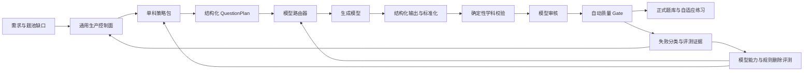

# 大模型进步背景下 AI 出题工程的长期价值与简化计划

日期：2026-08-13

## 1. 核心结论

随着大模型能力进步，CSCAlite 当前一部分工程会失去必要性，但整个 AI 出题工程不会失去意义。

真正会被模型进步替代的，是为了弥补某一代模型能力不足而增加的局部 prompt 补丁、题面关键词正则、特例难度修正和格式兼容代码。长期不会被模型替代的，是产品和生产系统必须掌握的确定性边界：课程范围、题型策略、难度目标、多样性预算、任务状态、失败恢复、质量证据、发布权限、成本与审计。

因此目标不应是继续扩大工程，而应改成：

> 模型越强，模型负责的认知工作越多；工程越稳定，工程负责的边界越少但越确定。

我们的系统确实已经具有 Agent 的特征，但更准确的名称是“受约束的题目生产 Agent”或“QuestionOps 工作流”，不是一个可以自由行动的通用 Agent。

## 2. 为什么感觉像在做 Agent

当前系统已经具备典型 Agent 工作流要素：

- 目标：按 subject、topic、difficulty cell 补齐可发布题目。
- 规划：选择 task family、QuestionPlan、难度和证据结构。
- 执行：调用模型生成候选题。
- 工具：题库、课程资料、provider gateway、validator、reviewer、发布接口。
- 记忆：近期题型、family 使用记录、失败分类和 diversity memory。
- 反思：review、gate、retry feedback 和质量审计。
- 状态：queued、running、stale、failed、approved、published 等持久状态。
- 恢复：timeout、empty output、schema invalid、key cooldown 和 stale job recovery。

所以“像 Agent”不是异常，而是因为可靠出题本来就不是一次文本生成，而是一个带目标、约束、反馈和状态的生产过程。

真正需要防止的是把 Agent 做成无限自治、无限重试、无限增加规则的黑盒。CSCAlite 的正确方向是有限状态、有限预算、可审计、可停止。

## 3. 哪些工程具有长期价值

### 3.1 产品契约

这些要求不属于模型能力问题，模型再强也必须由系统掌握：

- 学生只能拿到 approved 且 published_to_subject_practice 的题。
- 题池耗尽时返回稳定产品状态，不能现场无限生成或暴露 provider 错误。
- 单选题必须有唯一答案、完整选项和可解释结果。
- 生成任务不能跨 subject、topic、difficulty cell 串库。
- 同一个 production cell 不能出现互相竞争的重复 active job。

### 3.2 课程与题型政策

模型不知道 CSCAlite 当期产品真正要覆盖什么，也不会自动承担覆盖率责任：

- SubjectTopicMapping
- TaskFamily
- DifficultyRubric
- EvidenceTarget
- DiversityAxes
- BannedPattern
- PolicyVersion
- 各科目的题型包与可接受证据

这部分应从散落的 prompt 和 reviewer 正则中抽成结构化策略库。

### 3.3 生产可靠性

以下能力属于分布式任务系统，而不是语言模型：

- 幂等、去重和单 owner 执行。
- 队列、并发、超时、退避与 cooldown。
- stale running job 回收。
- provider failure 与 content failure 分账。
- 可恢复与不可恢复错误分类。
- run、cell、job 计数一致性。
- 成本、延迟和 token 观测。

### 3.4 可验证的质量边界

模型可以判断质量，但不能成为自己唯一的证明：

- 确定性 schema 和答案形状检查。
- 可计算问题的程序化复算。
- 化学方程式、单位、守恒和相态等可确定规则。
- 物理量纲、方向和符号一致性检查。
- 数学表达式解析、定义域和答案复核。
- 独立 reviewer、gate 和发布权限分离。
- 固定回归集、历史坏题集和 shadow evaluation。

生产路径不需要人工审核环节。阶段性人工抽样只用于验收模型和规则，不应成为题目发布依赖。

## 4. 哪些工程会随模型进步贬值

以下内容属于“可删除工程”，不应默认永久保留：

- 为某一道坏题增加的单例关键词正则。
- prompt 中不断横向追加的自然语言禁令。
- 同一含义在生成器、reviewer、validator 中重复实现。
- 仅为修复旧模型 JSON 包装习惯的兼容分支。
- 依赖题干长度、公式数量等弱信号判断真实难度的补丁。
- 用大量硬编码模拟模型本来已经可以稳定完成的语义分类。
- 不能改变发布决定的 metadata 和解释性噪音。

这些代码不是一开始就错误。它们可能是某个阶段必要的桥梁，但必须带有退出条件。

## 5. 判断工程是否还有意义的标准

每个机制都应能回答三个问题：

1. 它防止了哪一种可观测失败？
2. 没有它时，固定评测集会退化多少？
3. 模型升级后，能否在不降低质量的情况下删除？

无法回答这三个问题的规则，不应继续增长。

建议给重要机制增加分类：

| 类型 | 含义 | 默认动作 |
| --- | --- | --- |
| Product invariant | 学生体验或发布安全契约 | 长期保留 |
| Operational invariant | 队列、幂等、恢复和计数契约 | 长期保留 |
| Domain invariant | 可确定的学科事实与计算约束 | 保留并结构化 |
| Model compensation | 为当前模型弱点增加的补偿 | 定期复测并优先删除 |
| Observability | 支持定位和验收的证据 | 保留高信号，压缩噪音 |

## 6. 目标架构

架构应分成两层：

- 通用控制面：三科共用任务状态、provider gateway、成本、重试、发布、审计和评测。
- 单科策略包：数学、化学、物理分别拥有题型 family、难度 rubric、证据目标、解析器和领域校验。

三科不应在大模型调用上绑定执行；它们共享平台能力，但可以单科生成、单科监测、单科升级和单科回滚。

## 7. 模型升级后的正确简化方式

模型升级不能只比较“通过率”，因为 reviewer 变松也会提高通过率。每次升级应使用固定 cell 和固定评测集，至少比较：

- provider delivery success rate
- JSON/schema 成功率
- 答案正确率与唯一性
- 解释一致性
- 真实难度命中率
- task-family 与 QuestionPlan 遵循率
- 多样性覆盖率
- gate 误放和误挡
- 延迟、token 和每道 approved 题成本

然后执行“删除优先”的实验：

1. 新模型在现有全部护栏下运行，确认基线。
2. 对一个 Model compensation 规则做 shadow disable。
3. 用固定回归集和小规模 live observation 对比。
4. 无显著退化则删除该规则。
5. 有退化则保留，并记录它仍覆盖的失败类型和下次复测版本。

不能因为新模型在一两道题上表现好，就直接删除质量门；也不能因为旧模型曾经犯错，就永远保留补丁。

当前可复用的 no-provider 固定评测入口是 `npm.cmd run csca-ai-questioning:subject-practice-fixed-eval`。它聚合三科 TaskFamily/Fingerprint fixtures、QuestionPlan fixture acceptance 和 profile difficulty patch fixed eval，保持 no-provider / no observation submission / fixture-or-audit-only 边界，可作为模型升级、shadow-disable 和删补丁前后的第一层对照。TaskFamily/Fingerprint 子评测固定覆盖 chemistry/math/physics family 命中、subject guard、topic compatibility、math/physics difficulty audit、physics visual policy 默认隔离和 near-duplicate fallback；更外层的 readiness/completion 仍由 `subject-practice-no-provider-acceptance` 和 `subject-practice-completion-gate` 负责。

效率/质量漏斗对照使用 `npm.cmd run csca-ai-questioning:subject-practice-quality-scorecard`。它只读聚合三科 production audit，把 provider delivery、candidate generation、gate/publish yield、content-gate bottleneck、P0/P1、active/stale work 和 readiness phase 分开。模型升级或删规则前后，应同时比较 fixed-eval 和 scorecard；fixed-eval 防止固定样本退化，scorecard 防止真实生产漏斗被误读。

## 8. DeepSeek V4 Pro 的当前意义

切换 V4 Pro 是一次很好的架构检验：它应当证明模型能力提升可以直接改善候选题，而不要求我们继续增加 prompt 和 reviewer 特例。

2026-08-13 的首条受控数学 observation 已经通过 V4 Pro 生成：task `99ca1383-a27f-4478-ab9c-01c6f553e934`、candidate `#16338`，gateway model 为 `deepseek-v4-pro`，gateDecision 为 `publishable`，并命中 scheduler preferred family。它证明新模型已经被当前生成路径正确加载，也给出了正向样本。

但单个样本不能证明模型升级已经解决整体准确性、难度和多样性问题。下一步仍需固定样本对照，而不是立刻扩大调用量或删除所有护栏。

第一阶段保持“Pro 生成、Flash 审核”是为了隔离生成能力变化。后续应用同一批候选题做 Flash/Pro reviewer 对照，再决定审核是否升级。生产中不存在人工审核 gate。

## 9. 分阶段实施计划

### Phase 1：建立模型能力基线

- 固定数学、化学、物理的代表性 topic+difficulty cells。
- 固定历史坏题、误挡题和高风险 hard 题集合。
- 记录 Flash 与 Pro 的质量、延迟、成本和失败分类。
- 不同时修改生成器、reviewer 和 gate。

完成条件：能够按科目和 cell 比较，而不是只看总通过率。

### Phase 2：建立规则资产台账

- 给主要 validator/reviewer/prompt 规则标注五类机制类型。
- 为 Model compensation 规则记录来源、失败样本和退出条件。
- 合并重复规则，把学科策略迁入结构化策略包。
- P2/P3 噪音不再阻塞生产。

完成条件：能够回答每条主要规则为什么存在、什么时候可以删除。

### Phase 3：模型升级驱动的规则删除

- 每次模型升级先跑离线回归和 shadow evaluation。
- 每轮选择少量补偿规则做关闭实验。
- 只有质量不退化才删除。
- 删除后的规则测试改成模型评测 fixture 或策略契约测试。

完成条件：模型能力提高时，代码量和 prompt 复杂度能够下降。

### Phase 4：产品化 QuestionOps

- 以稳定 API、MCP/tool 或 agent skill 暴露能力。
- 调用方提交 QuestionRequest/PracticeGoal，不直接操纵 prompt。
- 服务返回题目、状态、质量证据和可恢复错误。
- Codex、聊天产品、自适应练习和未来 3D 表达共享同一生产控制面。

完成条件：接入新 Agent 不需要复制出题状态机和质量治理代码。

## 10. 停止线

遇到以下情况应继续修工程：

- 错题、答案不唯一或解释矛盾进入正式题池。
- 明显难度错位仍被发布。
- cell 串库、重复 active job、状态假死或计数错误。
- provider 错误被污染成永久 blocked。
- 同一短窗口持续撞同题壳，策略和 memory 没有生效。
- 模型升级后无法观测质量、成本和回滚。

遇到以下情况不应继续扩张架构：

- 偶发 provider timeout、empty output 或 cooldown，且能够恢复。
- 正常的候选题被质量门拒绝。
- 不影响决策的解释性 metadata 噪音。
- 模型已经稳定解决的问题仍想增加新的关键词补丁。
- 只因为“可能将来有用”而增加新 Agent 层或新状态。

## 11. 给管理者的简明说明

我们不是在重复制造一个大模型，而是在建设一条自动化题目生产线。

大模型负责理解知识、设计题目和推理；系统负责告诉它需要生产什么、检查结果是否满足产品标准、避免重复、处理失败，并只把合格题交给学生。模型越强，生产线中的局部修补会减少，但生产目标、质量标准、任务调度和发布安全不会消失。

这项工程是否成功，不以代码越来越多为标准，而以三件事为标准：合格题产量提高、错误题不能进入正式题池、模型升级后系统能够变得更简单。

## 12. 最终判断

当前工程不是没有意义，但已经到了需要主动控制复杂度的阶段。

后续不应再把“发现一个失败样本”自动等同于“增加一条规则”。优先顺序应是：判断是否为模型能力问题、结构化策略缺口、确定性产品契约或生产状态缺陷；只有最后两类通常需要长期代码。模型能力问题优先通过升级和评测解决，结构化策略缺口进入单科策略包，局部补偿规则必须带退出条件。

最终理想状态不是没有工程，而是拥有一套小而稳定的控制面，外加可替换、可评测、可升级的模型能力层。
