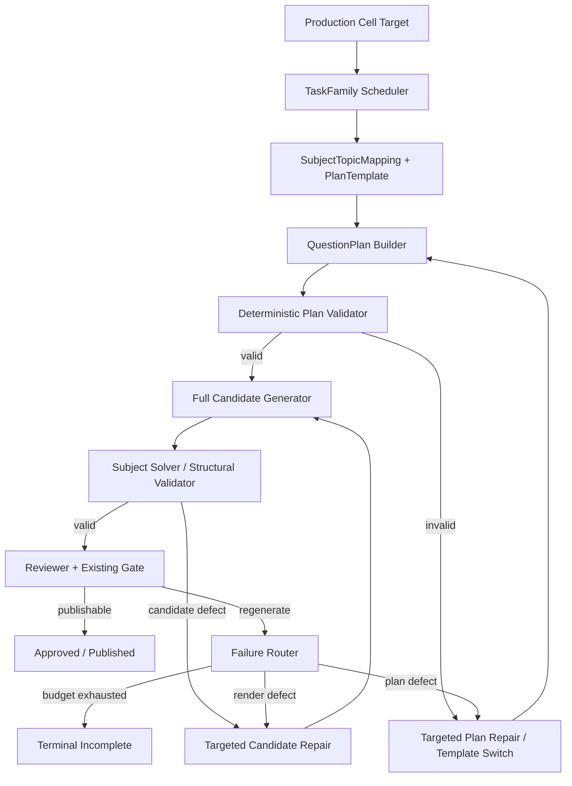

# AI Questioning QuestionPlan / EvidenceSlots Executable Plan - 2026-08-10

## 文档状态

- 决策：**Conditional GO**
- 风险等级：中
- 当前阶段：`PARTIAL` 非 provider shadow / metadata / prompt-contract / audit 骨架已落地，live provider 单 job 证据待完成
- 首批范围：以化学 #198 的 #593、#596、#592 三个高损耗 production cell 作为 seed calibration；当前 #200 已追加 hard gas #607 与 hard redox #610 的 disabled-shadow template visibility，并把 basic gas #608 / basic redox #611 保留为 calibration-only。实际模板匹配按 subject + topicTitle + difficulty，不能硬绑定单个 run 内部 cell id。
- 后续复用：数学，再到物理
- Provider/key 策略：不修改
- 发布 gate：不放宽
- 人工审核：不引入正式生产流程
- 向量库：不是 MVP 依赖
- 联合复核任务：`019fd60f-a504-78b2-9afa-6b4b2f2179f4`

本文档将当前 AI 出题低通过率问题沉淀为一个可执行的机制改造方案。核心方向不是继续横向增加 prompt 禁令，也不是先更换模型，而是在完整题目生成之前加入结构化、可确定性校验的 `QuestionPlan / EvidenceSlots` 阶段。

### 2026-08-10 当前落地状态

截至当前工作区，QuestionPlan / EvidenceSlots 已从纯设计推进到 `PARTIAL` 实现：

- 已新增 `subject-practice-question-plan-policy-v1`，包含 schema、首批化学 #593/#596/#592 plan templates、deterministic validator、candidate adherence 和 failure route；
- 当前实现又补入 #200 hard gas #607 / hard redox #610 的 disabled-by-default plan templates；#608/#611 只参与 rejected calibration，不进入 production fail-closed template 集；
- 首批模板的 #593/#596/#592 是 seed calibration cell id，不是生产期硬绑定。后续 run（例如 #199）必须通过 subject + topicTitle + difficulty 复用同一模板，并保留当前 productionCellId 写入 metadata；
- 已在 production enqueue 阶段 behind feature flag scaffold/validate QuestionPlan，并写入 generation job metadata；
- 已把有效 QuestionPlan 传入 generation expansion constraints，PromptBuilder 会在存在 plan 时输出紧凑结构化 contract 和 payload；无 plan 路径不会追加 `questionPlan:null`；
- 已在 candidate 生成后写回 `questionPlanAttempt`、`questionPlanAdherence`、`questionPlanFailureRoute`，但不改变 reviewer/gate 发布决策；
- 已新增 read-only applicability / calibration / execution audit、rollout gate guard 和 fixture self-test；
- 已验证 `csca-ai-questioning:rules`、`nest build`、QuestionPlan execution self-test、chemistry #198 audit、rollout gate、current-policy isolation smoke；
- 尚未完成开启 QuestionPlan flag 后的 live provider 单 job 验收，因此不能宣布质量收益已证明，也不能标记为 `LIVE`。

### 2026-08-11 no-provider 补充

本轮修正了一个实现边界：QuestionPlan MVP 不再把 #198 的 seed cell id 当作唯一适用条件。生产、audit 和 standalone calibration 均按以下顺序识别首批模板：

1. `subject=chemistry`；
2. `topicTitle` 命中实验/仪器、lab/experiment 或有机/organic 等学科短语；
3. `targetDifficulty` 命中模板难度；
4. #592/#593/#596 只作为历史 seed/fallback，用于旧 run 校准和回放。

验证结果：

- 当前 #199 hard lab cell #602 可识别为 `hard_experimental_evidence_chain / competing_hypothesis_discrimination_v1`；
- #602 的 current production cell id 会保留在 plan metadata 中，不会写回 seed cell id；
- math/physics 仍为 `applicable=false`，不受化学 QuestionPlan MVP 影响；
- #199 calibration 已能采样 #15992 并输出 `likely_insufficient_hard_evidence_chain`；
- production audit / rollout gate 已能输出 `questionPlanApplicability`：#199 当前命中 #602 hard lab 与 #601 medium lab，math/physics 为 subject-isolated 0 命中；
- 该改动仍为 no-provider / audit-visible，不开启生产 flag，不改变发布 gate。
- 最新 rollout gate 为 `passed_with_operational_wait`：QuestionPlan/多样性/隔离 guardrail 已通过，但下一次 live observation 前仍需切到 observation-only backend 并重跑 preflight；不能把该状态解释为已完成 live 质量收益验收。

状态口径：当前为 `PARTIAL` / shadow-ready / audit-visible。下一步是小预算 live evidence，而不是扩大 provider/key 策略或放宽发布 gate。

### 2026-08-12 math no-provider shadow 补充

数学已新增一层 production-audit-only 的 QuestionPlan shadow visibility，用于 `#156/#350` 函数性质类样本校准：

- `mode=audit_only_math_question_plan_shadow`；
- `productionImpact=none_audit_only`，`providerImpact=none_no_provider_call`；
- `featureFlag=CSCA_SUBJECT_PRACTICE_MATH_QUESTION_PLAN_ENABLED`，当前 `featureFlagEnabled=false`；
- `subjectBoundary=math_shadow_not_connected_to_production_question_plan_gate`；
- `gateApplicability=not_connected_to_subjectPracticeQuestionPlanGateFor`。

当前 no-provider audit 只命中一个适用 cell：math `#350` / `函数的概念与性质` / `medium`，模板为 `math_function_property_evidence_slots_shadow_v1`。候选样本共 9 道，当前 production audit shadow 已拆成 `requires_exp_log_ordering_plan_template:5`、`candidate_matches_function_property_plan_shape:3` 与 `requires_separate_parameter_inference_plan:1`。该 shadow 不开启生产 gate，不改 prompt/provider，不改发布决策，也不影响 chemistry / physics。

Standalone rejected/published calibration 也已支持 math shadow：`npm.cmd run csca-ai-questioning:question-plan-calibration -- --subject=math --run=156 --cells=350 --per-cell=10 --json` 只读采样 10 道 #350 题，输出 `productionImpact=none_audit_only`、`providerImpact=none_read_only_db_sampling`，并把当前样本分为 exp/log ordering 需独立模板、函数性质 judgement 可用模板、参数推断需独立 plan 三类。该入口与 chemistry #592/#593/#596 校准共用脚本，但按 `subject` 分流，不连接 `subjectPracticeQuestionPlanGateFor`。standalone calibration 也复用中心 task-family classifier，避免 #16211-style mixed exp/log/power ordering 与 production audit 口径漂移。

Chemistry standalone calibration now also covers current #200 bottleneck cells by default (`#607/#608/#610/#611`) while preserving the old #198 seed cells. `npm.cmd run csca-ai-questioning:question-plan-calibration -- --self-test-chemistry-current --json` is fixture-only and locks the boundary: #607 hard gas impurity-control can match `gas_impurity_control_competing_elimination_v1`; #610 hard redox mostly exposes missing quantitative/electron-transfer chain evidence; #608/#611 are calibration-only basic diagnostics and do not become production QuestionPlan gates.

Fixture self-test 也已补齐：`npm.cmd run csca-ai-questioning:math-question-plan-shadow-self-test` 和 `npm.cmd run csca-ai-questioning:question-plan-calibration-self-test` 都不读 DB、不提交 task、不调用 provider，固定验证 #16233 为函数性质 composite judgement 正向样本且 `parameterInferenceRisk=false`，#15527-style 参数/自由变量推断样本进入独立 plan，#16211/#15938-style exp/log ordering 样本进入独立模板，并把 Pro-backed publishable 样本 #16338 锁为 `elementary_function_exp_log_ordering` / `requires_exp_log_ordering_plan_template` 正向样本；同时确认历史 `human_review` / `reviewer_human_review` 审计显示为 `quality_attention` / `reviewer_needs_quality_attention`。

可用 `npm.cmd run csca-ai-questioning:question-plan-no-provider-acceptance` 一次性跑上述 no-provider acceptance。该入口只编排 fixture self-test，报告 `productionImpact=none_fixture_only`、`providerImpact=none_no_provider_call`、`dbImpact=none_fixture_only`，不读数据库、不提交 observation task、不调用 provider。

如果只需要固定样本/静态题质基线，应跑 `npm.cmd run csca-ai-questioning:subject-practice-fixed-eval`。该入口聚合三科 TaskFamily/Fingerprint fixtures、上述 QuestionPlan fixture acceptance 和 profile difficulty patch fixed eval，报告 no-provider、fixture/audit-only、no observation submission，适合后续模型升级、shadow-disable 和删补丁实验复用。三科 TaskFamily/Fingerprint fixture 会固定验证 chemistry/math/physics family 命中、subject guard fallback、chemistry topic compatibility fallback、math/physics difficulty audit visibility、physics visual current-policy 默认隔离和 near-duplicate warning fallback。

如果要验收当前 subject-practice 阶段整体机制边界，应跑更外层的 `npm.cmd run csca-ai-questioning:subject-practice-no-provider-acceptance`。它会在 `subject-practice-fixed-eval` 之外，再聚合 backend-owned observation task rules、read-only observation preflight、latest read-only observation evidence 和 read-only rollout gate；该入口仍保持 `providerImpact=none_no_provider_call`，只读 DB/runtime/audit 状态，不提交 observation task。输出中的 `completionAudit` 会把机制/readiness、reviewer/profile fixed eval、observation 唯一性、gateway binding、active observation leftover、chemistry current run 状态和 `fresh_live_math_gate_evidence` 分开；完整目标完成门应使用 `npm.cmd run csca-ai-questioning:subject-practice-completion-gate`，它在 fresh live math gate evidence 缺失时非 0 退出，在 bounded MVP evidence 已满足时报告 `goalCompletionStatus=complete`。该完成语义只覆盖当前 bounded observation MVP，不证明全数学题池都已达到 student-consumable 长期质量。

因此数学 QuestionPlan 当前状态是 `PARTIAL audit-only visibility`，不是 `LIVE`，也不是产品发布链路。下一步若继续推进，应先把这些 shadow samples 转成结构化 plan/rubric fixtures，再考虑小范围 feature-flagged plan generation。

相关文档：

- `docs/ai-questioning-diversity-engine-design-2026-08-06.md`
- `docs/ai-questioning-chemistry-math-handoff-2026-08-06.md`
- `docs/subject-practice-observation-backend-owned-execution-architecture-assessment-2026-08-10.md`

## 一、执行摘要

当前低通过率首先是生成契约与编排机制问题，模型能力是可能的次要因素，但尚未被隔离证明为主因。

系统目前把以下要求同时交给模型，并直接要求一次生成完整题目：

- 命中指定 task family；
- 满足目标难度；
- 包含多步推理；
- 包含足够的独立证据；
- 满足定量或结构要求；
- 设计有区分度的干扰项；
- 答案唯一；
- 严格按 JSON schema 输出；
- 避开近期重复题型。

如果模型一开始选择了错误的解题骨架，后续即使增加描述、替换物质或修改数字，完整题目仍会在 reviewer/gate 阶段因为证据不足、难度错位或答案结构不满足要求而被拒绝。

推荐把流程改为：

```text
目标 Cell
  -> Scheduler 选择 TaskFamily / PlanTemplate
  -> 构造结构化 QuestionPlan
  -> Deterministic Plan Validator
  -> 仅允许合格 Plan 生成完整 Candidate
  -> 学科 Solver / Validator
  -> Reviewer / Gate
  -> Approved / Published
```

失败应尽可能发生在低成本 Plan 阶段，而不是在完整题目、reviewer 和 gate 均已调用之后。

当前实现边界：MVP 已能 scaffold/validate plan、把有效 plan 带入 prompt contract，并在候选后记录 adherence / route；但 failure router 仍以 audit metadata 为主，尚未启用 plan repair / candidate rerender 的生产闭环。

## 二、当前数据基线

化学 production run #198 的历史累计审计约为：

| 指标 | 数量 | 近似比率 |
|---|---:|---:|
| Job attempts | 1,245 | 100% |
| 实际形成候选题 | 383 | 30.8% of attempts |
| 正式发布 | 40 | 10.4% of candidates / 3.2% of attempts |

这些是 run 历史累计口径，包含旧策略、provider 失败、重试和已归档候选，不能直接当作当前单次模型准确率。但它足以说明必须拆分不同损耗层。

### 2.1 正常 Cell 与问题 Cell

三个相对正常的 cell 合计约为：

```text
100 generated candidates -> 32 published
```

候选到发布约 32%。

三个高损耗 cell 合计约为：

```text
283 generated candidates -> 8 published
```

候选到发布约 2.8%。

| Cell | 目标 | 候选/发布 | 当前主要失败 |
|---|---|---:|---|
| #593 | Hard 实验 | 64/0 | 多观察证据链、竞争假设、多步推理缺失 |
| #596 | Hard 有机 | 45/3 | 计算、多线索、定量结构和唯一推导不足 |
| #592 | Medium 实验 | 174/5 | 退化为单操作判断，不满足双操作因果传播 |

### 2.2 必须拆开的四层损耗

1. **Delivery loss**
   - `gateway_concurrency_timeout`
   - `provider_empty_output`
   - `provider_schema_invalid`
   - key cooldown / concurrency saturation

2. **Plan loss**
   - 题目骨架不可能满足目标难度；
   - 缺少独立证据；
   - 定量关系不成立；
   - 目标结构无法保证唯一解。

3. **Candidate loss**
   - 完整题表达、格式、选项或答案错误；
   - 图像、材料或上下文依赖不完整；
   - 题干与 Plan 不一致。

4. **Gate loss**
   - 真实难度不匹配；
   - reviewer/validator 发现错误；
   - diversity 或 publication policy 拒绝。

不能把这四层合并成一个“模型通过率”。

## 三、根因判断

### 3.1 主因：生成前没有可验证计划

现有 target profile、task-family policy 和 reviewer/gate 已经能描述或识别许多要求，但这些要求大部分在完整题目生成后才被验证。

结果是：

- 模型先写题，系统后验发现骨架错误；
- retry feedback 越来越厚；
- 模型修改表面文本，但推理结构没有改变；
- 同一 cell 重复消耗 provider 和 review 预算；
- gate 正确拒绝，安全性维持，但效率极低。

### 3.2 次因：Target Profile 组合可能不自然

某些 target profile 同时要求 task family、定量计算、多步证据、特定 stem pattern 和特定表示形式。这些组合可能：

- 与具体 topic 不兼容；
- 超出该难度的合理考试表达；
- 要求过多，导致题目失真；
- 实际存在可行题，但当前模板无法表达。

因此需要 `SubjectTopicMapping + PlanTemplate compatibility`，不能任意拼接约束。

### 3.3 校准风险：Rubric / Classifier 可能误判

有些题不依赖复杂数值计算，但仍需要高约束、多条件推理。如果 difficulty rubric 只寻找显式计算、多步关键词或固定 evidence 字段，可能误判真实难度。

在固化 Plan Validator 前，必须抽样确认 gate 拒绝是否正确。

### 3.4 Delivery 问题降低吞吐，但不是质量主因

Provider timeout、empty output、schema invalid 和 background queue timeout 会降低 attempt 到 candidate 的转化率，但不会解释为什么已经形成的 hard 实验候选仍是 0/64。

增加 key 可以改善 delivery throughput，但不会自动补足证据链和真实难度。

### 3.5 模型能力尚未被隔离证明

只有满足以下条件后仍系统性失败，才能较合理地判断为 base model capability ceiling：

- Plan 已结构化；
- EvidenceSlots 明确；
- Plan 经过确定性校验；
- response/token budget 合理；
- family/template 不单一；
- retry 能针对缺口修复；
- rubric/classifier 已完成校准；
- 多个 topic 与多个 plan template 仍持续失败。

在此之前，正式口径应为：**机制主因，模型能力次因或尚未证实。**

## 四、目标与非目标

### 4.1 目标

- 在调用完整题生成前证明题目骨架可满足目标难度；
- 将失败提前到低成本 Plan 阶段；
- 对不同失败原因执行不同修复；
- 连续失败后自动切换 template/family，而非无限整题重试；
- 保持现有 reviewer/validator/gate 安全边界；
- 形成跨学科共用的 Plan 接口与学科隔离的 validator；
- 分离 delivery、plan、candidate、gate 指标。

### 4.2 非目标

- 不放宽发布 gate；
- 不增加人工审核生产环节；
- 不通过增加 key 代替质量治理；
- 不在 MVP 中建设向量库；
- 不同时重构化学、数学和物理所有题型；
- 不把 Plan 变成另一段无法验证的自然语言 prompt；
- 不保证每个 production cell 必须无限补齐。

## 五、目标架构



### 5.1 共享层

共享层只理解结构化抽象：

- TaskFamily
- PlanTemplate
- QuestionPlan
- EvidenceSlot
- ReasoningStep
- DifficultyRubric
- QuantitativeRelation
- UniquenessCondition
- MisconceptionTarget
- FailureRoute
- PolicyVersion

共享层不硬编码“有机反应”“函数单调性”或“电路图”等学科含义。

### 5.2 学科层

学科层提供：

- SubjectTopicMapping
- 可用 PlanTemplate
- EvidenceSlot 类型
- Deterministic Plan Validator
- Solver / plausibility checker
- Subject-specific difficulty evidence
- BannedPattern

### 5.3 运行与资源边界

QuestionPlan 的共享 schema 不表示三科共同生成。每个 plan 和后续 candidate/job 必须绑定唯一的 `subject + topic + difficulty + policyVersion`。

- 数学、物理、化学分别选择自己的 PlanTemplate、EvidenceSlot、validator 和 difficulty rubric。
- 三科 run、cell、质量验收和 rollout gate 独立，不要求同时启用或同时达标。
- Gateway 和 key pool 可以共享；provider admission 只分配容量，不参与学科质量判断。
- 当前共享 background FIFO 是运行时实现事实，不是三科业务绑定。未来通过 subject lane、配额和 aging 提供公平性，而不是复制三套 Gateway。
- 共享层只接受学科策略包的结构化结果，禁止在 Core 中把某一科题干关键词当作跨学科通用规则。

## 六、QuestionPlan 数据契约

MVP 建议结构：

```json
{
  "schemaVersion": "subject-practice-question-plan-v1",
  "policyVersion": "subject-practice-question-plan-policy-v1",
  "subject": "chemistry",
  "topicId": 123,
  "topicTitle": "实验室安全与仪器使用",
  "targetDifficulty": "hard",
  "taskFamily": "hard_experimental_evidence_chain",
  "planTemplate": "competing_hypothesis_discrimination_v1",
  "representationType": "text",
  "reasoningSteps": [
    {
      "id": "r1",
      "operation": "compare_observations",
      "inputs": ["e1", "e2"],
      "output": "i1"
    }
  ],
  "evidenceSlots": [
    {
      "id": "e1",
      "type": "observation",
      "role": "supports_hypothesis_a",
      "independentGroup": "g1"
    }
  ],
  "quantitativeRelations": [],
  "hypotheses": [],
  "misconceptionTargets": [],
  "answerDerivation": [],
  "uniquenessConditions": [],
  "renderConstraints": {
    "questionType": "single_choice",
    "requiresImage": false,
    "externalContextAllowed": false
  },
  "budget": {
    "maxPlanRepairs": 2,
    "maxCandidateRepairs": 1
  }
}
```

### 6.1 必须可确定性校验的属性

- EvidenceSlot 数量与类型；
- 独立证据组数量；
- ReasoningStep 图是否连通；
- 是否存在直接从单一 evidence 到答案的捷径；
- quantitative relations 是否可满足；
- uniqueness conditions 是否能唯一确定答案；
- plan template 是否允许用于当前 subject/topic/difficulty；
- 是否依赖未提供的图片、表格或外部材料；
- 是否命中 banned pattern。

### 6.2 不应只写成自然语言的属性

错误示例：

```json
{
  "difficultyEvidence": "这道题应该比较难，需要学生综合分析。"
}
```

正确方向：

```json
{
  "difficultyEvidence": {
    "independentEvidenceGroups": 2,
    "minimumReasoningSteps": 3,
    "requiresCompetingHypothesisElimination": true,
    "requiresQuantitativeDerivation": false
  }
}
```

## 七、首批化学 PlanTemplate

### 7.1 #593 Hard 实验

Task family：`hard_experimental_evidence_chain`

最低要求：

- `observation` evidence slots 至少 2 个；
- 至少 2 个 competing hypotheses；
- 至少一个 discriminating evidence；
- 至少 3 个有依赖关系的 reasoning steps；
- 不允许单一安全规则或单一现象直接推出答案；
- 所有材料、装置、观察均在题面中自包含；
- 干扰项分别对应忽略控制变量、混淆相关与因果、忽略反证等误区。

Validator 示例：

```text
observations >= 2
hypotheses >= 2
discriminatingEvidence >= 1
reasoningPathLength >= 3
singleRuleShortcut = false
```

### 7.2 #596 Hard 有机

Task family：`hard_organic_combustion_reaction_evidence_calculation`

最低要求：

- 至少一个元素组成、燃烧计量或分子量关系；
- 至少两条相互独立的反应性质证据；
- 推导链至少覆盖分子式、官能团、结构三个层级中的两个以上；
- 所有 quantitative relations 可由程序反算；
- uniqueness condition 能排除同分异构体；
- 干扰项必须分别违反不同证据，而不是随机结构式。

Validator 示例：

```text
quantitativeRelations >= 1
independentReactionEvidence >= 2
reasoningPathLength >= 3
structureCandidateCountAfterConstraints = 1
allNumbersRoundTrip = true
```

### 7.3 #592 Medium 实验

Task family：`medium_lab_two_operation_evidence`

最低要求：

- 至少两个相互关联的实验操作；
- 操作一的偏差必须传播到操作二或最终测量结果；
- 至少两个 reasoning steps；
- 不允许仅凭“试管口不能朝人”等单一规则作答；
- 答案必须说明因果方向，而非只识别错误操作。

Validator 示例：

```text
linkedOperations >= 2
causalPropagationEdges >= 1
reasoningPathLength >= 2
singleRuleShortcut = false
```

## 八、数学与物理复用边界

### 8.1 数学

在化学 MVP 稳定后复用接口，优先应用到 math #350。

数学 Plan Validator 需要额外提供：

- 方程/约束是否可解；
- 解是否唯一；
- 选项是否只有一个正确答案；
- 参数是否落在题目声明域；
- 目标难度对应的推理步骤是否真实存在；
- 数值是否避免偶然简化。

数学核心求解应优先使用成熟符号/数值库，不应仅靠 LLM 自证。

### 8.2 物理

Phase 1 只定义接口，不启用生产。

物理后续需要：

- 单位与量纲检查；
- 物理量范围与边界合理性；
- 力、能量、电路等守恒关系；
- 图像/电路图/受力图依赖声明；
- 图文一致性；
- 实验误差传播与测量精度。

## 九、Failure Router 与定向修复

### 9.1 Plan 层失败

| Failure code | 处理 |
|---|---|
| `plan_evidence_slots_missing` | 补充或重建 EvidenceSlots |
| `plan_reasoning_path_too_short` | 重建 ReasoningSteps |
| `plan_quantitative_relation_invalid` | 重新生成定量关系，不渲染完整题 |
| `plan_answer_not_unique` | 增加约束或切换模板 |
| `plan_topic_template_incompatible` | 切换 PlanTemplate / TaskFamily |
| `plan_external_context_dependency` | 改为自包含材料或拒绝 |

### 9.2 Candidate 层失败

| Failure code | 处理 |
|---|---|
| `candidate_schema_invalid` | 只重新渲染结构化输出 |
| `candidate_option_contract_invalid` | 修复选项，不重建 Plan |
| `candidate_plan_drift` | 回到 Candidate Generator，并强制引用 Plan ID |
| `candidate_answer_incorrect` | Solver 反馈后定向修复或终止 |
| `candidate_missing_asset` | 补资产或改用无需资产的 template |

### 9.3 Gate 层失败

- 如果 gate reason 指向 plan 缺陷，回到 Plan Repair；
- 如果只涉及语言、选项、格式，回到 Candidate Repair；
- 如果是 delivery failure，不进入质量记忆；
- 如果同一 template 连续失败 2-3 次，切换 template；
- 如果同一 cell 达到总预算，标记 terminal incomplete。

### 9.4 禁止行为

- 不允许无限整题 regenerate；
- 不允许通过放宽 difficulty gate 提高表面通过率；
- 不允许将 provider empty output 写成 family quality failure；
- 不允许因为一个 template 失败就永久 blocked 整个 topic；
- 不允许无上限增长 retry feedback。

## 十、预算与停止线

每个 cell 至少需要三层预算：

```text
planRepairBudget
candidateRepairBudget
cellStrategyBudget
```

建议 MVP：

- 单个 Plan 最多修复 2 次；
- 单个合格 Plan 的 Candidate 最多修复 1 次；
- 同一 PlanTemplate 连续失败 2-3 次后切换；
- 所有可用模板达到预算后 terminal incomplete；
- Delivery failure 单独计数，可按 provider policy 重试，但不消耗 family quality budget。

停止线的目标不是保证每个 cell 100% 补齐，而是确保系统：

- 不假死；
- 不无限生成；
- 不重复同一失败题壳；
- 不放行坏题；
- 能解释为什么停止。

## 十一、拒绝样本校准

在实现 Plan Validator 前，先抽取 #593、#596、#592 共 20-30 道被拒候选。

### 11.1 抽样分层

- 每个 cell 至少 6-10 道；
- 覆盖不同 task family；
- 覆盖 `pending_review`、`review_failed`、`archived`；
- 覆盖最新 current-policy 与历史策略；
- 排除纯 provider/schema failure。

### 11.2 标注维度

- gate rejection 是否正确；
- 真实难度；
- reasoning step 数；
- independent evidence 数；
- quantitative relation 是否成立；
- 答案是否唯一；
- 是否存在缺图或外部依赖；
- 是否与 target profile 兼容；
- 若失败，应该修 Plan、Candidate、Rubric 还是 Target Profile。

### 11.3 决策规则

如果大多数拒绝正确：

- 生成前 Plan 机制优先；
- 维持当前 gate。

如果误杀明显：

- 先校准 rubric/classifier；
- 不把错误判定固化到 Plan Validator。

如果 target profile 本身不可行：

- 调整 `SubjectTopicMapping / PlanTemplate compatibility`；
- 不要求模型完成不自然的约束组合。

校准是研发/运营验收证据，不引入正式人工审核生产步骤。

## 十二、指标体系

### 12.1 Delivery 指标

- provider request count；
- provider success rate；
- empty output rate；
- schema invalid rate；
- queue wait P50/P95；
- concurrency timeout rate；
- attempt-to-candidate rate。

### 12.2 Plan 指标

- plan generated count；
- first-pass plan validation rate；
- repair success rate；
- template switch count；
- top plan failure reasons；
- plan-to-candidate rate。

### 12.3 Candidate 指标

- candidate schema validity；
- candidate-plan adherence；
- solver pass rate；
- answer uniqueness pass rate；
- candidate repair rate。

### 12.4 Gate 指标

- candidate-to-published rate；
- difficulty mismatch rate；
- reviewer correctness failure rate；
- diversity rejection rate；
- false-rejection calibration rate。

### 12.5 不能混用的分母

- Provider timeout 不能进入题目质量失败率；
- Plan invalid 不能假装是 reviewer failure；
- Gate regenerate 不能自动视为系统错误；
- 历史旧策略候选不能与 current-policy 实时 yield 混为一个指标。

## 十三、与 Diversity Engine 的关系

QuestionPlan 不替代 Diversity Engine。

推荐关系：

```text
Diversity Scheduler
  -> 选择近期欠缺的 TaskFamily / DiversityAxes
  -> QuestionPlan 证明该 family 在当前 cell 可行
  -> Candidate 按 Plan 渲染
  -> Fingerprint 检查实际输出是否遵循计划
```

Plan 中可包含：

- substance/system axis；
- reasoning-path axis；
- representation axis；
- misconception axis；
- answer-form axis。

向量相似度仍只适合作为 near-duplicate 的补充信号，不负责判断 Plan 是否满足真实难度。

## 十四、与 Provider Admission 的关系

QuestionPlan 解决候选质量效率；Admission 解决 delivery 吞吐效率。两者需要分开推进。

当前大量 `gateway_concurrency_timeout` 说明调用者数量可能长期高于物理容量。推荐后续机制：

- Job 保持在数据库 queued；
- Dispatcher 按实际 background/key 容量领取；
- 不提前启动大量调用者进入内存等待；
- Observation、production、reviewer 等共享统一 admission 事实；
- Delivery retry 不污染 Plan/Family 质量预算。

Admission 优化不能替代 QuestionPlan；QuestionPlan 也不能修复 provider empty output。

## 十五、实施阶段

### Phase 0：拒绝样本校准

范围：#593、#596、#592，20-30 道。

产出：

- Gate 正确率判断；
- Target profile 可行性判断；
- 首批 PlanTemplate 和 Validator 阈值；
- Failure routing 标注集。

此阶段不改生产 gate，不调用新增 provider。

### Phase 1：Plan Schema 与影子 Validator

实现：

- QuestionPlan schema；
- 三个 chemistry PlanTemplate；
- Deterministic Plan Validator；
- Failure codes；
- Plan audit metadata；
- Rules tests；
- Feature flag 默认 off。

影子模式不影响 candidate generation 和 publication。

### Phase 2：Plan-Gated Candidate Generation

- 只有 valid Plan 可生成完整 Candidate；
- Candidate 写入 plan ID、template、policy version；
- 检查 candidate-plan adherence；
- 接入定向 repair；
- 保持现有 reviewer/gate。

先只启用三个化学 cell。

### Phase 3：小预算生产灰度

- 每个 cell 一次只允许一个策略预算；
- 对比旧流程与 Plan 流程；
- 审计 delivery、plan、candidate、gate 四层指标；
- 验证无同 cell 并发和无错误发布。

### Phase 4：数学复用

- 应用到 math #350 或指定 observation cell；
- 接入符号求解与唯一解验证；
- 保持 math production soft-cap 边界。

### Phase 5：物理接口与视觉题准备

- 定义 physics PlanTemplate 和 validator 接口；
- 未完成图像/单位/量纲治理前不启用 production。

## 十六、测试要求

### 16.1 Schema Tests

- 缺失 EvidenceSlots 拒绝；
- 无 policyVersion 拒绝；
- 不兼容 subject/topic/template 拒绝；
- 非法 reasoning graph 拒绝；
- 外部资产依赖未声明拒绝。

### 16.2 Chemistry Validator Tests

- Hard lab 单 observation 被拒绝；
- Hard lab 无 competing hypothesis 被拒绝；
- Hard organic 只有一条反应线索被拒绝；
- Hard organic 多个结构都满足时被拒绝；
- Medium lab 两操作无因果传播被拒绝；
- 合格模板样本通过。

### 16.3 Failure Router Tests

- Plan failure 不创建完整 candidate job；
- Candidate schema failure 不重建 Plan；
- Delivery failure 不消耗 quality budget；
- 同模板连续失败触发 template switch；
- 总预算耗尽进入 terminal incomplete；
- 不产生无限 retry loop。

### 16.4 Regression Tests

- 现有 chemistry P0/P1 gate 不回退；
- Math/physics current-policy 不受 chemistry flag 影响；
- Provider failure 不进入 diversity/family memory；
- 同 production cell 仍最多一个 active job；
- 正式发布仍要求 current reviewer/validator/gate 全部通过。

## 十七、验收标准

### P0/P1

- 错题或答案不唯一进入正式池：0；
- 真实难度明显错位进入正式池：0；
- 同 cell 并发重复 job：0；
- Plan failure 触发完整题无限重试：0；
- Delivery failure 污染 family quality memory：0；
- 学生端同步触发生成：0。

### 效率

- Plan invalid 时不调用完整题生成；
- 同一 template 不再连续几十次失败；
- 三个问题 cell 的 candidate-to-published 相比约 2.8% 基线明显提升；
- Attempt-to-candidate 与 candidate-to-published 能分别解释；
- 达到预算后自动 terminal incomplete；
- Queue/provider 错误不会被误报成质量退化。

### 质量

- Calibration 证明主要 gate reasons 与真实题目缺陷一致；
- Plan 与 Candidate 的 task family、evidence 和 difficulty evidence 可追溯；
- Solver/validator 能独立验证关键定量关系和唯一答案；
- Reviewer/gate 保持最终决定权。

## 十八、风险与缓解

### 风险 1：Plan 变成另一层 Prompt 泥潭

缓解：

- 字段结构化；
- Validator 可确定性判断；
- 禁止核心证据只用自然语言描述；
- PlanTemplate 数量从 1-2 个/cell 开始。

### 风险 2：Validator 过严，Cell 永远无题可出

缓解：

- 先做 rejected calibration；
- 支持多个兼容 template；
- 设置 budget 和 terminal incomplete；
- 记录 profile 不可行，而不是无限重试。

### 风险 3：两阶段生成增加 Provider 调用

缓解：

- MVP 优先用规则/template 构造 Plan；
- Plan 调用使用小输出预算；
- 无效 Plan 不进入昂贵完整生成；
- 比较总体 published-question 成本，而非单次调用数量。

### 风险 4：Plan 合格但 Candidate 偏离

缓解：

- Candidate 保存 Plan ID；
- 构建 candidate-plan adherence；
- 偏离只重渲染 Candidate；
- 连续偏离后切换 template 或终止。

### 风险 5：将模型上限误判为机制问题并无限改造

缓解：

- 设定明确 Phase 验收；
- 完成结构化机制后做多 family 小样本；
- 若仍系统性失败，再进行模型对照；
- 不因为单个 provider failure 扩张架构。

## 十九、工作量估算

| 工作 | 估算 |
|---|---:|
| 20-30 道 rejected calibration | 1-2 工程日 |
| Plan schema、三模板、validator | 4-6 工程日 |
| Generator、Failure Router、审计接入 | 4-6 工程日 |
| Shadow/灰度与三个 cell 验收 | 3-5 工程日 |

预计总量：约 **2-3 周**，取决于现有 target profile、retry feedback 和生产 selector 是否需要先集中抽象。

## 二十、最终决策与停止线

推荐执行顺序：

```text
Rejected Calibration
  -> QuestionPlan / EvidenceSlots Shadow MVP
  -> Three Chemistry Cells
  -> Plan-Gated Candidate Generation
  -> Math Reuse
  -> Physics Interface
```

以下情况为 NO-GO：

- 未校准 gate 就固化 Plan Validator；
- Plan 主要由不可验证自然语言构成；
- 为提高通过率而放宽 publication gate；
- Plan failure 仍直接触发无限完整题 regenerate；
- Provider failure 仍混入题目质量分母；
- 同时铺开化学、数学和物理全部题型；
- 没有预算和 terminal incomplete；
- 引入正式人工审核依赖；
- 将向量库作为判断真实难度的核心机制。

完成结构化 Plan、确定性校验、合理 retry 和 rubric calibration 后，如果多个题型仍系统性失败，再评估 base model capability ceiling 或模型分层路由。当前阶段不应先把问题归因于模型能力不足。
