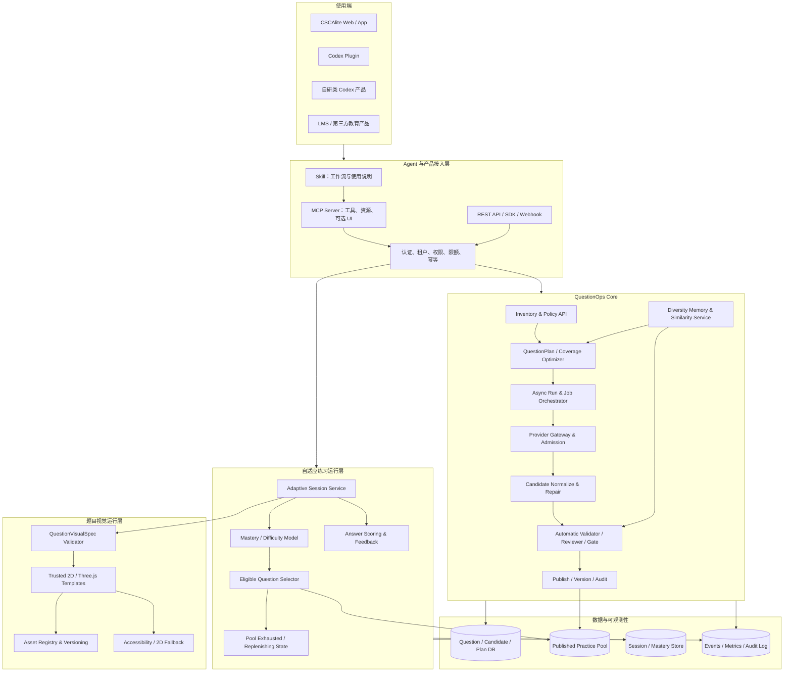
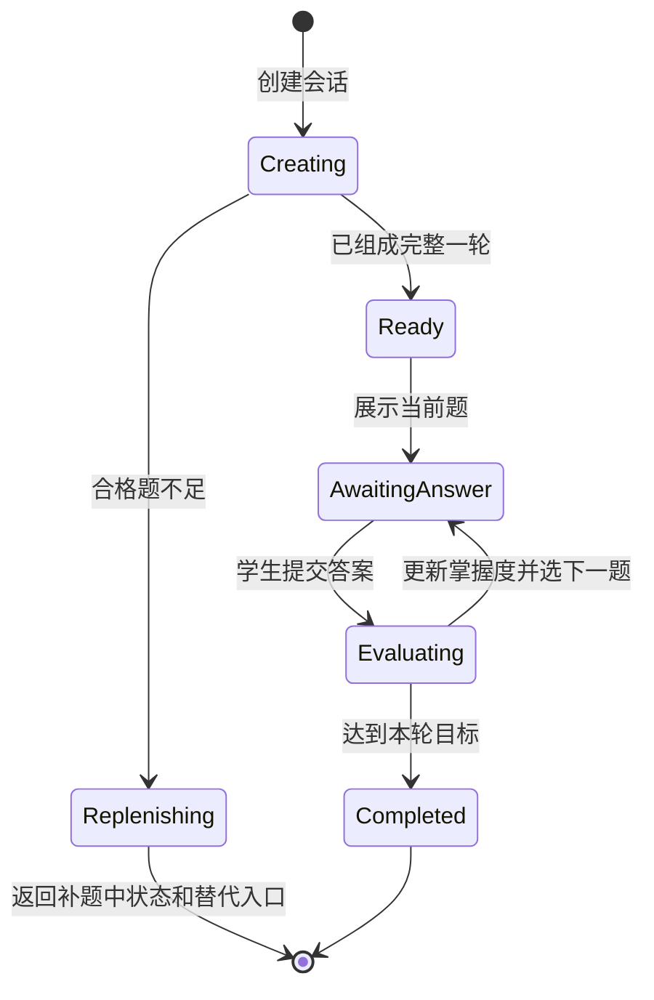
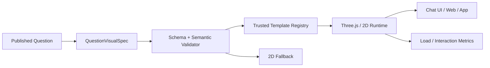

# QuestionOps 聊天式自适应练习与 3D 题目产品架构

日期：2026-08-11  
状态：长期产品与技术方案  
适用范围：CSCAlite 当前 AI 出题系统，以及未来面向 Codex、类 Codex Agent、LMS 和第三方教育产品的独立 QuestionOps 服务

## 1. 一句话结论

未来不应把 CSCAlite 的 AI 出题能力做成一段只能嵌入当前网站的业务代码，而应逐步抽成一个 **API-first 的 QuestionOps Core**：统一负责题目规划、异步生成、自动质量门、多样性治理、正式题池发布、自适应选题和审计。

Codex 侧采用 **Plugin = Skill + MCP Server + 可选 UI** 接入；自研类 Codex 产品复用同一套 MCP/API。学生可以在聊天流中完成自适应练习，复杂题目可通过受控的网页 3D 运行时表达，但学生请求不直接触发同步生题，所有题目仍必须先通过自动质量门并进入正式可投放题池。

## 2. 产品定义

QuestionOps 不是“调用一次大模型，返回一道题”的薄封装，而是面向题目全生命周期的生产与运行平台：

1. 根据学科、知识点、难度、题型策略和库存缺口制定 QuestionPlan。
2. 在预算、并发和供应商约束下异步生成候选题。
3. 自动执行格式、答案、解释、难度、证据、多样性和安全校验。
4. 将合格题发布到版本化的正式题池，不合格题进入可解释的拒绝与修复路径。
5. 为网站、聊天 Agent、LMS 和第三方产品提供统一的自适应练习会话。
6. 对文本、二维图和三维交互题使用统一的题目资产协议。
7. 提供全过程审计、指标、回放、取消和故障恢复能力。

## 3. 目标与非目标

### 3.1 目标

- 一套核心服务支持数学、物理、化学，并可扩展到更多学科。
- 生成与消费解耦，学生体验不被 provider 超时、空输出或冷却直接影响。
- 自动质量门是正式发布的唯一必要审批路径，不依赖人工逐题审核。
- Codex 和自研 Agent 都能通过稳定协议发起、观察和消费任务。
- 支持聊天式自适应练习，并允许题目携带可信的 2D/3D 交互表达。
- 所有写操作可限额、幂等、可审计、可取消，不允许 Agent 绕过治理边界。

### 3.2 非目标

- 不让 Agent 直接访问 provider key、数据库或内部队列表。
- 不提供“无限生成”“跳过审核”“强制发布”等危险能力。
- 不在学生等待下一题时同步调用大模型生成正式题。
- 不让大模型生成并执行任意 JavaScript 作为题目内容。
- 不把人工逐题审批重新引入正式生产链路。

## 4. 当前事实与目标状态

状态说明：`LIVE` 已运行；`PARTIAL` 已有部分能力但仍需完善；`FUTURE` 长期建设。

| 能力 | 当前状态 | 目标状态 |
| --- | --- | --- |
| 学科训练生产线、run/job、自动 reviewer/gate | `LIVE/PARTIAL` | 稳定的跨学科 QuestionOps Core |
| 正式 published 题池消费 | `LIVE` | 所有渠道共享统一发布口径 |
| 自适应完整一轮取题 | `LIVE` | 独立 Adaptive Session API |
| 题池耗尽后返回 replenishing，而非同步生题 | `LIVE` | 所有客户端统一状态语义 |
| QuestionPlan 与 evidence slots | `PARTIAL` | 生成前的结构化规划强约束 |
| 多样性分类、短窗口记忆与策略 | `PARTIAL` | 结构化覆盖优化与长期去重 |
| 稳定外部 REST/SDK | `FUTURE` | 正式版本化产品接口 |
| MCP Server、Skill、Codex Plugin | `FUTURE` | Agent 原生接入 |
| 聊天式自适应练习 | `FUTURE` | 文本、图形和 3D 统一会话 |
| 3D visualSpec 与可信渲染器 | `FUTURE` | 多学科模板库和降级体系 |
| 多租户、计费、SLA | `FUTURE` | 可独立商业化服务 |

### 4.1 三科运行模型

QuestionOps 产品采用“一套共享内核、三个学科策略包、三条独立生产与灰度通道”：

- 共享：Core API、run/job 状态机、Gateway、key pool、重试/cooldown、审计、版本和发布协议。
- 分科：TaskFamily、DifficultyRubric、EvidenceTarget、validator、QuestionPlan template、DiversityAxes、视觉与表示规则。
- 独立：production run/cell、正式题池、质量指标、feature flag、rollout gate、停止线和上线节奏。
- 资源调度：一个 key 时按公平队列串行，多个 key 时允许不同 subject lane 并行；共享 key 池不意味着把三科放进同一个 prompt、job 或质量结论。

设计时同时覆盖数学、物理、化学，是为了确保 Core 接口通用且不会被某一科规则污染；实际开发和验收应逐科推进。短期不复制三套服务，长期也不允许一个学科失败阻断另外两科。

## 5. 总体架构



## 6. 聊天式自适应练习

### 6.1 用户体验

学生可以在聊天流中说：“给我做一组化学平衡中等难度的自适应练习。”Agent 创建练习会话，展示第一道已发布题。学生作答后，后端评分、更新掌握度、选择下一道题，并将结果以聊天文本、选项控件、二维图或三维交互组件返回。

### 6.2 核心状态机



### 6.3 必须保持的边界

- 只消费满足 approved、published、目标 use case 和题库版本要求的题。
- 默认保持完整一轮才开始，避免做到一半才发现库存不足。
- 题池不足返回稳定产品状态，例如 `ADAPTIVE_PRACTICE_POOL_EXHAUSTED` / `replenishing`。
- 学生请求只触发库存短缺事件和异步补货信号，不同步等待生题。
- 报告页、聊天 Agent 和网站对该状态使用一致语义，停止无意义自动重试。
- provider 错误、review 细节和内部队列状态不直接暴露给学生。

## 7. 为什么采用 API + MCP + Skill + Plugin

| 层 | 职责 | 不应承担的职责 |
| --- | --- | --- |
| QuestionOps REST API | 业务真相、鉴权、异步任务、发布、会话 | 不承载 Agent 提示词 |
| MCP Server | 将稳定业务能力暴露为 Agent 工具和资源 | 不复制核心生成与质量逻辑 |
| Skill | 告诉 Agent 何时调用、如何分步、如何解释结果 | 不保存敏感凭证或业务状态 |
| Codex Plugin | 打包 Skill、MCP 和可选 UI，便于安装分发 | 不成为另一套独立后端 |
| SDK | 方便自研产品、LMS 和服务端直接集成 | 不绕过 API 权限与审计 |
| Codex App Server | 自研 Codex 客户端的深度会话、审批和事件接入 | 不替代 QuestionOps Core |

对 Codex，最终交付形态建议是一个 QuestionOps Plugin。对自研类 Codex 产品，首选同一 MCP Server；需要更深的 Codex 客户端体验时，再接入 Codex App Server。两条路径共享 QuestionOps API，不形成两套业务实现。

## 8. 建议的 MCP 工具面

### 8.1 只读与诊断工具

- `questionops.list_subjects`
- `questionops.inspect_inventory`
- `questionops.preview_plan`
- `questionops.get_run_status`
- `questionops.list_candidates`
- `questionops.explain_rejection`
- `questionops.get_quality_audit`
- `questionops.get_adaptive_session`

### 8.2 受控写工具

- `questionops.start_bounded_run`
- `questionops.cancel_run`
- `questionops.create_adaptive_session`
- `questionops.submit_answer`
- `questionops.export_approved_questions`

所有写工具必须携带或由服务端注入：`tenantId`、`scope`、`policyVersion`、`idempotencyKey`，以及题量、token、金额、时长和并发预算；同时记录调用者、来源客户端和审计上下文。

### 8.3 永远不暴露的工具

- `force_publish`
- `skip_quality_gate`
- `generate_unbounded`
- `execute_provider_prompt`
- 原始 SQL、provider key 读写或内部队列表直接修改

## 9. 异步任务模型

Agent 发起的是一个有界业务任务，而不是保持连接等待模型连续生成：

1. `preview_plan` 返回预计覆盖、预算、风险和策略版本。
2. `start_bounded_run` 创建 run 并立即返回 `runId`。
3. worker 按 cell 和并发策略执行 job。
4. 客户端通过 `get_run_status`、事件流或 webhook 获得进度。
5. 完成后读取 approved、rejected、shortage 和质量摘要。
6. 超时、取消和重试都在服务端形成明确终态，不能留下假 running。

幂等键避免 Agent 重试导致重复 run；预算和 admission 避免多个 Agent 同时抢占 provider；所有终态必须可重放、可解释。

## 10. 3D 题目视觉架构

### 10.1 原则

3D 不是把模型生成的一段网页代码塞进聊天窗口。模型或规划器只产生结构化 `QuestionVisualSpec`，服务端校验后交给受信任的模板渲染器。渲染器由产品代码维护，可测试、可版本化、可降级。

### 10.2 示例协议

```json
{
  "visualTemplateId": "physics.projectile-motion.v1",
  "sceneVersion": "1.0.0",
  "objects": [
    { "id": "ball", "type": "sphere", "position": [0, 1.2, 0] },
    { "id": "ground", "type": "plane", "position": [0, 0, 0] }
  ],
  "parameters": {
    "initialSpeed": 12,
    "launchAngleDeg": 35,
    "gravity": 9.8
  },
  "camera": { "preset": "side", "fit": "scene" },
  "interaction": {
    "mode": "inspect-and-answer",
    "controls": ["play", "pause", "reset", "timeSlider"]
  },
  "answerBindings": [
    { "field": "range", "source": "student.numericInput" }
  ],
  "fallback2D": { "renderer": "projectile-diagram.v1" },
  "accessibility": {
    "description": "小球以 35 度仰角从地面抛出，可播放并观察轨迹。"
  },
  "assetHash": "sha256:..."
}
```

### 10.3 渲染链路



### 10.4 学科模板示例

| 学科 | 适合的 3D/交互模板 | 仍需文字表达的核心 |
| --- | --- | --- |
| 数学 | 空间几何、截面、旋转体、坐标变换 | 条件、证明目标、答案口径 |
| 物理 | 力学装置、轨迹、电路状态、光路 | 理想化假设、单位、变量定义 |
| 化学 | 分子结构、晶胞、实验装置、反应过程 | 反应条件、安全信息、方程式 |

### 10.5 安全与可用性边界

- visualSpec 使用严格 schema、数值范围和枚举白名单。
- 模板版本固定，题目发布后不能被静默替换。
- 禁止模型提供可执行 JavaScript、远程脚本 URL 或任意 HTML。
- 外部资产需进入受控 registry，校验来源、格式、大小和哈希。
- 每道 3D 题必须有 2D/文本降级路径和无障碍描述。
- 评分依据来自结构化答案绑定，不依赖前端任意事件字符串。
- 在桌面和移动端验证非空白、视角、缩放、遮挡和交互稳定性。

## 11. 自动质量与“无人审题”边界

正式生产流程不设置人工逐题审批。自动 validator、reviewer、gate 和发布策略共同决定题目能否进入 published 池。

人工角色仅存在于以下非阻塞场景：周期性抽样估计自动质量门的误放和误挡率；新学科、新 policyVersion 或新 3D 模板上线前的离线校准；事故调查、规则回放和数据标注。

人工抽检不能成为每道题发布的前置步骤，也不能掩盖自动治理机制不稳定的问题。错题入库、答案解释矛盾、真实难度明显错位、cell 串库和队列假状态仍属于必须修复的系统缺陷。

## 12. 多样性与规划机制

多样性不能只依赖题干 embedding 距离，也不能靠不断增加 prompt 禁令。目标机制应把近期记忆、结构化覆盖和语义相似度组合起来：

1. QuestionPlan 先指定 `TaskFamily`、`StemPattern`、`DifficultyRubric`、`EvidenceTarget` 和 `DiversityAxes`。
2. 分类器将历史题归入稳定、学科特定的 task family，避免宽泛关键词串线。
3. Coverage Optimizer 在知识点、难度、题族、物质或情境体系、推理路径、误区和答案结构上计算缺口。
4. 生成前避开短窗口重复组合，生成后再做结构化指纹和语义近重复检测。
5. reviewer 验证题目是否遵守 plan，而不是只判断题目“看起来是否正确”。
6. embedding/向量库作为规模增长后的语义召回层，不替代结构化策略库和确定性门控。

因此，向量库不是第一阶段硬依赖；当题量、跨版本和跨租户检索规模增长后，再引入向量索引作为混合检索的一部分。

## 13. 安全、权限与多租户

- API key、OAuth 或短期 token 只授予最小 scope。
- 学生只能创建练习会话和提交答案，不能启动生产 run。
- 教学运营可查看库存、计划和审计；生产写操作需要独立权限与预算。
- Agent 的每次写调用记录调用者、租户、工具名、参数摘要、policyVersion 和结果。
- 租户之间隔离题池、策略、预算、审计和导出权限。
- 敏感 provider 配置只存在于 QuestionOps 服务端。
- webhook 需要签名、重放保护和事件版本。
- 删除、取消、发布和导出采用明确权限，不允许通过自然语言绕过。

## 14. 可观测性与核心指标

### 14.1 生产效率

- approved questions / provider call
- approved questions / 小时与单位成本
- plan adherence rate 和 cell 缺口下降速度
- provider 错误恢复时间
- running/queued/stale 状态分布

### 14.2 题目质量

- 自动门误放率与误挡率的抽样估计
- 答案唯一性、解释一致性、难度命中率
- task family、情境、推理路径和答案结构覆盖率
- 短窗口结构重复率与语义近重复率
- 上线后撤题率

### 14.3 自适应体验

- 会话创建成功率和首题延迟
- 完整一轮完成率
- 每题提交到反馈的延迟
- pool exhausted / replenishing 发生率
- 掌握度更新稳定性和题目曝光均衡度

### 14.4 3D 运行时

- visualSpec 校验失败率
- 模板加载失败率、白屏率和首帧时间
- 2D fallback 触发率
- 移动端交互完成率
- 视觉题评分事件一致性

## 15. 分阶段路线

### Phase 0：稳住当前核心

- 保持学生消费与后台生产解耦。
- 完成三学科质量、难度、多样性和队列机制观测。
- 固化 QuestionPlan、policyVersion、发布口径和状态语义。

### Phase 1：内部 QuestionOps API

- 将库存、计划、run、候选题、审计和发布能力收敛到稳定 service facade。
- 定义异步 run、幂等、预算、取消、事件和错误契约。
- 现有 CSCAlite 前后端先作为第一个 API 消费者。

### Phase 2：只读 MCP + Skill

- 先开放库存、计划预览、状态和拒绝解释。
- 用 Skill 固化诊断和运营工作流。
- 验证 Codex 和自研 Agent 对同一协议的兼容性。

### Phase 3：聊天式文本自适应练习

- 开放创建会话、展示题目、提交答案和完成一轮。
- 统一网站与聊天端的 replenishing 状态。
- 不开放学生侧即时生成。

### Phase 4：受控生产写工具

- 开放有预算的 start/cancel/export。
- 增加 scope、审计、速率限制和 webhook。
- 禁止绕过自动质量门。

### Phase 5：3D 模板 MVP

- 优先选择数学空间几何、物理抛体或化学分子结构中的少量高价值模板。
- 完成 visualSpec、validator、Three.js renderer、2D fallback 和端到端测试。
- 视觉资产和模板进入独立版本治理。

### Phase 6：Codex Plugin 与自研客户端

- 将 Skill、MCP Server 和可选聊天 UI 打包为 Plugin。
- 自研客户端复用 MCP/API；需要 Codex 深度能力时接 App Server。
- 建立安装、升级、兼容和遥测机制。

### Phase 7：独立产品化

- 多租户、配额、计费、SLA、数据驻留和客户策略隔离。
- 提供 SDK、文档、沙箱、webhook 和版本迁移机制。
- 建立跨客户匿名质量基线，但不混用私有题目数据。

## 16. 验收标准

### 16.1 Agent 接入

- Codex 与自研 Agent 能通过同一 MCP/API 查看库存、预览计划和查询任务。
- 重复调用不会创建重复 run，超预算请求被明确拒绝。
- Agent 无法读取 provider key、跳过 gate 或强制发布。

### 16.2 聊天式练习

- 学生能在聊天流完成一整个自适应轮次。
- 每道题均来自正式 published 池，答案提交后掌握度和下一题选择一致。
- 库存不足稳定进入 replenishing，不报红、不空白、不循环生成。

### 16.3 3D 题目

- 只执行受信任模板和通过校验的 visualSpec。
- 桌面与移动端均可正确加载、缩放、交互和评分。
- 3D 不可用时仍能通过 2D/文本完成题目。

### 16.4 质量与运维

- 自动质量门是发布必经路径，无人工逐题审批依赖。
- run/job 无永久 queued、running 或 provider 错误污染成永久 blocked。
- 关键指标能按学科、topic、difficulty、task family、provider 和 policyVersion 分析。

## 17. 主要风险与应对

| 风险 | 应对 |
| --- | --- |
| 把 MCP 当业务后端，形成重复逻辑 | MCP 只做协议适配，业务真相留在 Core API |
| Agent 重试制造重复任务和成本 | 幂等键、有界预算、admission 和服务端状态机 |
| 聊天请求直接生成导致长等待和质量波动 | published 池优先，耗尽返回 replenishing，后台异步补货 |
| 3D 内容变成任意代码执行 | visualSpec 白名单、可信模板、沙箱资源和严格 CSP |
| 多样性只看 embedding，结构仍同质 | QuestionPlan + 分类器 + 覆盖优化 + 混合相似度 |
| 自动 reviewer 长期误挡或误放 | 离线基准、抽样校准、policyVersion 对比和回放 |
| 三学科共用过宽规则导致串线 | 通用治理框架 + 学科策略包 + topic mapping |
| 产品化过早拖慢当前质量修复 | 分阶段交付，先内部 API 和只读接入 |

## 18. 永久架构边界

1. Agent 是受控调用者，不是数据库管理员或 provider 管理员。
2. 学生练习路径与题目生产路径必须异步解耦。
3. 自动质量门不可被客户端、Skill 或 MCP 工具绕过。
4. 人工抽样只用于校准和事故调查，不是正式发布审批。
5. 三学科共享平台能力，但题型策略、证据和难度 rubric 必须学科化。
6. 3D 题目使用声明式协议和可信模板，不执行模型生成的任意代码。
7. 向量库是语义检索组件，不是多样性治理和正确性判断的唯一依据。
8. 所有写操作有界、幂等、可审计、可取消，并具有稳定终态。

## 19. 与现有文档的关系

- 全局当前态与目标态总图：`docs/ai-questioning-complete-current-and-target-architecture-2026-08-10.md`
- QuestionOps 独立产品与 Agent 接入早期计划：`docs/ai-questionops-agent-integration-product-plan-2026-08-07.md`
- QuestionPlan 与 evidence slots 执行方案：`docs/ai-questioning-question-plan-evidence-slots-executable-plan-2026-08-10.md`
- 自适应练习题池耗尽状态：`docs/adaptive-practice-pool-exhausted-replenishing-state-plan-2026-08-05.md`
- 学科练习 backend-owned execution 评估：`docs/subject-practice-observation-backend-owned-execution-architecture-assessment-2026-08-10.md`

本文件专门补齐未来的 **聊天式自适应练习、Codex/Agent 产品接入和 3D 题目运行时**。若本文件与全局架构文档对“当前是否已实现”的描述不一致，以全局架构文档的状态标注和代码事实为准。

## 20. 官方技术参考

- OpenAI Plugins：<https://developers.openai.com/plugins/concepts/plugins>
- OpenAI Skills：<https://developers.openai.com/plugins/concepts/skills>
- OpenAI MCP Server：<https://developers.openai.com/plugins/concepts/mcp-server>
- OpenAI Codex App Server：<https://developers.openai.com/codex/app-server>
