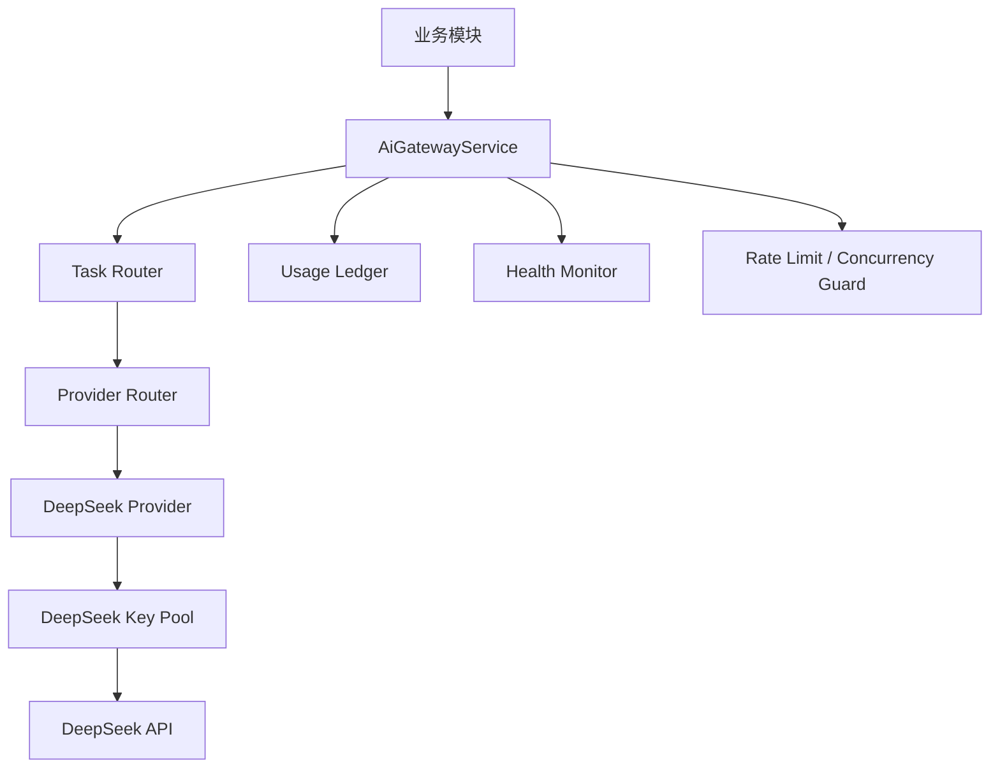

# DeepSeek First AI Gateway 可执行方案

日期：2026-07-09

## 1. 背景

当前阶段平台只有一个 DeepSeek Key，但后续学生数量增加后，单 Key 会带来明显风险：

- 并发请求过高导致超时或限流。
- 学生 AI Coach、题目解释、后台出题互相抢资源。
- Provider 抖动时全站 AI 能力不可用。
- 后续接入 OpenAI、Gemini、Claude 或机构 BYOK 时，如果业务代码已经写死 DeepSeek，会产生大规模重构。

因此，当前不应做“只为一个 DeepSeek Key 写死的调用链”，而应采用：

```text
前期 DeepSeek only
架构按多 Provider / 多 Key 池设计
后期平滑扩展其他模型
```

## 0. 配套文档索引

本方案是总方案。直接开发前应同时阅读以下配套文档：

| 文档 | 作用 |
| --- | --- |
| `docs/deepseek-first-ai-gateway-callsite-audit-2026-07-09.md` | 审计当前 AI 调用点，明确哪些服务要迁移到 Gateway。 |
| `docs/deepseek-first-ai-gateway-interface-and-data-spec-2026-07-09.md` | 定义 `AiGatewayService`、Provider、Key Pool、错误码、ledger 等接口和数据结构。 |
| `docs/deepseek-first-ai-gateway-phase-1-work-orders-2026-07-09.md` | 把 Phase 1 拆成可以直接开发和验收的工单。 |
| `docs/deepseek-first-ai-gateway-rollout-runbook-2026-07-09.md` | 定义宝塔/Docker 上线、环境变量、监控、回滚和故障处理步骤。 |

## 2. 目标

### 2.1 当前阶段目标

- 只实际接入 DeepSeek。
- 所有 AI 调用统一进入 AI Gateway。
- DeepSeek Key 按 Key Pool 管理，即使当前只有 1 个 key。
- 支持并发限制、超时、重试、熔断、冷却、恢复。
- 支持任务类型路由，但当前所有任务都路由到 DeepSeek。
- 记录完整调用日志、耗时、错误、token 和成本估算。

### 2.2 后续阶段目标

- 增加多个 DeepSeek Key。
- 增加 OpenAI、Gemini、Claude 等 Provider。
- 支持机构 BYOK。
- 支持按任务类型、机构、用户套餐、成本、稳定性进行路由。
- 支持 Provider 健康检查和自动切换。

## 3. 设计原则

### 3.1 业务层不直接调用 DeepSeek

以下模块不应直接调用 DeepSeek API：

- AI Coach。
- 科目训练出题。
- 在线模考出题。
- AI 审题。
- 翻译。
- 题目修复。
- 后台运营助手。

它们只能调用统一入口：

```text
AiGatewayService
```

### 3.2 当前只实现 DeepSeek Provider

第一阶段只实现：

```text
DeepSeekProvider
```

但接口必须按通用 Provider 设计，未来新增 Provider 时只实现同一接口。

### 3.3 Key Pool 从第一天就存在

即使只有一个 key，也按数组和池化管理：

```text
DeepSeek Provider
  - key-1
```

未来扩展为：

```text
DeepSeek Provider
  - key-1
  - key-2
  - key-3

OpenAI Provider
  - key-1

Gemini Provider
  - key-1
```

### 3.4 学生体验优先

AI Gateway 不能只做简单限流。它必须区分任务优先级：

1. 学生实时 AI Coach / 提示。
2. 学生题目解释。
3. 学生错题讲解。
4. 后台紧急补题。
5. 后台普通预测补题。
6. 批量翻译、批量修复、低峰任务。

高优先级任务应优先使用健康 key 和更短队列。

## 4. 总体架构



当前阶段实际链路：

```text
业务模块
  -> AiGatewayService
  -> Task Router
  -> Provider Router
  -> DeepSeek Provider
  -> DeepSeek Key Pool
  -> DeepSeek API
```

未来扩展链路：

```text
业务模块
  -> AiGatewayService
  -> Task Router
  -> Provider Router
  -> DeepSeek / OpenAI / Gemini / Claude / Org BYOK
```

## 5. 任务类型

AI Gateway 必须要求调用方声明 `taskType`。

建议初始任务类型：

| taskType | 用途 | 优先级 | 是否学生实时 |
| --- | --- | ---: | --- |
| ai_coach_hint | 学生提示 | 100 | 是 |
| ai_coach_explanation | 学生题目解释 | 95 | 是 |
| wrong_question_explanation | 错题解释 | 90 | 是 |
| question_generation | 科目/模考出题 | 50 | 否 |
| question_review | AI 审题 | 60 | 否 |
| question_repair | 题目修复 | 55 | 否 |
| translation | 中英文翻译 | 40 | 否 |
| admin_assistant | 管理后台助手 | 45 | 否 |
| batch_backfill | 批量补题 | 20 | 否 |

当前所有 taskType 都路由到 DeepSeek，但必须保留 taskType 字段。

## 6. Provider 接口

建议定义通用接口：

```ts
export interface AiProvider {
  readonly providerId: string;
  readonly displayName: string;

  complete(request: AiProviderRequest): Promise<AiProviderResponse>;

  healthCheck(): Promise<AiProviderHealth>;
}
```

请求结构：

```ts
export interface AiProviderRequest {
  taskType: AiTaskType;
  model?: string;
  messages: AiMessage[];
  responseFormat?: "text" | "json";
  temperature?: number;
  maxTokens?: number;
  timeoutMs?: number;
  metadata?: Record<string, unknown>;
}
```

响应结构：

```ts
export interface AiProviderResponse {
  providerId: string;
  model: string;
  keyId: string;
  status: "success" | "failed";
  content?: string;
  json?: unknown;
  usage?: {
    promptTokens?: number;
    completionTokens?: number;
    totalTokens?: number;
  };
  latencyMs: number;
  errorCode?: string;
  errorMessage?: string;
  raw?: unknown;
}
```

## 7. Key Pool 设计

### 7.1 Key 配置

前期建议支持环境变量：

```env
AI_DEFAULT_PROVIDER=deepseek

DEEPSEEK_BASE_URL=https://api.deepseek.com
DEEPSEEK_API_KEYS=key1
DEEPSEEK_DEFAULT_MODEL=deepseek-chat
DEEPSEEK_REASONER_MODEL=deepseek-reasoner
```

未来可扩展为：

```env
DEEPSEEK_API_KEYS=key1,key2,key3
OPENAI_API_KEYS=key1,key2
GEMINI_API_KEYS=key1
```

### 7.2 Key 状态

每个 key 需要维护运行时状态：

```ts
export interface AiProviderKeyRuntimeState {
  keyId: string;
  providerId: string;
  enabled: boolean;
  currentConcurrency: number;
  requestsInCurrentMinute: number;
  requestsInCurrentDay: number;
  failuresInWindow: number;
  timeoutCountInWindow: number;
  rateLimitCountInWindow: number;
  averageLatencyMs: number;
  lastSuccessAt?: Date;
  lastFailureAt?: Date;
  cooldownUntil?: Date;
}
```

### 7.3 Key 选择规则

选择 key 时按以下顺序：

1. 排除 disabled key。
2. 排除 cooldown 中的 key。
3. 排除超过并发上限的 key。
4. 排除超过分钟/日额度的 key。
5. 优先选择平均延迟低、失败率低的 key。
6. 同分时轮询。

## 8. 并发和限流

### 8.1 全局默认值

建议前期保守配置：

```env
AI_GATEWAY_GLOBAL_CONCURRENCY=5
AI_GATEWAY_STUDENT_REALTIME_CONCURRENCY=3
AI_GATEWAY_BACKGROUND_CONCURRENCY=2
AI_GATEWAY_REALTIME_QUEUE_TIMEOUT_MS=5000
AI_GATEWAY_BACKGROUND_QUEUE_TIMEOUT_MS=120000

DEEPSEEK_KEY_CONCURRENCY=2
DEEPSEEK_REQUESTS_PER_MINUTE=60
DEEPSEEK_REQUESTS_PER_DAY=5000

AI_GATEWAY_DEFAULT_TIMEOUT_MS=30000
AI_GATEWAY_STUDENT_TIMEOUT_MS=15000
AI_GATEWAY_BACKGROUND_TIMEOUT_MS=60000
```

### 8.2 学生实时任务

学生实时任务不能被后台批量任务挤占。

推荐保留独立并发池：

```text
student realtime pool: 60%
background pool: 40%
```

如果当前只有一个 DeepSeek key，示例：

```text
DeepSeek key concurrency = 2

1 个并发保留给学生实时任务
1 个并发给后台任务
```

### 8.3 后台任务

后台任务必须排队：

- 出题任务。
- 审题任务。
- 翻译任务。
- 修复任务。
- 批量补题任务。

后台任务不能直接无限并发调用 DeepSeek。

## 9. 熔断与恢复

### 9.1 熔断条件

单 key 满足以下任一条件时进入冷却：

- 连续超时达到 3 次。
- 5 分钟内失败率超过 50%。
- 收到 Provider rate limit 响应。
- 网络错误连续发生。
- 平均延迟超过阈值。

Provider 整体满足以下条件时进入部分熔断：

- 所有 key 都进入 cooldown。
- Provider 健康检查失败。
- Provider 大面积超时。

### 9.2 冷却时间

建议：

| 错误类型 | 冷却时间 |
| --- | ---: |
| timeout | 60 秒 |
| rate_limit | 180 秒 |
| network_error | 60 秒 |
| invalid_api_key | 永久禁用，直到配置更新 |
| quota_exceeded | 禁用至下一个额度周期 |

### 9.3 恢复

冷却结束后可以进入半开状态：

```text
cooldown -> half_open -> healthy
```

半开状态只允许少量探测请求。

探测成功后恢复。

## 10. 重试策略

### 10.1 可重试错误

以下错误可重试：

- timeout。
- network_error。
- provider_5xx。
- rate_limit，但必须等待冷却或换 key。

### 10.2 不可重试错误

以下错误不应盲目重试：

- invalid_api_key。
- invalid_request_schema。
- prompt_too_long。
- safety_rejected。
- response_schema_invalid。

其中 `response_schema_invalid` 对出题任务可以进入“修复/重生”业务流程，但不是 Gateway 层简单重试。

### 10.3 重试次数

建议：

| 任务类型 | 最大重试 |
| --- | ---: |
| 学生实时提示 | 1 |
| 学生解释 | 1 |
| 后台出题 | 2 |
| 后台审题 | 2 |
| 批量任务 | 3 |

学生实时任务应优先快速返回，而不是长时间重试。

## 11. 路由规则

### 11.1 当前阶段

当前所有任务都路由到 DeepSeek：

```env
AI_ROUTE_AI_COACH_HINT=deepseek
AI_ROUTE_AI_COACH_EXPLANATION=deepseek
AI_ROUTE_QUESTION_GENERATION=deepseek
AI_ROUTE_QUESTION_REVIEW=deepseek
AI_ROUTE_QUESTION_REPAIR=deepseek
AI_ROUTE_TRANSLATION=deepseek
```

### 11.2 后续阶段

未来可以调整为：

```env
AI_ROUTE_AI_COACH_HINT=openai
AI_ROUTE_AI_COACH_EXPLANATION=deepseek
AI_ROUTE_QUESTION_GENERATION=deepseek
AI_ROUTE_QUESTION_REVIEW=claude
AI_ROUTE_TRANSLATION=gemini
```

业务模块不需要改代码。

## 12. 日志与计费

每一次 AI Gateway 调用必须记录 ledger。

建议字段：

```text
id
request_id
task_type
provider_id
model
key_id
user_id
organization_id
source_module
status
error_code
latency_ms
prompt_tokens
completion_tokens
total_tokens
estimated_cost
created_at
```

用途：

- 统计成本。
- 追踪失败。
- 分析 Provider 稳定性。
- 识别学生实时体验问题。
- 支持机构 BYOK 账单。
- 后台展示 AI 运维状态。

## 13. 缓存策略

为了提高体验和降低成本，以下内容可以缓存：

### 13.1 可缓存

- 同一道题的标准提示。
- 同一道题的标准解析。
- 同一道错题的讲解。
- 同一个知识点的概念解释。
- 翻译结果。

### 13.2 不建议缓存

- 带学生个人状态的个性化建议。
- 连续对话上下文。
- 包含实时学习计划的回答。

### 13.3 缓存 key

建议：

```text
taskType + language + questionId + promptVersion + modelVersion
```

Prompt 或模型版本变化后自动失效。

## 14. 与现有业务模块的接入方式

### 14.1 AI Coach

现状目标：

```text
AiCoachService -> AiGatewayService.chat()
```

要求：

- taskType = `ai_coach_hint` 或 `ai_coach_explanation`
- 使用学生实时优先级。
- 超时短。
- 可使用缓存。
- 失败时返回规则兜底或简短提示。

### 14.2 科目训练出题

现状目标：

```text
QuestionGeneratorService -> AiGatewayService.complete()
```

要求：

- taskType = `question_generation`
- 后台队列执行。
- 允许较长超时。
- 失败后进入任务重试或题目重生流程。
- 不阻塞学生训练。

### 14.3 在线模考出题

目标：

```text
MockExamGenerationService -> AiGatewayService.complete()
```

要求：

- taskType = `question_generation`
- metadata 标记 `useCase = mock_exam`
- 走后台队列。
- 不与学生实时 AI 抢占保留并发。

### 14.4 AI 审题

目标：

```text
QuestionReviewerService -> AiGatewayService.complete()
```

要求：

- taskType = `question_review`
- responseFormat = `json`
- schema invalid 不在 Gateway 层无限重试。
- 审题失败应返回业务可读错误。

### 14.5 翻译与双语版本

目标：

```text
TranslationService -> AiGatewayService.complete()
```

要求：

- taskType = `translation`
- 可低优先级。
- 支持缓存。
- 批量翻译不能抢占学生实时并发。

## 15. 后台运维界面

建议在 AI 运维页面展示：

### 15.1 Provider 健康

- Provider 名称。
- 当前状态。
- 平均延迟。
- 失败率。
- 限流次数。
- 超时次数。
- 最近成功时间。
- 最近失败时间。

### 15.2 Key Pool 状态

- keyId。
- 是否启用。
- 当前并发。
- 分钟请求数。
- 日请求数。
- cooldownUntil。
- 最近错误。

### 15.3 任务队列

- taskType。
- 排队数。
- 运行数。
- 成功数。
- 失败数。
- 平均耗时。
- 最近失败原因。

### 15.4 成本统计

- 今日 token。
- 今日估算成本。
- 按任务类型成本。
- 按组织成本。
- 按 Provider 成本。

## 16. 数据结构建议

### 16.1 Provider 配置表

```text
ai_provider_configs
```

字段：

```text
id
provider_id
display_name
base_url
default_model
enabled
priority
created_at
updated_at
```

### 16.2 Provider Key 表

```text
ai_provider_keys
```

字段：

```text
id
provider_id
key_label
encrypted_api_key
enabled
max_concurrency
requests_per_minute
requests_per_day
organization_id
created_at
updated_at
```

第一阶段可以先不入库，使用环境变量；但接口和运行时状态按这个形态设计。

### 16.3 AI 调用日志表

```text
ai_gateway_call_logs
```

字段：

```text
id
request_id
task_type
source_module
provider_id
model
key_id
user_id
organization_id
status
error_code
error_message
latency_ms
prompt_tokens
completion_tokens
total_tokens
estimated_cost
metadata
created_at
```

## 17. 实施阶段

### Phase 1：DeepSeek only Gateway

目标：先把调用入口统一。

任务：

1. 新增 `AiGatewayModule`。
2. 新增 `AiGatewayService`。
3. 新增 `AiProvider` 通用接口。
4. 新增 `DeepSeekProvider`。
5. 新增 `DeepSeekKeyPool`。
6. 将现有 DeepSeek 调用迁移到 Gateway。
7. 增加基础调用日志。

验收：

- 所有 AI 调用都通过 Gateway。
- 当前只有 DeepSeek Provider。
- 配置一个 DeepSeek Key 即可运行。
- 业务模块没有直接调用 DeepSeek API。

### Phase 2：Key Pool 与并发控制

目标：解决单 key 被打爆的问题。

任务：

1. 支持 `DEEPSEEK_API_KEYS` 多 key 配置。
2. 实现 key 选择。
3. 实现 key 并发上限。
4. 实现任务优先级队列。
5. 学生实时任务与后台任务分池。

验收：

- 一个 key 时按单 key 并发运行。
- 多 key 时自动分配请求。
- 后台任务不会挤占学生实时保留并发。

### Phase 3：熔断、重试、健康检查

目标：Provider 不稳定时系统能自我保护。

任务：

1. 实现错误分类。
2. 实现 key cooldown。
3. 实现 Provider health check。
4. 实现半开恢复。
5. 后台展示 Provider 健康。

验收：

- DeepSeek 超时后不会无限打同一个 key。
- 限流后 key 进入冷却。
- 冷却后可自动恢复。

### Phase 4：成本、缓存与运营面板

目标：让 AI 消耗可观测、可运营。

任务：

1. 完善调用 ledger。
2. 增加 token 和成本估算。
3. 增加标准解释缓存。
4. AI 运维页面展示 Provider、key、任务、成本。

验收：

- 能看出每类 AI 任务消耗。
- 能看出哪个 key 或 Provider 不稳定。
- 常见解释能命中缓存。

### Phase 5：多 Provider 扩展

目标：后续接入其他模型时不改业务层。

任务：

1. 新增 OpenAI Provider。
2. 新增 Gemini Provider。
3. 新增 Claude Provider。
4. 支持任务级路由配置。
5. 支持 Provider fallback。

验收：

- 改配置即可切换某类任务的 Provider。
- DeepSeek 不可用时可以切备用 Provider。
- 业务模块无需修改。

### Phase 6：机构 BYOK

目标：支持机构自带 key。

任务：

1. 增加机构 Provider Key 配置。
2. key 加密存储。
3. 按组织路由。
4. 机构用量统计。
5. 机构 key 异常隔离。

验收：

- 机构 A 的 key 不影响机构 B。
- 平台 key 和机构 key 可共存。
- 机构可查看自己的 AI 消耗。

## 18. 配置示例

第一阶段 `.env`：

```env
AI_GATEWAY_ENABLED=true
AI_DEFAULT_PROVIDER=deepseek

DEEPSEEK_BASE_URL=https://api.deepseek.com
DEEPSEEK_API_KEYS=sk-xxx
DEEPSEEK_DEFAULT_MODEL=deepseek-chat
DEEPSEEK_REASONER_MODEL=deepseek-reasoner

AI_GATEWAY_GLOBAL_CONCURRENCY=5
AI_GATEWAY_STUDENT_REALTIME_CONCURRENCY=3
AI_GATEWAY_BACKGROUND_CONCURRENCY=2
DEEPSEEK_KEY_CONCURRENCY=2

AI_GATEWAY_DEFAULT_TIMEOUT_MS=30000
AI_GATEWAY_STUDENT_TIMEOUT_MS=15000
AI_GATEWAY_BACKGROUND_TIMEOUT_MS=60000
```

未来多 key：

```env
DEEPSEEK_API_KEYS=sk-xxx,sk-yyy,sk-zzz
```

未来多 Provider：

```env
AI_ROUTE_AI_COACH_HINT=openai
AI_ROUTE_QUESTION_GENERATION=deepseek
AI_ROUTE_QUESTION_REVIEW=claude
```

## 19. 验收标准

### 19.1 架构验收

- 业务模块不直接调用 DeepSeek。
- 所有 AI 请求都经过 Gateway。
- 每个请求都有 taskType。
- Provider 和 keyId 被记录。

### 19.2 并发验收

- 单 key 并发不会超过配置。
- 后台任务不会抢占学生实时保留并发。
- 多个后台生成任务会排队。

### 19.3 稳定性验收

- 超时会被记录。
- 限流会进入 cooldown。
- cooldown 后可恢复。
- invalid key 不会无限重试。

### 19.4 可扩展验收

- 新增 Provider 只需实现 AiProvider 接口。
- 新增 key 只需改配置或后台配置。
- 改 task route 不需要改业务代码。

### 19.5 运营验收

- 后台能看到 Provider 健康。
- 后台能看到 key 使用量。
- 后台能看到任务队列。
- 后台能看到成本估算。

## 20. 当前优先级建议

建议先做这 6 件事：

1. 新建 AI Gateway。
2. DeepSeek Provider 接入 Gateway。
3. 所有现有 DeepSeek 调用迁移到 Gateway。
4. DeepSeek Key Pool 支持数组配置。
5. 增加学生实时与后台任务并发隔离。
6. 增加 AI 调用日志和 Provider 健康状态。

暂时不急着做：

- OpenAI/Gemini/Claude 接入。
- 复杂模型评分路由。
- 机构 BYOK 后台完整配置。
- 精细化成本账单。

这些可以在 Gateway 骨架稳定后继续扩展。

## 21. 结论

当前阶段只使用 DeepSeek 是合理的，但代码不能写成 DeepSeek-only。

正确路线是：

```text
DeepSeek only implementation
Multi-provider architecture
Key pool from day one
Task-aware routing
Student-first priority
Observable usage and cost
```

这样既能快速上线，又不会在学生量增长、机构客户接入或新增模型时被迫重构。
