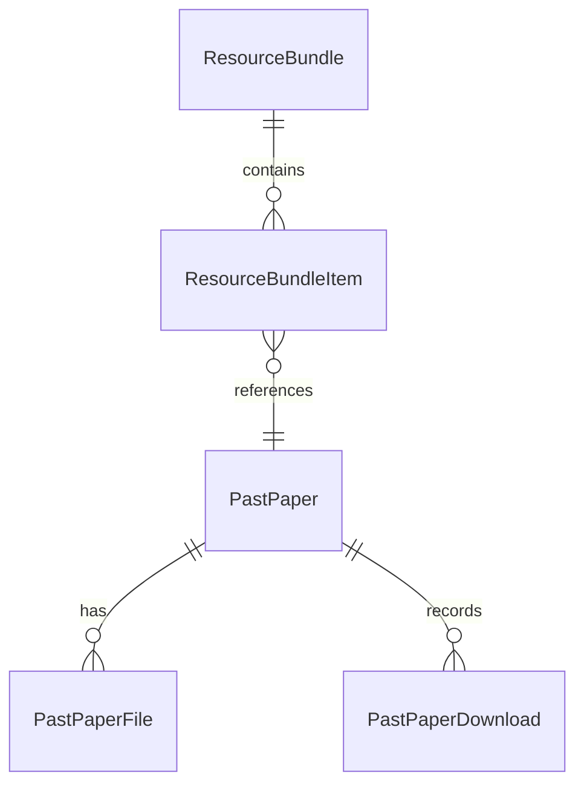

# 真题与模拟卷资料套装能力可执行方案

日期：2026-07-13

## 1. 背景

参考网站的真题和模拟卷不是只按单个 PDF 或 Word 文件呈现，而是按“套装”呈现，例如：

- 数学模拟考试套装：3 套完整试卷
- 数学模拟考试套装：5 套完整试卷 + 答案与详解
- 物理模拟卷 1+2+3
- 数学 + 物理跨科组合
- 一套资料中包含原卷、答案、解析、双语版本等多个文件

CSCAlite 当前已有资料上传能力，但数据结构更接近“单份资料”：

- `PastPaper`：一份真题或模拟卷资料。
- `PastPaperFile`：这份资料下面的文件，例如原卷 PDF、答案、解析。
- `/past-papers`：真题资料页面。
- `/mock-papers`：模拟卷资料页面。
- `/admin/past-papers`：后台资料管理页，真题与模拟卷通过 `category` 区分。

当前问题是：**后台可以上传单份真题/模拟卷，但不能把多份资料组装成一个套装并在前台按套装展示。**

本方案只解决“免费下载资料套装”能力，不做支付、订单、权限解锁。

## 2. 目标

### 2.1 产品目标

1. 后台仍然按现有方式上传单份真题或模拟卷资料。
2. 上传后的单份资料可以被组装进一个或多个套装。
3. 前台真题页和模拟卷页以“套装”为主要展示单位。
4. 用户进入套装详情后，可以看到套装包含的所有资料，并免费下载每份资料下的文件。
5. 支持同科套装，也支持跨科套装。
6. 支持只展示已发布套装，草稿套装仅后台可见。
7. 不引入支付、购物车、订单或会员权限。

### 2.2 技术目标

1. 不破坏现有 `PastPaper` / `PastPaperFile` 上传与下载逻辑。
2. 新增一层干净的 `ResourceBundle` / `ResourceBundleItem` 模型。
3. 真题和模拟卷共用套装能力，通过 `bundle.category` 区分页面归属。
4. 保留直接访问单份资料下载页的兼容能力。
5. 支持迁移现有单份资料为“默认单资料套装”。

## 3. 非目标

本阶段不做：

- 支付价格、折扣、优惠券。
- 购物车和订单。
- 登录后解锁。
- 防盗链或下载额度。
- PDF OCR。
- 在线模考作答系统改造。
- AI 生成在线模考题改造。

注意：这里的“模拟卷”指 `/mock-papers` 的资料型模拟卷，不是 `/csca-mock-exam` 的在线作答模考。

## 4. 当前架构影响判断

### 4.1 当前模型能力

现有 `PastPaper` 的定位是“单份资料”：

- 可以表达一套卷。
- 可以挂多个文件。
- 可以区分 `category = past-paper` 或 `category = mock-paper`。
- 不能表达“一个套装包含多套卷”。
- 不能表达套装排序、套装封面、套装说明、套装内资料顺序。

现有 `PastPaperFile` 的定位是“单份资料下的文件”：

- 可以表达原卷、答案、解析、附件。
- 不适合直接作为套装子项，因为套装通常包含多份 `PastPaper`，每份 `PastPaper` 再包含多个文件。

### 4.2 应保留的边界

必须保留：

- `PastPaper` 继续是资料原子资产。
- `PastPaperFile` 继续是资料文件资产。
- 后台上传流程继续创建或更新 `PastPaper`。
- 下载统计继续写入 `PastPaperDownload`。

新增套装层只负责“组织和展示”，不要把文件上传逻辑搬进去。

## 5. 推荐数据模型

### 5.1 ResourceBundle

表示一个资料套装。

建议 Prisma 模型：

```prisma
model ResourceBundle {
  id            Int                  @id @default(autoincrement())
  slug          String               @unique @db.VarChar(180)
  title         String               @db.VarChar(240)
  category      String               @default("past-paper") @db.VarChar(40)
  subjectScope  String               @default("mixed") @map("subject_scope") @db.VarChar(60)
  language      String               @default("zh") @db.VarChar(20)
  description   String?              @db.Text
  coverUrl      String?              @map("cover_url") @db.Text
  highlights    Json                 @default("[]")
  tags          Json                 @default("[]")
  isFeatured    Boolean              @default(false) @map("is_featured")
  isPublished   Boolean              @default(false) @map("is_published")
  sortOrder     Int                  @default(0) @map("sort_order")
  version       Int                  @default(1)
  createdAt     DateTime             @default(now()) @map("created_at")
  updatedAt     DateTime             @updatedAt @map("updated_at")
  deletedAt     DateTime?            @map("deleted_at")

  items         ResourceBundleItem[]

  @@index([category, subjectScope, isPublished, sortOrder], map: "idx_resource_bundles_category_subject_published_sort")
  @@index([isPublished, isFeatured, sortOrder], map: "idx_resource_bundles_featured_sort")
  @@map("resource_bundles")
}
```

字段说明：

| 字段 | 说明 |
| --- | --- |
| `slug` | 前台详情页 URL 标识。 |
| `title` | 套装标题。 |
| `category` | `past-paper` 或 `mock-paper`，决定出现在真题页还是模拟卷页。 |
| `subjectScope` | `math` / `physics` / `chemistry` / `mixed`。跨科套装用 `mixed`。 |
| `language` | 套装主语言。 |
| `description` | 套装简介。 |
| `coverUrl` | 套装封面。没有封面时前端使用默认封面。 |
| `highlights` | 前台卖点/亮点文案数组，虽然当前免费，也用于说明内容价值。 |
| `tags` | 标签，例如 `2026`、`双语`、`含解析`、`3套卷`。 |
| `isFeatured` | 是否推荐展示。 |
| `isPublished` | 是否前台发布。 |
| `sortOrder` | 排序。 |

### 5.2 ResourceBundleItem

表示套装和单份资料的关联。

```prisma
model ResourceBundleItem {
  id          Int            @id @default(autoincrement())
  bundleId    Int            @map("bundle_id")
  pastPaperId Int            @map("past_paper_id")
  label       String?        @db.VarChar(160)
  sortOrder   Int            @default(0) @map("sort_order")
  createdAt   DateTime       @default(now()) @map("created_at")

  bundle      ResourceBundle @relation(fields: [bundleId], references: [id], onDelete: Cascade)
  pastPaper   PastPaper      @relation(fields: [pastPaperId], references: [id], onDelete: Cascade)

  @@unique([bundleId, pastPaperId], map: "uq_resource_bundle_items_bundle_paper")
  @@index([bundleId, sortOrder], map: "idx_resource_bundle_items_bundle_sort")
  @@index([pastPaperId], map: "idx_resource_bundle_items_paper")
  @@map("resource_bundle_items")
}
```

字段说明：

| 字段 | 说明 |
| --- | --- |
| `bundleId` | 所属套装。 |
| `pastPaperId` | 被加入套装的单份资料。 |
| `label` | 套装内展示名称，可为空，默认使用 `PastPaper.title`。 |
| `sortOrder` | 套装内资料顺序。 |

### 5.3 与现有模型的关系

关系如下：



这意味着：

- 套装不直接保存 PDF。
- PDF 仍然挂在 `PastPaperFile`。
- 下载统计仍然挂在 `PastPaperDownload`。
- 同一份 `PastPaper` 可以出现在多个套装中。

## 6. API 设计

### 6.1 前台接口

#### GET `/api/v1/resource-bundles`

查询已发布套装。

Query：

| 参数 | 说明 |
| --- | --- |
| `category` | `past-paper` / `mock-paper`。 |
| `subject` | `math` / `physics` / `chemistry` / `mixed`，为空则全部。 |
| `locale` | `zh` / `en` / `vi`。 |

返回：

```json
{
  "items": [
    {
      "id": 1,
      "slug": "math-mock-core-5",
      "title": "CSCA 数学模拟卷核心套装",
      "category": "mock-paper",
      "subjectScope": "math",
      "description": "5 套数学模拟卷，含答案与解析。",
      "coverUrl": null,
      "highlights": ["5 套完整模拟卷", "含答案与解析", "免费下载"],
      "tags": ["数学", "2026", "含解析"],
      "itemCount": 5,
      "fileCount": 15,
      "questionCount": 240,
      "downloadCount": 128,
      "isFeatured": true
    }
  ]
}
```

#### GET `/api/v1/resource-bundles/:slug`

查询套装详情。

返回：

```json
{
  "bundle": {
    "id": 1,
    "slug": "math-mock-core-5",
    "title": "CSCA 数学模拟卷核心套装",
    "category": "mock-paper",
    "subjectScope": "math",
    "description": "5 套数学模拟卷，含答案与解析。",
    "highlights": ["5 套完整模拟卷", "含答案与解析", "免费下载"],
    "tags": ["数学", "2026", "含解析"]
  },
  "items": [
    {
      "id": 11,
      "label": "数学模拟卷 1",
      "sortOrder": 1,
      "paper": {
        "id": 101,
        "slug": "math-mock-paper-1",
        "title": "数学模拟卷 1",
        "subject": "math",
        "questionCount": 48,
        "hasAnswers": true,
        "hasSolutions": true,
        "files": [
          {
            "id": 1001,
            "kind": "paper",
            "label": "原卷 PDF",
            "mimeType": "application/pdf"
          },
          {
            "id": 1002,
            "kind": "answers",
            "label": "答案 PDF",
            "mimeType": "application/pdf"
          }
        ]
      }
    }
  ]
}
```

### 6.2 后台接口

#### GET `/api/v1/admin/resource-bundles`

后台套装列表。

Query：

- `category`
- `subject`
- `status`

#### POST `/api/v1/admin/resource-bundles`

创建套装。

Payload：

```json
{
  "slug": "math-mock-core-5",
  "title": "CSCA 数学模拟卷核心套装",
  "category": "mock-paper",
  "subjectScope": "math",
  "description": "5 套数学模拟卷，含答案与解析。",
  "highlights": ["5 套完整模拟卷", "含答案与解析", "免费下载"],
  "tags": ["数学", "2026", "含解析"],
  "isFeatured": true,
  "sortOrder": 10
}
```

#### GET `/api/v1/admin/resource-bundles/:id`

返回套装详情和套装内资料。

#### PATCH `/api/v1/admin/resource-bundles/:id`

更新套装基本信息。

需要携带 `expectedVersion`，延续现有后台并发控制习惯。

#### POST `/api/v1/admin/resource-bundles/:id/items`

添加资料到套装。

Payload：

```json
{
  "pastPaperId": 101,
  "label": "数学模拟卷 1",
  "sortOrder": 1
}
```

#### PATCH `/api/v1/admin/resource-bundles/:id/items/:itemId`

更新套装内资料 label 或排序。

#### DELETE `/api/v1/admin/resource-bundles/:id/items/:itemId`

从套装移除资料。

不删除 `PastPaper`，只删除关联。

#### POST `/api/v1/admin/resource-bundles/:id/publish`

发布套装。

发布校验：

1. 套装至少有 1 个 item。
2. 所有 item 关联的 `PastPaper` 必须存在。
3. 至少有一个 item 的 `PastPaper.isPublished = true`。
4. 推荐所有 item 都已发布；如果存在未发布资料，接口返回 warning。

#### POST `/api/v1/admin/resource-bundles/:id/archive`

下架套装。

不影响套装内的 `PastPaper` 发布状态。

## 7. 前台改造

### 7.1 `/past-papers`

当前页面以 `PastPaper` 为列表项。

改造后：

1. 首选调用 `/api/v1/resource-bundles?category=past-paper`。
2. 列表展示套装卡片。
3. 卡片显示：
   - 套装封面
   - 标题
   - 简介
   - 科目范围
   - 包含几份资料
   - 包含多少文件
   - 总题数
   - 免费下载
4. 点击进入 `/past-papers/bundles/:slug` 或 `/past-papers/:slug`。

推荐路由：

- `/past-papers`：真题套装列表。
- `/past-papers/:bundleSlug`：真题套装详情。
- `/past-papers/download/:paperSlug`：保留单份资料下载兼容页。

如果担心与旧单份资料 slug 冲突，可以采用：

- `/past-papers/bundles/:bundleSlug`
- `/past-papers/download/:paperSlug`

### 7.2 `/mock-papers`

当前页面调用：

```ts
getPastPapers({ category: 'mock-paper', subject })
```

改造后：

```ts
getResourceBundles({ category: 'mock-paper', subject })
```

推荐路由：

- `/mock-papers`：模拟卷套装列表。
- `/mock-papers/:bundleSlug`：模拟卷套装详情。
- `/mock-papers/download/:paperSlug`：保留单份模拟卷资料下载兼容页。

### 7.3 套装详情页

详情页结构：

1. 套装头部：
   - 封面
   - 标题
   - 简介
   - 标签
   - 包含数量
2. 套装内容列表：
   - 第 1 套：标题、科目、题数、文件数
   - 展开后显示原卷、答案、解析文件
   - 每个文件独立下载
3. 下载说明：
   - 当前全部免费开放
   - 建议先下载原卷计时完成，再下载答案解析复盘

### 7.4 没有套装时的兼容策略

如果某个 category 没有任何已发布套装：

1. 前端可以 fallback 到旧的 `getPastPapers(category)` 展示单份资料。
2. 同时显示轻提示：“当前资料暂未组装套装，先展示单份资料。”

但上线完成后，建议用迁移脚本为现有资料生成默认套装，避免长期依赖 fallback。

## 8. 后台改造

### 8.1 后台导航

可在当前 `/admin/past-papers` 内增加二级 tab：

- 单份资料
- 资料套装

或者新增独立路由：

- `/admin/resource-bundles`

推荐第一阶段采用同页 tab，因为用户心智是“上传资料后组装套装”。

### 8.2 单份资料 tab

保持现有能力：

- 创建真题/模拟卷资料。
- 上传文件。
- 发布/下架。
- 编辑标题、科目、年份、描述、封面等。

需要新增一个入口：

- “加入套装”
- “查看所属套装”

### 8.3 资料套装 tab

功能：

1. 套装列表：
   - 标题
   - 分类
   - 科目范围
   - item 数量
   - 文件数量
   - 发布状态
   - 排序
2. 创建套装：
   - 标题
   - slug
   - 分类
   - 科目范围
   - 简介
   - 标签
   - 亮点
   - 封面
3. 套装详情：
   - 基本信息编辑
   - 已加入资料列表
   - 添加资料搜索框
   - 排序
   - 移除资料
4. 发布校验：
   - 无资料不能发布
   - 已删除资料不能发布
   - 未发布资料给 warning

### 8.4 后台筛选

添加资料到套装时，筛选项：

- 分类：真题 / 模拟卷
- 科目：数学 / 物理 / 化学
- 发布状态
- 搜索标题

当套装 `category = mock-paper` 时，默认只搜索 `category = mock-paper` 的 `PastPaper`。

允许跨科，但不建议跨分类。也就是说：

- 真题套装包含真题。
- 模拟卷套装包含模拟卷。
- 不建议一个套装同时含真题和模拟卷。

如果确实需要混合，可后续引入 `category = mixed-resource`。

## 9. 迁移方案

### 9.1 数据库迁移

新增两张表：

- `resource_bundles`
- `resource_bundle_items`

不修改现有 `past_papers`、`past_paper_files`、`past_paper_downloads` 的核心字段。

需要给 Prisma Client 重新生成。

### 9.2 现有数据兼容

对已有 `PastPaper` 生成默认套装：

规则：

1. 每个已发布 `PastPaper` 生成一个默认套装。
2. 默认套装标题使用 `PastPaper.title`。
3. 默认套装 `category = PastPaper.category`。
4. 默认套装 `subjectScope = PastPaper.subject`。
5. 默认套装只包含这一份 `PastPaper`。
6. 默认套装 `isPublished = PastPaper.isPublished`。
7. 默认套装 `sortOrder = PastPaper.sortOrder`。

这样上线后前台可以立即从套装接口读取数据，不会空白。

### 9.3 后续人工整理

上线后后台可以人工把多个默认套装合并成真正的大套装：

例如：

1. 创建“数学模拟卷核心 5 套”。
2. 添加数学模拟卷 1-5。
3. 发布新套装。
4. 下架对应 5 个默认单资料套装。

注意：下架默认套装不影响单份资料本身。

## 10. 对原架构的影响

### 10.1 对 PastPaper 的影响

低影响。

`PastPaper` 继续作为原子资料。新增关系后，它可以被多个套装引用。

需要在 Prisma 中增加反向关系：

```prisma
bundleItems ResourceBundleItem[]
```

### 10.2 对 PastPaperFile 的影响

无核心影响。

套装详情只读取每份 `PastPaper` 下的文件。

### 10.3 对 PastPaperDownload 的影响

低影响。

下载仍然按 `pastPaperId` 和 `fileId` 记录。

可选增强：

- `PastPaperDownload` 后续增加 `bundleId`，用于统计“从哪个套装下载”。
- 第一阶段可先不加，避免扩大迁移范围。

如果想统计套装下载，可新增轻量字段：

```prisma
bundleId Int? @map("bundle_id")
```

但不是 MVP 必需。

### 10.4 对 `/past-papers` 的影响

中等影响。

列表数据源从 `PastPaper` 改为 `ResourceBundle`。

详情下载仍可复用旧的 `PastPaperDetail` 文件下载逻辑。

### 10.5 对 `/mock-papers` 的影响

中等影响。

列表数据源从 `PastPaper(category=mock-paper)` 改为 `ResourceBundle(category=mock-paper)`。

注意这和在线模考 `/csca-mock-exam` 无关。

### 10.6 对后台 `/admin/past-papers` 的影响

中等影响。

需要新增套装管理 UI，但现有资料上传 UI 不需要推翻。

### 10.7 对在线模考的影响

无直接影响。

`MockExamPaper`、`MockExamQuestion`、AI 模考生成、在线作答流程都不需要修改。

如果未来要让资料套装中包含在线模考入口，再扩展 `ResourceBundleItem.itemType` 即可。本阶段不做。

## 11. 实施步骤

### Phase 1：数据库与后端基础

1. 新增 Prisma 模型：
   - `ResourceBundle`
   - `ResourceBundleItem`
2. 给 `PastPaper` 添加反向关系。
3. 新增 migration。
4. 新增后台 service：
   - list bundles
   - get bundle
   - create bundle
   - update bundle
   - publish/archive bundle
   - add/remove/update item
5. 新增前台 service：
   - list published bundles
   - get published bundle detail
6. 新增迁移脚本：
   - 为现有已发布资料生成默认单资料套装。

验收：

- 数据库迁移成功。
- 能创建套装。
- 能添加现有 `PastPaper` 到套装。
- 能发布套装。
- 前台接口只返回已发布套装。

### Phase 2：后台 UI

1. `/admin/past-papers` 增加“资料套装” tab。
2. 套装列表。
3. 套装创建/编辑表单。
4. 套装详情 item 管理。
5. 从单份资料卡片进入“所属套装”。
6. 发布前校验提示。

验收：

- 管理员可以创建一个模拟卷套装。
- 管理员可以把 3 份模拟卷加入套装。
- 管理员可以调整顺序。
- 管理员可以发布套装。
- 管理员可以下架套装且不影响单份资料。

### Phase 3：前台真题页

1. `/past-papers` 改为读取真题套装。
2. 增加真题套装详情页。
3. 详情页展示套装内资料和文件下载按钮。
4. 保留旧的 `/past-papers/download/:paperSlug` 单份资料下载页。

验收：

- 真题列表显示套装。
- 点击套装进入详情。
- 套装详情能下载原卷/答案/解析。
- 旧单份资料下载 URL 仍可用。

### Phase 4：前台模拟卷页

1. `/mock-papers` 改为读取模拟卷套装。
2. 增加模拟卷套装详情页。
3. 详情页展示套装内资料和文件下载按钮。
4. 保留旧的 `/mock-papers/download/:paperSlug` 单份资料下载页。

验收：

- 模拟卷列表显示套装。
- 可以展示“3 套卷”“5 套卷”等套装。
- 跨科套装可以显示为 `mixed`。
- 文件下载正常。

### Phase 5：默认套装回填与清理

1. 运行默认套装回填脚本。
2. 检查所有已发布 `PastPaper` 是否都有至少一个套装。
3. 手工整理重点套装。
4. 下架不需要直接展示的默认单资料套装。

验收：

- 线上没有空列表。
- 前台主要展示套装。
- 单份资料仍可通过套装详情下载。

## 12. 验收标准

### 12.1 后台验收

- 可以创建真题套装。
- 可以创建模拟卷套装。
- 可以选择已有资料加入套装。
- 可以移除套装内资料。
- 可以调整套装内顺序。
- 可以发布/下架套装。
- 未加入资料的套装不能发布。
- 下架套装不删除原资料。

### 12.2 前台验收

- `/past-papers` 展示真题套装。
- `/mock-papers` 展示模拟卷套装。
- 套装卡片显示包含资料数量、文件数量、题目数量。
- 套装详情展示每份资料。
- 每份资料下的文件可以免费下载。
- 单份资料下载旧路由可用。

### 12.3 数据验收

- `resource_bundles` 有数据。
- `resource_bundle_items` 正确关联 `past_papers`。
- 删除套装 item 不删除 `PastPaper`。
- 删除或下架 `PastPaper` 后，套装详情不会展示不可用资料，后台给出异常提示。

## 13. 风险与处理

### 13.1 前台空列表

风险：上线后没有创建套装，前台列表为空。

处理：

- 上线迁移时运行默认套装回填脚本。
- 前端保留 fallback 到旧 `PastPaper` 列表。

### 13.2 URL 冲突

风险：套装 slug 和单份资料 slug 冲突。

处理：

- 推荐套装详情使用 `/past-papers/bundles/:slug` 和 `/mock-papers/bundles/:slug`。
- 单份资料下载继续使用 `/past-papers/download/:slug` 和 `/mock-papers/download/:slug`。

### 13.3 管理员误删套装

风险：误以为删除套装会删除资料，或误以为删除 item 会删除文件。

处理：

- UI 文案明确：“移出套装，不删除资料。”
- 第一阶段可只做 archive，不做 hard delete。

### 13.4 套装内资料未发布

风险：套装发布了，但里面某些资料未发布，用户看不到或无法下载。

处理：

- 发布前 warning。
- 前台只展示已发布资料。
- 后台套装详情显示“未发布资料”状态。

### 13.5 统计口径变化

风险：列表从单资料变套装后，下载量、题目数统计口径变化。

处理：

- 套装 `downloadCount` 使用内部资料下载量求和。
- 套装 `questionCount` 使用内部资料题数求和。
- 套装 `fileCount` 使用内部资料文件数求和。

## 14. 推荐实现顺序

推荐先做模拟卷，再做真题：

1. 数据库模型和 API。
2. 后台套装管理。
3. `/mock-papers` 套装展示。
4. `/past-papers` 套装展示。
5. 默认套装回填。

原因：

- 参考网站截图的核心场景是模拟卷套装。
- `/mock-papers` 当前已经是资料型页面，改造边界清晰。
- 真题页可以复用同一套组件和 API。

## 15. 最小可交付版本

如果要最快落地，MVP 可以只做：

1. 新增 `ResourceBundle` / `ResourceBundleItem`。
2. 后台创建套装、添加资料、发布套装。
3. `/mock-papers` 展示套装列表和详情。
4. 详情页下载已有 `PastPaperFile`。
5. 真题页暂时继续旧列表，等模拟卷验证后复用。

但最终建议真题和模拟卷都切到同一套 `ResourceBundle`，避免两套产品结构。

## 16. 未来扩展

虽然本阶段免费下载，但该结构天然支持后续扩展：

- 套装价格。
- 套装权限。
- 用户领取记录。
- 团队/班级资料包。
- 套装内加入在线模考入口。
- 套装内加入 AI 生成练习推荐。
- 套装下载进度。

未来收费时可以在 `ResourceBundle` 上新增：

- `priceCents`
- `currency`
- `accessMode`
- `entitlementPolicy`

不需要推翻 `PastPaper` 和 `PastPaperFile`。

## 17. 结论

当前架构缺的是“套装层”，不是上传能力。

正确改法是：

1. 保留后台上传单份真题/模拟卷资料。
2. 新增资料套装模型。
3. 后台把已有资料组装成套装。
4. 前台真题页和模拟卷页按套装展示。
5. 套装详情页继续复用现有文件下载能力。

这样既满足参考网站的套装呈现方式，又不会破坏现有资料上传、下载统计和后续 AI/在线模考系统。
