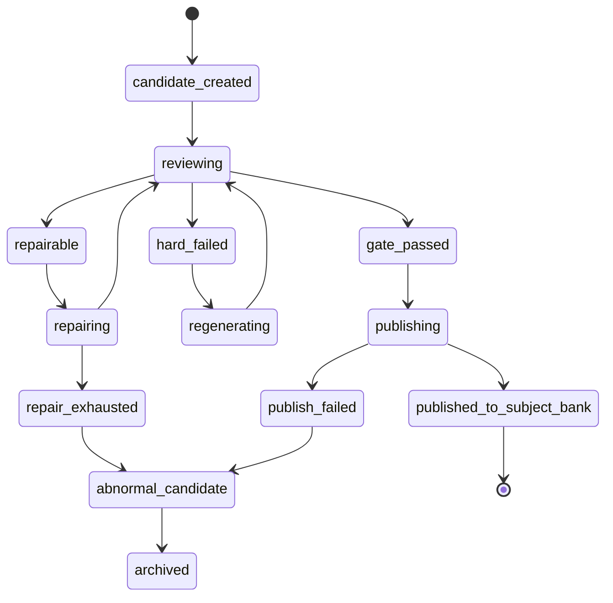
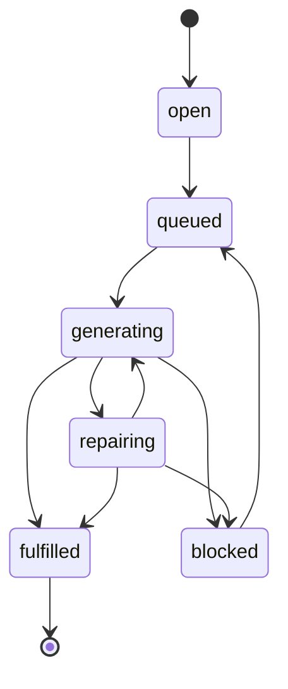

# 科目训练 AI 出题闭环强化执行规格

> 日期：2026-07-08  
> 状态：可落地执行方案  
> 范围：科目训练 AI 出题、专项题库入库、候选治理、原题修复、数学渲染、双语版本、清理重测、与在线模考线隔离  
> 最新执行主方案：`docs/subject-practice-ai-questioning-final-execution-plan-2026-07-08.md`  
> 关联文档：
> - `docs/ai-questioning-dual-line-final-execution-plan-2026-07-07.md`
> - `docs/subject-practice-ai-questioning-executable-spec-2026-07-07.md`
> - `docs/ai-questioning-subject-optimization-and-math-rendering-execution-plan-2026-07-07.md`
> - `docs/mock-exam-blueprint-and-ai-generation-plan-2026-06-30.md`
> - `docs/source-question-profile-upgrade-implementation-spec-2026-07-03.md`

## 1. 这次要解决什么

在线模考线已经逐步收敛成：

```text
真题画像 -> 整卷蓝图 -> 48 个题位 -> 自动生成/修复/复审
-> 每个题位 1 道合格题 -> 48/48 后自动进入在线模考题库
-> 可装配草稿卷
```

科目训练线现在也必须做成同等级闭环，但它的完成标准不是 48 个题位，而是：

```text
按 subject / topic / gap 补齐正式可训练题。
候选题数量不是成功。
门禁通过并进入科目训练正式题库才是成功。
```

本方案补齐以下落地细节：

1. 科目训练和在线模考从 AI 出题开始彻底分线。
2. 科目训练以正式入库题为完成口径。
3. 可修复问题先原题修复，硬伤才重新生成。
4. 需要人工确认、建议重生、复审失败、fallback、数学渲染异常、缺英文版本的题不能自动入库。
5. 合格题自动进入科目训练正式题库，并从候选治理列表消失。
6. 候选治理只显示未入库异常题。
7. 生成循环在正式题达标后自动停止，并归档多余任务。
8. 数学符号在管理后台、科目训练、在线模考三处使用同一渲染入口。
9. 当前 scope 支持单个删除、批量删除和全量重测清理。

## 2. 核心结论

### 2.1 共用准备层

大纲基线和真题画像仍然共用：

```text
大纲基线：决定这个学科能考什么。
真题画像：决定真实考试通常怎么考。
```

它们同时服务：

- 科目训练 AI 出题。
- 在线模考 AI 出题。

### 2.2 出题后必须分叉

从 AI 出题开始，所有任务、候选、统计、清理、正式入库必须按业务线分开。

```text
科目训练线：
  subject / topic / gap
  -> targetUseCase = subject_practice
  -> subject candidate
  -> subject gate
  -> special_practice_questions / 科目训练正式题

在线模考线：
  sourcePaper / blueprint / slot
  -> targetUseCase = online_mock_exam
  -> mock candidate
  -> mock gate
  -> mock candidate pool
  -> draft paper / online mock bank
```

硬规则：

| 项 | 规则 |
| --- | --- |
| 科目候选 | 不能出现在在线模考候选池 |
| 模考候选 | 不能出现在科目训练候选池 |
| 模考卷 | 卷 1 的候选、任务、已审核资产不能显示到卷 2 |
| 科目 topic | topic A 的候选不能算 topic B 的达标进度 |
| legacy 数据 | 默认不参与新闭环统计，只在历史筛选中查看 |

## 3. 成功标准

### 3.1 科目训练 topic 成功

一个 topic 达标只看正式题：

```text
approvedPracticeCount >= targetPracticeCount
```

其中 `approvedPracticeCount` 必须来自正式训练题库映射，不能来自候选表。

### 3.2 科目训练 gap 成功

一个 gap 达标只看当前 gapKey 下正式题：

```text
approvedGapQuestionCount >= targetGapQuestionCount
```

gapKey 必须稳定，不能因为刷新画像或重新生成页面就变化。

### 3.3 候选题成功

一题成功必须全部满足：

```text
csca_questions.status = approved
scope.targetUseCase = subject_practice
scope.intendedUse = subject_practice
scope.subject = 当前学科
scope.topicId = 当前 topic
scope.gapKey = 当前 gap
reviewGate.status = passed
mathTextGate.status = passed
localizations.zh 完整
localizations.en 完整
not fallback
not smoke
not legacy
special_practice_questions 映射存在
special_practice_questions.status in active / published
```

### 3.4 非成功候选

以下候选不得自动进入科目训练正式题库：

- `needs_edit`
- `human_review`
- `review_failed`
- `regenerate`
- `fallback`
- `smoke`
- `missing_bilingual_localization`
- `math_latex_invalid`
- `math_latex_cjk_in_formula`
- `math_render_failed`
- `profile_alignment_failed`
- `past_paper_similarity_high`
- `source_scope_missing`

## 4. 数据口径

### 4.1 AI scope

短期继续使用 `generationMetadata.scope` 作为主口径；稳定后再考虑迁移为物理字段。

```ts
type AIQuestionScope = {
  targetUseCase: 'subject_practice' | 'online_mock_exam' | 'legacy';
  intendedUse: 'subject_practice' | 'mock_candidate' | 'legacy';
  subject: 'math' | 'physics' | 'chemistry';
  syllabusVersion?: string;

  topicId?: number;
  topicCode?: string;
  gapKey?: string;

  mockSourcePaperId?: number;
  mockBlueprintId?: number;
  mockBlueprintSlotId?: number;
  mockSlotNumber?: number;

  generationMode:
    | 'subject_gap_fulfillment'
    | 'subject_candidate_repair'
    | 'subject_candidate_regenerate'
    | 'online_mock_slot_fulfillment'
    | 'online_mock_candidate_repair'
    | 'online_mock_candidate_regenerate'
    | 'manual_import'
    | 'legacy';
};
```

### 4.2 问题画像字段

科目训练 targetProfile 至少要包含：

```ts
type SubjectPracticeTargetProfile = {
  difficultyBand: 'basic' | 'medium' | 'hard';
  questionForm: string;
  cognitiveSkill: string;
  readingLoad: 'low' | 'medium' | 'high';
  calculationLoad: 'none' | 'light' | 'medium' | 'heavy';
  answerDistributionHint?: string;
  commonMisconceptions?: string[];
};
```

`cognitiveSkill = unknown` 只能作为历史兼容显示，不得作为新生成目标。新生成前必须由画像 normalizer 或 fallback inference 补齐。

### 4.3 正式题库映射

AI 题通过门禁后，必须创建或更新科目训练正式映射：

```text
csca_questions.id
-> special_practice_questions.source_question_id
-> special_practice_questions.status = published
-> topic / subject / difficulty / skill metadata 同步
```

如果只把 `csca_questions.status` 改成 `approved`，但没有正式映射，不算入库成功。

## 5. 状态机

### 5.1 单题状态机



### 5.2 gap 任务状态机



`fulfilled` 的唯一判断：

```text
formalBankedCount >= targetCount
```

## 6. 修复优先策略

### 6.1 可原题修复的问题

以下问题先修原题，不立刻重生：

| 问题 | 修复动作 |
| --- | --- |
| 正确答案标错 | 保留题干，重算答案，修正 correctAnswer 和解析 |
| 多个正确答案 | 保留核心题干，调整干扰项，使唯一正确 |
| 选项过近 | 重新设计干扰项，拉开选项差异 |
| 解析不完整 | 补充步骤和关键理由 |
| 英文版本缺失 | 生成英文题干、选项、答案、解析 |
| LaTeX 裸露或双转义 | 规范数学文本和定界符 |
| 数学定界符混入中文 | 把自然语言移出公式，只保留数学表达式 |
| profile warning | 按 targetProfile 微调题目，但不改变 topic |
| 难度轻微偏差 | 调整计算步骤、干扰项或条件复杂度 |

修复后必须重新跑完整 reviewer 和硬门禁。

### 6.2 必须重生的问题

以下问题直接重生，不在原题上修：

| 问题 | 原因 |
| --- | --- |
| topic / knowledge point 错位 | 修原题会变成另一道题 |
| cognitiveSkill 完全不匹配 | 题目行为和目标画像不一致 |
| questionForm 完全不匹配 | 题型不符合目标 |
| 题干泄露答案 | 修改成本接近重写 |
| 与真题或已有题高度相似 | 不能靠轻微改词规避 |
| 逻辑本身不可解 | 修复风险高 |
| 题干缺核心条件 | 无法可靠恢复原意 |
| 安全策略或 usage policy 不允许 | 不可用 |

### 6.3 修复次数

默认建议：

```text
same candidate maxRepairAttempts = 2
same gap maxNoProgressCycles = 3
same gap maxGeneratedCandidates = targetCount * 6
```

达到上限后：

- gap 进入 `blocked`。
- 记录主要失败原因 Top 5。
- 前端显示“需要调整画像/提示词/门禁，不再盲目生成”。

## 7. 生成闭环算法

### 7.1 单 gap 循环

```text
while formalBankedCount < targetCount:
  1. 拉取当前 gap 下 repairable candidates
  2. repairable 优先修复
  3. 修复通过 -> publish to subject bank
  4. 修复失败且硬伤 -> archive / regenerate
  5. 如果 repairable 不足 -> 生成新候选
  6. 新候选通过 -> publish to subject bank
  7. 新候选可修 -> 放入 repair queue
  8. 新候选硬伤 -> archive / regenerate
  9. 每轮重新计算 formalBankedCount
  10. 达标后停止并归档同 scope 多余 queued/running 任务
```

### 7.2 topic 级循环

```text
for each open gap in topic:
  process gap loop
  if gap fulfilled:
    mark gap fulfilled
  if gap blocked:
    keep abnormal candidates for governance
topic ready when all required gaps fulfilled
```

### 7.3 队列并发

有限并发即可，不需要几十个任务同时跑。

建议默认：

```text
maxGlobalRunningJobs = 3
maxRunningJobsPerSubject = 2
maxRunningJobsPerGap = 1
```

并发约束：

- 同一个 gap 只允许一个 active worker，避免重复补同一缺口。
- 不同 subject / 不同 gap 可以并发。
- 达标后同 scope 的 queued job 必须自动归档为 `fulfilled_skipped`。

## 8. 门禁设计

### 8.1 通用硬门禁

所有自动入库题必须通过：

```text
schema valid
answer unique
answer/explanation consistent
topic aligned
targetProfile aligned
review score >= threshold
not fallback
not smoke
math render passed
zh localization complete
en localization complete
source scope complete
```

### 8.2 数学文本门禁

新增或强化以下检查：

| code | 规则 |
| --- | --- |
| `math_latex_unbalanced_delimiters` | `$`、`\(`、`\[` 等定界符必须配对 |
| `math_latex_invalid_fraction` | `\frac` / `\dfrac` 必须有两个参数 |
| `math_latex_invalid_sqrt` | `\sqrt` 必须有参数 |
| `math_latex_unpaired_left_right` | `\left` / `\right` 必须配对 |
| `math_latex_cjk_in_formula` | 数学定界符内不得混入中文自然语言 |
| `math_render_failed` | 前端统一渲染器 dry-run 失败 |
| `math_layout_risk` | block math 不得撑爆选项或解析容器 |

通过门禁前，生成题的题干、选项、答案、解析、英文版本都要检查。

### 8.3 双语门禁

自动入库必须有：

```text
localizations.zh.prompt
localizations.zh.options
localizations.zh.explanation
localizations.en.prompt
localizations.en.options
localizations.en.explanation
```

缺英文时走 repair，不允许直接入库。

## 9. 前端工作区设计

### 9.1 页面结构

AI 题库后台建议保持四个区域：

```text
1. 共用准备层
   - 大纲基线
   - 真题画像

2. 科目训练线
   - topic/gap 健康
   - 科目训练生成任务
   - 科目训练异常候选
   - 科目训练正式入库结果

3. 在线模考线
   - 来源卷
   - 整卷蓝图
   - 48 题位
   - 模考候选
   - 草稿卷装配

4. 运维清理
   - 当前 scope 清理
   - 单题删除
   - 批量删除
   - 任务归档
```

### 9.2 科目训练候选面板

默认只显示异常候选：

- repairable
- repair_exhausted
- human_review
- review_failed
- hard_failed
- publish_failed
- math invalid
- missing bilingual

不显示：

- 已自动入科目训练正式题库的题。
- 已归档题。
- online mock candidate。
- legacy candidate。

### 9.3 科目训练进度文案

文案必须避免“候选数量 = 成功”的误导。

推荐显示：

```text
正式题进度：8/12 已入库
修复队列：3
生成中：1
异常候选：5
剩余缺口：4
```

不推荐显示：

```text
候选 42，道题很多，看起来快完成
```

### 9.4 局部刷新

需要三个局部刷新入口：

| 区域 | 刷新内容 |
| --- | --- |
| topic/gap 健康 | 正式题覆盖、缺口、任务状态 |
| 候选治理 | 异常候选列表，默认新失败在前 |
| 正式入库结果 | 最近入库题、映射状态 |

正在生成时自动轮询：

```text
active job exists -> 3s poll topic health + candidate abnormal list
no active job -> stop polling
```

## 10. 清理与重测

### 10.1 单题删除

管理员可对当前 scope 下题目执行：

```text
delete candidate
delete generated question
delete special_practice mapping if exists
write audit log
refresh topic/gap readiness
```

### 10.2 批量删除

支持按当前 scope 批量删除：

```text
subject
topicId
gapKey
targetUseCase = subject_practice
status in selected statuses
createdAt range
```

默认禁止跨业务线删除。

### 10.3 全量重测清理

当前 subject/topic/gap 重测时：

```text
1. 停止当前 scope running/queued jobs
2. 归档或删除异常候选
3. 可选删除已入库 AI 题及 mapping
4. 保留手工题
5. 保留大纲和真题画像
6. 重新计算 gap
```

## 11. 后端执行清单

### 11.1 Scope 强化

要改：

- 生成任务创建时强制写完整 `scope`。
- repair / regenerate 继承原 candidate scope。
- list / count / cleanup / publish 全部按 scope 过滤。
- 缺 scope 的新生成直接失败，不允许自动入库。

验收：

- 在线模考生成不会触发科目训练统计变化。
- 科目训练生成不会出现在在线模考候选池。
- 切换模考卷不会看到上一卷候选。

### 11.2 Formal bank count

要改：

- topic/gap readiness 使用正式 mapping 计数。
- `approved` 但未 mapping 的 AI 题不算正式题。
- `fallback` / `smoke` / `legacy` 排除。

验收：

- 候选数增加但未入库时，进度不增长。
- 自动入库后，正式题进度增长。

### 11.3 Repair-first worker

要改：

- worker 先取 repairable candidates。
- repair 后重新 reviewer + gate。
- 可修复失败进入 repair_exhausted。
- 硬伤进入 regenerate 或 archive。

验收：

- 选项过近、答案标错、缺英文、LaTeX 不规范优先修复。
- topic 错位、相似度过高、题干泄露答案不走原题修复。

### 11.4 Auto publish

要改：

- gate_passed 后自动创建 `special_practice_questions` 映射。
- 映射成功后 candidate 状态更新为 `published_to_subject_bank`。
- 映射失败进入 `publish_failed`，显示错误原因。

验收：

- 门禁通过题不再需要手动确认才能进科目训练题库。
- 已入库题不再显示在异常候选列表。

### 11.5 Fulfillment stop

要改：

- 每次 repair/generate/publish 后重新计算正式题进度。
- 达标后停止当前 gap 生成。
- 归档同 scope queued jobs。
- stale running job 超时后标记 `fulfilled_skipped` 或 `stale_archived`。

验收：

- 达标后不会继续增加候选。
- 前端不会显示“上面运行中、下面已完成”的冲突状态。

### 11.6 Math and bilingual gates

要改：

- 入库前检查 zh/en 全字段。
- 入库前执行 math text validation。
- 对可修复数学问题进入 repair queue。
- 对不可渲染问题禁止入库。

验收：

- 已入库题不出现裸 `\dfrac`、`\sqrt` 文本。
- 已入库题不缺英文版本。
- 管理后台、科目训练、在线模考展示一致。

## 12. 前端执行清单

### 12.1 Candidate list

要改：

- 默认只显示当前 useCase + 当前 scope 异常候选。
- 新生成或新失败候选按 `updatedAt desc` 排前面。
- 已入库题进入“正式入库结果”，不留在治理队列。

验收：

- 切换卷/学科/topic 不串数据。
- 局部刷新不会跳回流程总览页。

### 12.2 Task status

要改：

- queued/running/completed/fulfilled_skipped/stale_archived 分开显示。
- `fulfilled_skipped` 显示为“已跳过：正式题已达标”。
- running 但无实际 worker 的 stale job 不显示成一直运行。

验收：

- 用户能看懂是在生成、排队、达标跳过还是卡住。

### 12.3 Math rendering

要改：

- 所有题目展示统一使用 `MathContent`。
- 题干、选项、解析、英文版本都走同一组件。
- block math 不放进窄选项容器内撑布局。
- 渲染失败显示原文和错误 badge，不破坏布局。

验收：

- `\frac`、`\dfrac`、`\sqrt`、上下标、区间、集合符号显示正常。
- 数学符号不重叠、不撑爆选项、不覆盖解析文字。

### 12.4 Cleanup UI

要改：

- 单题删除按钮。
- 当前 scope 批量删除按钮。
- 清理全部生成结果按钮。
- 删除前明确显示作用范围。

验收：

- 可以清空当前 topic/gap 的生成结果重新测试。
- 不误删手工题、真题画像、大纲和其他业务线题。

## 13. 迁移和线上处理

### 13.1 开发阶段原则

当前开发阶段优先干净架构，不继续兼容旧混线逻辑。

旧数据处理：

```text
缺 scope -> 标记 legacy
fallback/smoke -> 不参与正式统计
approved 但未 mapping -> 不算正式科目题
online mock candidate -> 必须有 mockBlueprintId / mockSlotId
subject practice candidate -> 必须有 topicId / gapKey
```

### 13.2 部署前一次性脚本

上线前执行脚本：

1. 给旧 AI 题补 `scope.targetUseCase = legacy`。
2. 给已有明确科目训练映射的 AI 题补 `subject_practice` scope。
3. 给已有 mock blueprint/slot metadata 的 AI 题补 `online_mock_exam` scope。
4. 归档没有 scope 且不确定用途的旧候选。
5. 重算 subject/topic/gap readiness。
6. 重算 online mock blueprint readiness。

### 13.3 回滚边界

可回滚：

- 前端新工作区展示。
- worker repair-first 策略。
- 自动归档 queued job。

不可轻易回滚：

- 已删除的候选。
- 已删除的 special practice mapping。

因此删除操作必须写 audit log，并默认支持 dry-run。

## 14. 测试计划

### 14.1 后端单测

必须覆盖：

- scope filtering。
- formal bank count。
- repairable vs hard_failed 分类。
- gate_passed auto publish。
- fulfilled stop。
- cleanup current scope。
- math text validation。
- bilingual required gate。

### 14.2 前端单测

必须覆盖：

- 候选列表按 useCase/scope 隔离。
- 已入库题不显示在异常候选。
- task status 文案。
- cleanup scope 文案。
- MathContent 渲染题干、选项、解析。

### 14.3 集成测试

场景 1：数学 topic 从 0 补齐

```text
given topic target = 5
when generate subject practice
then 5 道题进入 special_practice_questions
and candidate abnormal list excludes these 5
and openGapCount = 0
and queued jobs archived
```

场景 2：可修复题

```text
given candidate has wrong correctAnswer
when worker runs
then repair candidate
and rerun review
and publish if gate passed
```

场景 3：硬伤题

```text
given candidate topic mismatch
when worker runs
then do not repair in place
and regenerate / archive
```

场景 4：数学渲染失败

```text
given candidate contains CJK inside math delimiters
when gate runs
then block publish
and put into repair queue
```

场景 5：业务线隔离

```text
given online mock generation is running
then subject practice queue does not show it
and subject formal count does not change
```

## 15. 推荐执行顺序

### Phase 0：口径锁定

1. 确认 scope 字段和正式题口径。
2. 确认 `unknown cognitiveSkill` 的 fallback inference。
3. 确认数学和双语为硬门禁。

完成后再改 worker，避免后面重复返工。

### Phase 1：数据隔离和正式计数

1. 所有查询补 scope。
2. topic/gap readiness 改为正式 mapping 计数。
3. legacy 默认排除。
4. 候选列表默认只显示异常候选。

验收目标：页面统计可信。

### Phase 2：repair-first 闭环

1. 实现可修复/硬失败分类。
2. worker 先修复再重生。
3. 修复后重跑 reviewer 和 gate。
4. 达标后停止生成。

验收目标：候选不再无限增长，合格题能稳定入库。

### Phase 3：自动入库和清理

1. gate_passed 自动发布到 special practice。
2. 单题删除。
3. 当前 scope 批量删除。
4. 全量重测清理。

验收目标：可以反复清理重测，不污染其他线。

### Phase 4：数学渲染和双语收口

1. 后端数学门禁。
2. 前端统一 MathContent。
3. 所有题目展示面替换。
4. 双语版本缺失进入 repair。

验收目标：正式题不会出现数学符号错乱或缺英文。

### Phase 5：线上迁移

1. dry-run migration。
2. 输出 legacy / subject / mock 分类统计。
3. 执行 migration。
4. 重算 readiness。
5. 管理后台抽样验证。

## 16. 最终验收清单

上线前必须全部通过：

- [ ] 科目训练和在线模考候选不串线。
- [ ] 不同模考卷候选不串卷。
- [ ] 科目训练正式题进度只看正式 mapping。
- [ ] 候选数量不影响完成判断。
- [ ] 可修复问题优先原题修复。
- [ ] 硬伤题不会反复无效修复。
- [ ] 门禁通过题自动进入科目训练题库。
- [ ] 已入库题不再显示在异常候选列表。
- [ ] 达标后停止生成并归档多余任务。
- [ ] 缺英文题不能自动入库。
- [ ] 数学渲染失败题不能自动入库。
- [ ] 管理后台、科目训练、在线模考数学显示一致。
- [ ] 支持单题删除、当前 scope 批量删除、清理全部生成结果。
- [ ] 线上旧数据 migration 有 dry-run 和 audit log。

## 17. 不做事项

本轮不做：

- PDF OCR。
- 降低门禁换通过率。
- 把候选题当正式题。
- 把科目训练题和在线模考题混成一套。
- 让手工题库下线。
- 让旧 legacy 题继续污染新闭环统计。

## 18. 给开发的最短实现提示

如果只抓最关键的几件事，顺序是：

```text
1. scope 隔离
2. formal mapping count
3. repair-first
4. gate_passed auto publish
5. fulfilled stop
6. abnormal-only candidate list
7. cleanup current scope
8. math + bilingual hard gate
```

这 8 件事完成后，科目训练 AI 出题才算真正进入和在线模考同等级的闭环。
