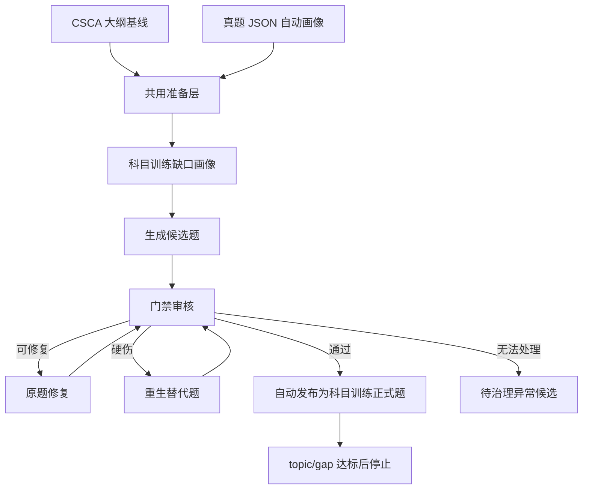
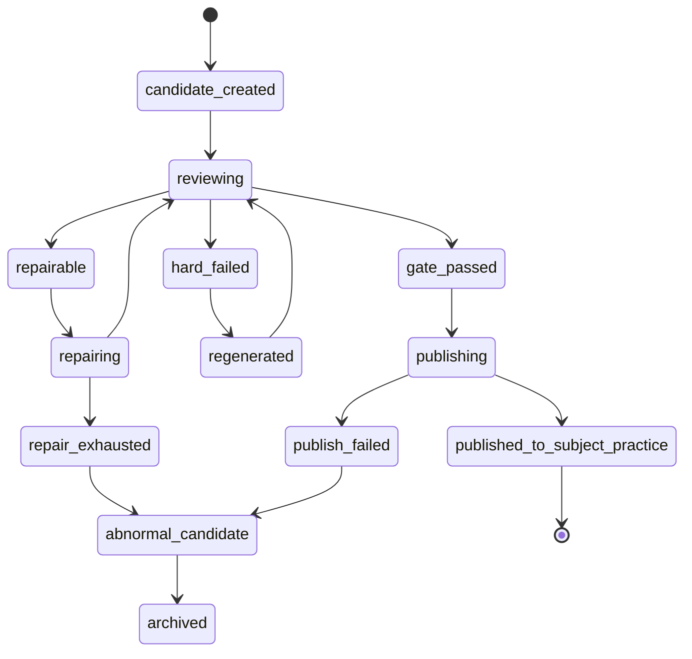
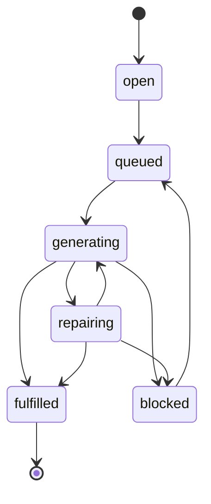

# 科目训练 AI 出题优化落地执行规格

> 日期：2026-07-07  
> 状态：执行规格，后续开发以本文作为科目训练线主文档  
> 范围：科目训练 AI 出题、专项题库入库、候选治理、原题修复、数学渲染、双语、清理重测、与在线模考线的边界  
> 关联文档：
> - `docs/ai-questioning-executable-implementation-spec-2026-07-07.md`
> - `docs/ai-questioning-subject-optimization-and-math-rendering-execution-plan-2026-07-07.md`
> - `docs/mock-exam-blueprint-and-ai-generation-plan-2026-06-30.md`
> - `docs/source-question-profile-upgrade-implementation-spec-2026-07-03.md`
> - `docs/subject-training-profile-adaptation-implementation-spec-2026-07-03.md`

## 1. 最终目标

在线模考线已经基本形成“按 48 个题位补齐合格题”的闭环。科目训练线也必须升级到同等级闭环，但它的完成口径不是 48 个题位，而是：

```text
按 subject / topic / gap 补齐正式可训练题。
候选题数量不是成功；门禁通过并进入科目训练正式题库才是成功。
```

最终流程：



本方案不做：

- 不做 PDF OCR。
- 不要求用户上传带画像维度的 JSON。
- 不降低门禁换通过率。
- 不把科目训练题和在线模考题混成一套题库。
- 不让 fallback / smoke / human_review / needs_edit / review_failed 题自动入库。

## 2. 业务线边界

### 2.1 共用源

大纲和真题画像是共用准备层：

```text
大纲回答：这个学科能考什么。
真题画像回答：真实考试通常怎么考。
```

它们同时服务于：

- 科目训练 AI 出题。
- 在线模考 AI 出题。

### 2.2 分叉点

从 AI 出题开始必须分线：

```text
科目训练线：
  subject/topic/gap -> subject_practice candidate -> subject gate -> special_practice_questions

在线模考线：
  sourcePaper/blueprint/slot -> online_mock_exam candidate -> mock gate -> mock candidate pool -> draft paper
```

硬规则：

| 规则 | 要求 |
| --- | --- |
| useCase 隔离 | 每个候选、任务、正式资产都必须有 `targetUseCase` |
| mock 卷隔离 | 卷 1 数据不能显示到卷 2 |
| topic 隔离 | topic A 的候选不能算 topic B 进度 |
| 正式题口径 | 候选不算成功，正式入库才算成功 |
| 候选治理口径 | 只展示未入库异常候选，不展示已经自动入库的合格题 |

## 3. 核心数据定义

### 3.1 AI scope

短期继续写入 `csca_questions.generation_metadata.scope`，稳定后再迁移成物理字段。

```ts
type AIQuestionScope = {
  targetUseCase: 'subject_practice' | 'online_mock_exam' | 'legacy';
  intendedUse: 'subject_practice' | 'mock_candidate' | 'legacy';
  subject: 'math' | 'physics' | 'chemistry';
  syllabusVersion?: string;

  topicId?: number;
  topicCode?: string;
  gapKey?: string;

  mockSourcePaperId?: number;
  mockBlueprintId?: number;
  mockBlueprintSlotId?: number;
  mockSlotNumber?: number;

  generationMode:
    | 'subject_gap_fulfillment'
    | 'subject_candidate_repair'
    | 'subject_candidate_regenerate'
    | 'online_mock_slot_fulfillment'
    | 'online_mock_candidate_repair'
    | 'online_mock_candidate_regenerate'
    | 'manual_import'
    | 'legacy';
};
```

### 3.2 科目训练正式题

一题算作科目训练正式可用题，必须同时满足：

```text
csca_questions.status = approved
scope.targetUseCase = subject_practice
scope.intendedUse = subject_practice
special_practice_questions 映射存在
mapping.status in active / published
localizations.zh 完整
localizations.en 完整
mathTextGate.status = passed
reviewGate.status = passed
not fallback
not smoke
not legacy
not online_mock_exam
```

### 3.3 科目训练缺口

```ts
type SubjectPracticeGap = {
  gapKey: string;
  subject: 'math' | 'physics' | 'chemistry';
  topicId: number;
  topicCode?: string;
  syllabusVersion: string;
  targetProfile: {
    difficultyBand: 'basic' | 'medium' | 'hard';
    questionForm: string;
    cognitiveSkill: string;
    readingLoad: 'low' | 'medium' | 'high';
    calculationLoad: 'none' | 'light' | 'medium' | 'heavy';
  };
  targetApprovedCount: number;
  approvedPracticeCount: number;
  queuedCount: number;
  runningCount: number;
  repairableCandidateCount: number;
  blockedCandidateCount: number;
  generatedCandidateCount: number;
  noProgressCycles: number;
  status:
    | 'open'
    | 'queued'
    | 'generating'
    | 'repairing'
    | 'fulfilled'
    | 'blocked';
};
```

`fulfilled` 的唯一判断：

```text
approvedPracticeCount >= targetApprovedCount
```

## 4. 状态机

### 4.1 候选题状态



### 4.2 topic/gap 任务状态



`blocked` 只用于“系统无法继续有效推进”，不是普通失败：

- 连续 N 轮没有新增正式题。
- 同一 gap 的 repairable 候选全部 repair exhausted。
- provider 连续失败达到阈值。
- 缺大纲、缺画像、缺 topic mapping 等前置条件。

## 5. 门禁策略

### 5.1 入库硬门禁

以下任一问题存在，禁止自动进入科目训练正式题库：

| 问题 | 处理 |
| --- | --- |
| 缺英文版本 | repair |
| 缺中文版本 | repair |
| LaTeX 不能渲染 | repair |
| 数学公式把中文包进 `$...$` / `\(...\)` | repair |
| 正确答案和解析不一致 | repair |
| 多个正确答案 | repair |
| 选项重复或等价 | repair |
| 选项过近导致歧义 | repair |
| 解析缺少关键步骤 | repair |
| 难度轻微偏差 | repair |
| cognitiveSkill 低置信 | repair |
| topic / syllabus mismatch | hard regenerate |
| 真题相似度过高 | hard regenerate |
| 题干泄露答案 | hard regenerate |
| prompt/template 泄露 | hard regenerate |
| 题目不可用或无法解析 | hard regenerate |
| fallback/smoke/trivial 题 | hard regenerate |
| repair 超过次数 | abnormal_candidate |

### 5.2 可修复问题必须原题修复

以下问题优先保留原题语义，只修局部：

- 答案错误。
- 多个正确答案。
- 选项过近或重复。
- 解析不完整。
- 英文缺失。
- LaTeX/数学文本格式错误。
- 阅读量、计算量轻微偏差。
- reviewer 给出 `human_review` 但只有软警告。

修复提示词必须携带：

```text
原题
原选项
原答案
原解析
失败原因
目标 topic/gap profile
必须保留的约束
必须修掉的问题
禁止改变的 scope
```

### 5.3 硬伤才重生

以下问题不做原题修复，直接新生成替代：

- 题目知识点不匹配。
- 题目超出大纲。
- 与真题或已有题高度相似。
- 题干泄露答案。
- prompt/template 泄露。
- 题目结构不可解析。
- 经过 repair 后仍无进展。

## 6. 自动补齐循环

### 6.1 主循环

伪代码：

```ts
async function fulfillSubjectPracticeGap(gap: SubjectPracticeGap) {
  while (gap.approvedPracticeCount < gap.targetApprovedCount) {
    const repairable = await findRepairableCandidate(gap);

    if (repairable) {
      await repairCandidate(repairable);
    } else {
      await generateCandidateForGap(gap);
    }

    const candidate = await reviewLatestCandidate(gap);

    if (candidate.gate === 'passed') {
      await publishToSubjectPracticeBank(candidate);
      await removeFromPendingCandidateQueue(candidate);
    }

    if (candidate.gate === 'repairable') {
      await enqueueRepair(candidate);
    }

    if (candidate.gate === 'hard_failed') {
      await archiveAsFailedCandidate(candidate);
      await enqueueRegenerate(gap);
    }

    gap = await refreshGap(gap.gapKey);

    if (gap.noProgressCycles >= MAX_NO_PROGRESS_CYCLES) {
      await markGapBlocked(gap);
      break;
    }
  }

  if (gap.approvedPracticeCount >= gap.targetApprovedCount) {
    await markGapFulfilled(gap);
  }
}
```

### 6.2 停止条件

必须停止继续生成：

```text
approvedPracticeCount >= targetApprovedCount
```

必须继续生成或修复：

```text
approvedPracticeCount < targetApprovedCount
并且未 blocked
```

必须进入 blocked：

```text
连续 noProgressCycles 达阈值
或 provider/scope/profile 前置条件不可满足
```

### 6.3 并发

建议短期并发：

```text
subject_practice generation concurrency = 2
subject_practice repair concurrency = 2
online_mock_exam generation concurrency = 2
```

同一 `gapKey` 内默认串行，避免重复补同一个缺口；不同 topic/gap 可以有限并发。

## 7. 后端落地工单

### 7.1 数据和迁移

文件范围：

- `backend/prisma/schema.prisma`
- `backend/prisma/migrations/*`
- `scripts/backfill-csca-source-question-profiles.cjs`
- 新增 `scripts/backfill-ai-question-scope.cjs`

任务：

1. 为 AI 题补全 `generationMetadata.scope`。
2. 对旧数据标记 `legacy`，不参与新闭环统计。
3. 为科目训练正式映射补 source AI question id。
4. 为在线模考候选补 mock blueprint / slot scope。
5. 增加索引或查询条件，至少覆盖：
   - `targetUseCase`
   - `subject`
   - `topicId`
   - `mockBlueprintId`
   - `mockBlueprintSlotId`

验收：

```text
旧 legacy 数据不会出现在新科目训练进度。
卷 1/卷 2 数据不会互相显示。
科目训练和在线模考候选不会互相统计。
```

### 7.2 缺口画像服务

文件范围：

- `backend/src/ai-questioning/ai-questioning.service.ts`
- `backend/src/ai-questioning/source-question-profile-normalizer.ts`
- `backend/src/ai-questioning/question-topic-mapper-provider.service.ts`

任务：

1. 从大纲生成 topic baseline。
2. 从真题画像生成 topic/gap targetProfile。
3. 对缺失字段分级：
   - `missing_syllabus`
   - `missing_profile`
   - `incomplete_profile`
   - `low_confidence_profile`
4. `cognitiveSkill = unknown` 不得直接作为高置信 profile。
5. profile 缺失时，允许进入 `syllabus_only` 低置信补题模式，但前端必须明确显示。

验收：

```text
有大纲但无画像时，错误不能写成“没有大纲”。
数学有画像时，不得误报“没有可用真题画像”。
unknown cognitiveSkill 不再导致无限生成无效候选。
```

### 7.3 生成/修复/重生服务

文件范围：

- `backend/src/ai-questioning/question-generator.service.ts`
- `backend/src/ai-questioning/question-generator-provider.service.ts`
- `backend/src/ai-questioning/question-reviewer.service.ts`
- `backend/src/ai-questioning/question-reviewer-provider.service.ts`
- `backend/src/ai-questioning/question-prompt-builder.service.ts`

任务：

1. 生成时强制写入 `scope.targetUseCase = subject_practice`。
2. 修复时继承原 candidate scope。
3. 重生时继承 gap scope，但生成新 candidate id。
4. repair prompt 明确要求：
   - 不改业务线。
   - 不改 topic/gap。
   - 修正指定问题。
   - 保证中英文完整。
   - 只把数学表达式放进 math delimiter，中文解释不得包进公式。
5. reviewer 输出必须结构化：
   - `gateStatus`
   - `repairability`
   - `issueCodes`
   - `publishBlockers`

验收：

```text
答案错、选项重复、英文缺失、LaTeX 错误会先 repair。
topic mismatch、相似度过高、prompt 泄露会 hard regenerate。
连续 repair 无进展后进入 blocked，不无限堆候选。
```

### 7.4 自动发布到科目训练题库

文件范围：

- `backend/src/ai-questioning/ai-questioning.service.ts`
- `backend/src/csca-special-practice/csca-special-practice.service.ts`
- `backend/src/csca-special-practice/adaptive-question-provider.service.ts`
- `backend/src/csca-special-practice/csca-adaptive.service.ts`

任务：

1. `gate_passed` 后自动创建/更新 `special_practice_questions`。
2. 写入 AI source id，方便追溯。
3. 科目训练抽题只使用已桥接正式题，不能直接抽未桥接 AI candidate。
4. 已发布题从候选治理中移除。
5. `approvedPracticeCount` 从正式映射统计，不从 candidate 统计。

验收：

```text
后台显示已入库 N 道，用户侧科目训练可以抽到这些题。
未桥接 AI 题不会进入学生练习。
已入库题不会继续显示为待治理候选。
```

### 7.5 清理和重测

文件范围：

- `backend/src/ai-questioning/ai-questioning.controller.ts`
- `backend/src/ai-questioning/ai-questioning.service.ts`
- `frontend/src/pages/AdminAIQuestionBankPage.tsx`

接口建议：

```http
DELETE /admin/ai-questioning/subject-practice/generated-results
```

请求：

```ts
type CleanupSubjectPracticeGeneratedResultsRequest = {
  subject: 'math' | 'physics' | 'chemistry';
  topicId?: number;
  includePublishedPracticeQuestions: boolean;
  includeApprovedAiQuestions: boolean;
  includeCandidates: boolean;
  includeGenerationJobs: boolean;
  confirmText: string;
};
```

规则：

| 清理模式 | 行为 |
| --- | --- |
| 清理异常候选 | 删除/归档未入库候选和任务，不动正式题 |
| 清理当前 topic 全部 AI 结果 | 删除候选、任务、已入库 AI 题、正式训练映射 |
| 清理当前 subject 全部 AI 结果 | 需要确认文本，删除范围必须只限 subject_practice |

验收：

```text
可以单题删除。
可以批量删除当前 topic。
可以批量删除当前 subject。
不会误删手工专项题。
不会误删在线模考题。
```

## 8. 前端落地工单

### 8.1 页面结构

文件范围：

- `frontend/src/pages/AdminAIQuestionBankPage.tsx`
- `frontend/src/components/admin/ai-question-bank/*`

页面分区：

```text
1 共用准备
  - 大纲基线
  - 真题画像

2 科目训练线
  - topic/gap 缺口
  - 自动补齐任务
  - 已入库训练题
  - 待治理异常候选

3 在线模考线
  - 来源卷
  - 整卷蓝图
  - 题位
  - 48/48 进度
  - 草稿卷装配
```

### 8.2 科目训练线显示

必须显示：

```text
目标正式题数
已入库正式题数
还差几道
repairable 候选数
blocked 候选数
最近失败原因
当前任务状态
是否缺大纲
是否缺画像
是否 low confidence
```

禁止显示成：

```text
候选题 42 道 = 生成成功
```

### 8.3 候选治理

候选治理只显示：

```text
未入库异常候选
需要人工看原因的候选
repair exhausted 候选
被拒绝/归档候选
```

不显示：

```text
已通过门禁且已自动入库题
已装配到在线模考草稿卷的题
其他 subject/topic/mock blueprint 的题
```

### 8.4 局部刷新

每个板块必须有自己的刷新：

```text
刷新 topic/gap 健康度
刷新生成任务
刷新候选治理
刷新已入库资产
刷新在线模考题位
```

整页刷新不能作为主要操作，因为会跳回流程总览或丢失当前 tab/scope。

### 8.5 数学渲染

统一使用 `MathContent`：

```text
后台候选列表
后台已审核资产
科目训练用户侧
在线模考用户侧
题干
选项
解析
英文版本
```

渲染要求：

- 不裸露 `\frac`、`\sqrt`、`\leq` 等 LaTeX。
- 不把整句中文包成公式。
- 行内公式不裁切上下标、根号、分数。
- 块级公式不撑破卡片。
- 选项区域不能被 KaTeX DOM 拉乱布局。

## 9. Prompt 和 provider 要求

### 9.1 生成 prompt

必须包含：

```text
targetUseCase = subject_practice
subject
topicId/topicCode
gapKey
targetProfile
syllabusVersion
excludedScope
pastPaperProfile summary
language requirement: zh + en
math formatting requirement
do-not-copy source question requirement
```

### 9.2 修复 prompt

必须包含：

```text
repair original candidate in place
preserve topic/gap/useCase
fix only listed issues unless required by correctness
return complete structured JSON
include zh/en localizations
normalize LaTeX
do not wrap Chinese natural-language explanations in math delimiters
```

### 9.3 reviewer prompt

必须输出：

```ts
type ReviewDecision = {
  score: number;
  gateStatus: 'passed' | 'repairable' | 'hard_failed' | 'blocked';
  issueCodes: string[];
  publishBlockers: string[];
  repairInstructions?: string[];
  hardFailureReason?: string;
};
```

## 10. 测试与验收

### 10.1 规则测试

更新 `scripts/csca-ai-questioning-rules-test.cjs`，至少断言：

```text
1. subject_practice 查询排除 online_mock_exam。
2. online_mock_exam 查询排除 subject_practice。
3. 科目训练候选必须带 subject/topic/gap scope。
4. 已入库科目训练题不在待治理候选中。
5. candidateCount 不参与 ready 判断。
6. approvedPracticeCount 才参与 ready 判断。
7. 缺英文不能发布。
8. LaTeX 错误不能发布。
9. 中文自然语言被包进数学 delimiter 不能发布。
10. repairable issue 进入 repair_in_place。
11. hard issue 进入 regenerate。
12. cleanup 必须带 targetUseCase 和 subject/topic scope。
13. 学生侧抽题排除未桥接 AI candidate。
```

### 10.2 后端类型检查

```bash
npm.cmd --prefix backend exec -- tsc -p backend/tsconfig.json --noEmit --incremental false --pretty false
```

### 10.3 前端类型检查

```bash
npm.cmd --prefix frontend exec -- tsc -p frontend/tsconfig.json --noEmit --incremental false --pretty false
```

### 10.4 前端构建

```bash
npm --prefix frontend run build
```

### 10.5 手工验收切片

第一轮只验一个最小切片：

```text
subject = math
topic = 任选 1 个有画像 topic
targetApprovedCount = 3
```

步骤：

1. 清理当前 topic 的 AI 生成结果。
2. 确认大纲存在。
3. 确认真题画像存在。
4. 点击补齐科目训练题。
5. 观察系统优先修复可修候选。
6. 观察硬伤候选被归档/重生。
7. 达到 3 道正式入库后自动停止。
8. 候选治理只剩异常未入库题。
9. 已入库资产显示 3 道题。
10. 学生侧科目训练能抽到这 3 道题。
11. 数学符号在后台和学生侧正常。

通过后扩展：

```text
math 单 topic -> math 全 topic -> physics 单 topic -> chemistry 单 topic -> 全科目
```

## 11. 上线与数据处理

当前是开发阶段，但已有线上部署。推荐走干净架构，同时保留回滚：

1. 备份线上数据库。
2. 暂停 AI worker。
3. 部署 schema 和代码。
4. 执行 scope backfill，把旧 AI 数据标记为 `legacy`。
5. 开启 feature flag：
   - `SUBJECT_PRACTICE_AI_AUTO_FULFILLMENT=false`
   - `SUBJECT_PRACTICE_AI_AUTO_PUBLISH=false`
6. 后台只开放管理员手动触发单 topic。
7. 验收 math 单 topic。
8. 打开自动发布。
9. 扩展到 math 全 topic。
10. 再扩展 physics / chemistry。

回滚策略：

1. 关闭自动补齐 feature flag。
2. 保留手工专项题库。
3. 新生成异常候选批量归档。
4. 不删除手工题。
5. 不删除已发布旧正式题。

## 12. 执行顺序

推荐严格按下列顺序：

| 阶段 | 内容 | 完成标志 |
| --- | --- | --- |
| P0 | 冻结 scope 定义和完成口径 | 本文档确认 |
| P1 | 数据 scope/backfill/legacy 隔离 | 旧数据不污染新统计 |
| P2 | 科目训练 topic/gap readiness | 前端能看到目标/已入库/还差 |
| P3 | repair-first 策略 | 可修问题原题修复 |
| P4 | 自动发布正式题 | gate passed 自动进入专项题库 |
| P5 | 候选治理改造 | 只显示异常未入库候选 |
| P6 | 清理重测 | 单题/topic/subject 清理可用 |
| P7 | 数学渲染全链路 | 后台和用户侧不裸露不重叠 |
| P8 | 小切片验收 | math 单 topic 3/3 入库 |
| P9 | 全科扩展 | math/physics/chemistry 全部可用 |

## 13. 完成定义

本方案完成时必须同时满足：

1. 科目训练和在线模考从 AI 出题开始完全分线。
2. 科目训练按正式入库题达标，不按候选题达标。
3. 可修复问题会原题修复，硬伤才重生。
4. 连续无进展会 blocked，不无限新增候选。
5. 门禁通过题自动进入科目训练正式题库。
6. 已入库题不再出现在待治理候选。
7. 缺英文、数学错误、fallback、human_review、needs_edit 不能自动入库。
8. 学生侧不能抽到未桥接 AI candidate。
9. 清理功能可以安全删除当前 scope 的生成结果。
10. 数学题在后台、科目训练、在线模考都能正确渲染。
11. 新真题画像更新后，本机制仍按新的 targetProfile 生效，不绑定当前这一次数学画像。

