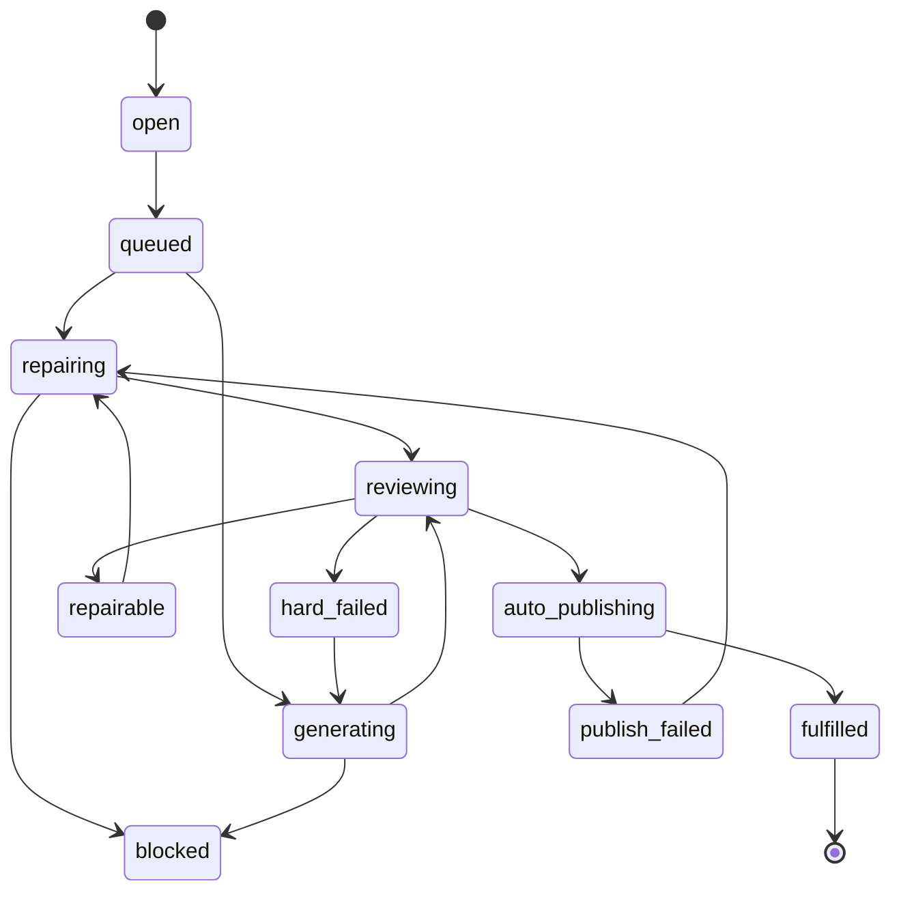

# 科目训练 AI 出题优化最终落地执行方案

> 日期：2026-07-08  
> 状态：最终执行主方案  
> 范围：科目训练 AI 出题、正式专项题库入库、异常候选治理、原题修复、双语与数学硬门禁、数据清理重测、与在线模考线隔离  
> 主结论：在线模考线已经接近可用闭环，下一阶段重点是把科目训练线升级到同等级工程闭环。  
> 关联文档：
> - `docs/subject-practice-ai-questioning-implementation-workplan-2026-07-08.md`
> - `docs/ai-questioning-dual-line-final-execution-plan-2026-07-07.md`
> - `docs/subject-practice-ai-question-hardening-execution-spec-2026-07-08.md`
> - `docs/subject-practice-ai-question-quality-hardening-plan-2026-07-07.md`
> - `docs/source-question-profile-upgrade-implementation-spec-2026-07-03.md`
> - `docs/mock-exam-blueprint-and-ai-generation-plan-2026-06-30.md`

## 1. 一句话目标

把科目训练 AI 出题从“不断生成候选题”改成“按 topic/gap 自动补齐正式可训练题”。

最终闭环必须是：

```text
大纲基线 + 真题画像
-> 计算科目训练缺口
-> 优先修复已有可修候选
-> 无可修候选时生成新题
-> 审题、数学、双语、画像一致性门禁
-> 门禁通过后自动进入科目训练正式题库
-> topic/gap 达标后停止
-> 未通过题进入异常候选治理台
```

成功不看候选题数量，只看正式入库题数量。

## 2. 产品与数据边界

### 2.1 共用准备层

科目训练和在线模考共用两类上游资产：

| 资产 | 用途 | 是否共用 |
| --- | --- | --- |
| 大纲基线 | 决定可考范围、topic、知识点层级 | 共用 |
| 真题画像 | 决定真实考试题型、难度、阅读量、计算量、常见考法 | 共用 |

### 2.2 AI 出题后必须分叉

从 AI 出题开始，科目训练和在线模考必须分线治理：

```text
科目训练线：
  targetUseCase = subject_practice
  scope = subject + topicId + gapKey
  正式资产 = special_practice_questions

在线模考线：
  targetUseCase = online_mock_exam
  scope = mockSourcePaperId + mockBlueprintId + mockBlueprintSlotId
  正式资产 = mock candidate pool / draft paper / mock_exam_questions
```

硬规则：

1. 科目训练题不能进入在线模考候选池。
2. 在线模考候选不能进入专项/科目训练题库。
3. 在线模考卷 1、卷 2、卷 3 的候选、任务、已审核资产必须互相隔离。
4. 科目 topic A 的题不能算 topic B 的达标进度。
5. legacy、smoke、fallback 数据默认不参与新闭环统计。

## 3. 当前问题诊断

### 3.1 候选一直增加，但合格题不增加

现象：

- 页面上候选题越来越多。
- 很多题处于“需要人工确认”“建议重生”“复审失败”。
- 正式科目训练题数量没有同步增长。

根因：

- 系统还容易把 candidate created 当作 progress。
- 可修复题没有优先原题修复。
- 新题生成质量不稳定时，继续生成只会放大异常候选。

### 3.2 科目训练和在线模考状态容易混

现象：

- 生成在线模考题时，科目训练队列也可能显示运行。
- 切换 mock 卷后，候选列表可能仍显示上一卷题。
- 前端统计、候选列表、正式资产列表口径不一致。

根因：

- 查询没有全量使用 `targetUseCase`、`mockBlueprintId`、`topicId`、`gapKey`。
- 前端工作区状态没有完全按当前 scope 刷新。

### 3.3 数学和双语还没有成为稳定硬门禁

现象：

- 后台能看到裸 `\frac`、`\sqrt`、`\dfrac`。
- 部分 KaTeX 渲染后出现重叠、撑高、选项布局错乱。
- 有些已通过门禁或已入库题缺英文版本。

结论：

数学可渲染和双语完整必须是入库硬条件，不能只靠前端兜底。

### 3.4 `cognitiveSkill = unknown` 污染目标画像

现象：

- 生成任务里目标画像出现 `unknown`。
- Reviewer 依据 `unknown` 判断会产生大量 profile alignment warning。

根因：

- 旧真题画像字段不完整，或从原始 JSON 到画像 normalizer 的映射曾经缺字段。
- 生成前没有做 targetProfile fallback inference。

结论：

`unknown` 只能作为历史显示，不允许作为新生成目标。新任务启动前必须补齐或阻塞。

## 4. 成功标准

### 4.1 科目训练 topic/gap 完成

topic/gap 完成只能看正式题库映射：

```text
approvedPracticeCount(scope) >= targetPracticeCount(scope)
```

其中 `approvedPracticeCount` 必须满足：

```text
csca_questions.status = approved
generationMetadata.scope.targetUseCase = subject_practice
generationMetadata.scope.subject = currentSubject
generationMetadata.scope.topicId = currentTopicId
generationMetadata.scope.gapKey = currentGapKey
special_practice_questions.source_question_id = csca_questions.id
special_practice_questions.status in active / published
```

候选数量、已生成数量、已复审数量都不能让 gap fulfilled。

### 4.2 单题自动入库标准

一题自动进入科目训练正式题库必须全部满足：

```text
source_type = ai
status = approved
targetUseCase = subject_practice
intendedUse = subject_practice
subject/topic/gap scope 完整
review score >= 发布阈值
gateDecision = passed
mathTextGate = passed
localizations.zh 完整
localizations.en 完整
not fallback
not smoke
not legacy
not online_mock_exam
not human_review
not needs_edit
not regenerate
not review_failed
not profile_alignment_failed
not past_paper_similarity_high
special_practice_questions 映射创建成功
```

### 4.3 在线模考一套卷完成

在线模考仍按整卷题位判断：

```text
readySlotCount = 48
approvedMockCandidateCount = 48
assembledDraftPaperQuestionCount = 48
```

如果只有 47 道合格题，整套卷仍未完成。

## 5. 状态模型

### 5.1 科目训练 gap 状态



`fulfilled` 只能由正式入库数量触发。

### 5.2 候选题状态

| 状态 | 含义 | 后续动作 |
| --- | --- | --- |
| `pending_review` | 已生成，等待复审 | 跑 reviewer |
| `gate_passed` | 通过所有门禁 | 自动入库 |
| `repairable` | 可原题修复 | 进入 repair |
| `hard_failed` | 硬伤 | 重生替换或阻塞 |
| `publish_failed` | 门禁过了但映射失败 | 修复映射/重试入库 |
| `banked` | 已入正式题库 | 不出现在异常候选 |
| `archived` | 不再处理 | 历史筛选可查 |

## 6. Repair-first 策略

### 6.1 必须原题修复的问题

以下问题保留原题核心意图，局部修复后重新跑门禁：

| 问题 | 修复方式 |
| --- | --- |
| 正确答案标错 | 重算答案，修正 `correctAnswer` 和解析 |
| 多个正确答案 | 调整干扰项，保证唯一正确答案 |
| 选项过近或等价 | 重写干扰项，保持难度和考点 |
| 解析缺步骤 | 补完整推导和关键判断 |
| 解析与答案不一致 | 以正确推导为准重写解析 |
| 缺英文版本 | 生成 `localizations.en` 并校验数学一致 |
| LaTeX 不规范 | 规范定界符、转义和命令 |
| 题干表达不清 | 保持考点，重写题干条件 |

### 6.2 必须重生或阻塞的问题

以下问题不应原题修复：

| 问题 | 处理 |
| --- | --- |
| topic 不匹配 | 归档原候选，按正确 topic 重生 |
| cognitiveSkill 完全不匹配 | 归档或重生 |
| 难度显著偏离且无法局部调整 | 重生 |
| 与真题或已入库题高度相似 | 重生 |
| 题干泄露答案 | 重生 |
| 条件不足或不可解 | 重生 |
| 当前 topic 缺大纲 | 阻塞，提示先补大纲 |
| 当前任务要求画像但没有画像 | 阻塞，提示先导入并应用真题画像 |
| provider schema invalid 且没有可用 draft | 重试 provider；超过阈值 blocked |

### 6.3 循环停止条件

一个 gap 的自动循环每轮按下面顺序：

```text
1. 重新计算正式入库数。
2. 如果已达标，停止并归档多余 queued job。
3. 查找同 scope 最早的 repairable 候选。
4. 有 repairable，则原题修复。
5. 修复后重跑 reviewer、math gate、bilingual gate、profile gate。
6. 通过则自动入库。
7. 没有 repairable，再生成新题。
8. 连续 N 轮没有正式题增长，则 blocked，停止无限新增候选。
```

建议阈值：

```text
maxRepairAttemptsPerQuestion = 3
maxGenerateAttemptsPerGap = 20
maxNoProgressRoundsPerGap = 5
```

阈值不是放宽门禁，而是避免无限生产垃圾候选。

## 7. 数据与接口落点

### 7.1 后端核心文件

| 文件 | 责任 |
| --- | --- |
| `backend/src/ai-questioning/ai-questioning.service.ts` | 任务循环、scope 过滤、正式入库、清理、repair-first 主逻辑 |
| `backend/src/ai-questioning/ai-questioning.controller.ts` | 管理后台 API、删除/清理/任务操作入口 |
| `backend/src/ai-questioning/question-prompt-builder.service.ts` | 生成/修复 prompt，确保 targetProfile 完整 |
| `backend/src/ai-questioning/question-generator.service.ts` | 生成器输出 schema 约束 |
| `backend/src/ai-questioning/question-reviewer.service.ts` | 审题结果和 repairability 分类 |
| `backend/src/ai-questioning/question-validator.service.ts` | 结构、答案、数学文本、双语校验 |
| `backend/src/ai-questioning/question-quality.service.ts` | 质量指标、风险和治理原因 |
| `backend/src/ai-questioning/source-question-profile-normalizer.ts` | 真题画像字段归一化和 `cognitiveSkill` 补齐 |
| `backend/src/csca-special-practice/adaptive-question-provider.service.ts` | 学生侧科目训练抽题边界 |
| `backend/src/csca-special-practice/csca-adaptive.service.ts` | 科目训练统计和可见题过滤 |

### 7.2 前端核心文件

| 文件 | 责任 |
| --- | --- |
| `frontend/src/pages/AdminAIQuestionBankPage.tsx` | AI 题库工作区、scope 状态、局部刷新 |
| `frontend/src/components/admin/ai-question-bank/CandidateReviewPanel.tsx` | 异常候选治理 |
| `frontend/src/components/admin/ai-question-bank/PublishedQuestionPanel.tsx` | 已入库正式 AI 题 |
| `frontend/src/components/admin/ai-question-bank/MockExamGenerationPanel.tsx` | 在线模考整卷生成/装配 |
| `frontend/src/components/admin/ai-question-bank/useCandidateQuestionActions.tsx` | 候选复审、删除、归档、刷新 |
| `frontend/src/components/MathContent.tsx` | 全站题目数学渲染唯一入口 |
| `frontend/src/styles/math-content.css` | KaTeX 布局、换行、溢出控制 |
| `frontend/src/lib/api-admin.ts` | 管理后台 API client |

### 7.3 数据表边界

| 表 | 使用规则 |
| --- | --- |
| `csca_questions` | AI 原始题、状态、metadata、review metadata |
| `special_practice_questions` | 科目训练正式题映射，科目训练达标只看这里 |
| `csca_topic_mappings` | 科目 topic 关联 |
| `csca_ai_generation_jobs` | AI 生成/修复 job |
| `csca_ai_interactions` | provider/reviewer 运行记录 |
| `csca_question_exposures` | 题目曝光记录 |
| `mock_exam_blueprints` | 在线模考整卷蓝图 |
| `mock_exam_blueprint_slots` | 在线模考 48 个题位 |
| `mock_exam_questions` | 正式模考题 |
| `mock_exam_generation_jobs` | 模考生成任务 |

## 8. 具体任务拆分

### PR-1：scope 隔离和正式计数

目标：

- 所有后台查询、任务统计、候选列表、正式资产列表都按 `targetUseCase` 和当前 scope 过滤。
- 科目训练完成度只看 `special_practice_questions` 映射。

后端任务：

1. 给 list questions / ledger / queue health / cleanup / bulk action 补 `targetUseCase` 过滤。
2. 科目训练 readiness 改用正式 mapping count。
3. legacy/smoke/fallback 默认排除。
4. 在线模考按 `mockBlueprintId`、`mockBlueprintSlotId` 隔离。

前端任务：

1. 工作区切换 useCase 后清空旧列表并重新拉当前 scope。
2. 科目训练页展示“正式入库 / 目标数量 / 异常候选”。
3. 在线模考页展示“题位 ready / 已装配 / 异常候选”。

验收：

- 生成在线模考不会让科目训练队列显示运行。
- 切换卷 1 到卷 2，不显示卷 1 候选。
- 科目训练候选数增加不会让 topic ready。

### PR-2：targetProfile normalizer

目标：

- 新生成前禁止 `cognitiveSkill = unknown`。
- 画像字段缺失时由 normalizer/fallback inference 补齐。

后端任务：

1. 在 `source-question-profile-normalizer.ts` 增加字段归一化。
2. 在生成前增加 `assertUsableTargetProfile`。
3. 对旧画像提供 backfill 脚本或 lazy normalize。
4. 如果画像缺失但任务要求画像，返回 `missing_profile`，不伪装成缺大纲。

验收：

- 新生成任务 targetProfile 不出现 `unknown`。
- 化学有大纲但无真题画像时，错误提示是缺画像，不是缺大纲。
- 更新真题画像后，新生成任务自动使用新画像。

### PR-3：repairability 分类和原题修复

目标：

- 可修复题优先原题修复。
- 硬伤题才重生。

后端任务：

1. Reviewer 输出标准字段：

```ts
type ReviewRepairDecision = {
  gateDecision: 'passed' | 'repairable' | 'regenerate' | 'blocked';
  repairability: 'repair_in_place' | 'hard_regenerate' | 'manual_review' | 'not_applicable';
  reasons: string[];
  repairInstructions: string[];
};
```

2. 实现 `repairSubjectPracticeCandidateInPlace`。
3. 修复后重跑 reviewer、validator、math gate、bilingual gate、similarity gate。
4. 记录 repair attempt，不覆盖原始生成证据。

验收：

- 答案错误、多个正确答案、选项过近、缺英文、LaTeX 错误走 repair。
- topic mismatch、高相似、题干泄露走 regenerate。
- 同一题超过 3 次 repair 失败后进入异常候选，不无限修。

### PR-4：自动补齐正式题循环

目标：

- 每个 topic/gap 自动循环直到正式题达标。
- 达标后停止生成并归档多余 queued job。

后端任务：

1. worker 每轮先查正式入库数量。
2. 不足时优先 repairable，再 generate。
3. gate_passed 后自动写 `special_practice_questions`。
4. 达标后 `archiveGenerationJob(..., 'subject_practice_fulfillment_already_complete')`。
5. 连续无正式题增长时 blocked，写清楚阻塞原因。

验收：

- 目标 5 道题时，系统最终产出 5 道正式科目训练题。
- 达标后按钮变成“已完成/重新清理后再生成”。
- 候选治理台只剩异常未入库候选。

### PR-5：数学和双语硬门禁

目标：

- 后台、科目训练、在线模考显示一致。
- 缺英文或数学不可渲染不能自动入库。

后端任务：

1. 增加 math text validation：
   - 裸 LaTeX 命令。
   - 缺失定界符。
   - CJK 进入数学环境。
   - 双转义。
   - KaTeX 不支持命令。
2. 增加 bilingual completeness validation。
3. math/bilingual 问题优先 repair，不直接 hard fail。

前端任务：

1. 所有题干、选项、答案、解析统一用 `MathContent`。
2. 选项布局对长公式、块公式、根号、分数、区间做稳定尺寸约束。
3. 管理后台、科目训练页、在线模考页都引入相同 CSS。

验收：

- `\frac`、`\sqrt`、区间、集合、上下标正确渲染。
- 公式不和数字/文字重叠。
- 已入库题都有中英文版本。

### PR-6：异常候选治理台

目标：

- 候选治理台只处理异常，不再混入已通过/已入库题。

前端任务：

1. 标题改为“科目训练 AI 候选治理与兜底”。
2. 说明文案写清：这里只展示未入库异常候选。
3. 新候选倒序。
4. 支持板块内刷新，不刷新整页。
5. 支持单题删除、批量归档、当前 scope 清理。

后端任务：

1. queue=candidate 默认只返回异常未入库题。
2. 删除 AI 题同时删除 generation job、interaction 关联、exposure、special practice mapping。
3. 已入库正式题在 Published panel 里单独展示和删除。

验收：

- gate_passed 并入库的题不在异常候选治理台。
- 删除已入库 AI 题后，正式资产列表和候选列表同步刷新。
- 不误删大纲、真题画像、手工专项题。

### PR-7：清理重测和线上迁移

目标：

- 开发阶段可以干净清理重测。
- 线上部署前可以 dry-run 分类旧数据。

后端任务：

1. 当前 scope 清理：
   - 未入库异常候选。
   - 已入库 AI 正式题。
   - 相关 jobs/interactions/exposures/mappings。
2. 全部生成结果清理：
   - 仅 AI 生成数据。
   - 不删除手工题、大纲、真题画像。
3. migration dry-run：
   - legacy count。
   - subject_practice count。
   - online_mock_exam count。
   - ambiguous count。

验收：

- 清理数学卷 1 不影响数学卷 2。
- 清理科目训练不影响在线模考。
- 清理 AI 题不影响手工题库。

## 9. 执行顺序

推荐顺序：

```text
Phase 0：冻结口径
  - targetUseCase / intendedUse / scope 字段
  - 正式入库标准
  - math + bilingual 硬门禁

Phase 1：先让统计可信
  - scope 隔离
  - formal mapping count
  - legacy 默认排除

Phase 2：让生成闭环能收敛
  - targetProfile normalizer
  - repairability 分类
  - repair-first worker
  - 达标停止

Phase 3：让后台可治理
  - 异常候选治理台
  - 已入库正式资产面板
  - 单题/批量/全量清理
  - 板块内刷新

Phase 4：质量硬门禁
  - 双语硬门禁
  - 数学硬门禁
  - MathContent 全面替换

Phase 5：上线处理
  - migration dry-run
  - legacy 标记
  - readiness 重算
  - 抽样验收
```

不要先调 prompt。先把统计、scope、门禁和修复闭环收住，否则 prompt 优化会被混乱的数据口径抵消。

## 10. 测试计划

### 10.1 静态规则测试

维护 `scripts/csca-ai-questioning-rules-test.cjs`，至少覆盖：

1. 科目训练和在线模考 scope 隔离。
2. mock 卷按 `mockBlueprintId` 隔离。
3. 科目训练正式计数来自 `special_practice_questions`。
4. gate_passed 自动入库。
5. repairable issue 进入 repair。
6. hard issue 进入 regenerate。
7. math/bilingual 不通过不能入库。
8. candidate queue 不返回已入库题。
9. delete generated question 清理映射和 job。
10. MathContent 是题目展示唯一入口。

命令：

```bash
npm run csca-ai-questioning:rules
```

### 10.2 类型检查

```bash
npm --prefix backend exec -- tsc -p backend/tsconfig.json --noEmit --incremental false --pretty false
npm --prefix frontend exec -- tsc -p frontend/tsconfig.json --noEmit --incremental false --pretty false
```

### 10.3 集成 smoke

最小 smoke：

```text
1. 清理 math 单 topic 生成结果。
2. 导入并应用数学大纲和真题画像。
3. 启动科目训练补题，目标 3 道。
4. 等待 worker 循环。
5. 验证 special_practice_questions 新增 3 道。
6. 验证异常候选不包含这 3 道。
7. 学生侧科目训练能抽到新题。
```

在线模考隔离 smoke：

```text
1. 选择数学模拟卷 1。
2. 生成 48 个题位。
3. 切换数学模拟卷 2。
4. 验证卷 1 的候选、任务、已审核资产不显示在卷 2。
```

数学渲染 smoke：

```text
1. 生成包含分数、根号、区间、集合、上下标的题。
2. 管理后台已入库面板检查。
3. 科目训练做题页检查。
4. 在线模考做题页检查。
5. 不允许裸 LaTeX、重叠、撑破选项。
```

## 11. 上线与回滚

### 11.1 上线前 dry-run

必须输出：

```text
legacy AI questions:
subject_practice scoped questions:
online_mock_exam scoped questions:
approved but unmapped questions:
fallback/smoke questions:
questions missing bilingual:
questions with math gate risk:
```

### 11.2 部署步骤

1. 停止后台 worker。
2. 部署代码。
3. 执行 migration dry-run。
4. 人工确认分类结果。
5. 执行 migration apply。
6. 重算 subject readiness 和 mock readiness。
7. 启动 worker。
8. 后台抽样检查数学、物理、化学。

### 11.3 回滚边界

可回滚：

- 前端展示和工作区。
- worker repair-first 策略。
- 自动补齐循环。

不可轻易回滚：

- 删除操作。
- 已迁移 legacy scope。
- 已创建或删除的正式题库映射。

因此所有清理和迁移必须有 audit log，批量清理必须支持 dry-run。

## 12. 验收清单

上线前必须全部满足：

- [ ] 科目训练和在线模考候选不串线。
- [ ] 在线模考不同卷候选、任务、已审核资产不串卷。
- [ ] 科目训练 topic/gap 完成只看正式入库题。
- [ ] 候选数量不影响完成判断。
- [ ] `cognitiveSkill = unknown` 不进入新生成目标。
- [ ] 缺画像时提示缺画像，不误报缺大纲。
- [ ] 可修复题优先原题修复。
- [ ] 硬伤题不会反复无效修复。
- [ ] 门禁通过题自动进入 `special_practice_questions`。
- [ ] 已入库题不显示在异常候选治理台。
- [ ] 达标后停止生成并归档多余任务。
- [ ] 缺英文题不能自动入库。
- [ ] 数学渲染失败题不能自动入库。
- [ ] 管理后台、科目训练、在线模考数学显示一致。
- [ ] 支持单题删除、当前 scope 清理、全量 AI 生成结果清理。
- [ ] 删除 AI 生成题不影响手工题、大纲、真题画像。
- [ ] 线上旧数据 migration 有 dry-run、audit log 和抽样验证。

## 13. 不做事项

本轮明确不做：

- PDF OCR。
- 降低门禁换通过率。
- 把候选题当正式题。
- 把科目训练题和在线模考题混成一套题库。
- 下线手工专项题库或手工在线模考题库。
- 让 legacy 数据继续污染新闭环统计。
- 用人工审核代替自动闭环。

## 14. 最短执行提示

如果只抓主线，按这个顺序做：

```text
1. scope 隔离
2. formal mapping count
3. targetProfile normalizer
4. repairability 分类
5. repair-first worker
6. gate_passed auto publish
7. fulfilled stop
8. abnormal-only candidate list
9. cleanup current scope
10. math + bilingual hard gate
```

这 10 件事完成，科目训练 AI 出题才算从“能生成候选”升级成“能稳定产出正式可训练题”。

## 15. 可执行工单矩阵

下面矩阵是开发时的主 checklist。每一行都必须能独立验收，不能只以“页面看起来好了”作为完成。

| 工单 | 目标 | 后端落点 | 前端落点 | 数据口径 | 必测项 |
| --- | --- | --- | --- | --- | --- |
| SP-01 | 科目/模考 scope 彻底隔离 | `ai-questioning.service.ts` 查询、任务、bulk action、cleanup | `AdminAIQuestionBankPage.tsx` 工作区切换 | `targetUseCase + subject/topic/gap` 或 `targetUseCase + mockBlueprintId/slotId` | 切换模考卷不串题；生成模考不启动科目补题 |
| SP-02 | 科目完成度改为正式题口径 | `approvedPracticeCount`、`subjectPracticeOpenGapCount` | 科目补题状态卡 | `special_practice_questions` 映射计数 | 候选增加不改变完成度；正式入库才增长 |
| SP-03 | targetProfile 生成前归一化 | `source-question-profile-normalizer.ts`、prompt builder | 缺画像/画像缺维度提示 | 不允许 `unknown` 进入新任务 | 化学有大纲无画像时提示缺画像 |
| SP-04 | repair-first 分类 | reviewer schema、repair worker | 异常候选展示 repair reason | `repairability`、`repairAttempts` | 选项过近走修复；高相似走重生 |
| SP-05 | 自动补齐循环 | generation worker、auto publish | 补题按钮状态、进度刷新 | 正式题达标后 stop | 达标后不再新增 queued job |
| SP-06 | 数学硬门禁 | validator、review metadata | `MathContent`、math CSS | `mathTextGate = passed` | 裸 LaTeX 不能入库；三端渲染一致 |
| SP-07 | 双语硬门禁 | localization validator、repair prompt | 中英文折叠展示 | `localizations.zh/en` 完整 | 缺英文不能入库，可修复补英文 |
| SP-08 | 异常候选治理台 | list/filter/delete/archive API | candidate panel | 只显示未入库异常候选 | gate passed 已入库题不出现在候选治理 |
| SP-09 | 已入库正式资产面板 | published list/delete API | published panel | `special_practice_questions` 正式映射 | 删除 AI 正式题同步移除映射，不影响手工题 |
| SP-10 | 清理重测 | dry-run/apply cleanup API | 当前 scope 清理、全量清理按钮 | AI generated only | 清理数学卷 1 不影响卷 2，不删画像/大纲 |
| SP-11 | no-progress 阻塞 | worker no-progress guard | 任务状态文案 | 连续无正式入库增长 | 自动停止无限生成，并给出可操作原因 |
| SP-12 | 规则测试固化 | `scripts/csca-ai-questioning-rules-test.cjs` | 不适用 | 静态规则 | 每个关键边界都有 source-level 断言 |

## 16. 具体接口与返回结构建议

### 16.1 科目训练工作区状态

接口可以继续复用现有 AI 题库状态接口，但返回结构必须能表达当前 scope。

```ts
type SubjectPracticeWorkspaceStatus = {
  targetUseCase: 'subject_practice';
  subject: 'math' | 'physics' | 'chemistry';
  topicId: number;
  gapKey: string;
  targetCount: number;
  approvedPracticeCount: number;
  openGapCount: number;
  queuedJobs: number;
  runningJobs: number;
  repairableCandidates: number;
  hardFailedCandidates: number;
  blockedReason?: {
    code:
      | 'missing_syllabus'
      | 'missing_profile'
      | 'profile_dimension_missing'
      | 'provider_unstable'
      | 'subject_practice_no_progress'
      | 'manual_cleanup_required';
    message: string;
    nextAction: string;
  };
};
```

前端文案必须围绕 `blockedReason.nextAction` 展示，不要只显示 `running` 或 `failed`。

### 16.2 候选列表接口

候选治理列表默认只返回异常候选：

```ts
type CandidateQueueFilter = {
  targetUseCase: 'subject_practice';
  subject: string;
  topicId?: number;
  gapKey?: string;
  status:
    | 'abnormal_only'
    | 'repairable'
    | 'hard_failed'
    | 'manual_review'
    | 'archived';
  sort: 'newest_first';
};
```

明确不返回：

- 已自动入库的题。
- 已装配到模考卷的题。
- legacy/smoke/fallback 题，除非用户打开历史筛选。

### 16.3 已入库正式资产接口

已入库面板单独查询正式题：

```ts
type PublishedSubjectPracticeQuestion = {
  cscaQuestionId: number;
  specialPracticeQuestionId: number;
  subject: string;
  topicId: number;
  gapKey: string;
  title: string;
  difficulty: string;
  createdAt: string;
  publishedAt: string;
  generationVersion: string;
  hasEnglish: boolean;
  mathGateStatus: 'passed' | 'failed' | 'unknown';
  source: 'ai_generated' | 'manual';
};
```

删除 AI 正式题时，必须同时处理：

1. `special_practice_questions` 映射。
2. `csca_questions` AI 题。
3. 相关 job、interaction、exposure。
4. topic readiness 重算。

手工题只能从手工题库模块删除，不允许被 AI 清理功能误删。

## 17. Worker 执行伪代码

科目训练自动补题 worker 必须按正式入库数收敛。

```ts
async function fulfillSubjectPracticeGap(scope) {
  const current = await countPublishedPracticeQuestions(scope);
  if (current >= scope.targetCount) {
    await archiveRedundantJobs(scope);
    return { status: 'fulfilled' };
  }

  const profile = await loadUsableProfile(scope.subject);
  if (!profile.ok) {
    return block(scope, profile.reason);
  }

  const targetProfile = normalizeTargetProfile(profile, scope);
  if (targetProfile.hasUnknownDimensions) {
    return block(scope, 'profile_dimension_missing');
  }

  const repairable = await findOldestRepairableCandidate(scope);
  if (repairable) {
    const repaired = await repairCandidateInPlace(repairable, targetProfile);
    const reviewed = await runAllGates(repaired);
    if (reviewed.passed) {
      await publishToSpecialPractice(reviewed.question, scope);
      return fulfillSubjectPracticeGap(scope);
    }
    await persistAbnormalCandidate(reviewed);
    return fulfillSubjectPracticeGap(scope);
  }

  const generated = await generateNewCandidate(scope, targetProfile);
  const reviewed = await runAllGates(generated);
  if (reviewed.passed) {
    await publishToSpecialPractice(reviewed.question, scope);
  } else {
    await persistAbnormalCandidate(reviewed);
  }

  if (await hasNoFormalProgressForTooLong(scope)) {
    return block(scope, 'subject_practice_no_progress');
  }

  return fulfillSubjectPracticeGap(scope);
}
```

关键约束：

- 递归/循环前必须重新读正式入库数，不能相信内存计数。
- 任何一次 `passed` 都必须立即尝试正式入库。
- 任何一次正式入库失败都不能把题算作成功。
- `blocked` 是停止无效消耗，不是降低门禁。

## 18. 门禁结果到动作的映射

| 门禁结果 | 例子 | 自动动作 | 是否可入库 |
| --- | --- | --- | --- |
| `passed` | 答案、解析、画像、数学、双语都通过 | 自动入库 | 是 |
| `repairable.answer_mismatch` | 正确答案标错 | 原题修复 | 否 |
| `repairable.multi_correct` | 多个正确选项 | 原题修复选项 | 否 |
| `repairable.option_too_close` | 干扰项等价或过近 | 原题修复选项 | 否 |
| `repairable.missing_english` | 缺英文版本 | 补英文并重跑门禁 | 否 |
| `repairable.math_syntax` | LaTeX 不规范 | 修复数学文本 | 否 |
| `regenerate.topic_mismatch` | 题目考点错 | 归档并重生 | 否 |
| `regenerate.high_similarity` | 与真题/已入库题太像 | 归档并重生 | 否 |
| `regenerate.unsolvable` | 条件不足或无解 | 归档并重生 | 否 |
| `blocked.missing_profile` | 学科没有 active 真题画像 | 停止任务，提示导入画像 | 否 |
| `blocked.no_progress` | 连续多轮无正式入库增长 | 停止任务，提示治理异常候选 | 否 |

## 19. 前端页面信息架构

AI 题库后台应拆成三层，不再让用户猜状态：

```text
共用准备层
  1 大纲基线
  2 真题画像

科目训练线
  A 缺口概览
  B 自动补题任务
  C 异常候选治理
  D 已入库正式题

在线模考线
  A 来源卷选择
  B 整卷蓝图
  C 48 题位补齐任务
  D 异常候选治理
  E 模考题库/草稿卷装配
```

科目训练线的关键展示：

- “正式题：x / target”放第一位。
- “候选题”只作为异常治理数量，不作为成功数。
- 达标后按钮变成“已完成”；如需重测，必须先点“清理当前 scope”。
- blocked 状态必须显示：原因、影响范围、下一步动作。

候选治理台的说明文案：

```text
这里仅展示未入库的异常候选，用于查看失败原因、复审、编辑、拒绝或归档。
通过门禁的题会自动进入科目训练正式题库，不需要在这里手工确认。
```

已入库正式题面板的说明文案：

```text
这里展示已经进入科目训练正式题库的 AI 题。学生侧训练只会抽取这里的正式题。
删除 AI 题会同步移除正式题映射；手工题不受影响。
```

## 20. 数据清理执行规范

开发阶段允许干净清理，但必须分 scope。

### 20.1 当前科目 scope 清理

输入：

```ts
{
  targetUseCase: 'subject_practice',
  subject: 'math',
  topicId?: number,
  gapKey?: string,
  includePublishedAiQuestions: boolean,
  dryRun: boolean
}
```

清理范围：

- 当前 scope 的 AI 候选。
- 当前 scope 的 AI 正式题映射。
- 当前 scope 的 AI jobs/interactions/exposures。

不清理：

- 手工专项题。
- 大纲。
- 真题画像。
- 在线模考题。
- 其他 topic/gap。

### 20.2 当前模考卷清理

输入：

```ts
{
  targetUseCase: 'online_mock_exam',
  mockSourcePaperId: number,
  mockBlueprintId: number,
  includeAssembledDraftQuestions: boolean,
  dryRun: boolean
}
```

清理范围：

- 当前卷的候选。
- 当前卷的题位任务。
- 当前卷的草稿装配 AI 题。

不清理：

- 其他卷。
- 手工模考题。
- 科目训练题。

## 21. 落地完成定义

这个方案完成，不是代码合并就算完成，而是必须跑完下面闭环：

1. 清理一个数学 topic 的 AI 生成结果。
2. 用 active 数学大纲和 active 数学真题画像启动科目补题。
3. 系统先修复可修候选；没有可修候选才生成新题。
4. 至少 3 道题自动通过门禁并进入 `special_practice_questions`。
5. 这些题在学生侧科目训练能被抽到。
6. 异常候选治理台不显示已入库题。
7. 缺英文、数学渲染失败、profile mismatch 的题不会入库。
8. 达标后任务停止，多余 queued job 被归档。
9. 清理当前 scope 后，正式题、候选、任务、统计都归零。
10. 在线模考卷 1 的候选和任务完全不受影响。

只有这 10 项都通过，科目训练 AI 出题优化才算真正落地。
