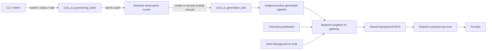

# Subject Practice Observation Backend-Owned Execution Architecture Assessment - 2026-08-10

## Document Status

- Decision: **Conditional GO**
- Risk: **Medium**
- Scope: Phase 1 architecture for controlled subject-practice observation
- Initial enablement target: math observation only
- Subjects considered: math, chemistry, physics
- Provider/key strategy: unchanged
- Student-facing practice flow: unchanged
- Human review workflow: not introduced
- Coordination: reviewed with task `019fd60f-a504-78b2-9afa-6b4b2f2179f4`

Post-MVP status: backend-owned observation execution is implemented as the current Phase 1 mechanism. The fixed no-provider quality baseline is `npm.cmd run csca-ai-questioning:subject-practice-fixed-eval`; it aggregates three-subject TaskFamily/Fingerprint fixtures, fixture-only QuestionPlan acceptance, and profile difficulty patch fixed eval without provider calls, observation submission, or DB writes. The TaskFamily/Fingerprint fixture pins chemistry/math/physics family visibility, subject-guard fallback, chemistry topic compatibility fallback, math/physics difficulty audit visibility, physics visual current-policy default isolation, and near-duplicate warning behavior. The stage-level no-provider acceptance entry is `npm.cmd run csca-ai-questioning:subject-practice-no-provider-acceptance`; it layers backend-owned observation task rules, read-only observation preflight, latest read-only observation evidence, and read-only rollout gate on top of fixed eval. This proves mechanism/readiness boundaries and now reads fresh live evidence when it exists; it does not submit observation tasks, does not call providers by itself, and exposes `completionAudit` plus `nextLiveValidation` for automation. The completion gate entry is `npm.cmd run csca-ai-questioning:subject-practice-completion-gate`, which wraps `--require-complete`. As of task `99ca1383-a27f-4478-ab9c-01c6f553e934` / question `#16338`, the bounded #156/#350 math observation MVP has one fresh Pro-backed `publishable` gate pass with scheduler adherence, one-job ownership, and reviewer/profile fixed-eval coverage; this does not prove broad math student-consumable quality across all cells.

This document records the current mechanism problem, the selected Phase 1 architecture, its real impact, mandatory safeguards, acceptance criteria, and the conditions that require a later distributed Phase 2.

## Executive Summary

The current math diversity observation can be starved indefinitely while chemistry occupies both configured background slots. This is not merely a slow-provider or insufficient-key problem. It is caused by split execution authority:

- Backend production uses an in-process background semaphore and in-process key pool.
- The math observation script creates a standalone gateway in a separate Node.js process.
- Those two processes do not share concurrency, per-key occupancy, cooldown, or round-robin state.
- The observation preflight can only wait for visible chemistry capacity; it cannot enter the same FIFO as chemistry and receive a fair turn.

Adding only a database-backed abstract capacity slot would not fully solve this. Separate processes could still select the same physical key because their key pools remain independent. Correct standalone execution would require cross-process per-key leases, fencing, cooldown, and selection state, which is a much larger change.

The recommended Phase 1 is therefore:

1. CLI/Admin submits and observes a durable observation task but never calls the provider directly.
2. The single backend process claims and executes the observation.
3. Observation reuses the backend singleton gateway, FIFO semaphore, and key pool.
4. `csca_ai_questioning_tasks` stores the durable orchestration command.
5. `csca_ai_generation_jobs` stores the unique generation side effect.
6. Production and observation selection are isolated, while cell occupancy counts both.

This is a bounded internal acceptance channel for the current single-backend deployment. It is not a general distributed admission system.

## Current Problem

### Observed Failure Mode

The math observation preflight repeatedly returned `wait_for_chemistry_capacity` while chemistry run #198 occupied both fresh background slots. After the same external capacity condition repeated for three goal turns, the main task correctly stopped as blocked. It did not crash.

Simply resuming the task without changing the mechanism would likely reproduce the same result.

### Root Cause

The background concurrency service and key pool are process-local:

- `AiGatewayConcurrencyService` uses in-memory FIFO semaphores.
- `AiGatewayKeyPoolService` stores current concurrency, cooldown, request windows, and round-robin state in an in-memory map.
- `csca-subject-practice-math-diversity-observation-run.cjs` creates `createStandaloneAiGatewayService()` in another process.

Therefore, the backend and observation script do not have one authoritative view of physical provider capacity.

### Why This Is a Mechanism Defect

The current preflight protects chemistry by refusing to run when both slots are occupied, but it has no fair admission path. New chemistry generation and review calls can continue to consume capacity while observation remains outside the queue. Protection has become starvation.

This does not mean the existing gateway is generally broken. Its in-process FIFO is adequate for callers inside one backend process. The defect is allowing an operational observation path to execute outside that authority while sharing the same keys.

## Options Considered

| Option | Result | Decision |
|---|---|---|
| Keep waiting for two free chemistry slots | Safe but can starve indefinitely | Reject |
| Change key count or concurrency | May improve throughput but does not fix split authority | Reject for this task |
| Add only a DB abstract pool-slot lease | Does not prevent two local key pools selecting the same key | Reject |
| Move observation execution into backend | Reuses one FIFO and one key pool; bounded scope | **Select for Phase 1** |
| Build distributed per-key leases now | Correct for multi-process execution but high blast radius | Defer to Phase 2 |
| Build a unified gateway worker now | Strong long-term design but larger than the current need | Defer to Phase 2 |

## Selected Phase 1 Architecture



### Control and Data Responsibilities

`csca_ai_questioning_tasks` is the control-plane command:

- Execute one scheduler observation.
- Track claim ownership, task heartbeat, cancellation request, and terminal summary.
- Do not represent every generation or reviewer provider call as a separate task.

`csca_ai_generation_jobs` is the side-effect record:

- Exactly one generation job per observation task.
- Carries `workClass=observation` and `observationTaskId`.
- Tracks generation/review lifecycle and job heartbeat.

The gateway remains the runtime physical-capacity authority:

- Background/global semaphore limits.
- Per-key concurrency.
- Cooldown and provider retry behavior.

### Dedicated Execution Path

Observation should use a dedicated private path such as `runSubjectPracticeObservationTask`.

It may reuse stable helpers for:

- Cell selection.
- Target profile construction.
- Retry feedback.
- Generation-job processing.
- Reviewer, validator, gate, and audit output.

It must not:

- Enter the ordinary `untilComplete` production loop.
- Change math run #156 to a normal running production state.
- Mutate production cell status, `blockedReason`, or `noProgress` as if observation were production replenishment.
- Enable math soft-cap.
- Create or recover unrelated math production runs.

## Mandatory Correctness Mechanisms

### 1. Feature Flags

All default to off:

- `SUBJECT_PRACTICE_OBSERVATION_TASK_ENABLED`
- `SUBJECT_PRACTICE_OBSERVATION_EXECUTION_ENABLED`
- `SUBJECT_PRACTICE_OBSERVATION_ONLY_MODE`

This permits submit/status deployment and no-provider tests before actual execution is enabled.

`SUBJECT_PRACTICE_OBSERVATION_ONLY_MODE=true` is for a temporary validation backend: it must prevent ordinary subject-practice production queue processing, generic stale-generation startup recovery, production lifecycle reconciliation, production runner startup/timer behavior, and predictive replenishment runner startup/timer behavior while leaving observation-owned execution available.

CLI submit/apply tooling must query backend observation readiness before creating a task. If readiness does not report `observationOnlyMode=true`, apply must refuse by default and require an explicit shared-backend override. Preflight should likewise report `ready_after_observation_only_backend_start` rather than `eligible_for_backend_owned_observation_submission` until it sees the isolated backend mode.

### 2. Atomic Task Claim

The existing generic task runner cannot be reused unchanged. Its active-task protection is primarily an in-process set, and its recovery query is not a complete cross-process atomic claim.

Observation needs a database transition equivalent to:

```text
queued -> running
```

performed atomically with a new execution owner and attempt token. At most one active observation task may exist globally in Phase 1.

### 3. Two-Layer Idempotency

Task-level idempotency:

- Only one queued/running observation task.
- Only one successful claim for the current execution attempt.

Effect-level idempotency:

- Generation-job metadata includes `observationTaskId`.
- A database uniqueness constraint guarantees at most one job for that task.
- Recovery first finds the existing job and never creates another merely because task result persistence was interrupted.

Recovery behavior:

| Existing job state | Recovery action |
|---|---|
| queued | Continue the same job |
| fresh running | Wait; do not duplicate |
| stale running | Use fenced stale recovery |
| terminal | Summarize into the task |
| missing | Create the unique job once |

### 4. Ownership, Fencing, and Heartbeat

Recommended explicit execution fields:

```text
executionOwnerId
executionAttemptToken
lastHeartbeatAt
cancelRequestedAt
```

Task heartbeat and generation-job heartbeat serve different purposes and should remain separate.

Heartbeat updates must be conditional:

```text
WHERE status = 'running'
  AND executionAttemptToken = <current token>
```

This prevents a recovered old process from continuing to present itself as the current owner.

For Phase 1, heartbeat is more important than gateway acquire/release callbacks. Callbacks can later add queue diagnostics such as `gatewayQueuedAt` and `gatewayAcquiredAt`, but they do not prove that a long provider or reviewer call is still alive.

The recommended heartbeat interval is 30-60 seconds. The stale threshold must account for:

- Semaphore wait.
- Key wait.
- Provider retries.
- Generation timeout.
- Reviewer queue and timeout.

### 5. Three-Layer Work Isolation

1. Ordinary production selectors may claim only `workClass=production` or compatible legacy jobs without `workClass`.
2. Observation runner claims the one job identified by `observationTaskId` plus its current execution token.
3. Cell active/occupied calculations still include observation jobs.

This asymmetry is intentional: production cannot execute the observation job, but it must see the cell as occupied to prevent duplicate same-cell generation.

Selector, claim, recovery, and occupancy predicates should be centralized in shared helpers. Scattering JSON conditions across SQL queries creates a high regression risk.

### 6. Cooldown and Cancellation

- Only one observation may be active.
- Add a global minimum interval and a per-subject cooldown.
- Repeated manual clicks must not keep production permanently limited to one slot.
- Queued tasks may be cancelled immediately.
- Running tasks are marked `cancel_requested` and stop at the next provider boundary.
- Phase 1 must not attempt to forcibly terminate an active provider request.

### 7. Delivery Evidence Isolation

The following remain delivery evidence:

- `gateway_concurrency_timeout`
- Capacity wait
- Provider timeout
- Empty output
- Schema-invalid output
- Key cooldown

They must not update task-family quality memory, diversity rejection memory, or difficulty-quality evidence as if the model had produced a bad candidate.

## Data Changes

### Task Table

The current `csca_ai_questioning_tasks` table is semantically suitable because it already models generic typed orchestration tasks. Reuse is reasonable if observation has:

- A dedicated `taskType` and action.
- A versioned payload/result schema.
- Explicit execution ownership fields.
- A dedicated handler registration.

Recommended additive migration:

- Execution owner column.
- Execution attempt token column.
- Last heartbeat column.
- Cancellation-request timestamp.
- Partial unique index for active observation task rows.

Do not store all correctness-critical ownership data only in `result` JSON.

### Generation Job

Required metadata:

```json
{
  "workClass": "observation",
  "observationTaskId": "<uuid>",
  "executionOwnerId": "<worker-id>",
  "executionAttemptToken": "<token>"
}
```

Recommended additive unique index:

- Unique `prompt_metadata->>'observationTaskId'` when nonempty.

An advisory transaction lock may supplement submit/claim operations, but it should not be the only invariant. Every future writer would otherwise need to remember the same advisory-lock convention.

## Impact Assessment

### Chemistry Production

Observation does not interrupt already running chemistry requests and does not increase background concurrency above two.

It is not zero-impact. While math generation or review holds one background slot, chemistry can use at most the remaining slot. Local chemistry throughput can therefore approach a 50% reduction during those provider calls.

The impact is bounded because:

- One observation means one generation job.
- Generation and reviewer acquire the FIFO separately rather than reserving a slot continuously.
- Global and subject cooldown prevent repeated observations.
- Chemistry resumes normal capacity after observation completes.

### Other Background AI Work

Question review, repair, topic mapping, translation, and other background gateway callers may also wait longer. Monitoring must cover all background `workClass` values, not only chemistry.

Do not hide sustained queue pressure by indefinitely increasing queue timeout.

### Realtime Work

Realtime normally uses a separate pool. With the current intended relationship:

```text
global = 5
realtime = 3
background = 2
```

observation should not directly displace realtime requests. Readiness must reject invalid future configurations where realtime plus background exceeds global capacity or where child-pool accounting bypasses the global limit.

### Production Run and Cell State

- Math #156 remains production-disabled.
- Math soft-cap remains false.
- Observation does not create or restore unrelated math runs.
- Observation does not alter production completion or blocked-state accounting.
- The selected cell is still treated as occupied for duplicate-prevention purposes.

### Student Experience

There is no change to student request paths. Student requests do not synchronously generate questions. If the eligible pool is exhausted, the existing replenishing state remains the product response.

### Quality Governance

The formal automatic path remains:

```text
generation -> reviewer/validator -> gate -> approved/published
```

This architecture does not add a human-review requirement. Observation and audit evidence are internal acceptance and calibration evidence only.

### Operational and Deployment Impact

Current production compose declares one backend service, so the design matches the documented current deployment. However, singleton execution must be an explicit runtime condition, not an undocumented assumption.

Rolling or hot restart can briefly produce two backend processes with separate in-memory key pools. Phase 1 therefore requires one of:

- Controlled non-overlapping restart.
- Drain old worker before starting observation execution in the new worker.
- Runtime worker lease/heartbeat that prevents a second observation runner from enabling while the previous owner is fresh.

Database task claim prevents duplicate observation ownership but does not make ordinary chemistry key usage safe across multiple backend replicas. That remains a Phase 2 boundary.

## Risks

### Highest-Risk Regression 1: Crash Window

The process crashes after creating a generation job but before persisting task result. Recovery creates a second job or repeats the provider effect.

Mitigation:

- Database uniqueness by `observationTaskId`.
- Recovery always looks up the existing job first.
- Terminal job result can reconstruct terminal task result.

### Highest-Risk Regression 2: Selector and Occupancy Asymmetry

Ordinary runner correctly excludes observation jobs, but occupancy also excludes them. Production then creates a second active job for the same cell.

Mitigation:

- Central work-class helpers.
- Separate tests for claim eligibility and occupancy visibility.
- Database audit asserting no cell has two fresh active jobs.

### Highest-Risk Regression 3: Restart and Fencing

Old and new processes execute the same task or independently select the same key during a rolling restart.

Mitigation:

- Owner/token-fenced heartbeat.
- Fresh-owner recovery guard.
- Controlled singleton rollout.
- Execution flag remains off if singleton cannot be guaranteed.

### Additional Risks

- Observation task changes #156 production state and triggers ordinary dispatch.
- Repeated observations reverse-starve chemistry or other background work.
- Legal queue/provider duration exceeds stale threshold and creates duplicate recovery.
- Delivery failures pollute family quality memory.
- Background queue pressure causes unexpected reviewer or translation timeouts.
- Task-table semantics become overloaded if provider calls are modeled as tasks individually.

## Phase 1 Implementation Boundary

### Must Implement

- Backend-owned observation execution.
- Standalone observation apply prohibited from calling provider.
- Dual feature flags default off.
- Atomic task claim.
- One active observation maximum.
- Unique observation generation job.
- Dedicated execution handler.
- Work-class isolation plus occupancy inclusion.
- Owner/token fencing.
- Independent task and job heartbeat.
- Immediate kick plus timer recovery.
- Global and subject cooldown.
- Boundary cancellation.
- Delivery/quality evidence isolation.
- Queue wait and timeout observability.
- Readiness capacity validation.
- Recovery and restart tests.

### Explicitly Defer

- Generic priority and aging engine.
- Enabling all three subjects by default.
- Multiple concurrent observations.
- DB-backed abstract pool slots.
- Cross-process per-key leases and shared cooldown.
- Unified gateway worker.
- Forced interruption of provider requests.
- Full acquire/release callback framework.
- A new generic admission table.

## Test and Acceptance Plan

### No-Provider Tests

- Submit/status works with execution disabled.
- Active-task unique constraint rejects duplicate submit races.
- Atomic claim permits one owner only.
- Wrong execution token cannot heartbeat, complete, or cancel another attempt.
- Recovery links to the existing generation job.
- Crash after job creation does not create a second job.
- Queued cancellation is terminal and provider-free.
- CLI apply refuses a non-observation-only backend unless an explicit shared-backend override is passed.
- Read-only preflight distinguishes mechanism readiness from submission readiness: no `eligible_for_backend_owned_observation_submission` without `observationOnlyMode=true`.

### Fake Gateway Tests

- Background concurrency never exceeds two.
- Per-key concurrency never exceeds one.
- Observation entering FIFO cannot be jumped by later chemistry calls.
- Existing chemistry calls are not interrupted.
- Generation and review release/reacquire capacity normally.
- Queue timeout becomes delivery evidence only.
- Realtime remains within its pool and global limit.

### Selector and State Tests

- Ordinary production cannot claim observation jobs.
- Observation runner can claim only its task-owned job.
- Cell occupancy includes observation jobs.
- Math #156 remains `subject_auto_production_disabled`.
- Math soft-cap remains false.
- No unrelated math run is created or recovered.
- Provider failure does not update family-quality memory.

### Restart Tests

- Fresh heartbeat prevents duplicate recovery.
- Stale fenced owner cannot update after a new token is issued.
- Terminal job reconstructs task result after restart.
- Execution flag off prevents new claims while allowing the current provider boundary to drain.

### Production Acceptance Metrics

- Active observation tasks: `<= 1`.
- Generation jobs per observation task: exactly `1`.
- Total background concurrency: `<= 2`.
- Per-key concurrency: `<= 1`.
- Chemistry running-request cancellations caused by observation: `0`.
- Chemistry capacity returns after observation completion.
- Same-cell fresh active jobs: `<= 1`.
- Math #156 state unchanged.
- Math soft-cap remains false.
- No unexpected #158/#159 mutation.
- Delivery failure family-memory increment: `0`.
- Realtime latency/error rate shows no material regression.
- Queue wait and timeout are visible by background work class.

## Rollout and Rollback

### Rollout

1. Ship schema, submit, and status behavior with both flags off.
2. Enable task submission only; run no-provider claim/recovery tests.
3. Validate FIFO and concurrency with a fake gateway.
4. Validate one observation in staging.
5. Confirm singleton deployment and restart procedure.
6. Enable execution for one math #156 observation.
7. Verify all production acceptance metrics before allowing another observation.

### Rollback

- Turn off `SUBJECT_PRACTICE_OBSERVATION_EXECUTION_ENABLED`.
- Turn off `SUBJECT_PRACTICE_OBSERVATION_ONLY_MODE` if the process should resume ordinary production/predictive runner behavior.
- Stop claiming queued observation tasks.
- Let a running provider call finish to its next boundary.
- Do not forcibly kill the provider request.
- Keep ordinary production independent of the observation feature.
- Keep standalone provider apply prohibited.

## Phase 2 Triggers

Any of the following invalidates the Phase 1 single-process correctness boundary:

- Backend replica count becomes greater than one.
- Rolling restart requires sustained overlapping backend workers.
- CLI, Codex/AI agents, or another service must call the gateway directly.
- Multiple workers share the same physical key set.
- Observations become frequent, multi-subject, or concurrent.
- Explicit SLA, priority, reservation, or anti-starvation policy is required.
- FIFO queue timeout remains frequent after bounded observation rollout.
- Key concurrency, cooldown, quota, or round-robin must be globally consistent.

Preferred Phase 2 direction:

1. A unified gateway worker/queue owns physical provider calls.
2. All products and agents submit durable work instead of selecting keys directly.
3. If distributed direct provider access remains necessary, implement database-backed per-key leases, fencing tokens, and shared cooldown/quota state.

An abstract pool-slot lease without physical per-key coordination is not sufficient.

## Three-Subject Reuse Boundary

The mechanism can later support math, chemistry, and physics because task ownership, work-class isolation, idempotency, and capacity admission are subject-neutral.

Subject policy remains isolated:

- Math observation uses math family, difficulty, and answer-validity rules.
- Chemistry observation uses chemistry family and validator policy.
- Physics observation requires its own family and representation coverage before enablement.

Phase 1 should enable only math. Reuse for chemistry or physics requires separate subject acceptance and must not be inferred from the mechanism being generic.

## Effort Estimate

This is a medium engineering change, not a small conditional branch.

Indicative effort:

- Schema, task lifecycle, and atomic claim: 1-2 engineering days.
- Dedicated observation handler and selector isolation: 2-3 engineering days.
- Heartbeat, recovery, cancellation, and observability: 1-2 engineering days.
- Tests, staging, and one-job production acceptance: 1-2 engineering days.

Total expected effort: approximately **5-9 engineering days**, depending on how much existing production selection SQL must be centralized to make isolation reliable.

## Final Decision

Proceed with Phase 1 only when every mandatory correctness mechanism is included. The implementation is a **NO-GO** if any of the following remains true:

- Standalone observation can still call provider.
- Observation job uniqueness is not database-enforced.
- Task claim is only process-local.
- Ordinary production or recovery can claim observation-owned jobs.
- Cell occupancy ignores observation jobs.
- Heartbeat is not execution-token fenced.
- Math #156 or soft-cap is temporarily enabled to run observation.
- Singleton execution cannot be guaranteed.
- Legal queue/provider wait can be mistaken for stale execution and duplicated.
- Background/global capacity relationships are not validated.

With these safeguards, Phase 1 is a reasonable, bounded fix for the current mechanism defect. Without them, resuming the observation task would hide the starvation symptom while retaining duplicate-execution and key-concurrency risks.
